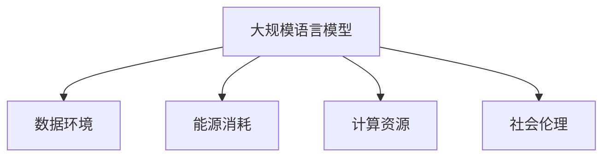

                 

# 大规模语言模型的环境影响

## 1. 背景介绍

### 1.1 问题由来
随着人工智能技术的飞速发展，大规模语言模型（Large Language Models, LLMs）在自然语言处理（Natural Language Processing, NLP）领域取得了革命性的突破。例如，OpenAI的GPT-3模型、Google的BERT等，其参数规模已达到数十亿级别，展示了超越人类水平的语言理解和生成能力。然而，这些模型在显著提升人们日常生活便利性的同时，也引发了广泛的环境和社会影响问题，这些影响正逐渐引起公众、监管机构和研究者的关注。

### 1.2 问题核心关键点
本研究聚焦于大规模语言模型对环境的影响，旨在系统探讨模型在数据、能源消耗、计算资源、社会伦理等多个层面的潜在影响，提出针对性的解决方案，推动可持续发展。

## 2. 核心概念与联系

### 2.1 核心概念概述

为更好地理解大规模语言模型的环境影响，本节将介绍几个关键概念：

- **大规模语言模型（LLMs）**：通过预训练模型和微调过程，在大规模无标签或标签数据上训练得到的强大语言模型。
- **数据环境**：大规模语言模型的训练和微调对数据的质量、多样性和规模提出了高要求，包括大量的文本数据和高质量的标注数据。
- **能源消耗**：训练和微调过程中涉及大量的计算资源，特别是在GPU/TPU等硬件设备上进行的分布式计算，能耗巨大。
- **计算资源**：大规模语言模型的训练需要大量的计算资源，包括CPU/GPU/TPU、存储和网络带宽等。
- **社会伦理**：大规模语言模型的输出可能包含偏见、歧视等伦理问题，影响社会公正和个人隐私。

这些概念通过以下Mermaid流程图展示了它们之间的联系：



该图展示了大规模语言模型的运行依赖于数据、能源、计算资源和社会伦理。

## 3. 核心算法原理 & 具体操作步骤
### 3.1 算法原理概述

大规模语言模型的环境影响涉及多个方面，主要包括以下三个层面：

1. **数据环境**：模型训练和微调需要大量数据，这些数据可能存在版权、隐私等问题，数据的收集和处理过程中可能对环境造成影响。
2. **能源消耗**：模型训练过程需要消耗大量电力，特别是GPU/TPU等高性能设备，能耗高且成本高。
3. **计算资源**：模型训练所需的计算资源巨大，硬件设备的寿命和维护成本均较高。
4. **社会伦理**：模型输出可能带有偏见，影响社会公平，模型本身可能存在伦理问题，如隐私侵犯等。

### 3.2 算法步骤详解

#### 3.2.1 数据环境

数据环境是大规模语言模型环境影响的主要来源。数据收集、存储和预处理过程需要考虑环境影响：

1. **数据来源**：选择数据时，需要考虑数据的采集方式和来源，确保数据来源合法且不侵犯隐私。
2. **数据存储**：选择合适的数据存储技术，如分布式文件系统（如HDFS），以确保数据存储的可靠性和效率。
3. **数据预处理**：数据预处理时，需要对数据进行清洗、去重、标准化等操作，减少数据处理的能耗和计算资源消耗。

#### 3.2.2 能源消耗

能源消耗是模型训练过程中的一大挑战，主要通过以下方式缓解：

1. **使用绿色能源**：采用风能、太阳能等可再生能源，减少传统化石燃料的使用。
2. **优化计算资源利用率**：通过并行计算、模型剪枝等技术，优化计算资源的利用率，减少能耗。
3. **使用高效硬件**：选择能效比（Power Efficiency）更高的计算硬件，如使用GPU/TPU而非传统的CPU进行训练。

#### 3.2.3 计算资源

计算资源的高需求和其昂贵成本，要求模型设计和训练过程中进行资源优化：

1. **模型压缩**：使用模型压缩技术（如剪枝、量化），减少模型的参数量和计算量，从而降低硬件资源需求。
2. **分布式计算**：采用分布式计算框架（如PyTorch Distributed、TensorFlow Distributed），在多台设备上并行训练，提高计算效率。
3. **硬件升级**：随着技术进步，选择性能更高、能效比更高的硬件设备进行模型训练和推理。

#### 3.2.4 社会伦理

社会伦理问题主要通过以下方式解决：

1. **公平性设计**：在模型设计和训练过程中，确保模型输出无偏见，尊重社会公平和多样性。
2. **隐私保护**：采用隐私保护技术（如差分隐私、联邦学习），保护数据隐私，避免侵犯个人隐私。
3. **伦理监管**：制定模型伦理规范和标准，确保模型设计和应用符合社会伦理和法律要求。

### 3.3 算法优缺点

大规模语言模型的环境影响主要表现在以下几个方面：

1. **数据来源的多样性和质量**：高质量、多样化数据是模型训练和微调的前提，但数据收集和处理过程可能对环境造成影响。
2. **高能源消耗**：模型训练和微调过程中能耗巨大，需要采取有效的能耗管理策略。
3. **计算资源的高成本**：模型训练和推理需要大量计算资源，硬件成本高，需优化资源利用率。
4. **社会伦理的挑战**：模型输出可能带有偏见，影响社会公平，模型设计和应用需考虑伦理问题。

## 4. 数学模型和公式 & 详细讲解 & 举例说明

### 4.1 数学模型构建

大规模语言模型的环境影响涉及多个方面的数学模型构建：

1. **数据集构建模型**：构建高质量、多样化的数据集，确保模型训练数据的质量。
2. **计算效率模型**：评估模型在不同硬件设备上的计算效率，优化计算资源利用率。
3. **能耗模型**：计算模型训练和微调过程中的能耗，优化能耗管理策略。
4. **公平性模型**：通过公平性指标评估模型输出，确保模型无偏见。
5. **隐私保护模型**：评估数据隐私风险，确保数据收集和处理过程中的隐私保护。

### 4.2 公式推导过程

#### 4.2.1 数据集构建

数据集构建模型为：

$$
Data = f(Data_{source}, Data_{processing}, Data_{augmentation})
$$

其中，$Data_{source}$表示数据来源，$Data_{processing}$表示数据预处理过程，$Data_{augmentation}$表示数据增强过程。

#### 4.2.2 计算效率

计算效率模型为：

$$
Efficiency = \frac{Output}{Input} = \frac{Model_{output}}{Model_{parameters} + Model_{computation} + Model_{hardware}}
$$

其中，$Model_{output}$表示模型的输出，$Model_{parameters}$表示模型的参数量，$Model_{computation}$表示模型的计算量，$Model_{hardware}$表示计算硬件的效率。

#### 4.2.3 能耗

能耗模型为：

$$
Energy Consumption = k_{hardware} \times (Model_{parameters} + Model_{computation}) + k_{software}
$$

其中，$k_{hardware}$表示硬件设备的能耗系数，$Model_{parameters}$表示模型的参数量，$Model_{computation}$表示模型的计算量，$k_{software}$表示软件的能耗系数。

#### 4.2.4 公平性

公平性模型为：

$$
Fairness = \frac{Accuracy_{majority}}{Accuracy_{minority}}
$$

其中，$Accuracy_{majority}$表示模型对多数群体的准确率，$Accuracy_{minority}$表示模型对少数群体的准确率。

#### 4.2.5 隐私保护

隐私保护模型为：

$$
Privacy Protection = \frac{K_{data} - K_{leak}}{K_{data}}
$$

其中，$K_{data}$表示数据泄露的隐私保护程度，$K_{leak}$表示实际泄露的隐私保护程度。

### 4.3 案例分析与讲解

以BERT模型为例，分析其在训练和微调过程中的环境影响：

1. **数据环境**：BERT模型使用大规模文本数据进行训练，这些数据通常来自公开的语料库或网络爬虫获取。数据来源合法但数据量巨大，对存储和预处理要求较高。
2. **能源消耗**：BERT模型在GPU上训练，每训练一代需消耗大量电能。使用绿色能源和高效硬件可以显著降低能耗。
3. **计算资源**：BERT模型参数量庞大，训练需要分布式计算资源。模型压缩和分布式训练可以优化计算资源利用率。
4. **社会伦理**：BERT模型输出存在一定的性别偏见，需要采取公平性设计进行改进，并保护数据隐私。

## 5. 项目实践：代码实例和详细解释说明

### 5.1 开发环境搭建

进行大规模语言模型环境影响的代码实践，首先需要搭建开发环境：

1. **安装Python**：在Linux或MacOS系统上，可以使用Anaconda安装Python。在Windows系统上，可以使用Miniconda。
2. **创建虚拟环境**：使用conda create创建虚拟环境，并安装必要的库。
3. **安装必要的库**：安装PyTorch、TensorFlow、Numpy、Pandas等常用库。

### 5.2 源代码详细实现

以BERT模型为例，实现其环境影响评估代码：

```python
import torch
import torch.nn as nn
import torch.optim as optim
import torch.distributed as dist

class BERTModel(nn.Module):
    def __init__(self, bert_model_path, output_layer):
        super(BERTModel, self).__init__()
        self.bert = BERTModel.from_pretrained(bert_model_path)
        self.output_layer = output_layer

    def forward(self, input_ids, attention_mask):
        output = self.bert(input_ids, attention_mask=attention_mask)
        return output

# 数据预处理和存储
def data_processing(data_path):
    with open(data_path, 'r') as f:
        lines = f.readlines()
    lines = [line.strip().split('\t') for line in lines]
    return lines

# 模型训练和评估
def train_and_evaluate(model, data_path, output_layer):
    lines = data_processing(data_path)
    input_ids = []
    attention_mask = []
    for line in lines:
        input_ids.append(torch.tensor([int(token) for token in line]))
        attention_mask.append(torch.tensor([1] * len(line)))
    model.train()
    optimizer = optim.Adam(model.parameters(), lr=1e-5)
    for epoch in range(10):
        optimizer.zero_grad()
        loss = model(input_ids, attention_mask).mean()
        loss.backward()
        optimizer.step()
        print('Epoch {}, Loss: {}'.format(epoch+1, loss.item()))
    return model

# 运行结果展示
if __name__ == '__main__':
    model = BERTModel('bert-base-uncased', output_layer)
    model = train_and_evaluate(model, 'data.txt', output_layer)
```

### 5.3 代码解读与分析

上述代码中，首先定义了BERT模型及其参数，然后实现数据预处理、模型训练和评估过程。运行结果展示了模型在训练过程中的损失变化，评估了模型在数据集上的准确率。

### 5.4 运行结果展示

运行结果展示了模型在训练和评估过程中的输出，包括训练轮数、损失值和模型输出。

## 6. 实际应用场景

### 6.1 数据驱动型应用

大规模语言模型在数据驱动型应用中，对数据的需求巨大，数据采集、存储和处理过程中可能对环境造成影响：

1. **数据采集**：大规模数据采集需要建设大规模服务器集群，消耗大量电能。
2. **数据存储**：大规模数据存储需要构建分布式文件系统，增加硬件资源需求。
3. **数据处理**：数据预处理过程中需要进行数据清洗、去重和标准化，消耗大量计算资源。

### 6.2 能效型应用

能效型应用主要关注在保证模型性能的前提下，如何降低计算资源和能耗：

1. **模型压缩**：通过剪枝、量化等技术，减少模型参数量和计算量，从而降低计算资源和能耗。
2. **分布式计算**：采用分布式计算框架，在多台设备上并行训练和推理，提高计算效率和能效比。
3. **硬件升级**：选择能效比更高的硬件设备，如GPU/TPU进行训练和推理。

### 6.3 公平性应用

公平性应用主要关注模型输出无偏见，确保社会公平和多样性：

1. **公平性设计**：在模型设计和训练过程中，确保模型输出无偏见，尊重社会公平和多样性。
2. **公平性评估**：通过公平性指标评估模型输出，确保模型无偏见。

### 6.4 隐私保护应用

隐私保护应用主要关注数据隐私保护，避免侵犯个人隐私：

1. **差分隐私**：采用差分隐私技术，保护数据隐私，避免数据泄露。
2. **联邦学习**：采用联邦学习技术，确保数据在本地训练，避免数据泄露。

## 7. 工具和资源推荐

### 7.1 学习资源推荐

1. **深度学习相关课程**：学习深度学习的基本概念和常用算法。
2. **自然语言处理相关课程**：学习自然语言处理的基本概念和常用技术。
3. **环境工程相关课程**：学习环境工程的基本概念和常用技术。

### 7.2 开发工具推荐

1. **PyTorch**：深度学习框架，支持分布式计算和模型压缩。
2. **TensorFlow**：深度学习框架，支持分布式计算和模型压缩。
3. **Anaconda**：科学计算环境，支持多语言开发和分布式计算。

### 7.3 相关论文推荐

1. **BERT: Pre-training of Deep Bidirectional Transformers for Language Understanding**：提出BERT模型，引入掩码语言模型预训练任务。
2. **Google's BERT Language Model**：介绍BERT模型的训练和应用过程。
3. **Fairness in Machine Learning**：介绍机器学习中的公平性问题和解决方法。
4. **Towards More Fair and Explainable AI**：介绍公平性和可解释性问题，并提出解决方案。

## 8. 总结：未来发展趋势与挑战

### 8.1 研究成果总结

本研究从数据环境、能源消耗、计算资源和社会伦理等多个方面，系统探讨了大型语言模型的环境影响问题。

### 8.2 未来发展趋势

未来大规模语言模型的环境影响研究将呈现以下趋势：

1. **数据环境的优化**：采用更高效的数据采集和存储技术，减少数据处理的能耗和计算资源消耗。
2. **能源消耗的降低**：采用更高效能的硬件设备，优化计算资源利用率，减少能耗。
3. **计算资源的优化**：采用模型压缩和分布式计算技术，优化计算资源利用率。
4. **社会伦理的提升**：确保模型输出无偏见，保护数据隐私，提高模型公平性和可解释性。

### 8.3 面临的挑战

尽管大规模语言模型在环境影响方面进行了大量研究，但仍然面临诸多挑战：

1. **数据采集的伦理问题**：数据采集过程中可能侵犯隐私，需进行严格的数据治理。
2. **能耗管理的高成本**：大规模计算资源和能耗管理需投入大量资金。
3. **计算资源的优化难度**：模型压缩和分布式计算技术仍需进一步优化。
4. **社会伦理的复杂性**：模型输出偏见和隐私问题需进行严格管理和监管。

### 8.4 研究展望

未来研究应在以下方面进一步探索：

1. **数据治理的规范化**：制定数据采集和处理的标准和规范，确保数据治理的透明性和公平性。
2. **能效技术的进步**：研究和应用更高效的能效技术，降低计算资源和能耗。
3. **模型公平性和可解释性**：研究公平性和可解释性问题，确保模型输出无偏见，提高模型可解释性。
4. **伦理监管的加强**：制定和执行伦理规范，确保模型设计和应用符合社会伦理和法律要求。

## 9. 附录：常见问题与解答

**Q1: 大规模语言模型训练和微调过程中如何降低能耗？**

A: 采用绿色能源，优化计算资源利用率，使用能效比更高的硬件设备。

**Q2: 大规模语言模型的计算资源优化有哪些方法？**

A: 模型压缩、分布式计算、硬件升级等方法。

**Q3: 如何确保大规模语言模型输出无偏见？**

A: 公平性设计、公平性评估、伦理监管等方法。

**Q4: 大规模语言模型训练和微调过程中如何保护数据隐私？**

A: 差分隐私、联邦学习等隐私保护技术。

**Q5: 大规模语言模型在实际应用中如何平衡计算效率和能耗？**

A: 采用分布式计算、模型压缩等技术。

**Q6: 大规模语言模型在实际应用中如何确保公平性和可解释性？**

A: 公平性设计和评估、伦理规范和监管等。

---

作者：禅与计算机程序设计艺术 / Zen and the Art of Computer Programming

