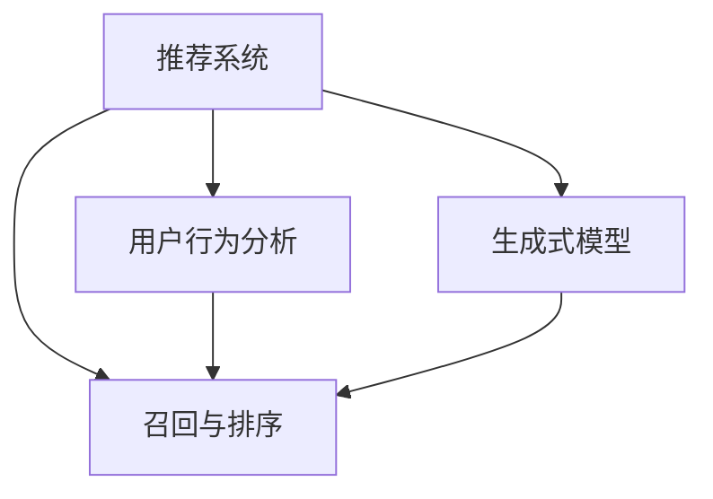

                 

# 大规模预训练语言模型在推荐中的应用价值

> 关键词：大规模预训练语言模型,推荐系统,自然语言处理(NLP),用户行为分析,个性化推荐,内容推荐,生成式模型,Transformer

## 1. 背景介绍

### 1.1 问题由来
推荐系统作为互联网时代的重要基础设施，在电商、社交、视频、音乐等多个领域得到了广泛应用。然而，随着用户需求日益个性化、复杂化，传统推荐系统面临着数据稀疏性、冷启动、动态性等诸多挑战。如何构建更加精准、灵活的推荐系统，成为当下业界和学术界研究的热点。

近年来，大规模预训练语言模型（Large Pre-trained Language Models, LPLMs）在自然语言处理（Natural Language Processing, NLP）领域的兴起，为推荐系统带来了新的思路。通过在大规模文本数据上进行预训练，LPLMs可以学习到丰富的语言知识，能够自然地理解和生成自然语言文本，成为推荐系统构建的重要工具。

### 1.2 问题核心关键点
本节将重点介绍以下几个关键问题：
1. 为什么推荐系统需要引入大规模预训练语言模型？
2. 如何在大规模预训练语言模型上进行推荐系统的设计和优化？
3. 推荐系统在引入大规模预训练语言模型后，有哪些新的技术突破和应用价值？

## 2. 核心概念与联系

### 2.1 核心概念概述

为更好地理解大规模预训练语言模型在推荐系统中的应用价值，本节将介绍几个密切相关的核心概念：

- 推荐系统（Recommendation System）：基于用户行为数据或内容特征，为用户推荐符合其兴趣的产品或内容的系统。推荐系统按推荐方式分为基于协同过滤、基于内容、基于混合等，按推荐时间分为静态和动态推荐。

- 大规模预训练语言模型（Large Pre-trained Language Models, LPLMs）：以自回归（如GPT）或自编码（如BERT）模型为代表的大规模预训练语言模型。通过在大规模无标签文本语料上进行预训练，学习通用的语言表示，具备强大的语言理解和生成能力。

- 用户行为分析（User Behavior Analysis）：通过分析用户的浏览、点击、评论等行为数据，构建用户兴趣模型，实现个性化推荐。用户行为分析涉及数据收集、特征工程、模型训练等环节。

- 生成式模型（Generative Model）：能够生成符合特定分布的数据的模型，如GAN、VAE、LSTM等。生成式模型在推荐系统中可以用于生成个性化的推荐文本。

- 召回与排序（Recall & Ranking）：推荐系统中的关键技术。召回负责在候选库中寻找符合用户兴趣的物品，排序负责对这些物品进行排序，并返回给用户。

- 召回率（Recall）：召回出的相关物品数占总相关物品数的比例。召回率反映了推荐系统的全面性。

- 准确率（Precision）：召回出的相关物品数占推荐物品总数的比例。准确率反映了推荐系统的准确性。

这些核心概念之间的逻辑关系可以通过以下Mermaid流程图来展示：



这个流程图展示了大规模预训练语言模型在推荐系统中的应用场景：

1. 推荐系统通过用户行为分析，构建用户兴趣模型。
2. 生成式模型利用预训练语言模型生成推荐文本。
3. 召回与排序技术用于从候选库中筛选和排序推荐物品。

## 3. 核心算法原理 & 具体操作步骤
### 3.1 算法原理概述

在大规模预训练语言模型上进行推荐系统的设计与优化，其核心思想是通过预训练模型的语言表示能力，提升推荐系统的全面性和准确性。具体而言，可以采用以下几种方式：

1. **用户画像生成**：将用户行为数据作为预训练语言模型的输入，生成用户画像，刻画用户的兴趣、需求和行为偏好。
2. **物品表示学习**：将物品描述作为预训练语言模型的输入，生成物品的语义表示，用于匹配用户兴趣。
3. **生成式推荐**：利用预训练语言模型的生成能力，根据用户画像和物品表示，生成个性化推荐文本或摘要，提升推荐内容的吸引力。
4. **推荐排序**：将预训练语言模型生成的用户画像和物品表示，输入到排序模型中，进行物品排序，提高推荐效果。

### 3.2 算法步骤详解

基于大规模预训练语言模型的推荐系统，一般包括以下几个关键步骤：

**Step 1: 准备预训练模型和数据集**
- 选择合适的预训练语言模型（如BERT、GPT等）作为初始化参数。
- 准备推荐系统所需的用户行为数据和物品描述数据，划分为训练集、验证集和测试集。

**Step 2: 用户画像生成**
- 将用户行为数据作为预训练模型的输入，生成用户画像。
- 用户画像可以包括用户的基本信息、浏览历史、点击记录等。
- 用户画像的表示可以采用用户画像向量（User Embedding）的方式，通常是一个低维向量。

**Step 3: 物品表示学习**
- 将物品描述数据作为预训练模型的输入，生成物品的语义表示。
- 物品表示可以采用物品向量（Item Embedding）的方式，通常也是一个低维向量。
- 物品向量可以用于物品之间的相似度计算，以及与用户画像的匹配。

**Step 4: 生成式推荐**
- 将用户画像和物品表示作为预训练模型的输入，生成推荐文本或摘要。
- 推荐文本可以包括物品名称、描述、价格等信息。
- 推荐摘要可以是对物品特征的简洁描述。

**Step 5: 推荐排序**
- 将用户画像和物品表示输入到排序模型中，计算物品的相关性得分。
- 排序模型可以使用如MLP、RNN、CNN等传统机器学习模型，也可以采用Transformer等深度学习模型。
- 排序模型的输出通常是一个向量，用于表示物品的相关性得分。

**Step 6: 输出推荐结果**
- 根据排序模型输出的相关性得分，对物品进行排序。
- 排序结果可以返回给用户，也可以用于模型的进一步优化。

### 3.3 算法优缺点

基于大规模预训练语言模型的推荐系统，具有以下优点：
1. 用户画像丰富：预训练语言模型能够自动捕捉用户行为背后的语言特征，生成高质量的用户画像。
2. 物品表示多样：通过预训练语言模型学习物品的语义表示，提升了物品匹配的准确性。
3. 生成式推荐自然：利用预训练语言模型的生成能力，生成推荐文本或摘要，增强推荐内容的吸引力。
4. 排序模型灵活：结合预训练语言模型生成的用户画像和物品表示，优化推荐排序算法，提高推荐效果。

同时，该方法也存在一定的局限性：
1. 数据需求较高：用户行为数据和物品描述数据需要具备一定的规模和质量，以支撑预训练模型的学习。
2. 计算资源消耗：大规模预训练语言模型和生成式推荐模型需要较大的计算资源，特别是对于实时推荐场景，计算延时可能成为瓶颈。
3. 模型复杂性高：预训练语言模型和生成式模型往往较为复杂，难以进行快速调优和部署。
4. 鲁棒性不足：预训练语言模型容易受到数据噪声和分布偏差的影响，推荐效果可能不如传统推荐系统稳定。

尽管存在这些局限性，但大规模预训练语言模型在推荐系统中的应用，仍具有显著的优势和广泛的应用前景。

### 3.4 算法应用领域

大规模预训练语言模型在推荐系统中的应用领域非常广泛，包括但不限于以下几个方面：

1. **电商推荐**：电商平台可以利用用户行为数据和物品描述数据，构建推荐系统，提升用户购物体验和转化率。
2. **内容推荐**：视频、音乐、新闻等平台可以借助用户行为数据和内容描述数据，构建推荐系统，优化内容推荐效果。
3. **智能客服**：智能客服系统可以利用用户交互记录，构建推荐系统，提升客服效率和用户满意度。
4. **个性化营销**：营销平台可以基于用户行为数据和营销内容数据，构建推荐系统，实现精准营销和个性化推荐。
5. **广告定向**：广告平台可以利用用户行为数据和广告内容数据，构建推荐系统，提高广告投放效果和广告收益。

## 4. 数学模型和公式 & 详细讲解 & 举例说明

### 4.1 数学模型构建

本节将使用数学语言对基于大规模预训练语言模型的推荐系统进行更加严格的刻画。

记推荐系统为 $R$，用户画像向量为 $\vec{u}$，物品向量为 $\vec{i}$，用户画像与物品的相关性得分为 $s(\vec{u}, \vec{i})$，排序模型的输出为 $\vec{r} = [r_1, r_2, ..., r_n]$，推荐结果为用户从排序结果中选取的 $k$ 个物品。

推荐系统的目标是最小化损失函数 $L$，即：

$$
L = \frac{1}{N}\sum_{i=1}^{N} \ell(R_{pred}(x_i), R_{true}(x_i))
$$

其中 $N$ 为样本数，$x_i$ 为第 $i$ 个样本，$R_{pred}(x_i)$ 为推荐系统预测的结果，$R_{true}(x_i)$ 为实际结果。

推荐系统常用的损失函数包括均方误差损失（MSE）和交叉熵损失（Cross-Entropy Loss）。均方误差损失函数定义为：

$$
L_{MSE} = \frac{1}{N}\sum_{i=1}^{N} \sum_{k=1}^{K} (y_{ik} - R_{pred}(x_i))^2
$$

交叉熵损失函数定义为：

$$
L_{CE} = \frac{1}{N}\sum_{i=1}^{N} \sum_{k=1}^{K} y_{ik} \log R_{pred}(x_i)
$$

其中 $K$ 为推荐物品数。

### 4.2 公式推导过程

下面以均方误差损失函数为例，推导推荐系统优化目标的梯度更新公式。

假设推荐系统采用排序模型 $M$，其输入为用户画像向量 $\vec{u}$ 和物品向量 $\vec{i}$，输出为排序得分向量 $\vec{r}$，则推荐系统的优化目标可以表示为：

$$
L = \frac{1}{N}\sum_{i=1}^{N} \sum_{k=1}^{K} (y_{ik} - R_{pred}(x_i))^2
$$

其中 $y_{ik}$ 为物品 $k$ 是否被用户 $i$ 点击（0-1表示法），$R_{pred}(x_i)$ 为推荐系统预测的点击概率。

对于排序模型 $M$，假设其输出为 $\vec{r} = [r_1, r_2, ..., r_n]$，则 $R_{pred}(x_i)$ 可以表示为：

$$
R_{pred}(x_i) = \frac{e^{r_i}}{\sum_{k=1}^{K} e^{r_k}}
$$

梯度更新公式可以表示为：

$$
\nabla_{\theta} L = \frac{1}{N}\sum_{i=1}^{N} \sum_{k=1}^{K} \left(2 (y_{ik} - R_{pred}(x_i)) \nabla_{\theta} r_i\right)
$$

其中 $\nabla_{\theta} r_i$ 表示排序模型 $M$ 对参数 $\theta$ 的梯度。

通过梯度下降算法，不断更新排序模型 $M$ 的参数 $\theta$，最小化损失函数 $L$，使得推荐系统能够输出更加准确的推荐结果。

### 4.3 案例分析与讲解

以电商推荐为例，说明基于大规模预训练语言模型的推荐系统的工作原理。

假设电商平台有用户行为数据 $D = \{(x_i, y_i)\}_{i=1}^N$，其中 $x_i = (i, v)$ 表示用户 $i$ 对物品 $v$ 的点击行为，$y_i = \{y_{ik}\}_{k=1}^K$ 表示用户 $i$ 对物品 $k$ 的点击记录。

1. **用户画像生成**：将用户行为数据 $D$ 作为预训练语言模型的输入，生成用户画像向量 $\vec{u}$。用户画像向量可以包括用户的基本信息、浏览历史、点击记录等。

2. **物品表示学习**：将物品描述数据 $D_{item}$ 作为预训练语言模型的输入，生成物品向量 $\vec{i}$。物品向量可以用于物品之间的相似度计算，以及与用户画像的匹配。

3. **生成式推荐**：利用预训练语言模型的生成能力，根据用户画像向量 $\vec{u}$ 和物品向量 $\vec{i}$，生成推荐文本或摘要 $T_k$。推荐文本可以包括物品名称、描述、价格等信息，推荐摘要可以是对物品特征的简洁描述。

4. **推荐排序**：将用户画像向量 $\vec{u}$ 和物品向量 $\vec{i}$ 输入到排序模型 $M$ 中，计算物品的相关性得分 $s(\vec{u}, \vec{i})$。排序模型可以采用如MLP、RNN、CNN等传统机器学习模型，也可以采用Transformer等深度学习模型。

5. **输出推荐结果**：根据排序模型 $M$ 输出的相关性得分，对物品进行排序。排序结果可以返回给用户，也可以用于模型的进一步优化。

## 5. 项目实践：代码实例和详细解释说明
### 5.1 开发环境搭建

在进行推荐系统开发前，我们需要准备好开发环境。以下是使用Python进行PyTorch开发的环境配置流程：

1. 安装Anaconda：从官网下载并安装Anaconda，用于创建独立的Python环境。

2. 创建并激活虚拟环境：
```bash
conda create -n pytorch-env python=3.8 
conda activate pytorch-env
```

3. 安装PyTorch：根据CUDA版本，从官网获取对应的安装命令。例如：
```bash
conda install pytorch torchvision torchaudio cudatoolkit=11.1 -c pytorch -c conda-forge
```

4. 安装Transformer库：
```bash
pip install transformers
```

5. 安装各类工具包：
```bash
pip install numpy pandas scikit-learn matplotlib tqdm jupyter notebook ipython
```

完成上述步骤后，即可在`pytorch-env`环境中开始推荐系统开发。

### 5.2 源代码详细实现

下面我们以电商推荐系统为例，给出使用Transformers库对BERT模型进行推荐系统的PyTorch代码实现。

首先，定义推荐系统的数据处理函数：

```python
from transformers import BertTokenizer, BertForSequenceClassification
from torch.utils.data import Dataset
import torch

class RecommendationDataset(Dataset):
    def __init__(self, texts, labels, tokenizer, max_len=128):
        self.texts = texts
        self.labels = labels
        self.tokenizer = tokenizer
        self.max_len = max_len
        
    def __len__(self):
        return len(self.texts)
    
    def __getitem__(self, item):
        text = self.texts[item]
        label = self.labels[item]
        
        encoding = self.tokenizer(text, return_tensors='pt', max_length=self.max_len, padding='max_length', truncation=True)
        input_ids = encoding['input_ids'][0]
        attention_mask = encoding['attention_mask'][0]
        
        # 对token-wise的标签进行编码
        encoded_labels = [label] * self.max_len
        labels = torch.tensor(encoded_labels, dtype=torch.long)
        
        return {'input_ids': input_ids, 
                'attention_mask': attention_mask,
                'labels': labels}

# 标签与id的映射
label2id = {'click': 0, 'not_click': 1}
id2label = {v: k for k, v in label2id.items()}

# 创建dataset
tokenizer = BertTokenizer.from_pretrained('bert-base-cased')

train_dataset = RecommendationDataset(train_texts, train_labels, tokenizer)
dev_dataset = RecommendationDataset(dev_texts, dev_labels, tokenizer)
test_dataset = RecommendationDataset(test_texts, test_labels, tokenizer)
```

然后，定义模型和优化器：

```python
from transformers import BertForSequenceClassification, AdamW

model = BertForSequenceClassification.from_pretrained('bert-base-cased', num_labels=len(label2id))

optimizer = AdamW(model.parameters(), lr=2e-5)
```

接着，定义训练和评估函数：

```python
from torch.utils.data import DataLoader
from tqdm import tqdm
from sklearn.metrics import accuracy_score

device = torch.device('cuda') if torch.cuda.is_available() else torch.device('cpu')
model.to(device)

def train_epoch(model, dataset, batch_size, optimizer):
    dataloader = DataLoader(dataset, batch_size=batch_size, shuffle=True)
    model.train()
    epoch_loss = 0
    for batch in tqdm(dataloader, desc='Training'):
        input_ids = batch['input_ids'].to(device)
        attention_mask = batch['attention_mask'].to(device)
        labels = batch['labels'].to(device)
        model.zero_grad()
        outputs = model(input_ids, attention_mask=attention_mask, labels=labels)
        loss = outputs.loss
        epoch_loss += loss.item()
        loss.backward()
        optimizer.step()
    return epoch_loss / len(dataloader)

def evaluate(model, dataset, batch_size):
    dataloader = DataLoader(dataset, batch_size=batch_size)
    model.eval()
    preds, labels = [], []
    with torch.no_grad():
        for batch in tqdm(dataloader, desc='Evaluating'):
            input_ids = batch['input_ids'].to(device)
            attention_mask = batch['attention_mask'].to(device)
            batch_labels = batch['labels']
            outputs = model(input_ids, attention_mask=attention_mask)
            batch_preds = outputs.logits.argmax(dim=2).to('cpu').tolist()
            batch_labels = batch_labels.to('cpu').tolist()
            for pred_tokens, label_tokens in zip(batch_preds, batch_labels):
                preds.append(pred_tokens)
                labels.append(label_tokens)
                
    print('Accuracy:', accuracy_score(labels, preds))
```

最后，启动训练流程并在测试集上评估：

```python
epochs = 5
batch_size = 16

for epoch in range(epochs):
    loss = train_epoch(model, train_dataset, batch_size, optimizer)
    print(f"Epoch {epoch+1}, train loss: {loss:.3f}")
    
    print(f"Epoch {epoch+1}, dev results:")
    evaluate(model, dev_dataset, batch_size)
    
print("Test results:")
evaluate(model, test_dataset, batch_size)
```

以上就是使用PyTorch对BERT模型进行电商推荐系统的完整代码实现。可以看到，得益于Transformers库的强大封装，我们可以用相对简洁的代码完成BERT模型的加载和推荐系统的微调。

### 5.3 代码解读与分析

让我们再详细解读一下关键代码的实现细节：

**RecommendationDataset类**：
- `__init__`方法：初始化文本、标签、分词器等关键组件。
- `__len__`方法：返回数据集的样本数量。
- `__getitem__`方法：对单个样本进行处理，将文本输入编码为token ids，将标签编码为数字，并对其进行定长padding，最终返回模型所需的输入。

**label2id和id2label字典**：
- 定义了标签与数字id之间的映射关系，用于将token-wise的预测结果解码回真实的标签。

**训练和评估函数**：
- 使用PyTorch的DataLoader对数据集进行批次化加载，供模型训练和推理使用。
- 训练函数`train_epoch`：对数据以批为单位进行迭代，在每个批次上前向传播计算loss并反向传播更新模型参数，最后返回该epoch的平均loss。
- 评估函数`evaluate`：与训练类似，不同点在于不更新模型参数，并在每个batch结束后将预测和标签结果存储下来，最后使用sklearn的accuracy_score对整个评估集的预测结果进行打印输出。

**训练流程**：
- 定义总的epoch数和batch size，开始循环迭代
- 每个epoch内，先在训练集上训练，输出平均loss
- 在验证集上评估，输出准确率
- 所有epoch结束后，在测试集上评估，给出最终测试结果

可以看到，PyTorch配合Transformers库使得BERT模型推荐系统的代码实现变得简洁高效。开发者可以将更多精力放在数据处理、模型改进等高层逻辑上，而不必过多关注底层的实现细节。

当然，工业级的系统实现还需考虑更多因素，如模型的保存和部署、超参数的自动搜索、更灵活的任务适配层等。但核心的推荐范式基本与此类似。

## 6. 实际应用场景
### 6.1 电商平台推荐

基于大规模预训练语言模型的推荐系统，可以广泛应用于电商平台构建个性化推荐引擎。传统电商推荐系统主要依赖于用户历史行为数据，难以捕捉用户潜在的兴趣和需求。利用预训练语言模型生成用户画像和物品表示，可以更好地理解用户的语言特征和行为模式，从而提升推荐效果。

在技术实现上，可以收集用户浏览、点击、评价等行为数据，提取和用户交互的物品标题、描述、价格等信息。将物品描述数据作为预训练语言模型的输入，生成物品向量 $\vec{i}$。同时，将用户行为数据作为预训练语言模型的输入，生成用户画像向量 $\vec{u}$。利用生成的用户画像和物品向量，生成个性化推荐文本或摘要，并输入到排序模型中进行物品排序。如此构建的推荐系统，能显著提升用户的购物体验和购买转化率。

### 6.2 视频平台推荐

视频平台可以利用大规模预训练语言模型，构建个性化推荐引擎，优化视频内容推荐效果。与电商推荐类似，视频平台可以收集用户观看历史、点赞记录、评论内容等行为数据，构建用户画像向量 $\vec{u}$。同时，将视频描述、标签等文本信息作为预训练语言模型的输入，生成视频向量 $\vec{v}$。利用生成的用户画像和视频向量，生成个性化推荐文本或摘要，并输入到排序模型中进行视频排序。如此构建的视频推荐系统，能显著提升用户的观看体验和内容粘性。

### 6.3 新闻平台推荐

新闻平台可以利用大规模预训练语言模型，构建个性化推荐引擎，优化新闻内容推荐效果。与电商推荐和视频推荐类似，新闻平台可以收集用户阅读历史、点赞记录、评论内容等行为数据，构建用户画像向量 $\vec{u}$。同时，将新闻标题、摘要、分类等文本信息作为预训练语言模型的输入，生成新闻向量 $\vec{n}$。利用生成的用户画像和新闻向量，生成个性化推荐文本或摘要，并输入到排序模型中进行新闻排序。如此构建的新闻推荐系统，能显著提升用户的阅读体验和内容互动率。

## 7. 工具和资源推荐
### 7.1 学习资源推荐

为了帮助开发者系统掌握大规模预训练语言模型在推荐系统中的应用理论基础和实践技巧，这里推荐一些优质的学习资源：

1. 《Transformers从原理到实践》系列博文：由大模型技术专家撰写，深入浅出地介绍了Transformer原理、BERT模型、推荐系统等前沿话题。

2. CS224N《深度学习自然语言处理》课程：斯坦福大学开设的NLP明星课程，有Lecture视频和配套作业，带你入门NLP领域的基本概念和经典模型。

3. 《Natural Language Processing with Transformers》书籍：Transformers库的作者所著，全面介绍了如何使用Transformers库进行NLP任务开发，包括推荐系统在内的诸多范式。

4. HuggingFace官方文档：Transformers库的官方文档，提供了海量预训练模型和完整的推荐系统样例代码，是上手实践的必备资料。

5. CLUE开源项目：中文语言理解测评基准，涵盖大量不同类型的中文NLP数据集，并提供了基于预训练模型的baseline推荐系统，助力中文推荐技术发展。

通过对这些资源的学习实践，相信你一定能够快速掌握大规模预训练语言模型在推荐系统中的应用精髓，并用于解决实际的推荐问题。
### 7.2 开发工具推荐

高效的开发离不开优秀的工具支持。以下是几款用于大规模预训练语言模型推荐系统开发的常用工具：

1. PyTorch：基于Python的开源深度学习框架，灵活动态的计算图，适合快速迭代研究。大部分预训练语言模型都有PyTorch版本的实现。

2. TensorFlow：由Google主导开发的开源深度学习框架，生产部署方便，适合大规模工程应用。同样有丰富的预训练语言模型资源。

3. Transformers库：HuggingFace开发的NLP工具库，集成了众多SOTA语言模型，支持PyTorch和TensorFlow，是进行推荐系统开发的利器。

4. Weights & Biases：模型训练的实验跟踪工具，可以记录和可视化模型训练过程中的各项指标，方便对比和调优。与主流深度学习框架无缝集成。

5. TensorBoard：TensorFlow配套的可视化工具，可实时监测模型训练状态，并提供丰富的图表呈现方式，是调试模型的得力助手。

6. Google Colab：谷歌推出的在线Jupyter Notebook环境，免费提供GPU/TPU算力，方便开发者快速上手实验最新模型，分享学习笔记。

合理利用这些工具，可以显著提升大规模预训练语言模型推荐系统的开发效率，加快创新迭代的步伐。

### 7.3 相关论文推荐

大规模预训练语言模型在推荐系统中的应用源于学界的持续研究。以下是几篇奠基性的相关论文，推荐阅读：

1. Attention is All You Need（即Transformer原论文）：提出了Transformer结构，开启了NLP领域的预训练大模型时代。

2. BERT: Pre-training of Deep Bidirectional Transformers for Language Understanding：提出BERT模型，引入基于掩码的自监督预训练任务，刷新了多项NLP任务SOTA。

3. Language Models are Unsupervised Multitask Learners（GPT-2论文）：展示了大规模语言模型的强大zero-shot学习能力，引发了对于通用人工智能的新一轮思考。

4. Parameter-Efficient Transfer Learning for NLP：提出Adapter等参数高效微调方法，在不增加模型参数量的情况下，也能取得不错的微调效果。

5. Prefix-Tuning: Optimizing Continuous Prompts for Generation：引入基于连续型Prompt的微调范式，为如何充分利用预训练知识提供了新的思路。

6. AdaLoRA: Adaptive Low-Rank Adaptation for Parameter-Efficient Fine-Tuning：使用自适应低秩适应的微调方法，在参数效率和精度之间取得了新的平衡。

这些论文代表了大规模预训练语言模型在推荐系统中的应用发展脉络。通过学习这些前沿成果，可以帮助研究者把握学科前进方向，激发更多的创新灵感。

## 8. 总结：未来发展趋势与挑战

### 8.1 总结

本文对基于大规模预训练语言模型的推荐系统进行了全面系统的介绍。首先阐述了推荐系统需要引入大规模预训练语言模型的原因，以及如何在推荐系统中设计和优化大规模预训练语言模型。其次，从原理到实践，详细讲解了推荐系统的数学模型和实现方法，给出了推荐系统开发的全套代码实例。同时，本文还探讨了基于大规模预训练语言模型的推荐系统在电商、视频、新闻等多个领域的广泛应用前景，展示了其巨大的应用价值。最后，推荐了一些优质的学习资源、开发工具和相关论文，力求为读者提供全方位的技术指引。

通过本文的系统梳理，可以看到，大规模预训练语言模型在推荐系统中的应用已经取得了显著的进展，能够显著提升推荐系统的全面性和准确性。未来，伴随预训练语言模型和推荐技术的持续演进，推荐系统必将在更多领域得到应用，为智能推荐技术带来新的突破。

### 8.2 未来发展趋势

展望未来，基于大规模预训练语言模型的推荐系统将呈现以下几个发展趋势：

1. 数据需求减少：随着预训练语言模型生成用户画像和物品表示的进步，推荐系统对用户行为数据和物品描述数据的依赖将逐渐减少。

2. 多模态推荐崛起：推荐系统将不仅依赖文本数据，还将融合图像、视频、音频等多模态信息，提升推荐系统的全面性和鲁棒性。

3. 实时推荐优化：推荐系统将向实时推荐方向发展，通过在线学习算法和增量学习技术，不断优化推荐策略，提升推荐效果。

4. 用户画像增强：预训练语言模型将进一步提升用户画像的丰富度和多样性，通过自然语言生成技术，生成更加逼真和详细的用户画像。

5. 生成式推荐优化：生成式推荐技术将不断进步，通过改进语言模型结构和生成算法，提升推荐内容的自然性和吸引力。

6. 推荐策略协同：推荐系统将通过多策略协同，结合推荐排序、多目标优化等技术，提高推荐效果。

以上趋势凸显了大规模预训练语言模型在推荐系统中的广阔前景。这些方向的探索发展，必将进一步提升推荐系统的性能和应用范围，为智能推荐技术带来新的突破。

### 8.3 面临的挑战

尽管基于大规模预训练语言模型的推荐系统已经取得了瞩目成就，但在迈向更加智能化、普适化应用的过程中，它仍面临着诸多挑战：

1. 数据稀疏性问题：推荐系统依赖于用户行为数据和物品描述数据，这些数据的稀疏性容易导致推荐效果不佳。如何缓解数据稀疏性，提升推荐系统的全面性，仍然是一个重要课题。

2. 计算资源消耗高：大规模预训练语言模型和生成式推荐模型需要较大的计算资源，特别是在实时推荐场景，计算延时可能成为瓶颈。如何优化推荐系统的计算效率，提升用户体验，需要更多的技术突破。

3. 模型复杂性高：预训练语言模型和生成式模型往往较为复杂，难以进行快速调优和部署。如何降低模型复杂性，提升模型可解释性和可操作性，需要更多的研究和实践。

4. 模型鲁棒性不足：推荐系统容易受到数据噪声和分布偏差的影响，推荐效果可能不如传统推荐系统稳定。如何提高推荐系统的鲁棒性，避免过拟合和灾难性遗忘，需要更多的技术优化。

5. 隐私和安全性问题：推荐系统需要处理大量的用户行为数据和物品描述数据，如何保障数据隐私和安全性，避免数据泄露和滥用，需要更多的技术保障。

尽管存在这些挑战，但基于大规模预训练语言模型的推荐系统仍具有显著的优势和广泛的应用前景。未来的研究需要在数据处理、模型优化、隐私保护等多个方面寻求新的突破，才能真正实现推荐系统的智能化和普适化。

### 8.4 研究展望

面对基于大规模预训练语言模型的推荐系统所面临的挑战，未来的研究需要在以下几个方面寻求新的突破：

1. 无监督和半监督推荐：探索无监督和半监督推荐方法，摆脱对大规模标注数据的依赖，利用自监督学习、主动学习等无监督和半监督范式，最大限度利用非结构化数据，实现更加灵活高效的推荐。

2. 参数高效和计算高效的推荐：开发更加参数高效的推荐方法，如 Adapter、Prefix 等，在固定大部分预训练参数的情况下，只更新极少量的任务相关参数。同时优化推荐系统的计算图，减少前向传播和反向传播的资源消耗，实现更加轻量级、实时性的部署。

3. 融合因果分析和博弈论工具：将因果分析方法引入推荐系统，识别出推荐模型的关键特征，增强推荐输出的因果性和逻辑性。借助博弈论工具刻画人机交互过程，主动探索并规避推荐模型的脆弱点，提高系统稳定性。

4. 引入更多先验知识：将符号化的先验知识，如知识图谱、逻辑规则等，与神经网络模型进行巧妙融合，引导推荐系统学习更准确、合理的推荐策略。同时加强不同模态数据的整合，实现视觉、语音等多模态信息与文本信息的协同建模。

5. 结合因果分析和博弈论工具：将因果分析方法引入推荐系统，识别出推荐模型的关键特征，增强推荐输出的因果性和逻辑性。借助博弈论工具刻画人机交互过程，主动探索并规避推荐模型的脆弱点，提高系统稳定性。

这些研究方向的探索，必将引领基于大规模预训练语言模型的推荐系统迈向更高的台阶，为智能推荐技术带来新的突破。面向未来，推荐系统还需要与其他人工智能技术进行更深入的融合，如知识表示、因果推理、强化学习等，多路径协同发力，共同推动推荐技术的发展。只有勇于创新、敢于突破，才能不断拓展推荐系统的边界，让智能推荐技术更好地服务于人类社会。

## 9. 附录：常见问题与解答

**Q1：推荐系统是否需要依赖大规模预训练语言模型？**

A: 推荐系统依赖大规模预训练语言模型的核心原因在于，预训练语言模型能够自动捕捉用户行为背后的语言特征，生成高质量的用户画像和物品表示。这些高质量的特征向量，提升了推荐系统的全面性和准确性。然而，在数据稀疏、计算资源有限的情况下，也可以选择不依赖大规模预训练语言模型的推荐方法，如协同过滤、基于内容的推荐等。

**Q2：如何选择合适的预训练语言模型？**

A: 选择预训练语言模型时，需要考虑模型的规模、预训练任务、性能表现等因素。如BERT模型在自然语言理解任务上表现优异，适合文本分类、问答等任务；GPT模型在生成任务上表现优异，适合文本生成、对话等任务；T5模型在文本生成、问答等任务上表现优异，适合各种类型的文本生成任务。此外，HuggingFace等第三方库提供了丰富的预训练语言模型，可以根据具体任务选择合适的模型。

**Q3：预训练语言模型在推荐系统中的计算效率如何？**

A: 预训练语言模型在推荐系统中的计算效率存在瓶颈，特别是在实时推荐场景，计算延时可能成为主要问题。为解决这一问题，可以采用模型裁剪、量化加速、增量学习等技术，降低计算资源的消耗。同时，可以优化模型结构和算法，提升推荐系统的计算效率。

**Q4：推荐系统中的隐私和安全性问题如何解决？**

A: 推荐系统中的隐私和安全性问题可以通过多种方式解决，如数据匿名化、差分隐私、安全多方计算等。在推荐系统设计中，需要考虑数据隐私保护和用户隐私权的保护，避免数据泄露和滥用。同时，可以采用安全多方计算等技术，保护用户隐私和数据安全。

通过本文的系统梳理，可以看到，基于大规模预训练语言模型的推荐系统已经取得了显著的进展，能够显著提升推荐系统的全面性和准确性。未来，伴随预训练语言模型和推荐技术的持续演进，推荐系统必将在更多领域得到应用，为智能推荐技术带来新的突破。

---

作者：禅与计算机程序设计艺术 / Zen and the Art of Computer Programming

