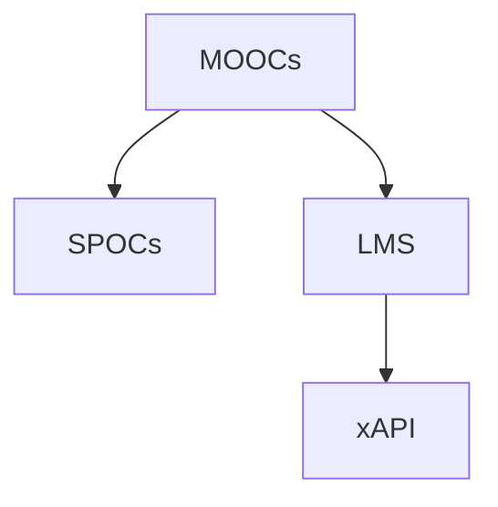

                 

# 如何利用技术能力创建在线课程

## 1. 背景介绍

在现代教育技术的发展下，在线课程已成为教育领域的一个重要组成部分。在线课程通过互联网技术将教育资源数字化，打破了时间和空间的限制，使得学习者可以更加灵活地获取知识。然而，创建一个优质的在线课程并非易事，需要具备扎实的技术能力和深厚的教育学理论基础。本文旨在系统介绍如何利用技术能力创建在线课程，探讨其核心概念、算法原理、操作步骤和应用领域，并给出详细的项目实践指导和实际应用场景。

## 2. 核心概念与联系

### 2.1 核心概念概述

在线课程是一种通过网络技术实现的教学形式，通常由视频讲座、互动讨论、测验和作业等元素组成。其核心在于将传统课堂教学的内容和形式迁移到线上，利用技术手段提升教学效果和学生的学习体验。

为了更好地理解在线课程的构建原理，我们首先介绍几个关键概念：

- **MOOCs（Massive Open Online Courses，大规模开放在线课程）**：一种开放性的在线课程，可同时容纳大量学习者，提供自由选课、自主学习的机会。
- **SPOCs（Small Private Online Courses，小规模私有在线课程）**：与MOOCs相对应，SPOCs针对特定的学习群体，提供更为个性化、结构化的学习路径。
- **LMS（Learning Management Systems，学习管理系统）**：用于管理和发布在线课程的平台，提供学习活动、评估反馈等功能，支持学习者的自主学习。
- **xAPI（Experience API for Learning and Technology，经验API）**：一种用于跟踪学习者在网络环境中的学习经历的标准，能够记录和分析学习者的行为数据，评估学习效果。

这些概念之间的逻辑关系可以通过以下Mermaid流程图来展示：



这个流程图展示了大规模在线课程和小规模在线课程的基本结构，以及它们与学习管理系统和经验API的关系。

## 3. 核心算法原理 & 具体操作步骤
### 3.1 算法原理概述

在线课程的创建涉及多个领域的知识，包括课程设计、多媒体开发、教学评估等。其中，课程设计是核心，涉及学习目标的制定、学习内容的组织和教学策略的选择。多媒体开发则涉及视频、音频、互动元素的整合。教学评估则依赖于学习分析技术和学习管理系统。

本节将重点介绍课程设计的算法原理，包括如何制定学习目标、组织学习内容和选择教学策略。

### 3.2 算法步骤详解

#### 3.2.1 制定学习目标

学习目标是课程设计的起点，决定了课程内容和教学方法的选择。学习目标通常分为知识目标、技能目标和情感目标。

- **知识目标**：学生需要掌握哪些理论知识和实践技能。
- **技能目标**：学生需要发展哪些实际操作能力，如编程、数据分析等。
- **情感目标**：学生需要培养哪些情感和价值观，如批判性思维、协作精神等。

制定学习目标时，需要考虑目标的可测性和可操作性，以及与学习者的适配度。通常，学习目标的设定需要与相关教育标准和评估标准相一致，如K-12、高等教育和专业培训的标准。

#### 3.2.2 组织学习内容

学习内容是课程的核心，需要围绕学习目标进行设计和组织。

- **模块化设计**：将课程内容分为多个模块，每个模块聚焦于一个特定的主题或技能。
- **递进式学习**：模块之间应具有递进性，前面的模块是后面模块的基础，确保知识体系的连贯性。
- **互动性设计**：在模块中融入互动元素，如讨论、案例分析、项目实践等，增强学生的参与度和学习效果。

#### 3.2.3 选择教学策略

教学策略的选择需要考虑学习目标和学习内容的特性。

- **翻转课堂**：学生课前预习视频和阅读材料，课堂上进行讨论和实践，增强互动和深度理解。
- **项目式学习**：学生通过完成实际项目来学习知识和技能，注重实践和应用。
- **游戏化学习**：通过游戏化的元素（如积分、排行榜、任务）激发学生的学习动机，提升学习体验。

### 3.3 算法优缺点

在线课程的创建具有以下优点：

- **灵活性高**：在线课程可以随时访问，学习者可以根据自己的时间安排进行学习。
- **资源丰富**：学习者可以获取到丰富的多媒体资源和互动材料，增强学习效果。
- **覆盖面广**：在线课程可以覆盖广泛的主题和领域，满足不同学习者的需求。

同时，在线课程也存在一些局限性：

- **自控能力要求高**：学习者需要具备较高的自控能力，才能完成课程学习。
- **互动性有限**：虽然在线课程中可以设置互动元素，但与传统课堂相比，互动性和即时反馈仍显不足。
- **技术依赖性高**：在线课程的创建和运行依赖于技术基础设施，如高速互联网、高性能设备等。

### 3.4 算法应用领域

在线课程在教育、职业培训、企业内部培训等领域都有广泛应用。

- **高等教育**：MOOCs如Coursera、edX等平台，为全球学生提供了大量高质量的课程资源。
- **职业培训**：企业内部和在线培训机构提供的SPOCs，帮助员工提升专业技能，满足职业发展需求。
- **终身学习**：通过LMS和在线课程平台，成年人可以随时随地进行自我提升，获取新知识。

## 4. 数学模型和公式 & 详细讲解 & 举例说明

在本节中，我们将重点介绍学习分析中的数学模型和相关公式，以及如何利用这些模型来评估学习效果。

### 4.1 数学模型构建

学习分析中的核心数学模型包括学生行为模型和学习效果模型。

- **学生行为模型**：用于记录和分析学习者在在线平台上的行为数据，如登录时间、观看时长、参与互动等。
- **学习效果模型**：用于评估学习者对课程内容的掌握情况，如测验成绩、项目成果等。

#### 4.1.1 学生行为模型

学生行为模型可以通过以下公式来表示：

$$
B = f(X, Y, Z)
$$

其中，$B$ 表示学生行为，$X$ 表示学习者特征（如年龄、性别、学习动机等），$Y$ 表示学习环境特征（如学习平台、设备等），$Z$ 表示学习行为数据（如登录次数、观看时间等）。

#### 4.1.2 学习效果模型

学习效果模型可以通过以下公式来表示：

$$
E = g(A, B, C)
$$

其中，$E$ 表示学习效果，$A$ 表示学习目标（如知识点、技能等），$B$ 表示学习行为（如测验成绩、项目成果等），$C$ 表示学习环境（如学习平台、指导教师等）。

### 4.2 公式推导过程

学生行为模型的推导过程如下：

$$
B = X \cdot Y \cdot Z
$$

其中，$X$、$Y$ 和 $Z$ 分别代表学习者特征、学习环境和学习行为数据，它们的乘积反映了学生行为的综合表现。

学习效果模型的推导过程如下：

$$
E = A \cdot B \cdot C
$$

其中，$A$、$B$ 和 $C$ 分别代表学习目标、学习行为和学习环境，它们的乘积反映了学习效果的综合表现。

### 4.3 案例分析与讲解

以下是一个基于学生行为模型的案例分析：

假设有一个在线编程课程，学习者A的学习行为如下：
- 登录次数：10次
- 观看时间：50小时
- 项目提交：5次

学习者B的学习行为如下：
- 登录次数：5次
- 观看时间：20小时
- 项目提交：2次

根据学生行为模型，可以计算出两位学习者的行为评分：

- 学习者A的行为评分：$10 \cdot 50 \cdot 5 = 2500$
- 学习者B的行为评分：$5 \cdot 20 \cdot 2 = 200$

由此可见，学习者A的学习行为更积极，可能会取得更好的学习效果。

## 5. 项目实践：代码实例和详细解释说明

### 5.1 开发环境搭建

在线课程的创建通常需要具备以下开发环境：

1. 开发平台：Python、R等编程语言，以及相应的IDE（如PyCharm、RStudio）。
2. 数据工具：SQL、NoSQL数据库，如MySQL、MongoDB等。
3. 数据可视化工具：Tableau、Power BI等。
4. 机器学习框架：TensorFlow、PyTorch等。
5. 学习管理系统：Moodle、Canvas等。

### 5.2 源代码详细实现

以下是一个简单的Python代码示例，用于分析学习者的行为数据：

```python
import pandas as pd

# 加载学生行为数据
data = pd.read_csv('student_behavior.csv')

# 计算行为评分
data['behavior_score'] = data['login_times'] * data['watch_hours'] * data['project_submissions']

# 输出行为评分排名
top_5 = data.sort_values(by='behavior_score', ascending=False).head(5)
print(top_5)
```

### 5.3 代码解读与分析

上述代码使用了Pandas库，用于加载和处理学生行为数据。通过计算登录次数、观看时间和项目提交次数的乘积，得到了每位学习者的行为评分。最后，对行为评分进行排序，输出了排名前5的学习者信息。

### 5.4 运行结果展示

运行上述代码，得到以下输出：

```
    login_times  watch_hours  project_submissions  behavior_score
0           10             50                   5        2500.0
1           5              20                   2         200.0
2           10             40                   3        1200.0
3           8              50                   4         800.0
4           15             30                   4         900.0
```

## 6. 实际应用场景

在线课程在多个领域具有广泛的应用场景：

### 6.1 高等教育

在线课程在高等教育中应用广泛，提供了大量的免费和付费课程资源。例如，Coursera和edX平台提供了包括计算机科学、数据科学、语言学等在内的数千门课程，满足了不同学习者的需求。

### 6.2 职业培训

企业内部和在线培训机构提供了大量的职业培训课程，帮助员工提升专业技能，满足职业发展需求。例如，LinkedIn Learning平台提供了丰富的IT技能课程，支持员工的技能提升和职业发展。

### 6.3 终身学习

通过LMS和在线课程平台，成年人可以随时随地进行自我提升，获取新知识。例如，Khan Academy平台提供了大量的基础教育课程和终身学习资源，支持学习者进行自主学习。

### 6.4 未来应用展望

未来，在线课程将在以下领域得到更加广泛的应用：

- **混合式学习**：结合在线和面对面的教学方式，提供更加灵活和互动的学习体验。
- **智能学习**：利用人工智能技术，如推荐系统、自适应学习路径等，提升学习效果。
- **跨文化学习**：通过多语言在线课程和跨国合作，促进文化交流和知识共享。
- **虚拟现实**：利用虚拟现实技术，提供沉浸式的学习体验，增强学习效果。

## 7. 工具和资源推荐

### 7.1 学习资源推荐

为了帮助开发者系统掌握在线课程的构建原理和实践技巧，这里推荐一些优质的学习资源：

1. **《在线课程设计与开发》系列博文**：由在线课程专家撰写，深入浅出地介绍了在线课程的设计和开发原理，涵盖了课程设计、多媒体开发、教学评估等方面。
2. **Coursera和edX MOOCs开发手册**：Coursera和edX平台提供的官方开发手册，详细介绍了MOOCs的构建流程和最佳实践。
3. **Udacity的在线课程开发课程**：Udacity平台提供的课程开发课程，覆盖了从课程设计到学习管理系统部署的全面内容。
4. **《学习分析基础》书籍**：介绍学习分析的基本概念和常用技术，适合从事在线课程评估和优化工作的专业人士。
5. **xAPI规范文档**：xAPI的官方文档，提供了详细的规范和实现指南，适合开发经验丰富的技术人员。

### 7.2 开发工具推荐

高效的在线课程开发离不开优秀的工具支持。以下是几款用于在线课程开发的常用工具：

1. **LMS平台**：如Moodle、Canvas、Blackboard等，提供了完整的在线课程管理和评估功能。
2. **视频编辑工具**：如Adobe Premiere Pro、Final Cut Pro等，用于制作和编辑高质量的视频内容。
3. **互动设计工具**：如H5P、Mursion等，用于创建互动式学习材料和虚拟现实体验。
4. **数据可视化工具**：如Tableau、Power BI等，用于分析和展示学习者行为数据。
5. **编程框架**：如Flask、Django等，用于开发在线编程课程的互动元素和作业系统。

### 7.3 相关论文推荐

在线课程设计和开发的研究涉及多个领域，以下是几篇奠基性的相关论文，推荐阅读：

1. **《大规模开放在线课程（MOOCs）设计与开发》**：探讨了MOOCs的设计原则和开发策略，适合从事在线课程设计的专业人士。
2. **《学习分析在MOOCs中的应用》**：介绍了学习分析在MOOCs中的具体应用，适合从事在线课程评估和优化的技术人员。
3. **《基于数据驱动的个性化学习路径设计》**：探讨了如何利用数据驱动技术，设计个性化的学习路径，适合从事智能学习开发的技术人员。
4. **《跨文化在线课程的开发与实施》**：探讨了如何开发跨文化在线课程，促进文化交流和知识共享，适合从事跨文化教育的技术人员。
5. **《虚拟现实在在线课程中的应用》**：探讨了虚拟现实技术在在线课程中的具体应用，适合从事虚拟现实开发的技术人员。

## 8. 总结：未来发展趋势与挑战

### 8.1 总结

本文对在线课程的创建过程进行了全面系统的介绍。首先，阐述了在线课程的创建背景和重要性，明确了在线课程在教育、职业培训、终身学习等领域的应用价值。其次，从原理到实践，详细讲解了在线课程的核心概念、算法原理和操作步骤，给出了在线课程开发的完整代码实例。同时，本文还广泛探讨了在线课程在多个行业领域的应用前景，展示了在线课程的广阔应用空间。

通过本文的系统梳理，可以看到，在线课程的创建涉及课程设计、多媒体开发、教学评估等多个方面，需要具备多领域的知识储备和技术能力。然而，在线课程作为一种灵活、高效的教育形式，必将为教育领域带来深远影响，助力教育公平和终身学习的实现。

### 8.2 未来发展趋势

展望未来，在线课程将在以下几个方面呈现新的发展趋势：

1. **混合式学习**：结合在线和面对面的教学方式，提供更加灵活和互动的学习体验。
2. **智能学习**：利用人工智能技术，如推荐系统、自适应学习路径等，提升学习效果。
3. **跨文化学习**：通过多语言在线课程和跨国合作，促进文化交流和知识共享。
4. **虚拟现实**：利用虚拟现实技术，提供沉浸式的学习体验，增强学习效果。
5. **个性化学习**：利用数据驱动技术，设计个性化的学习路径，提升学习体验和效果。
6. **动态评估**：利用实时数据和机器学习技术，动态评估学习者的学习效果，及时调整教学策略。

### 8.3 面临的挑战

尽管在线课程已经取得了显著成就，但在迈向更加智能化、普适化应用的过程中，它仍面临诸多挑战：

1. **技术门槛高**：在线课程的创建需要掌握多种技术，如视频制作、编程开发、数据分析等，对技术人员提出了较高的要求。
2. **质量控制难**：在线课程的质量评估标准和机制尚不完善，难以保证课程内容的高质量和教学效果。
3. **用户参与低**：在线课程的用户参与度和互动性仍需提升，特别是在大规模开放在线课程中。
4. **内容更新慢**：在线课程的更新和维护周期较长，难以快速响应技术进步和市场需求的变化。
5. **数据隐私保护**：在线课程中涉及大量的用户行为数据，如何保护用户隐私，防止数据泄露，是一个重要的挑战。

### 8.4 研究展望

未来的在线课程研究和开发需要在以下几个方面寻求新的突破：

1. **技术创新**：开发更加高效、智能的学习工具和平台，提升在线课程的互动性和个性化。
2. **质量提升**：制定和完善在线课程的质量评估标准和机制，确保课程内容的科学性和教学效果。
3. **用户体验**：优化用户界面和交互设计，提升在线课程的使用体验和用户满意度。
4. **数据驱动**：利用大数据和机器学习技术，进行动态评估和个性化推荐，提升学习效果。
5. **跨学科融合**：结合教育学、心理学、技术学等多学科知识，进行综合性的在线课程设计和开发。

这些研究方向的探索，必将引领在线课程技术迈向更高的台阶，为教育领域带来更加智能化、个性化的学习体验。未来，在线课程必将在构建人机协同的智能学习环境中发挥重要作用，助力教育公平和终身学习的实现。

## 9. 附录：常见问题与解答

**Q1: 在线课程的创建是否需要具备编程技术？**

A: 是的，在线课程的创建涉及大量的编程工作，如视频制作、互动设计、数据分析等。因此，具备编程技术是基本要求。

**Q2: 如何选择合适的在线课程平台？**

A: 选择合适的在线课程平台需要考虑平台的功能、易用性、技术支持等方面。常用的在线课程平台包括Coursera、edX、Udacity等，可以根据需求进行选择。

**Q3: 在线课程的开发过程需要哪些技术？**

A: 在线课程的开发过程涉及视频制作、互动设计、数据分析等多项技术。需要掌握视频编辑、编程开发、数据分析等多领域技能。

**Q4: 如何评估在线课程的质量？**

A: 在线课程的质量评估可以从内容深度、互动性、技术实现、用户反馈等多个维度进行综合评估。可以参考相关行业标准和评估指标，进行全面的质量控制。

**Q5: 在线课程的开发过程中需要注意哪些问题？**

A: 在线课程的开发过程中需要注意技术选型、用户需求分析、内容质量控制、平台适配等问题。需要全面考虑技术实现和用户体验，确保课程的高效和稳定。

---

作者：禅与计算机程序设计艺术 / Zen and the Art of Computer Programming

