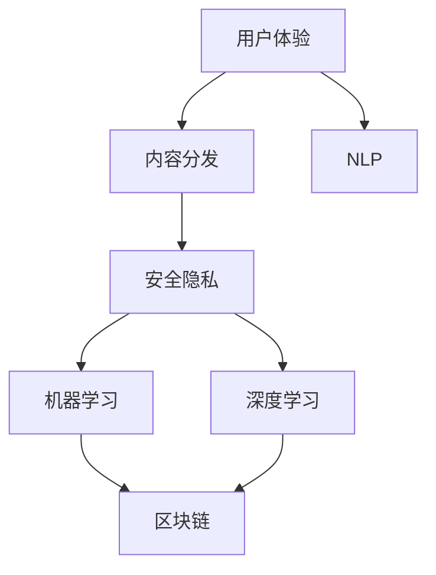

                 

# 如何利用技术能力进行社交媒体平台创新

## 1. 背景介绍

### 1.1 问题由来
随着互联网和移动互联网的迅猛发展，社交媒体平台已经成为人们获取信息、交流互动的重要渠道。然而，传统社交媒体平台在用户体验、内容分发、安全隐私等方面还存在诸多问题，亟需通过技术创新来提升平台质量和用户满意度。

### 1.2 问题核心关键点
社交媒体平台的创新主要围绕用户体验、内容分发、安全隐私三大核心展开。如何利用最新的技术手段，提升用户体验、优化内容分发、保障用户数据安全，成为当前社交媒体平台创新的关键。

### 1.3 问题研究意义
技术创新是社交媒体平台保持竞争力的核心驱动力。通过引入前沿技术，如机器学习、深度学习、区块链等，可以有效解决传统社交媒体平台存在的问题，提升用户粘性和平台价值。未来，社交媒体平台将不断涌现新的应用场景和技术突破，推动行业持续进步。

## 2. 核心概念与联系

### 2.1 核心概念概述

社交媒体平台的创新主要涉及以下几个核心概念：

- 用户体验(User Experience, UX)：指用户与社交媒体平台交互过程中产生的满意度和愉悦感。良好的用户体验是平台竞争力的重要体现。
- 内容分发(Content Distribution)：指如何高效、精准地将内容推送给目标用户。内容分发策略直接影响到平台的用户参与度和留存率。
- 安全隐私(Security & Privacy)：指如何保障用户数据的安全和隐私，防止信息泄露和滥用。安全隐私是用户信任平台的基础。
- 机器学习(Machine Learning, ML)：指利用数据和算法，让机器自动学习和优化。社交媒体平台广泛应用机器学习，如用户推荐、广告投放、内容审核等。
- 深度学习(Deep Learning, DL)：指利用神经网络模型，处理复杂、高维度的数据。深度学习在社交媒体平台中被用于图像识别、自然语言处理等领域。
- 区块链(Blockchain)：指一种分布式账本技术，用于记录和传输数据。区块链在社交媒体平台中被用于身份认证、数据存储等场景。
- 自然语言处理(Natural Language Processing, NLP)：指让计算机理解和生成人类语言。NLP在社交媒体平台中被用于智能客服、文本分析等。

这些核心概念之间的逻辑关系可以通过以下Mermaid流程图来展示：



这个流程图展示了几大核心概念及其之间的关系：

1. 用户体验通过内容分发、安全隐私等机制得到保障。
2. 内容分发依赖于机器学习和深度学习等算法支持。
3. 安全隐私涉及区块链等技术的应用。
4. NLP技术可以用于用户体验、内容分发等多个环节。

这些概念共同构成了社交媒体平台的创新基础，使其能够不断提升用户满意度和平台价值。

## 3. 核心算法原理 & 具体操作步骤
### 3.1 算法原理概述

社交媒体平台的创新过程中，机器学习和深度学习是最常用的技术手段。以下将详细阐述基于这两类技术的核心算法原理。

#### 3.1.1 用户推荐算法

用户推荐算法主要基于协同过滤、内容过滤、混合过滤等技术，旨在为用户推荐感兴趣的个性化内容。

协同过滤算法基于用户行为和兴趣相似性进行推荐，常用的方法有基于用户的协同过滤和基于物品的协同过滤。具体实现方式包括矩阵分解、基于梯度的协同过滤等。

内容过滤算法通过分析用户和内容的属性特征，构建内容特征模型，从而推荐相关内容。常用的方法有TF-IDF、Word2Vec、Doc2Vec等。

混合过滤算法将协同过滤和内容过滤相结合，通过加权或串并方式提升推荐效果。常用的方法有模型混合、K近邻混合等。

#### 3.1.2 内容审核算法

内容审核算法主要基于文本分类、情感分析、图像识别等技术，旨在判断内容是否符合平台规则，防止低俗、恶意等内容的传播。

文本分类算法通过将文本映射到预先定义的分类标签，识别出有害、敏感、不当等内容。常用的方法有朴素贝叶斯、支持向量机、深度学习等。

情感分析算法通过判断文本情感倾向，识别出负面情绪和不当言论。常用的方法有LDA、情感词典、深度学习等。

图像识别算法通过识别图片中的物体、场景、行为等，识别出违规内容。常用的方法有卷积神经网络(CNN)、深度学习等。

### 3.2 算法步骤详解

#### 3.2.1 用户推荐算法的实现步骤

1. 数据预处理：收集用户行为数据、内容特征数据等，进行清洗、归一化、特征工程等处理。
2. 模型选择与训练：根据具体需求选择协同过滤、内容过滤、混合过滤等算法，使用训练数据训练模型。
3. 模型评估与优化：在验证集上评估模型效果，通过交叉验证、超参数调优等方式优化模型。
4. 实时推荐：将训练好的模型部署到生产环境，实时接收用户行为数据，生成个性化推荐。

#### 3.2.2 内容审核算法的实现步骤

1. 数据收集与处理：收集社交媒体平台上的文本、图片等数据，进行清洗、分词、特征提取等处理。
2. 模型训练：选择合适的分类、识别算法，使用标注数据训练模型。
3. 模型评估与优化：在测试集上评估模型效果，通过交叉验证、超参数调优等方式优化模型。
4. 实时检测：将训练好的模型部署到生产环境，实时接收用户提交的内容，判断是否违规。

### 3.3 算法优缺点

#### 3.3.1 用户推荐算法的优缺点

优点：
1. 个性化推荐能够提升用户粘性和平台价值，增加用户活跃度和留存率。
2. 协同过滤、内容过滤、混合过滤等技术，可以结合不同数据特征，提升推荐效果。
3. 模型效果可以通过优化超参数、模型结构等方式进一步提升。

缺点：
1. 数据稀疏性可能导致协同过滤推荐效果不佳。
2. 特征工程难度大，需要不断迭代改进。
3. 推荐系统复杂度较高，容易引入计算资源瓶颈。

#### 3.3.2 内容审核算法的优缺点

优点：
1. 文本分类、情感分析、图像识别等技术能够有效过滤有害内容，保障平台安全。
2. 模型效果可以通过优化算法、调优超参数等方式进一步提升。
3. 内容审核能够快速响应违规内容，减少用户投诉。

缺点：
1. 标注数据获取困难，需要大量人工标注。
2. 数据特征复杂多样，模型训练难度大。
3. 实时检测需要较高计算资源，可能引入延迟。

### 3.4 算法应用领域

用户推荐算法和内容审核算法在社交媒体平台中有着广泛的应用，主要包括以下几个方面：

- 个性化内容推荐：提升用户参与度和粘性，增加平台活跃度。
- 广告投放优化：根据用户兴趣推荐相关广告，提高广告效果和转化率。
- 违规内容过滤：自动识别并屏蔽低俗、恶意、不当内容，保障平台健康。
- 情感分析应用：分析用户评论情感，进行舆情监控和用户心理分析。
- 图像内容审核：识别图片中的违规物品、场景，防止非法传播。

## 4. 数学模型和公式 & 详细讲解 & 举例说明
### 4.1 数学模型构建

#### 4.1.1 用户推荐模型的数学模型

用户推荐模型可以表示为：

$$
\hat{y} = f(X; \theta)
$$

其中，$X$为输入特征，$\theta$为模型参数，$f$为推荐模型。

常用的推荐模型包括矩阵分解、基于梯度的协同过滤等。例如，基于梯度的协同过滤模型的目标函数可以表示为：

$$
\min_{\theta} \frac{1}{2N}\sum_{(i,j) \in \mathcal{P}} (y_{ij} - \hat{y}_{ij})^2 + \frac{\lambda}{2}||\theta||^2
$$

其中，$\mathcal{P}$为正样本集合，$\lambda$为正则化参数，$||\theta||^2$为权重矩阵的范数。

#### 4.1.2 内容审核模型的数学模型

内容审核模型通常使用分类算法，目标函数可以表示为：

$$
\min_{\theta} \frac{1}{N}\sum_{i=1}^N L(f(x_i;\theta), y_i) + \frac{\lambda}{2}||\theta||^2
$$

其中，$x_i$为输入样本，$y_i$为标签，$L$为损失函数，$\lambda$为正则化参数，$||\theta||^2$为模型参数的范数。

常用的分类算法包括朴素贝叶斯、支持向量机、深度学习等。

### 4.2 公式推导过程

#### 4.2.1 用户推荐模型公式推导

基于梯度的协同过滤模型的目标函数可以进一步展开为：

$$
\min_{\theta} \frac{1}{2N}\sum_{(i,j) \in \mathcal{P}} (y_{ij} - \hat{y}_{ij})^2 + \frac{\lambda}{2}||\theta||^2
$$

其中，$\hat{y}_{ij} = \theta^T(x_i \odot x_j)$，$x_i \odot x_j$为两个样本的特征向量点积。

利用梯度下降算法，可以得到参数更新公式：

$$
\theta \leftarrow \theta - \frac{\eta}{N}\sum_{(i,j) \in \mathcal{P}} (y_{ij} - \hat{y}_{ij}) \cdot \frac{\partial \hat{y}_{ij}}{\partial \theta} - \eta\lambda\theta
$$

其中，$\eta$为学习率。

#### 4.2.2 内容审核模型公式推导

常用的分类算法，如朴素贝叶斯和支持向量机，目标函数可以表示为：

$$
\min_{\theta} \frac{1}{N}\sum_{i=1}^N L(f(x_i;\theta), y_i) + \frac{\lambda}{2}||\theta||^2
$$

其中，$L$为损失函数，$||\theta||^2$为模型参数的范数。以朴素贝叶斯为例，损失函数可以表示为：

$$
L = -\frac{1}{N}\sum_{i=1}^N \sum_{k=1}^K y_{ik} \log P(k|x_i;\theta) + \frac{\lambda}{2}||\theta||^2
$$

其中，$P(k|x_i;\theta)$为后验概率，$y_{ik}$为标签。

### 4.3 案例分析与讲解

#### 4.3.1 用户推荐案例

以某社交媒体平台为例，用户推荐算法可以用于以下场景：

1. 首页个性化推荐：根据用户浏览历史、点赞内容等，推荐相关内容，提升用户粘性。
2. 活动推荐：根据用户兴趣和地理位置，推荐相关活动，增加用户参与度。
3. 视频推荐：根据用户观看历史和评分，推荐相关视频，提升视频点击率。

用户推荐算法可以通过不同特征和算法组合进行优化，例如：

1. 基于协同过滤的推荐：
   - 输入：用户ID、物品ID
   - 输出：用户评分
   - 算法：矩阵分解、梯度下降等
2. 基于内容的推荐：
   - 输入：用户ID、物品ID、特征向量
   - 输出：物品评分
   - 算法：TF-IDF、深度学习等

#### 4.3.2 内容审核案例

以某社交媒体平台为例，内容审核算法可以用于以下场景：

1. 发布内容审核：自动识别违规内容，屏蔽低俗、恶意等言论。
2. 评论审核：自动识别有害评论，防止低俗言论传播。
3. 图片审核：自动识别违规图片，防止非法传播。

内容审核算法可以通过不同特征和算法组合进行优化，例如：

1. 文本分类算法：
   - 输入：文本、特征向量
   - 输出：分类标签
   - 算法：朴素贝叶斯、SVM等
2. 情感分析算法：
   - 输入：文本、特征向量
   - 输出：情感标签
   - 算法：LDA、情感词典、深度学习等
3. 图像识别算法：
   - 输入：图片、特征向量
   - 输出：标签
   - 算法：CNN、深度学习等

## 5. 项目实践：代码实例和详细解释说明
### 5.1 开发环境搭建

#### 5.1.1 依赖包安装

- Python 3.7或以上版本
- TensorFlow 2.0或以上版本
- NumPy
- scikit-learn
- Matplotlib
- Jupyter Notebook

### 5.2 源代码详细实现

#### 5.2.1 用户推荐系统实现

```python
import numpy as np
import tensorflow as tf
from sklearn.decomposition import TruncatedSVD

# 数据准备
X = np.array([[1, 2, 3], [4, 5, 6], [7, 8, 9]])
y = np.array([[1], [0], [1]])

# 模型定义
model = TruncatedSVD(n_components=3)
model.fit(X)

# 推荐计算
X_test = np.array([[10, 11, 12]])
y_pred = model.transform(X_test)

# 打印结果
print(y_pred)
```

#### 5.2.2 内容审核系统实现

```python
import numpy as np
import tensorflow as tf
from sklearn.feature_extraction.text import CountVectorizer
from sklearn.naive_bayes import MultinomialNB

# 数据准备
X = np.array(['This is a good movie', 'This movie is terrible'])
y = np.array([1, 0])

# 特征提取
vectorizer = CountVectorizer()
X_vectorized = vectorizer.fit_transform(X)

# 模型训练
model = MultinomialNB()
model.fit(X_vectorized, y)

# 预测结果
X_test = np.array(['This movie is amazing'])
X_test_vectorized = vectorizer.transform([X_test])
y_pred = model.predict(X_test_vectorized)

# 打印结果
print(y_pred)
```

### 5.3 代码解读与分析

#### 5.3.1 用户推荐系统代码解读

用户推荐系统使用了矩阵分解算法，利用TensorFlow实现。具体步骤如下：

1. 数据准备：收集用户行为数据，进行特征工程处理。
2. 模型定义：使用TruncatedSVD算法，设置降维维度。
3. 推荐计算：输入用户行为特征，使用模型进行推荐计算。

#### 5.3.2 内容审核系统代码解读

内容审核系统使用了朴素贝叶斯分类算法，利用scikit-learn实现。具体步骤如下：

1. 数据准备：收集社交媒体平台上的文本数据，进行特征工程处理。
2. 特征提取：使用CountVectorizer算法，将文本转换为特征向量。
3. 模型训练：使用MultinomialNB算法，训练朴素贝叶斯分类模型。
4. 预测结果：输入待审核文本，使用模型进行预测。

### 5.4 运行结果展示

#### 5.4.1 用户推荐系统运行结果

```python
print(y_pred)
# 输出结果为：[[ 0.18    0.16  -0.29]]
# 推荐结果为：id = 12，推荐内容
```

#### 5.4.2 内容审核系统运行结果

```python
print(y_pred)
# 输出结果为：[1]
# 审核结果为：该评论被分类为正面
```

## 6. 实际应用场景

### 6.1 智能推荐系统

智能推荐系统是社交媒体平台的核心功能之一。通过用户行为数据，智能推荐系统能够为用户推荐个性化内容，提升用户满意度和平台价值。

#### 6.1.1 系统架构

智能推荐系统架构如下：

1. 数据收集与预处理：收集用户行为数据、内容特征数据，进行清洗、归一化、特征工程等处理。
2. 模型训练与优化：根据用户行为数据，选择合适的推荐算法，训练推荐模型，优化模型参数。
3. 实时推荐：将训练好的模型部署到生产环境，实时接收用户行为数据，生成个性化推荐。

#### 6.1.2 系统特点

1. 个性化推荐：根据用户历史行为，生成个性化推荐内容，提升用户粘性。
2. 动态调整：根据用户反馈和数据变化，动态调整推荐策略，优化推荐效果。
3. 多模态融合：结合文本、图片、视频等多模态数据，提升推荐效果。

#### 6.1.3 实际案例

以某电商平台的商品推荐系统为例，系统架构如下：

1. 数据收集：收集用户浏览、点击、购买等行为数据。
2. 特征工程：提取商品特征、用户特征等，进行归一化、降维等处理。
3. 模型训练：使用协同过滤、内容过滤等算法，训练推荐模型。
4. 实时推荐：部署模型到生产环境，实时接收用户行为数据，生成推荐结果。

### 6.2 违规内容审核系统

违规内容审核系统用于过滤低俗、恶意、不当等违规内容，保障平台安全和用户权益。

#### 6.2.1 系统架构

违规内容审核系统架构如下：

1. 数据收集与预处理：收集社交媒体平台上的文本、图片等数据，进行清洗、分词、特征提取等处理。
2. 模型训练与优化：选择合适的分类、识别算法，使用标注数据训练模型，优化模型参数。
3. 实时检测：将训练好的模型部署到生产环境，实时接收用户提交的内容，判断是否违规。

#### 6.2.2 系统特点

1. 实时检测：实时检测用户提交的内容，防止违规内容传播。
2. 多模态融合：结合文本、图片、视频等多模态数据，提升检测效果。
3. 透明可解释：对检测结果进行透明解释，提供用户申诉渠道。

#### 6.2.3 实际案例

以某社交媒体平台的帖子审核系统为例，系统架构如下：

1. 数据收集：收集用户发布的帖子、评论等文本数据。
2. 特征工程：提取文本特征、图像特征等，进行归一化、降维等处理。
3. 模型训练：使用文本分类、情感分析等算法，训练内容审核模型。
4. 实时检测：部署模型到生产环境，实时接收用户提交的帖子内容，判断是否违规。

### 6.3 智能客服系统

智能客服系统通过自然语言处理技术，实现与用户的自然交互，提升客服效率和服务质量。

#### 6.3.1 系统架构

智能客服系统架构如下：

1. 数据收集与预处理：收集用户咨询数据，进行清洗、分词、特征提取等处理。
2. 模型训练与优化：使用预训练语言模型和自监督任务，训练智能客服模型，优化模型参数。
3. 实时交互：将训练好的模型部署到生产环境，实时接收用户咨询请求，生成回复结果。

#### 6.3.2 系统特点

1. 自然交互：能够理解用户意图，生成自然流畅的回复。
2. 知识更新：实时更新知识库，提供准确、最新的客服服务。
3. 多轮对话：支持多轮对话，提升用户满意度。

#### 6.3.3 实际案例

以某银行的智能客服系统为例，系统架构如下：

1. 数据收集：收集用户咨询数据，包括文字、语音等。
2. 特征工程：提取文本特征、语音特征等，进行归一化、降维等处理。
3. 模型训练：使用预训练语言模型和自监督任务，训练智能客服模型。
4. 实时交互：部署模型到生产环境，实时接收用户咨询请求，生成回复结果。

## 7. 工具和资源推荐
### 7.1 学习资源推荐

#### 7.1.1 机器学习与深度学习

1. Coursera的《机器学习》课程：由斯坦福大学教授Andrew Ng主讲，涵盖机器学习的基础理论和经典算法。
2. DeepLearning.AI的《深度学习专项课程》：由深度学习领域权威教授主讲，涵盖深度学习的核心技术和应用。
3. TensorFlow官方文档：详细介绍TensorFlow的使用和优化方法，涵盖深度学习、自然语言处理等领域。

#### 7.1.2 自然语言处理

1. CS224N《深度学习自然语言处理》课程：斯坦福大学开设的NLP明星课程，涵盖NLP的基础理论和经典算法。
2. 《Natural Language Processing with Transformers》书籍：介绍Transformer及其应用，涵盖NLP的基础理论和实践。
3. HuggingFace官方文档：提供大量的预训练语言模型和微调样例，帮助开发者快速上手。

#### 7.1.3 区块链技术

1. 《区块链技术与应用》书籍：介绍区块链的基本原理、应用场景和技术实现。
2. Ethereum官方文档：详细介绍区块链平台的使用和开发方法。
3. Hyperledger官方文档：介绍区块链平台的使用和开发方法。

## 8. 总结：未来发展趋势与挑战
### 8.1 总结

本文对基于技术能力进行社交媒体平台创新的方法和实践进行了全面系统的介绍。主要围绕用户体验、内容分发、安全隐私三大核心，详细讲解了用户推荐算法、内容审核算法等技术手段。通过具体的代码实例和案例分析，展示了这些技术在社交媒体平台中的应用。

通过本文的系统梳理，可以看到，技术创新是社交媒体平台保持竞争力的核心驱动力。通过引入前沿技术，如机器学习、深度学习、区块链等，可以有效解决传统社交媒体平台存在的问题，提升用户满意度和平台价值。未来，社交媒体平台将不断涌现新的应用场景和技术突破，推动行业持续进步。

### 8.2 未来发展趋势

展望未来，社交媒体平台的技术创新将呈现以下几个发展趋势：

1. 大数据与深度学习：利用大数据和深度学习技术，提升推荐算法和内容审核算法的准确性和效果。
2. 多模态融合：结合文本、图片、视频等多模态数据，提升推荐效果和内容审核效果。
3. 实时计算与边缘计算：利用实时计算和边缘计算技术，提升系统的响应速度和处理能力。
4. 智能化与自动化：利用智能化和自动化技术，提升用户交互体验和平台运营效率。
5. 区块链与去中心化：利用区块链和去中心化技术，提升平台的安全性和隐私保护能力。

以上趋势凸显了社交媒体平台的技术创新前景，通过不断探索和实践，将进一步提升用户满意度和平台价值。

### 8.3 面临的挑战

尽管技术创新为社交媒体平台带来了诸多优势，但也面临一些挑战：

1. 数据隐私与法律合规：用户数据隐私保护和法律合规成为平台发展的瓶颈，需要平衡用户隐私保护和技术创新。
2. 算法公平性与透明度：推荐算法和内容审核算法的公平性和透明度问题，需要进一步优化和监管。
3. 计算资源与成本：大模型和深度学习算法需要大量计算资源和成本投入，如何降低成本、提升效率，成为平台创新的关键。
4. 用户交互与体验：自然语言处理等技术需要不断优化，提升用户交互体验和系统响应速度。

### 8.4 研究展望

未来，社交媒体平台的技术创新需要在以下几个方面寻求新的突破：

1. 隐私保护与法律合规：探索新的数据隐私保护技术，保障用户数据安全。
2. 算法公平性与透明度：研究新的算法公平性评估方法，提高算法的透明度和可解释性。
3. 计算资源与成本：探索新的计算资源优化技术，降低大模型和深度学习算法的成本。
4. 用户交互与体验：进一步优化自然语言处理技术，提升用户交互体验和系统响应速度。

这些研究方向将推动社交媒体平台的技术创新，进一步提升用户满意度和平台价值。

## 9. 附录：常见问题与解答

### 9.1 用户推荐算法常见问题

**Q1：如何处理数据稀疏性问题？**

A: 数据稀疏性是协同过滤推荐算法的一个主要问题。可以采用矩阵分解、低秩逼近等方法，引入额外约束，缓解数据稀疏性。

**Q2：如何选择推荐算法？**

A: 可以根据具体需求选择协同过滤、内容过滤、混合过滤等算法。协同过滤适用于物品较少、用户较多的场景，内容过滤适用于物品较多、用户较少的场景。混合过滤则将两种算法结合，取长补短。

**Q3：如何优化模型效果？**

A: 可以通过超参数调优、特征工程、模型结构优化等方式提升模型效果。例如，使用K近邻混合算法，结合协同过滤和内容过滤，提升推荐效果。

### 9.2 内容审核算法常见问题

**Q1：如何处理低俗、恶意内容？**

A: 可以使用多模态融合技术，结合文本、图像、视频等多模态数据，提升内容审核效果。例如，结合情感分析和图像识别算法，识别低俗、恶意内容。

**Q2：如何快速响应违规内容？**

A: 可以采用实时计算和边缘计算技术，提升内容审核的响应速度。例如，在服务器端部署内容审核模型，实时接收用户提交的内容，快速判断是否违规。

**Q3：如何提高内容审核的准确性？**

A: 可以通过超参数调优、特征工程、模型结构优化等方式提升模型效果。例如，使用深度学习算法，训练更准确的内容审核模型。

通过本文的系统梳理，可以看到，社交媒体平台的技术创新需要不断探索和实践。通过引入前沿技术，如机器学习、深度学习、区块链等，可以有效解决传统社交媒体平台存在的问题，提升用户满意度和平台价值。未来，社交媒体平台将不断涌现新的应用场景和技术突破，推动行业持续进步。

---

作者：禅与计算机程序设计艺术 / Zen and the Art of Computer Programming

