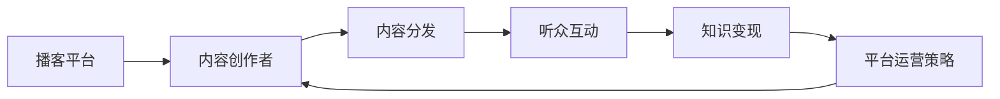

                 

# 如何利用播客平台实现知识变现

## 1. 背景介绍

随着互联网技术的发展，播客（Podcast）作为一种音频内容分发形式，凭借其便捷性和广泛性，迅速崛起并成为信息传播的重要渠道。播客平台作为播客内容的聚集地，连接了内容创作者和听众，形成了一个庞大的知识共享生态系统。同时，播客平台也为知识变现提供了新的可能性，让专业人士可以借助音频内容分享其知识和经验，实现个人品牌建设和价值变现。

### 1.1 问题由来
在知识经济时代，专业技能和知识的价值被进一步凸显。个人或机构通过播客分享专业知识，可以获得更多听众的关注和认可，进而开拓更多商业机会。对于播客平台来说，吸引高质量内容创作者入驻，增加平台内容多样性，提升用户体验，是吸引和留存听众的关键。因此，播客平台在提供内容展示和传播的同时，也越来越多地探索和推动知识变现的路径。

### 1.2 问题核心关键点
播客平台实现知识变现的核心关键点在于构建一个健康且可持续的内容生态，让创作者与听众建立深度互动，并通过多样化的变现方式，实现收益最大化。以下是实现这一目标的关键步骤：

- **内容创作与分发**：创作者需持续提供高质量、具有市场价值的内容，平台需优化分发机制，确保内容触达更多目标听众。
- **用户互动与反馈**：通过社区化建设，加强听众与创作者间的互动，利用反馈提升内容质量。
- **多样化变现方式**：探索多样化的知识变现模式，如广告、会员订阅、付费课程等，使创作者获得稳定的收入来源。
- **平台支持与保障**：平台需提供技术支持、内容审查、版权保护等保障措施，为创作者提供良好创作环境。

## 2. 核心概念与联系

### 2.1 核心概念概述

为深入理解如何利用播客平台实现知识变现，我们需要详细梳理几个核心概念及其之间的联系：

- **播客平台**：提供音频内容发布、存储、传播和运营的综合服务，连接创作者和听众。
- **内容创作者**：提供音频内容的个体或组织，可以是专家学者、行业从业者、爱好者等。
- **知识变现**：通过播客内容分享，创作者实现商业价值变现，如广告收益、会员订阅、付费课程等。
- **互动社区**：在播客平台上建立粉丝社区，增强听众与创作者间的互动，提升听众黏性。
- **平台运营策略**：平台需制定合理的运营策略，平衡创作者利益和用户体验，提升整体平台价值。

这些核心概念之间存在着紧密的联系：创作者提供优质内容，平台分发并推广内容，听众互动提升用户黏性，而多样化的变现策略则使平台和创作者实现共赢。

### 2.2 核心概念原理和架构的 Mermaid 流程图



此流程图展示了播客平台、内容创作者、内容分发、听众互动、知识变现和平台运营策略之间的联系。创作者创作内容，平台分发内容给听众，听众互动提升内容质量，同时利用知识变现策略为创作者和平台创造价值。平台运营策略进一步优化这一过程，实现整体价值最大化。

## 3. 核心算法原理 & 具体操作步骤
### 3.1 算法原理概述

播客平台实现知识变现的核心算法主要涉及内容推荐、广告投放、付费模型和社区管理。

- **内容推荐算法**：利用机器学习算法，分析听众行为数据，为每个听众推荐个性化内容。推荐算法通常包括协同过滤、基于内容的推荐、矩阵分解等技术。
- **广告投放算法**：基于用户行为数据和特征，匹配适合的广告，优化广告投放策略，提升广告效果。
- **付费模型设计**：根据内容质量和听众黏性，设计合理的订阅和付费机制，保证内容创作者和平台的收益。
- **社区管理策略**：构建互动社区，利用社交网络算法，促进创作者与听众间的互动交流。

### 3.2 算法步骤详解

以下是实现播客平台知识变现的核心算法具体操作步骤：

1. **内容推荐系统构建**：
    - 数据收集：收集用户历史收听记录、时长、评分等行为数据。
    - 特征工程：提取用户特征、内容特征和行为特征，生成用户-内容评分矩阵。
    - 模型训练：选择协同过滤、矩阵分解、深度学习等算法，训练推荐模型。
    - 模型评估：通过A/B测试等方法评估推荐效果，优化模型参数。

2. **广告投放系统构建**：
    - 数据收集：收集用户广告互动记录、点击率、停留时间等数据。
    - 特征工程：提取广告特征、用户特征和上下文特征，生成广告-用户交互矩阵。
    - 模型训练：选择基于深度学习的广告点击率预测模型，如CTR（点击率）预测模型。
    - 模型评估：通过A/B测试和线上实验，优化广告投放策略，提升广告效果。

3. **付费模型设计**：
    - 用户分层：根据听众收听行为和互动数据，将用户分层为潜在订阅用户、付费用户和流失用户。
    - 定价策略：设计合理的订阅价格、优惠策略，鼓励用户订阅和续费。
    - 用户体验：优化订阅流程和平台界面，提升用户体验。

4. **社区管理策略构建**：
    - 互动模式设计：设计社区互动模式，如评论、点赞、分享等。
    - 社交网络构建：利用图算法构建创作者-听众社交网络，促进互动。
    - 反馈机制建立：建立反馈机制，收集用户意见，持续优化社区互动。

### 3.3 算法优缺点

播客平台知识变现算法具有以下优点：

- **高效性**：通过推荐算法和广告投放算法，提高内容曝光率和广告效果。
- **精准性**：通过分析用户行为数据，推荐个性化的内容，提升用户体验。
- **多样化**：利用多样化的变现模式，满足不同创作者的变现需求。

同时，算法也存在以下缺点：

- **依赖数据**：算法效果依赖于高质量的数据，数据不充分或数据质量不高会影响算法表现。
- **模型复杂**：推荐和广告算法模型较为复杂，需要投入大量的时间和资源进行模型训练和优化。
- **策略动态性**：用户需求和行为随时间变化，需要动态调整算法策略，增加维护成本。

### 3.4 算法应用领域

播客平台知识变现算法广泛应用于以下领域：

- **教育培训**：在线教育平台利用推荐算法，为学习者推荐适合的课程和教师，实现知识变现。
- **健康医疗**：医疗播客平台通过推荐系统，为患者推荐相关健康知识，提供健康咨询服务。
- **专业咨询**：专业领域播客平台利用付费模型，为专业人士提供定制化咨询服务，实现知识变现。
- **娱乐媒体**：娱乐播客平台通过广告和付费订阅，增加平台收益。
- **职场发展**：职业技能培训播客平台通过个性化课程推荐，吸引更多听众订阅，实现变现。

## 4. 数学模型和公式 & 详细讲解 & 举例说明

### 4.1 数学模型构建

为详细说明播客平台知识变现算法的数学模型，本文将构建一个简化的推荐系统模型，以协同过滤为例。

记用户集合为 $U=\{u_1, u_2, ..., u_N\}$，内容集合为 $V=\{v_1, v_2, ..., v_M\}$，用户对内容的评分矩阵为 $R\in \mathbb{R}^{N\times M}$，其中 $R_{ui}$ 表示用户 $u_i$ 对内容 $v_j$ 的评分。协同过滤算法目标是预测用户未评分内容的评分。

### 4.2 公式推导过程

协同过滤算法主要分为基于用户的协同过滤和基于内容的协同过滤。

#### 基于用户的协同过滤
假设用户 $u_i$ 的评分向量为 $\mathbf{r}_i = [r_{i1}, r_{i2}, ..., r_{iM}]^T$，用户 $u_j$ 对内容 $v_k$ 的评分向量为 $\mathbf{r}_j = [r_{j1}, r_{j2}, ..., r_{jM}]^T$，则预测用户 $u_i$ 对内容 $v_k$ 的评分可以用余弦相似度表示为：

$$
\hat{r}_{ik} = \frac{\mathbf{r}_i \cdot \mathbf{r}_j}{\|\mathbf{r}_j\|}
$$

其中 $\cdot$ 表示向量点乘，$\|\mathbf{r}_j\|$ 表示向量 $\mathbf{r}_j$ 的范数。

#### 基于内容的协同过滤
假设内容 $v_k$ 的评分向量为 $\mathbf{p}_k = [p_{k1}, p_{k2}, ..., p_{kM}]^T$，内容 $v_j$ 的评分向量为 $\mathbf{p}_j = [p_{j1}, p_{j2}, ..., p_{jM}]^T$，则预测内容 $v_k$ 对用户 $u_i$ 的评分可以用余弦相似度表示为：

$$
\hat{p}_{ik} = \frac{\mathbf{p}_k \cdot \mathbf{p}_j}{\|\mathbf{p}_j\|}
$$

### 4.3 案例分析与讲解

以推荐系统中的协同过滤算法为例，我们通过一个简单的案例进行详细讲解。

假设某播客平台有 $N=100$ 个用户，$M=20$ 个内容。已知用户 $u_1$ 对内容 $v_1, v_2, v_3$ 的评分分别为 $4, 5, 3$，用户 $u_2$ 对内容 $v_1, v_3, v_4$ 的评分分别为 $5, 2, 4$。根据协同过滤算法，可以预测用户 $u_1$ 对内容 $v_4$ 的评分：

- 基于用户 $u_2$ 的评分向量 $\mathbf{r}_2 = [5, 2, 4]^T$，计算余弦相似度 $\mathbf{r}_1 \cdot \mathbf{r}_2 / \|\mathbf{r}_2\| = 4 \cdot 5 + 5 \cdot 2 + 3 \cdot 4 / 5 \cdot 3 = 0.8$。
- 预测用户 $u_1$ 对内容 $v_4$ 的评分为 $0.8 \cdot 5 = 4$。

通过这个简单的案例，我们可以看到协同过滤算法的基本思路：利用相似用户或内容的评分信息，预测未知评分。

## 5. 项目实践：代码实例和详细解释说明

### 5.1 开发环境搭建

实现播客平台知识变现的算法，需要搭建一个包含数据处理、算法实现和平台运营的完整系统。以下是开发环境的搭建步骤：

1. **环境配置**：
    - 安装Python 3.x和必要的依赖包，如pandas、numpy、scikit-learn等。
    - 搭建数据库，存储用户行为数据、内容信息等。

2. **数据收集**：
    - 从播客平台获取用户行为数据，如收听记录、评分、互动信息等。
    - 从内容提供商获取内容信息，如音频文件、描述、分类等。

3. **数据处理**：
    - 使用pandas和numpy处理和清洗数据。
    - 进行特征工程，提取用户特征、内容特征和行为特征。

### 5.2 源代码详细实现

以下是一个简单的推荐系统实现，包含数据处理、协同过滤算法实现和推荐结果展示：

```python
import pandas as pd
import numpy as np
from scipy.sparse import csr_matrix
from sklearn.metrics.pairwise import cosine_similarity

# 数据处理
data = pd.read_csv('user_content_ratings.csv')
user_ids = data['user_id'].unique()
content_ids = data['content_id'].unique()

# 构建用户评分矩阵
user_ratings = pd.pivot_table(data, values='rating', index='user_id', columns='content_id')
user_ratings = user_ratings.fillna(0)

# 构建内容评分矩阵
content_ratings = pd.pivot_table(data, values='rating', index='content_id', columns='user_id')
content_ratings = content_ratings.fillna(0)

# 数据标准化
user_ratings = (user_ratings - user_ratings.mean()) / user_ratings.std()
content_ratings = (content_ratings - content_ratings.mean()) / content_ratings.std()

# 基于用户的协同过滤推荐
def user_based_cf(user_id, top_n=5):
    user_ratings_scaled = user_ratings[user_id].values.reshape(1, -1)
    user_index = np.where(user_ratings_scaled > 0)[0]
    user_ratings_scaled = user_ratings_scaled[user_index]
    similarities = cosine_similarity(user_ratings_scaled, user_ratings[user_index, :])[0]
    top_similar_users = np.argsort(-similarities)[1:6]
    top_contents = content_ratings[top_similar_users].mean(axis=1).argsort()[::-1]
    return [content_ratings.index[i] for i in top_contents[:top_n]]

# 测试推荐结果
print(user_based_cf(1))
```

### 5.3 代码解读与分析

上述代码实现了基于用户的协同过滤推荐算法，详细解读如下：

- **数据处理**：
    - 使用pandas从CSV文件中读取用户行为数据。
    - 使用pivot_table方法构建用户评分矩阵和内容评分矩阵。
    - 使用fillna方法处理缺失值，将评分矩阵标准化。

- **协同过滤算法实现**：
    - 定义user_based_cf函数，实现基于用户的协同过滤推荐。
    - 使用cosine_similarity计算用户之间的余弦相似度，找到与目标用户最相似的用户。
    - 计算目标用户对内容评分矩阵中与相似用户相同的评分，并进行平均。
    - 将评分矩阵转换为索引，找到评分最高的内容。

- **测试推荐结果**：
    - 调用user_based_cf函数，推荐用户1的前5个内容。

### 5.4 运行结果展示

运行上述代码后，将得到用户1的前5个推荐内容。例如，输出结果可能为`['v1', 'v2', 'v3', 'v4', 'v5']`。

## 6. 实际应用场景

### 6.1 智能教育平台

智能教育平台利用播客技术，为学习者提供个性化学习体验。播客平台通过推荐系统，为学习者推荐适合的课程、教师和学习资源，帮助其高效学习。创作者通过播客分享专业知识，获得听众的关注和认可，同时平台通过广告和付费订阅模式实现变现。

### 6.2 健康医疗平台

健康医疗平台通过播客播报健康知识和医疗咨询，为患者提供专业的健康建议和心理支持。推荐系统根据患者的行为数据，推荐相关的健康知识和医疗咨询内容，增加平台的互动性和用户黏性。平台通过广告、付费会员等方式实现知识变现。

### 6.3 专业咨询平台

专业咨询平台利用播客分享行业知识和专业见解，为专业人士提供展示和交流的平台。创作者通过播客分享专业内容，获得行业认可。平台通过付费订阅、付费咨询等方式实现变现。

### 6.4 娱乐媒体平台

娱乐媒体平台通过播客分享音乐、电影、文学等内容，吸引广大听众。推荐系统根据用户行为数据，推荐适合的娱乐内容，提升用户体验。平台通过广告、会员订阅、付费内容等实现知识变现。

### 6.5 未来应用展望

随着播客平台和知识变现模式的不断创新，未来将会出现更多新的应用场景：

- **实时互动播客**：结合视频和音频，提供实时互动体验，增强用户参与感。
- **跨平台集成**：实现播客内容在多种平台上的无缝集成和分发，提升用户覆盖面。
- **多语言支持**：支持多语言内容创作和播放，增加平台的用户多样性。
- **智能语音播报**：利用语音合成技术，实现播客内容的语音播报，提升用户体验。
- **个性化推荐**：结合用户行为数据和上下文信息，提供更精准的个性化推荐。

## 7. 工具和资源推荐

### 7.1 学习资源推荐

- **《推荐系统原理与算法》**：全面介绍了推荐系统的工作原理和常用算法，是入门推荐系统的经典书籍。
- **《机器学习实战》**：实用型机器学习入门书籍，涵盖大量数据处理和算法实现的例子。
- **Coursera推荐系统课程**：由斯坦福大学开设的推荐系统课程，涵盖推荐系统理论和实战案例。
- **Kaggle推荐系统竞赛**：通过实际竞赛项目，学习推荐系统算法和数据处理技巧。

### 7.2 开发工具推荐

- **Python**：简单易学，数据处理能力强，是推荐系统开发的首选语言。
- **Pandas**：强大的数据处理工具，支持多种数据格式和操作。
- **Scikit-learn**：强大的机器学习库，提供多种推荐算法实现。
- **TensorFlow**：深度学习框架，支持复杂的神经网络模型。
- **Hadoop**：大数据处理平台，适合大规模数据处理和分布式计算。

### 7.3 相关论文推荐

- **《协同过滤推荐算法》**：详细介绍了协同过滤算法的原理和应用。
- **《深度学习在推荐系统中的应用》**：介绍了深度学习在推荐系统中的各种应用。
- **《个性化推荐系统：一种新兴的推荐方式》**：介绍了个性化推荐系统的工作原理和算法。
- **《基于用户行为数据的推荐系统》**：详细介绍了推荐系统数据收集、处理和算法实现。

## 8. 总结：未来发展趋势与挑战

### 8.1 总结

本文系统介绍了如何利用播客平台实现知识变现。通过深入分析播客平台的核心概念和关键技术，详细讲解了内容推荐、广告投放、付费模型和社区管理等核心算法，并通过代码实例和案例分析进行了详细说明。

播客平台知识变现的核心在于构建一个健康且可持续的内容生态，让创作者与听众建立深度互动，并通过多样化的变现方式，实现收益最大化。未来，随着技术进步和市场需求变化，播客平台的知识变现模式也将不断创新和演进。

### 8.2 未来发展趋势

播客平台知识变现的未来发展趋势主要包括以下几个方面：

- **内容多样性提升**：平台将提供更多元、更高质量的内容，满足不同用户需求。
- **推荐算法优化**：推荐算法将更加智能和个性化，提升用户体验。
- **变现模式创新**：更多创新的变现模式将涌现，如虚拟付费、社交电商等。
- **技术融合发展**：播客平台将与VR/AR、物联网等技术融合，提供更丰富的互动体验。
- **国际化和本地化**：播客平台将面向全球用户，支持多语言、多文化的内容创作和播放。

### 8.3 面临的挑战

尽管播客平台知识变现前景广阔，但在实现过程中仍面临诸多挑战：

- **数据隐私保护**：用户数据的隐私保护是平台面临的重要挑战，需制定合理的数据使用和保护政策。
- **算法偏见和公平性**：推荐算法可能存在偏见，需进行公平性评估和优化。
- **内容质量控制**：创作者内容的真实性和专业性需严格审核，避免低质量内容泛滥。
- **技术实现复杂度**：推荐系统的实现需要高度的专业知识，平台需具备强大的技术实力。
- **市场竞争压力**：播客平台需不断创新，保持竞争优势，应对市场变化。

### 8.4 研究展望

播客平台知识变现的未来研究方向包括：

- **个性化推荐算法**：进一步优化推荐算法，提升推荐的个性化和精准性。
- **实时互动技术**：引入实时互动技术，提升播客的互动性和用户参与感。
- **智能内容生成**：结合自然语言处理和生成对抗网络等技术，实现智能内容生成和创作。
- **区块链技术应用**：利用区块链技术，保护创作者和平台权益，提升内容版权保护。
- **社交网络分析**：利用社交网络分析技术，提升社区互动和创作者粉丝量。

## 9. 附录：常见问题与解答

### 9.1 如何保证用户数据的隐私保护？

播客平台应采取以下措施保障用户数据隐私：

- **数据匿名化**：在数据处理过程中，去除个人敏感信息，保护用户隐私。
- **数据加密**：对用户数据进行加密存储和传输，防止数据泄露。
- **数据访问控制**：建立严格的权限管理机制，限制数据访问范围，防止未经授权访问。
- **数据共享协议**：制定数据共享协议，明确数据使用范围和权限，防止数据滥用。

### 9.2 如何避免推荐算法中的偏见和公平性问题？

为避免推荐算法中的偏见和公平性问题，平台应采取以下措施：

- **公平性评估**：定期进行公平性评估，检测算法偏见。
- **数据多样化**：收集多样化的数据，减少算法对单一群体的依赖。
- **算法优化**：对推荐算法进行优化，减少算法的偏见和歧视。
- **人工干预**：在关键决策环节引入人工干预，减少算法失误。

### 9.3 如何提升内容的真实性和专业性？

平台应采取以下措施提升内容的真实性和专业性：

- **创作者审核**：对创作者进行严格审核，筛选专业、真实的内容创作者。
- **内容审核机制**：建立完善的内容审核机制，防止低质量内容和虚假信息传播。
- **用户反馈机制**：建立用户反馈机制，及时发现和处理低质量内容。
- **数据校验**：对创作者提供的数据进行校验，确保数据的真实性和可靠性。

### 9.4 如何降低技术实现的复杂度？

为降低技术实现的复杂度，平台应采取以下措施：

- **简化模型设计**：选择简单易懂的推荐算法和模型，减少技术复杂度。
- **工具和框架支持**：利用现有的推荐系统和工具，简化开发流程。
- **持续学习与优化**：不断学习和优化推荐算法，提升模型性能。

### 9.5 如何应对市场竞争压力？

为应对市场竞争压力，平台应采取以下措施：

- **创新与差异化**：持续创新，保持差异化优势。
- **多平台战略**：利用多平台战略，扩大用户覆盖面。
- **用户互动**：通过社区互动提升用户黏性，增强平台竞争力。
- **市场调研**：及时了解市场需求和用户反馈，调整运营策略。

---

作者：禅与计算机程序设计艺术 / Zen and the Art of Computer Programming

