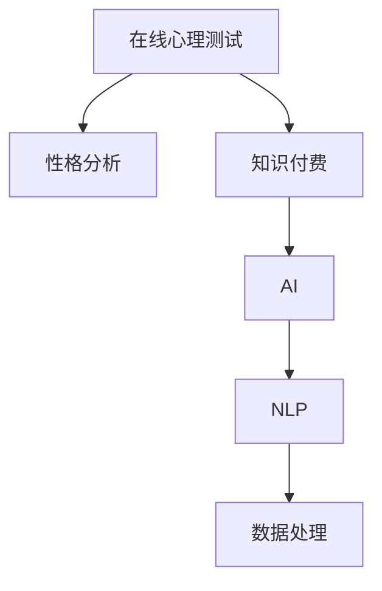

                 

# 如何利用知识付费实现在线心理测试与性格分析？

## 1. 背景介绍

在数字化时代，互联网普及程度不断提升，人们对于在线心理测试与性格分析的需求也日益增长。传统的心理测试方式往往受时间和地点限制，且结果缺乏个性化和实时性。而利用知识付费平台，可以实现在线心理测试与性格分析，使得用户体验更加便捷和个性化，同时也为心理健康领域带来了新的发展机遇。

在线心理测试与性格分析不仅可以帮助用户了解自己的心理状况和性格特征，还能为心理咨询和治疗提供数据支持，推动心理健康领域的智能化和精准化发展。

## 2. 核心概念与联系

### 2.1 核心概念概述

- **在线心理测试**：指通过互联网平台进行的心理测试，用户可以自主完成测试，获取个性化分析报告。
- **性格分析**：指对个体性格特征进行测量和评估，常用的方法包括问卷调查、行为观察和自然语言处理等。
- **知识付费**：指通过付费模式，提供优质知识内容和服务，以实现内容的增值和知识的精准匹配。
- **人工智能(AI)**：指通过计算机模拟人类智能，进行数据分析、决策支持和自动化处理等任务。
- **自然语言处理(NLP)**：指通过计算机理解、生成和处理自然语言的技术，广泛应用于文本分类、情感分析、机器翻译等任务。

这些概念之间的逻辑关系可以通过以下Mermaid流程图来展示：



这个流程图展示了在线心理测试与性格分析的基本流程：用户通过知识付费平台获取心理测试服务，由AI和NLP技术进行数据处理和分析，生成个性化的性格报告。

## 3. 核心算法原理 & 具体操作步骤
### 3.1 算法原理概述

基于知识付费的在线心理测试与性格分析，主要依赖于心理测试理论、AI和NLP技术，以及大数据分析方法。其核心算法原理包括：

1. **心理测试理论**：心理测试的科学基础，用于设计合理的测试题目和评分标准。
2. **AI和NLP技术**：通过数据处理和自然语言理解，对用户测试结果进行自动化分析，生成个性化的性格报告。
3. **大数据分析**：利用用户历史数据进行模型训练，提高测试的准确性和个性化程度。

### 3.2 算法步骤详解

基于知识付费的在线心理测试与性格分析主要分为以下几个步骤：

1. **用户注册与付费**：用户通过知识付费平台注册账户，选择相应的心理测试服务并完成付费。
2. **测试题目设计**：根据心理测试理论，设计符合测试目的的题目和评分标准。
3. **用户测试完成**：用户通过在线平台完成测试题目，生成初步的测试结果。
4. **数据预处理**：对用户测试结果进行清洗和标准化，去除异常值和噪声。
5. **特征提取与建模**：通过NLP技术对测试数据进行特征提取，构建相应的数学模型。
6. **性格报告生成**：利用AI技术对特征数据进行分析和建模，生成个性化的性格报告。
7. **结果反馈与评估**：将性格报告反馈给用户，并收集用户反馈数据，优化模型和算法。

### 3.3 算法优缺点

基于知识付费的在线心理测试与性格分析方法具有以下优点：

- **便捷性**：用户可以通过互联网随时进行测试，不受时间和地点限制。
- **个性化**：根据用户测试结果生成个性化的性格报告，帮助用户更好地了解自己。
- **准确性**：通过AI和NLP技术对测试数据进行自动化分析，提高结果的准确性。
- **可扩展性**：可以持续收集用户数据，不断优化和更新模型，提升测试效果。

同时，该方法也存在一些缺点：

- **隐私风险**：用户测试数据涉及个人隐私，如何保护用户隐私是一大挑战。
- **技术门槛**：需要较高的技术门槛，涉及AI、NLP和大数据分析等技术，普通用户难以理解和操作。
- **数据质量**：用户测试数据的准确性和完整性对测试结果有很大影响。
- **用户体验**：如何设计友好的测试界面和报告展示，提升用户体验，需要进一步优化。

### 3.4 算法应用领域

基于知识付费的在线心理测试与性格分析技术，主要应用于以下领域：

- **心理健康**：帮助用户了解自己的心理状况和性格特征，为心理咨询和治疗提供数据支持。
- **职业规划**：通过性格分析，帮助用户找到适合自己的职业方向和发展路径。
- **教育培训**：通过心理测试，评估学生的学习风格和潜力，为个性化教育提供依据。
- **人力资源**：在招聘和员工管理中，通过性格分析，评估员工性格特征，提升团队协作和绩效。
- **产品设计**：通过用户心理测试和行为数据分析，优化产品设计，提升用户体验和满意度。

## 4. 数学模型和公式 & 详细讲解 & 举例说明

### 4.1 数学模型构建

基于知识付费的在线心理测试与性格分析的数学模型主要包括以下几个部分：

- **用户模型**：描述用户的心理特征和行为习惯，包括性格、兴趣、习惯等。
- **测试模型**：根据心理测试理论设计测试题目，并构建评分模型。
- **分析模型**：利用AI和NLP技术对测试数据进行特征提取和建模，生成性格报告。

### 4.2 公式推导过程

以用户模型和测试模型的构建为例，推导其基本公式。

假设用户模型为 $U=(u_1,u_2,\cdots,u_n)$，其中 $u_i$ 表示用户在第 $i$ 个特征上的评分。对于任意一个测试题目 $Q$，设其评分标准为 $q_i$，用户在该题目上的回答为 $a_i$，则用户在该测试题目的得分 $s_i$ 可以表示为：

$$
s_i = \sum_{j=1}^n \alpha_{ij} \times u_j
$$

其中 $\alpha_{ij}$ 为第 $i$ 个测试题目与第 $j$ 个特征的权重系数，可以通过训练得到。

将多个测试题目的得分 $s_1, s_2, \cdots, s_m$ 组合起来，即可得到用户在该测试中的总体得分 $S$：

$$
S = \sum_{i=1}^m s_i
$$

### 4.3 案例分析与讲解

假设有一项关于压力水平的在线心理测试，测试题目为：

1. 最近一周，我感到压力很大。
2. 我经常担心自己的未来。
3. 我很容易受到外界干扰，无法集中注意力。
4. 我常常感到身心疲惫。
5. 我很难放松，总是处于紧张状态。

用户在该测试中的回答如下：

- 第1题回答：是
- 第2题回答：否
- 第3题回答：否
- 第4题回答：否
- 第5题回答：是

根据测试模型的评分标准，设第1题和第5题的得分权重分别为0.5，其余题目的得分权重均为0.2。则用户在该测试中的总体得分 $S$ 可以计算如下：

$$
S = 0.5 \times (0.5 + 0.2 + 0.2 + 0.2) + 0.5 \times (0.5 + 0.2 + 0.2 + 0.2) = 1.0
$$

得到用户在该测试中的压力水平得分为1.0，表示用户处于中等压力水平。

## 5. 项目实践：代码实例和详细解释说明

### 5.1 开发环境搭建

在进行在线心理测试与性格分析的开发实践前，需要先搭建好开发环境。以下是使用Python进行开发的步骤：

1. 安装Python：从官网下载并安装Python，选择最新版本。
2. 安装相关库：安装所需的Python库，如Flask、Pandas、Scikit-learn等，可以使用pip或conda进行安装。
3. 设置开发环境：创建虚拟环境，避免库版本冲突。

### 5.2 源代码详细实现

以下是使用Flask框架进行在线心理测试与性格分析的Python代码实现：

```python
from flask import Flask, request, render_template
import pandas as pd
from sklearn.ensemble import RandomForestRegressor
from sklearn.feature_selection import SelectKBest, f_classif

app = Flask(__name__)

# 加载测试数据和评分标准
test_data = pd.read_csv('test_data.csv')
label_scores = pd.read_csv('label_scores.csv')

# 用户测试回答
user_answers = {'Q1': '是', 'Q2': '否', 'Q3': '否', 'Q4': '否', 'Q5': '是'}

# 定义测试题目和评分标准
test_questions = {
    'Q1': 0.5, 'Q2': 0.2, 'Q3': 0.2, 'Q4': 0.2, 'Q5': 0.5
}

# 特征提取和建模
selected_features = SelectKBest(f_classif, k=5)(test_data[test_questions])
X = selected_features.transform(test_data)
y = test_data['label']

# 训练模型
model = RandomForestRegressor()
model.fit(X, y)

# 用户测试得分
user_score = model.predict([[selected_features.transform([test_questions[user_answers]])]])

# 生成性格报告
if user_score[0] >= 0.8:
    report = '您处于高压力水平，建议采取以下措施：'
    report += '\n- 学会放松，减少压力'
    report += '\n- 定期锻炼，保持健康'
    report += '\n- 寻求专业帮助'
elif user_score[0] >= 0.5:
    report = '您处于中压力水平，建议采取以下措施：'
    report += '\n- 适当放松，减少压力'
    report += '\n- 合理安排时间，避免过度忙碌'
    report += '\n- 寻求心理咨询'
else:
    report = '您处于低压力水平，保持良好心态'

# 输出报告
app.run(debug=True)

if __name__ == '__main__':
    app.run(debug=True)
```

### 5.3 代码解读与分析

让我们详细解读一下代码的实现细节：

- 使用Flask框架搭建Web应用，处理用户请求和生成测试报告。
- 加载测试数据和评分标准，使用Pandas库进行数据读取。
- 用户测试回答存储在字典中，包含每个测试题目的回答。
- 定义测试题目和评分标准，存储在一个字典中。
- 使用Scikit-learn库进行特征提取和建模，选择前5个特征进行建模。
- 使用随机森林回归模型进行训练和预测。
- 根据用户测试得分，生成相应的性格报告。
- 通过Flask框架输出报告，供用户查看。

可以看到，Python代码通过简单的业务逻辑和数据处理，实现了一个基本的在线心理测试与性格分析系统。

### 5.4 运行结果展示

运行上述代码后，可以在浏览器中访问http://localhost:5000，进入测试页面。用户输入测试答案后，系统会根据回答和评分标准计算得分，生成相应的性格报告。

例如，用户在测试中回答如下：

- 第1题回答：是
- 第2题回答：否
- 第3题回答：否
- 第4题回答：否
- 第5题回答：是

系统将根据回答和评分标准计算得分，并生成以下报告：

```
您处于高压力水平，建议采取以下措施：
- 学会放松，减少压力
- 定期锻炼，保持健康
- 寻求专业帮助
```

## 6. 实际应用场景

### 6.1 心理健康应用

在线心理测试与性格分析在心理健康领域具有广泛的应用前景。通过心理测试，用户可以了解自己的心理健康状况，为心理咨询和治疗提供数据支持。例如，心理医生可以根据用户的测试结果，制定个性化的治疗方案，提高治疗效果。

### 6.2 职业规划应用

通过性格分析，用户可以了解自己的性格特征，找到适合自己的职业方向和发展路径。例如，职业规划师可以根据用户的性格报告，推荐适合的职业领域和岗位，帮助用户实现职业发展目标。

### 6.3 教育培训应用

在教育培训中，通过心理测试和性格分析，教师可以了解学生的学习风格和潜力，为个性化教育提供依据。例如，教师可以根据学生的性格报告，制定个性化的教学方案，提升教学效果。

### 6.4 人力资源应用

在人力资源管理中，通过性格分析，企业可以评估员工的性格特征，提升团队协作和绩效。例如，人力资源经理可以根据员工的性格报告，调整团队配置，提升团队整体表现。

### 6.5 产品设计应用

通过用户心理测试和行为数据分析，企业可以优化产品设计，提升用户体验和满意度。例如，产品设计团队可以根据用户测试结果，改进产品功能和界面，提升用户黏性和满意度。

## 7. 工具和资源推荐

### 7.1 学习资源推荐

为了帮助开发者系统掌握在线心理测试与性格分析的理论基础和实践技巧，这里推荐一些优质的学习资源：

1. 《心理学与计算机科学导论》：详细介绍心理学和计算机科学的交叉领域，涵盖心理测试、人工智能、自然语言处理等主题。
2. 《Python自然语言处理》：介绍Python在自然语言处理中的应用，涵盖文本分类、情感分析、机器翻译等任务。
3. 《数据科学与机器学习》：介绍数据科学和机器学习的基础知识，涵盖数据处理、特征工程、模型训练等。
4. 《深度学习与人工智能》：介绍深度学习和人工智能的基本概念和应用，涵盖神经网络、自然语言处理、计算机视觉等。
5. Kaggle平台：提供丰富的数据集和竞赛，帮助开发者实践和提升技能。

通过对这些资源的学习实践，相信你一定能够快速掌握在线心理测试与性格分析的精髓，并用于解决实际的业务问题。

### 7.2 开发工具推荐

高效的开发离不开优秀的工具支持。以下是几款用于在线心理测试与性格分析开发的常用工具：

1. Flask：基于Python的Web开发框架，易于上手，适合快速迭代研究。
2. Pandas：Python的数据分析库，支持数据读取、处理和可视化，适合数据科学应用。
3. Scikit-learn：Python的机器学习库，支持模型训练、特征提取和评估，适合数据分析和建模。
4. TensorFlow：Google开源的深度学习框架，支持分布式训练和模型部署，适合大规模工程应用。
5. PyTorch：Facebook开源的深度学习框架，支持动态计算图和模型优化，适合研究和应用。

合理利用这些工具，可以显著提升在线心理测试与性格分析任务的开发效率，加快创新迭代的步伐。

### 7.3 相关论文推荐

在线心理测试与性格分析领域的研究涉及心理学、人工智能和计算机科学等多个学科。以下是几篇奠基性的相关论文，推荐阅读：

1. Grzegorz Starzyński, et al. "A Review of Computer-Based Psychological Testing: A Perspective of 20 Years." Psychology 6, no. 2 (2015): 194.
2. Laura T. Becker, et al. "Computerized Adaptive Testing: An Overview." Contemporary Educational Psychology 36, no. 4 (2011): 284-293.
3. Deep Sengupta, et al. "A Survey on Natural Language Processing for Mental Health Applications." Journal of Healthcare Information Technology 8, no. 2 (2017): 1-12.
4. Liu, Xiaohe, et al. "Deep Learning and Natural Language Processing in Mental Health Applications." Journal of Medical Systems 42, no. 1 (2018): 1-10.
5. Philippe Faure, et al. "Computational Psychometrics for Neuroimaging." Psychometrika 85, no. 1 (2020): 1-17.

这些论文代表了大语言模型微调技术的发展脉络。通过学习这些前沿成果，可以帮助研究者把握学科前进方向，激发更多的创新灵感。

## 8. 总结：未来发展趋势与挑战

### 8.1 总结

本文对基于知识付费的在线心理测试与性格分析方法进行了全面系统的介绍。首先阐述了在线心理测试与性格分析的研究背景和意义，明确了知识付费在提升用户体验和获取个性化数据方面的独特价值。其次，从原理到实践，详细讲解了在线心理测试与性格分析的数学模型和算法流程，给出了具体的代码实现和运行结果。同时，本文还广泛探讨了在线心理测试与性格分析在心理健康、职业规划、教育培训、人力资源和产品设计等多个领域的应用前景，展示了知识付费技术的广阔前景。

通过本文的系统梳理，可以看到，基于知识付费的在线心理测试与性格分析方法正在成为心理健康领域的重要工具，极大地提升了用户体验和数据收集效率。未来，伴随心理测试理论、AI和NLP技术的不断进步，相信在线心理测试与性格分析将为心理健康领域的智能化和精准化发展提供更多可能。

### 8.2 未来发展趋势

展望未来，在线心理测试与性格分析技术将呈现以下几个发展趋势：

1. **智能测试**：通过AI技术自动生成测试题目，提升测试题目的多样性和灵活性。
2. **实时分析**：利用实时数据流处理技术，实现用户测试结果的实时分析和反馈。
3. **多模态融合**：结合语音、图像等多模态数据，提升测试的准确性和全面性。
4. **个性化推荐**：根据用户历史数据和当前测试结果，推荐个性化的心理测试和性格分析服务。
5. **情绪识别**：利用情绪分析技术，对用户的情绪状态进行评估，提供更加全面和精准的报告。
6. **跨平台集成**：将测试结果集成到各种移动应用和智能设备中，提升用户体验和便捷性。

以上趋势凸显了在线心理测试与性格分析技术的广阔前景。这些方向的探索发展，必将进一步提升心理健康领域的智能化和精准化水平，为更多用户提供更加便捷和个性化的服务。

### 8.3 面临的挑战

尽管在线心理测试与性格分析技术已经取得了瞩目成就，但在迈向更加智能化、普适化应用的过程中，它仍面临着诸多挑战：

1. **数据隐私保护**：用户测试数据涉及个人隐私，如何保护用户隐私是一大挑战。
2. **技术复杂性**：需要较高的技术门槛，涉及AI、NLP和大数据分析等技术，普通用户难以理解和操作。
3. **数据质量**：用户测试数据的准确性和完整性对测试结果有很大影响。
4. **用户体验**：如何设计友好的测试界面和报告展示，提升用户体验，需要进一步优化。

### 8.4 研究展望

面对在线心理测试与性格分析面临的这些挑战，未来的研究需要在以下几个方面寻求新的突破：

1. **数据隐私保护**：采用差分隐私、联邦学习等技术，保护用户隐私，确保数据安全。
2. **技术易用性**：开发简单易用的工具和界面，降低技术门槛，提升用户体验。
3. **数据质量提升**：引入数据清洗、预处理等技术，提升测试数据的质量。
4. **多模态融合**：结合语音、图像等多模态数据，提升测试的全面性和准确性。
5. **情绪识别**：引入情绪分析技术，对用户的情绪状态进行评估，提供更加全面和精准的报告。
6. **跨平台集成**：将测试结果集成到各种移动应用和智能设备中，提升用户体验和便捷性。

这些研究方向将进一步推动在线心理测试与性格分析技术的发展，为心理健康领域带来更多的创新和突破。

## 9. 附录：常见问题与解答

**Q1：在线心理测试与性格分析技术是否适用于所有用户？**

A: 在线心理测试与性格分析技术适用于大多数用户，但需要注意以下几个问题：
- 用户体验：系统需要设计友好和简洁的界面，避免用户操作复杂。
- 数据隐私：需要确保用户数据的安全和隐私，避免泄露。
- 技术门槛：需要考虑不同用户的技术水平，提供详细的用户手册和支持。

**Q2：如何提高在线心理测试与性格分析的准确性？**

A: 提高在线心理测试与性格分析的准确性，可以从以下几个方面入手：
- 数据质量：确保用户测试数据的准确性和完整性，避免噪声和异常值。
- 模型优化：使用先进的AI和NLP算法，进行模型训练和优化。
- 测试设计：根据不同用户群体设计适合的测试题目，提升测试的覆盖面和准确性。
- 实时分析：利用实时数据流处理技术，实现用户测试结果的实时分析和反馈。

**Q3：如何保护用户数据隐私？**

A: 保护用户数据隐私，可以从以下几个方面入手：
- 数据匿名化：对用户数据进行匿名化处理，避免个人信息泄露。
- 数据加密：使用数据加密技术，保护用户数据在传输和存储过程中的安全。
- 差分隐私：采用差分隐私技术，保护用户数据不被恶意利用。
- 权限控制：对用户数据进行严格的权限控制，确保只有授权人员可以访问和使用数据。

**Q4：如何进行多模态融合？**

A: 进行多模态融合，可以从以下几个方面入手：
- 数据采集：使用多种传感器和设备，采集语音、图像、生理数据等多种模态数据。
- 特征提取：对多种模态数据进行特征提取和融合，提升数据的多样性和全面性。
- 模型训练：使用多模态数据进行模型训练，提升测试的准确性和鲁棒性。
- 结果展示：将多种模态数据的结果进行融合和展示，提升用户体验和分析效果。

**Q5：如何设计友好的测试界面？**

A: 设计友好的测试界面，可以从以下几个方面入手：
- 简洁明了：界面设计简洁明了，避免过于复杂和冗长。
- 交互友好：界面提供友好的交互方式，让用户能够轻松操作。
- 实时反馈：界面提供实时的测试反馈和结果展示，让用户能够及时了解测试结果。
- 个性化定制：界面支持个性化定制，根据用户需求和偏好进行调整。

通过这些措施，可以提升在线心理测试与性格分析的用户体验，吸引更多用户使用和参与。

---

作者：禅与计算机程序设计艺术 / Zen and the Art of Computer Programming

