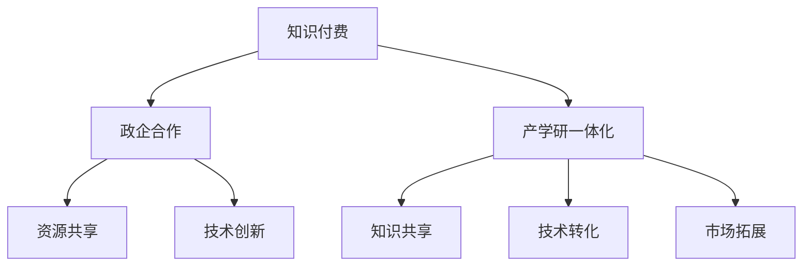

                 

# 如何利用知识付费实现政企合作与产学研一体化？

在当今数字化时代，知识付费已经成为了一种普遍现象，不仅改变了人们的消费习惯，也为政企合作与产学研一体化提供了新的途径。本文将深入探讨如何利用知识付费模式，促进政府、企业、高校和研究机构之间的深度合作，实现知识共享与创新，推动各领域的发展。

## 1. 背景介绍

### 1.1 知识付费模式的兴起

随着互联网技术的飞速发展，在线教育、在线课程、在线咨询等知识付费平台迅速崛起。知识付费模式的核心在于通过提供高质量的内容，满足用户对于知识的需求，同时实现内容创作者的收入。这种模式不仅促进了知识的传播和共享，也促进了知识的商业化应用，为政企合作与产学研一体化提供了新的可能性。

### 1.2 政企合作与产学研一体化的需求

在知识经济时代，政企合作与产学研一体化成为了推动技术创新和经济发展的关键。政府、企业、高校和研究机构通过深度合作，可以实现知识资源的优化配置，推动技术的转化和产业化，提升国家竞争力。然而，传统的合作模式往往面临资源不匹配、信息不对称、合作周期长等问题。

## 2. 核心概念与联系

### 2.1 核心概念概述

为更好地理解如何利用知识付费实现政企合作与产学研一体化，本节将介绍几个密切相关的核心概念：

- **知识付费**：通过在线平台提供专业知识和技能，用户支付一定费用获取相应服务或内容的模式。
- **政企合作**：政府与企业之间的合作，旨在实现资源共享、技术创新、市场拓展等多方面目标。
- **产学研一体化**：高校、研究机构和企业之间的深度合作，通过知识创新、技术转化和应用，推动产业升级和经济社会发展。
- **平台经济**：基于互联网平台进行知识生产和消费的经济模式，典型如在线教育、在线咨询等。

这些概念之间的关系可以通过以下Mermaid流程图来展示：



这个流程图展示了一体化过程的各个关键环节：

1. 知识付费平台提供专业知识和技能。
2. 政企合作通过知识付费平台实现资源共享和技术创新。
3. 产学研一体化借助政企合作，促进知识共享、技术转化和市场拓展。

## 3. 核心算法原理 & 具体操作步骤

### 3.1 算法原理概述

利用知识付费模式实现政企合作与产学研一体化的基本原理在于通过平台经济实现资源的高效配置。具体步骤如下：

1. **知识付费平台作为信息中介**：平台汇聚大量的专业知识和技能，通过定价机制确保内容质量和专业性。
2. **政企合作通过平台实现**：政府和企业通过平台获取所需知识和技能，同时提供资金和资源支持。
3. **产学研一体化通过平台整合**：高校和研究机构通过平台发布研究成果和技术，企业提供产业化应用场景，实现知识向产品或服务的转化。

### 3.2 算法步骤详解

实现这一过程的具体步骤如下：

**Step 1: 构建知识付费平台**

- 设计平台架构，包括用户注册、知识内容上传、支付系统、评价反馈等功能模块。
- 引入高质量内容创作者，通过合同、分成等机制激励内容生产。
- 开发API接口，便于政府和企业接入平台，实现资源共享和技术合作。

**Step 2: 政企合作对接**

- 政企双方在平台注册账号，发布合作需求。
- 平台根据需求，匹配相关知识和技能创作者。
- 政企双方通过平台进行沟通和协作，共享资源和技术，推动创新。

**Step 3: 产学研一体化推进**

- 高校和研究机构在平台上发布科研成果和技术。
- 企业对接相关项目，提供产业化应用场景。
- 高校和研究机构根据企业需求进行技术优化和调整，实现成果转化。
- 平台对转化过程进行跟踪和评估，确保合作顺利进行。

**Step 4: 持续优化**

- 收集各方反馈，优化平台功能和用户体验。
- 定期举办产学研对接会、技术研讨会等活动，促进深入交流和合作。
- 引入更多资金和政策支持，推动项目落地和产业化。

### 3.3 算法优缺点

利用知识付费模式实现政企合作与产学研一体化的优点包括：

- **高效资源配置**：平台通过市场机制实现资源的高效配置，降低合作成本。
- **多样化合作形式**：政企合作形式多样，可以灵活应对不同需求。
- **知识共享和创新**：平台促进知识共享，推动技术创新和产业化。

然而，该模式也存在一些局限性：

- **平台治理挑战**：平台需要有效管理海量内容和用户，确保内容质量和用户体验。
- **知识付费机制**：部分高质量内容可能因定价较高而难以普及。
- **技术转化风险**：部分技术可能在产业化过程中面临高成本、低收益的风险。

### 3.4 算法应用领域

知识付费模式在政企合作与产学研一体化中的应用广泛，涉及多个领域：

- **智慧城市建设**：政府和企业通过平台共享城市管理技术，推动智慧城市建设。
- **科技创新和产业化**：高校和研究机构发布技术成果，企业提供产业化场景，推动科技成果转化。
- **医疗健康服务**：政府和企业通过平台共享医疗数据和技术，提升医疗服务水平。
- **教育培训**：企业通过平台获取人才培训和技能提升服务，高校发布研究成果，推动教育发展。

## 4. 数学模型和公式 & 详细讲解 & 举例说明

### 4.1 数学模型构建

在政企合作与产学研一体化的过程中，我们可以构建一个简单的数学模型来描述这一过程：

- **平台内容供给**：设内容数量为 $C$，创作者数量为 $N$，内容质量为 $Q$，创作者收益为 $R$。
- **政企合作需求**：设政府需求为 $D_g$，企业需求为 $D_e$。
- **产学研转化率**：设转化率为 $\eta$，科技成果转化为产品或服务的比例为 $P$。

该模型可以通过以下公式表示：

$$
C = N \times Q
$$

$$
D_g + D_e = C
$$

$$
\eta = \frac{D_g + D_e}{C}
$$

$$
P = \eta \times C
$$

### 4.2 公式推导过程

- **内容供给**：平台汇聚创作者 $N$，每创作者贡献内容 $Q$，故总内容供给为 $C$。
- **政企合作需求**：政府和企业分别需求 $D_g$ 和 $D_e$，总需求应等于内容供给 $C$。
- **转化率**：政企合作需求转化为科研成果的比例为 $\eta$，再转化为产品或服务的比例为 $P$。

### 4.3 案例分析与讲解

假设某平台汇聚了100名创作者，每创作者每月贡献1000篇内容，内容质量评分为80分。政府和企业需求各为2000篇内容。

- **内容供给**：$C = 100 \times 1000 \times 80 = 800000$ 篇内容。
- **政企合作需求**：$D_g + D_e = 2000 + 2000 = 4000$ 篇内容。
- **转化率**：$\eta = \frac{4000}{800000} = 0.005$，转化为产品或服务的比例 $P = 0.005 \times 800000 = 4000$ 篇内容。

这意味着，平台通过政企合作，实现了2000篇内容需求的高效转化。

## 5. 项目实践：代码实例和详细解释说明

### 5.1 开发环境搭建

在进行知识付费平台开发前，需要准备好开发环境：

1. **选择编程语言和框架**：选择Python或JavaScript等常用编程语言，并根据需求选择合适的框架，如Django、Flask等。
2. **安装开发工具**：安装IDE、版本控制系统（如Git）、数据库（如MySQL、PostgreSQL）等。
3. **部署环境准备**：准备服务器、数据库、负载均衡等基础设施。

### 5.2 源代码详细实现

以下是一个简单的知识付费平台后端服务代码实现：

```python
from flask import Flask, request, jsonify
from flask_sqlalchemy import SQLAlchemy
from flask_marshmallow import Marshmallow
from flask_login import LoginManager, UserMixin, login_user, logout_user, login_required, current_user
from itsdangerous import URLSafeTimedSerializer

app = Flask(__name__)
app.config['SECRET_KEY'] = 'your_secret_key'
app.config['SQLALCHEMY_DATABASE_URI'] = 'sqlite:///platform.db'
app.config['SQLALCHEMY_TRACK_MODIFICATIONS'] = False

db = SQLAlchemy(app)
ma = Marshmallow(app)
login_manager = LoginManager(app)
login_manager.login_view = 'login'

class User(db.Model, UserMixin):
    id = db.Column(db.Integer, primary_key=True)
    email = db.Column(db.String(120), unique=True, nullable=False)
    password = db.Column(db.String(60), nullable=False)
    role = db.Column(db.String(20), nullable=False)

    def __init__(self, email, password, role):
        self.email = email
        self.password = password
        self.role = role

class UserSchema(ma.SQLAlchemyAutoSchema):
    class Meta:
        model = User

@login_manager.user_loader
def load_user(user_id):
    return User.query.get(int(user_id))

@app.route('/login', methods=['POST'])
def login():
    email = request.json.get('email', None)
    password = request.json.get('password', None)
    user = User.query.filter_by(email=email).first()
    if user and check_password_hash(user.password, password):
        login_user(user)
        return jsonify({'status': 'success'})
    else:
        return jsonify({'status': 'fail'})

@app.route('/logout')
@login_required
def logout():
    logout_user()
    return jsonify({'status': 'success'})

@app.route('/register', methods=['POST'])
def register():
    email = request.json.get('email', None)
    password = request.json.get('password', None)
    role = request.json.get('role', None)
    if User.query.filter_by(email=email).first() is None:
        user = User(email=email, password=generate_password_hash(password), role=role)
        db.session.add(user)
        db.session.commit()
        return jsonify({'status': 'success'})
    else:
        return jsonify({'status': 'fail'})

@app.route('/users', methods=['GET'])
@login_required
def get_users():
    users = User.query.all()
    schema = UserSchema(many=True)
    result = schema.dump(users)
    return jsonify(result)

if __name__ == '__main__':
    app.run(debug=True)
```

### 5.3 代码解读与分析

以上代码实现了一个基本的知识付费平台后端服务，包括用户注册、登录、退出、获取用户列表等功能。

- **用户模型**：定义了用户的基本信息，包括邮箱、密码和角色。
- **用户Schema**：用于序列化用户模型，便于API返回。
- **登录和注册**：通过Flask-Login模块实现用户登录和注册功能。
- **用户列表获取**：返回所有用户列表。

## 6. 实际应用场景

### 6.1 智慧城市建设

政府和企业可以通过平台共享智慧城市管理技术，实现资源的高效配置和协同创新。例如，平台可以汇聚智能交通、智慧能源、城市安全等领域的专家，通过知识付费模式，提供技术服务支持。政府和企业通过平台对接需求，推动智慧城市的建设和应用。

### 6.2 科技创新和产业化

高校和研究机构发布最新科研成果和技术，企业对接相关项目，提供产业化应用场景。平台通过市场机制匹配供需双方，推动科技成果的转化和产业化。

### 6.3 医疗健康服务

政府和企业可以通过平台共享医疗数据和技术，提升医疗服务水平。平台汇聚医疗领域的专家，通过知识付费模式，提供技术支持和咨询服务。

### 6.4 教育培训

企业通过平台获取人才培训和技能提升服务，高校发布研究成果，推动教育发展。平台通过知识付费模式，实现教育资源的优化配置。

## 7. 工具和资源推荐

### 7.1 学习资源推荐

1. **《知识付费经济学》**：该书从经济学角度探讨了知识付费模式的发展和应用，适合政策制定者和企业家阅读。
2. **《数字时代的内容创新》**：该书分析了数字时代内容创新的趋势和实践，适合内容创作者和企业管理者阅读。
3. **《平台经济的崛起》**：该书详细介绍了平台经济的发展历程和未来趋势，适合政策制定者和学术研究人员阅读。

### 7.2 开发工具推荐

1. **Flask**：轻量级Python Web框架，易于上手，适合构建知识付费平台。
2. **SQLAlchemy**：Python ORM框架，便于数据库操作和管理。
3. **Flask-Login**：Flask用户认证扩展，便于实现用户登录和注册功能。
4. **Flask-SQLAlchemy**：Flask和SQLAlchemy的集成，方便数据库操作。
5. **PyMongo**：Python MongoDB驱动程序，便于处理大规模数据存储和查询。

### 7.3 相关论文推荐

1. **《知识付费平台的经济分析》**：研究了知识付费平台的经济模型和市场机制，适合政策制定者和学术研究人员阅读。
2. **《平台经济与产业协同》**：分析了平台经济在产业协同中的应用和挑战，适合产业界和学术研究人员阅读。
3. **《知识共享与创新驱动》**：探讨了知识共享对创新的促进作用，适合政策制定者和学术研究人员阅读。

## 8. 总结：未来发展趋势与挑战

### 8.1 总结

本文详细探讨了如何利用知识付费模式实现政企合作与产学研一体化。通过构建平台经济，实现资源的高效配置和知识共享，推动各领域的创新和发展。文章从背景介绍、核心概念、算法原理、具体步骤、数学模型、项目实践等多个角度，系统阐述了知识付费模式的应用和意义。

### 8.2 未来发展趋势

未来知识付费模式将在政企合作与产学研一体化中发挥更大的作用，呈现以下发展趋势：

- **平台经济的多元化**：知识付费平台将涵盖更多领域，提供更丰富的服务和产品。
- **知识付费的普及化**：随着内容质量和版权保护的提升，知识付费将逐渐普及，促进知识的广泛传播。
- **政企合作的深化**：政府和企业将更加依赖知识付费平台，实现资源和技术的深度融合。
- **产学研一体化的加速**：高校和研究机构通过平台发布成果，企业提供产业化场景，推动技术转化和产业化。

### 8.3 面临的挑战

尽管知识付费模式在政企合作与产学研一体化中具有巨大潜力，但仍面临以下挑战：

- **平台治理的复杂性**：平台需要有效管理海量内容和用户，确保内容质量和用户体验。
- **知识付费的公平性**：部分高质量内容可能因定价较高而难以普及。
- **技术转化的风险**：部分技术可能在产业化过程中面临高成本、低收益的风险。
- **数据和隐私保护**：平台需要保护用户隐私和数据安全，避免数据泄露和滥用。

### 8.4 研究展望

未来需要在以下几个方面进行深入研究：

- **平台治理机制**：研究平台内容审核、版权保护、用户行为管理等机制，确保平台健康发展。
- **知识付费的公平性**：研究如何通过补贴、奖励等机制，促进高质量内容的普及和传播。
- **技术转化的风险控制**：研究风险评估和管理方法，确保技术转化的可行性和收益性。
- **数据和隐私保护**：研究数据加密、匿名化等技术，保护用户隐私和数据安全。

通过不断优化和创新，知识付费模式必将在政企合作与产学研一体化中发挥更大作用，推动各领域的发展和进步。

## 9. 附录：常见问题与解答

**Q1：知识付费模式如何保障内容质量？**

A: 知识付费平台通常通过市场机制和用户反馈来保障内容质量。平台采用严格的准入机制，引入高质量创作者和内容，同时设置合理的定价机制，确保内容价格与质量相匹配。用户通过评价和反馈机制，对内容进行打分和评价，平台根据用户反馈进行内容优化和调整。

**Q2：政府和企业如何通过平台实现高效合作？**

A: 政府和企业可以通过平台发布需求和资源，平台通过市场机制匹配相关内容创作者和资源提供者。政府和企业可以通过平台进行实时沟通和协作，共享数据和技术，推动创新和应用。

**Q3：产学研一体化过程中如何保护知识产权？**

A: 平台可以通过技术手段保护知识产权，如采用加密、水印等技术，确保内容的安全和可追溯性。同时，政府和企业可以通过平台签署合同，明确知识产权归属和使用范围，保护各方利益。

**Q4：平台如何应对大规模数据存储和查询需求？**

A: 平台可以采用分布式存储和计算技术，如Hadoop、Spark等，提高数据存储和查询效率。同时，采用缓存技术，如Redis、Memcached等，提高数据访问速度和响应时间。

**Q5：平台如何确保用户隐私和数据安全？**

A: 平台可以通过加密、匿名化等技术保护用户隐私和数据安全。同时，采用多层次的安全措施，如访问控制、身份验证、数据备份等，确保平台安全可靠。

