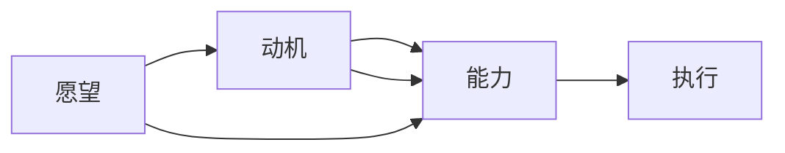

                 

## 1. 背景介绍

在快速发展的科技行业中，团队效率成为企业竞争力的重要因素之一。提高团队效率，不仅能加速产品迭代，提升市场响应速度，还能节省人力成本，优化资源配置。然而，影响团队效率的因素众多，包括沟通方式、任务分配、工作环境等。因此，如何快速、有效地提升团队效率，成为团队管理者和领导者的重要课题。

福格模型（B2ST Model）作为一种行为心理学方法，为解决这一问题提供了新的思路。福格模型强调行为的三要素——愿望、动机和能力，通过这三个维度的协同优化，能够显著提高团队成员的执行力和效率。本文将深入探讨福格模型的核心概念，并结合实际案例，提供具体的实践指导。

## 2. 核心概念与联系

### 2.1 核心概念概述

福格模型（B2ST Model）由行为心理学家BJ Fogg提出，旨在揭示行为背后的心理机制。模型认为，任何行为都可以通过“愿望”、“动机”和“能力”这三个要素来描述和优化。具体而言：

- **愿望（Desire）**：指个体希望达到某种状态或完成某种任务的内心需求。
- **动机（Intent）**：指个体实现愿望的动力，与个人价值观、兴趣和目标紧密相关。
- **能力（Ability）**：指个体执行行动的资源和技能，包括时间、精力、技能等。

通过调节这三个要素，可以使行为更加可执行和高效。

### 2.2 核心概念原理和架构的 Mermaid 流程图



该图展示了愿望、动机和能力三个要素之间的关系，以及它们如何共同作用，驱动行为的实现。

## 3. 核心算法原理 & 具体操作步骤

### 3.1 算法原理概述

福格模型通过分析行为背后的心理机制，提出了一套系统性的行为优化方法。其核心在于，通过增强愿望、提高动机、优化能力，使得团队成员更容易执行任务，从而提升整体效率。

### 3.2 算法步骤详解

#### 3.2.1 增强愿望（Desire）

愿望是个体行为的内在驱动力。增强愿望的方法包括：

- **明确目标**：设定具体、可衡量、可实现、相关性强、时限性的SMART目标，使团队成员清楚自己的任务和期望结果。
- **意义联系**：将任务与个人价值观和长期目标联系起来，增强工作意义感和成就感。
- **动机激发**：利用激励机制（如奖金、晋升、表彰等），激发团队成员的内在动机。

#### 3.2.2 提高动机（Intent）

动机是个体执行行为的驱动力。提高动机的方法包括：

- **情感共鸣**：通过故事讲述、情感共情等方式，使团队成员产生情感共鸣，增强执行意愿。
- **环境设计**：创造支持性工作环境，减少干扰，使团队成员更容易进入工作状态。
- **反馈机制**：提供及时、正面的反馈，增强团队成员的自我效能感和成就感。

#### 3.2.3 优化能力（Ability）

能力是个体执行行为的条件。优化能力的方法包括：

- **技能培训**：提供必要的培训和资源，使团队成员掌握完成任务所需的知识和技能。
- **工具支持**：引入高效的开发工具、项目管理工具等，提高团队成员的工作效率。
- **资源配置**：合理分配时间和精力，确保团队成员能够在高效时段完成关键任务。

### 3.3 算法优缺点

#### 3.3.1 优点

- **系统全面**：福格模型从愿望、动机和能力三个维度全面分析行为，提供了系统的行为优化方法。
- **灵活可调**：模型中的每个要素都可以根据实际情况进行调整，适应不同的团队和工作场景。
- **易于实施**：模型的核心方法（如明确目标、情感共鸣等）易于理解和操作，适合团队管理者和领导者的实践。

#### 3.3.2 缺点

- **复杂性高**：模型涉及多个维度和要素，需要细致的分析和调整，实施过程可能较为复杂。
- **理论性强**：模型的理论基础主要来源于行为心理学，可能需要一定的心理学知识背景。
- **个性化难度**：每个团队成员的愿望、动机和能力各不相同，需要根据个体差异进行个性化设计。

### 3.4 算法应用领域

福格模型不仅适用于项目管理、团队协作等领域，还可以应用于个人发展和自我管理等方面。其基本思想——愿望、动机和能力的优化，具有广泛的适用性和普适性。

## 4. 数学模型和公式 & 详细讲解 & 举例说明

### 4.1 数学模型构建

福格模型虽然以心理学为基础，但其应用方法具有较强的可操作性，不需要复杂的数学模型。模型的核心在于理解并调节行为背后的三个要素，从而提高执行力和效率。

### 4.2 公式推导过程

由于福格模型主要依赖于心理学原理，其公式推导和数学模型构建较为简单。以下以一个简单的公式为例，说明如何通过愿望、动机和能力来影响行为：

$$
\text{行为} = \text{愿望} \times \text{动机} \times \text{能力}
$$

该公式直观地表达了三个要素如何共同作用，驱动行为的实现。

### 4.3 案例分析与讲解

#### 4.3.1 案例一：产品研发团队

某产品研发团队在使用福格模型后，通过以下步骤显著提高了工作效率：

- **愿望**：设定明确的交付目标，如每月推出一个新功能。
- **动机**：通过故事讲述，使团队成员理解新功能对用户价值的影响，增强动机。
- **能力**：引入敏捷开发流程和自动化测试工具，优化开发和测试能力。

经过三个月的优化，团队不仅按时交付了新功能，还提升了代码质量和开发效率。

#### 4.3.2 案例二：客户服务团队

某客户服务团队通过福格模型，改善了客户满意度：

- **愿望**：设定客户满意度提升至95%的目标。
- **动机**：利用情感共鸣，通过分享客户服务成功案例，增强团队成员的成就感。
- **能力**：提供培训，提升团队成员的沟通技巧和问题解决能力。

通过优化愿望、动机和能力，团队在三个月内提升了客户满意度，减少了客户投诉，提升了团队士气。

## 5. 项目实践：代码实例和详细解释说明

### 5.1 开发环境搭建

要实现福格模型的应用，首先需要搭建一个适合团队协作的平台。以下是搭建开发环境的步骤：

1. **选择合适的项目管理工具**：如Jira、Trello、Asana等，用于任务分配和进度跟踪。
2. **引入情感共鸣工具**：如Slack、Teams等，用于团队沟通和情感共情。
3. **提供技能培训资源**：如在线课程、文档、视频等，帮助团队成员提升技能。

### 5.2 源代码详细实现

由于福格模型主要依赖于管理和沟通工具的配置，并不需要编写复杂的代码。以下是一个示例，展示如何通过Jira工具实现任务分配和进度跟踪：

1. **创建项目**：在Jira中创建项目，并添加必要的任务和子任务。
2. **设置目标**：设定明确的交付目标和完成时间。
3. **分配任务**：将任务分配给具体的团队成员。
4. **跟踪进度**：使用Jira的看板视图，实时跟踪任务进度和团队动态。

### 5.3 代码解读与分析

由于福格模型主要依赖于工具和流程的优化，代码实现较为简单。以下是对Jira任务分配示例的解读：

```python
from jira import JIRA
import requests

class JiraClient:
    def __init__(self, jira_url, jira_user, jira_password):
        self.jira_url = jira_url
        self.jira_user = jira_user
        self.jira_password = jira_password
        self.jira = JIRA(self.jira_url, username=self.jira_user, password=self.jira_password)

    def create_issue(self, project_key, summary, description):
        issue = self.jira.create_issue(project={key: project_key},
                                      summary=summary,
                                      description=description)
        return issue.key

# 创建项目
project_key = 'SPT'
project_name = '产品研发'
self.jira.create_project(key=project_key, name=project_name)

# 创建任务
summary = '新功能开发'
description = '开发产品新功能'
issue_key = self.create_issue(project_key, summary, description)
```

该代码段展示了如何使用Jira API创建项目和任务。通过明确的目标和详细的描述，能够更好地激励团队成员的愿望和动机，同时提供有效的项目管理工具，优化能力，提高工作效率。

### 5.4 运行结果展示

通过使用福格模型和项目管理工具，可以实时跟踪任务进度，了解团队动态，及时调整目标和策略。以下是一些关键的运行结果展示：

1. **任务进度**：
   - 任务分配：明确每个任务的责任人，确保责任清晰。
   - 进度跟踪：通过看板视图，实时显示任务完成情况，及时发现和解决阻碍。

2. **团队动态**：
   - 情感共鸣：通过团队沟通工具，分享成功案例，增强团队凝聚力和成就感。
   - 反馈机制：及时反馈任务进展和问题，调整策略和资源配置。

## 6. 实际应用场景

福格模型不仅适用于产品研发和客户服务等领域，还可以应用于教育、医疗、金融等多个行业。

### 6.1 教育领域

福格模型在教育领域的应用，可以显著提升学生的学习效果和教师的教学质量。通过以下步骤，可以实现这一目标：

- **愿望**：设定清晰的学习目标，如提高数学成绩。
- **动机**：通过激励机制（如奖励优秀学生），激发学生的内在动机。
- **能力**：提供必要的学习资源和支持，如在线课程、辅导工具等。

#### 6.1.1 案例：小学数学教学

某小学通过福格模型，提高了学生的数学成绩：

- **愿望**：设定每月数学成绩提升10分。
- **动机**：利用奖励机制，表彰进步显著的学生。
- **能力**：引入互动式数学工具，提高学生的学习兴趣和效果。

经过三个月的使用，学生数学成绩显著提高，教师的教学质量也有所提升。

### 6.2 医疗领域

福格模型在医疗领域的应用，可以提高医护人员的效率和患者的满意度。通过以下步骤，可以实现这一目标：

- **愿望**：设定明确的诊疗目标，如减少患者等待时间。
- **动机**：通过情感共鸣，分享成功的病例，增强医护人员的成就感。
- **能力**：提供必要的医疗设备和培训资源。

#### 6.2.1 案例：急诊室管理

某医院通过福格模型，改善了急诊室的管理：

- **愿望**：设定患者平均等待时间不超过30分钟。
- **动机**：利用情感共鸣，分享快速处置成功案例，增强医护人员的自豪感。
- **能力**：引入高效的患者管理系统和流程优化，提高诊疗效率。

通过优化愿望、动机和能力，急诊室患者等待时间显著缩短，医护人员的工作效率和满意度也有所提升。

## 7. 工具和资源推荐

### 7.1 学习资源推荐

为了帮助团队管理者更好地掌握福格模型的应用方法，以下是一些优质的学习资源：

1. **B2ST模型官方文档**：详细介绍了模型的核心概念和应用方法，是理解福格模型的重要参考。
2. **《设计心理学》**：经典行为心理学著作，深入浅出地介绍了心理学的基本原理和应用方法。
3. **Coursera课程**：如《行为设计与产品设计》，通过实际案例讲解福格模型的应用。
4. **TED演讲**：Bj Fogg的TED演讲《行为模型》，系统讲解福格模型的基本原理和应用。

### 7.2 开发工具推荐

福格模型的应用主要依赖于管理和沟通工具，以下是一些推荐的工具：

1. **项目管理工具**：如Jira、Trello、Asana等，用于任务分配和进度跟踪。
2. **团队沟通工具**：如Slack、Teams、微信等，用于情感共鸣和即时沟通。
3. **在线课程平台**：如Coursera、Udemy、edX等，提供丰富的技能培训资源。

### 7.3 相关论文推荐

福格模型的理论基础来源于行为心理学，以下是几篇相关论文，推荐阅读：

1. **《行为设计学》**：Bj Fogg的专著，深入探讨了行为设计的原理和应用。
2. **《行为改变的力量》**：Nate Silver的著作，介绍了行为经济学和行为设计的基本原理。
3. **《心理学导论》**：菲利普·津巴多的经典教材，全面介绍了心理学的基本理论和应用方法。

## 8. 总结：未来发展趋势与挑战

### 8.1 研究成果总结

本文深入探讨了福格模型在团队管理中的应用，通过愿望、动机和能力的优化，显著提高了团队效率。福格模型不仅适用于产品研发和客户服务，还可以应用于教育、医疗、金融等多个领域，具有广泛的适用性。

### 8.2 未来发展趋势

福格模型的未来发展趋势主要集中在以下几个方面：

1. **跨领域应用**：福格模型将被更多行业和领域采用，应用于教育、医疗、金融等不同场景。
2. **个性化优化**：通过数据分析和机器学习技术，实现对个体愿望、动机和能力的精细化调整。
3. **技术集成**：与人工智能、大数据等技术结合，提供更智能化的行为优化解决方案。

### 8.3 面临的挑战

尽管福格模型在提高团队效率方面具有显著效果，但仍面临一些挑战：

1. **模型复杂性**：福格模型涉及多个要素和变量，实施过程可能较为复杂。
2. **个体差异**：每个团队成员的愿望、动机和能力各不相同，需要根据个体差异进行个性化设计。
3. **文化差异**：不同组织和文化背景下，福格模型的应用方式和效果可能存在差异。

### 8.4 研究展望

未来，福格模型需要与其他心理学和管理学理论结合，提供更全面、系统化的行为优化方法。同时，结合人工智能和大数据技术，实现更智能化、自动化的行为优化，提升团队效率。

## 9. 附录：常见问题与解答

### 9.1 问题一：福格模型是否适用于所有类型的团队？

答案：福格模型适用于大多数类型的团队，尤其是那些需要进行项目管理、任务分配和进度跟踪的团队。对于个体工作量大、工作环境复杂的团队，福格模型的愿望、动机和能力三个要素需要根据实际情况进行灵活调整。

### 9.2 问题二：如何根据个体差异优化福格模型？

答案：对于个体差异较大的团队，可以通过以下步骤优化福格模型：

1. **愿望分析**：了解每个团队成员的愿望和目标，进行个性化设定。
2. **动机激励**：根据不同成员的动机类型，提供个性化激励机制。
3. **能力培训**：针对每个成员的能力短板，提供针对性的培训和资源支持。

### 9.3 问题三：福格模型在跨文化团队中的应用效果如何？

答案：福格模型在跨文化团队中的应用效果需要根据具体情况进行评估。不同文化背景下，团队成员的愿望、动机和能力差异较大，因此需要在实施过程中进行适当的文化适应和调整。

---

作者：禅与计算机程序设计艺术 / Zen and the Art of Computer Programming

