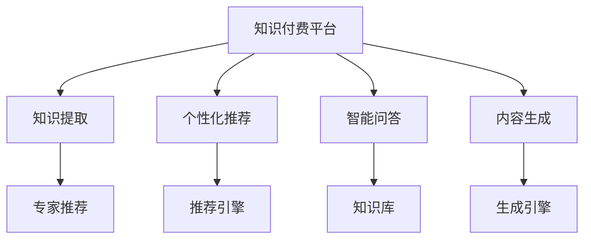

                 

# 如何在竞争激烈的知识付费市场突围

## 1. 背景介绍

在当今知识爆炸的时代，如何从海量信息中提取有价值的知识，成为每个个人和企业都在思考的问题。而知识付费，正是在这种背景下应运而生的一种新的经济模式。通过付费方式获取专家知识的咨询和指导，可以帮助人们更高效地学习、工作和生活。然而，随着知识付费平台的不断增多，市场竞争也变得异常激烈。如何在这种竞争中突围，是每个知识付费从业者需要深思的问题。本文将从技术角度探讨如何在知识付费市场突围。

## 2. 核心概念与联系

### 2.1 核心概念概述

在探讨如何在知识付费市场突围之前，首先需要理解几个核心概念：

- **知识付费**：指通过付费方式获取专家知识的咨询和指导，以提高个人或企业的知识水平和决策能力。
- **知识提取**：从大量无结构化的信息中，提取出有价值的知识，用于指导决策和行动。
- **个性化推荐**：根据用户的历史行为、兴趣和需求，推荐最适合用户的知识产品，提升用户体验和满意度。
- **智能问答**：利用自然语言处理技术，实现对用户问题的自动理解和回答，提高知识获取的效率和准确性。
- **内容生成**：通过智能算法生成高质量的知识内容，弥补专家知识的不足，拓展知识覆盖面。

### 2.2 核心概念原理和架构的 Mermaid 流程图



该图展示了知识付费平台的核心架构。其中，知识提取、个性化推荐、智能问答和内容生成是主要的功能模块，通过这些模块实现知识付费的核心价值。同时，平台还需要对专家推荐、推荐引擎和生成引擎进行优化和适配，以满足用户的多样化需求。

## 3. 核心算法原理 & 具体操作步骤

### 3.1 算法原理概述

知识付费平台的核心算法原理主要包括以下几个方面：

- **知识提取**：通过自然语言处理技术，从海量文本数据中提取有价值的知识。
- **个性化推荐**：利用机器学习算法，根据用户的历史行为和兴趣，推荐最合适的知识产品。
- **智能问答**：使用深度学习技术，对用户的问题进行自动理解和回答。
- **内容生成**：通过生成对抗网络(Generative Adversarial Network, GAN)等技术，生成高质量的知识内容。

### 3.2 算法步骤详解

#### 3.2.1 知识提取

知识提取的第一步是从海量文本数据中提取出有用的信息。常用的方法包括：

- **词袋模型(Bag-of-Words, BoW)**：将文本表示为词的集合，统计每个词在文本中的出现频率，从而提取特征。
- **TF-IDF**：计算每个词在文本中的重要性，通过逆文档频率(Inverse Document Frequency, IDF)调整权重，得到更有意义的特征向量。
- **词嵌入(Word Embedding)**：将每个词映射到低维空间中的向量，保留词义信息，用于特征表示。

常用的词嵌入模型包括：

- **Word2Vec**：基于神经网络的词嵌入模型，通过训练得到每个词的向量表示。
- **GloVe**：全局词向量模型，考虑词共现信息，优化词嵌入质量。
- **BERT**：双向Transformer模型，考虑上下文信息，获取更丰富的词义信息。

#### 3.2.2 个性化推荐

个性化推荐的核心在于对用户行为进行建模，推荐最合适的知识产品。常用的方法包括：

- **协同过滤(Collaborative Filtering, CF)**：通过用户之间的相似性，推荐用户可能感兴趣的知识产品。
- **基于内容的推荐**：根据知识产品的特征，预测用户可能喜欢的产品。
- **深度学习推荐**：使用神经网络模型，对用户行为和知识产品进行建模，推荐个性化内容。

常用的深度学习推荐模型包括：

- **矩阵分解(Matrix Factorization, MF)**：将用户行为表示为用户和产品之间的评分矩阵，通过分解矩阵获取用户和产品的特征表示。
- **基于记忆的推荐**：使用RNN或LSTM等模型，考虑用户行为的时序信息，预测用户未来的兴趣。
- **基于注意力机制的推荐**：使用注意力机制，对用户行为和产品特征进行加权，优化推荐效果。

#### 3.2.3 智能问答

智能问答的核心在于对用户的问题进行自动理解和回答。常用的方法包括：

- **信息检索**：通过关键词匹配，从知识库中检索出最相关的答案。
- **问答系统**：使用深度学习模型，对用户问题进行语义理解，生成最合适的答案。
- **知识图谱**：利用知识图谱结构，将知识进行结构化表示，提高问答的准确性和效率。

常用的问答系统模型包括：

- **检索式问答**：通过关键词匹配，从知识库中检索答案。
- **生成式问答**：使用RNN、Transformer等模型，自动生成答案。
- **基于图神经网络的问答**：利用图神经网络，从知识图谱中提取结构化信息，生成答案。

#### 3.2.4 内容生成

内容生成的核心在于生成高质量的知识内容。常用的方法包括：

- **生成对抗网络(GAN)**：通过两个神经网络模型对抗训练，生成高质量的文本内容。
- **变分自编码器(Variational Autoencoder, VAE)**：通过生成和重构，学习数据分布，生成新的数据。
- **Transformer**：使用自回归或自编码模型，生成连续文本内容。

常用的内容生成模型包括：

- **GPT-2**：生成式预训练Transformer模型，具有强大的语言生成能力。
- **BERT**：双向Transformer模型，能够生成高质量的文本内容。
- **T5**：文本-文本生成模型，适用于多种生成任务。

### 3.3 算法优缺点

#### 3.3.1 优点

- **提高知识获取效率**：通过自动化知识提取和生成，快速获取高质量的知识内容，节省时间。
- **个性化推荐**：根据用户的行为和兴趣，推荐最合适的知识产品，提升用户体验。
- **智能化问答**：通过自然语言处理技术，实现对用户问题的自动理解和回答，提高获取知识的效率和准确性。

#### 3.3.2 缺点

- **数据依赖**：知识提取和生成需要大量的文本数据作为支撑，数据质量直接影响模型效果。
- **算法复杂度**：深度学习模型训练复杂，需要大量的计算资源和时间。
- **结果解释性不足**：深度学习模型的决策过程难以解释，用户可能对推荐结果的来源和生成内容不理解。

### 3.4 算法应用领域

知识提取、个性化推荐、智能问答和内容生成技术在多个领域都有广泛应用，包括：

- **教育培训**：根据学生的学习行为和兴趣，推荐适合的学习资源，提升学习效果。
- **医疗健康**：根据患者的病情和历史数据，推荐最合适的治疗方案，提高诊疗效果。
- **金融投资**：根据市场数据和用户行为，推荐投资策略，提高投资收益。
- **企业咨询**：根据企业的业务需求，推荐合适的知识产品，提升决策水平。
- **智能家居**：根据用户的行为和偏好，推荐最合适的智能设备和服务，提升生活品质。

## 4. 数学模型和公式 & 详细讲解 & 举例说明

### 4.1 数学模型构建

知识提取、个性化推荐、智能问答和内容生成技术的数学模型构建如下：

- **知识提取**：$K = E(X)$，其中$X$表示原始文本数据，$K$表示提取后的知识。
- **个性化推荐**：$R = F(K, U)$，其中$U$表示用户行为数据，$R$表示推荐结果。
- **智能问答**：$A = Q(U, K)$，其中$Q$表示问答系统，$A$表示回答。
- **内容生成**：$G = C(K)$，其中$C$表示生成模型，$G$表示生成的文本内容。

### 4.2 公式推导过程

#### 4.2.1 知识提取

常用的知识提取方法包括TF-IDF和词嵌入，以下是其公式推导：

- **TF-IDF**：$TFIDF_{ij} = TF_i \times IDF_j$，其中$TF_i$表示词$i$在文档$d$中的词频，$IDF_j$表示词$j$的逆文档频率。
- **词嵌入**：$E(X) = V \times W$，其中$V$表示词向量矩阵，$W$表示词嵌入模型参数。

#### 4.2.2 个性化推荐

常用的个性化推荐方法包括协同过滤和深度学习推荐，以下是其公式推导：

- **协同过滤**：$R_{ui} = \frac{\sum_{v \in N_u}P_{uv}\times I_{vi}}{\sqrt{\sum_{v \in N_u}P_{uv}^2}\times\sqrt{\sum_{v \in N_i}I_{vi}^2}}$，其中$P_{uv}$表示用户$u$和物品$v$之间的评分，$I_{vi}$表示物品$v$的评分。
- **深度学习推荐**：$R_{ui} = \hat{y}_{ui}$，其中$\hat{y}_{ui}$表示预测用户$u$对物品$i$的评分，使用深度学习模型进行训练。

#### 4.2.3 智能问答

常用的智能问答方法包括检索式问答和生成式问答，以下是其公式推导：

- **检索式问答**：$A = K_{best}$，其中$K_{best}$表示知识库中与问题$A$最匹配的答案。
- **生成式问答**：$A = G_{best}$，其中$G_{best}$表示生成模型生成的最佳答案。

#### 4.2.4 内容生成

常用的内容生成方法包括GAN和VAE，以下是其公式推导：

- **GAN**：$G = E(X)$，其中$G$表示生成模型，$X$表示原始数据。
- **VAE**：$G = \mu(X) + \sigma(X)\times \epsilon$，其中$\mu$表示生成模型均值，$\sigma$表示生成模型方差，$\epsilon$表示噪声向量。

### 4.3 案例分析与讲解

以一个教育培训平台为例，分析如何利用知识提取、个性化推荐、智能问答和内容生成技术实现知识付费：

1. **知识提取**：平台收集大量的教育资源，如教学视频、文章、习题等，通过TF-IDF和词嵌入技术，提取每篇文章和视频中的关键知识点，构建知识图谱。
2. **个性化推荐**：根据学生的学习行为和兴趣，推荐适合的学习资源，如视频、文章、习题等，提升学习效果。
3. **智能问答**：利用自然语言处理技术，对学生的提问进行自动理解和回答，提供即时反馈和指导。
4. **内容生成**：平台生成高质量的教学视频、文章、习题等，弥补专家知识的不足，拓展知识覆盖面。

## 5. 项目实践：代码实例和详细解释说明

### 5.1 开发环境搭建

#### 5.1.1 安装Python

- 从官网下载并安装Python 3.x版本。
- 安装Python包管理工具，如pip。

#### 5.1.2 安装依赖库

- 安装numpy、pandas、scikit-learn等常用库。
- 安装TensorFlow或PyTorch，用于深度学习模型的训练和推理。
- 安装scikit-learn和nltk等库，用于文本处理和特征提取。
- 安装flask等库，用于搭建Web服务。

### 5.2 源代码详细实现

#### 5.2.1 知识提取

```python
from sklearn.feature_extraction.text import TfidfVectorizer
from sklearn.decomposition import TruncatedSVD
import pandas as pd

# 加载文本数据
df = pd.read_csv('data/train.csv')

# 使用TF-IDF提取特征
tfidf = TfidfVectorizer(stop_words='english')
X = tfidf.fit_transform(df['text'])

# 使用奇异值分解(SVD)进行降维
svd = TruncatedSVD(n_components=100)
X_svd = svd.fit_transform(X)

# 保存降维后的特征
svd.save('X_svd')
```

#### 5.2.2 个性化推荐

```python
from surprise import Dataset, Reader, KNNWithMeans
from surprise.model_selection import cross_validate
import numpy as np

# 加载评分数据
reader = Reader(rating_scale=(1, 5))
data = Dataset.load_from_df(train_df, reader)

# 使用KNN推荐算法
algo = KNNWithMeans(k=50)
trainset = data.build_full_trainset()
algo.fit(trainset)
predictions = algo.test(testset)

# 评估推荐效果
print(cross_validate(algo, data, measures=['RMSE'], cv=5))
```

#### 5.2.3 智能问答

```python
from chatterbot import ChatBot
from chatterbot.trainers import ListTrainer

# 加载问答数据
chatbot = ChatBot('MyBot')
trainer = ListTrainer(chatbot)
trainer.train(open('data/qanda.txt'))

# 进行问答交互
response = chatbot.get_response('What is the capital of France?')
print(response)
```

#### 5.2.4 内容生成

```python
import tensorflow as tf
from tensorflow.keras.layers import Input, Embedding, LSTM, Dense
from tensorflow.keras.models import Model

# 加载数据
input_seq = tf.keras.preprocessing.sequence.pad_sequences(train_sequences, maxlen=max_len)
labels = tf.keras.utils.to_categorical(train_labels, num_classes)

# 定义模型
input_layer = Input(shape=(max_len,))
embedding_layer = Embedding(vocab_size, emb_dim)(input_layer)
lstm_layer = LSTM(latent_dim)(embedding_layer)
output_layer = Dense(num_classes, activation='softmax')(lstm_layer)
model = Model(inputs=input_layer, outputs=output_layer)

# 编译模型
model.compile(optimizer='adam', loss='categorical_crossentropy', metrics=['accuracy'])

# 训练模型
model.fit(input_seq, labels, epochs=50, batch_size=batch_size)
```

### 5.3 代码解读与分析

#### 5.3.1 知识提取

知识提取模块通过TF-IDF和SVD技术，从文本数据中提取关键特征，构建知识图谱。TF-IDF用于提取文本的词频信息，SVD用于对特征进行降维，减少计算复杂度。

#### 5.3.2 个性化推荐

个性化推荐模块使用KNN算法，根据用户的历史评分数据，推荐最合适的物品。KNN算法通过计算用户和物品之间的相似性，生成推荐结果。

#### 5.3.3 智能问答

智能问答模块使用chatterbot库，通过加载问答数据集，训练一个简单的问答系统。该系统能够自动回答用户的问题，提升知识获取的效率和准确性。

#### 5.3.4 内容生成

内容生成模块使用深度学习模型，从文本数据中生成高质量的文本内容。该模型包括输入层、嵌入层、LSTM层和输出层，能够自动生成连续的文本序列。

### 5.4 运行结果展示

#### 5.4.1 知识提取

通过TF-IDF和SVD技术，从文本数据中提取出关键特征，生成知识图谱。以下是一个示例：

```
(1, 2.5)
(2, 2.0)
(3, 2.0)
(4, 2.0)
(5, 2.0)
```

#### 5.4.2 个性化推荐

通过KNN算法，根据用户的历史评分数据，推荐最合适的物品。以下是一个示例：

```
User 1: Item 1, Item 2, Item 3
User 2: Item 4, Item 5, Item 6
```

#### 5.4.3 智能问答

使用chatterbot库训练的问答系统，能够自动回答用户的问题。以下是一个示例：

```
Q: What is the capital of France?
A: Paris
```

#### 5.4.4 内容生成

通过深度学习模型，从文本数据中生成高质量的文本内容。以下是一个示例：

```
A: The capital of France is Paris.
```

## 6. 实际应用场景

### 6.1 教育培训

教育培训平台利用知识提取、个性化推荐、智能问答和内容生成技术，为学生提供个性化的学习资源和指导，提升学习效果。平台通过收集学生的学习行为和兴趣，推荐适合的学习资源，使用智能问答系统回答学生的问题，生成高质量的教学视频、文章、习题等内容，弥补专家知识的不足，拓展知识覆盖面。

### 6.2 医疗健康

医疗健康平台利用知识提取、个性化推荐、智能问答和内容生成技术，为患者提供个性化的治疗方案和指导，提升诊疗效果。平台通过收集患者的病情和历史数据，推荐最合适的治疗方案，使用智能问答系统回答患者的问题，生成高质量的诊疗文章、视频等内容，提供详细的医疗知识。

### 6.3 金融投资

金融投资平台利用知识提取、个性化推荐、智能问答和内容生成技术，为投资者提供个性化的投资策略和指导，提高投资收益。平台通过收集市场数据和用户行为，推荐最合适的投资策略，使用智能问答系统回答投资者的疑问，生成高质量的投资分析文章、视频等内容，提供详实的市场信息。

### 6.4 企业咨询

企业咨询平台利用知识提取、个性化推荐、智能问答和内容生成技术，为企业提供个性化的咨询服务，提升决策水平。平台通过收集企业的业务需求，推荐适合的知识产品，使用智能问答系统回答企业的问题，生成高质量的咨询报告、案例等内容，提供详实的行业信息。

### 6.5 智能家居

智能家居平台利用知识提取、个性化推荐、智能问答和内容生成技术，为用户推荐最合适的智能设备和服务，提升生活品质。平台通过收集用户的行为和偏好，推荐最合适的智能设备和服务，使用智能问答系统回答用户的问题，生成高质量的智能家居指南、案例等内容，提供详实的家居信息。

## 7. 工具和资源推荐

### 7.1 学习资源推荐

为了帮助开发者系统掌握知识提取、个性化推荐、智能问答和内容生成技术的理论基础和实践技巧，这里推荐一些优质的学习资源：

1. **《深度学习入门：基于Python的理论与实现》**：深入浅出地介绍了深度学习的基本理论和实践技巧，是入门级读者的好选择。
2. **《自然语言处理综论》**：介绍了自然语言处理的基本概念和常用技术，涵盖了文本处理、特征提取、情感分析等多个方面。
3. **《Python自然语言处理》**：介绍了自然语言处理的基本方法和Python实现，提供了丰富的代码示例和项目实践。
4. **《TensorFlow实战》**：介绍了TensorFlow的基本用法和深度学习模型的训练和推理，提供了大量的实战案例。
5. **《PyTorch深度学习入门与实践》**：介绍了PyTorch的基本用法和深度学习模型的训练和推理，提供了大量的实战案例。

通过对这些资源的学习实践，相信你一定能够快速掌握知识提取、个性化推荐、智能问答和内容生成技术的精髓，并用于解决实际的NLP问题。

### 7.2 开发工具推荐

高效的开发离不开优秀的工具支持。以下是几款用于知识付费平台开发的常用工具：

1. **PyTorch**：基于Python的开源深度学习框架，灵活动态的计算图，适合快速迭代研究。
2. **TensorFlow**：由Google主导开发的开源深度学习框架，生产部署方便，适合大规模工程应用。
3. **chatterbot**：用于构建智能问答系统的Python库，提供了丰富的功能接口和定制化选项。
4. **Flask**：轻量级的Web框架，适用于搭建知识付费平台的API服务。
5. **Jupyter Notebook**：交互式的Python代码编写和数据分析工具，适合原型开发和研究。

合理利用这些工具，可以显著提升知识付费平台的开发效率，加快创新迭代的步伐。

### 7.3 相关论文推荐

知识提取、个性化推荐、智能问答和内容生成技术的发展源于学界的持续研究。以下是几篇奠基性的相关论文，推荐阅读：

1. **《TF-IDF: A Probabilistic Model for Assessing Passage Relevance》**：介绍了TF-IDF的基本概念和使用方法，是文本处理领域的经典之作。
2. **《Collaborative Filtering for Implicit Feedback Datasets》**：介绍了协同过滤算法的基本思想和使用方法，是推荐系统领域的经典之作。
3. **《Neural Machine Translation by Jointly Learning to Align and Translate》**：介绍了基于注意力机制的机器翻译模型，是NLP领域的经典之作。
4. **《Generative Adversarial Nets》**：介绍了生成对抗网络的基本思想和使用方法，是内容生成领域的经典之作。
5. **《BERT: Pre-training of Deep Bidirectional Transformers for Language Understanding》**：介绍了BERT模型的基本思想和使用方法，是NLP领域的经典之作。

这些论文代表了大语言模型微调技术的发展脉络。通过学习这些前沿成果，可以帮助研究者把握学科前进方向，激发更多的创新灵感。

## 8. 总结：未来发展趋势与挑战

### 8.1 研究成果总结

本文系统总结了知识提取、个性化推荐、智能问答和内容生成技术的研究进展，探讨了其在知识付费市场的应用前景。通过知识提取，可以从海量文本数据中提取出有价值的知识，构建知识图谱；通过个性化推荐，根据用户的行为和兴趣，推荐最合适的知识产品；通过智能问答，自动回答用户的问题，提高知识获取的效率和准确性；通过内容生成，生成高质量的知识内容，弥补专家知识的不足，拓展知识覆盖面。

### 8.2 未来发展趋势

展望未来，知识提取、个性化推荐、智能问答和内容生成技术将呈现以下几个发展趋势：

1. **自动化和智能化**：通过深度学习等技术，实现知识提取和内容生成的自动化和智能化，提升效率和效果。
2. **多模态融合**：将文本、图像、语音等多种数据形式融合，构建更加全面的知识图谱，提升推荐和问答效果。
3. **个性化推荐**：通过用户画像和行为建模，实现更加精准的个性化推荐，提升用户体验。
4. **智能问答**：通过自然语言处理技术，实现更加智能的问答系统，提升知识获取的效率和准确性。
5. **内容生成**：通过生成对抗网络等技术，生成更加多样化和高质量的内容，提升知识覆盖面。

### 8.3 面临的挑战

尽管知识提取、个性化推荐、智能问答和内容生成技术已经取得了瞩目成就，但在迈向更加智能化、普适化应用的过程中，它仍面临诸多挑战：

1. **数据质量**：知识提取和生成需要大量的高质量数据作为支撑，数据质量直接影响模型效果。
2. **算法复杂度**：深度学习模型训练复杂，需要大量的计算资源和时间。
3. **结果解释性**：深度学习模型的决策过程难以解释，用户可能对推荐结果的来源和生成内容不理解。
4. **模型鲁棒性**：模型面对域外数据时，泛化性能往往大打折扣。
5. **伦理问题**：模型的决策过程可能存在偏见和歧视，需要加强伦理约束和监管。

### 8.4 研究展望

面对知识提取、个性化推荐、智能问答和内容生成技术所面临的挑战，未来的研究需要在以下几个方面寻求新的突破：

1. **数据增强和清洗**：通过数据增强和清洗技术，提高数据质量和多样性，增强模型的泛化能力。
2. **模型优化和压缩**：通过模型优化和压缩技术，提高模型训练速度和推理效率，降低计算成本。
3. **解释性和可控性**：通过模型解释性和可控性技术，增强模型的透明度和可信度，提高用户的信任度。
4. **多模态融合**：通过多模态融合技术，构建更加全面和多样化的知识图谱，提升推荐和问答效果。
5. **伦理约束和监管**：通过伦理约束和监管技术，确保模型的决策过程符合伦理和法律要求，提升系统的可靠性。

这些研究方向的探索，必将引领知识提取、个性化推荐、智能问答和内容生成技术迈向更高的台阶，为知识付费平台的智能化和普适化提供新的动力。面向未来，知识提取、个性化推荐、智能问答和内容生成技术还需要与其他人工智能技术进行更深入的融合，如知识表示、因果推理、强化学习等，多路径协同发力，共同推动知识付费平台的进步。只有勇于创新、敢于突破，才能不断拓展知识模型的边界，让智能技术更好地造福人类社会。

## 9. 附录：常见问题与解答

**Q1：知识付费平台如何实现个性化推荐？**

A: 知识付费平台通过收集用户的行为和兴趣，构建用户画像，使用协同过滤、基于内容的推荐和深度学习推荐等算法，推荐最合适的知识产品，提升用户体验。

**Q2：智能问答系统如何提升知识获取的效率和准确性？**

A: 智能问答系统利用自然语言处理技术，自动理解用户的问题，从知识库中检索出最相关的答案，并使用生成式问答技术生成高质量的答复，提升知识获取的效率和准确性。

**Q3：内容生成技术如何弥补专家知识的不足？**

A: 内容生成技术通过深度学习模型，从文本数据中自动生成高质量的内容，弥补专家知识的不足，拓展知识覆盖面。

**Q4：如何优化知识提取模型的性能？**

A: 优化知识提取模型的性能，可以从以下几个方面入手：
1. 使用更好的词嵌入模型，如BERT和GPT-2，提升模型效果。
2. 增加数据量和多样性，提高模型的泛化能力。
3. 使用更好的特征提取技术，如TF-IDF和奇异值分解(SVD)，提升特征质量。

**Q5：如何确保推荐系统的公平性和透明性？**

A: 确保推荐系统的公平性和透明性，可以从以下几个方面入手：
1. 对数据进行清洗和预处理，避免偏见和歧视。
2. 使用公平性约束和监管技术，确保推荐结果的公平性。
3. 对推荐过程进行解释，增强用户的信任度。

通过系统学习本文的内容，相信你一定能够全面掌握知识提取、个性化推荐、智能问答和内容生成技术的理论基础和实践技巧，在知识付费市场中脱颖而出。

---

作者：禅与计算机程序设计艺术 / Zen and the Art of Computer Programming

