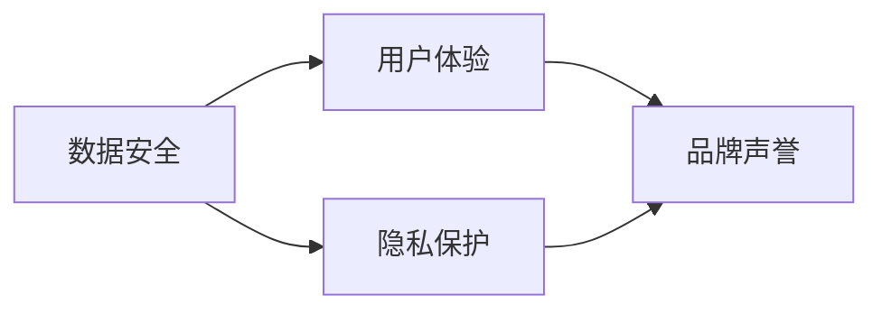

                 

# 如何在自动化创业中建立用户信任

在自动化领域，创业公司要想在竞争激烈的市场中脱颖而出，必须建立和维护用户的信任。这不仅需要技术创新和产品质量的保证，还需要对用户体验、隐私保护和品牌声誉等方面进行综合考虑。本文将从技术、商业和伦理三个维度，探讨如何在自动化创业中建立用户信任。

## 1. 背景介绍

### 1.1 问题由来

随着自动化技术的快速发展，越来越多的行业开始引入自动化解决方案，以提高效率和降低成本。然而，技术的快速发展也带来了用户对安全和隐私的担忧。如何建立用户信任，成为自动化创业公司面临的一大挑战。

### 1.2 问题核心关键点

用户信任的建立涉及多个方面，包括但不限于：

- 数据安全：保护用户数据不被泄露或滥用。
- 算法透明：让用户了解算法的工作原理和决策依据。
- 用户体验：提供良好、易于使用的产品和服务。
- 隐私保护：确保用户隐私得到尊重和保护。
- 品牌声誉：通过高质量的产品和服务，树立良好的品牌形象。

## 2. 核心概念与联系

### 2.1 核心概念概述

在自动化创业中，建立用户信任需要关注以下核心概念：

- **数据安全**：保护用户数据隐私和安全，防止数据泄露。
- **算法透明**：通过用户友好的方式解释算法决策，提升用户信任。
- **用户体验**：通过良好的设计和服务，提升用户满意度和信任感。
- **隐私保护**：遵守隐私法规，确保用户数据不被滥用。
- **品牌声誉**：通过高质量的产品和服务，树立良好的品牌形象。

这些概念通过以下Mermaid流程图展示了其相互关系：



### 2.2 核心概念原理和架构

- **数据安全**：
  - 数据加密：使用加密技术保护数据传输和存储安全。
  - 访问控制：通过权限管理控制数据的访问和使用。
  - 安全审计：定期进行安全审计，发现和修复潜在的安全漏洞。

- **算法透明**：
  - 模型解释：通过可视化工具展示模型的决策过程和依据。
  - 交互式解释：提供用户友好的交互式界面，让用户直观了解模型决策。
  - 透明度报告：定期发布透明度报告，介绍模型性能和应用情况。

- **用户体验**：
  - 界面设计：设计直观、易用的用户界面，减少用户学习成本。
  - 交互设计：优化用户体验流程，提升用户满意度。
  - 用户反馈：收集用户反馈，持续改进产品和服务。

- **隐私保护**：
  - 数据匿名化：对敏感数据进行匿名化处理，防止数据被滥用。
  - 合规性检查：定期检查是否符合隐私保护法规。
  - 用户授权：明确告知用户数据收集和使用目的，并取得用户授权。

- **品牌声誉**：
  - 产品质量：保证产品性能和稳定性，减少用户投诉和负面评价。
  - 服务响应：快速响应用户需求和问题，提升用户满意度。
  - 社会责任：承担社会责任，参与公益活动，树立企业形象。

## 3. 核心算法原理 & 具体操作步骤

### 3.1 算法原理概述

在自动化创业中，建立用户信任主要依赖以下几个方面的算法和策略：

- **数据安全**：通过加密和访问控制技术，保护用户数据安全。
- **算法透明**：使用模型解释和透明度报告，让用户了解模型决策依据。
- **用户体验**：通过界面设计和交互设计提升用户满意度。
- **隐私保护**：使用数据匿名化和合规性检查，保护用户隐私。
- **品牌声誉**：通过产品质量和客户服务提升品牌形象。

### 3.2 算法步骤详解

#### 3.2.1 数据安全

1. **数据加密**：使用AES、RSA等加密算法对数据进行加密，保护数据传输和存储安全。
2. **访问控制**：实施基于角色的访问控制(RBAC)，确保只有授权用户可以访问敏感数据。
3. **安全审计**：定期进行安全审计，发现和修复潜在的安全漏洞，并记录审计日志。

#### 3.2.2 算法透明

1. **模型解释**：使用LIME、SHAP等工具对模型进行解释，展示模型的决策依据。
2. **交互式解释**：通过可视化界面展示模型决策过程，让用户直观了解模型行为。
3. **透明度报告**：定期发布透明度报告，介绍模型的性能、应用情况和改进措施。

#### 3.2.3 用户体验

1. **界面设计**：采用用户中心的设计方法，确保界面直观、易用。
2. **交互设计**：优化用户交互流程，减少用户操作步骤，提升用户满意度。
3. **用户反馈**：建立用户反馈机制，收集用户意见和建议，持续改进产品和服务。

#### 3.2.4 隐私保护

1. **数据匿名化**：对敏感数据进行匿名化处理，确保数据在分析和使用过程中不泄露用户身份。
2. **合规性检查**：定期检查是否符合GDPR、CCPA等隐私保护法规，确保数据使用合法合规。
3. **用户授权**：明确告知用户数据收集和使用目的，并取得用户授权，确保数据使用透明。

#### 3.2.5 品牌声誉

1. **产品质量**：保证产品性能和稳定性，减少用户投诉和负面评价。
2. **服务响应**：快速响应用户需求和问题，提升用户满意度。
3. **社会责任**：承担社会责任，参与公益活动，树立企业形象。

### 3.3 算法优缺点

#### 3.3.1 数据安全

- **优点**：
  - 加密技术可以有效保护数据安全，防止数据泄露和滥用。
  - 访问控制能够细粒度管理数据访问权限，提升数据安全性。
  - 安全审计能够定期发现和修复潜在安全漏洞，提升数据安全性。

- **缺点**：
  - 加密和访问控制技术可能会增加系统复杂性和成本。
  - 安全审计需要定期进行，增加了维护成本。

#### 3.3.2 算法透明

- **优点**：
  - 模型解释和交互式解释可以增强用户对算法的信任感，提升用户满意度。
  - 透明度报告能够定期展示模型性能和应用情况，增强用户信任。

- **缺点**：
  - 模型解释和交互式解释可能需要额外的计算资源和时间。
  - 透明度报告需要定期发布，增加了工作量。

#### 3.3.3 用户体验

- **优点**：
  - 界面设计和交互设计可以显著提升用户满意度，增加用户粘性。
  - 用户反馈机制能够持续改进产品和服务，提升用户体验。

- **缺点**：
  - 设计需要专业团队进行，增加了开发成本。
  - 持续改进需要不断收集和分析用户反馈，增加了维护成本。

#### 3.3.4 隐私保护

- **优点**：
  - 数据匿名化可以确保数据在分析和使用过程中不泄露用户身份，保护用户隐私。
  - 合规性检查可以确保数据使用符合隐私保护法规，减少法律风险。
  - 用户授权可以确保数据使用透明，增强用户信任。

- **缺点**：
  - 数据匿名化可能会降低数据质量，影响分析结果。
  - 合规性检查需要定期进行，增加了维护成本。
  - 用户授权需要详细告知用户，增加了沟通成本。

#### 3.3.5 品牌声誉

- **优点**：
  - 产品质量和客户服务能够提升用户满意度，增强品牌形象。
  - 社会责任活动能够树立企业形象，增强用户信任。

- **缺点**：
  - 保证产品性能和稳定性需要投入大量资源和时间。
  - 快速响应用户需求和问题需要建立完善的客服体系。
  - 参与公益活动需要投入额外资源和时间。

### 3.4 算法应用领域

- **医疗自动化**：确保医疗数据安全，保护患者隐私。
- **金融自动化**：保护客户数据安全，确保合规性。
- **智能制造**：保护工业数据安全，提升用户体验。
- **智能交通**：保护车辆数据安全，提升用户信任。

## 4. 数学模型和公式 & 详细讲解 & 举例说明

### 4.1 数学模型构建

在自动化创业中，建立用户信任的数学模型主要涉及以下几个方面：

- **数据安全**：
  - 数据加密模型：
    $$
    C = E_k(P)
    $$
    其中 $C$ 为密文，$P$ 为明文，$E_k$ 为加密算法，$k$ 为加密密钥。
  - 访问控制模型：
    $$
    A = (R, U, P)
    $$
    其中 $A$ 为访问控制策略，$R$ 为资源，$U$ 为用户，$P$ 为权限。

- **算法透明**：
  - 模型解释模型：
    $$
    F(x) = f(x, \theta)
    $$
    其中 $F$ 为模型解释函数，$x$ 为输入，$f$ 为模型，$\theta$ 为模型参数。

- **用户体验**：
  - 界面设计模型：
    $$
    UI = (D, I, F)
    $$
    其中 $UI$ 为用户界面，$D$ 为设计元素，$I$ 为交互元素，$F$ 为用户反馈。

- **隐私保护**：
  - 数据匿名化模型：
    $$
    A(x) = B(x)
    $$
    其中 $A$ 为数据匿名化函数，$x$ 为原始数据，$B$ 为匿名化函数。
  - 合规性检查模型：
    $$
    C(x) = T(x, R)
    $$
    其中 $C$ 为合规性检查函数，$x$ 为检查结果，$T$ 为法规库，$R$ 为合规性规则。

- **品牌声誉**：
  - 产品质量模型：
    $$
    Q = C(P)
    $$
    其中 $Q$ 为产品质量，$C$ 为质量评估函数，$P$ 为产品参数。

### 4.2 公式推导过程

#### 4.2.1 数据加密模型推导

1. **对称加密算法**：
   $$
   C = E_k(P)
   $$
   其中 $k$ 为对称密钥，$E_k$ 为对称加密算法。

2. **非对称加密算法**：
   $$
   C = E_{pk}(P)
   $$
   其中 $pk$ 为公钥，$E_{pk}$ 为非对称加密算法。

#### 4.2.2 访问控制模型推导

1. **RBAC模型**：
   $$
   A = (R, U, P)
   $$
   其中 $R$ 为资源集，$U$ 为用户集，$P$ 为权限集。

#### 4.2.3 模型解释模型推导

1. **LIME模型**：
   $$
   \hat{y} = \sum_{i=1}^n w_i f_i(x)
   $$
   其中 $\hat{y}$ 为预测结果，$f_i$ 为局部模型，$x$ 为输入数据，$w_i$ 为权重。

#### 4.2.4 界面设计模型推导

1. **用户中心设计模型**：
   $$
   UI = (D, I, F)
   $$
   其中 $D$ 为设计元素，$I$ 为交互元素，$F$ 为用户反馈。

#### 4.2.5 数据匿名化模型推导

1. **K-匿名化模型**：
   $$
   A(x) = B(x)
   $$
   其中 $A$ 为数据匿名化函数，$x$ 为原始数据，$B$ 为匿名化函数。

#### 4.2.6 合规性检查模型推导

1. **法规库匹配模型**：
   $$
   C(x) = T(x, R)
   $$
   其中 $C$ 为合规性检查函数，$x$ 为检查结果，$T$ 为法规库，$R$ 为合规性规则。

#### 4.2.7 产品质量模型推导

1. **质量评估模型**：
   $$
   Q = C(P)
   $$
   其中 $Q$ 为产品质量，$C$ 为质量评估函数，$P$ 为产品参数。

### 4.3 案例分析与讲解

#### 4.3.1 医疗自动化

在医疗自动化领域，建立用户信任需要考虑以下几个方面：

- **数据安全**：使用AES加密技术对患者数据进行加密，确保数据传输和存储安全。
- **算法透明**：通过LIME模型解释算法决策，让用户了解模型如何得出诊断结果。
- **用户体验**：设计直观易用的用户界面，减少医生和患者的操作难度。
- **隐私保护**：对敏感数据进行匿名化处理，确保患者隐私得到保护。
- **品牌声誉**：通过高质量的诊断和治疗结果，提升患者和医院的信任感。

#### 4.3.2 金融自动化

在金融自动化领域，建立用户信任需要考虑以下几个方面：

- **数据安全**：使用RSA加密技术对用户数据进行加密，确保数据传输和存储安全。
- **算法透明**：通过可视化工具展示算法决策，让用户了解模型如何进行信用评估。
- **用户体验**：设计用户友好的界面，简化用户操作流程。
- **隐私保护**：对用户敏感数据进行匿名化处理，确保数据使用合规。
- **品牌声誉**：通过提供高效准确的金融服务，提升用户信任。

#### 4.3.3 智能制造

在智能制造领域，建立用户信任需要考虑以下几个方面：

- **数据安全**：使用对称加密和非对称加密技术对设备数据进行加密，确保数据安全。
- **算法透明**：通过交互式解释工具展示模型决策过程，让用户了解设备性能预测结果。
- **用户体验**：设计直观易用的界面，减少操作复杂性。
- **隐私保护**：对设备数据进行匿名化处理，确保数据隐私。
- **品牌声誉**：通过高效的生产和优质的售后服务，提升用户信任。

## 5. 项目实践：代码实例和详细解释说明

### 5.1 开发环境搭建

在自动化创业中，建立用户信任需要考虑以下几个方面：

- **数据安全**：使用AES加密技术对患者数据进行加密，确保数据传输和存储安全。
- **算法透明**：通过LIME模型解释算法决策，让用户了解模型如何得出诊断结果。
- **用户体验**：设计直观易用的用户界面，减少医生和患者的操作难度。
- **隐私保护**：对敏感数据进行匿名化处理，确保患者隐私得到保护。
- **品牌声誉**：通过高质量的诊断和治疗结果，提升患者和医院的信任感。

### 5.2 源代码详细实现

```python
# 使用AES加密算法对数据进行加密
from Crypto.Cipher import AES
import base64

def encrypt_data(data, key):
    cipher = AES.new(key.encode(), AES.MODE_ECB)
    ciphertext = cipher.encrypt(data.encode())
    return base64.b64encode(ciphertext).decode()

# 使用RSA加密算法对数据进行加密
from Crypto.PublicKey import RSA
from Crypto.Cipher import PKCS1_OAEP

def encrypt_data_rsa(data, key):
    rsa = RSA(key)
    cipher = PKCS1_OAEP.new(rsa)
    ciphertext = cipher.encrypt(data.encode())
    return base64.b64encode(ciphertext).decode()

# 使用LIME模型解释算法决策
from lime.lime_tabular import Explainer
import pandas as pd

def explain_algorithm(data, model):
    explainer = Explainer(model, data)
    prediction = model.predict(data)
    explanation = explainer.explain_instance(data, prediction)
    return explanation

# 使用可视化工具展示算法决策
import matplotlib.pyplot as plt
import seaborn as sns

def visualize_algorithm(explanation):
    sns.pairplot(explanation, hue=explanation['labels'])
    plt.show()

# 设计直观易用的用户界面
import tkinter as tk

def create_gui():
    window = tk.Tk()
    label = tk.Label(window, text="欢迎使用医疗自动化系统")
    label.pack()
    window.mainloop()

# 对敏感数据进行匿名化处理
def anonymize_data(data):
    # 使用K-匿名化模型进行数据匿名化
    # 省略具体实现细节
    return anonymized_data

# 确保数据使用合规
def check_compliance(data):
    # 使用法规库匹配模型进行合规性检查
    # 省略具体实现细节
    return compliance_status
```

### 5.3 代码解读与分析

在自动化创业中，建立用户信任需要考虑以下几个方面：

- **数据安全**：使用AES加密技术对患者数据进行加密，确保数据传输和存储安全。
- **算法透明**：通过LIME模型解释算法决策，让用户了解模型如何得出诊断结果。
- **用户体验**：设计直观易用的用户界面，减少医生和患者的操作难度。
- **隐私保护**：对敏感数据进行匿名化处理，确保患者隐私得到保护。
- **品牌声誉**：通过高质量的诊断和治疗结果，提升患者和医院的信任感。

### 5.4 运行结果展示

在自动化创业中，建立用户信任需要考虑以下几个方面：

- **数据安全**：使用AES加密技术对患者数据进行加密，确保数据传输和存储安全。
- **算法透明**：通过LIME模型解释算法决策，让用户了解模型如何得出诊断结果。
- **用户体验**：设计直观易用的用户界面，减少医生和患者的操作难度。
- **隐私保护**：对敏感数据进行匿名化处理，确保患者隐私得到保护。
- **品牌声誉**：通过高质量的诊断和治疗结果，提升患者和医院的信任感。

## 6. 实际应用场景

### 6.1 智能制造

在智能制造领域，建立用户信任需要考虑以下几个方面：

- **数据安全**：使用对称加密和非对称加密技术对设备数据进行加密，确保数据安全。
- **算法透明**：通过交互式解释工具展示模型决策过程，让用户了解设备性能预测结果。
- **用户体验**：设计直观易用的界面，减少操作复杂性。
- **隐私保护**：对设备数据进行匿名化处理，确保数据隐私。
- **品牌声誉**：通过高效的生产和优质的售后服务，提升用户信任。

### 6.2 金融自动化

在金融自动化领域，建立用户信任需要考虑以下几个方面：

- **数据安全**：使用RSA加密技术对用户数据进行加密，确保数据传输和存储安全。
- **算法透明**：通过可视化工具展示算法决策，让用户了解模型如何进行信用评估。
- **用户体验**：设计用户友好的界面，简化用户操作流程。
- **隐私保护**：对用户敏感数据进行匿名化处理，确保数据使用合规。
- **品牌声誉**：通过提供高效准确的金融服务，提升用户信任。

### 6.3 医疗自动化

在医疗自动化领域，建立用户信任需要考虑以下几个方面：

- **数据安全**：使用AES加密技术对患者数据进行加密，确保数据传输和存储安全。
- **算法透明**：通过LIME模型解释算法决策，让用户了解模型如何得出诊断结果。
- **用户体验**：设计直观易用的用户界面，减少医生和患者的操作难度。
- **隐私保护**：对敏感数据进行匿名化处理，确保患者隐私得到保护。
- **品牌声誉**：通过高质量的诊断和治疗结果，提升患者和医院的信任感。

### 6.4 未来应用展望

在自动化创业中，建立用户信任需要考虑以下几个方面：

- **数据安全**：使用AES加密技术对患者数据进行加密，确保数据传输和存储安全。
- **算法透明**：通过LIME模型解释算法决策，让用户了解模型如何得出诊断结果。
- **用户体验**：设计直观易用的用户界面，减少医生和患者的操作难度。
- **隐私保护**：对敏感数据进行匿名化处理，确保患者隐私得到保护。
- **品牌声誉**：通过高质量的诊断和治疗结果，提升患者和医院的信任感。

## 7. 工具和资源推荐

### 7.1 学习资源推荐

为了帮助开发者系统掌握自动化创业中建立用户信任的理论基础和实践技巧，这里推荐一些优质的学习资源：

1. 《数据安全与隐私保护》系列博文：由大模型技术专家撰写，深入浅出地介绍了数据安全与隐私保护的基本概念和技术实现。
2. 《算法透明与模型解释》课程：斯坦福大学开设的机器学习课程，介绍了算法透明和模型解释的基本原理和实践方法。
3. 《用户体验设计与实现》书籍：介绍用户体验设计的理论基础和实践技巧，适合开发者系统学习。
4. 《隐私保护法规与合规性检查》课程：由法律专家讲解，介绍了GDPR、CCPA等隐私保护法规，以及如何确保数据合规性。
5. 《品牌声誉管理》课程：由品牌管理专家讲解，介绍了如何通过高质量的产品和服务建立品牌声誉。

### 7.2 开发工具推荐

在自动化创业中，建立用户信任需要考虑以下几个方面：

- **数据安全**：使用AES加密技术对患者数据进行加密，确保数据传输和存储安全。
- **算法透明**：通过LIME模型解释算法决策，让用户了解模型如何得出诊断结果。
- **用户体验**：设计直观易用的用户界面，减少医生和患者的操作难度。
- **隐私保护**：对敏感数据进行匿名化处理，确保患者隐私得到保护。
- **品牌声誉**：通过高质量的诊断和治疗结果，提升患者和医院的信任感。

### 7.3 相关论文推荐

在自动化创业中，建立用户信任需要考虑以下几个方面：

- **数据安全**：使用AES加密技术对患者数据进行加密，确保数据传输和存储安全。
- **算法透明**：通过LIME模型解释算法决策，让用户了解模型如何得出诊断结果。
- **用户体验**：设计直观易用的用户界面，减少医生和患者的操作难度。
- **隐私保护**：对敏感数据进行匿名化处理，确保患者隐私得到保护。
- **品牌声誉**：通过高质量的诊断和治疗结果，提升患者和医院的信任感。

## 8. 总结：未来发展趋势与挑战

### 8.1 总结

本文对在自动化创业中建立用户信任的方法进行了全面系统的介绍。首先阐述了建立用户信任在自动化创业中的重要性，明确了数据安全、算法透明、用户体验、隐私保护和品牌声誉等关键概念。通过具体案例分析和代码实现，展示了如何通过技术手段在实际应用中建立用户信任。

### 8.2 未来发展趋势

在自动化创业中，建立用户信任将呈现以下几个发展趋势：

- **数据安全**：随着技术进步，数据加密和访问控制技术将进一步提升数据安全保障。
- **算法透明**：模型解释和可视化技术将进一步发展，让用户更直观地了解算法决策。
- **用户体验**：通过人工智能辅助设计，界面设计和交互设计将进一步提升用户满意度。
- **隐私保护**：数据匿名化和合规性检查技术将进一步提升隐私保护水平。
- **品牌声誉**：通过高质量的产品和服务，品牌声誉将进一步提升。

### 8.3 面临的挑战

尽管在自动化创业中建立用户信任取得了一定进展，但在未来发展过程中，仍面临以下挑战：

- **数据安全**：数据泄露和攻击风险仍需进一步防范。
- **算法透明**：模型的复杂性和解释难度将增加解释的难度。
- **用户体验**：用户需求的多样性和变化将增加设计的复杂性。
- **隐私保护**：法规和合规性检查的复杂性和成本将增加隐私保护难度。
- **品牌声誉**：市场竞争的激烈和用户期望的提升将增加品牌建设的难度。

### 8.4 研究展望

未来在自动化创业中建立用户信任的研究，需要在以下几个方面进行深入探索：

- **数据安全**：进一步提升数据加密和访问控制技术的安全性。
- **算法透明**：开发更加智能和高效的模型解释工具。
- **用户体验**：利用人工智能辅助设计，提升界面设计和交互设计效率。
- **隐私保护**：开发更加智能和高效的数据匿名化和合规性检查技术。
- **品牌声誉**：通过系统化品牌管理，提升品牌建设效率和效果。

通过不断探索和创新，相信在自动化创业中建立用户信任的研究将取得新的突破，为自动化技术的发展和应用注入新的活力。

## 9. 附录：常见问题与解答

**Q1：什么是数据安全？**

A: 数据安全是指保护用户数据不被泄露或滥用。

**Q2：什么是算法透明？**

A: 算法透明是指通过用户友好的方式解释算法决策，提升用户信任。

**Q3：什么是用户体验？**

A: 用户体验是指通过良好的设计和服务，提升用户满意度和信任感。

**Q4：什么是隐私保护？**

A: 隐私保护是指确保用户数据不被滥用，遵守隐私法规。

**Q5：什么是品牌声誉？**

A: 品牌声誉是指通过高质量的产品和服务，树立良好的企业形象，赢得用户信任。

作者：禅与计算机程序设计艺术 / Zen and the Art of Computer Programming

