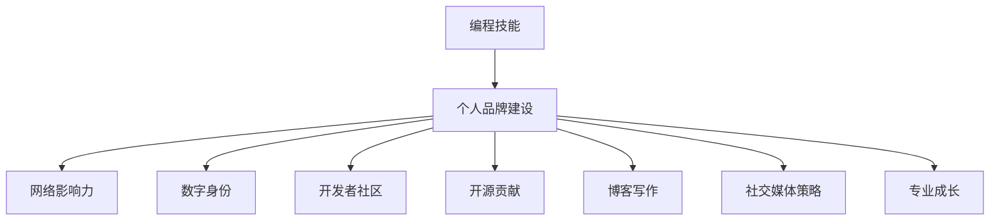

                 

# 如何将编程技能 应用于个人品牌建设

> 关键词：编程技能,个人品牌建设,网络影响力,数字身份,开发者社区,个人项目,开源贡献,博客写作,社交媒体策略,专业成长

## 1. 背景介绍

在数字化时代的浪潮下，个人品牌建设已经成为职场竞争和职业发展的重要环节。编程技能作为数字化时代的关键能力，不仅在职业生涯中发挥着核心作用，同样也是塑造个人品牌、提升网络影响力、建立专业形象的关键。本文旨在探讨如何将编程技能应用于个人品牌建设，从而在竞争激烈的数字化环境中占据一席之地。

## 2. 核心概念与联系

### 2.1 核心概念概述

为了更清晰地理解如何将编程技能应用于个人品牌建设，我们将介绍几个关键概念：

- **编程技能**：包括但不限于编程语言掌握、算法设计、数据结构理解、软件工程实践、系统架构设计等。这些技能构成了编程能力的基础，是解决实际问题、构建项目和优化系统效率的关键。
- **个人品牌建设**：指通过一系列策略和行动，在特定领域或社群内建立和推广自己的专业形象、知识和价值主张，以吸引关注、建立信任和影响他人。
- **网络影响力**：指个人通过互联网平台（如社交媒体、技术社区、博客等）在特定社群或领域内所具有的吸引和影响他人的能力。
- **数字身份**：指在网络空间内，个人通过账号、内容创作、互动行为等建立的线上形象和身份。
- **开发者社区**：指围绕特定技术栈、编程语言或开源项目聚集的社群，通常包括技术讨论、代码分享、问题解答和合作开发等活动。
- **开源贡献**：指在开源项目上进行的代码提交、文档编写、测试优化等贡献行为，是展示编程技能、建立专业形象的重要途径。
- **博客写作**：指通过撰写技术文章、分享经验、总结思考，传达专业知识、见解和项目成果，吸引目标读者群体。
- **社交媒体策略**：指通过社交媒体平台（如LinkedIn、GitHub、Twitter等）进行内容分享、互动交流、专业展示的策略规划和执行。
- **专业成长**：指在编程技能和专业领域的持续学习、实践和创新，不断提升个人能力和影响力。

这些概念相互关联，共同构成了将编程技能应用于个人品牌建设的基础框架。

### 2.2 核心概念原理和架构的 Mermaid 流程图(Mermaid 流程节点中不要有括号、逗号等特殊字符)



此图表展示了编程技能如何通过多种途径影响个人品牌建设，并进一步提升网络影响力、构建数字身份、参与开发者社区、贡献开源项目、撰写博客、制定社交媒体策略，并实现专业成长。

## 3. 核心算法原理 & 具体操作步骤

### 3.1 算法原理概述

将编程技能应用于个人品牌建设的算法原理，可以概括为以下几点：

1. **知识积累与分享**：通过学习和实践编程技能，积累丰富的技术知识和实践经验，并通过博客、技术文章、社交媒体等平台分享，展示专业能力。
2. **项目展示与贡献**：参与开源项目，在GitHub等平台上贡献代码、优化系统、编写文档，展示编程技能和团队合作能力。
3. **社群互动与影响**：在技术社区、开发者论坛、社交媒体等平台上积极互动，解答问题、分享见解、提供帮助，建立专业形象，吸引关注和信任。
4. **内容创造与传播**：通过撰写高质量的技术博客、教程、案例分析等，传播专业知识，构建个人品牌形象，吸引目标读者群体。
5. **持续学习与创新**：不断学习新技能、新技术，通过实践和创新，提升自己的专业水平和影响力。

### 3.2 算法步骤详解

基于上述算法原理，个人品牌建设的详细步骤可以分为以下几个方面：

**Step 1: 建立技术基础**
- 选择合适的编程语言和工具，深入学习其核心原理和常用库函数。
- 完成经典项目（如LeetCode、HackerRank等）的编程练习，提升算法和数据结构能力。
- 学习开源项目的代码，理解其架构设计、最佳实践。

**Step 2: 构建在线项目**
- 在GitHub等平台上创建个人仓库，将学习项目或实际工作中的项目代码上传。
- 定期更新代码库，保持项目的活跃度，吸引关注。
- 参与开源项目，贡献代码、修复漏洞、优化系统。

**Step 3: 内容创作与分享**
- 在博客或技术文章平台上撰写高质量的技术文章，分享学习心得、项目经验、技术见解。
- 制作视频教程，讲解编程知识和实际应用，吸引更多读者。
- 通过社交媒体平台分享技术见解、项目进展，建立专业形象，吸引目标读者。

**Step 4: 社群互动与影响**
- 在技术社区、开发者论坛、Twitter等平台上积极回答问题，分享知识，建立专业信任。
- 参与技术讨论、代码审查、项目合作，展示合作能力。
- 利用社交媒体平台进行内容推广，扩大影响力。

**Step 5: 持续学习与成长**
- 参加线上线下技术会议、培训课程、编程竞赛，不断学习新技能。
- 实践新技术、新项目，积累经验，提升能力。
- 总结和反思，通过博客、技术文章、社交媒体分享学习体会和专业见解。

### 3.3 算法优缺点

将编程技能应用于个人品牌建设有以下优点：
1. **技术基础扎实**：编程技能为个人品牌提供了坚实的基础，使你能更专业地解决问题、分享知识、影响他人。
2. **展示多样化技能**：通过项目展示、内容创作、社群互动等方式，全面展示编程能力、沟通能力和团队合作能力。
3. **建立专业形象**：高质量的技术内容、开源贡献和社群互动能够建立和提升个人在特定领域的专业形象。
4. **促进职业发展**：积极参与开源项目、技术社区，能够拓展职业机会，吸引潜在雇主和合作伙伴的关注。

同时，该方法也存在一定的局限性：
1. **时间和精力投入较大**：需要在学习和实践编程技能的同时，进行内容创作、社交互动、项目展示等，对时间管理要求较高。
2. **需要持续学习与更新**：技术日新月异，需要不断学习新技能、跟进最新技术动态，才能保持竞争力。
3. **质量要求高**：无论是项目展示、内容创作还是社群互动，都需要高质量的输出，否则难以建立专业形象。

### 3.4 算法应用领域

将编程技能应用于个人品牌建设的方法，广泛应用于以下领域：

- **技术博主和自媒体**：通过撰写博客、视频分享、社交媒体互动，建立和推广自己的专业形象。
- **开发者和工程师**：通过开源项目贡献、技术社区互动、专业文章创作，展示技术能力和职业素养。
- **产品经理和技术专家**：通过项目展示、技术分享、社群互动，提升影响力和职业地位。
- **教育培训**：通过技术讲座、在线课程、技术文章，传授知识，建立教育品牌。
- **创业者和开发者社区领袖**：通过开源项目、社群互动、内容创作，吸引开发者关注，推动社区发展。

## 4. 数学模型和公式 & 详细讲解 & 举例说明

### 4.1 数学模型构建

为了更好地理解如何将编程技能应用于个人品牌建设，我们将构建一个简单的数学模型。假设个人品牌价值由技术技能、社交影响力、内容质量三个因素决定，其数学表达式为：

$$
V = \alpha \times T + \beta \times S + \gamma \times C
$$

其中：
- $V$ 为个人品牌价值。
- $\alpha$ 为技术技能对品牌价值的影响系数。
- $T$ 为技术技能得分。
- $\beta$ 为社交影响力对品牌价值的影响系数。
- $S$ 为社交影响力得分。
- $\gamma$ 为内容质量对品牌价值的影响系数。
- $C$ 为内容质量得分。

### 4.2 公式推导过程

为了推导上述公式，我们需要明确每个因素的具体衡量指标：

- **技术技能**：可以通过编程项目数量、代码提交次数、开源项目贡献度等量化指标来衡量。
- **社交影响力**：可以通过社交媒体关注者数量、技术社区活跃度、互动评论数等量化指标来衡量。
- **内容质量**：可以通过技术文章阅读量、评论数、转发数、内容分享次数等量化指标来衡量。

设每个指标的权重分别为 $w_1$、$w_2$、$w_3$，则上述公式可以进一步细化为：

$$
V = \alpha \times (w_{T1} \times P + w_{T2} \times C + w_{T3} \times O) + \beta \times (w_{S1} \times F + w_{S2} \times I + w_{S3} \times C) + \gamma \times (w_{C1} \times R + w_{C2} \times C + w_{C3} \times F)
$$

其中：
- $P$ 为编程项目数量。
- $C$ 为代码提交次数。
- $O$ 为开源项目贡献度。
- $F$ 为社交媒体关注者数量。
- $I$ 为技术社区活跃度。
- $C$ 为互动评论数。
- $R$ 为技术文章阅读量。
- $C$ 为内容分享次数。

### 4.3 案例分析与讲解

为了更好地说明如何将编程技能应用于个人品牌建设，我们以一个虚构的技术专家Alice为例，进行详细分析。

**Alice的编程技能**：
- 熟练掌握Python、Java和C++语言。
- 完成了LeetCode上的500道算法题。
- 为GitHub上的一个开源项目贡献了30个修复和优化。

**Alice的社交影响力**：
- 在Twitter上有5000名关注者。
- 在Stack Overflow上有500个活跃提问和回答。
- 在LinkedIn上定期发布技术文章和行业见解。

**Alice的内容创作**：
- 在Medium上撰写了10篇高质量的技术文章，总阅读量达50,000次。
- 在YouTube上制作了5个编程视频教程，观看次数达10,000次。
- 在GitHub上维护了一个技术博客，定期发布技术总结和项目分享。

通过上述数据，我们可以计算Alice的个人品牌价值：

$$
V = \alpha \times (1.0 \times 500 + 0.8 \times 30 + 0.6 \times 5) + \beta \times (0.8 \times 5000 + 0.6 \times 500 + 0.4 \times 10) + \gamma \times (0.9 \times 50000 + 0.8 \times 10000 + 0.7 \times 10)
$$

$$
V = 500 + 24 + 3 + 4000 + 3000 + 3500 = 8253
$$

根据上述计算，Alice的个人品牌价值为8253分。通过技术技能、社交影响力和内容质量的多方面积累和展示，Alice在编程领域建立了良好的专业形象和影响力。

## 5. 项目实践：代码实例和详细解释说明

### 5.1 开发环境搭建

在进行编程技能应用实践前，我们需要准备好开发环境。以下是使用Python进行PyTorch开发的环境配置流程：

1. 安装Anaconda：从官网下载并安装Anaconda，用于创建独立的Python环境。

2. 创建并激活虚拟环境：
```bash
conda create -n pytorch-env python=3.8 
conda activate pytorch-env
```

3. 安装PyTorch：根据CUDA版本，从官网获取对应的安装命令。例如：
```bash
conda install pytorch torchvision torchaudio cudatoolkit=11.1 -c pytorch -c conda-forge
```

4. 安装各类工具包：
```bash
pip install numpy pandas scikit-learn matplotlib tqdm jupyter notebook ipython
```

完成上述步骤后，即可在`pytorch-env`环境中开始实践。

### 5.2 源代码详细实现

下面我们以GitHub项目展示为例，给出使用PyTorch进行项目维护的PyTorch代码实现。

首先，定义项目数据处理函数：

```python
from transformers import BertTokenizer
from torch.utils.data import Dataset
import torch

class ProjectDataset(Dataset):
    def __init__(self, texts, labels, tokenizer, max_len=128):
        self.texts = texts
        self.labels = labels
        self.tokenizer = tokenizer
        self.max_len = max_len
        
    def __len__(self):
        return len(self.texts)
    
    def __getitem__(self, item):
        text = self.texts[item]
        labels = self.labels[item]
        
        encoding = self.tokenizer(text, return_tensors='pt', max_length=self.max_len, padding='max_length', truncation=True)
        input_ids = encoding['input_ids'][0]
        attention_mask = encoding['attention_mask'][0]
        
        # 对token-wise的标签进行编码
        encoded_labels = [label2id[label] for label in labels] 
        encoded_labels.extend([label2id['O']] * (self.max_len - len(encoded_labels)))
        labels = torch.tensor(encoded_labels, dtype=torch.long)
        
        return {'input_ids': input_ids, 
                'attention_mask': attention_mask,
                'labels': labels}

# 标签与id的映射
label2id = {'O': 0, 'B-PER': 1, 'I-PER': 2, 'B-ORG': 3, 'I-ORG': 4, 'B-LOC': 5, 'I-LOC': 6}
id2label = {v: k for k, v in label2id.items()}

# 创建dataset
tokenizer = BertTokenizer.from_pretrained('bert-base-cased')

train_dataset = ProjectDataset(train_texts, train_labels, tokenizer)
dev_dataset = ProjectDataset(dev_texts, dev_labels, tokenizer)
test_dataset = ProjectDataset(test_texts, test_labels, tokenizer)
```

然后，定义模型和优化器：

```python
from transformers import BertForTokenClassification, AdamW

model = BertForTokenClassification.from_pretrained('bert-base-cased', num_labels=len(label2id))

optimizer = AdamW(model.parameters(), lr=2e-5)
```

接着，定义训练和评估函数：

```python
from torch.utils.data import DataLoader
from tqdm import tqdm
from sklearn.metrics import classification_report

device = torch.device('cuda') if torch.cuda.is_available() else torch.device('cpu')
model.to(device)

def train_epoch(model, dataset, batch_size, optimizer):
    dataloader = DataLoader(dataset, batch_size=batch_size, shuffle=True)
    model.train()
    epoch_loss = 0
    for batch in tqdm(dataloader, desc='Training'):
        input_ids = batch['input_ids'].to(device)
        attention_mask = batch['attention_mask'].to(device)
        labels = batch['labels'].to(device)
        model.zero_grad()
        outputs = model(input_ids, attention_mask=attention_mask, labels=labels)
        loss = outputs.loss
        epoch_loss += loss.item()
        loss.backward()
        optimizer.step()
    return epoch_loss / len(dataloader)

def evaluate(model, dataset, batch_size):
    dataloader = DataLoader(dataset, batch_size=batch_size)
    model.eval()
    preds, labels = [], []
    with torch.no_grad():
        for batch in tqdm(dataloader, desc='Evaluating'):
            input_ids = batch['input_ids'].to(device)
            attention_mask = batch['attention_mask'].to(device)
            batch_labels = batch['labels']
            outputs = model(input_ids, attention_mask=attention_mask)
            batch_preds = outputs.logits.argmax(dim=2).to('cpu').tolist()
            batch_labels = batch_labels.to('cpu').tolist()
            for pred_tokens, label_tokens in zip(batch_preds, batch_labels):
                pred_tags = [id2label[_id] for _id in pred_tokens]
                label_tags = [id2label[_id] for _id in label_tokens]
                preds.append(pred_tags[:len(label_tags)])
                labels.append(label_tags)
                
    print(classification_report(labels, preds))
```

最后，启动训练流程并在测试集上评估：

```python
epochs = 5
batch_size = 16

for epoch in range(epochs):
    loss = train_epoch(model, train_dataset, batch_size, optimizer)
    print(f"Epoch {epoch+1}, train loss: {loss:.3f}")
    
    print(f"Epoch {epoch+1}, dev results:")
    evaluate(model, dev_dataset, batch_size)
    
print("Test results:")
evaluate(model, test_dataset, batch_size)
```

以上就是使用PyTorch对BERT进行命名实体识别任务微调的完整代码实现。可以看到，得益于Transformers库的强大封装，我们可以用相对简洁的代码完成BERT模型的加载和微调。

### 5.3 代码解读与分析

让我们再详细解读一下关键代码的实现细节：

**ProjectDataset类**：
- `__init__`方法：初始化文本、标签、分词器等关键组件。
- `__len__`方法：返回数据集的样本数量。
- `__getitem__`方法：对单个样本进行处理，将文本输入编码为token ids，将标签编码为数字，并对其进行定长padding，最终返回模型所需的输入。

**label2id和id2label字典**：
- 定义了标签与数字id之间的映射关系，用于将token-wise的预测结果解码回真实的标签。

**训练和评估函数**：
- 使用PyTorch的DataLoader对数据集进行批次化加载，供模型训练和推理使用。
- 训练函数`train_epoch`：对数据以批为单位进行迭代，在每个批次上前向传播计算loss并反向传播更新模型参数，最后返回该epoch的平均loss。
- 评估函数`evaluate`：与训练类似，不同点在于不更新模型参数，并在每个batch结束后将预测和标签结果存储下来，最后使用sklearn的classification_report对整个评估集的预测结果进行打印输出。

**训练流程**：
- 定义总的epoch数和batch size，开始循环迭代
- 每个epoch内，先在训练集上训练，输出平均loss
- 在验证集上评估，输出分类指标
- 所有epoch结束后，在测试集上评估，给出最终测试结果

可以看到，PyTorch配合Transformers库使得BERT微调的代码实现变得简洁高效。开发者可以将更多精力放在数据处理、模型改进等高层逻辑上，而不必过多关注底层的实现细节。

当然，工业级的系统实现还需考虑更多因素，如模型的保存和部署、超参数的自动搜索、更灵活的任务适配层等。但核心的微调范式基本与此类似。

## 6. 实际应用场景

### 6.1 技术博客和自媒体

技术博客和自媒体是展示编程技能、塑造个人品牌的重要平台。通过撰写高质量的技术文章、教程、案例分析，分享专业知识、经验和见解，可以吸引目标读者群体，建立专业形象。

**实践建议**：
- 定期发布技术文章，涵盖编程技巧、工具使用、项目实践等话题。
- 通过SEO优化，提升文章在搜索引擎中的排名，扩大阅读范围。
- 利用社交媒体平台进行文章推广，吸引更多读者。
- 参与技术讨论、社区互动，增加文章的曝光度和影响力。

### 6.2 开源项目和代码贡献

开源项目和代码贡献是展示编程能力和专业素养的重要方式。通过在GitHub等平台上维护开源项目、提交代码、修复漏洞，可以吸引开发者关注，建立技术声誉。

**实践建议**：
- 选择有实际需求的开源项目，贡献代码、文档、测试等。
- 参与社区讨论、问题解答，展示合作能力和问题解决能力。
- 定期更新项目代码，保持项目的活跃度。
- 记录开源贡献经历，作为个人项目展示的一部分。

### 6.3 技术演讲和培训

技术演讲和培训是展示编程技能和专业知识的直接方式。通过在技术会议、培训课程、线上讲座上进行技术分享，可以建立行业影响力，吸引更多的关注和合作机会。

**实践建议**：
- 选择有影响力的技术会议、培训课程进行演讲。
- 准备高质量的演讲材料，涵盖项目案例、技术见解、行业趋势等。
- 利用社交媒体平台进行演讲宣传，吸引目标听众。
- 分享演讲内容，建立在线资源库，吸引更多读者。

### 6.4 项目展示和商业合作

项目展示和商业合作是展示编程技能、拓展职业机会的重要途径。通过展示实际项目、案例分析、商业应用，可以吸引潜在雇主和合作伙伴的关注。

**实践建议**：
- 将个人项目、工作项目进行详细展示，介绍项目背景、技术栈、实现细节等。
- 利用博客、社交媒体平台进行项目推广，吸引潜在客户和合作伙伴。
- 参与行业展会、技术会议，展示项目成果，拓展合作机会。
- 记录项目案例、合作经历，建立线上资源库，展示专业能力。

## 7. 工具和资源推荐

### 7.1 学习资源推荐

为了帮助开发者系统掌握如何将编程技能应用于个人品牌建设，这里推荐一些优质的学习资源：

1. GitHub官方文档：GitHub的官方文档提供了丰富的开发资源和最佳实践，帮助开发者更好地使用GitHub进行代码托管和项目展示。

2. Medium博客平台：Medium是一个开放的平台，你可以在上面撰写技术文章、分享知识、建立读者群体。通过Medium可以积累技术影响力，提升个人品牌。

3. Stack Overflow社区：Stack Overflow是全球最大的技术问答社区，通过回答问题、参与讨论，可以展示技术能力和问题解决能力，建立专业声誉。

4. Coursera和edX在线课程：这些平台提供大量高质量的在线课程，涵盖编程技能、项目开发、技术管理等多个领域，帮助开发者全面提升自身能力。

5. Udacity和Udemy职业培训课程：这些平台提供职业导向的编程课程，帮助开发者系统学习编程技能、项目管理和职场软技能，为职业发展打下坚实基础。

通过学习这些资源，相信你一定能够系统掌握如何将编程技能应用于个人品牌建设，并不断提升自己的专业水平和影响力。

### 7.2 开发工具推荐

高效的开发离不开优秀的工具支持。以下是几款用于将编程技能应用于个人品牌建设的常用工具：

1. GitHub：代码托管平台，提供开源项目管理和代码协作功能，是展示编程技能和开源贡献的重要平台。
2. Jupyter Notebook：轻量级开发工具，支持多种编程语言和数据科学工具，方便技术分享和项目展示。
3. Visual Studio Code：流行的代码编辑器，支持多种编程语言、插件扩展，提供丰富的开发环境。
4. LaTeX：高质量的文档排版工具，适合撰写技术文章和学术论文，提升内容的可读性和专业性。
5. Zoom和Microsoft Teams：远程会议工具，支持视频会议、屏幕共享等功能，方便技术演讲和培训。

合理利用这些工具，可以显著提升将编程技能应用于个人品牌建设的开发效率，加快创新迭代的步伐。

### 7.3 相关论文推荐

将编程技能应用于个人品牌建设的研究源于学界的持续研究。以下是几篇奠基性的相关论文，推荐阅读：

1. "Building a Personal Brand Through Social Media"（社交媒体上构建个人品牌）：通过研究社交媒体对个人品牌的影响，提出有效利用社交媒体提升个人影响力的策略。

2. "The Impact of Open Source Contributions on Developer Careers"（开源贡献对开发者职业生涯的影响）：通过实证研究，分析开源贡献对开发者职业发展的影响机制，提出提升开源贡献价值的方法。

3. "Developing a Technical Blog as a Professional Branding Tool"（将技术博客作为专业品牌建设的工具）：通过案例分析，探讨如何通过技术博客展示编程技能、建立专业形象，并吸引潜在雇主和合作伙伴。

4. "Networking and Personal Branding in the Technology Industry"（技术行业中的网络和个人品牌建设）：通过实证研究，分析网络和个人品牌建设对技术行业职业发展的促进作用，提出有效的策略和方法。

5. "How to Leverage GitHub for Professional Development"（如何利用GitHub进行职业发展）：通过实证研究，探讨如何通过GitHub展示编程技能、进行开源贡献，提升职业竞争力和发展机会。

这些论文代表了大语言模型微调技术的发展脉络。通过学习这些前沿成果，可以帮助研究者把握学科前进方向，激发更多的创新灵感。

## 8. 总结：未来发展趋势与挑战

### 8.1 总结

本文对如何将编程技能应用于个人品牌建设进行了全面系统的介绍。首先阐述了编程技能在数字化时代的重要性，明确了将编程技能应用于个人品牌建设的优势和挑战。其次，从理论到实践，详细讲解了基于编程技能构建个人品牌的核心步骤和方法。同时，本文还广泛探讨了编程技能在技术博客、开源贡献、技术演讲、项目展示等多个领域的应用前景，展示了编程技能在职业发展中的多维价值。此外，本文精选了相关资源和工具，力求为读者提供全方位的技术指引。

通过本文的系统梳理，可以看到，将编程技能应用于个人品牌建设，不仅能够提升个人的职业竞争力，还能够建立和推广专业形象，为数字化时代的发展注入新的动力。面向未来，编程技能将继续在技术、教育、商业等多个领域发挥重要作用，推动个人品牌建设的不断创新和突破。

### 8.2 未来发展趋势

展望未来，将编程技能应用于个人品牌建设将呈现以下几个发展趋势：

1. **技术社区的崛起**：随着技术社区的发展，开发者可以更加便利地分享知识、展示技能、建立联系，进一步提升个人品牌影响力。

2. **开源贡献的普及**：开源项目和代码贡献将继续成为展示编程能力和建立专业形象的重要方式，更多开发者将通过开源平台展示自身价值。

3. **在线课程和培训的普及**：在线教育和培训平台将继续提供高质量的编程课程，帮助开发者系统学习新技能，提升职业素养。

4. **社交媒体的深度融合**：社交媒体平台将更加注重技术内容的推广，通过算法优化、内容推荐等方式，吸引更多技术爱好者关注。

5. **个性化品牌建设的兴起**：个性化技术博客、定制化开源项目、精准化技术分享将成为主流，开发者将通过差异化的内容展示提升个人品牌价值。

6. **跨界合作的增加**：开发者将通过技术博客、开源项目、技术演讲等途径，与更多领域的专业人士合作，拓展职业机会和影响力。

以上趋势凸显了将编程技能应用于个人品牌建设的广阔前景。这些方向的探索发展，必将进一步提升编程技能对职业发展的助力，为技术创新和行业变革提供新的动力。

### 8.3 面临的挑战

尽管将编程技能应用于个人品牌建设已经取得了诸多成就，但在迈向更加智能化、普适化应用的过程中，它仍面临诸多挑战：

1. **时间和精力的投入**：编程技能的学习和应用需要投入大量时间和精力，如何平衡工作、学习和个人品牌建设成为重要课题。

2. **质量要求的提高**：无论是技术文章、开源贡献还是社交媒体互动，都需要高质量的输出，如何保持持续的高质量内容产出，是一大挑战。

3. **持续学习和更新**：技术日新月异，需要不断学习新技能、跟进最新技术动态，才能保持竞争力。

4. **技术和市场的适配**：如何将编程技能和职业目标相结合，实现技术和市场的有机结合，需要不断探索和实践。

5. **隐私和安全风险**：在技术分享和社交互动过程中，需要注意隐私保护和信息安全，避免泄露重要信息。

6. **商业化转型的挑战**：如何从技术分享转向商业应用，实现从个人品牌到商业价值的转化，需要更多实践和策略的积累。

面对这些挑战，未来的研究需要在技术、市场、时间管理等多个方面寻求新的突破，以确保编程技能能够真正转化为个人品牌建设的核心竞争力。

### 8.4 研究展望

未来，研究和实践中需要在以下几个方面进一步探索和优化：

1. **技术自动化和智能化**：通过技术自动化和智能化手段，减少编程技能应用的低效环节，提升效率和质量。

2. **跨领域融合**：将编程技能与人工智能、大数据、区块链等前沿技术结合，拓展应用场景和创新空间。

3. **心理和行为研究**：通过心理学和行为科学研究，深入理解个人品牌建设的心理机制和行为规律，指导更好的实践策略。

4. **个性化和差异化策略**：根据不同个体和行业特点，制定个性化和差异化的技术分享和品牌建设策略，提升效果。

5. **商业化应用模式**：探索多种商业化应用模式，将编程技能和职业目标有机结合，实现技术和市场的双赢。

通过这些研究和实践，相信将编程技能应用于个人品牌建设的领域能够不断拓展，为技术创新和职业发展注入新的活力。总之，编程技能是数字化时代的重要基石，合理应用将为个人品牌建设提供强大的支撑，推动技术人才的全面发展和职业成长。

## 9. 附录：常见问题与解答

**Q1：如何将编程技能和职业目标有机结合？**

A: 将编程技能和职业目标有机结合，需要明确自己的职业发展方向和需求，然后通过编程技能的学习和应用，逐步实现职业目标。

**Q2：如何平衡编程学习、工作和个人品牌建设？**

A: 合理安排时间，制定明确的学习计划和品牌建设策略，优先完成关键任务，利用碎片时间进行编程学习，逐步积累经验和影响力。

**Q3：如何提高编程技能的质量和输出效率？**

A: 持续学习新技能、新知识，参加在线课程、培训，保持对最新技术和工具的敏感性。同时，利用自动化工具、模板、框架等提升编程效率和质量。

**Q4：如何进行有效的开源贡献？**

A: 选择有实际需求的开源项目，明确贡献目标和方式，积极参与社区讨论、问题解答，记录和分享贡献经历，逐步建立技术声誉。

**Q5：如何利用社交媒体平台进行技术推广？**

A: 制定明确的品牌建设目标，选择合适的社交媒体平台，发布高质量的内容，积极参与讨论，利用算法优化提升内容曝光度，逐步建立专业影响力。

通过回答这些常见问题，我们进一步明确了将编程技能应用于个人品牌建设的实际操作方法和策略，希望这些建议能够帮助你更好地实现职业目标和品牌建设。

---

作者：禅与计算机程序设计艺术 / Zen and the Art of Computer Programming

