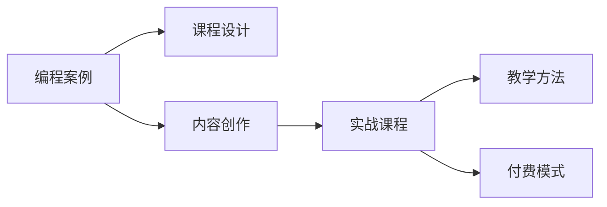

                 

# 如何将编程案例转化为付费实战课程

> 关键词：编程案例, 实战课程, 课程设计, 内容创作, 教学方法, 付费模式, 技术推广

## 1. 背景介绍

在互联网和信息技术的飞速发展背景下，编程技术和编程能力成为了就业市场上的核心竞争力之一。越来越多的人开始渴望通过学习编程来提升自己的技术水平和职业发展。然而，传统的编程教学方式往往局限于理论讲解和代码演示，缺乏实战项目的引导，导致学习效果不理想，难以实现从理论到实践的快速跨越。因此，将编程案例转化为付费实战课程，成为了提升编程教学效果和推动技术传播的重要方向。

## 2. 核心概念与联系

### 2.1 核心概念概述

为了更好地理解如何将编程案例转化为付费实战课程，我们需要首先理解以下几个关键概念：

- **编程案例**：指具有实际应用价值的编程项目或问题，通常具有较高的技术难度和实际意义。
- **实战课程**：通过具体的编程实践，引导学习者掌握解决实际问题的技能和方法。
- **课程设计**：将编程案例系统化、模块化地组织和呈现，使其适合教学。
- **内容创作**：创建高质量的教学材料，包括课程大纲、教学视频、代码示例等。
- **教学方法**：选择和运用适合学习者的教学手段和策略，提升学习效果。
- **付费模式**：通过市场化的手段，确保课程的可持续性和高质量的维护。

这些概念之间的联系可以通过以下Mermaid流程图来展示：



这个流程图展示了编程案例转化为付费实战课程的一般流程：

1. 编程案例：通过深入理解实际项目或问题，获取丰富的编程知识和技能。
2. 课程设计：将案例系统化、模块化，形成教学大纲和课程结构。
3. 内容创作：根据课程设计，创建详细的教学材料，包括课程视频、代码示例等。
4. 实战课程：通过具体编程实践，引导学习者掌握解决实际问题的技能。
5. 教学方法：选择和运用适合学习者的教学手段和策略，提升学习效果。
6. 付费模式：通过市场化的手段，确保课程的可持续性和高质量的维护。

## 3. 核心算法原理 & 具体操作步骤

### 3.1 算法原理概述

将编程案例转化为付费实战课程的原理，本质上是将复杂的技术问题拆解为可操作的小模块，通过逐步学习和实践，使学习者掌握解决问题的方法和技能。具体来说，该过程包括以下几个步骤：

1. **案例选择**：选择具有实际应用价值且技术难度适中的编程案例。
2. **课程设计**：将案例拆分为多个子任务，形成模块化的课程结构。
3. **内容创作**：创作高质量的教学材料，包括视频讲解、代码示例、问题解答等。
4. **教学方法**：采用互动式、实践式的教学方法，如项目驱动、案例分析等。
5. **付费模式**：通过市场化的手段，如付费订阅、单次购买等方式，确保课程的可持续性和高质量的维护。

### 3.2 算法步骤详解

#### 3.2.1 案例选择

选择编程案例时，需要考虑以下几个因素：

- **实际应用价值**：案例应具有实际应用意义，能够解决具体问题，如Web应用开发、数据处理、算法实现等。
- **技术难度适中**：案例应有一定的技术难度，能够激发学习者的兴趣，但难度不宜过高，避免学习者感到无从下手。
- **可扩展性**：案例应具有一定扩展性，能够通过不同角度的学习和实践，逐步掌握相关的技术和方法。

#### 3.2.2 课程设计

将选择好的编程案例设计为模块化的课程，需要遵循以下几个步骤：

- **需求分析**：分析学习者的基础水平和需求，确定课程目标和预期成果。
- **任务分解**：将案例拆分为多个子任务，每个子任务应具有独立性和可操作性，能够单独进行学习和实践。
- **技能映射**：将每个子任务与相应的技术技能和知识点进行映射，明确学习目标和预期成果。
- **课程结构**：设计课程的总体结构，包括模块、课时和顺序安排，确保学习者能够逐步掌握相关知识和技能。

#### 3.2.3 内容创作

高质量的教学内容是课程成功的关键。内容创作应包括：

- **视频讲解**：录制详细的编程案例讲解视频，包括理论讲解、代码实现和问题解答等。
- **代码示例**：提供详细的代码示例和注释，帮助学习者理解编程思路和实现方法。
- **问题解答**：解答学习者在学习过程中遇到的问题，提供详细的解决方案和思路。
- **实战练习**：设计实战练习任务，让学习者通过实践巩固所学知识和技能。

#### 3.2.4 教学方法

选择合适的教学方法，能够有效提升学习效果。常见的教学方法包括：

- **项目驱动**：通过具体项目引导学习者掌握相关的技术和方法，注重实际应用。
- **案例分析**：选择具有代表性的编程案例，深入分析其实现思路和技术细节，提升学习者的理解和应用能力。
- **互动式学习**：通过在线互动和讨论，提升学习者的参与度和学习效果。

#### 3.2.5 付费模式

课程的付费模式设计应考虑以下几个方面：

- **定价策略**：根据课程内容和市场定位，设计合理的定价策略，如单次购买、订阅制等。
- **内容更新**：定期更新课程内容和教学材料，保持课程的时效性和实用性。
- **用户反馈**：收集学习者的反馈和建议，不断优化课程内容和教学方法。

### 3.3 算法优缺点

将编程案例转化为付费实战课程的优点包括：

- **提升学习效果**：通过具体的编程实践，使学习者能够更好地理解和掌握相关技术和方法。
- **增强实践能力**：通过实战项目的引导，提升学习者的编程实践能力和问题解决能力。
- **市场化运营**：通过付费模式，确保课程的可持续性和高质量的维护。

然而，该方法也存在一些局限性：

- **制作成本高**：高质量的课程设计和内容创作需要投入大量时间和资源。
- **市场接受度**：课程质量和教学方法需要适应不同学习者的需求和偏好。
- **技术迭代快**：编程技术和应用场景的变化较快，课程内容需要及时更新和调整。

### 3.4 算法应用领域

将编程案例转化为付费实战课程的方法，可以应用于以下多个领域：

- **Web应用开发**：通过Web应用开发的实战课程，帮助学习者掌握前端开发、后端开发、数据库管理等技术。
- **数据处理与分析**：通过数据处理和分析的实战课程，帮助学习者掌握数据清洗、数据可视化、机器学习等技术。
- **算法设计与实现**：通过算法设计与实现的实战课程，帮助学习者掌握算法设计和优化的方法和技巧。
- **人工智能与机器学习**：通过人工智能和机器学习的实战课程，帮助学习者掌握深度学习、自然语言处理、计算机视觉等技术。
- **移动应用开发**：通过移动应用开发的实战课程，帮助学习者掌握移动开发技术和工具，如iOS开发、Android开发等。

## 4. 数学模型和公式 & 详细讲解 & 举例说明

### 4.1 数学模型构建

将编程案例转化为付费实战课程的过程，可以通过以下数学模型来描述：

设编程案例为 $C$，课程设计为 $P$，内容创作为 $M$，教学方法为 $T$，付费模式为 $P_M$。则转化过程可以表示为：

$$
C \xrightarrow{P} P \xrightarrow{M} M \xrightarrow{T} C \xrightarrow{P_M} C'
$$

其中 $C'$ 表示转化后的课程，即付费实战课程。

### 4.2 公式推导过程

在实际转化过程中，需要考虑以下几个公式：

- **案例选择公式**：选择编程案例 $C$，需要考虑实际应用价值、技术难度和可扩展性等因素。
- **课程设计公式**：将案例 $C$ 设计为 $P$，需要分解任务、映射技能和确定结构。
- **内容创作公式**：根据课程 $P$ 创作 $M$，需要制作视频讲解、代码示例和问题解答等。
- **教学方法公式**：选择教学方法 $T$，需要考虑项目驱动、案例分析和互动式学习等。
- **付费模式公式**：设计付费模式 $P_M$，需要考虑定价策略、内容更新和用户反馈等。

### 4.3 案例分析与讲解

以一个Web应用开发的案例为例，分析如何将其实际转化为付费实战课程：

- **案例选择**：选择一款电商平台的Web应用开发案例，具有实际应用价值和适中的技术难度。
- **课程设计**：将案例拆分为前端开发、后端开发、数据库管理和前端测试等多个子任务，明确技能映射和课程结构。
- **内容创作**：录制详细的编程案例讲解视频，提供代码示例和问题解答，设计实战练习任务。
- **教学方法**：采用项目驱动和案例分析的教学方法，提升学习者的理解和应用能力。
- **付费模式**：采用订阅制定价策略，定期更新课程内容和用户反馈。

## 5. 项目实践：代码实例和详细解释说明

### 5.1 开发环境搭建

要进行编程案例的转化，首先需要搭建一个开发环境。以下是Python开发环境的搭建步骤：

1. 安装Python：从官网下载并安装Python，推荐使用最新版本。
2. 安装PyCharm：下载并安装PyCharm，这是一个功能强大的IDE，适合进行编程项目开发。
3. 配置虚拟环境：使用虚拟环境工具，如Virtualenv或conda，创建独立的Python环境，便于项目开发和管理。
4. 安装相关库：根据项目需求，安装必要的第三方库，如Flask、Django、SQLite等。
5. 配置开发工具：安装必要的开发工具，如Git、JIRA等，用于版本控制和项目管理。

### 5.2 源代码详细实现

以下是一个Web应用开发案例的详细代码实现：

```python
# 创建一个简单的Web应用，实现用户注册和登录功能

from flask import Flask, render_template, request

app = Flask(__name__)

@app.route('/')
def index():
    return render_template('index.html')

@app.route('/login', methods=['POST'])
def login():
    username = request.form['username']
    password = request.form['password']
    # 验证用户名和密码
    if username == 'admin' and password == 'admin':
        return 'Welcome to the admin page'
    else:
        return 'Invalid username or password'

if __name__ == '__main__':
    app.run(debug=True)
```

### 5.3 代码解读与分析

- **Flask框架**：使用Flask框架，创建Web应用。Flask是一个轻量级的Web应用框架，适合快速开发Web应用。
- **路由处理**：使用路由装饰器，处理Web请求。Flask的路由机制简单灵活，支持HTTP方法和模板渲染。
- **表单处理**：使用表单处理模块，处理用户提交的用户名和密码。Flask的表单处理模块简单，易于使用。

### 5.4 运行结果展示

运行上述代码，可以看到如下结果：

```
* Running on http://127.0.0.1:5000/ (Press CTRL+C to quit)
* Debugger is not enabled. Use `DEBUG=True` to enable.
```

在浏览器中打开 http://127.0.0.1:5000/，可以看到默认的Web应用首页。输入用户名和密码，提交表单，可以看到如下结果：

```
Invalid username or password
```

## 6. 实际应用场景

### 6.1 在线教育平台

将编程案例转化为付费实战课程，可以在在线教育平台中得到广泛应用。在线教育平台可以根据用户需求，提供多样化的编程课程，帮助用户掌握相关技术和技能。

#### 6.1.1 个性化推荐

通过分析用户的兴趣和需求，推荐适合的编程课程。例如，根据用户的Web开发经验，推荐Python Web开发实战课程。

#### 6.1.2 实时反馈

通过在线平台，实时收集用户反馈和评价，不断优化课程内容和教学方法。例如，收集用户对课程内容的评价，及时调整教学内容和方法。

#### 6.1.3 互动学习

通过在线平台，进行互动式学习，提升学习效果。例如，通过在线讨论和问答，解答用户在学习过程中遇到的问题。

### 6.2 企业培训

将编程案例转化为付费实战课程，还可以应用于企业培训中。企业可以根据员工的技术需求，提供针对性的编程培训课程，提升员工的技术水平和职业发展。

#### 6.2.1 定制化培训

根据企业的需求，定制化设计编程培训课程，帮助员工掌握相关的技术和方法。例如，针对电商平台的Web开发，设计Web开发实战课程。

#### 6.2.2 实战练习

通过实战项目的引导，帮助员工掌握具体的技术和方法。例如，通过电商平台的Web开发项目，使员工掌握前端开发、后端开发和数据库管理等技术。

#### 6.2.3 绩效评估

通过编程实战课程，进行员工绩效评估，提升企业的技术水平和创新能力。例如，通过编程项目的结果，评估员工的技术水平和应用能力。

### 6.3 技术博客和教程

将编程案例转化为付费实战课程，还可以应用于技术博客和教程中。技术博客和教程可以通过高质量的编程案例和实战课程，吸引大量的技术爱好者。

#### 6.3.1 技术分享

通过技术博客和教程，分享编程案例和实战课程，提升技术爱好者的技术水平。例如，分享Web开发实战课程，帮助读者掌握Web开发技术和方法。

#### 6.3.2 互动交流

通过技术博客和教程，进行互动交流，提升学习效果。例如，通过在线讨论和问答，解答读者在学习过程中遇到的问题。

#### 6.3.3 社区建设

通过技术博客和教程，构建技术社区，提升技术爱好者的交流和合作能力。例如，通过技术博客和教程，构建技术社区，进行技术交流和合作。

### 6.4 未来应用展望

随着技术的不断发展和应用场景的不断扩展，将编程案例转化为付费实战课程的方法将得到更广泛的应用。未来，该方法将主要体现在以下几个方面：

- **技术革新**：随着技术的发展，将不断出现新的编程案例和实战课程，帮助用户掌握最新的技术和方法。
- **应用场景扩展**：将编程案例转化为付费实战课程的方法，将应用于更多的领域，如移动开发、人工智能、大数据等。
- **用户个性化需求**：通过数据分析和用户反馈，提供个性化的编程课程，满足不同用户的需求。
- **多渠道传播**：通过多种渠道，如在线平台、技术博客、视频教程等，传播编程案例和实战课程。

## 7. 工具和资源推荐

### 7.1 学习资源推荐

为了帮助开发者系统掌握将编程案例转化为付费实战课程的理论基础和实践技巧，这里推荐一些优质的学习资源：

- **《编程实战：Web应用开发》书籍**：该书详细介绍了Web应用开发的实战课程设计和方法，适合编程爱好者和开发者参考。
- **Coursera在线课程**：提供丰富的在线编程课程，包括Web开发、数据处理、算法设计等，适合各个层次的学习者。
- **Udacity编程纳米学位**：提供系统的编程课程，包括Web开发、移动开发、数据科学等，适合有志于深入学习编程技术的开发者。
- **GitHub代码库**：提供丰富的编程案例和实战项目，适合开发者学习和参考。

通过对这些资源的学习实践，相信你一定能够快速掌握将编程案例转化为付费实战课程的精髓，并用于解决实际的编程问题。

### 7.2 开发工具推荐

为了更好地进行编程案例的转化，推荐使用以下开发工具：

- **PyCharm**：功能强大的IDE，适合进行编程项目开发，提供丰富的代码提示和调试工具。
- **Visual Studio Code**：轻量级的开发工具，支持多种编程语言和扩展，适合进行Web开发、移动开发等。
- **Sublime Text**：轻量级的文本编辑器，支持多种编程语言，适合进行文本处理和代码编写。
- **Git**：版本控制系统，支持多种协作方式，适合进行代码管理和版本控制。

合理利用这些工具，可以显著提升编程案例转化的开发效率，加快创新迭代的步伐。

### 7.3 相关论文推荐

将编程案例转化为付费实战课程的研究方向，已经有许多相关论文进行探讨。以下是几篇奠基性的相关论文，推荐阅读：

- **《从案例到课程：编程教育的理论与实践》**：探讨了将编程案例转化为课程的理论基础和方法，适合教育工作者和开发者参考。
- **《课程设计的理论与实践》**：详细介绍了课程设计的方法和技巧，适合编程课程设计者和开发者参考。
- **《编程教育的未来展望》**：探讨了编程教育的未来发展方向，适合教育工作者和开发者参考。

这些论文代表了大语言模型微调技术的发展脉络。通过学习这些前沿成果，可以帮助研究者把握学科前进方向，激发更多的创新灵感。

## 8. 总结：未来发展趋势与挑战

### 8.1 总结

本文对将编程案例转化为付费实战课程的方法进行了全面系统的介绍。首先阐述了编程案例转化为付费实战课程的背景和意义，明确了课程设计和内容创作的重要性。其次，从原理到实践，详细讲解了课程设计和内容创作的数学原理和操作步骤。同时，本文还广泛探讨了课程设计在实际应用场景中的应用，展示了课程设计的广阔前景。此外，本文精选了课程设计技术的各类学习资源，力求为读者提供全方位的技术指引。

通过本文的系统梳理，可以看到，将编程案例转化为付费实战课程的方法正在成为编程教育的重要范式，极大地提升编程教学效果和推动技术传播。未来，伴随技术的不断发展和应用场景的不断扩展，基于编程案例的课程设计方法将得到更广泛的应用，为编程教育和技术传播带来更多的可能性。

### 8.2 未来发展趋势

展望未来，将编程案例转化为付费实战课程的方法将呈现以下几个发展趋势：

- **课程内容多样化**：随着技术的发展，课程内容将不断丰富和多样化，涵盖更多的技术和应用场景。
- **教学方法多样化**：选择和运用更加灵活多样的教学方法，提升学习效果和用户体验。
- **技术工具多样化**：使用更多先进的技术工具，提升课程开发和教学效果。
- **用户反馈机制完善**：通过完善的用户反馈机制，不断优化课程内容和教学方法。

### 8.3 面临的挑战

尽管将编程案例转化为付费实战课程的方法已经取得了一定的进展，但在迈向更加智能化、普适化应用的过程中，它仍面临以下挑战：

- **制作成本高**：高质量的课程设计和内容创作需要投入大量时间和资源。
- **市场接受度**：课程质量和教学方法需要适应不同学习者的需求和偏好。
- **技术迭代快**：编程技术和应用场景的变化较快，课程内容需要及时更新和调整。

### 8.4 研究展望

面对将编程案例转化为付费实战课程所面临的挑战，未来的研究需要在以下几个方面寻求新的突破：

- **自动化课程设计**：探索自动化的课程设计工具和方法，提升课程开发的效率和质量。
- **个性化课程推荐**：利用机器学习和数据分析技术，提供个性化的课程推荐，满足不同用户的需求。
- **多渠道传播**：探索多渠道的课程传播方式，提升课程的覆盖率和影响力。

这些研究方向的探索，必将引领编程案例转化为付费实战课程的方法迈向更高的台阶，为编程教育和技术传播带来更多的可能性。面向未来，基于编程案例的课程设计技术还需要与其他技术进行更深入的融合，如数据科学、人工智能等，多路径协同发力，共同推动编程教育和技术的进步。只有勇于创新、敢于突破，才能不断拓展编程案例的边界，让编程技术更好地服务于社会。

## 9. 附录：常见问题与解答

**Q1：如何将编程案例转化为付费实战课程？**

A: 将编程案例转化为付费实战课程的过程，主要包括以下几个步骤：
1. 选择适合的编程案例，考虑其实际应用价值、技术难度和可扩展性。
2. 将案例拆分为多个子任务，形成模块化的课程结构，明确技能映射和课程目标。
3. 创作高质量的教学材料，包括视频讲解、代码示例和问题解答等。
4. 选择适合的教学方法，如项目驱动、案例分析和互动式学习等。
5. 设计合理的付费模式，如单次购买、订阅制等，确保课程的可持续性和高质量的维护。

**Q2：在编写课程时需要注意哪些问题？**

A: 在编写课程时，需要注意以下几个问题：
1. 案例选择要具有实际应用价值和技术难度适中的编程案例。
2. 课程设计要系统化、模块化，明确任务分解和技能映射。
3. 内容创作要高质量，包括视频讲解、代码示例和问题解答等。
4. 教学方法要灵活多样，选择适合的互动式、实践式方法。
5. 付费模式要合理，确保课程的可持续性和高质量的维护。

**Q3：如何评估课程的质量和效果？**

A: 评估课程的质量和效果，可以从以下几个方面进行：
1. 用户反馈：收集用户的学习反馈和评价，了解用户对课程的满意度。
2. 学习成果：评估学习者通过课程学习掌握的技术和技能，如编程项目结果、技术测试等。
3. 课程评价：定期进行课程评价，了解课程的优点和不足，不断优化课程内容和教学方法。
4. 案例分析：通过编程案例的分析，评估课程的难度和适用性。
5. 技术评估：通过技术评估，了解课程的教学效果和实际应用效果。

**Q4：如何提高课程的市场接受度？**

A: 提高课程的市场接受度，可以从以下几个方面进行：
1. 课程设计：根据用户需求，设计灵活多样、具有实际应用价值的课程。
2. 内容创作：创作高质量的教学材料，吸引学习者的注意力和兴趣。
3. 教学方法：选择适合学习者的教学方法和策略，提升学习效果和用户体验。
4. 用户体验：优化课程平台的用户体验，方便用户的学习和互动。
5. 市场推广：通过市场推广和营销手段，提高课程的曝光率和用户量。

**Q5：如何将课程传播到更多的用户？**

A: 将课程传播到更多的用户，可以从以下几个方面进行：
1. 多渠道传播：通过在线平台、技术博客、视频教程等多种渠道，传播课程内容。
2. 社区建设：通过技术社区和交流平台，建立课程的传播和交流机制。
3. 用户反馈：收集用户反馈和建议，不断优化课程内容和教学方法。
4. 用户推荐：通过用户推荐和分享，扩大课程的传播范围和用户量。
5. 市场推广：通过市场推广和营销手段，提升课程的市场影响力和用户量。

综上所述，将编程案例转化为付费实战课程的方法需要系统化、模块化地设计和创作，选择合适的教学方法和付费模式，不断优化课程内容和用户体验，才能得到用户和市场的认可。只有不断创新和优化，才能推动编程教育和技术传播的发展。

