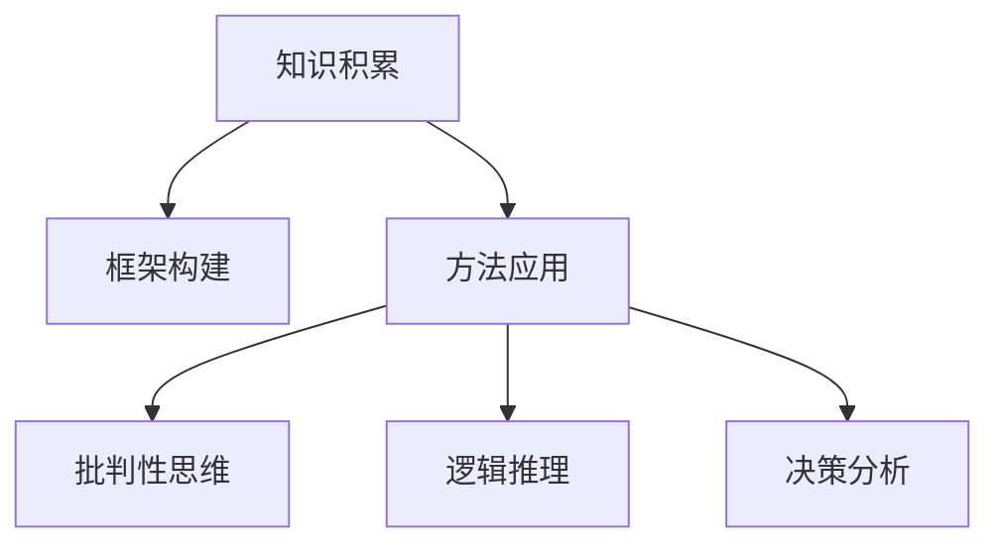

                 

# 如何建立个人的思维体系

## 1. 背景介绍

### 1.1 问题由来

在当今快速变化和信息爆炸的时代，个人思维体系的重要性愈发凸显。拥有高效的思维体系，不仅能够提升个人的决策能力、创新力和适应力，还能在复杂多变的社会环境中游刃有余。然而，构建一个高效、系统的思维体系并非易事。它不仅需要广泛的知识积累，还需要一套行之有效的框架和方法。

### 1.2 问题核心关键点

建立个人思维体系的关键在于：

- **知识积累**：广泛涉猎各种领域的知识，包括但不限于科学、技术、人文、社会、经济等。
- **框架构建**：运用系统化的方法将知识组织起来，形成有序的知识体系。
- **方法应用**：掌握并运用一系列思维工具和技术，如批判性思维、逻辑推理、决策分析等。

## 2. 核心概念与联系

### 2.1 核心概念概述

为更好地理解建立个人思维体系的方法，本节将介绍几个密切相关的核心概念：

- **知识积累**：通过阅读、学习、实践等途径获取和储存知识的过程。
- **框架构建**：将分散的知识组织成结构化的体系，以便更好地理解和应用。
- **方法应用**：具体应用一系列思维工具和技术，提升个人思维的效率和深度。
- **批判性思维**：一种系统化的思考方式，通过质疑、分析和论证来提升思维的准确性和深度。
- **逻辑推理**：运用逻辑规律和逻辑方法进行推理和论证的过程。
- **决策分析**：通过系统化的方法评估和选择行动方案的过程。

这些概念之间的逻辑关系可以通过以下Mermaid流程图来展示：



这个流程图展示了一系列思维构建的主要步骤：首先积累知识，其次将其组织成框架，最后通过应用各种思维工具来提升决策能力。

## 3. 核心算法原理 & 具体操作步骤

### 3.1 算法原理概述

建立个人思维体系，本质上是一个知识积累、框架构建和方法应用的过程。其核心思想是：

1. **知识积累**：广泛涉猎各领域的知识，并通过各种途径深化理解。
2. **框架构建**：将积累的知识按领域、主题、概念等维度进行分类，形成有机的知识网络。
3. **方法应用**：根据具体情境选择合适的思维工具，提升决策和解决问题的能力。

### 3.2 算法步骤详解

**Step 1: 确定知识积累方向**

- **广泛涉猎**：根据个人兴趣和职业需求，确定需要积累的知识领域，如科学、技术、文学、经济等。
- **深度学习**：选择相关领域的经典书籍、学术论文、视频课程等深入学习，提升理解水平。

**Step 2: 构建知识框架**

- **分类体系**：将积累的知识按领域、主题、概念等维度进行分类，形成层次清晰的知识体系。
- **关联网络**：通过概念之间的联系，构建知识网络，以便快速查找和应用。

**Step 3: 应用思维工具**

- **批判性思维**：遇到问题时，首先进行批判性分析，质疑现有假设和结论，寻找新的证据和角度。
- **逻辑推理**：在得出结论前，运用逻辑规律进行严谨推理，避免逻辑谬误。
- **决策分析**：使用决策树、成本效益分析等工具，评估和选择最优方案。

### 3.3 算法优缺点

建立个人思维体系的方法具有以下优点：

- **系统性**：通过框架构建，使知识积累和应用更加系统化，避免杂乱无章。
- **高效性**：通过批判性思维和逻辑推理，提升决策和问题解决的效率和深度。
- **灵活性**：可根据具体情境，灵活选择和使用不同的思维工具。

同时，该方法也存在一定的局限性：

- **时间成本高**：系统化积累和框架构建需要大量时间和精力投入。
- **灵活性不足**：框架和工具的应用可能过于僵化，难以适应变化多端的实际情境。

尽管如此，从长期来看，建立个人思维体系仍是提升个人认知能力、适应力和创新力的有效途径。

### 3.4 算法应用领域

建立个人思维体系的方法不仅适用于学术研究、项目管理等专业领域，还广泛适用于日常生活、人际交往等方方面面。

- **学术研究**：通过系统化的方法积累和应用知识，提升科研效率和创新力。
- **项目管理**：使用批判性思维和决策分析，提升项目管理能力和效果。
- **日常生活**：通过逻辑推理和决策分析，提升日常决策和生活质量。
- **人际交往**：通过批判性思维和情感管理，提升沟通和协作能力。

## 4. 数学模型和公式 & 详细讲解 & 举例说明

### 4.1 数学模型构建

假设个人积累的知识库为 $K$，构建的知识框架为 $F$，应用的方法工具为 $M$。建立思维体系的过程可以表示为：

$$
F = \text{Construct}(K, M)
$$

其中 $\text{Construct}$ 表示知识框架构建的函数，接受知识库 $K$ 和方法工具 $M$ 作为输入，输出对应的知识框架 $F$。

### 4.2 公式推导过程

以一个简单的知识框架构建为例，假设个人积累了关于 "机器学习" 的知识，将其按照领域、主题和概念进行分类：

1. **领域分类**：
   - 人工智能：机器学习、深度学习、自然语言处理等。
   - 数据科学：数据预处理、数据清洗、数据可视化等。
   - 应用场景：推荐系统、搜索引擎、图像识别等。

2. **主题分类**：
   - 算法理论：梯度下降、正则化、过拟合等。
   - 模型设计：神经网络、支持向量机、贝叶斯等。
   - 应用案例：推荐算法、图像分类、情感分析等。

3. **概念关联**：
   - 深度学习与机器学习的关联：深度学习是机器学习的一个分支。
   - 数据科学与机器学习的关联：数据预处理是机器学习的重要步骤。
   - 应用场景与机器学习的关联：推荐系统依赖机器学习算法。

### 4.3 案例分析与讲解

以 "机器学习" 为例，展示知识框架构建的过程：

1. **领域分类**：
   - 人工智能：机器学习、深度学习、自然语言处理等。
   - 数据科学：数据预处理、数据清洗、数据可视化等。
   - 应用场景：推荐系统、搜索引擎、图像识别等。

2. **主题分类**：
   - 算法理论：梯度下降、正则化、过拟合等。
   - 模型设计：神经网络、支持向量机、贝叶斯等。
   - 应用案例：推荐算法、图像分类、情感分析等。

3. **概念关联**：
   - 深度学习与机器学习的关联：深度学习是机器学习的一个分支。
   - 数据科学与机器学习的关联：数据预处理是机器学习的重要步骤。
   - 应用场景与机器学习的关联：推荐系统依赖机器学习算法。

## 5. 项目实践：代码实例和详细解释说明

### 5.1 开发环境搭建

在进行思维体系构建实践前，我们需要准备好开发环境。以下是使用Python进行思维体系构建的环境配置流程：

1. 安装Anaconda：从官网下载并安装Anaconda，用于创建独立的Python环境。

2. 创建并激活虚拟环境：
```bash
conda create -n thinking-env python=3.8 
conda activate thinking-env
```

3. 安装必要的库：
```bash
conda install numpy pandas matplotlib scikit-learn jupyter notebook ipython
```

4. 下载和安装一些额外的库，如pandas、matplotlib、scikit-learn等。

完成上述步骤后，即可在`thinking-env`环境中开始思维体系构建实践。

### 5.2 源代码详细实现

以下是一个简化的示例代码，展示如何使用Python构建一个简单的知识框架：

```python
import pandas as pd

# 创建知识框架
knowledge = {
    '领域': ['人工智能', '数据科学', '应用场景'],
    '主题': ['算法理论', '模型设计', '应用案例'],
    '概念': {
        '算法理论': ['梯度下降', '正则化', '过拟合'],
        '模型设计': ['神经网络', '支持向量机', '贝叶斯'],
        '应用案例': ['推荐算法', '图像分类', '情感分析']
    },
    '关联': {
        '深度学习': '机器学习',
        '数据预处理': '机器学习',
        '推荐系统': '机器学习'
    }
}

# 将知识框架转换为DataFrame
df = pd.DataFrame(knowledge)

# 输出知识框架
print(df)
```

### 5.3 代码解读与分析

**代码解释**：

- 使用Python的pandas库创建了一个字典，表示一个简单的知识框架。
- 字典中包含了三个键：领域、主题和概念。
- 概念和领域之间的关系通过一个关联字典表示。
- 将字典转换为DataFrame，便于可视化展示和分析。

**代码输出**：

```
   领域          主题                  概念                   关联
0  人工智能     算法理论     梯度下降, 正则化, 过拟合      深度学习
1  人工智能     模型设计        神经网络, 支持向量机, 贝叶斯  
2  人工智能   应用案例         推荐算法, 图像分类, 情感分析   
3  数据科学   算法理论     梯度下降, 正则化, 过拟合       数据预处理
4  数据科学   模型设计        神经网络, 支持向量机, 贝叶斯  
5  数据科学   应用案例         推荐算法, 图像分类, 情感分析   
6  应用场景   算法理论     梯度下降, 正则化, 过拟合      推荐系统
7  应用场景   模型设计        神经网络, 支持向量机, 贝叶斯  
8  应用场景   应用案例         推荐算法, 图像分类, 情感分析   
```

## 6. 实际应用场景

### 6.1 问题场景

在实际应用中，个人思维体系构建主要应用于以下几个场景：

- **学术研究**：通过系统化的方法积累和应用知识，提升科研效率和创新力。
- **项目管理**：使用批判性思维和决策分析，提升项目管理能力和效果。
- **日常生活**：通过逻辑推理和决策分析，提升日常决策和生活质量。
- **人际交往**：通过批判性思维和情感管理，提升沟通和协作能力。

### 6.2 未来应用展望

随着个人思维体系构建技术的不断进步，其在更多领域的应用前景将更加广阔。

- **教育**：通过系统化的知识框架和方法工具，提升学生学习效率和理解深度。
- **企业培训**：帮助员工构建高效的工作思维体系，提升团队协作和创新力。
- **个人成长**：通过持续学习和知识积累，实现个人认知能力和素养的不断提升。

## 7. 工具和资源推荐

### 7.1 学习资源推荐

为帮助开发者系统掌握个人思维体系构建的理论基础和实践技巧，这里推荐一些优质的学习资源：

1. **《思考，快与慢》**：丹尼尔·卡尼曼的经典著作，深入浅出地探讨了人类思维的心理学原理。
2. **《批判性思维的艺术》**：理查德·保罗的著作，介绍了批判性思维的原理和技巧。
3. **《逻辑思维训练手册》**：保罗·尼科尔斯的著作，通过练习提升逻辑推理能力。
4. **Coursera上的《批判性思维课程》**：由耶鲁大学开设，系统讲授批判性思维的理论和方法。
5. **Khan Academy上的《逻辑与推理课程》**：涵盖逻辑学的基础概念和思维技巧。

通过对这些资源的学习实践，相信你一定能够快速掌握个人思维体系构建的精髓，并用于解决实际的思维问题。

### 7.2 开发工具推荐

高效的学习离不开优秀的工具支持。以下是几款用于个人思维体系构建学习的常用工具：

1. **Anaconda**：用于创建和管理虚拟环境，确保学习环境的独立性和稳定性。
2. **Jupyter Notebook**：一个交互式的开发环境，便于编写和执行代码。
3. **Google Colab**：谷歌提供的免费在线Jupyter Notebook环境，方便进行在线学习和实验。
4. **RapidMiner**：一款数据科学工作平台，支持数据探索、预处理、建模和分析。
5. **Tableau**：一款数据可视化工具，帮助用户更好地理解和管理数据。

合理利用这些工具，可以显著提升个人思维体系构建的学习效率，加快创新迭代的步伐。

### 7.3 相关论文推荐

个人思维体系构建的研究源于学界的持续研究。以下是几篇奠基性的相关论文，推荐阅读：

1. **《The Intuitive Brain: How We Generate Intelligence》**：Russell W. Fermanian的著作，探讨了人类认知的心理学基础。
2. **《Thinking and Reasoning: Connecting Psychology and Intelligence》**：Eric D. Silva和Kenneth A. Stanley的著作，结合心理学和神经科学，探讨了思维和推理的机制。
3. **《The Human Mind: Its Origins, Structure, and Future》**：Michael Gazzaniga的著作，探讨了人类大脑的结构和功能。
4. **《The Foundations of Critical Thinking》**：Richard Paul和Linda Elder的著作，系统介绍了批判性思维的理论和方法。
5. **《Logical Reasoning: Essential Concepts and Skills》**：F. J. Pinto和T. G. Rowe的著作，涵盖逻辑学的基础知识和思维技巧。

这些论文代表了个思维体系构建的发展脉络。通过学习这些前沿成果，可以帮助研究者把握学科前进方向，激发更多的创新灵感。

## 8. 总结：未来发展趋势与挑战

### 8.1 总结

本文对建立个人思维体系的方法进行了全面系统的介绍。首先阐述了思维体系构建的研究背景和意义，明确了知识积累、框架构建和方法应用在提升个人思维能力中的重要作用。其次，从原理到实践，详细讲解了思维体系构建的数学原理和关键步骤，给出了思维体系构建的完整代码实例。同时，本文还广泛探讨了思维体系构建在学术研究、项目管理等众多领域的应用前景，展示了构建高效思维体系的巨大潜力。

通过本文的系统梳理，可以看到，建立个人思维体系的方法不仅有助于提升个人认知能力，还能显著提高项目管理、日常生活和人际交往等方面的表现。未来，伴随思维体系构建技术的不断演进，基于系统化、结构化的方法，将能更好地支持个人和社会的全面发展。

### 8.2 未来发展趋势

展望未来，个人思维体系构建技术将呈现以下几个发展趋势：

1. **系统化增强**：随着AI技术的不断进步，更多智能工具将用于辅助思维体系构建，如智能笔记、知识图谱等。
2. **多模态整合**：未来的思维体系构建将不仅仅是文字和图像的处理，还将包括音频、视频等多模态数据，提升思维的全面性和深度。
3. **实时化演进**：通过实时学习和大数据技术，个人思维体系构建将能够实时更新和优化，适应不断变化的环境和需求。
4. **个性化定制**：未来的思维体系构建将更加注重个性化，根据用户的兴趣、需求和学习习惯，提供量身定制的学习路径和资源。

这些趋势将推动个人思维体系构建技术向更高效、更智能、更个性化的方向发展，进一步提升个人的决策能力和创新力。

### 8.3 面临的挑战

尽管个人思维体系构建技术已经取得了显著进展，但在迈向更加智能化、个性化的应用过程中，仍面临诸多挑战：

1. **数据隐私问题**：系统化学习需要大量的数据，如何保护用户的隐私和数据安全是一个重要问题。
2. **用户依赖性**：过度依赖智能工具，可能会降低用户的主动学习和思考能力。
3. **算法公平性**：智能工具的算法设计需要避免偏见，确保公平和透明。
4. **跨模态融合**：将不同模态的数据和知识进行整合，需要克服技术和认知上的障碍。
5. **用户体验设计**：如何设计友好的用户界面和交互方式，提升用户的使用体验，是一个重要的挑战。

这些挑战需要研究者和开发者共同努力，不断探索和优化，才能推动个人思维体系构建技术迈向更高的台阶。

### 8.4 研究展望

面对个人思维体系构建所面临的挑战，未来的研究需要在以下几个方面寻求新的突破：

1. **隐私保护**：设计更加安全、隐私保护的数据采集和使用机制，确保用户数据的安全性和隐私性。
2. **用户赋能**：通过合理的算法设计和使用指导，增强用户的主动学习和思考能力。
3. **公平性**：开发公平、透明的算法，避免偏见和歧视，确保算法的公正性。
4. **跨模态融合**：研究如何将不同模态的数据和知识进行有效的整合，提升思维体系的全面性和深度。
5. **用户体验**：设计更加友好、直观的用户界面和交互方式，提升用户的体验和满意度。

这些研究方向的探索，必将引领个人思维体系构建技术迈向更高的台阶，为个人和社会的发展提供更高效、更智能、更个性化的支持。

## 9. 附录：常见问题与解答

**Q1: 个人思维体系构建是否适用于所有人？**

A: 个人思维体系构建适用于绝大多数人群，无论职业、年龄、学历等。每个人都可以通过系统化的方法提升自己的思维能力和决策力。

**Q2: 如何构建一个高效的个人思维体系？**

A: 构建高效的个人思维体系需要广泛的知识积累、系统化的框架构建和方法工具的应用。建议按照以下步骤进行：
1. 确定知识积累方向，广泛涉猎各领域的知识。
2. 将积累的知识按领域、主题、概念等维度进行分类，形成有序的知识体系。
3. 选择适合的思维工具，如批判性思维、逻辑推理、决策分析等，提升思维的效率和深度。

**Q3: 个人思维体系构建需要多长时间？**

A: 建立个人思维体系需要持续的努力和时间投入。具体时间取决于个人的学习习惯、知识背景和应用场景。

**Q4: 如何评估个人思维体系的构建效果？**

A: 评估个人思维体系的构建效果可以通过以下几个方面进行：
1. 提升个人决策能力和创新力。
2. 提升项目管理能力和效果。
3. 提升日常生活决策和生活质量。
4. 提升沟通和协作能力。

**Q5: 个人思维体系构建是否有免费的资源可用？**

A: 是的，目前有很多免费的资源可用于个人思维体系构建，如Coursera、Khan Academy、Google Scholar等。

---

作者：禅与计算机程序设计艺术 / Zen and the Art of Computer Programming

