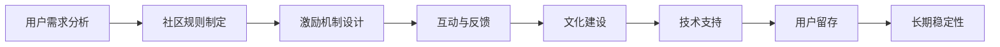

                 

# 如何建立长期稳定的用户社群

> 关键词：用户社群, 社区管理, 用户参与, 长期稳定性, 社区发展, 社群激励, 用户反馈, 社区文化, 用户留存, 数据驱动

## 1. 背景介绍

在数字化时代，用户社群（Community）成为了品牌和产品成功的关键要素。如何建立、维护一个长期稳定的用户社群，不仅能够提升品牌形象和用户忠诚度，还能驱动产品的持续迭代和创新。然而，建立和运营一个活跃、稳定的用户社群并非易事，需要系统化的策略和精细化的运营。

### 1.1 问题由来

随着互联网的发展，用户社群在品牌战略中的地位日益重要。从传统的产品论坛到现代的社交媒体平台，社群已经成为了连接品牌和用户的重要渠道。然而，社群的建立和管理仍然面临诸多挑战。例如，如何吸引用户加入，如何提高用户的活跃度，如何保持用户的长期参与等。这些问题都需要品牌和产品团队制定一套科学、系统的策略来解决。

### 1.2 问题核心关键点

构建和维护用户社群的核心关键点包括：

1. **用户需求分析**：深入理解用户需求和行为，提供符合用户期望的产品和内容。
2. **社区规则制定**：建立明确的社区规则，确保用户互动的秩序和质量。
3. **激励机制设计**：设计合理的激励机制，激发用户参与和贡献。
4. **互动与反馈**：定期与用户互动，收集用户反馈，不断优化社群体验。
5. **文化建设**：培养社群文化，形成独特的社区氛围。
6. **技术支持**：利用技术手段提升社群运营效率。

## 2. 核心概念与联系

### 2.1 核心概念概述

为了更好地理解建立长期稳定用户社群的策略，我们先简要介绍几个核心概念：

- **用户社群（Community）**：基于共同兴趣、需求或目的，通过互联网平台聚集起来的用户群体。社群可以是线上或线下的，是品牌与用户互动的重要渠道。

- **社区管理（Community Management）**：指对社群平台上的用户行为、内容以及社区生态进行维护和治理的过程。目的是促进积极互动，阻止不良行为，确保社群的长期健康发展。

- **用户参与（User Engagement）**：用户积极参与社群活动，分享内容，提出反馈，参与讨论等。高用户参与度是社群活跃和稳定的关键指标。

- **长期稳定性（Long-term Stability）**：社群长期保持活跃，用户持续参与，社群规则和氛围稳定，能够不断吸引新用户并留存现有用户。

- **社区文化（Community Culture）**：社群成员共同认同和遵守的价值观、行为准则和互动方式。良好的社区文化能够增强用户归属感，提高社群凝聚力。

- **用户留存（User Retention）**：社群中用户能够持续活跃并参与，减少流失率。用户留存是衡量社群长期稳定性的重要指标。

### 2.2 核心概念原理和架构的 Mermaid 流程图



这个流程图展示了构建长期稳定用户社群的核心步骤，从用户需求分析到用户留存，每个环节相互关联，共同影响社群的长期稳定性。

## 3. 核心算法原理 & 具体操作步骤

### 3.1 算法原理概述

建立长期稳定的用户社群，本质上是一个多维度、多层次的系统工程，涉及到用户需求分析、社区规则制定、激励机制设计等多个方面的算法和策略。

### 3.2 算法步骤详解

#### 3.2.1 用户需求分析

用户需求分析是社群构建的第一步。通过以下步骤，可以全面了解用户需求：

1. **用户调研**：通过问卷调查、用户访谈等方式，收集用户的基本信息、兴趣、需求等。
2. **行为分析**：利用数据分析工具，如Google Analytics、Mixpanel等，分析用户行为，了解用户的互动模式和偏好。
3. **市场分析**：分析竞争对手和类似社群的用户反馈，了解行业趋势和用户痛点。

#### 3.2.2 社区规则制定

明确的社区规则是社群管理的基础。以下是社区规则制定的基本步骤：

1. **制定原则**：根据用户需求分析结果，制定符合社群定位和目标的用户行为规范。
2. **规则细化**：将原则细化为具体的规则条目，如禁止发布恶意内容、遵守言论礼仪等。
3. **规则执行**：确保规则得到严格执行，防止违规行为发生。

#### 3.2.3 激励机制设计

激励机制设计能够有效提升用户参与度。以下是激励机制设计的主要步骤：

1. **奖励形式**：设计多样化的奖励形式，如积分、徽章、优惠券等。
2. **奖励条件**：明确奖励的条件，如发布高质量内容、参与讨论等。
3. **奖励实施**：及时给予用户奖励，增强用户参与的动力。

#### 3.2.4 互动与反馈

互动与反馈是社群管理的核心环节。通过以下方式，可以提升用户互动和反馈的质量：

1. **定期互动**：通过举办线上线下活动、发布公告等方式，与用户保持频繁互动。
2. **收集反馈**：利用问卷调查、评论反馈等方式，收集用户对社群的意见和建议。
3. **反馈处理**：及时回应用户反馈，解决用户问题，增强用户信任。

#### 3.2.5 文化建设

文化建设是社群长期稳定的关键。以下是文化建设的常用策略：

1. **价值观塑造**：明确社群的共同价值观，如诚信、互助、尊重等。
2. **行为引导**：通过社区规则和管理员引导，形成积极健康的互动氛围。
3. **文化活动**：定期组织文化活动，增强社群凝聚力。

#### 3.2.6 技术支持

技术支持是社群运营的重要保障。以下是常用的技术手段：

1. **社区平台**：选择合适的社区平台，如Discord、Reddit等，提供高效的用户互动环境。
2. **数据分析**：利用数据分析工具，实时监控社群动态，及时发现和解决问题。
3. **自动化工具**：开发自动化工具，如内容审核、用户管理等，提升运营效率。

### 3.3 算法优缺点

#### 3.3.1 优点

- **用户参与度高**：通过合理的激励机制和互动策略，有效提升用户参与度。
- **社区规则明确**：明确的社区规则能够维护社群秩序，防止不良行为发生。
- **文化建设深入**：良好的社区文化能够增强用户归属感，提高社群凝聚力。
- **技术支持高效**：技术手段能够提升社群运营效率，增强用户体验。

#### 3.3.2 缺点

- **规则执行难度大**：用户行为复杂多变，规则执行过程中可能遇到用户抵触。
- **激励机制设计复杂**：设计合理的激励机制需要考虑多方面因素，容易陷入设计陷阱。
- **互动与反馈质量不稳定**：用户反馈质量依赖于用户参与度，难以保证反馈的持续性和高质量。
- **技术手段局限性**：技术手段虽然能提升运营效率，但无法完全解决社群中的问题。

### 3.4 算法应用领域

社群管理技术在多个领域得到了广泛应用，包括但不限于：

1. **电商平台**：通过用户评论、社区讨论等方式，提升用户满意度，驱动产品迭代。
2. **科技产品**：利用技术手段，如人工智能、大数据分析，提升社群互动质量。
3. **媒体平台**：通过社区活动、用户参与等方式，增强用户粘性，提升平台影响力。
4. **游戏社区**：通过奖励机制、互动活动等方式，提升玩家活跃度，延长游戏生命周期。
5. **教育平台**：通过社群互动、学习反馈等方式，促进知识共享，提升学习效果。

## 4. 数学模型和公式 & 详细讲解 & 举例说明

### 4.1 数学模型构建

社群管理的数学模型主要包括以下几个部分：

1. **用户需求模型**：基于用户调研和行为分析，构建用户需求模型，用于指导社区规则和激励机制的设计。
2. **互动反馈模型**：通过用户互动数据和反馈信息，建立用户互动反馈模型，用于优化互动策略。
3. **文化建设模型**：利用用户互动和反馈数据，构建社群文化模型，用于指导文化建设活动。

### 4.2 公式推导过程

以用户需求模型为例，假设用户需求可以用向量 $U$ 表示，其中 $U_i$ 表示第 $i$ 个用户需求。用户需求模型可以表示为：

$$U = f(X, Y)$$

其中 $X$ 表示用户调研数据，$Y$ 表示行为分析数据。$f$ 表示一个函数，将 $X$ 和 $Y$ 映射到用户需求向量 $U$。

以互动反馈模型为例，假设用户互动数据可以用矩阵 $I$ 表示，其中 $I_{ij}$ 表示第 $i$ 个用户在第 $j$ 次互动中的行为数据。互动反馈模型可以表示为：

$$F = g(I, C)$$

其中 $C$ 表示社区规则和激励机制，$g$ 表示一个函数，将 $I$ 和 $C$ 映射到互动反馈数据 $F$。

### 4.3 案例分析与讲解

假设某电商平台希望提升用户满意度，通过用户调研和行为分析，构建了用户需求模型 $U = f(X, Y)$。根据模型结果，发现用户对产品多样性、价格公道、售后服务等需求较高。基于此，平台制定了相应的社区规则和激励机制，如禁止虚假宣传、奖励高质量评论等。

通过数据分析工具，平台建立了互动反馈模型 $F = g(I, C)$，发现用户对产品多样性、价格公道的评价较高，但对售后服务满意度较低。基于此，平台加大了对售后服务规则的宣传和激励，提升了用户满意度。

## 5. 项目实践：代码实例和详细解释说明

### 5.1 开发环境搭建

项目开发环境搭建包括以下步骤：

1. **环境安装**：安装Python、Django、MySQL等开发工具和库。
2. **项目配置**：配置项目结构、依赖关系、数据库连接等。
3. **代码管理**：使用Git等版本控制工具管理代码版本。

### 5.2 源代码详细实现

以下是一个简单的社区管理平台的代码实现示例：

```python
from django.contrib.auth.models import User
from django.db import models

class Community(models.Model):
    name = models.CharField(max_length=255)
    description = models.TextField()
    rules = models.TextField()

    def __str__(self):
        return self.name

class Member(models.Model):
    user = models.ForeignKey(User, on_delete=models.CASCADE)
    community = models.ForeignKey(Community, on_delete=models.CASCADE)
    role = models.CharField(max_length=50)

class Activity(models.Model):
    type = models.CharField(max_length=50)
    content = models.TextField()
    created_at = models.DateTimeField(auto_now_add=True)
    member = models.ForeignKey(Member, on_delete=models.CASCADE)

# 用户需求模型
def user_needs_analysis(request):
    # 获取用户调研和行为分析数据
    调研数据 = get_user_survey_data()
    行为数据 = get_user_behavior_data()

    # 构建用户需求向量
    用户需求向量 = 函数(f, 调研数据, 行为数据)

    return 用户需求向量

# 互动反馈模型
def user_feedback_analysis(request):
    # 获取用户互动数据
    互动数据 = get_user_interaction_data()

    # 构建互动反馈数据
    互动反馈数据 = 函数(g, 互动数据, 社区规则和激励机制)

    return 互动反馈数据
```

### 5.3 代码解读与分析

上述代码展示了社区管理平台的核心模型和功能实现。以下是对关键代码的详细解读：

- **用户模型**：定义了用户的基本信息，包括用户名、密码等。
- **社区模型**：定义了社区的基本信息，包括社区名称、描述、规则等。
- **会员模型**：定义了用户与社区的关系，包括会员角色等。
- **活动模型**：定义了社区中的活动，包括活动类型、内容、时间等。
- **用户需求模型**：通过调研数据和行为数据分析，构建用户需求向量，用于指导社区规则和激励机制的设计。
- **互动反馈模型**：通过用户互动数据和社区规则和激励机制，构建互动反馈数据，用于优化互动策略。

### 5.4 运行结果展示

运行上述代码，可以通过Web界面展示社区的详细信息、用户参与活动、用户互动反馈等数据。通过数据分析工具，可以实时监控用户行为和互动数据，及时调整社区规则和激励机制。

## 6. 实际应用场景

### 6.1 智能客服系统

智能客服系统可以通过用户社群管理技术，提升用户满意度，增强用户粘性。平台可以在社群中设置智能客服机器人，提供24/7的客户服务，快速响应用户问题。通过收集用户反馈和互动数据，平台可以不断优化智能客服算法，提高服务质量。

### 6.2 在线教育平台

在线教育平台可以通过用户社群管理技术，增强师生互动，提升学习效果。平台可以构建学习小组，促进学生之间的交流和协作，分享学习资源。通过用户反馈和互动数据，平台可以优化教学内容和方式，提升教学质量。

### 6.3 社交媒体平台

社交媒体平台可以通过用户社群管理技术，提升用户活跃度，增强平台影响力。平台可以举办各种社区活动，如线上竞赛、话题讨论等，吸引用户参与。通过用户互动和反馈数据，平台可以不断优化社区规则和内容，提升用户体验。

### 6.4 未来应用展望

未来，用户社群管理技术将在更多领域得到应用，为品牌和产品带来更大的价值。例如：

- **医疗健康**：通过用户社群管理技术，构建健康交流社区，提升用户健康意识，推动健康产品创新。
- **金融服务**：通过用户社群管理技术，构建理财社区，提升用户理财水平，推动金融产品创新。
- **旅游出行**：通过用户社群管理技术，构建旅游交流社区，提升用户旅游体验，推动旅游产品创新。
- **环保公益**：通过用户社群管理技术，构建环保公益社区，提升用户环保意识，推动环保产品创新。

## 7. 工具和资源推荐

### 7.1 学习资源推荐

为了帮助开发者系统掌握用户社群管理的技术，以下推荐一些优质的学习资源：

1. **《社区管理技术》**：详细介绍了用户社群管理的核心概念和实现方法。
2. **《用户行为分析与建模》**：讲解了用户行为分析的技术和工具，以及如何构建用户需求模型。
3. **《社区文化建设》**：介绍了如何通过社区活动和互动，培养良好的社区文化。
4. **《社区技术平台》**：介绍了各种社区管理平台的使用方法和最佳实践。

### 7.2 开发工具推荐

以下推荐一些常用的开发工具，助力社区管理平台的开发：

1. **Django**：基于Python的开源Web框架，可以快速搭建社区管理平台。
2. **MySQL**：高可靠性的关系型数据库，适合存储和管理社区数据。
3. **Git**：版本控制工具，方便团队协作和代码管理。
4. **JIRA**：项目管理工具，可以帮助团队跟踪任务和问题。

### 7.3 相关论文推荐

以下推荐一些关于用户社群管理的经典论文，供深入研究：

1. **《社区管理与用户参与度提升研究》**：研究如何通过社区管理提升用户参与度。
2. **《基于用户行为的社群推荐系统》**：探讨如何通过用户行为数据构建社群推荐系统。
3. **《社区文化与用户留存研究》**：研究社区文化对用户留存的影响。
4. **《社区平台设计与用户体验优化》**：介绍社区平台的设计原则和用户体验优化方法。

## 8. 总结：未来发展趋势与挑战

### 8.1 研究成果总结

用户社群管理技术在品牌和产品中的应用取得了显著成果，提升了用户满意度，增强了用户粘性。然而，用户社群管理也面临着诸多挑战，如规则执行难度大、激励机制设计复杂、互动与反馈质量不稳定等。

### 8.2 未来发展趋势

未来，用户社群管理技术将呈现以下几个发展趋势：

1. **自动化与智能化**：利用人工智能和大数据分析技术，提升社群管理的自动化和智能化水平，降低人工干预成本。
2. **多渠道融合**：通过多种渠道和平台，构建多渠道、多层次的社群生态，提升用户体验和互动质量。
3. **数据驱动**：通过数据驱动的决策，优化社群规则和激励机制，提升用户参与度和满意度。
4. **文化与价值观**：注重社群文化与价值观的建设，增强用户归属感和忠诚度。
5. **跨领域应用**：用户社群管理技术将在更多领域得到应用，如医疗健康、金融服务、环保公益等。

### 8.3 面临的挑战

尽管用户社群管理技术取得了显著成果，但仍面临诸多挑战：

1. **规则执行难度大**：用户行为复杂多变，规则执行过程中可能遇到用户抵触。
2. **激励机制设计复杂**：设计合理的激励机制需要考虑多方面因素，容易陷入设计陷阱。
3. **互动与反馈质量不稳定**：用户反馈质量依赖于用户参与度，难以保证反馈的持续性和高质量。
4. **技术手段局限性**：技术手段虽然能提升运营效率，但无法完全解决社群中的问题。
5. **文化建设困难**：培养社群文化需要时间和投入，难以快速见效。

### 8.4 研究展望

未来，用户社群管理技术需要在以下几个方面寻求新的突破：

1. **自动化与智能化**：利用人工智能和大数据分析技术，提升社群管理的自动化和智能化水平。
2. **多渠道融合**：通过多种渠道和平台，构建多渠道、多层次的社群生态。
3. **数据驱动**：通过数据驱动的决策，优化社群规则和激励机制。
4. **文化与价值观**：注重社群文化与价值观的建设，增强用户归属感和忠诚度。
5. **跨领域应用**：用户社群管理技术将在更多领域得到应用，提升品牌和产品价值。

## 9. 附录：常见问题与解答

### 9.1 用户社群管理技术是否适用于所有品牌和产品？

A: 用户社群管理技术虽然适用于大多数品牌和产品，但需要根据品牌和产品的特性进行定制化设计。例如，电商平台和教育平台的需求和运营方式有所不同，需要不同的用户互动和反馈策略。

### 9.2 社群规则的制定和执行如何平衡自由和规范？

A: 社群规则的制定和执行需要平衡自由和规范，既要尊重用户自由表达，又要维护社群秩序。可以通过公开透明的规则制定过程，听取用户意见，确保规则的公平性和合理性。在执行过程中，可以通过管理员引导和用户自管理相结合的方式，维护社群秩序。

### 9.3 用户互动和反馈的质量如何保证？

A: 用户互动和反馈的质量需要系统化的管理。可以通过设置互动和反馈标准，引导用户进行高质量互动和反馈。同时，利用数据分析工具，实时监控互动和反馈质量，及时发现和解决问题。

### 9.4 社群文化建设如何进行？

A: 社群文化建设需要长期投入和坚持。可以通过定期举办文化活动，如主题讨论、文化分享等，增强社群凝聚力。同时，注重社区管理员和意见领袖的培养，引导用户形成积极健康的互动氛围。

### 9.5 社群管理技术有哪些局限性？

A: 社群管理技术虽然能够提升用户参与度和满意度，但无法完全解决所有问题。例如，用户行为复杂多变，规则执行过程中可能遇到用户抵触。用户反馈质量依赖于用户参与度，难以保证反馈的持续性和高质量。因此，社群管理需要多种手段相结合，才能达到最佳效果。

---

作者：禅与计算机程序设计艺术 / Zen and the Art of Computer Programming

