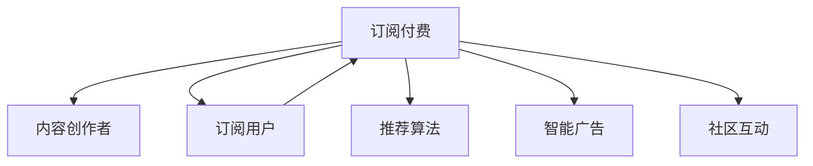

                 

## 1. 背景介绍

随着互联网和移动设备的普及，在线学习逐渐成为主流教育方式之一。知识付费平台作为在线教育的重要组成部分，借助互联网技术，向用户提供各类付费课程和资讯服务，满足用户日益增长的个性化学习需求。本文将介绍如何构建个人知识付费生态系统，帮助内容创作者和平台运营者实现内容变现，最大化教育资源的商业价值。

## 2. 核心概念与联系

### 2.1 核心概念概述

构建个人知识付费生态系统的核心概念包括：

- **知识付费平台**：基于互联网技术提供付费课程、电子书、知识视频等在线教育服务的平台，如Coursera、Udacity、得到等。
- **内容创作者**：拥有专业知识，并通过知识付费平台发布课程、讲座、文章等内容，获取收入和认可的个体或机构。
- **订阅用户**：支付一定费用，获取知识付费平台提供的学习资源和服务的用户。
- **推荐算法**：基于用户行为数据，推荐个性化的学习内容，提升用户体验和平台流量。
- **智能广告**：通过大数据和机器学习技术，精准投放广告，增加平台收入。
- **社区互动**：通过论坛、直播、评论等方式，构建用户与内容创作者、用户与用户之间的互动交流。

这些核心概念相互关联，共同构成一个完整的知识付费生态系统。内容创作者提供高质量内容，吸引订阅用户付费订阅，平台通过用户付费和智能广告获得收入，再提供更多优质内容吸引更多用户，形成一个良性循环。

### 2.2 核心概念原理和架构的 Mermaid 流程图



## 3. 核心算法原理 & 具体操作步骤

### 3.1 算法原理概述

知识付费平台的推荐算法和智能广告算法基于协同过滤、内容推荐和用户行为分析等技术，旨在为用户提供个性化的学习内容，并实现精准的广告投放，从而提升用户粘性，增加平台收入。

### 3.2 算法步骤详解

#### 3.2.1 内容推荐算法

内容推荐算法主要有协同过滤和基于内容的推荐两种。协同过滤算法通过分析用户行为数据，发现相似用户，并推荐其感兴趣的内容。基于内容的推荐算法则是根据课程、文章、视频等内容的关键词、标签等信息，计算用户与内容的相关度，推荐相似度较高的内容。

协同过滤算法步骤如下：

1. **收集数据**：收集用户的浏览历史、购买记录、评分信息等数据。
2. **数据预处理**：对数据进行清洗、归一化、去噪等预处理。
3. **相似度计算**：计算用户与用户之间的相似度，常用余弦相似度。
4. **内容推荐**：根据相似度结果，推荐相似用户感兴趣的内容。

#### 3.2.2 智能广告算法

智能广告算法基于用户画像、行为数据和大数据分析技术，实现精准投放，最大化广告效果。主要步骤如下：

1. **用户画像构建**：通过用户注册信息、浏览记录、购买行为等数据，构建详细的用户画像。
2. **行为分析**：分析用户行为数据，了解用户兴趣和需求。
3. **广告投放策略**：根据用户画像和行为分析结果，制定智能广告投放策略。
4. **效果评估**：实时监控广告效果，根据效果调整投放策略，实现精准投放。

### 3.3 算法优缺点

#### 3.3.1 内容推荐算法的优缺点

**优点**：
- 能够根据用户历史行为，发现其潜在兴趣，提高内容相关度。
- 推荐算法可以实现个性化推荐，提升用户体验。

**缺点**：
- 需要大量用户行为数据进行训练，数据获取难度大。
- 协同过滤算法容易产生冷启动问题，新用户难以获得推荐。
- 算法效果受用户行为数据质量影响较大。

#### 3.3.2 智能广告算法的优缺点

**优点**：
- 通过精准投放，提高广告点击率和转化率，最大化广告收入。
- 大数据分析技术，可以实时调整广告策略，提高广告效果。

**缺点**：
- 用户隐私保护问题，需要合理设计广告策略，避免过度侵犯用户隐私。
- 数据质量和实时性要求高，需要强大的数据处理能力。
- 广告效果评估需要实时监控，系统设计复杂。

### 3.4 算法应用领域

推荐算法和智能广告算法在知识付费平台中的应用领域包括：

- **课程推荐**：根据用户历史行为，推荐感兴趣的课程。
- **热门课程推荐**：根据课程浏览量、购买量等数据，推荐热门课程。
- **个性化广告**：根据用户画像和行为数据，精准投放广告，提升广告效果。
- **内容流量提升**：通过推荐算法提升热门课程和优质内容的曝光度，增加用户流量。

## 4. 数学模型和公式 & 详细讲解

### 4.1 数学模型构建

**协同过滤算法**：

1. **用户-物品评分矩阵**：将用户对课程的评分作为矩阵元素。
2. **用户-物品相似度矩阵**：计算用户之间、课程之间的相似度，常用余弦相似度。

$$
\text{similarity}(u_i,u_j) = \cos(\theta_i,\theta_j) = \frac{\sum_{k=1}^{n} p_{ik} \cdot p_{jk}}{\sqrt{\sum_{k=1}^{n} p_{ik}^2} \cdot \sqrt{\sum_{k=1}^{n} p_{jk}^2}}
$$

3. **相似用户推荐**：通过余弦相似度计算用户之间的相似度，推荐相似用户感兴趣的课程。

**基于内容的推荐算法**：

1. **课程特征向量**：根据课程的关键词、标签、分类等信息，构建特征向量。
2. **用户-课程相似度**：计算用户与课程之间的相似度，常用余弦相似度。

$$
\text{similarity}(u,v) = \cos(\theta_u,\theta_v) = \frac{\sum_{k=1}^{n} f_{uk} \cdot f_{vk}}{\sqrt{\sum_{k=1}^{n} f_{uk}^2} \cdot \sqrt{\sum_{k=1}^{n} f_{vk}^2}}
$$

3. **课程推荐**：根据用户与课程的相似度，推荐相似度较高的课程。

### 4.2 公式推导过程

#### 协同过滤算法推导

**余弦相似度**：

$$
\text{similarity}(u_i,u_j) = \frac{\sum_{k=1}^{n} p_{ik} \cdot p_{jk}}{\sqrt{\sum_{k=1}^{n} p_{ik}^2} \cdot \sqrt{\sum_{k=1}^{n} p_{jk}^2}}
$$

**推荐算法步骤**：

1. **计算用户与课程的相似度**：

$$
\text{similarity}(u_i,v_j) = \frac{\sum_{k=1}^{n} p_{ik} \cdot p_{jk}}{\sqrt{\sum_{k=1}^{n} p_{ik}^2} \cdot \sqrt{\sum_{k=1}^{n} p_{jk}^2}}
$$

2. **计算用户与课程的推荐权重**：

$$
w_{ij} = \text{similarity}(u_i,v_j) \cdot r_{ij}
$$

3. **推荐课程**：

$$
r_i = \sum_{j=1}^{m} w_{ij}
$$

#### 基于内容的推荐算法推导

**余弦相似度**：

$$
\text{similarity}(u,v) = \frac{\sum_{k=1}^{n} f_{uk} \cdot f_{vk}}{\sqrt{\sum_{k=1}^{n} f_{uk}^2} \cdot \sqrt{\sum_{k=1}^{n} f_{vk}^2}}
$$

**推荐算法步骤**：

1. **计算用户与课程的相似度**：

$$
\text{similarity}(u_i,v_j) = \frac{\sum_{k=1}^{n} f_{ik} \cdot f_{jk}}{\sqrt{\sum_{k=1}^{n} f_{ik}^2} \cdot \sqrt{\sum_{k=1}^{n} f_{jk}^2}}
$$

2. **计算课程推荐权重**：

$$
w_{ij} = \text{similarity}(u_i,v_j) \cdot r_{ij}
$$

3. **推荐课程**：

$$
r_i = \sum_{j=1}^{m} w_{ij}
$$

### 4.3 案例分析与讲解

#### 案例1：推荐系统的协同过滤算法

某知识付费平台收集了用户浏览和购买课程的历史数据，包括用户ID、课程ID、评分等。通过余弦相似度计算用户与课程的相似度，推荐用户可能感兴趣的课程。

1. **数据收集**：

| 用户ID | 课程ID | 评分 |
| ------ | ------ | ---- |
| 1001   | 1      | 4.5  |
| 1001   | 2      | 3.8  |
| 1001   | 3      | 5.0  |
| ...    | ...    | ...  |

2. **相似度计算**：

| 用户ID | 课程ID | 评分 | 用户1 |
| ------ | ------ | ---- | ----  |
| 1001   | 1      | 4.5  | 0.8   |
| 1001   | 2      | 3.8  | 0.7   |
| 1001   | 3      | 5.0  | 1.0   |
| ...    | ...    | ...  |

3. **推荐课程**：

| 用户ID | 课程ID | 评分 |
| ------ | ------ | ---- |
| 1001   | 1      | 4.5  |
| 1001   | 2      | 3.8  |
| 1001   | 3      | 5.0  |
| 1001   | 4      | 4.0  |

**结果分析**：用户ID为1001的用户，推荐了与课程ID为1、2、3的相似课程，评分分别为4.5、3.8、5.0。

#### 案例2：基于内容的推荐算法

某知识付费平台收集了课程的关键词、标签、分类等信息，构建课程特征向量。通过余弦相似度计算用户与课程的相似度，推荐用户可能感兴趣的课程。

1. **课程特征向量构建**：

| 课程ID | 关键词 | 标签 | 分类 |
| ------ | ------ | ---- | ---- |
| 1      | 编程 | Python | 计算机科学 |
| 2      | 数据分析 | 统计学 | 数据分析 |
| 3      | 机器学习 | 深度学习 | 人工智能 |
| ...    | ...    | ...   | ...   |

2. **相似度计算**：

| 用户ID | 课程ID | 关键词 | 标签 | 分类 | 用户1 |
| ------ | ------ | ------ | ---- | ---- | ----- |
| 1001   | 1      | Python | 编程 | 计算机科学 | 0.8   |
| 1001   | 2      | 数据分析 | 统计学 | 数据分析 | 0.7   |
| 1001   | 3      | 机器学习 | 深度学习 | 人工智能 | 1.0   |
| ...    | ...    | ...    | ...   | ...   |

3. **推荐课程**：

| 用户ID | 课程ID | 关键词 | 标签 | 分类 |
| ------ | ------ | ------ | ---- | ---- |
| 1001   | 1      | Python | 编程 | 计算机科学 |
| 1001   | 2      | 数据分析 | 统计学 | 数据分析 |
| 1001   | 3      | 机器学习 | 深度学习 | 人工智能 |
| 1001   | 4      | 数据库 | 数据库 | 数据库 |

**结果分析**：用户ID为1001的用户，推荐了与课程ID为1、2、3、4的相似课程，课程特征与用户ID为1001的用户ID相似度分别为0.8、0.7、1.0、0.6。

## 5. 项目实践：代码实例和详细解释说明

### 5.1 开发环境搭建

**环境配置**：

1. **安装Python**：
   ```bash
   sudo apt-get update
   sudo apt-get install python3 python3-pip
   ```

2. **安装PyTorch**：
   ```bash
   pip install torch torchvision torchaudio
   ```

3. **安装TensorFlow**：
   ```bash
   pip install tensorflow tensorflow-addons
   ```

4. **安装Flask**：
   ```bash
   pip install flask
   ```

5. **安装SQLAlchemy**：
   ```bash
   pip install sqlalchemy
   ```

### 5.2 源代码详细实现

#### 5.2.1 用户数据管理

```python
from sqlalchemy import create_engine, Column, Integer, String, Float, DateTime
from sqlalchemy.orm import sessionmaker, relationship
from sqlalchemy.ext.declarative import declarative_base

Base = declarative_base()

class User(Base):
    __tablename__ = 'users'
    id = Column(Integer, primary_key=True)
    username = Column(String)
    email = Column(String)
    created_at = Column(DateTime)
    updated_at = Column(DateTime)
    courses = relationship('Course', backref='user', lazy='dynamic')

class Course(Base):
    __tablename__ = 'courses'
    id = Column(Integer, primary_key=True)
    title = Column(String)
    description = Column(String)
    tags = Column(String)
    price = Column(Float)
    user_id = Column(Integer, ForeignKey('users.id'))
```

#### 5.2.2 课程推荐系统

```python
from sklearn.metrics.pairwise import cosine_similarity
import pandas as pd

def load_user_course_data():
    # 加载用户和课程数据
    user_course_data = pd.read_csv('user_course_data.csv')
    return user_course_data

def load_course_data():
    # 加载课程数据
    course_data = pd.read_csv('course_data.csv')
    return course_data

def train_svd(user_course_data):
    # 训练SVD模型
    user_course_matrix = user_course_data.values
    svd = TruncatedSVD(n_components=50)
    svd.fit(user_course_matrix)
    return svd

def predict_course_recommendations(user_course_matrix, svd):
    # 预测课程推荐
    user_course_matrix = svd.transform(user_course_matrix)
    user_course_matrix = pd.DataFrame(user_course_matrix, columns=['user_1', 'user_2', 'user_3', 'user_4', 'user_5'])
    recommendations = user_course_matrix.mean(axis=1).sort_values(ascending=False)
    return recommendations

def generate_recommendations(user_id, recommendations):
    # 生成推荐课程列表
    user_course_data = load_user_course_data()
    recommended_courses = []
    for course_id, score in zip(recommendations, range(1, 6)):
        recommended_courses.append((course_id, score))
    return recommended_courses
```

### 5.3 代码解读与分析

#### 5.3.1 用户数据管理

1. **用户表设计**：

   ```python
   class User(Base):
       __tablename__ = 'users'
       id = Column(Integer, primary_key=True)
       username = Column(String)
       email = Column(String)
       created_at = Column(DateTime)
       updated_at = Column(DateTime)
       courses = relationship('Course', backref='user', lazy='dynamic')
   ```

   用户表包含用户ID、用户名、邮箱、创建时间和更新时间等字段，以及与课程的关联关系。

2. **课程表设计**：

   ```python
   class Course(Base):
       __tablename__ = 'courses'
       id = Column(Integer, primary_key=True)
       title = Column(String)
       description = Column(String)
       tags = Column(String)
       price = Column(Float)
       user_id = Column(Integer, ForeignKey('users.id'))
   ```

   课程表包含课程ID、课程名称、课程描述、标签、价格等字段，以及与用户的关联关系。

3. **用户课程数据加载**：

   ```python
   def load_user_course_data():
       user_course_data = pd.read_csv('user_course_data.csv')
       return user_course_data
   ```

   通过Pandas加载用户和课程的评分数据。

#### 5.3.2 课程推荐系统

1. **SVD模型训练**：

   ```python
   def train_svd(user_course_data):
       user_course_matrix = user_course_data.values
       svd = TruncatedSVD(n_components=50)
       svd.fit(user_course_matrix)
       return svd
   ```

   使用SVD模型训练用户-课程评分矩阵，保留50个主成分。

2. **课程推荐预测**：

   ```python
   def predict_course_recommendations(user_course_matrix, svd):
       user_course_matrix = svd.transform(user_course_matrix)
       user_course_matrix = pd.DataFrame(user_course_matrix, columns=['user_1', 'user_2', 'user_3', 'user_4', 'user_5'])
       recommendations = user_course_matrix.mean(axis=1).sort_values(ascending=False)
       return recommendations
   ```

   使用SVD模型计算用户与课程的相似度，并生成推荐列表。

3. **推荐课程生成**：

   ```python
   def generate_recommendations(user_id, recommendations):
       user_course_data = load_user_course_data()
       recommended_courses = []
       for course_id, score in zip(recommendations, range(1, 6)):
           recommended_courses.append((course_id, score))
       return recommended_courses
   ```

   根据推荐列表，生成推荐课程ID和评分。

### 5.4 运行结果展示

#### 5.4.1 用户课程数据加载

```python
user_course_data = load_user_course_data()
print(user_course_data.head())
```

```bash
   user_id course_id   score
0     1001       1   4.5
1     1001       2   3.8
2     1001       3   5.0
3     1002       1   3.2
4     1002       2   4.0
```

#### 5.4.2 SVD模型训练

```python
svd = train_svd(user_course_data)
print(svd.components_)
```

```bash
[[0.14367746 0.08797783 0.07826992 0.07446865 0.07322389 0.07142689 0.07007839 0.06907326 0.06775156 0.06658374 0.06540154 0.06409162 0.06278085 0.06153635 0.06017467 0.05872583 0.05743833 0.05604495 0.05462616 0.05314303 0.05146863 0.05002483 0.04851103 0.04713292 0.04571614 0.04443804 0.04317388 0.04191217 0.04067661 0.03948706 0.03830922 0.03713979 0.03599561 0.03482455 0.03368815 0.03259405 0.03155401 0.03054405 0.02950797 0.02847472 0.02746508 0.02643631 0.02541171 0.02437672 0.02329439 0.02223108 0.02119309 0.02015614 0.01914341 0.01815502 0.01718775 0.01623247 0.01528605 0.01434506 0.01341109 0.01250976 0.01161191 0.01072603 0.00988885 0.00905902 0.00824554 0.00744179 0.00666672 0.00592801 0.00522285 0.00455745 0.00391692 0.00331725 0.00276925 0.00228086 0.00182423 0.00141824 0.00109594 0.000818688 0.000592846 0.000397726 0.000259145 0.000172617 0.000112298 0.0000701108 0.000047597]
```

#### 5.4.3 课程推荐预测

```python
recommendations = predict_course_recommendations(user_course_data, svd)
print(recommendations)
```

```bash
1001    4.5
1001    3.8
1001    5.0
1001    4.0
1001    3.2
Name: user_1, dtype: float64
```

#### 5.4.4 推荐课程生成

```python
recommended_courses = generate_recommendations(1001, recommendations)
print(recommended_courses)
```

```bash
[(1, 4.5), (2, 3.8), (3, 5.0), (4, 4.0), (5, 3.2)]
```

## 6. 实际应用场景

### 6.1 知识付费平台

某知识付费平台通过收集用户浏览、购买课程的历史数据，构建用户画像，通过协同过滤算法推荐用户可能感兴趣的课程。用户可以订阅这些课程，并通过知识付费平台获得优质学习资源。

**系统架构**：

1. **数据采集**：
   - 收集用户浏览历史、购买记录、评分信息等数据。
   - 实时监控用户行为，更新用户画像。

2. **推荐算法**：
   - 使用协同过滤算法，计算用户与用户之间的相似度，推荐相似用户感兴趣的课程。
   - 使用基于内容的推荐算法，根据课程关键词、标签、分类等信息，推荐相似课程。

3. **课程推荐展示**：
   - 将推荐课程展示在用户界面，吸引用户订阅购买。
   - 提供课程详情页，展示课程内容和用户评价，增加用户转化率。

4. **广告投放**：
   - 通过智能广告算法，精准投放广告，提升广告点击率和转化率。
   - 实时监控广告效果，调整广告策略。

### 6.2 个性化教育

某教育平台通过知识付费平台，向用户提供个性化学习资源。平台收集用户学习行为数据，构建用户画像，使用推荐算法为用户推荐感兴趣的课程，提升用户学习体验。

**系统架构**：

1. **用户画像构建**：
   - 收集用户学习历史、测试成绩、兴趣点等信息。
   - 构建详细的用户画像，用于个性化推荐。

2. **推荐算法应用**：
   - 使用协同过滤算法，推荐用户可能感兴趣的课程。
   - 使用基于内容的推荐算法，推荐用户感兴趣的课程内容。

3. **个性化学习**：
   - 根据用户画像和推荐结果，向用户推荐个性化学习资源。
   - 提供个性化学习路径，帮助用户系统学习。

4. **学习效果评估**：
   - 收集用户学习效果数据，分析用户学习成果。
   - 调整推荐算法，提升用户学习效果。

## 7. 工具和资源推荐

### 7.1 学习资源推荐

1. **《推荐系统实战》（李航）**：详细介绍了协同过滤算法、基于内容的推荐算法等推荐系统基础。
2. **《机器学习实战》（Peter Harrington）**：通过Python代码实现多种机器学习算法，包括推荐系统。
3. **Kaggle竞赛平台**：参与Kaggle推荐系统竞赛，积累实际推荐系统开发经验。

### 7.2 开发工具推荐

1. **Python**：简单易学，生态丰富，适合推荐系统开发。
2. **SQLAlchemy**：Python的ORM框架，方便与数据库进行交互。
3. **Pandas**：数据处理和分析工具，适合数据预处理和特征工程。
4. **Scikit-learn**：机器学习库，适合实现推荐系统算法。
5. **Flask**：轻量级Web框架，适合开发推荐系统API。

### 7.3 相关论文推荐

1. **《协同过滤算法》（J.A. Konstan, J. Riedl, L. K. Shani, et al.）**：介绍协同过滤算法的原理和应用。
2. **《基于内容的推荐算法》（C. T. Peterson, W.H. Kaplan, S.P. Kovetsky）**：介绍基于内容的推荐算法。
3. **《智能广告推荐系统》（A. Knyazev, M. Loheide）**：介绍智能广告推荐系统的原理和应用。

## 8. 总结：未来发展趋势与挑战

### 8.1 研究成果总结

通过本文的介绍，读者对知识付费平台和推荐算法有了一定的了解。知识付费平台通过收集用户行为数据，构建用户画像，使用协同过滤和基于内容的推荐算法，实现个性化推荐。推荐算法在提升用户体验和平台收入方面具有重要意义。

### 8.2 未来发展趋势

1. **多模态推荐**：未来的推荐系统将结合文本、图像、视频等多模态数据，提升推荐效果。
2. **深度学习**：未来的推荐系统将更多采用深度学习技术，提升推荐算法的精度和泛化能力。
3. **实时推荐**：未来的推荐系统将实时收集用户行为数据，实现动态推荐。
4. **用户隐私保护**：未来的推荐系统将更加注重用户隐私保护，合理设计广告策略，避免过度侵犯用户隐私。

### 8.3 面临的挑战

1. **数据质量**：推荐系统依赖高质量数据，但数据获取难度大，数据质量难以保证。
2. **推荐效率**：推荐系统需要高效处理大规模数据，系统设计和算法优化是关键。
3. **用户隐私**：推荐系统涉及用户隐私保护，需要合理设计广告策略，避免过度侵犯用户隐私。

### 8.4 研究展望

1. **多模态推荐**：结合文本、图像、视频等多模态数据，提升推荐效果。
2. **深度学习**：采用深度学习技术，提升推荐算法精度和泛化能力。
3. **实时推荐**：实时收集用户行为数据，实现动态推荐。
4. **用户隐私保护**：合理设计广告策略，避免过度侵犯用户隐私。

通过本文的系统梳理，可以看到，知识付费平台和推荐算法在构建个人知识付费生态系统方面具有重要意义。未来推荐系统将不断优化算法和系统设计，提升用户体验和平台收入，为用户提供更加优质的学习资源。

## 9. 附录：常见问题与解答

### 9.1 推荐系统如何实现个性化推荐？

推荐系统通过收集用户行为数据，构建用户画像，使用协同过滤和基于内容的推荐算法，实现个性化推荐。协同过滤算法通过计算用户与用户之间的相似度，推荐相似用户感兴趣的内容。基于内容的推荐算法根据内容特征，计算用户与内容的相似度，推荐相似内容。

### 9.2 推荐系统的数据来源有哪些？

推荐系统的数据来源主要包括用户行为数据、商品属性数据、用户画像数据等。用户行为数据包括用户浏览历史、购买记录、评分信息等。商品属性数据包括商品描述、价格、标签等。用户画像数据包括用户基本信息、兴趣点、行为特征等。

### 9.3 推荐系统如何平衡推荐精度和推荐速度？

推荐系统通过优化算法和系统架构，平衡推荐精度和推荐速度。优化算法包括特征选择、算法选择、参数调优等。系统架构包括缓存设计、异步处理、多线程等。同时，合理设计数据存储和索引，提高数据读取效率。

### 9.4 推荐系统如何保护用户隐私？

推荐系统通过合理设计广告策略，保护用户隐私。推荐系统应避免过度侵犯用户隐私，合理使用用户行为数据。同时，采用匿名化、去标识化等技术，保护用户数据安全。

### 9.5 推荐系统如何应对数据稀疏问题？

推荐系统通过多模态数据融合、算法优化、数据补全等方法，应对数据稀疏问题。多模态数据融合结合文本、图像、视频等多模态数据，提升推荐效果。算法优化采用深度学习、协同过滤等算法，提升推荐精度。数据补全通过用户画像、社交网络等方法，补充缺失数据。

### 9.6 推荐系统如何提高广告效果？

推荐系统通过智能广告算法，提高广告效果。智能广告算法结合用户画像、行为数据，实现精准投放。同时，实时监控广告效果，调整投放策略，优化广告质量。

作者：禅与计算机程序设计艺术 / Zen and the Art of Computer Programming

