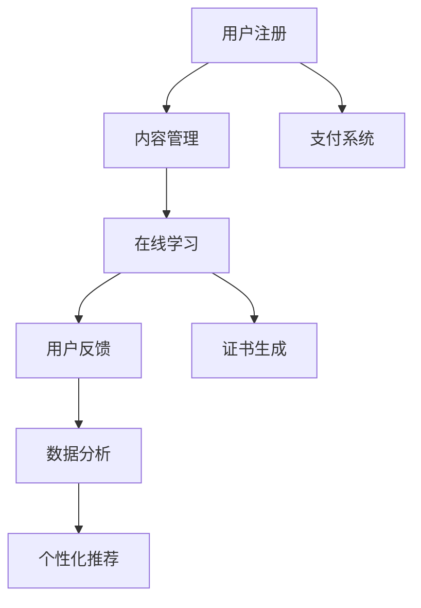

                 

# 如何打造知识付费的付费专栏

> 关键词：知识付费,付费专栏,技术实现,在线教育,内容管理系统

## 1. 背景介绍

在互联网迅猛发展的今天，知识的获取变得更加便捷和多样。与此同时，人们对于知识质量和形式的追求也越来越高。知识付费成为了一种趋势，而付费专栏作为知识付费的高级形式，正在逐渐受到大众的青睐。如何打造高质量、有吸引力的付费专栏，成为在线教育平台和企业的重要课题。本文将从技术实现的角度，详细阐述如何构建知识付费的付费专栏。

## 2. 核心概念与联系

### 2.1 核心概念概述

在打造知识付费的付费专栏的过程中，涉及多个核心概念：

- **知识付费**：用户为获得专业知识或深度内容，支付一定的费用。
- **付费专栏**：由专业人士或机构，围绕特定主题，提供系列化、系统化的深度内容，用户按月或按年支付订阅费用。
- **内容管理系统**：用于存储、组织和管理内容的软件系统。
- **在线教育平台**：通过互联网进行课程讲授、学习互动的平台。
- **用户数据分析**：通过数据分析工具，对用户行为进行跟踪和分析，优化用户体验和提升内容质量。

### 2.2 核心概念原理和架构的 Mermaid 流程图



该图展示了知识付费付费专栏的核心流程，用户从注册开始，到内容的消费、反馈和数据分析，最终通过个性化推荐提升平台和内容质量。

## 3. 核心算法原理 & 具体操作步骤

### 3.1 算法原理概述

打造知识付费的付费专栏，其核心算法原理主要包括以下几个方面：

1. **用户行为分析**：通过用户的行为数据（如浏览、学习、互动等）进行分析，了解用户的学习偏好和需求。
2. **推荐算法**：根据用户的行为数据和内容标签，推荐符合用户兴趣的专栏和内容。
3. **个性化服务**：根据用户的学习进度、学习效果等，提供个性化的学习建议和服务。
4. **内容管理**：通过内容管理系统，对专栏进行组织、管理和优化。
5. **在线支付系统**：提供安全的在线支付服务，确保用户订阅信息的支付安全和隐私保护。

### 3.2 算法步骤详解

构建知识付费的付费专栏，一般包括以下几个关键步骤：

**Step 1: 内容规划与制作**

- **选题**：根据市场调研和用户需求，确定专栏的选题。
- **内容制作**：由专业人士或机构制作内容，包括文字、视频、音频等形式的深度学习材料。

**Step 2: 内容管理系统搭建**

- **需求分析**：确定内容管理的核心需求，如内容分类、搜索、推荐等。
- **技术选型**：选择合适的内容管理技术栈，如CMS系统、数据库等。
- **系统搭建**：搭建内容管理系统，包括内容上传、编辑、审核、发布等功能。

**Step 3: 用户数据分析与个性化服务**

- **数据收集**：通过埋点和API接口等方式，收集用户的学习数据。
- **数据分析**：对用户行为数据进行分析和处理，提取有用的用户画像信息。
- **个性化推荐**：利用推荐算法，向用户推荐合适的专栏和内容。

**Step 4: 在线支付与订阅管理**

- **支付集成**：选择可靠的第三方支付服务提供商，集成支付接口。
- **订阅管理**：实现订阅的创建、取消、续费等功能。

**Step 5: 发布与推广**

- **上线发布**：将专栏上线发布，并通过多种渠道进行推广，如社交媒体、邮件营销等。
- **效果监控**：实时监控专栏的访问量、订阅量等指标，进行效果评估和优化。

### 3.3 算法优缺点

构建知识付费的付费专栏，其算法有以下优缺点：

**优点：**

1. **高效性**：通过数据分析和推荐算法，提高用户的学习效率和满意度。
2. **个性化**：根据用户的行为数据，提供个性化的学习建议和服务，提升用户体验。
3. **多样化**：提供文字、视频、音频等多种形式的内容，满足不同用户的需求。

**缺点：**

1. **成本高**：高质量内容的制作和维护需要高成本。
2. **数据隐私**：用户数据的收集和分析，需重视数据隐私和用户权益保护。
3. **内容更新**：专栏内容需定期更新，以保持新鲜度和吸引力。

### 3.4 算法应用领域

知识付费的付费专栏，主要应用于在线教育、企业培训、专业技能提升等领域。例如：

- **在线教育**：如Coursera、Udemy等平台上的付费课程。
- **企业培训**：如公司内部的员工培训专栏，提升员工的专业技能。
- **专业技能提升**：如编程、设计、营销等领域的深度学习材料。

## 4. 数学模型和公式 & 详细讲解 & 举例说明

### 4.1 数学模型构建

知识付费的付费专栏，可以构建如下数学模型：

- **用户行为模型**：$B = (x_1, x_2, ..., x_n)$，其中 $x_i$ 表示用户行为数据。
- **内容推荐模型**：$C = (y_1, y_2, ..., y_m)$，其中 $y_i$ 表示内容标签。
- **个性化服务模型**：$P = (z_1, z_2, ..., z_k)$，其中 $z_i$ 表示个性化推荐服务。

### 4.2 公式推导过程

- **用户行为分析**：
$$
B = \frac{1}{N}\sum_{i=1}^N \text{User}_i
$$
- **内容推荐算法**：
$$
C = \max_{y \in \mathcal{Y}} f_{y|B}
$$
- **个性化服务模型**：
$$
P = \min_{z \in \mathcal{Z}} g_{z|B, C}
$$

### 4.3 案例分析与讲解

以Coursera平台上的付费专栏为例，Coursera通过数据分析和推荐算法，向用户推荐合适的专栏和内容。其用户行为模型包括浏览历史、学习进度、评分等，内容推荐模型包括课程分类、专家认证等，个性化服务模型包括学习计划、学习建议等。

## 5. 项目实践：代码实例和详细解释说明

### 5.1 开发环境搭建

构建知识付费的付费专栏，需要以下开发环境：

1. **服务器环境**：配置高性能的服务器，如AWS、阿里云等云平台。
2. **数据库**：选择适合的内容管理数据库，如MySQL、MongoDB等。
3. **开发工具**：选择适合的开发工具，如IDE、版本控制系统等。

### 5.2 源代码详细实现

以下是一个基于Django框架的付费专栏系统示例代码：

```python
# models.py
from django.db import models

class User(models.Model):
    username = models.CharField(max_length=50)
    email = models.EmailField(unique=True)
    # ...

class Course(models.Model):
    name = models.CharField(max_length=100)
    description = models.TextField()
    price = models.DecimalField(max_digits=10, decimal_places=2)
    # ...

class Order(models.Model):
    user = models.ForeignKey(User, on_delete=models.CASCADE)
    course = models.ForeignKey(Course, on_delete=models.CASCADE)
    payment_date = models.DateTimeField(auto_now_add=True)
    # ...

# views.py
from django.shortcuts import render, redirect
from django.http import HttpResponse
from django.contrib.auth.decorators import login_required
from .models import User, Course, Order

@login_required
def course_detail(request, course_id):
    course = Course.objects.get(id=course_id)
    user = request.user
    if user in course.users.all():
        return HttpResponse("You have already enrolled in this course.")
    else:
        order = Order.objects.create(user=user, course=course)
        return render(request, 'course_detail.html', {'course': course})

# templates/course_detail.html
<h1>{{ course.name }}</h1>
<p>{{ course.description }}</p>
<p>Price: {{ course.price }}</p>

    <p>You have already enrolled in this course.</p>

    <a href="">Enroll</a>

```

### 5.3 代码解读与分析

- **用户模型**：定义了用户的基本信息，如用户名、邮箱等。
- **课程模型**：定义了课程的基本信息，如课程名称、描述、价格等。
- **订单模型**：记录用户的订阅信息，包括用户和课程信息，以及支付日期。
- **视图函数**：实现课程的浏览和订阅功能。

## 6. 实际应用场景

### 6.1 在线教育

知识付费的付费专栏在在线教育领域的应用广泛。例如，Coursera、Udacity等平台通过付费专栏，提供高质量的在线课程，吸引大量用户订阅学习。

### 6.2 企业培训

企业内部也可以通过付费专栏，提升员工的技能和知识水平。例如，华为、阿里巴巴等公司，通过内部培训平台，提供系统化的技术培训课程，帮助员工提升专业技能。

### 6.3 专业技能提升

付费专栏还可以用于专业技能的提升，如编程、设计、营销等领域的深度学习材料。例如，Udemy平台上有大量编程课程，用户可以根据自身需求，选择适合的专栏进行学习。

### 6.4 未来应用展望

未来，知识付费的付费专栏将呈现以下几个发展趋势：

1. **智能化**：通过AI技术，提供更加个性化和智能化的学习体验。
2. **多平台集成**：实现多个平台的数据互通和内容共享，提升用户的学习效率。
3. **虚拟现实**：利用虚拟现实技术，提供更加沉浸式的学习体验。
4. **社交化学习**：建立社区和讨论组，增强用户的学习互动和交流。
5. **微课程**：提供更短、更灵活的微课程，满足用户快速学习的需要。

## 7. 工具和资源推荐

### 7.1 学习资源推荐

构建知识付费的付费专栏，需要掌握以下技能和知识：

- **前端开发**：如HTML、CSS、JavaScript等。
- **后端开发**：如Python、Django、Flask等。
- **数据库管理**：如MySQL、MongoDB等。
- **人工智能**：如机器学习、推荐算法等。

推荐的学习资源如下：

- **Django官方文档**：《Django for Beginners》。
- **MySQL官方文档**：《MySQL Tutorial》。
- **Python官方文档**：《Python Tutorial》。
- **机器学习入门书籍**：《Hands-On Machine Learning with Scikit-Learn, Keras, and TensorFlow》。

### 7.2 开发工具推荐

- **服务器管理**：AWS、阿里云等云平台。
- **数据库管理**：MySQL、MongoDB等。
- **开发工具**：PyCharm、Visual Studio Code等。
- **测试工具**：Selenium、Junit等。

### 7.3 相关论文推荐

- **用户行为分析**：《User Behavior Modeling in Recommendation Systems》。
- **推荐算法**：《A Survey of Collaborative Filtering Techniques》。
- **个性化服务**：《Personalized Recommendation Systems in E-commerce》。

## 8. 总结：未来发展趋势与挑战

### 8.1 总结

本文详细阐述了如何打造知识付费的付费专栏。首先介绍了背景和核心概念，其次从技术实现的角度，介绍了内容管理、用户数据分析和个性化服务等方面的核心算法原理和具体操作步骤。最后，提供了项目实践的代码示例和详细解释，并展望了未来的应用前景。

通过本文的系统梳理，可以看到，构建知识付费的付费专栏，需要综合考虑技术、内容、用户等多个因素。只有在数据、算法、工程、业务等多个维度进行全面优化，才能打造出高质量、有吸引力的付费专栏。

### 8.2 未来发展趋势

展望未来，知识付费的付费专栏将呈现以下几个发展趋势：

1. **智能化**：通过AI技术，提供更加个性化和智能化的学习体验。
2. **多平台集成**：实现多个平台的数据互通和内容共享，提升用户的学习效率。
3. **虚拟现实**：利用虚拟现实技术，提供更加沉浸式的学习体验。
4. **社交化学习**：建立社区和讨论组，增强用户的学习互动和交流。
5. **微课程**：提供更短、更灵活的微课程，满足用户快速学习的需要。

### 8.3 面临的挑战

构建知识付费的付费专栏，面临以下挑战：

1. **成本高**：高质量内容的制作和维护需要高成本。
2. **数据隐私**：用户数据的收集和分析，需重视数据隐私和用户权益保护。
3. **内容更新**：专栏内容需定期更新，以保持新鲜度和吸引力。

### 8.4 研究展望

未来的研究需要在以下几个方面寻求新的突破：

1. **高效内容生成**：利用AI技术，自动生成高质量的学习材料。
2. **内容多样化**：提供更加多样化的学习形式，如视频、音频、图像等。
3. **用户体验优化**：通过用户体验设计，提升用户的学习效果和满意度。
4. **多模态学习**：将不同模态的学习形式进行融合，提供更全面的学习体验。
5. **内容推荐优化**：优化推荐算法，提升内容的推荐精度和效果。

总之，打造知识付费的付费专栏，需要不断探索和优化，才能在未来的竞争中占据优势。只有在数据、算法、工程、业务等多个维度进行全面优化，才能真正实现知识付费的价值，为用户提供有价值的深度学习内容。

## 9. 附录：常见问题与解答

**Q1: 如何确保付费专栏的内容质量？**

A: 确保付费专栏的内容质量，需要从以下几个方面进行考虑：

1. **专家团队**：邀请行业内的专家和权威人士，制作高质量的内容。
2. **内容审核**：建立内容审核机制，对内容进行严格审核和质量控制。
3. **用户反馈**：收集用户反馈，及时调整和优化内容。

**Q2: 如何提高用户订阅率？**

A: 提高用户订阅率，需要从以下几个方面进行考虑：

1. **市场调研**：了解目标用户的需求和痛点，制定合适的市场策略。
2. **内容营销**：通过多种渠道进行内容推广，吸引用户订阅。
3. **免费试用**：提供免费试用期，让用户体验课程内容，增加用户粘性。

**Q3: 如何实现个性化推荐？**

A: 实现个性化推荐，需要以下步骤：

1. **用户画像**：收集用户的行为数据，构建用户画像。
2. **内容标签**：对内容进行标签化处理。
3. **推荐算法**：选择合适的推荐算法，如协同过滤、基于内容的推荐等。

通过上述方法和步骤，可以有效地实现个性化推荐，提升用户的学习体验和满意度。

**Q4: 如何保护用户数据隐私？**

A: 保护用户数据隐私，需要从以下几个方面进行考虑：

1. **数据加密**：对用户数据进行加密处理，保护数据安全。
2. **隐私政策**：制定严格的隐私政策，明确用户数据的使用和保护措施。
3. **用户授权**：在收集用户数据前，获取用户授权，确保数据使用的透明性和合法性。

总之，保护用户数据隐私是知识付费平台的重要责任，需要采取多重措施，确保用户数据的保密和安全。

**Q5: 如何优化用户体验？**

A: 优化用户体验，需要从以下几个方面进行考虑：

1. **界面设计**：优化页面设计和交互体验，提升用户的使用便捷性。
2. **内容适配**：根据用户的学习进度和效果，提供适应的学习建议和服务。
3. **技术支持**：提供良好的技术支持，解决用户的学习问题。

通过上述方法和步骤，可以有效地优化用户体验，提升用户的学习效果和满意度。

**Q6: 如何应对市场竞争？**

A: 应对市场竞争，需要从以下几个方面进行考虑：

1. **产品差异化**：通过产品创新和差异化，提升产品的市场竞争力。
2. **市场营销**：制定有效的市场营销策略，提升品牌的知名度和影响力。
3. **用户口碑**：通过优质的服务和产品，赢得用户的好评和口碑，提升用户的忠诚度。

通过上述方法和步骤，可以有效地应对市场竞争，保持产品的竞争力和市场地位。

---

作者：禅与计算机程序设计艺术 / Zen and the Art of Computer Programming

