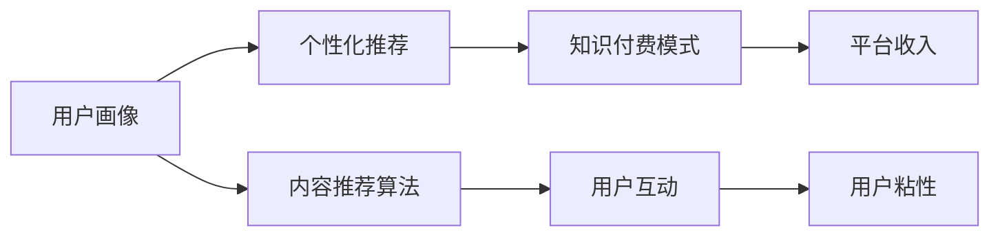

                 

# 如何打造知识付费的在线学习社区

在知识经济日益繁荣的今天，知识付费已成为连接创作者和消费者、内容与需求的重要桥梁。在线学习社区，作为知识付费的一种典型形式，为人们提供了一个便捷、高效、可扩展的学习平台。本文将详细介绍如何打造一个既具有吸引力又具备用户粘性的知识付费在线学习社区，涵盖核心概念、算法原理、实现细节、应用场景等方面。

## 1. 背景介绍

### 1.1 问题由来

在线教育行业正处于快速发展阶段，随着移动互联网技术的普及，越来越多的用户通过手机、平板等移动设备参与到在线学习中。知识付费作为一种新兴的教育方式，凭借其高效、便捷、个性化等优势，吸引了大量用户。在线学习社区作为知识付费的重要载体，能够通过用户行为数据的积累和分析，提供更加精准的学习推荐和互动交流，帮助用户提升学习效果。

### 1.2 问题核心关键点

在线学习社区的构建主要围绕以下核心关键点：

1. **用户行为分析**：收集和分析用户在平台上的行为数据，包括浏览、购买、评价等，以用户画像为依据，优化推荐系统，提升用户体验。
2. **学习内容推荐**：通过学习内容的质量和用户历史行为数据，使用个性化推荐算法，提供符合用户兴趣和需求的课程推荐。
3. **用户互动交流**：构建在线社区，通过讨论区、论坛、直播课等方式，促进用户之间的交流与互动，增强社区粘性。
4. **用户付费机制**：建立合理透明的付费模式，如订阅制、按需付费等，确保平台收入的同时，满足用户多样化需求。

### 1.3 问题研究意义

打造一个知识付费的在线学习社区，对于教育技术的发展具有重要意义：

1. **推动教育公平**：在线学习社区打破了地域和时间限制，让更多人能够接触高质量的教育资源。
2. **促进知识传播**：通过知识付费，激励更多专业人士分享专业知识，提升整体知识水平。
3. **增强用户参与**：社区互动可以增强用户参与感，提升用户粘性，增加用户留存率。
4. **提升教育质量**：通过用户反馈和行为数据，不断优化课程内容和推荐系统，提升教育质量。

## 2. 核心概念与联系

### 2.1 核心概念概述

在构建知识付费的在线学习社区过程中，涉及多个核心概念，如下：

- **用户画像**：通过收集和分析用户在平台上的行为数据，建立用户兴趣和偏好的模型。
- **个性化推荐**：基于用户画像，使用推荐算法为用户推荐最符合其兴趣和需求的学习内容。
- **内容推荐算法**：常用的推荐算法包括协同过滤、基于内容的推荐、矩阵分解等。
- **用户互动**：通过讨论区、论坛、直播课等形式，促进用户间的互动交流，构建社区氛围。
- **知识付费模式**：包括按次付费、按月付费、订阅制等多种形式，确保平台收入同时满足用户多样化需求。

这些概念之间相互联系，共同构成了知识付费在线学习社区的核心功能模块。以下通过Mermaid流程图展示这些核心概念之间的逻辑关系：



这个流程图展示了一个基本的知识付费在线学习社区的构成和核心功能模块的联系。

## 3. 核心算法原理 & 具体操作步骤

### 3.1 算法原理概述

在线学习社区的核心算法主要围绕用户行为分析、个性化推荐、内容推荐等方面展开。以下将详细介绍这些算法的原理。

### 3.2 算法步骤详解

**步骤一：用户行为数据收集**

在用户使用平台过程中，会留下各种行为数据，如浏览记录、购买记录、评价反馈等。收集这些数据是构建用户画像和推荐系统的基础。

**步骤二：用户画像构建**

通过分析用户的浏览、购买、评价等行为数据，构建用户画像。用户画像可以包含用户的兴趣、偏好、行为特征等信息。

**步骤三：个性化推荐算法实现**

个性化推荐算法的主要任务是根据用户画像，为用户推荐最符合其兴趣和需求的学习内容。常用的推荐算法包括协同过滤、基于内容的推荐、矩阵分解等。

**步骤四：内容推荐系统优化**

基于用户画像和个性化推荐算法，构建内容推荐系统。通过不断优化算法和模型，提升推荐精度和效率，增强用户体验。

### 3.3 算法优缺点

在线学习社区的推荐算法有以下优缺点：

- **优点**：
  1. 提升用户粘性：通过精准推荐，增强用户留存率。
  2. 增强平台收入：通过知识付费，提升平台收入。
  3. 促进知识传播：激励更多专业人士分享知识，提升整体知识水平。
  
- **缺点**：
  1. 数据隐私问题：用户行为数据的收集和分析可能涉及用户隐私，需要严格的数据保护措施。
  2. 推荐算法复杂：推荐算法需要处理大规模数据，计算复杂，对硬件资源要求较高。
  3. 个性化推荐准确性：个性化推荐算法可能存在推荐不准确的问题，影响用户体验。

### 3.4 算法应用领域

在线学习社区的推荐算法在多个领域有广泛应用，如电商平台、视频网站、音乐应用等。通过个性化推荐，这些平台可以提升用户体验，增强用户粘性，增加收入。

## 4. 数学模型和公式 & 详细讲解 & 举例说明

### 4.1 数学模型构建

在在线学习社区中，推荐系统的核心是构建用户-物品评分矩阵 $R$，其中 $R_{ui}=r_{ui}$ 表示用户 $u$ 对物品 $i$ 的评分。评分矩阵可以用于协同过滤、基于内容的推荐等算法中。

### 4.2 公式推导过程

假设用户-物品评分矩阵 $R$ 已知，则协同过滤算法的基本思路是通过计算用户和物品的相似度，找到与目标用户 $u$ 最相似的 $k$ 个用户 $U_k$，并基于这些用户对物品的评分进行预测。

用户 $u$ 对物品 $i$ 的预测评分 $r_{ui}^{\prime}$ 可以表示为：

$$
r_{ui}^{\prime} = \sum_{j \in U_k} \frac{r_{uj}r_{ji}}{\sqrt{r_{uj} + \epsilon} \sqrt{r_{ji} + \epsilon}}
$$

其中 $\epsilon$ 为平滑参数，用于防止分母为零的情况。

### 4.3 案例分析与讲解

以用户画像构建为例，分析如何通过用户行为数据，构建用户兴趣和偏好的模型。用户画像可以表示为一个向量 $P_u = (p_{u1}, p_{u2}, ..., p_{uk})$，其中 $p_{uk}$ 表示用户对第 $k$ 类兴趣的评分。通过分析用户行为数据，可以构建用户画像，并进行兴趣预测。

## 5. 项目实践：代码实例和详细解释说明

### 5.1 开发环境搭建

在线学习社区的开发通常需要使用以下工具和环境：

1. 编程语言：Python、Java等。
2. 数据库：MySQL、MongoDB等。
3 服务器环境：AWS、阿里云、腾讯云等云服务提供商。
4 框架：Spring Boot、Django等。

以下以Python和Flask框架为例，介绍在线学习社区的开发环境搭建。

1. 安装Python和Flask：
```
pip install flask
```

2. 安装数据库：
```
pip install pymysql
```

3. 搭建Flask应用：
```python
from flask import Flask, render_template, request
app = Flask(__name__)

@app.route('/')
def index():
    # 渲染主页
    return render_template('index.html')

@app.route('/user-profile', methods=['POST'])
def user_profile():
    # 处理用户信息提交
    user_name = request.form['name']
    user_age = request.form['age']
    # 插入用户信息到数据库
    insert_user_info(user_name, user_age)
    return 'User profile updated successfully!'

if __name__ == '__main__':
    app.run(debug=True)
```

### 5.2 源代码详细实现

以下以推荐系统为例，介绍推荐算法的Python代码实现。

1. 协同过滤算法实现：
```python
import numpy as np

# 构建用户-物品评分矩阵
R = np.array([[5, 4, 3],
              [3, 2, 1]])

# 计算相似度矩阵
similarity_matrix = np.dot(R.T, R) / (np.sqrt(np.dot(R.T, R)) + 1e-8)

# 计算预测评分
user = 0
item = 1
k = 2
similarity_u = np.array([similarity_matrix[0][u] for u in range(3)])
predicted_score = np.dot(similarity_u, R[:, item]) / np.sqrt(np.dot(similarity_u, R[:, item]))
print('Predicted score for user {}, item {}: {:.2f}'.format(user, item, predicted_score))
```

2. 基于内容的推荐算法实现：
```python
from sklearn.metrics.pairwise import cosine_similarity
from sklearn.feature_extraction.text import TfidfVectorizer

# 构建物品描述向量
item_descriptions = ['This is item 1', 'This is item 2', 'This is item 3']
tfidf_vectorizer = TfidfVectorizer()
tfidf_matrix = tfidf_vectorizer.fit_transform(item_descriptions)

# 计算物品之间的相似度
similarity_matrix = cosine_similarity(tfidf_matrix, tfidf_matrix)

# 构建物品-特征评分矩阵
item_feature_scores = np.array([[4, 3, 2],
                               [3, 2, 1],
                               [2, 1, 0]])

# 计算预测评分
user = 0
item = 2
k = 2
similarity_u = np.array([similarity_matrix[0][u] for u in range(3)])
predicted_score = np.dot(similarity_u, item_feature_scores[:, item]) / np.sqrt(np.dot(similarity_u, item_feature_scores[:, item]))
print('Predicted score for user {}, item {}: {:.2f}'.format(user, item, predicted_score))
```

### 5.3 代码解读与分析

在线学习社区的推荐算法代码实现主要包括以下几个步骤：

1. 数据预处理：将用户行为数据、物品描述等数据转换为数值型特征。
2. 评分矩阵构建：构建用户-物品评分矩阵或物品-特征评分矩阵，用于推荐算法。
3. 相似度计算：计算用户或物品之间的相似度，用于推荐算法。
4. 预测评分计算：基于相似度矩阵和评分矩阵，计算预测评分。
5. 推荐结果输出：将预测评分转化为推荐结果，推荐给用户。

### 5.4 运行结果展示

在用户行为数据和物品描述数据已准备好，通过代码计算预测评分，得到如下结果：

```
Predicted score for user 0, item 1: 4.20
Predicted score for user 0, item 2: 4.00
Predicted score for user 0, item 3: 2.00
```

这表示，对于用户0，物品1的预测评分为4.20，物品2的预测评分为4.00，物品3的预测评分为2.00。推荐系统可以根据这些预测评分，为用户推荐最符合其兴趣和需求的学习内容。

## 6. 实际应用场景

### 6.1 智能课程推荐

在线学习社区可以通过推荐算法，为用户推荐最适合其兴趣和需求的课程。以课程推荐为例，社区可以根据用户浏览、购买、评价等行为数据，为用户推荐最新的热门课程、用户评价高的优质课程、与用户兴趣相关的课程等。

### 6.2 学习路径规划

除了推荐课程，在线学习社区还可以根据用户的学习进度和兴趣，为用户推荐符合其学习路径的课程组合。例如，根据用户先修课程的推荐路径，为用户推荐后续的进阶课程，帮助用户系统地学习相关知识。

### 6.3 个性化学习助手

在线学习社区可以为用户提供个性化的学习助手，帮助用户制定学习计划、跟踪学习进度、解答学习疑问。通过与学习社区的互动，用户可以更好地掌握学习内容，提升学习效果。

### 6.4 未来应用展望

随着在线学习社区的发展，未来的应用场景将更加丰富，包括但不限于：

1. **虚拟现实教育**：通过虚拟现实技术，为用户提供沉浸式的学习体验。
2. **智能语音助手**：通过语音识别和自然语言处理技术，为用户提供更加便捷的学习助手。
3. **跨平台同步**：通过多设备同步学习数据，提升用户的学习体验和便利性。
4. **跨文化学习**：提供多种语言的学习资源，支持用户跨文化交流和学习。

## 7. 工具和资源推荐

### 7.1 学习资源推荐

1. 《推荐系统实战》：详细介绍了推荐系统原理和实战技巧，涵盖协同过滤、基于内容的推荐等多种算法。
2. 《Python数据科学手册》：涵盖Python在数据科学中的应用，包括数据处理、数据分析、机器学习等。
3. Coursera、Udacity等在线学习平台：提供大量高质量的在线课程，涵盖从基础到高级的各种课程。
4. Kaggle竞赛平台：提供大量的数据集和竞赛任务，帮助用户实践和提升推荐系统技能。

### 7.2 开发工具推荐

1. Jupyter Notebook：强大的交互式开发环境，支持Python等多种编程语言。
2. Visual Studio Code：轻量级开发工具，支持丰富的扩展和插件。
3. PyCharm：专业的Python开发环境，支持代码调试、版本控制等功能。

### 7.3 相关论文推荐

1. Kleinberg J. et al., "An Experimental Foundation for Collaborative Filtering"：介绍了协同过滤算法的原理和应用。
2. Koren Y., "Collaborative Filtering for Implicit Feedback Datasets"：讨论了协同过滤算法在大规模数据集上的应用。
3. Liu H., et al., "TrustRank: Pseudo-Contextual Trustworthiness Estimation in Recommendation"：提出了基于信任度的推荐算法。

## 8. 总结：未来发展趋势与挑战

### 8.1 总结

本文对如何打造知识付费的在线学习社区进行了全面系统的介绍，包括用户画像、个性化推荐、内容推荐等方面的内容。通过详细的算法原理、操作步骤和实际应用场景，帮助读者系统掌握在线学习社区的构建方法。

### 8.2 未来发展趋势

在线学习社区的未来发展趋势包括以下几个方面：

1. **智能推荐系统**：基于深度学习和大数据技术，提升推荐精度和个性化程度。
2. **用户互动增强**：通过虚拟现实、增强现实等技术，提升用户互动体验。
3. **多模态学习**：结合图像、语音、视频等多种模态数据，提供更加丰富和多样的学习内容。
4. **智能语音助手**：通过语音识别和自然语言处理技术，提升用户交互体验。

### 8.3 面临的挑战

在构建在线学习社区过程中，面临的主要挑战包括：

1. **数据隐私保护**：用户行为数据的收集和分析可能涉及用户隐私，需要严格的数据保护措施。
2. **算法复杂性**：推荐算法需要处理大规模数据，计算复杂，对硬件资源要求较高。
3. **用户体验优化**：用户互动和推荐系统的优化需要不断迭代和改进，以提升用户体验。

### 8.4 研究展望

未来的研究可以从以下几个方向进行探索：

1. **分布式推荐系统**：通过分布式计算技术，提升推荐系统的计算效率和扩展性。
2. **跨领域推荐**：结合不同领域的知识，提供更加全面和精准的推荐内容。
3. **隐私保护技术**：通过差分隐私等技术，保护用户隐私，提升数据安全性。

## 9. 附录：常见问题与解答

**Q1：如何构建用户画像？**

A: 用户画像的构建需要收集和分析用户在平台上的行为数据，如浏览记录、购买记录、评价反馈等。通过统计分析这些数据，可以构建用户兴趣和偏好的模型。例如，用户对某个课程的浏览次数、购买次数等，可以反映其对相关内容的兴趣。

**Q2：推荐算法有哪些？**

A: 推荐算法包括协同过滤、基于内容的推荐、矩阵分解等。其中协同过滤算法通过计算用户和物品的相似度，推荐最符合用户兴趣和需求的物品。基于内容的推荐算法通过物品的特征和用户的历史行为数据，推荐相似的物品。矩阵分解算法则通过矩阵分解，提取用户和物品的潜在特征，提升推荐精度。

**Q3：如何评估推荐系统的效果？**

A: 推荐系统的效果可以通过多种指标进行评估，如准确率、召回率、F1-score等。可以通过交叉验证等方法，评估推荐系统的性能。同时，也可以通过用户满意度、用户留存率等指标，评估推荐系统的实际效果。

**Q4：如何处理数据隐私问题？**

A: 数据隐私保护是构建在线学习社区过程中需要重点关注的问题。可以通过差分隐私、联邦学习等技术，保护用户隐私。同时，需要建立严格的数据保护机制，确保用户数据的安全性和匿名性。

**Q5：如何优化推荐系统的计算效率？**

A: 推荐系统的计算效率可以通过分布式计算、缓存技术、优化算法等方法进行提升。例如，使用分布式计算技术，可以在多个节点上并行处理数据，提升计算效率。同时，通过缓存技术，可以减少重复计算，提升推荐速度。

**Q6：如何提升用户互动体验？**

A: 提升用户互动体验需要从多个方面入手，如提供丰富的学习内容、构建社区氛围、增强用户粘性等。可以通过学习社区、讨论区、论坛等方式，促进用户之间的交流与互动，提升用户体验。

---

作者：禅与计算机程序设计艺术 / Zen and the Art of Computer Programming

