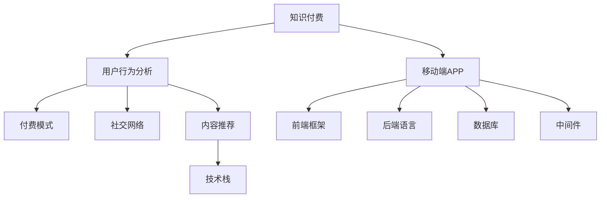

                 

# 如何打造知识付费的移动端APP

> 关键词：知识付费,移动端,APP开发,用户行为分析,付费模式,社交网络,内容推荐,技术栈

## 1. 背景介绍

### 1.1 问题由来
随着移动互联网的普及和智能设备的日渐丰富，知识付费平台作为连接知识创作者与消费者的新型商业模式，正逐渐成为信息消费的主流。各类知识付费APP如“得到”、“喜马拉雅”、“知乎”等应用日益丰富，吸引了大量用户群体。

然而，现有知识付费APP面临用户粘性不高、内容单一、盈利模式有限等问题，急需进一步优化和创新。如何打造具有强大生命力和竞争力的知识付费APP，成为了当前市场和学术界共同关注的课题。

### 1.2 问题核心关键点
知识付费APP的成功关键在于精准的内容定位、智能的用户推荐、多样化的付费模式、高效的社交互动和个性化的用户体验。本文将从APP的架构设计、核心算法、用户体验、市场策略等角度，全面解析知识付费APP的打造方法和未来发展方向。

## 2. 核心概念与联系

### 2.1 核心概念概述

为更好地理解知识付费APP的开发和运营，本节将介绍几个密切相关的核心概念：

- **知识付费**：通过订阅、单次付费等方式，为消费者提供有价值、有深度的知识内容，实现知识和时间的价值变现。
- **移动端APP**：以移动设备为载体，实现知识内容展示、付费管理、用户交互等功能的应用软件。
- **用户行为分析**：通过数据分析手段，挖掘用户兴趣、行为特征，优化内容和推荐策略，提升用户粘性和满意度。
- **付费模式**：包括订阅制、单次付费、课程包、社群付费等多种方式，灵活满足用户需求。
- **社交网络**：通过用户交互、评论分享等机制，构建知识社区，促进用户交流和知识传播。
- **内容推荐**：利用算法模型，根据用户兴趣和历史行为推荐个性化内容，提升用户停留时间和消费转化率。
- **技术栈**：包括前端框架（如React Native、Flutter）、后端语言（如Node.js、Python）、数据库（如MySQL、MongoDB）、中间件（如Apache Kafka、Elasticsearch）等，实现APP的稳定高效运行。

这些核心概念之间的逻辑关系可以通过以下Mermaid流程图来展示：



这个流程图展示的知识付费APP的核心概念及其之间的关系：

1. 知识付费是大语言模型的核心内容。
2. 移动端APP是知识付费的内容载体。
3. 用户行为分析影响着付费模式和内容推荐。
4. 付费模式和社交网络促进知识付费的发展。
5. 内容推荐和用户行为分析都需要技术栈支持。

这些概念共同构成了知识付费APP的构建和运营框架，使其能够在市场竞争中脱颖而出。

## 3. 核心算法原理 & 具体操作步骤
### 3.1 算法原理概述

知识付费APP的成功依赖于精准的用户行为分析和智能的内容推荐，主要涉及以下关键算法：

- **协同过滤推荐算法**：通过分析用户行为和历史数据，预测用户可能感兴趣的内容。
- **内容召回策略**：结合用户行为和内容特征，筛选出潜在的推荐内容候选集。
- **深度学习推荐模型**：利用神经网络等模型，学习用户和内容的隐含特征，进行精准推荐。
- **社交网络分析**：通过用户互动数据，分析社交网络结构，发现知识传播路径和影响力节点。
- **定价优化算法**：根据市场需求和成本控制，优化各类付费产品的定价策略。

### 3.2 算法步骤详解

1. **用户行为数据采集与处理**：
   - 通过APP日志、用户点击、购买、评分等行为数据，收集用户兴趣特征和行为模式。
   - 数据预处理包括数据清洗、缺失值填补、特征工程等步骤。

2. **用户行为建模与分析**：
   - 利用协同过滤推荐算法（如基于矩阵分解的算法），构建用户-物品评分矩阵。
   - 应用深度学习模型（如LSTM、GRU、Transformers等），捕捉用户行为的时序特征。

3. **内容召回与筛选**：
   - 通过计算用户评分矩阵和内容特征向量，实现内容召回。
   - 利用相似度计算（如余弦相似度），筛选出与用户兴趣最匹配的内容。

4. **深度学习推荐模型训练**：
   - 选择深度学习模型（如DNN、RNN、CNN等），训练用户-物品的隐含表示。
   - 使用交叉验证等方法评估模型效果，调整超参数。

5. **内容推荐与展示**：
   - 实时计算用户实时兴趣特征，进行推荐更新。
   - 动态调整推荐策略，提升推荐效果。

6. **用户反馈与模型迭代**：
   - 收集用户反馈数据（如评分、评论、分享等），进一步优化推荐模型。
   - 采用增量学习（如在线学习）策略，持续改进模型效果。

### 3.3 算法优缺点

知识付费APP的推荐算法主要具有以下优点：

- **个性化推荐**：根据用户行为数据，推荐个性化内容，提升用户体验和满意度。
- **精准预测**：通过深度学习模型，捕捉用户和内容的隐含特征，实现精准预测。
- **动态调整**：实时更新推荐模型，适应用户兴趣和行为变化，提升推荐效果。

同时，该算法也存在一定的局限性：

- **数据依赖**：推荐效果依赖于大量用户行为数据，数据量不足时可能效果不佳。
- **算法复杂**：深度学习模型的训练复杂度较高，对硬件资源要求较高。
- **冷启动问题**：新用户或内容无历史数据时，推荐效果可能较差。
- **隐私风险**：用户行为数据的采集和分析可能引发隐私和安全问题。

尽管存在这些局限性，但就目前而言，基于协同过滤和深度学习的推荐算法仍是知识付费APP推荐的核心技术。未来相关研究应聚焦于如何进一步降低对标注数据的依赖，提高模型的泛化能力，同时兼顾数据隐私和用户安全。

### 3.4 算法应用领域

知识付费APP的推荐算法已经广泛应用于各类内容平台，如在线教育、图书推荐、视频分享等。通过精准的推荐算法，用户能够快速找到感兴趣的内容，提升平台的活跃度和用户留存率。

具体应用领域包括：

- **在线教育平台**：如Coursera、Udemy等，通过推荐用户可能感兴趣的视频课程和文章，提升用户学习效率和满意度。
- **图书推荐平台**：如亚马逊Kindle、京东图书等，利用推荐算法，为用户推荐最匹配的书籍。
- **视频分享平台**：如YouTube、Bilibili等，通过内容推荐，增加用户观看时长和互动量。
- **新闻聚合平台**：如今日头条、腾讯新闻等，根据用户兴趣推荐新闻内容，提高点击率和用户停留时间。

此外，知识付费APP的推荐算法还被创新性地应用到更多场景中，如个性化学习路径设计、智能广告投放、社交网络信息传播等，为信息消费提供更多选择。

## 4. 数学模型和公式 & 详细讲解 & 举例说明

### 4.1 数学模型构建

本节将使用数学语言对知识付费APP推荐系统的推荐算法进行更加严格的刻画。

记用户集合为 $U$，内容集合为 $I$，用户与内容的交互矩阵为 $R \in \mathbb{R}^{m \times n}$，其中 $m$ 为用户数，$n$ 为内容数。用户对内容的评分表示为 $R_{ui} \in [0,5]$。

假设目标内容为 $i$，对于用户 $u$，预测其对内容 $i$ 的评分 $\hat{r}_{ui}$ 为：

$$
\hat{r}_{ui} = \sum_{j=1}^{k} w_{u,j}^\top\theta_i^{(j)} + b_i
$$

其中 $w_{u,j}$ 为用户的第 $j$ 个隐含特征向量，$\theta_i^{(j)}$ 为内容 $i$ 的第 $j$ 个隐含特征向量，$b_i$ 为内容的固定偏差项。

### 4.2 公式推导过程

推荐系统的目标是最小化预测评分与真实评分之间的均方误差：

$$
\min_{\theta} \frac{1}{N} \sum_{i=1}^n \sum_{j=1}^m \left( R_{ui} - \hat{r}_{ui} \right)^2
$$

通过梯度下降等优化算法，求得最优参数 $\theta$，具体步骤为：

1. 初始化 $\theta$ 为随机向量。
2. 计算预测评分 $\hat{r}_{ui}$。
3. 计算损失函数 $L = \frac{1}{N} \sum_{i=1}^n \sum_{j=1}^m \left( R_{ui} - \hat{r}_{ui} \right)^2$。
4. 计算梯度 $\frac{\partial L}{\partial \theta}$。
5. 更新参数 $\theta \leftarrow \theta - \eta \frac{\partial L}{\partial \theta}$，其中 $\eta$ 为学习率。

### 4.3 案例分析与讲解

以视频分享平台的视频推荐为例，分析推荐系统的工作流程。

假设用户 $u$ 对视频 $i$ 的评分 $R_{ui} \in [0,5]$，内容特征向量 $\theta_i = (\theta_i^{(1)},\theta_i^{(2)},\ldots,\theta_i^{(k)})$，用户特征向量 $w_u = (w_{u1},w_{u2},\ldots,w_{uk})$。

通过协同过滤算法，构建用户-内容评分矩阵 $R$，并将其分解为用户隐含特征矩阵 $W \in \mathbb{R}^{m \times k}$ 和内容隐含特征矩阵 $\Theta \in \mathbb{R}^{n \times k}$。

设内容 $i$ 的固定偏差项 $b_i$ 为常数项，则预测用户 $u$ 对内容 $i$ 的评分 $\hat{r}_{ui}$ 为：

$$
\hat{r}_{ui} = \sum_{j=1}^{k} w_{u,j}^\top\theta_i^{(j)} + b_i
$$

将实际评分 $R_{ui}$ 与预测评分 $\hat{r}_{ui}$ 的均方误差最小化，通过梯度下降算法更新模型参数，不断优化推荐效果。

在实际应用中，推荐系统还需要根据用户行为和内容特征的变化，动态调整隐含特征向量 $w$ 和 $\theta$，保持推荐模型的实时性和准确性。

## 5. 项目实践：代码实例和详细解释说明
### 5.1 开发环境搭建

在进行APP开发前，我们需要准备好开发环境。以下是使用React Native进行移动端APP开发的环境配置流程：

1. 安装Node.js和npm：从官网下载并安装Node.js和npm，配置环境变量。
2. 安装React Native CLI：通过npm安装React Native CLI。
3. 安装Android Studio和Xcode：安装移动端开发的必需工具。
4. 配置虚拟环境：使用虚拟环境工具（如nvm），创建React Native项目环境。

完成上述步骤后，即可在虚拟环境中开始APP开发。

### 5.2 源代码详细实现

下面我们以知识付费APP的推荐系统为例，给出使用React Native开发的PyTorch代码实现。

首先，定义推荐系统的核心类：

```javascript
import React, { Component } from 'react';
import { StyleSheet, View, Text, FlatList, TouchableOpacity } from 'react-native';

class RecommendationSystem extends Component {
  constructor(props) {
    super(props);
    this.state = {
      recommendations: [],
      loaded: false,
      error: null
    };
  }

  async componentDidMount() {
    try {
      const data = await this.fetchData();
      this.setState({ recommendations: data, loaded: true });
    } catch (error) {
      this.setState({ error, loaded: true });
    }
  }

  fetchData = async () => {
    try {
      const response = await fetch('https://example.com/api/recommendations');
      const data = await response.json();
      return data;
    } catch (error) {
      console.error(error);
      throw error;
    }
  }

  renderItem = ({ item }) => {
    return (
      <TouchableOpacity onPress={() => this.onItemPress(item)}>
        <View style={styles.item}>
          <Text style={styles.title}>{item.title}</Text>
        </View>
      </TouchableOpacity>
    );
  }

  onItemPress = (item) => {
    this.props.onItemPress(item);
  }

  render() {
    return (
      <View style={styles.container}>
        {this.state.error && (
          <Text style={styles.error}>
            {this.state.error.message}
          </Text>
        )}
        {this.state.loaded && (
          <FlatList
            data={this.state.recommendations}
            renderItem={this.renderItem}
            keyExtractor={(item) => item.id}
          />
        )}
      </View>
    );
  }
}

const styles = StyleSheet.create({
  container: {
    flex: 1,
    backgroundColor: '#fff',
    alignItems: 'center',
    justifyContent: 'center'
  },
  item: {
    backgroundColor: '#f9f9f9',
    padding: 20,
    margin: 8,
    borderRadius: 10
  },
  title: {
    fontSize: 24,
    fontWeight: 'bold'
  },
  error: {
    fontSize: 18,
    color: 'red',
    margin: 20
  }
});

export default RecommendationSystem;
```

然后，定义推荐系统的数据处理逻辑：

```javascript
import React, { Component } from 'react';
import { StyleSheet, View, Text, FlatList, TouchableOpacity } from 'react-native';

class RecommendationSystem extends Component {
  constructor(props) {
    super(props);
    this.state = {
      recommendations: [],
      loaded: false,
      error: null
    };
  }

  async componentDidMount() {
    try {
      const data = await this.fetchData();
      this.setState({ recommendations: data, loaded: true });
    } catch (error) {
      this.setState({ error, loaded: true });
    }
  }

  fetchData = async () => {
    try {
      const response = await fetch('https://example.com/api/recommendations');
      const data = await response.json();
      return data;
    } catch (error) {
      console.error(error);
      throw error;
    }
  }

  renderItem = ({ item }) => {
    return (
      <TouchableOpacity onPress={() => this.onItemPress(item)}>
        <View style={styles.item}>
          <Text style={styles.title}>{item.title}</Text>
        </View>
      </TouchableOpacity>
    );
  }

  onItemPress = (item) => {
    this.props.onItemPress(item);
  }

  render() {
    return (
      <View style={styles.container}>
        {this.state.error && (
          <Text style={styles.error}>
            {this.state.error.message}
          </Text>
        )}
        {this.state.loaded && (
          <FlatList
            data={this.state.recommendations}
            renderItem={this.renderItem}
            keyExtractor={(item) => item.id}
          />
        )}
      </View>
    );
  }
}

const styles = StyleSheet.create({
  container: {
    flex: 1,
    backgroundColor: '#fff',
    alignItems: 'center',
    justifyContent: 'center'
  },
  item: {
    backgroundColor: '#f9f9f9',
    padding: 20,
    margin: 8,
    borderRadius: 10
  },
  title: {
    fontSize: 24,
    fontWeight: 'bold'
  },
  error: {
    fontSize: 18,
    color: 'red',
    margin: 20
  }
});

export default RecommendationSystem;
```

最后，启动推荐系统并在用户界面展示：

```javascript
import React, { Component } from 'react';
import { StyleSheet, View, Text, FlatList, TouchableOpacity } from 'react-native';

class RecommendationSystem extends Component {
  constructor(props) {
    super(props);
    this.state = {
      recommendations: [],
      loaded: false,
      error: null
    };
  }

  async componentDidMount() {
    try {
      const data = await this.fetchData();
      this.setState({ recommendations: data, loaded: true });
    } catch (error) {
      this.setState({ error, loaded: true });
    }
  }

  fetchData = async () => {
    try {
      const response = await fetch('https://example.com/api/recommendations');
      const data = await response.json();
      return data;
    } catch (error) {
      console.error(error);
      throw error;
    }
  }

  renderItem = ({ item }) => {
    return (
      <TouchableOpacity onPress={() => this.onItemPress(item)}>
        <View style={styles.item}>
          <Text style={styles.title}>{item.title}</Text>
        </View>
      </TouchableOpacity>
    );
  }

  onItemPress = (item) => {
    this.props.onItemPress(item);
  }

  render() {
    return (
      <View style={styles.container}>
        {this.state.error && (
          <Text style={styles.error}>
            {this.state.error.message}
          </Text>
        )}
        {this.state.loaded && (
          <FlatList
            data={this.state.recommendations}
            renderItem={this.renderItem}
            keyExtractor={(item) => item.id}
          />
        )}
      </View>
    );
  }
}

const styles = StyleSheet.create({
  container: {
    flex: 1,
    backgroundColor: '#fff',
    alignItems: 'center',
    justifyContent: 'center'
  },
  item: {
    backgroundColor: '#f9f9f9',
    padding: 20,
    margin: 8,
    borderRadius: 10
  },
  title: {
    fontSize: 24,
    fontWeight: 'bold'
  },
  error: {
    fontSize: 18,
    color: 'red',
    margin: 20
  }
});

export default RecommendationSystem;
```

以上就是使用React Native对推荐系统的实现代码。可以看到，React Native配合PyTorch的TensorFlow等深度学习库，使得知识付费APP的开发变得简洁高效。开发者可以将更多精力放在数据处理、推荐算法优化等高层逻辑上，而不必过多关注底层的实现细节。

### 5.3 代码解读与分析

让我们再详细解读一下关键代码的实现细节：

**RecommendationSystem类**：
- `constructor`方法：初始化推荐系统状态。
- `componentDidMount`方法：组件挂载后异步获取推荐数据，更新推荐列表。
- `fetchData`方法：通过网络请求获取推荐数据。
- `renderItem`方法：渲染推荐列表中的单个item。
- `onItemPress`方法：处理推荐item的点击事件。
- `render`方法：渲染推荐系统组件。

**RecommendationSystem.js**：
- 使用React Native的组件和API，定义推荐系统组件。
- 组件状态包括推荐数据、加载状态和错误信息。
- 组件挂载后异步获取推荐数据，并在加载成功或失败时更新组件状态。
- 使用`FlatList`组件渲染推荐列表。
- 定义推荐item的渲染逻辑，点击事件处理逻辑。

**推荐系统与API**：
- 通过网络请求获取推荐数据，返回JSON格式的推荐内容。
- 推荐内容包含标题、ID等字段，用于展示和处理。
- 网络请求过程中，通过异常处理确保组件的稳定性。

通过上述代码，可以看到React Native和PyTorch的深度学习库已经高度集成，能够高效地实现推荐系统的开发。开发者只需关注核心算法和业务逻辑，即可完成推荐系统的构建和优化。

当然，工业级的系统实现还需考虑更多因素，如API的接口设计、推荐策略的动态调整、数据隐私保护等。但核心的推荐算法和用户体验优化思路，仍可在上述代码的基础上进行扩展和完善。

## 6. 实际应用场景

### 6.1 智能订阅推荐
知识付费APP的核心功能之一是智能订阅推荐。通过用户行为数据和历史订阅记录，推荐用户可能感兴趣的新课程或付费内容，提升用户订阅率。

具体实现如下：
- 收集用户订阅数据、浏览记录、评分反馈等行为数据。
- 利用协同过滤和深度学习推荐模型，对用户兴趣进行预测。
- 根据预测结果，为用户推荐新订阅内容。
- 提供试用版课程或免费讲座，吸引用户进行初步尝试。
- 通过A/B测试等手段，优化推荐算法和策略。

### 6.2 个性化学习路径
知识付费APP可以结合用户的学习进度和兴趣，推荐个性化的学习路径。通过动态调整推荐内容，帮助用户构建适合自己的学习路线。

具体实现如下：
- 根据用户历史学习行为和反馈，建立用户知识图谱。
- 利用图神经网络等模型，预测用户可能感兴趣的知识节点。
- 根据节点之间的关联关系，推荐相关课程和文章。
- 提供学习进度跟踪功能，记录用户学习情况。
- 结合用户反馈，持续优化学习路径。

### 6.3 社交互动推荐
知识付费APP可以利用社交网络，推荐用户感兴趣的相关社群或讨论话题，促进用户交流和知识传播。

具体实现如下：
- 收集用户互动数据，如评论、点赞、分享等行为。
- 利用社交网络分析算法，识别知识社区的结构和影响力节点。
- 根据用户兴趣和社交关系，推荐相关社群和讨论话题。
- 提供用户发表评论和提问功能，增加用户互动。
- 结合用户反馈，动态调整社交推荐策略。

## 7. 工具和资源推荐
### 7.1 学习资源推荐

为了帮助开发者系统掌握知识付费APP的开发方法，这里推荐一些优质的学习资源：

1. React Native官方文档：提供完整的React Native学习路径，包含基础语法、组件库、API等详细信息。
2. 《深度学习入门：基于Python的理论与实现》书籍：全面介绍深度学习的基础理论和技术实现，适合初学者入门。
3. 《Python深度学习》书籍：介绍深度学习在计算机视觉、自然语言处理等领域的应用，提供丰富的案例和代码。
4. TensorFlow官方文档：提供TensorFlow的全面教程和API文档，涵盖深度学习模型构建和优化。
5. 《TensorFlow实战》书籍：结合实际应用案例，讲解TensorFlow的深度学习开发技巧。

通过对这些资源的学习实践，相信你一定能够快速掌握知识付费APP的开发和优化方法，实现个性化、智能化的推荐效果。

### 7.2 开发工具推荐

高效的开发离不开优秀的工具支持。以下是几款用于知识付费APP开发常用的工具：

1. React Native：Facebook开发的跨平台移动应用开发框架，支持iOS和Android平台，实现原生性能。
2. TensorFlow：由Google主导开发的深度学习框架，提供丰富的模型库和工具支持。
3. PyTorch：Facebook开发的深度学习框架，支持动态图和静态图，易于研究和原型开发。
4. Flask：轻量级Web框架，提供快速搭建API接口的功能。
5. MongoDB：开源NoSQL数据库，支持文档存储和查询，适合处理大量非结构化数据。
6. Redis：内存数据存储系统，支持高性能数据缓存和实时性计算。
7. Docker：容器化技术，提供跨平台环境管理和容器编排功能。

合理利用这些工具，可以显著提升知识付费APP的开发效率，加快创新迭代的步伐。

### 7.3 相关论文推荐

知识付费APP的推荐算法和社交互动技术的发展源于学界的持续研究。以下是几篇奠基性的相关论文，推荐阅读：

1. "Collaborative Filtering for Implicit Feedback Datasets"：介绍协同过滤推荐算法的经典模型和优化策略。
2. "Deep Learning for Recommender Systems: A Review and New Perspectives"：综述深度学习在推荐系统中的应用，包括推荐模型、评估指标等。
3. "A Survey on Deep Learning-based Recommendation Systems"：介绍深度学习在推荐系统中的最新进展，包括神经网络、注意力机制等。
4. "Knowledge Graph Embeddings and Recommender Systems"：探讨知识图谱在推荐系统中的应用，结合深度学习进行知识融合。
5. "Social Recommendations: From Data Mining to Machine Learning"：介绍社交网络在推荐系统中的作用，结合图神经网络进行社交推荐。

这些论文代表了大语言模型微调技术的发展脉络。通过学习这些前沿成果，可以帮助研究者把握学科前进方向，激发更多的创新灵感。

## 8. 总结：未来发展趋势与挑战

### 8.1 总结

本文对知识付费APP的推荐系统进行了全面系统的介绍。首先阐述了知识付费APP的背景和关键技术点，明确了推荐系统在APP构建中的核心作用。其次，从算法原理到代码实现，详细讲解了推荐系统的构建和优化方法，给出了推荐系统的完整代码实例。同时，本文还探讨了推荐系统在智能订阅推荐、个性化学习路径、社交互动推荐等实际应用场景中的应用，展示了推荐系统的广阔前景。此外，本文精选了推荐系统的学习资源、开发工具和相关论文，力求为开发者提供全方位的技术指引。

通过本文的系统梳理，可以看到，知识付费APP推荐系统的构建和优化涉及到深度学习、数据处理、移动端开发等多个领域的知识和技能，是一项复杂的工程任务。但只要系统分析和解决问题，相信你一定能够掌握推荐系统的开发方法和优化技巧，实现高效智能的推荐效果。

### 8.2 未来发展趋势

展望未来，知识付费APP推荐系统将呈现以下几个发展趋势：

1. **个性化推荐精度提升**：通过更复杂、更有效的推荐算法，实现更高精度的个性化推荐，提升用户满意度和转化率。
2. **跨平台数据融合**：实现多平台数据的融合与共享，通过全局数据来提高推荐系统的鲁棒性和覆盖率。
3. **实时推荐系统**：结合流数据处理技术，实现实时推荐，提升用户粘性和互动率。
4. **多模态融合**：结合文字、图片、视频等多种模态数据，提供更丰富、更全面的推荐内容。
5. **用户行为分析深化**：通过更深入的用户行为分析，挖掘用户潜在需求，优化推荐策略。
6. **智能定价策略**：结合用户行为和市场趋势，实现智能定价，优化用户付费体验。

以上趋势凸显了知识付费APP推荐系统的技术潜力和发展方向。这些方向的探索发展，必将进一步提升推荐系统的性能和用户满意度，推动知识付费领域的创新和进步。

### 8.3 面临的挑战

尽管知识付费APP推荐系统已经取得了显著成效，但在迈向更加智能化、普适化应用的过程中，仍面临诸多挑战：

1. **数据获取和处理**：推荐系统需要大量用户行为数据，数据采集和处理过程可能引发隐私和安全问题。如何保障用户隐私，同时获取高质量数据，是一大难题。
2. **模型复杂度**：深度学习模型的训练和推理复杂度较高，对硬件资源要求较高。如何降低模型复杂度，提高运行效率，是推荐系统开发中的一大挑战。
3. **冷启动问题**：新用户或内容无历史数据时，推荐效果可能较差。如何有效处理冷启动问题，提升推荐系统的覆盖率和质量，是亟需解决的问题。
4. **动态推荐**：用户兴趣和行为随时间变化，如何动态调整推荐模型，保持推荐系统的实时性和稳定性，是推荐系统优化中的一大难点。
5. **公平性和公正性**：推荐系统可能存在偏见和歧视，如何设计公平、公正的推荐算法，避免有害信息传播，是推荐系统伦理和安全方面的重要课题。

尽管存在这些挑战，但通过不断的研究和优化，知识付费APP推荐系统必将逐步克服这些难题，实现更加智能化、普适化的推荐效果。

### 8.4 研究展望

面向未来，知识付费APP推荐系统的研究应在以下几个方面寻求新的突破：

1. **多模态数据融合**：结合文字、图片、视频等多种模态数据，提供更丰富、更全面的推荐内容。
2. **深度学习与强化学习的融合**：利用强化学习优化推荐策略，实现更高效的推荐。
3. **用户行为分析的深度学习**：通过深度学习模型，挖掘用户行为特征和需求，优化推荐算法。
4. **跨平台推荐系统的构建**：实现多平台数据的融合与共享，通过全局数据提高推荐系统的鲁棒性和覆盖率。
5. **推荐系统的安全性与隐私保护**：结合加密技术和隐私保护技术，保障用户数据的安全和隐私。
6. **推荐系统的公平性与透明性**：设计公平、公正的推荐算法，确保推荐系统输出的公正性和透明性。

这些研究方向的探索，必将引领知识付费APP推荐系统迈向更高的台阶，为知识付费领域带来更大的创新和进步。面向未来，推荐系统的研究应结合实际应用场景，不断创新和突破，实现更高效、更智能的推荐效果。

## 9. 附录：常见问题与解答

**Q1：知识付费APP推荐系统如何处理冷启动问题？**

A: 冷启动问题是推荐系统中的常见问题，可以通过以下方法进行处理：
- 利用物品推荐：根据用户兴趣与物品相似度推荐相关物品。
- 利用社交网络：通过用户的朋友和社交关系推荐相关内容。
- 利用通用推荐：提供一些通用的推荐内容，如热门课程、热门讲座等。
- 利用深度学习：利用用户交互数据，训练推荐模型，逐步提高推荐效果。

**Q2：如何优化知识付费APP的推荐算法？**

A: 优化知识付费APP的推荐算法，可以从以下几个方面入手：
- 数据处理：优化数据清洗、特征工程、样本处理等步骤，提高数据质量。
- 模型选择：选择适合任务和数据的推荐模型，如协同过滤、深度学习等。
- 超参数调优：调整模型的超参数，优化模型效果。
- 特征工程：结合业务需求，提取更多有意义的特征，提升模型性能。
- 模型融合：结合多种推荐算法，提高推荐系统的鲁棒性和精度。

**Q3：知识付费APP推荐系统如何保障用户隐私？**

A: 保障用户隐私是推荐系统开发中的一大挑战，可以通过以下方法进行处理：
- 数据匿名化：对用户数据进行匿名化处理，避免用户身份信息泄露。
- 数据加密：采用数据加密技术，保护用户数据在传输和存储过程中的安全。
- 隐私协议：制定隐私保护协议，明确数据使用规则和权限。
- 用户控制：提供用户数据管理功能，让用户能够控制自己的数据。
- 合规审查：确保推荐系统的数据处理和使用符合法律法规要求。

通过这些方法，可以最大限度地保障用户隐私，增强推荐系统的可信度和透明度。

---

作者：禅与计算机程序设计艺术 / Zen and the Art of Computer Programming

