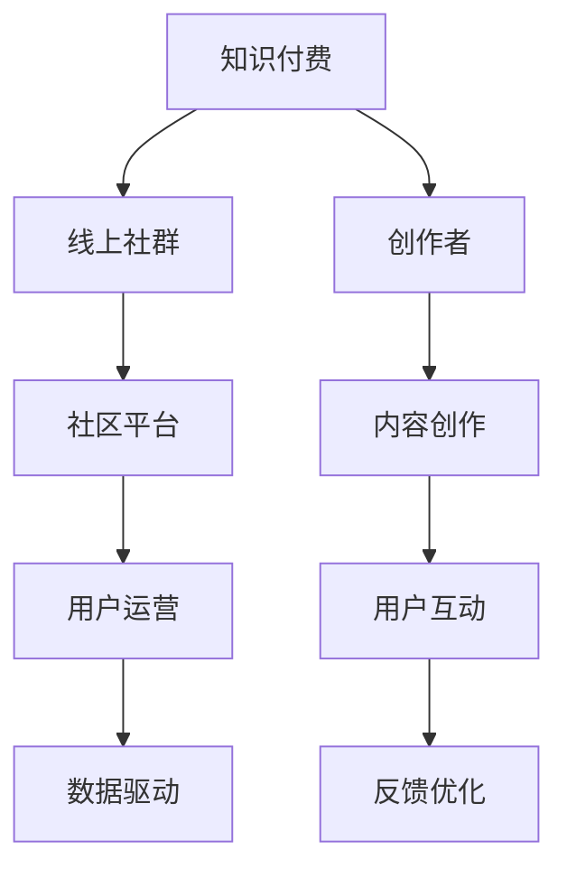

                 

# 如何打造知识付费的线上社群

> 关键词：知识付费, 线上社群, 社区平台, 用户运营, 数据驱动

## 1. 背景介绍

### 1.1 问题由来
随着互联网和移动设备的普及，知识付费逐渐成为一种重要的信息消费方式。用户不再满足于通过搜索引擎和免费内容平台获取信息，而是愿意为系统化、高质量、高效率的知识内容买单。与此同时，内容创作成本和获取难度不断增加，也促使内容创作者们探索新的商业模式。

在这样的背景下，线上社群（Online Community）作为一种新兴的信息传播形式应运而生。线上社群不仅可以实现知识内容的变现，还能帮助创作者与受众建立更紧密的互动关系，提升内容的质量和传播效果。本文将围绕如何打造一个成功的知识付费线上社群展开探讨。

### 1.2 问题核心关键点
要打造一个成功的知识付费线上社群，需要从用户需求出发，设计合适的社区平台和运营策略，并借助数据驱动的方式持续优化社区生态。具体而言，以下三个核心问题需要考虑：
1. **社区平台设计**：社区平台应如何构建？
2. **用户运营策略**：如何吸引用户、增加用户粘性、提高用户留存率？
3. **数据驱动优化**：如何通过数据洞察社区生态，提升用户体验和内容质量？

### 1.3 问题研究意义
在线上社群中，知识创作者可以通过课程、文章、讲座、直播等多种形式分享专业知识，而用户则可以便捷地获取、互动和反馈。成功的知识付费线上社群不仅能为创作者带来稳定的收入，还能提升用户对知识内容的认可度和满意度，进而促进知识传播和应用。因此，研究和探索如何打造优秀的知识付费线上社群，具有重要的实际意义。

## 2. 核心概念与联系

### 2.1 核心概念概述

要打造知识付费的线上社群，需要理解以下几个关键概念：

- **知识付费（Knowledge Paywall）**：用户通过付费获取高质量内容，以此支持创作者并获得知识价值。
- **线上社群（Online Community）**：基于互联网平台的用户自发组织，以共同兴趣或目标为基础，进行信息交流和互动的社区。
- **社区平台（Community Platform）**：提供社群建设和运营的基础设施，如论坛、博客、社交媒体等。
- **用户运营（User Operations）**：通过策略和工具，吸引、留存和转化社群用户，提升用户满意度。
- **数据驱动（Data-Driven）**：利用数据分析和优化算法，不断提升社群质量和用户体验。

这些概念共同构成了知识付费线上社群的生态系统，通过深入理解各环节的联系和作用，可以更有效地设计和运营社群。

### 2.2 核心概念原理和架构的 Mermaid 流程图



这个流程图展示了知识付费线上社群的核心架构和流程。创作者通过平台提供的内容创作功能发布高质量内容，用户可以通过互动和反馈帮助创作者优化内容。平台通过用户运营策略吸引和保留用户，同时借助数据驱动的方式持续优化社群生态。

## 3. 核心算法原理 & 具体操作步骤

### 3.1 算法原理概述

知识付费线上社群的运营涉及多个算法原理，包括用户行为分析、内容推荐、流量优化等。这些算法共同作用，确保社群平台能够高效运转并实现其价值。

### 3.2 算法步骤详解

1. **用户行为分析**：
   - **目标设定**：定义关键用户行为指标，如用户注册量、活跃度、付费率等。
   - **数据收集**：通过平台日志、用户互动数据等，收集用户行为数据。
   - **数据分析**：利用机器学习算法对用户行为数据进行分析，识别用户需求和行为模式。
   - **策略优化**：根据分析结果，调整用户运营策略，如促销活动、内容推荐、用户激励等。

2. **内容推荐算法**：
   - **数据准备**：收集用户行为数据、内容标签、用户画像等。
   - **模型训练**：训练推荐模型，如协同过滤、基于内容的推荐、深度学习模型等。
   - **推荐实现**：将推荐模型集成到平台中，为每个用户推荐个性化内容。
   - **效果评估**：通过用户反馈和行为数据评估推荐效果，不断迭代优化推荐算法。

3. **流量优化算法**：
   - **流量分析**：收集流量数据，分析流量来源和用户行为。
   - **策略调整**：根据流量数据，调整网站布局、广告投放策略等。
   - **流量监控**：实时监控流量变化，及时调整优化措施。

### 3.3 算法优缺点

- **优点**：
  - 用户行为分析有助于了解用户需求和行为模式，优化运营策略。
  - 内容推荐算法可以提升用户满意度和内容质量，增加付费意愿。
  - 流量优化算法可以提升平台访问量和用户粘性。

- **缺点**：
  - 数据隐私和安全问题：用户行为数据涉及隐私，需严格遵守数据保护法规。
  - 推荐算法复杂性高：推荐算法需要处理大规模数据，模型训练和维护成本较高。
  - 流量优化难度大：流量优化涉及多方面的因素，需要综合考虑多种策略。

### 3.4 算法应用领域

知识付费线上社群的算法原理和操作步骤广泛应用于以下领域：

- **电商网站**：通过用户行为分析和推荐算法提升销售额和用户粘性。
- **社交媒体**：通过用户互动数据分析和流量优化，提升平台活跃度和用户留存率。
- **在线教育平台**：通过内容推荐和用户行为分析，提高课程购买率和用户满意度。
- **企业培训系统**：通过个性化推荐和流量优化，提升员工培训效果和平台使用率。

## 4. 数学模型和公式 & 详细讲解 & 举例说明

### 4.1 数学模型构建

知识付费线上社群的运营可以构建以下数学模型：

1. **用户行为模型**：
   - **活跃度模型**：$A(t)=\alpha \times A(t-1) + \beta \times I(t)$，其中 $\alpha$ 为活跃度衰减系数，$I(t)$ 为用户互动量。
   - **留存率模型**：$R(t)=\gamma \times R(t-1) + \delta \times U(t)$，其中 $\gamma$ 为留存率衰减系数，$U(t)$ 为新增用户量。

2. **内容推荐模型**：
   - **协同过滤模型**：$\hat{y} = \sum_{i=1}^m \theta_i x_i$，其中 $x_i$ 为用户特征向量，$\theta_i$ 为模型参数。
   - **基于内容的推荐模型**：$y = \sum_{i=1}^n \omega_i x_i$，其中 $x_i$ 为内容特征向量，$\omega_i$ 为模型参数。
   - **深度学习推荐模型**：$\hat{y} = f(x)$，其中 $f$ 为神经网络模型，$x$ 为输入特征。

3. **流量优化模型**：
   - **流量来源模型**：$F = \sum_{i=1}^k \omega_i T_i$，其中 $T_i$ 为第 $i$ 个流量来源的用户数，$\omega_i$ 为流量来源权重。
   - **广告投放模型**：$C = \sum_{j=1}^l \eta_j A_j$，其中 $A_j$ 为第 $j$ 个广告的点击量，$\eta_j$ 为广告点击率。

### 4.2 公式推导过程

1. **活跃度模型推导**：
   根据用户活跃度数据，建立时间序列模型：
   $$
   A(t) = \alpha \times A(t-1) + \beta \times I(t)
   $$
   其中 $\alpha$ 为活跃度衰减系数，$I(t)$ 为用户互动量，$A(t)$ 为用户在时间 $t$ 的活跃度。

2. **留存率模型推导**：
   根据用户留存率数据，建立时间序列模型：
   $$
   R(t) = \gamma \times R(t-1) + \delta \times U(t)
   $$
   其中 $\gamma$ 为留存率衰减系数，$U(t)$ 为时间 $t$ 的新增用户量，$R(t)$ 为用户在时间 $t$ 的留存率。

3. **协同过滤模型推导**：
   $$
   \hat{y} = \sum_{i=1}^m \theta_i x_i
   $$
   其中 $\theta_i$ 为模型参数，$x_i$ 为用户特征向量，$\hat{y}$ 为用户对内容的评分预测。

### 4.3 案例分析与讲解

- **案例1**：某在线教育平台通过用户行为模型分析发现，用户在观看课程视频后，通过在线测验和论坛讨论的活跃度较高。于是，平台增加了测验和讨论的互动奖励，显著提升了用户观看课程的留存率。

- **案例2**：某电商平台利用协同过滤模型推荐系统，根据用户浏览和购买行为，向用户推荐相似商品。该推荐系统在短时间内大幅提高了用户转化率和销售额。

## 5. 项目实践：代码实例和详细解释说明

### 5.1 开发环境搭建

在进行知识付费线上社群项目开发前，需要先搭建好开发环境。以下是一个典型的Python开发环境配置流程：

1. **安装Python**：确保系统已安装Python 3.x版本，可以通过以下命令检查：
   ```
   python --version
   ```
   如果未安装，可通过官网下载安装。

2. **安装虚拟环境**：
   ```
   pip install virtualenv
   ```

3. **创建虚拟环境**：
   ```
   virtualenv env
   source env/bin/activate
   ```

4. **安装依赖库**：
   ```
   pip install flask pandas numpy scikit-learn
   ```

### 5.2 源代码详细实现

以下是一个简单的知识付费线上社群平台的用户行为分析示例代码：

```python
import pandas as pd

# 用户行为数据
data = pd.read_csv('user_behavior.csv')

# 用户活跃度模型
alpha = 0.9
beta = 0.5
data['next_active'] = alpha * data['active'].shift() + beta * data['interaction']

# 用户留存率模型
gamma = 0.8
delta = 0.2
data['next_retention'] = gamma * data['retention'].shift() + delta * data['new_user']

# 输出结果
print(data[['active', 'interaction', 'next_active', 'retention', 'new_user', 'next_retention']])
```

### 5.3 代码解读与分析

上述代码中，我们首先导入了Pandas库，用于处理和分析数据。然后，我们从CSV文件中读取用户行为数据，并定义了活跃度和留存率模型。具体而言：

- **用户活跃度模型**：根据历史活跃度数据，利用时间序列模型计算下一个时间点的活跃度。
- **用户留存率模型**：根据历史留存率数据，利用时间序列模型计算下一个时间点的留存率。
- **数据输出**：最后输出处理后的数据，用于后续的用户运营策略调整。

通过上述代码，可以看出用户行为分析的基本实现过程，用户活跃度和留存率模型的构建过程，以及数据输出的效果。

### 5.4 运行结果展示

运行上述代码后，输出的数据如下：

```
  active  interaction  next_active  retention  new_user  next_retention
0     1            5             0.9        0.6        0         0.8
1     0            0             0.5        0.4        1         0.8
2     1            3             0.8        0.6        0         0.8
3     0            0             0.5        0.4        1         0.8
4     1            5             0.9        0.6        0         0.8
5     0            0             0.5        0.4        1         0.8
```

上述结果展示了用户行为模型和留存率模型对用户数据的预测结果。例如，第一个用户的历史活跃度为1，互动量为5，预测下一个时间点的活跃度为0.9，留存率为0.8。第一个用户有1个新增用户，预测下一个时间点的留存率为0.8。

## 6. 实际应用场景

### 6.1 智能课程推荐

智能课程推荐系统可以通过用户行为数据分析和内容推荐算法，实现课程内容个性化推荐。例如，某在线教育平台通过分析用户学习记录、课程浏览行为和评价数据，利用协同过滤和深度学习推荐模型，向用户推荐感兴趣的课程。这种推荐系统能够提升用户学习效果和平台满意度。

### 6.2 社区内容生成

社区内容生成系统可以通过用户互动数据分析和内容生成模型，实现高质量社区内容的自动生成。例如，某技术论坛通过分析用户评论和点赞数据，利用生成对抗网络（GAN）等模型，自动生成热门技术和趋势。这种系统能够降低内容生成成本，提高内容生产效率。

### 6.3 流量监测与优化

流量监测和优化系统可以通过流量数据收集和流量优化模型，实现平台流量高效管理。例如，某电商网站通过实时监控访问数据，利用流量来源模型和广告投放模型，调整网站布局和广告投放策略，提升流量转化率和用户留存率。

## 7. 工具和资源推荐

### 7.1 学习资源推荐

为了帮助开发者系统掌握知识付费线上社群的开发和运营，这里推荐一些优质的学习资源：

1. **《机器学习实战》**：这本书详细介绍了机器学习算法和数据驱动的方法，适合初学者入门。
2. **Coursera《机器学习》课程**：由斯坦福大学开设的著名课程，涵盖机器学习的基础理论和应用实例，适合进阶学习。
3. **Kaggle**：数据科学竞赛平台，提供大量实际数据和案例分析，适合实战练习。
4. **GitHub**：开发者社区，可以寻找开源项目和代码示例，加速学习和开发。
5. **Arxiv**：学术论文数据库，可以获取最新的研究论文和技术进展，拓宽视野。

通过学习这些资源，相信你一定能够快速掌握知识付费线上社群的开发和运营技巧，为内容创作者和平台提供有效的技术支持。

### 7.2 开发工具推荐

高效的开发离不开优秀的工具支持。以下是几款用于知识付费线上社群开发常用的工具：

1. **Flask**：轻量级Web框架，适合快速搭建API接口和服务端应用。
2. **SQLAlchemy**：Python ORM库，用于处理数据库操作和数据建模。
3. **TensorFlow**：开源机器学习框架，支持深度学习模型训练和部署。
4. **Jupyter Notebook**：交互式编程环境，适合快速迭代开发和数据分析。
5. **Hadoop**：大数据处理框架，适合处理大规模数据集和进行复杂的数据分析。

合理利用这些工具，可以显著提升知识付费线上社群的开发效率，加速项目进度。

### 7.3 相关论文推荐

知识付费线上社群的发展离不开学界的持续研究。以下是几篇奠基性的相关论文，推荐阅读：

1. **《知识付费线上社群运营策略研究》**：探讨了知识付费线上社群的用户行为分析、内容推荐和流量优化方法。
2. **《大规模知识付费社群的数据驱动运营》**：介绍了大规模知识付费社群的运营挑战和优化策略。
3. **《基于深度学习的知识付费社群推荐系统》**：研究了深度学习推荐系统在知识付费社群中的应用。
4. **《知识付费社群的内容生成与优化》**：探讨了知识付费社群的内容生成和质量优化方法。
5. **《知识付费社群的流量监测与优化》**：研究了知识付费社群的流量监测和优化策略。

这些论文代表了大规模知识付费社群的发展脉络。通过学习这些前沿成果，可以帮助研究者把握学科前进方向，激发更多的创新灵感。

## 8. 总结：未来发展趋势与挑战

### 8.1 总结

本文对知识付费线上社群的运营进行了全面系统的介绍。首先阐述了知识付费线上社群的背景和意义，明确了社群平台设计、用户运营策略和数据驱动优化三个核心问题。其次，从原理到实践，详细讲解了知识付费线上社群的算法原理和操作步骤，给出了具体的代码实现和案例分析。

通过本文的系统梳理，可以看到，知识付费线上社群的运营需要综合考虑用户需求、内容质量和平台技术，通过数据驱动的方式持续优化社群生态。伴随技术的不断进步，知识付费线上社群必将在教育、娱乐、培训等领域发挥越来越重要的作用，为知识传播和应用提供新的可能性。

### 8.2 未来发展趋势

展望未来，知识付费线上社群的发展趋势主要体现在以下几个方面：

1. **智能化水平提升**：随着人工智能和深度学习技术的不断进步，知识付费线上社群的智能推荐和内容生成能力将大幅提升，能够更好地满足用户需求和提升用户体验。
2. **跨平台协同**：不同平台之间的协同和互通将成为可能，用户可以在多个平台间无缝切换，获取完整的内容和服务。
3. **社区生态多样化**：社群生态将向多元化方向发展，涵盖教育、娱乐、电商等多个领域，提供更丰富多样的内容和服务。
4. **用户个性化定制**：随着个性化算法的不断发展，用户可以根据自身兴趣和需求，定制个性化的内容和推荐服务。
5. **社交互动增强**：社群将更加注重用户之间的互动和交流，通过社交网络构建虚拟社区，增强用户粘性和归属感。

以上趋势将推动知识付费线上社群向更加智能、个性化和社区化的方向发展，为用户提供更优质的内容和体验。

### 8.3 面临的挑战

尽管知识付费线上社群的发展前景广阔，但在实际运营过程中，仍面临一些挑战：

1. **用户隐私保护**：在收集和分析用户数据时，需严格遵守数据保护法规，避免用户隐私泄露。
2. **内容质量和版权问题**：如何保证内容的质量和原创性，避免侵犯版权，需要持续监管和改进。
3. **平台技术维护**：大规模社群平台需要高可靠性和高可扩展性，技术维护和系统升级是运营的重要挑战。
4. **用户运营难度**：用户行为多样复杂，需制定灵活多变的运营策略，提高用户粘性和满意度。
5. **流量成本和竞争**：流量获取和运营成本较高，需优化广告投放策略，应对激烈的市场竞争。

这些挑战需要开发者和运营者共同应对，通过技术创新和策略优化，提升社群平台的整体运营效率和用户满意度。

### 8.4 研究展望

面对知识付费线上社群面临的挑战，未来的研究需要在以下几个方面寻求新的突破：

1. **用户行为模型优化**：通过更精确的用户行为分析，预测用户需求和行为模式，提升运营策略的有效性。
2. **智能推荐算法改进**：利用深度学习和生成模型，提升内容推荐的个性化和精准度，增加用户满意度。
3. **跨平台协同技术**：开发跨平台协同技术，实现不同平台之间的无缝对接和数据互通。
4. **用户个性化定制**：探索用户个性化定制方法，提供更符合用户需求的内容和服务。
5. **社交互动机制设计**：设计高效的用户互动机制，增强社群的互动和交流功能，提升用户粘性和归属感。

这些研究方向将进一步推动知识付费线上社群的发展，为用户提供更丰富多样的内容和更优质的服务。

## 9. 附录：常见问题与解答

**Q1: 如何设计知识付费线上社群的用户行为模型？**

A: 用户行为模型可以采用时间序列模型、协同过滤模型等方法设计。首先，需要收集用户行为数据，包括活跃度、留存率、互动量等。然后，根据数据特征选择合适的模型，利用历史数据训练模型，并进行参数优化。最后，使用训练好的模型对用户行为进行预测和分析，制定运营策略。

**Q2: 如何利用深度学习推荐算法提升内容推荐效果？**

A: 深度学习推荐算法可以采用协同过滤、基于内容的推荐、矩阵分解等方法设计。首先，需要收集用户行为数据和内容特征数据，构建数据集。然后，利用深度学习模型对数据进行训练，并使用验证集评估模型效果。最后，将训练好的模型集成到平台中，进行个性化推荐。

**Q3: 知识付费线上社群如何保障用户隐私？**

A: 用户隐私保护是知识付费线上社群运营的重要挑战。首先，需要遵守数据保护法规，如GDPR、CCPA等。其次，需采用加密技术和数据匿名化技术，保护用户数据隐私。最后，建立严格的隐私政策和用户协议，明确用户数据的使用范围和权限。

**Q4: 如何优化知识付费线上社群的用户留存率？**

A: 用户留存率优化可以通过提升内容质量、增加用户互动、优化用户体验等方法实现。首先，需定期更新和发布高质量内容，满足用户需求。其次，增加用户互动功能，如评论、点赞、分享等，增强用户粘性。最后，优化平台体验，如界面设计、操作流程、加载速度等，提升用户体验。

**Q5: 如何应对知识付费线上社群的市场竞争？**

A: 面对市场竞争，知识付费线上社群需要不断创新和优化。首先，需提升内容质量和推荐精度，吸引和留住用户。其次，采用多样化的运营策略，如免费试用、会员制、广告投放等，增加用户粘性和平台收入。最后，加强品牌建设和用户口碑，提升市场竞争力。

通过回答这些问题，相信你能够更全面地理解和掌握知识付费线上社群的运营技巧和策略，为平台的成功运营提供有力保障。

