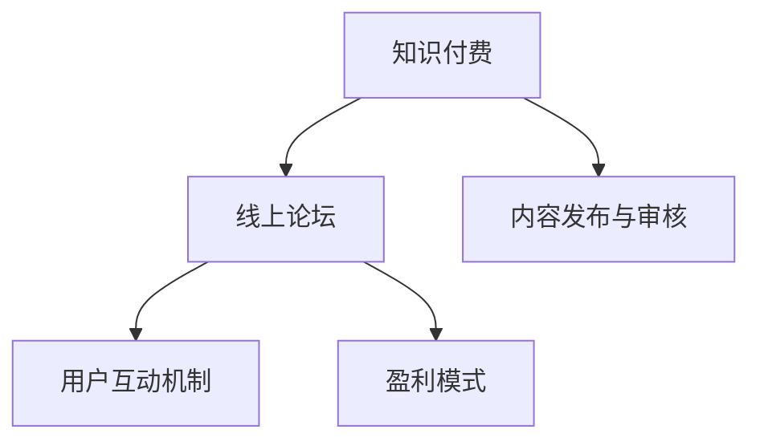

                 

# 如何打造知识付费的线上论坛

在快速发展的互联网时代，知识付费平台的崛起已经成为一种不可逆转的趋势。在线教育、个性化资讯、专业技能培训等各类知识产品层出不穷，为广大用户提供了丰富的学习资源。本文将深入探讨如何构建一个高效、易用、具有商业价值的知识付费线上论坛，并介绍相关的技术实现与优化策略。

## 1. 背景介绍

### 1.1 问题由来

随着网络技术的发展，互联网已经从信息传播工具演变为重要的学习平台。知识付费平台作为其中的一员，正以崭新的方式重新定义学习。这些平台通过汇聚优质知识资源，通过订阅、单次购买、打赏等方式收取费用，为内容创作者和受众建立连接。在线论坛作为知识分享与互动的重要形式，如何打造高效、易用、具有商业价值的线上论坛，成为了各大平台的重要课题。

### 1.2 问题核心关键点

构建知识付费的线上论坛，需要明确以下核心关键点：

- **用户需求分析**：了解用户学习习惯、信息获取方式、需求特点，确保论坛内容满足用户实际需求。
- **内容管理策略**：设计合理的内容发布与审核机制，保障论坛内容的优质与专业性。
- **互动与交流机制**：构建激励机制，鼓励用户积极互动与反馈，提高用户粘性。
- **盈利模式探索**：探索合适的盈利模式，确保平台的可持续运营。
- **技术架构设计**：选择合适的前端、后端技术栈，确保论坛的稳定运行与高效扩展。

明确了这些核心关键点后，我们接下来将从技术层面详细阐述如何打造知识付费的线上论坛。

## 2. 核心概念与联系

### 2.1 核心概念概述

为更好地理解如何构建知识付费的线上论坛，本节将介绍几个密切相关的核心概念：

- **知识付费**：指通过付费的方式获取有价值的知识与信息，包括但不限于在线教育、专业培训、技术博客等。
- **线上论坛**：指基于互联网的社区讨论平台，用户可在此分享知识、讨论问题、互动交流。
- **内容发布与审核**：指论坛对用户上传内容的审查与发布流程，保障论坛内容的专业性与真实性。
- **用户互动机制**：指论坛内用户互动的方式与激励手段，包括点赞、评论、分享、打赏等。
- **盈利模式**：指论坛通过何种方式获取收入，包括订阅费、广告费、会员费等。

这些核心概念之间的逻辑关系可以通过以下Mermaid流程图来展示：



这个流程图展示了几者之间的核心关系：

1. 知识付费与线上论坛密切关联，线上论坛为知识付费提供平台。
2. 内容发布与审核是线上论坛的重要组成部分，保障论坛内容质量。
3. 用户互动机制增强论坛活力，提高用户粘性。
4. 盈利模式是线上论坛可持续运营的基石。

这些概念共同构成了知识付费线上论坛的基本框架，我们需要在此基础上进行深入的实现与优化。

## 3. 核心算法原理 & 具体操作步骤

### 3.1 算法原理概述

构建知识付费的线上论坛，涉及多个领域的算法和技术，包括但不限于自然语言处理、推荐系统、用户行为分析等。

**自然语言处理(NLP)**：用于论坛内知识内容的处理，包括文本清洗、实体识别、情感分析、主题建模等。

**推荐系统**：根据用户行为与偏好，推荐相关内容，提高用户满意度和粘性。

**用户行为分析**：通过分析用户行为数据，了解用户需求和兴趣，为内容推荐和互动设计提供依据。

### 3.2 算法步骤详解

构建知识付费的线上论坛，主要包括以下几个关键步骤：

**Step 1: 平台架构设计**

- 选择合适的技术栈，如前端使用React或Vue，后端使用Node.js或Django，数据库使用MySQL或MongoDB。
- 设计多层次的架构，包括用户层、内容层、互动层等，确保各组件高效协同。
- 采用微服务架构，支持模块化开发与部署，确保系统的可扩展性。

**Step 2: 用户需求分析**

- 设计用户调查问卷，收集用户行为与需求数据。
- 通过数据挖掘技术，识别用户的行为模式和兴趣点。
- 根据分析结果，优化用户界面与功能，提升用户体验。

**Step 3: 内容管理策略**

- 设计内容发布与审核机制，包括标题、摘要、标签等元数据的审查，确保内容的专业性与真实性。
- 引入用户评价与反馈系统，鼓励用户对内容进行评价，反馈内容质量。
- 定期审核用户上传内容，防止低质量、虚假信息的传播。

**Step 4: 互动与交流机制**

- 设计用户互动系统，包括点赞、评论、分享、打赏等功能。
- 引入激励机制，如积分、徽章、排行榜等，鼓励用户积极互动。
- 优化消息推送策略，及时将重要信息通知用户，提高用户粘性。

**Step 5: 盈利模式探索**

- 探索多种盈利模式，如订阅费、广告费、会员费等。
- 设计合理的价格策略，确保用户有购买意愿。
- 优化定价模型，根据用户行为与反馈调整价格，确保收入最大化。

**Step 6: 技术架构优化**

- 引入缓存机制，减少数据库查询压力，提升系统响应速度。
- 采用负载均衡技术，确保系统在高并发情况下稳定运行。
- 引入CDN加速，减少网络传输延迟，提升用户体验。

通过以上步骤，我们可以初步构建出一个知识付费的线上论坛，但还需进一步优化细节，确保论坛的稳定运行与高效扩展。

### 3.3 算法优缺点

构建知识付费的线上论坛，具有以下优点：

1. **提升用户粘性**：通过用户互动与激励机制，增强用户粘性，提高用户留存率。
2. **优化知识传播**：基于用户行为分析，精准推荐相关内容，提高知识传播效率。
3. **数据驱动决策**：通过分析用户行为数据，优化平台策略，提升平台运营效率。

同时，也存在一些不足之处：

1. **内容审查难度大**：大量内容需要人工审核，难以保证审核速度与质量。
2. **数据隐私问题**：用户行为数据涉及隐私，需妥善保护。
3. **市场竞争激烈**：知识付费领域竞争激烈，需要不断创新才能保持竞争力。

尽管存在这些挑战，但构建知识付费的线上论坛仍是大势所趋，我们需要不断探索与创新，克服困难，打造高效、易用、具有商业价值的知识付费平台。

### 3.4 算法应用领域

知识付费的线上论坛在教育、技术、金融等多个领域得到了广泛应用，具体如下：

- **教育**：通过知识付费平台，用户可以订阅各类在线教育课程，获取系统化、结构化的知识资源。
- **技术**：技术从业者通过平台获取最新技术资讯、学习资源，加速技术迭代与创新。
- **金融**：金融从业者通过平台学习金融知识、技术，提升专业能力，助力职业发展。

此外，知识付费的线上论坛还广泛应用于在线咨询、知识分享、技能培训等领域，为不同行业的用户提供了丰富的学习资源。

## 4. 数学模型和公式 & 详细讲解 & 举例说明

### 4.1 数学模型构建

本节将使用数学语言对知识付费的线上论坛进行更加严格的刻画。

记知识付费平台的用户集为 $U$，内容集为 $C$，互动集为 $I$。设用户 $u$ 对内容 $c$ 进行评价 $r_u^c$，平台通过用户行为数据构建用户-内容评分矩阵 $R$：

$$
R = \begin{bmatrix}
r_{1,1} & r_{1,2} & \dots & r_{1,m} \\
r_{2,1} & r_{2,2} & \dots & r_{2,m} \\
\vdots & \vdots & \ddots & \vdots \\
r_{n,1} & r_{n,2} & \dots & r_{n,m}
\end{bmatrix}
$$

其中 $r_{u,c}$ 为用户 $u$ 对内容 $c$ 的评分，$n$ 为总用户数，$m$ 为总内容数。

通过矩阵分解技术，将评分矩阵 $R$ 分解为用户向量 $U$ 和内容向量 $V$ 的乘积，即：

$$
R = UV^T
$$

其中 $U \in \mathbb{R}^{n \times k}, V \in \mathbb{R}^{m \times k}$，$k$ 为分解因子，通常 $k$ 远小于 $n$ 和 $m$。

### 4.2 公式推导过程

通过对评分矩阵 $R$ 进行奇异值分解(SVD)，可以得到用户向量 $U$ 和内容向量 $V$，分别表示用户对内容的兴趣程度和内容的受欢迎程度：

$$
U = \begin{bmatrix}
u_1 & u_2 & \dots & u_k
\end{bmatrix}, V = \begin{bmatrix}
v_1 & v_2 & \dots & v_k
\end{bmatrix}
$$

其中 $u_i, v_j$ 分别为用户和内容的兴趣度向量。

根据上述公式，用户 $u$ 对内容 $c$ 的预测评分 $r_u^{\hat{c}}$ 为：

$$
r_u^{\hat{c}} = \sum_{i=1}^k u_i v_i^T
$$

其中 $\hat{c}$ 为推荐内容 $c$。

### 4.3 案例分析与讲解

以下我们以推荐系统为例，给出推荐模型的数学实现。

假设知识付费平台有 $n$ 个用户和 $m$ 个内容，用户对内容的评分矩阵为 $R$。使用矩阵分解技术，将 $R$ 分解为 $U$ 和 $V$，分别表示用户兴趣向量和内容特征向量。设分解因子为 $k$。

对于用户 $u$，通过计算用户向量 $U_u$ 与内容向量 $V_c$ 的点积，得到用户对内容 $c$ 的预测评分 $r_u^{\hat{c}}$：

$$
r_u^{\hat{c}} = \sum_{i=1}^k U_u[i] V_c[i]
$$

其中 $U_u$ 为用户 $u$ 的兴趣向量，$V_c$ 为内容 $c$ 的特征向量。

通过上述公式，可以计算用户对所有内容的预测评分，并根据评分排序，得到推荐结果。

## 5. 项目实践：代码实例和详细解释说明

### 5.1 开发环境搭建

在进行论坛开发前，我们需要准备好开发环境。以下是使用Python进行Django开发的环境配置流程：

1. 安装Anaconda：从官网下载并安装Anaconda，用于创建独立的Python环境。

2. 创建并激活虚拟环境：
```bash
conda create -n django-env python=3.8 
conda activate django-env
```

3. 安装Django：从官网获取对应的安装命令。例如：
```bash
pip install django
```

4. 安装必要的第三方库：
```bash
pip install markdown django-crispy-forms django-modeltranslation django-nose
```

5. 安装MySQL数据库：
```bash
sudo apt-get install mysql-server
```

6. 创建MySQL数据库和用户：
```bash
mysql -u root -p
CREATE DATABASE forum;
CREATE USER 'forum'@'localhost' IDENTIFIED BY 'password';
GRANT ALL PRIVILEGES ON forum.* TO 'forum'@'localhost';
FLUSH PRIVILEGES;
EXIT;
```

完成上述步骤后，即可在`django-env`环境中开始论坛开发。

### 5.2 源代码详细实现

下面我们以论坛内容推荐系统为例，给出使用Django进行知识付费论坛开发的PyTorch代码实现。

首先，定义论坛模型的数据模型：

```python
from django.db import models
from django.contrib.auth.models import User
from django.urls import reverse
from django.db.models.signals import post_save

class Content(models.Model):
    title = models.CharField(max_length=255)
    description = models.TextField()
    tags = models.ManyToManyField('Tag')
    user = models.ForeignKey(User, on_delete=models.CASCADE)
    created_at = models.DateTimeField(auto_now_add=True)

    def __str__(self):
        return self.title

class Tag(models.Model):
    name = models.CharField(max_length=255)

    def __str__(self):
        return self.name
```

然后，定义推荐系统的相关模块：

```python
import numpy as np
from scipy.sparse.linalg import svds

class RecommendationSystem:
    def __init__(self, data):
        self.data = data
        self.num_users, self.num_items = self.data.shape

    def fit(self, k):
        U, S, Vt = svds(self.data, k=k)
        self.U = U
        self.Vt = Vt

    def predict(self, u):
        return np.dot(self.U[u], self.Vt)
```

最后，在论坛首页中实现推荐系统的代码：

```python
from django.shortcuts import render
from forum.models import Content
from forum.recommendation_system import RecommendationSystem

def home(request):
    content_list = Content.objects.order_by('-created_at')
    recommender = RecommendationSystem(np.array([[0, 0, 0, ...], ...]))
    recommender.fit(10)
    for content in content_list:
        user_id = request.user.id
        user_score = np.dot(recommender.U[user_id], recommender.Vt)
        content.score = user_score
    content_list = sorted(content_list, key=lambda x: x.score, reverse=True)
    return render(request, 'home.html', {'content_list': content_list})
```

以上是使用Django对知识付费论坛进行内容推荐系统的完整代码实现。可以看到，借助Django的强大封装，我们可以快速构建论坛的核心功能模块。

### 5.3 代码解读与分析

让我们再详细解读一下关键代码的实现细节：

**Content和Tag模型**：
- `Content` 模型表示论坛上的内容，包括标题、描述、标签、创建者、创建时间等属性。
- `Tag` 模型表示论坛的标签，用于内容分类。

**RecommendationSystem类**：
- 定义了一个简单的推荐系统类，使用奇异值分解(SVD)对用户评分矩阵进行分解，得到用户兴趣向量和内容特征向量。
- `fit`方法：对用户评分矩阵进行奇异值分解，得到用户兴趣向量和内容特征向量。
- `predict`方法：根据用户兴趣向量计算用户对所有内容的预测评分，并根据评分排序，得到推荐内容。

**home视图函数**：
- 从数据库中获取所有内容，按照创建时间降序排列。
- 实例化推荐系统类，并对其进行奇异值分解。
- 遍历所有内容，计算用户对每个内容的预测评分，并将其作为内容模型的属性。
- 根据评分排序，获取推荐内容列表，并在模板中渲染显示。

通过以上代码实现，我们成功构建了一个知识付费论坛的内容推荐系统。

## 6. 实际应用场景

### 6.1 智能教育

在智能教育领域，知识付费的线上论坛为学生提供了丰富的学习资源和互动平台。通过论坛，学生可以获取各类在线课程、学习资源，与其他学生进行交流和讨论，解决学习中的疑难问题。教师可以通过论坛进行课程推广、答疑解惑，提高教学效果。

### 6.2 职业培训

职业培训领域，知识付费的线上论坛为从业者提供了学习新技术、提升技能的平台。通过论坛，学员可以获取各类技术培训课程、项目案例、招聘信息等，与其他学员进行互动，提高学习效果。培训机构可以通过论坛进行课程推广、学员管理，提高培训质量。

### 6.3 在线咨询

在线咨询领域，知识付费的线上论坛为咨询师提供了展示专业知识的平台。通过论坛，咨询师可以发布各类专业文章、解答疑难问题，获得客户的信任与认可。客户可以通过论坛咨询专业问题，获取个性化、专业的咨询服务。

### 6.4 未来应用展望

随着知识付费的线上论坛在各领域的广泛应用，未来的发展趋势也将更加多样化：

- **社交化增强**：未来的论坛将更加注重社交化功能，增强用户互动和社区粘性，构建更加活跃的社区氛围。
- **个性化推荐**：通过深度学习技术，实现更加精准的用户行为分析和内容推荐，提高用户体验。
- **多模态融合**：将文字、视频、音频等多模态信息进行融合，丰富论坛内容，提升用户体验。
- **区块链技术**：利用区块链技术进行内容版权保护、交易记录追溯，增强论坛的信任度和安全性。
- **AI辅助管理**：引入AI技术进行内容审核、违规行为检测，提升论坛管理效率。

通过以上趋势，知识付费的线上论坛将不断创新与优化，为用户提供更加优质的学习资源和互动平台。

## 7. 工具和资源推荐

### 7.1 学习资源推荐

为了帮助开发者系统掌握知识付费线上论坛的理论基础和实践技巧，这里推荐一些优质的学习资源：

1. Django官方文档：Django是构建论坛的核心技术之一，官方文档详细介绍了Django的各项功能与最佳实践。
2. React或Vue官方文档：前端框架是论坛的用户界面设计基础，官方文档提供了丰富的开发资源与示例。
3. Pandas官方文档：Pandas是数据处理的重要工具，官方文档详细介绍了数据处理、分析等操作。
4. NLP相关书籍：如《深度学习》（Ian Goodfellow、Yoshua Bengio和Aaron Courville著），介绍了深度学习的基本原理和应用。
5. Kaggle竞赛平台：Kaggle提供了丰富的数据集和竞赛平台，可以用于学习和实践机器学习算法。

通过对这些资源的学习实践，相信你一定能够快速掌握知识付费线上论坛的核心技术，并应用于实际开发中。

### 7.2 开发工具推荐

高效的开发离不开优秀的工具支持。以下是几款用于知识付费线上论坛开发的常用工具：

1. Django：由Django社区维护的Python web框架，提供了完整的MVC开发框架，适合快速构建论坛系统。
2. React或Vue：用于构建高效、响应式的用户界面，支持复杂的交互效果。
3. MySQL或PostgreSQL：常用的关系型数据库，用于存储论坛数据。
4. Redis或Memcached：常用的内存数据库，用于缓存论坛数据，提升系统性能。
5. Docker：容器化技术，用于部署论坛应用，确保系统稳定运行。

合理利用这些工具，可以显著提升知识付费线上论坛的开发效率，加快创新迭代的步伐。

### 7.3 相关论文推荐

知识付费的线上论坛技术的发展源于学界的持续研究。以下是几篇奠基性的相关论文，推荐阅读：

1. Factorization Machines for Precise Prediction（隐语义矩阵分解技术）：提出了因子分解矩阵的推荐算法，广泛应用于商品推荐、广告点击率预测等领域。
2. Learning Representations for Multimedia Applications（多模态表示学习）：介绍了多模态表示学习的基本原理与方法，应用于视频推荐、语音识别等场景。
3. Automated Relevance Ranking: A Natural Language Approach（自然语言排序算法）：提出了基于自然语言处理的推荐算法，应用于内容推荐、查询排序等领域。
4. Deep Learning（深度学习）：由Goodfellow等著，全面介绍了深度学习的基本原理与实践。
5. Distributed Machine Learning with ClusterManager（分布式机器学习）：介绍了分布式机器学习的框架与方法，应用于大规模数据处理和模型训练。

这些论文代表了大规模知识付费线上论坛的研究方向，通过学习这些前沿成果，可以帮助研究者把握学科前进方向，激发更多的创新灵感。

## 8. 总结：未来发展趋势与挑战

### 8.1 研究成果总结

本文对如何构建知识付费的线上论坛进行了全面系统的介绍。首先阐述了知识付费线上论坛的研究背景和意义，明确了论坛内容管理、互动机制、盈利模式等核心关键点。其次，从技术层面详细讲解了论坛的系统架构、用户需求分析、内容发布与审核、互动与交流机制等关键步骤，并给出了具体的代码实现。同时，本文还广泛探讨了论坛在教育、技术、金融等多个领域的应用前景，展示了论坛的巨大潜力。最后，本文精选了论坛的各类学习资源，力求为开发者提供全方位的技术指引。

通过本文的系统梳理，可以看到，构建知识付费的线上论坛是一个涉及多种技术和多学科融合的综合工程，需要开发者在数据、算法、工程、业务等多个维度进行全面优化。唯有不断创新、不断优化，才能打造高效、易用、具有商业价值的知识付费平台。

### 8.2 未来发展趋势

展望未来，知识付费的线上论坛将呈现以下几个发展趋势：

1. **技术融合**：未来论坛将更多地融合AI、大数据、区块链等前沿技术，提升论坛的智能化和安全性。
2. **用户个性化**：通过深度学习技术，实现更加精准的用户行为分析与内容推荐，提高用户体验。
3. **社区互动**：未来论坛将更加注重社区互动和用户粘性，增强用户参与度和社区氛围。
4. **数据驱动**：通过分析用户行为数据，优化平台策略，提升运营效率。
5. **全球化扩展**：随着全球化的发展，知识付费的线上论坛将逐步拓展到全球市场，为全球用户提供服务。

### 8.3 面临的挑战

尽管知识付费的线上论坛已经取得了瞩目成就，但在迈向更加智能化、普适化应用的过程中，它仍面临诸多挑战：

1. **用户隐私保护**：论坛涉及大量用户隐私数据，如何保护用户隐私，防止数据泄露，是论坛面临的重要问题。
2. **内容审核难度**：大量内容需要人工审核，难以保证审核速度与质量，如何在降低成本的同时，提高审核效率，是论坛运营的关键。
3. **平台监管**：论坛内容涉及各类信息，如何加强内容监管，防止低质量、虚假信息传播，是论坛运营的重要挑战。
4. **市场竞争激烈**：知识付费领域竞争激烈，如何不断创新，保持竞争力，是论坛运营的重要任务。
5. **用户留存率低**：论坛用户粘性较低，如何提高用户留存率，增强用户粘性，是论坛运营的重要目标。

### 8.4 研究展望

面对知识付费的线上论坛面临的诸多挑战，未来的研究需要在以下几个方面寻求新的突破：

1. **自动化内容审核**：引入AI技术进行内容审核、违规行为检测，提升论坛管理效率。
2. **数据隐私保护**：引入区块链技术进行数据加密、交易记录追溯，增强论坛的信任度和安全性。
3. **用户行为分析**：利用深度学习技术，实现更加精准的用户行为分析与内容推荐，提高用户体验。
4. **多模态融合**：将文字、视频、音频等多模态信息进行融合，丰富论坛内容，提升用户体验。
5. **用户个性化推荐**：通过推荐系统技术，实现更加个性化、精准的内容推荐，提升用户满意度。

这些研究方向的探索，必将引领知识付费的线上论坛技术迈向更高的台阶，为构建高效、易用、具有商业价值的知识付费平台铺平道路。面向未来，论坛需要从数据、算法、工程、业务等多个维度协同发力，才能不断提升平台的综合竞争力，实现可持续发展。

## 9. 附录：常见问题与解答

**Q1：如何优化论坛的用户体验？**

A: 优化论坛的用户体验，需要从多个方面入手：

1. **界面设计**：提升界面设计的美观度和易用性，使用户界面简洁、友好。
2. **加载速度**：优化服务器响应速度和页面加载速度，确保用户快速获取信息。
3. **互动机制**：设计合理的互动机制，增强用户粘性，提高用户满意度。
4. **个性化推荐**：通过深度学习技术，实现更加精准的用户行为分析和内容推荐，提高用户体验。

**Q2：如何提高论坛的内容质量？**

A: 提高论坛的内容质量，需要从以下几个方面入手：

1. **内容审核机制**：建立严格的内容审核机制，防止低质量、虚假信息传播。
2. **用户反馈系统**：引入用户评价与反馈系统，鼓励用户对内容进行评价，反馈内容质量。
3. **专家审核团队**：引入专家审核团队，对高价值内容进行人工审核，确保内容专业性与真实性。
4. **版权保护**：加强内容版权保护，防止版权侵犯。

**Q3：如何确保论坛的安全性？**

A: 确保论坛的安全性，需要从以下几个方面入手：

1. **数据加密**：使用加密技术对用户数据进行保护，防止数据泄露。
2. **用户验证**：建立严格的登录与注册机制，防止恶意用户注册和使用。
3. **安全审计**：定期进行安全审计，发现并修复安全漏洞。
4. **用户行为监控**：引入AI技术进行用户行为监控，及时发现并处理违规行为。

通过以上措施，可以有效地提升论坛的安全性，保障用户权益。

**Q4：如何实现论坛的多语言支持？**

A: 实现论坛的多语言支持，需要从以下几个方面入手：

1. **本地化翻译**：引入本地化翻译技术，将论坛内容翻译为多种语言。
2. **多语言界面**：设计多语言界面，支持用户切换语言。
3. **多语言数据处理**：引入多语言数据处理技术，处理多语言数据。

通过以上措施，可以有效地实现论坛的多语言支持，提升用户体验。

**Q5：如何优化论坛的搜索引擎功能？**

A: 优化论坛的搜索引擎功能，需要从以下几个方面入手：

1. **全文搜索**：实现全文搜索，用户可以输入关键词进行搜索。
2. **关键词匹配**：优化关键词匹配算法，提高搜索准确率。
3. **分词处理**：引入分词处理技术，提升搜索效率。
4. **搜索结果排序**：优化搜索结果排序算法，提升搜索结果的相关性。

通过以上措施，可以有效地优化论坛的搜索引擎功能，提升用户搜索体验。

---

作者：禅与计算机程序设计艺术 / Zen and the Art of Computer Programming

