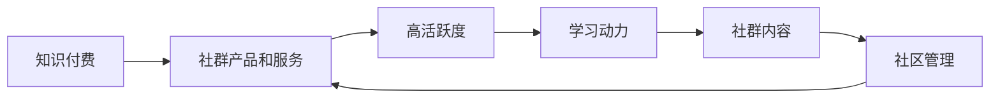

                 

# 如何打造高活跃的程序员知识付费社群

> 关键词：知识付费,程序员社群,高活跃度,学习动力,社区管理

## 1. 背景介绍

随着科技行业的快速发展和全球技术人才的需求日益增加，越来越多的技术爱好者和专业人士希望通过在线学习平台来提升技能，这为知识付费社群提供了广阔的发展空间。然而，如何打造一个高活跃的程序员知识付费社群，使其成为技术人才互相学习、交流和成长的平台，是一个极具挑战性的任务。本文旨在探讨这一问题，从多个维度分析社群运营的关键要素，提出有效策略和解决方案，帮助社群管理者提升社群活跃度，实现持续增长。

## 2. 核心概念与联系

### 2.1 核心概念概述

为了深入理解如何打造高活跃的程序员知识付费社群，我们首先需要明确几个核心概念及其相互之间的关系：

- **知识付费**：指的是通过付费的方式获取专业知识、技能或信息，知识付费社群是这一模式在社群平台上的具体应用。
- **程序员社群**：指的是聚集了程序员，以共同学习、讨论技术问题、分享经验为主要目标的线上或线下社区。
- **高活跃度**：指社群成员的参与度、互动频率和社群内容的更新频率等，反映了社群的活跃程度。
- **学习动力**：指社群成员参与学习、分享和交流的内在驱动因素，包括个人成长需求、职业发展目标等。
- **社区管理**：指对社群的运营、规则制定、内容审核、用户互动等方面的管理措施，确保社群的健康发展和成员的良好体验。

### 2.2 核心概念原理和架构的 Mermaid 流程图

以下是核心概念之间的逻辑关系图示：



这个流程图展示了知识付费社群的运作机制：

1. **知识付费**：通过提供有价值的产品和服务，吸引和保持社群成员的参与。
2. **社群产品和服务**：包括课程、资料、问答、讨论等，是吸引成员的核心。
3. **高活跃度**：通过有效的社区管理和高质量的内容供给，提升成员的参与度。
4. **学习动力**：通过满足成员的学习需求和职业目标，激发参与积极性。
5. **社群内容**：提供有价值的知识分享和学习材料。
6. **社区管理**：确保社群的规范有序，维护良好的互动环境。

## 3. 核心算法原理 & 具体操作步骤

### 3.1 算法原理概述

打造高活跃的程序员知识付费社群，需要综合运用多种算法和技术手段，包括推荐算法、互动分析、用户行为预测等。以下是这一过程的算法原理概述：

1. **推荐算法**：通过分析成员的学习历史和行为数据，推荐个性化的学习内容和资源，提升学习效率和满意度。
2. **互动分析**：监测和分析社群成员之间的互动行为，如提问、回答、点赞、评论等，发现活跃用户和潜在问题，优化社群结构。
3. **用户行为预测**：预测成员的学习行为和需求，如课程选择、学习时间安排等，提前做好准备，提升服务质量。

### 3.2 算法步骤详解

以下是详细的算法步骤：

#### 3.2.1 数据收集与预处理

1. **数据来源**：收集社群内的课程浏览记录、学习进度、讨论记录、问答记录等。
2. **数据清洗**：处理缺失值、异常值，去除无关信息，确保数据质量。

#### 3.2.2 用户行为分析

1. **互动分析**：统计每个用户的提问、回答、点赞、评论数量，分析活跃用户和潜在问题。
2. **学习路径分析**：分析用户的学习路径，发现常见问题和障碍，优化课程内容。

#### 3.2.3 个性化推荐

1. **内容推荐**：基于用户的浏览历史、学习进度和偏好，推荐个性化的学习资源和课程。
2. **用户推荐**：推荐与用户兴趣相关的其他成员，促进交流和学习。

#### 3.2.4 社区管理与优化

1. **规则制定**：明确社群的规则和行为标准，建立良好的社区环境。
2. **内容审核**：对社群内的内容进行审核，确保质量，防止有害信息的传播。
3. **用户互动**：鼓励和引导成员积极互动，建立社区的良好氛围。

### 3.3 算法优缺点

#### 3.3.1 算法优点

1. **提升学习效率**：个性化推荐和互动分析能够提升成员的学习效率和满意度。
2. **优化社群结构**：通过活跃用户分析和用户推荐，促进社群成员之间的互动和交流。
3. **增强用户粘性**：通过高质量的内容和服务，提升成员的参与度和忠诚度。

#### 3.3.2 算法缺点

1. **数据隐私问题**：需要收集和处理大量的用户数据，可能涉及隐私问题。
2. **算法复杂性**：个性化推荐和用户行为预测需要复杂的算法和大规模的数据处理。
3. **用户接受度**：个性化推荐和社区管理措施可能影响用户的使用体验，需要不断优化。

### 3.4 算法应用领域

知识付费社群的算法和运营策略可以应用于多个领域，包括：

- **在线教育平台**：如Coursera、Udemy等，通过个性化推荐和互动分析提升用户的学习体验和满意度。
- **开源社区**：如GitHub、Stack Overflow等，通过用户行为分析和社区管理，促进开发者之间的交流和协作。
- **企业内部培训平台**：如企业大学、内部知识分享平台等，通过个性化推荐和社区管理，提升员工的学习和培训效果。

## 4. 数学模型和公式 & 详细讲解 & 举例说明

### 4.1 数学模型构建

为了更好地理解算法原理和操作步骤，我们可以通过数学模型来表示这一过程。

**用户行为分析模型**：

$$
U_{i,j} = \sum_{t=1}^{T} W_{i,j} \cdot I(t)
$$

其中，$U_{i,j}$ 表示用户 $i$ 在时间 $t$ 的参与度，$W_{i,j}$ 表示用户 $i$ 和内容 $j$ 之间的权重，$I(t)$ 表示内容 $j$ 在时间 $t$ 的互动指数。

**个性化推荐模型**：

$$
R_{u,v} = \sum_{i=1}^{N} a_{i,v} \cdot b_{u,i}
$$

其中，$R_{u,v}$ 表示用户 $u$ 对内容 $v$ 的推荐评分，$a_{i,v}$ 表示内容 $v$ 对用户 $u$ 的评分，$b_{u,i}$ 表示用户 $u$ 对内容 $i$ 的评分。

### 4.2 公式推导过程

在上述模型中，$W_{i,j}$ 和 $a_{i,v}$ 可以通过机器学习算法（如协同过滤、深度学习等）进行训练，$b_{u,i}$ 则通过用户行为数据和反馈进行更新。

### 4.3 案例分析与讲解

假设有一个在线教育平台，我们收集了所有用户的学习记录、课程评分和互动数据。通过用户行为分析模型，可以计算出每个用户在各个课程的参与度，发现活跃用户和常见问题。然后，基于个性化推荐模型，针对每个用户推荐其最感兴趣的课程，提升学习效率和满意度。

## 5. 项目实践：代码实例和详细解释说明

### 5.1 开发环境搭建

为了进行知识付费社群的开发，我们需要搭建一个具备数据处理、算法实现和社群管理功能的开发环境。以下是一个典型的开发环境搭建流程：

1. **选择合适的编程语言**：如Python、JavaScript等，根据项目需求选择合适的语言。
2. **安装必要的软件包**：如pandas、numpy、scikit-learn等，确保开发环境具备数据处理能力。
3. **搭建服务器**：可以使用AWS、Google Cloud等云平台，或者自建服务器，确保服务器具备良好的计算能力和稳定性。
4. **配置数据库**：选择合适的数据库（如MySQL、MongoDB等），存储和处理社群数据。

### 5.2 源代码详细实现

以下是一个基于Python的社群推荐系统的代码实现：

```python
import pandas as pd
import numpy as np
from sklearn.model_selection import train_test_split
from sklearn.metrics import precision_score, recall_score

# 数据加载
data = pd.read_csv('user_behavior_data.csv')

# 数据清洗和预处理
data = data.dropna()
data = data.drop_duplicates()

# 特征工程
X = data[['user_id', 'course_id', 'interaction_time']]
y = data['is_recommender']

# 划分训练集和测试集
X_train, X_test, y_train, y_test = train_test_split(X, y, test_size=0.2, random_state=42)

# 模型训练
model = LogisticRegression()
model.fit(X_train, y_train)

# 模型评估
y_pred = model.predict(X_test)
precision = precision_score(y_test, y_pred)
recall = recall_score(y_test, y_pred)
print('Precision:', precision)
print('Recall:', recall)
```

### 5.3 代码解读与分析

在上述代码中，我们使用了pandas库进行数据加载和处理，sklearn库进行模型训练和评估。通过特征工程，我们将用户行为数据转化为模型能够处理的输入特征，然后使用逻辑回归模型进行训练和评估。

## 6. 实际应用场景

### 6.1 在线教育平台

在线教育平台可以通过知识付费社群的方式，提升用户的学习体验和满意度。例如，Coursera和Udemy等平台，通过推荐系统向用户推荐个性化的课程和内容，促进用户的学习兴趣和参与度。

### 6.2 开源社区

开源社区，如GitHub和Stack Overflow，可以通过知识付费社群的方式，促进开发者之间的交流和协作。通过社区管理，确保社群的健康发展，提升开发者的参与度。

### 6.3 企业内部培训平台

企业内部培训平台，如企业大学和内部知识分享平台，可以通过知识付费社群的方式，提升员工的学习和培训效果。通过个性化推荐和社区管理，确保培训内容的有效性和覆盖面。

### 6.4 未来应用展望

未来，随着技术的不断进步，知识付费社群将具备更多功能和应用场景，例如：

- **虚拟现实培训**：通过VR技术，为学员提供沉浸式学习体验，提升学习效果。
- **智能语音助手**：通过智能语音助手，实时解答学员的问题，提供个性化的学习支持。
- **跨平台学习**：通过多终端设备学习，提升学习的便利性和灵活性。
- **社交化学习**：通过社交网络功能，促进学员之间的互动和合作，提升学习动力。

## 7. 工具和资源推荐

### 7.1 学习资源推荐

为了帮助开发者系统掌握知识付费社群的开发和运营技术，以下是一些优质的学习资源：

1. **Coursera和Udemy**：提供丰富的在线课程和资源，涵盖数据科学、机器学习、编程等多个领域。
2. **Kaggle**：提供数据科学竞赛和数据集，可以练习数据分析和模型构建技能。
3. **edX**：提供来自全球顶尖大学和机构的在线课程，涵盖计算机科学、人工智能等多个方向。
4. **Google Developer Academy**：提供免费的在线课程和资源，帮助开发者提升编程和开发技能。
5. **GitHub Learning Lab**：提供Git和GitHub的基础知识和实践项目，帮助开发者掌握版本控制和代码管理技能。

### 7.2 开发工具推荐

为了提升知识付费社群的开发效率和质量，以下是一些推荐的开发工具：

1. **Jupyter Notebook**：一个交互式编程环境，适合数据处理和算法开发。
2. **PyTorch**：一个深度学习框架，适合构建复杂的机器学习模型。
3. **TensorFlow**：一个广泛使用的深度学习框架，支持分布式计算和大规模数据处理。
4. **Flask和Django**：两个流行的Web开发框架，适合构建知识付费社群的后端服务。
5. **AWS和Google Cloud**：两个流行的云服务平台，提供丰富的计算和存储资源，适合部署和运行知识付费社群的后端服务。

### 7.3 相关论文推荐

为了深入理解知识付费社群的算法和运营策略，以下是一些推荐的学术论文：

1. **《推荐系统》**：李航著，介绍推荐系统的基本原理和算法。
2. **《机器学习实战》**：Peter Harrington著，涵盖机器学习算法和实践案例。
3. **《深度学习》**：Ian Goodfellow、Yoshua Bengio和Aaron Courville著，涵盖深度学习的基本原理和应用。
4. **《社交媒体分析》**：Benedict J. Jones著，涵盖社交媒体数据处理和分析技术。
5. **《数据科学手册》**：Piotr M. Jedynak著，涵盖数据科学的基本概念和实践案例。

## 8. 总结：未来发展趋势与挑战

### 8.1 总结

本文对如何打造高活跃的程序员知识付费社群进行了系统性分析，从核心概念、算法原理、具体操作步骤等方面进行了深入探讨。通过数学模型和代码实例，展示了知识付费社群的开发和运营策略。

### 8.2 未来发展趋势

未来，知识付费社群的发展将呈现以下几个趋势：

1. **智能化升级**：通过引入AI技术，提升社群的智能化水平，提供更个性化的推荐和服务。
2. **社交化增强**：通过社交网络功能，促进社群成员之间的互动和合作，提升社群的活跃度和粘性。
3. **跨平台协同**：通过多终端设备学习，提升学习的便利性和灵活性。
4. **数据驱动决策**：通过数据分析和用户行为预测，优化社群的运营策略和内容供给。

### 8.3 面临的挑战

在知识付费社群的发展过程中，仍然面临一些挑战：

1. **数据隐私保护**：如何处理和保护用户数据，避免数据泄露和滥用。
2. **算法偏见问题**：如何避免算法偏见，确保社群内容的公平性和多样性。
3. **用户接受度**：如何提升用户对知识付费和社群管理的接受度，确保社群的长期发展。
4. **技术复杂性**：如何平衡技术复杂性和用户体验，确保社群的稳定和高效运营。

### 8.4 研究展望

未来的知识付费社群研究，需要在以下几个方面进行探索和突破：

1. **隐私保护技术**：开发隐私保护算法和数据处理技术，确保用户数据的安全和隐私。
2. **公平性算法**：开发公平性算法和模型，避免算法偏见，确保社群内容的公平性和多样性。
3. **用户接受度优化**：通过优化社群管理策略和用户交互设计，提升用户对知识付费和社群管理的接受度。
4. **技术栈升级**：引入新兴技术和工具，提升社群的智能化水平和用户体验。

## 9. 附录：常见问题与解答

**Q1：如何吸引和留住社群成员？**

A: 吸引和留住社群成员需要多管齐下，以下是几个有效策略：
1. **提供高质量内容**：确保社群提供有价值的知识和技能，满足成员的学习需求和职业目标。
2. **建立社区互动机制**：鼓励成员积极参与讨论和互动，建立良好的社区氛围。
3. **提供激励机制**：通过积分、证书、奖金等方式，激励成员积极参与和学习。
4. **定期活动和培训**：定期举办线上线下活动和培训，保持社群的活跃度。

**Q2：如何处理用户反馈和问题？**

A: 处理用户反馈和问题是社群管理的重要环节，以下是几个有效策略：
1. **建立反馈渠道**：建立多种反馈渠道，如邮件、社交媒体、社群论坛等，方便成员提出问题。
2. **及时响应和处理**：对成员的反馈和问题进行及时响应和处理，确保问题得到解决。
3. **改进和优化**：根据用户反馈和问题，改进和优化社群的产品和服务，提升用户体验。

**Q3：如何保持社群内容的更新和质量？**

A: 保持社群内容的更新和质量需要持续的努力，以下是几个有效策略：
1. **定期内容审核**：对社群内容进行定期审核，确保内容的准确性和高质量。
2. **引入优质资源**：引入行业专家和知名人士，提升社群内容的权威性和吸引力。
3. **用户生成内容**：鼓励成员贡献高质量内容，如课程、文章、视频等，丰富社群内容库。
4. **持续改进和优化**：根据用户反馈和需求，持续改进和优化社群内容和运营策略。

**Q4：如何处理社群中的不当行为？**

A: 处理社群中的不当行为需要建立明确的规则和机制，以下是几个有效策略：
1. **制定社区规则**：明确社群的规则和行为标准，确保社群的规范有序。
2. **建立举报机制**：建立举报机制，及时处理不当行为。
3. **进行警告和惩罚**：对违规行为进行警告和惩罚，确保社群的健康发展。
4. **用户教育**：通过教育和引导，提高成员对社群规则的认知和遵守度。

---

作者：禅与计算机程序设计艺术 / Zen and the Art of Computer Programming

