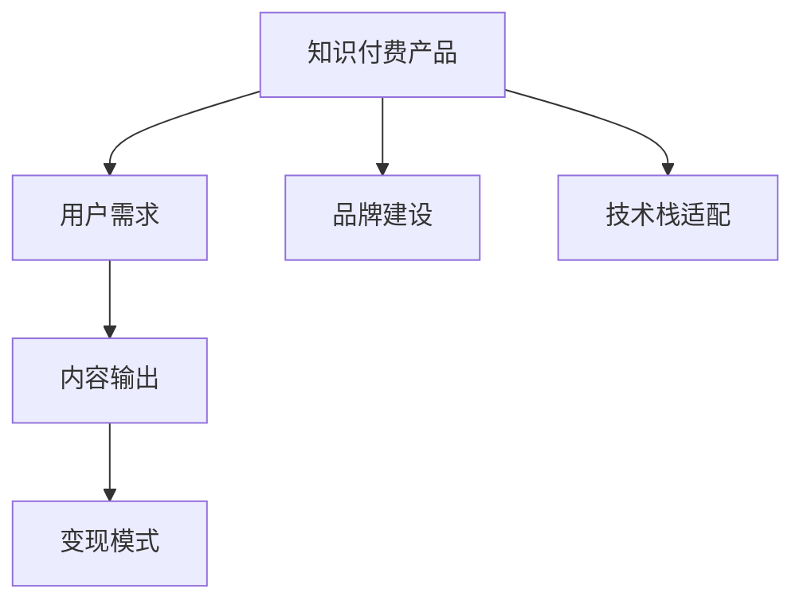

                 

# 如何打造高认可度的程序员知识付费产品

在数字化时代，程序员知识付费产品逐渐成为行业新趋势，旨在为开发者提供高价值的编程知识，助力其在职业生涯中不断精进和突破。本文将深入探讨如何打造高认可度的程序员知识付费产品，从核心概念、算法原理、项目实践、应用场景、工具资源等多个维度全面分析，以期为创作者和用户提供系统的指导。

## 1. 背景介绍

### 1.1 问题由来

随着互联网技术的快速发展，软件开发人员需要不断学习和更新知识，以适应技术栈的不断演变和业务需求的快速变化。传统的一对多、一对一的培训方式已不能满足开发者多样化的学习需求，于是知识付费产品应运而生。其通过专业、高效、互动性强的方式，为开发者提供定制化、系统化的编程教育，极大提高了学习效率和效果。

当前，程序员知识付费市场正处于爆发式增长阶段，各类在线课程、技术博客、付费社区等产品层出不穷。但很多产品在内容质量、用户体验、变现模式等方面仍存在诸多问题，导致市场认可度不高，用户粘性不足。如何打造高认可度的程序员知识付费产品，成为所有创作者关注的焦点。

### 1.2 问题核心关键点

打造高认可度的程序员知识付费产品，主要需要解决以下核心问题：
- **内容质量**：优质、系统、更新频率高的内容是用户选择付费产品的首要条件。
- **用户交互**：高效的互动形式和及时的反馈机制，提升用户体验。
- **变现模式**：合理的收入分配机制，激励创作者持续产出优质内容。
- **品牌建设**：强大的品牌影响力，为产品带来信任感和传播效应。
- **技术栈适配**：产品需适配各种技术栈和应用场景，满足不同层次用户需求。

## 2. 核心概念与联系

### 2.1 核心概念概述

为更好地理解如何打造高认可度的程序员知识付费产品，本节将介绍几个密切相关的核心概念：

- **知识付费产品**：通过提供有价值、专业化的知识和技能培训，向用户收取费用的平台或服务。
- **用户需求**：用户在职业发展、技能提升等方面的需求，包括学习目标、时间安排、互动偏好等。
- **内容输出**：包括文字、视频、直播、课程等形式，承载核心知识，需符合质量高、更新频繁的要求。
- **变现模式**：包括广告、会员、课程销售、企业定制等，需兼顾用户体验和运营可持续性。
- **品牌建设**：通过用户口碑、社交媒体营销、内容质量等手段，提高产品知名度和信任度。
- **技术栈适配**：产品需支持主流编程语言和开发框架，提供一站式的学习和培训服务。

这些核心概念之间的逻辑关系可以通过以下Mermaid流程图来展示：



这个流程图展示了知识付费产品的核心概念及其之间的关系：
- 知识付费产品以满足用户需求为核心，提供内容输出作为主要手段。
- 内容输出的质量、更新频率和变现模式直接影响用户体验和品牌建设。
- 技术栈适配需支持主流编程语言和开发框架，确保产品的广泛适用性。

## 3. 核心算法原理 & 具体操作步骤

### 3.1 算法原理概述

知识付费产品的核心算法主要集中在以下几个方面：
- **内容推荐算法**：根据用户行为数据和兴趣模型，推荐相关课程和文章。
- **用户画像构建**：通过用户行为数据分析，构建精准的用户画像，指导内容输出和互动形式设计。
- **互动效果评估**：通过用户反馈和行为数据分析，评估互动效果，优化产品体验。

### 3.2 算法步骤详解

#### 3.2.1 内容推荐算法
1. **用户行为收集**：收集用户在平台上的行为数据，如点击、浏览、学习时长、评论等。
2. **特征工程**：提取行为特征，如浏览深度、学习频率、互动频率等，作为推荐模型的输入。
3. **模型训练**：选择合适的推荐算法（如协同过滤、基于内容的推荐、混合推荐等），训练推荐模型。
4. **推荐结果输出**：根据新用户的兴趣模型和历史行为数据，输出个性化推荐内容。

#### 3.2.2 用户画像构建
1. **行为数据采集**：收集用户在平台上的学习行为数据，包括课程选择、学习时间、互动情况等。
2. **特征提取**：提取用户的静态特征（如学历、职业）和动态特征（如学习进度、互动行为）。
3. **用户建模**：使用机器学习算法（如K-Means、DBSCAN等）对用户进行聚类，构建用户画像。
4. **画像更新**：根据用户新的行为数据和反馈，不断更新用户画像，确保其时效性和准确性。

#### 3.2.3 互动效果评估
1. **用户反馈收集**：通过调查问卷、评价系统、反馈机制等途径，收集用户对互动形式的满意度。
2. **行为数据分析**：分析用户在平台上的行为数据，识别出互动效果好的环节和不足之处。
3. **模型调优**：根据用户反馈和行为数据分析结果，调整互动形式和内容输出，优化用户体验。
4. **效果评估指标**：设定评估指标（如用户留存率、互动频次、满意度等），定期评估互动效果。

### 3.3 算法优缺点

知识付费产品的算法设计，具有以下优点：
1. **精准推荐**：通过个性化的推荐算法，提高用户满意度和学习效率。
2. **用户画像精细**：精细化的用户画像构建，指导内容输出和互动设计，提升用户体验。
3. **效果持续优化**：通过持续的数据分析和模型调优，不断提升互动效果和用户体验。

同时，也存在以下局限性：
1. **数据隐私问题**：用户行为数据的收集和分析可能涉及隐私问题，需要严格遵守数据保护法规。
2. **算法复杂度高**：推荐算法和用户画像构建涉及复杂的机器学习模型和算法，对技术要求高。
3. **动态变化大**：用户需求和行为数据的变化较大，需不断调整和优化算法模型。
4. **投入成本高**：数据收集、模型训练和优化等环节需要较高的技术投入和计算资源。

### 3.4 算法应用领域

知识付费产品的算法不仅在平台推荐、用户画像构建、互动效果评估方面有广泛应用，也在以下几个领域得到体现：

- **在线课程推荐**：通过个性化推荐算法，为学习者推荐适合的课程内容。
- **学习路径规划**：根据用户画像和学习行为，推荐科学的学习路径，帮助学习者更好地掌握知识。
- **互动形式设计**：通过用户画像和互动效果评估，设计高效的互动形式，如在线讨论、即时问答、小组学习等。
- **社群管理**：利用用户画像和互动效果评估，优化社群结构和管理机制，提升社群活跃度和用户粘性。
- **内容生成**：通过用户画像和内容推荐算法，指导创作者输出更有针对性的内容，满足用户需求。

## 4. 数学模型和公式 & 详细讲解 & 举例说明

### 4.1 数学模型构建

本节将使用数学语言对知识付费产品的推荐算法和用户画像构建方法进行更加严格的刻画。

设知识付费平台的用户数量为 $U$，课程数量为 $C$，用户行为数据矩阵为 $D \in \mathbb{R}^{U \times N}$，其中 $N$ 为用户行为特征数量。设推荐算法输出为用户 $u$ 推荐课程 $c$ 的评分 $r_{uc}$，推荐系统整体的评分矩阵为 $R \in \mathbb{R}^{U \times C}$，用户对课程的真实评分矩阵为 $G \in \mathbb{R}^{U \times C}$。

定义推荐算法输出的评分与真实评分的均方误差损失函数为：

$$
L(R, G) = \frac{1}{U \times C} \sum_{u=1}^U \sum_{c=1}^C (r_{uc} - g_{uc})^2
$$

其中 $g_{uc}$ 为用户 $u$ 对课程 $c$ 的真实评分。

### 4.2 公式推导过程

根据上述定义，推荐算法输出的评分 $r_{uc}$ 可通过以下公式计算：

$$
r_{uc} = \alpha \cdot r_{uc}^{(1)} + \beta \cdot r_{uc}^{(2)}
$$

其中 $\alpha$ 和 $\beta$ 为权重系数，$r_{uc}^{(1)}$ 和 $r_{uc}^{(2)}$ 为不同的推荐算法（如协同过滤、内容推荐）的评分输出。

推荐算法整体的损失函数 $L(R, G)$ 可进一步展开为：

$$
L(R, G) = \frac{1}{U \times C} \sum_{u=1}^U \sum_{c=1}^C (\alpha \cdot r_{uc}^{(1)} + \beta \cdot r_{uc}^{(2)} - g_{uc})^2
$$

对 $\alpha$ 和 $\beta$ 进行优化，可得到最优的推荐算法权重系数。此时，推荐算法输出的评分 $r_{uc}$ 可以表示为：

$$
r_{uc} = \mathop{\arg\min}_{\alpha, \beta} L(R, G)
$$

根据上述公式，通过梯度下降等优化算法，可不断更新 $\alpha$ 和 $\beta$，使得推荐算法输出的评分与真实评分的均方误差最小化。

### 4.3 案例分析与讲解

以协同过滤算法为例，其在知识付费产品推荐中的应用步骤如下：

1. **用户行为数据采集**：收集用户在平台上的点击、浏览、学习时长等行为数据，构建用户行为矩阵 $D$。
2. **用户画像构建**：使用聚类算法（如K-Means）对用户进行聚类，生成用户画像 $P$。
3. **协同过滤评分计算**：根据用户画像和行为矩阵，计算用户 $u$ 对课程 $c$ 的协同过滤评分 $r_{uc}^{(1)}$。
4. **模型参数优化**：使用梯度下降等优化算法，调整协同过滤算法的参数，使其评分输出 $r_{uc}^{(1)}$ 最小化均方误差损失 $L(R, G)$。
5. **推荐结果输出**：根据优化后的参数，计算用户 $u$ 对所有课程 $C$ 的评分，选取评分最高的前 $K$ 个课程进行推荐。

## 5. 项目实践：代码实例和详细解释说明

### 5.1 开发环境搭建

在进行知识付费产品开发前，我们需要准备好开发环境。以下是使用Python进行Django开发的环境配置流程：

1. 安装Anaconda：从官网下载并安装Anaconda，用于创建独立的Python环境。

2. 创建并激活虚拟环境：
```bash
conda create -n django-env python=3.8 
conda activate django-env
```

3. 安装Django：
```bash
pip install django
```

4. 安装各类工具包：
```bash
pip install numpy pandas scikit-learn matplotlib tqdm jupyter notebook ipython
```

完成上述步骤后，即可在`django-env`环境中开始项目实践。

### 5.2 源代码详细实现

下面我们以在线课程推荐系统为例，给出使用Django框架和Scikit-learn库进行课程推荐系统的PyTorch代码实现。

首先，定义课程推荐模型：

```python
from django.contrib.auth.models import User
from sklearn.neighbors import NearestNeighbors
from django.db import models

class Course(models.Model):
    name = models.CharField(max_length=255)
    description = models.TextField()
    tags = models.TextField()

class User(models.Model):
    username = models.CharField(max_length=255)
    email = models.EmailField(unique=True)

def nearest_neighbors_recommender(user, n_neighbors=5):
    user_ids = User.objects.values_list('id', flat=True)
    user_data = Course.objects.filter(tags=user.tags).values('id', 'name', 'description')
    
    user_vector = [row['id'] for row in user_data]
    course_vectors = [row['id'] for row in user_data]
    
    neighbors_model = NearestNeighbors(n_neighbors=n_neighbors)
    neighbors_model.fit(course_vectors)
    neighbors = neighbors_model.kneighbors([user_vector])[0]
    
    recommendations = []
    for neighbor_id in neighbors:
        recommendations.append(Course.objects.filter(id=neighbor_id).values_list('name', flat=True)[0])
    
    return recommendations
```

然后，定义视图函数和模板：

```python
from django.shortcuts import render, redirect
from django.contrib.auth.decorators import login_required
from .models import User, Course

@login_required
def home(request):
    user = User.objects.get(username=request.user.username)
    courses = Course.objects.all()
    recommendations = nearest_neighbors_recommender(user)
    
    return render(request, 'home.html', {'user': user, 'courses': courses, 'recommendations': recommendations})

@login_required
def add_course(request):
    if request.method == 'POST':
        course_name = request.POST['course_name']
        course_description = request.POST['course_description']
        course_tags = request.POST['course_tags']
        
        Course.objects.create(name=course_name, description=course_description, tags=course_tags)
        return redirect('home')
    else:
        return render(request, 'add_course.html')
```

最后，启动Django服务器并在浏览器中访问：

```bash
python manage.py runserver
```

在`home.html`模板中添加以下内容：

```html
<h1>Welcome {{ user.username }}</h1>
<h2>Your Recommendations</h2>
<ul>
    
        <li>{{ course }} - {{ course_description }}</li>
    
</ul>
```

以上代码实现了Django在线课程推荐系统，可以基于用户标签推荐相关课程。在实际应用中，可以根据用户行为数据和推荐算法设计更复杂的推荐模型。

### 5.3 代码解读与分析

让我们再详细解读一下关键代码的实现细节：

**User和Course模型**：
- `User` 模型定义了用户的属性（用户名、邮箱）。
- `Course` 模型定义了课程的属性（名称、描述、标签）。

**nearest_neighbors_recommender函数**：
- 该函数根据用户标签和课程标签，计算相似度最高的 $n$ 个课程进行推荐。
- 使用了Scikit-learn的NearestNeighbors算法，计算用户和课程的向量相似度。

**视图函数**：
- `home` 函数获取当前用户，并调用 `nearest_neighbors_recommender` 函数获取推荐课程列表。
- `add_course` 函数允许用户新增课程。

**模板**：
- 在`home.html`模板中，将推荐课程渲染成列表形式。

可以看到，基于Django和Scikit-learn的推荐系统代码实现相对简洁高效。开发者可以将更多精力放在数据处理、模型改进等高层逻辑上，而不必过多关注底层的实现细节。

当然，工业级的系统实现还需考虑更多因素，如模型的保存和部署、超参数的自动搜索、更灵活的任务适配层等。但核心的推荐范式基本与此类似。

## 6. 实际应用场景

### 6.1 企业内部培训

企业内部培训是知识付费产品的重要应用场景之一。传统培训方式难以满足个性化、灵活化的学习需求，而知识付费产品可以针对不同岗位、不同阶段的设计员工提供定制化的课程和资料，提升企业培训效果。

在技术实现上，企业可以根据自己的培训需求，定制化课程内容，引入知识付费平台进行学习管理和知识传播。通过用户画像和推荐算法，可以精准推送企业内部常用的技术培训课程，帮助员工快速掌握必备技能。

### 6.2 在线教育平台

在线教育平台如Coursera、Udemy等，是知识付费产品的典型代表。通过构建丰富的课程体系，满足不同层次用户的学习需求，这些平台已成为全球范围内学习者获取知识和技能的重要渠道。

在在线教育平台中，知识付费产品需要设计多样化的互动形式，如视频讲解、在线讨论、实时问答等，以提高用户的学习效果和满意度。同时，平台还需要通过精准的推荐算法，提供个性化的课程推荐，提升用户的粘性和学习效率。

### 6.3 企业知识分享

企业内部往往存在大量的技术分享需求，但传统的分享形式难以满足不同场景的需求。通过知识付费平台，企业可以将专家讲座、技术分享、内部项目经验等知识资源进行线上化，方便员工随时查阅和学习。

在知识付费产品中，企业可以根据自己的需求定制内容形式，如文章、视频、PPT等，并通过推荐算法和用户画像，推荐企业内部的精品资源。同时，通过平台的激励机制，鼓励专家和员工积极分享知识，形成知识共享的良性循环。

### 6.4 未来应用展望

随着知识付费产品的不断发展和创新，未来在多个领域将有更广阔的应用前景：

- **教育领域的泛化**：知识付费产品不仅限于技术培训，可以逐步拓展到文化、艺术、科学等更多领域，满足不同领域的学习需求。
- **企业培训的数字化**：越来越多的企业将引入知识付费平台进行员工培训，提升企业的数字化水平和知识传播效率。
- **学术领域的知识传播**：高校和科研机构可以利用知识付费平台传播研究成果，扩大知识传播的广度和深度。
- **职业技能的提升**：在线平台提供的课程和资源，可以帮助用户提升职业技能，促进职业发展，提高社会整体的竞争力。
- **个性化学习**：基于推荐算法和用户画像，知识付费产品可以提供个性化的学习路径和资源推荐，满足用户多元化的学习需求。

## 7. 工具和资源推荐

### 7.1 学习资源推荐

为了帮助开发者系统掌握知识付费产品的开发技术，这里推荐一些优质的学习资源：

1. **《Python网络爬虫技术与实战》**：详细讲解了Django、Flask等框架的使用，以及如何采集和分析用户数据。
2. **《Scikit-learn机器学习实战》**：系统介绍了Scikit-learn库的各种机器学习算法，适合初学者和进阶开发者。
3. **《深度学习与Python实践》**：讲解了TensorFlow、PyTorch等深度学习框架的实际应用，涵盖多种推荐算法。
4. **Coursera《数据科学专项课程》**：由斯坦福大学教授主讲，系统讲解了数据科学的知识体系，包括数据处理、推荐系统等。
5. **Kaggle竞赛平台**：提供了丰富的数据集和竞赛机会，锻炼数据分析和算法设计能力。

通过对这些资源的学习实践，相信你一定能够快速掌握知识付费产品的开发技术和优化方法，为更多用户提供高质量的服务。

### 7.2 开发工具推荐

高效的开发离不开优秀的工具支持。以下是几款用于知识付费产品开发的常用工具：

1. **Django**：Python的高性能Web框架，适用于快速开发高交互的Web应用。
2. **Flask**：轻量级的Web框架，适合构建微服务和高并发应用。
3. **PyTorch**：灵活的深度学习框架，适合研究性和工程性项目。
4. **TensorFlow**：由Google开发的深度学习框架，适用于大规模分布式训练和推理。
5. **Scikit-learn**：Python的机器学习库，提供了丰富的算法实现和性能分析工具。
6. **Jupyter Notebook**：交互式开发环境，适合快速迭代实验和开发原型。

合理利用这些工具，可以显著提升知识付费产品的开发效率，加快创新迭代的步伐。

### 7.3 相关论文推荐

知识付费产品的相关研究已经吸引了众多学者的关注，以下是几篇奠基性的相关论文，推荐阅读：

1. **《在线推荐系统: 体系架构、算法与应用》**：详细介绍了在线推荐系统的架构、算法和应用，适合初学者和工程开发者。
2. **《基于协同过滤的推荐系统研究进展》**：综述了协同过滤算法的多种实现形式，并比较了其优缺点。
3. **《个性化推荐系统研究综述》**：介绍了多种推荐算法，包括基于内容的推荐、协同过滤、混合推荐等，并讨论了未来的研究方向。
4. **《用户画像构建技术综述》**：综述了用户画像构建的多种方法和技术，包括数据采集、特征工程、聚类算法等。
5. **《推荐系统中的交互效果评估方法》**：介绍了推荐系统中用户互动效果的评估方法和指标，包括用户满意度、留存率等。

这些论文代表了大数据和知识推荐技术的发展脉络。通过学习这些前沿成果，可以帮助研究者把握学科前进方向，激发更多的创新灵感。

## 8. 总结：未来发展趋势与挑战

### 8.1 总结

本文对如何打造高认可度的程序员知识付费产品进行了全面系统的介绍。首先阐述了知识付费产品的背景和核心问题，明确了产品打造的关键要素，包括内容质量、用户交互、变现模式、品牌建设和技术栈适配。其次，从推荐算法、用户画像构建、互动效果评估等多个维度详细讲解了核心技术原理和具体操作步骤，并通过实际代码实例进行了展示。

通过本文的系统梳理，可以看到，知识付费产品在技术上已经具备了强大的基础，但要真正打造高认可度产品，还需要在内容输出、用户体验、变现模式等多个方面进行深入优化。唯有在技术、内容、商业、品牌等多个维度协同发力，才能构建出真正满足用户需求的知识付费产品。

### 8.2 未来发展趋势

展望未来，知识付费产品将呈现以下几个发展趋势：

1. **内容多样化**：知识付费产品的内容将从技术培训逐步拓展到更多领域，满足用户多元化的学习需求。
2. **推荐算法优化**：推荐算法将结合深度学习、强化学习等前沿技术，实现更精准、更高效的内容推荐。
3. **互动形式创新**：通过引入视频、直播、问答等互动形式，提高用户的学习效果和体验。
4. **个性化推荐**：通过用户画像和推荐算法，提供个性化的学习路径和资源推荐，提升用户粘性和满意度。
5. **社交化学习**：利用社交网络、知识社区等形式，提升知识传播效率和用户互动效果。
6. **开源社区兴起**：越来越多的知识付费产品将采用开源模式，吸引开发者参与和贡献，共同推动技术进步。

以上趋势凸显了知识付费产品的广阔前景，这些方向的探索发展，必将进一步提升用户的学习效果和体验，推动知识传播和应用的多样化。

### 8.3 面临的挑战

尽管知识付费产品已经取得了显著的进展，但在迈向更加智能化、普适化应用的过程中，仍面临诸多挑战：

1. **数据隐私问题**：用户行为数据的收集和分析可能涉及隐私问题，需要严格遵守数据保护法规。
2. **算法复杂度高**：推荐算法和用户画像构建涉及复杂的机器学习模型和算法，对技术要求高。
3. **动态变化大**：用户需求和行为数据的变化较大，需不断调整和优化算法模型。
4. **投入成本高**：数据收集、模型训练和优化等环节需要较高的技术投入和计算资源。
5. **用户体验优化**：如何设计高效的互动形式和及时反馈机制，提升用户体验，是知识付费产品的重要挑战。

正视知识付费产品面临的这些挑战，积极应对并寻求突破，将使其在构建人机协同的智能时代中扮演越来越重要的角色。相信随着学界和产业界的共同努力，这些挑战终将一一被克服，知识付费产品必将在构建安全、可靠、可解释、可控的智能系统铺平道路。

### 8.4 研究展望

面对知识付费产品所面临的诸多挑战，未来的研究需要在以下几个方面寻求新的突破：

1. **隐私保护**：引入差分隐私、联邦学习等技术，保障用户数据隐私。
2. **轻量级算法**：开发更高效、低计算资源消耗的推荐算法和用户画像构建方法。
3. **动态调整**：结合时序分析和强化学习，实时调整推荐算法和用户画像，适应用户需求的变化。
4. **自动化优化**：通过自动化调参、超参数搜索等技术，优化模型和算法性能。
5. **多模态融合**：结合文本、图像、视频等多种数据形式，提供更全面的推荐服务。
6. **个性化推荐**：进一步提升推荐算法个性化程度，根据用户行为数据和反馈实时调整推荐结果。

这些研究方向的探索，必将引领知识付费产品技术迈向更高的台阶，为开发者和用户带来更优质的体验和服务。

## 9. 附录：常见问题与解答

**Q1：知识付费产品如何平衡内容质量与成本？**

A: 知识付费产品的核心竞争力在于内容质量，但内容产出需要较高的成本和资源投入。为平衡内容质量与成本，可以采取以下措施：
- **内容众包**：引入专家、志愿者等众包方式，降低内容产出成本，同时提高内容多样性和专业性。
- **内容审核**：引入专业审核团队，确保内容的准确性和权威性。
- **自动化生成**：利用AI技术自动生成部分内容，如自动摘要、内容推荐等，降低人工成本。
- **内容分层**：将内容按照专业程度、更新频率等进行分级，降低低质量内容对用户体验的影响。

**Q2：知识付费产品如何获取高质量用户数据？**

A: 高质量用户数据的获取是知识付费产品成功的关键。为获取高质量用户数据，可以采取以下措施：
- **用户注册**：强制用户注册并填写基本信息，以便于数据分析和推荐。
- **行为记录**：记录用户在平台上的学习行为、互动情况等，生成详细的用户画像。
- **反馈机制**：引入用户反馈机制，了解用户需求和满意度，及时调整和优化产品。
- **数据治理**：建立严格的数据治理和保护机制，确保数据安全和隐私。

**Q3：知识付费产品如何激励创作者持续输出优质内容？**

A: 激励机制是知识付费产品可持续运营的关键。为激励创作者持续输出优质内容，可以采取以下措施：
- **分成模式**：采用内容销售分成模式，根据用户购买情况，给予创作者一定比例的分成。
- **会员体系**：通过会员制度，提供更多优惠和特权，激励创作者输出优质内容。
- **用户评价**：通过用户评价系统，提高创作者内容曝光和影响力，激励创作者持续改进。
- **品牌影响力**：建立强大的品牌影响力，吸引更多优质创作者加入平台。

**Q4：知识付费产品如何设计高效的推荐算法？**

A: 推荐算法是知识付费产品的核心技术之一。为设计高效的推荐算法，可以采取以下措施：
- **多算法结合**：结合协同过滤、内容推荐、混合推荐等多种算法，提升推荐效果。
- **深度学习应用**：引入深度学习模型，提高推荐算法的准确性和个性化程度。
- **实时更新**：结合用户实时行为数据，不断更新推荐模型，提升推荐效果。
- **模型评估**：设定评估指标（如用户留存率、互动频次、满意度等），定期评估推荐效果，优化推荐算法。

**Q5：知识付费产品如何构建用户画像？**

A: 用户画像构建是知识付费产品的重要环节，可以通过以下步骤构建精准的用户画像：
- **行为数据采集**：收集用户在平台上的学习行为、互动情况等数据。
- **特征工程**：提取用户行为特征，如学习时间、互动频次、兴趣点等。
- **聚类算法**：使用聚类算法（如K-Means、DBSCAN等）对用户进行聚类，生成用户画像。
- **画像更新**：根据用户实时行为数据和反馈，不断更新用户画像，保持其时效性和准确性。

这些措施可以帮助知识付费产品构建精准的用户画像，提高推荐效果和用户体验。

