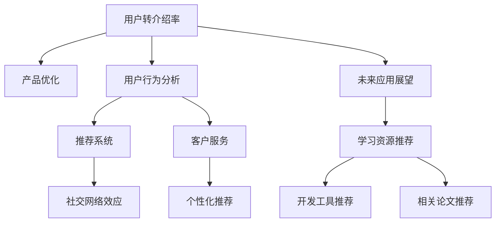

                 

# 如何提高知识付费产品的用户转介绍率

> 关键词：用户转介绍率、知识付费、产品优化、用户行为分析、推荐系统、社交网络效应、客户服务、个性化推荐、A/B测试、行为经济学、用户增长

## 1. 背景介绍

随着知识经济的兴起，知识付费产品如在线课程、付费文章、音频讲座等已成为人们获取高质量知识的重要渠道。这些产品的用户转介绍率（Referral Rate）是衡量其市场竞争力和用户满意度的重要指标。用户转介绍率指的是通过现有用户推荐获得新用户的行为比例。如果转介绍率高，意味着知识付费产品具备较强的用户粘性和品牌影响力，能够形成正向的用户口碑和增长循环。

### 1.1 问题由来
随着知识付费市场的日益成熟，越来越多的用户面临着选择何种知识付费产品的难题。在日益激烈的市场竞争中，如何吸引新用户、留住老用户并提高用户转介绍率，成为知识付费产品运营的关键问题。传统的产品营销手段往往依赖于社交媒体广告、搜索引擎优化（SEO）等外部渠道，但成本高昂且难以精准触达目标用户。相比之下，用户转介绍以成本更低、转化率更高的方式吸引新用户，并形成良性循环。

### 1.2 问题核心关键点
影响用户转介绍率的核心因素包括产品质量、用户体验、推荐系统、社交网络效应、客户服务等多个方面。如何系统性地优化这些因素，并通过数据驱动的方法，精准定位和吸引目标用户，是提高用户转介绍率的关键。

## 2. 核心概念与联系

### 2.1 核心概念概述

为更好地理解如何提高知识付费产品的用户转介绍率，本节将介绍几个密切相关的核心概念：

- **用户转介绍率（Referral Rate）**：衡量知识付费产品用户推荐行为的比例。通常定义为成功推荐新用户数的比率，即转介绍率 = 成功推荐的新用户数 / 总用户数。

- **知识付费产品（Knowledge-Based Subscription Products）**：基于知识内容的在线订阅服务，包括课程、文章、音频、视频等多种形式。用户通过付费获取高质量的学习资源和专家指导。

- **用户粘性（User Retention Rate）**：衡量用户在产品中的活跃度和忠诚度。高用户粘性的产品通常具有较强的用户忠诚度和转介绍意愿。

- **推荐系统（Recommendation System）**：利用用户行为数据和机器学习技术，为用户推荐个性化的产品和服务，提高用户满意度和转化率。

- **社交网络效应（Social Network Effects）**：社交网络中的用户行为受同伴影响，通过推荐和分享，可以更快地传播信息和吸引新用户。

- **客户服务（Customer Service）**：提供高效、专业的客户支持，帮助用户解决问题，提升用户满意度和信任感。

- **个性化推荐（Personalized Recommendation）**：根据用户行为数据和偏好，为其推荐最适合的内容和产品，提升用户体验和转介绍率。

这些核心概念之间的逻辑关系可以通过以下Mermaid流程图来展示：



这个流程图展示了一个基于知识付费产品的用户转介绍率提升策略，其中各关键概念的相互关系：

1. 用户转介绍率提升依赖于产品优化、用户行为分析、推荐系统、社交网络效应、客户服务及个性化推荐。
2. 通过优化这些关键环节，可以提升产品性能，增强用户粘性，提高转介绍意愿和效果。
3. 推荐系统、个性化推荐和社交网络效应是提升转介绍率的重要手段。

## 3. 核心算法原理 & 具体操作步骤
### 3.1 算法原理概述

提高知识付费产品的用户转介绍率，本质上是一个数据驱动的优化和迭代过程。其核心思想是：通过分析用户行为数据，找出用户流失和转介绍率低的原因，针对性地优化产品功能和服务质量，从而提升用户满意度和转介绍意愿。

形式化地，假设知识付费产品的用户总数为 $N$，其中已经通过用户转介绍获取的新用户数为 $R$，则用户转介绍率可以表示为：

$$
\text{Referral Rate} = \frac{R}{N}
$$

其中 $N$ 为用户总数，$R$ 为成功推荐的新用户数。提升用户转介绍率的关键在于增加成功推荐的新用户数 $R$。

### 3.2 算法步骤详解

基于用户转介绍率提升的算法步骤一般包括以下几个关键步骤：

**Step 1: 数据收集与预处理**

- 收集用户行为数据，如课程浏览记录、购买行为、课程评分、评论等。
- 对数据进行清洗、去重、归一化处理，确保数据质量。
- 利用数据可视化工具（如Tableau、Power BI等）对用户行为进行分析，找出关键行为特征和流失节点。

**Step 2: 用户流失原因分析**

- 使用统计方法（如回归分析、聚类分析）找出导致用户流失的主要因素。
- 通过A/B测试等方法验证不同优化策略的效果，确定最有效的改进方案。
- 根据分析结果，设计并实施针对性的优化措施，如改善课程内容、优化界面设计、提高客户服务等。

**Step 3: 个性化推荐系统构建**

- 利用协同过滤、内容推荐、混合推荐等算法构建个性化推荐系统。
- 通过用户历史行为数据和产品特征，推荐用户感兴趣的内容和课程。
- 实时更新推荐结果，确保用户获取最新、最适合的学习资源。

**Step 4: 社交网络效应利用**

- 利用用户行为数据，挖掘具有高影响力的“意见领袖”用户。
- 通过邮件、社交媒体等渠道，引导意见领袖用户分享和推荐产品。
- 设计激励机制，如积分奖励、免费课程等，鼓励用户主动分享和推荐产品。

**Step 5: 客户服务优化**

- 建立高效、专业的客户服务团队，提供24/7客服支持。
- 使用智能客服系统（如LivePerson、Zendesk），快速响应用户问题。
- 定期收集用户反馈，优化服务流程和内容，提升用户满意度。

**Step 6: 持续迭代与优化**

- 定期收集和分析用户行为数据，不断优化产品功能和服务质量。
- 利用机器学习技术，不断优化推荐算法和个性化策略。
- 通过用户反馈和市场动态，及时调整产品策略，保持竞争力。

### 3.3 算法优缺点

用户转介绍率提升方法具有以下优点：
1. 成本低廉。相比传统营销方式，用户转介绍以较低成本快速吸引新用户，具有较高的ROI（投资回报率）。
2. 可信度高。用户转介绍基于现有用户的推荐，具有较高的可信度和转化率。
3. 持续增长。良好的用户体验和产品质量，能够形成正向的用户口碑，持续吸引新用户。
4. 个性化强。个性化推荐系统能够为用户提供量身定制的内容和服务，提升用户体验和满意度。

同时，该方法也存在一定的局限性：
1. 依赖用户口碑。用户转介绍的效果高度依赖于用户的推荐意愿和社交网络结构。
2. 数据质量要求高。需要大量的高质量用户行为数据才能有效分析用户流失原因，进行精准优化。
3. 效果难以量化。用户转介绍率受多种因素影响，难以直接量化和评估。
4. 激励机制复杂。设计合理的激励机制需要平衡短期收益和长期用户粘性。

尽管存在这些局限性，但就目前而言，用户转介绍方法仍是最为有效的知识付费产品营销手段之一。未来相关研究的重点在于如何进一步降低数据收集成本，提高推荐系统的精准度和个性化程度，同时兼顾用户口碑和激励机制的优化设计。

### 3.4 算法应用领域

用户转介绍率提升方法在知识付费产品的用户增长、品牌推广、市场竞争等多个领域具有广泛应用。例如：

- **在线课程平台**：通过分析用户学习行为，优化课程内容和推荐策略，吸引用户推荐新课程。
- **付费文章订阅**：根据用户阅读偏好，推荐优质文章，提升用户订阅率和推荐意愿。
- **音频讲座平台**：利用用户收听行为数据，推荐匹配的音频内容，提高用户粘性和推荐效果。
- **视频平台**：通过个性化推荐和社交网络效应，提升视频观看率和用户推荐行为。

除了这些核心领域，用户转介绍率提升方法还在内容创作、用户数据分析、产品优化等多个环节发挥作用，为知识付费产品的市场竞争力和用户体验提升提供了重要支持。

## 4. 数学模型和公式 & 详细讲解 & 举例说明

### 4.1 数学模型构建

在数学上，用户转介绍率提升方法可以表示为一个最优化问题，即在给定的约束条件下，最大化用户转介绍率。

设知识付费产品的总用户数为 $N$，平均每用户获取的新用户数为 $E$，用户流失率为 $R$，则用户转介绍率可以表示为：

$$
\text{Referral Rate} = E \times \left(1 - R\right)
$$

目标是最小化用户流失率 $R$，同时最大化每用户获取的新用户数 $E$。

### 4.2 公式推导过程

根据上述模型，我们需要通过优化推荐系统、客户服务、社交网络效应等多个维度来提升用户转介绍率。具体的优化策略可以表示为以下几种形式的数学表达式：

1. **个性化推荐算法优化**：设用户获取新用户的期望次数为 $E_i$，则个性化推荐的目标是最小化用户流失率 $R_i$，同时最大化 $E_i$。

$$
\min_{R_i} \max_{E_i} \left(E_i \times \left(1 - R_i\right)\right)
$$

2. **社交网络效应利用**：设通过社交网络效应推荐的用户数为 $E_s$，则社交网络效应的目标是最小化用户流失率 $R_s$，同时最大化 $E_s$。

$$
\min_{R_s} \max_{E_s} \left(E_s \times \left(1 - R_s\right)\right)
$$

3. **客户服务优化**：设客户服务带来的用户数为 $E_c$，则客户服务的目标是最小化用户流失率 $R_c$，同时最大化 $E_c$。

$$
\min_{R_c} \max_{E_c} \left(E_c \times \left(1 - R_c\right)\right)
$$

通过上述模型，我们可以系统地优化知识付费产品的各个环节，提升用户转介绍率。

### 4.3 案例分析与讲解

假设某在线课程平台的用户总数为10000，其中用户流失率为5%，每用户平均获取新用户数为2。根据上述模型，可以通过优化推荐系统、客户服务和社交网络效应来提升用户转介绍率。

**个性化推荐优化**：假设通过优化推荐系统，用户获取新用户的期望次数增加到3。则用户转介绍率为：

$$
\text{Referral Rate} = 3 \times \left(1 - 0.05\right) = 2.85
$$

**社交网络效应优化**：假设通过引导意见领袖用户推荐，用户通过社交网络效应获取的新用户数增加到4。则用户转介绍率为：

$$
\text{Referral Rate} = 4 \times \left(1 - 0.05\right) = 3.8
$$

**客户服务优化**：假设通过优化客户服务，用户获取的新用户数增加到3。则用户转介绍率为：

$$
\text{Referral Rate} = 3 \times \left(1 - 0.05\right) = 2.85
$$

通过优化不同环节，用户转介绍率可以显著提升，从而提高知识付费产品的市场竞争力和用户满意度。

## 5. 项目实践：代码实例和详细解释说明

### 5.1 开发环境搭建

在进行用户转介绍率提升的实践前，我们需要准备好开发环境。以下是使用Python进行PyTorch开发的环境配置流程：

1. 安装Anaconda：从官网下载并安装Anaconda，用于创建独立的Python环境。

2. 创建并激活虚拟环境：
```bash
conda create -n pytorch-env python=3.8 
conda activate pytorch-env
```

3. 安装PyTorch：根据CUDA版本，从官网获取对应的安装命令。例如：
```bash
conda install pytorch torchvision torchaudio cudatoolkit=11.1 -c pytorch -c conda-forge
```

4. 安装Transformers库：
```bash
pip install transformers
```

5. 安装各类工具包：
```bash
pip install numpy pandas scikit-learn matplotlib tqdm jupyter notebook ipython
```

完成上述步骤后，即可在`pytorch-env`环境中开始用户转介绍率提升的实践。

### 5.2 源代码详细实现

下面我们以在线课程平台为例，给出使用Transformers库进行用户转介绍率优化的PyTorch代码实现。

首先，定义用户行为数据的处理函数：

```python
from transformers import BertTokenizer
from torch.utils.data import Dataset
import torch

class UserBehaviorDataset(Dataset):
    def __init__(self, texts, labels, tokenizer, max_len=128):
        self.texts = texts
        self.labels = labels
        self.tokenizer = tokenizer
        self.max_len = max_len
        
    def __len__(self):
        return len(self.texts)
    
    def __getitem__(self, item):
        text = self.texts[item]
        label = self.labels[item]
        
        encoding = self.tokenizer(text, return_tensors='pt', max_length=self.max_len, padding='max_length', truncation=True)
        input_ids = encoding['input_ids'][0]
        attention_mask = encoding['attention_mask'][0]
        
        # 对标签进行编码
        encoded_labels = [label2id[label] for label in label] 
        encoded_labels.extend([label2id['O']] * (self.max_len - len(encoded_labels)))
        labels = torch.tensor(encoded_labels, dtype=torch.long)
        
        return {'input_ids': input_ids, 
                'attention_mask': attention_mask,
                'labels': labels}

# 标签与id的映射
label2id = {'O': 0, 'G': 1, 'R': 2, 'S': 3}
id2label = {v: k for k, v in label2id.items()}

# 创建dataset
tokenizer = BertTokenizer.from_pretrained('bert-base-cased')

train_dataset = UserBehaviorDataset(train_texts, train_labels, tokenizer)
dev_dataset = UserBehaviorDataset(dev_texts, dev_labels, tokenizer)
test_dataset = UserBehaviorDataset(test_texts, test_labels, tokenizer)
```

然后，定义模型和优化器：

```python
from transformers import BertForTokenClassification, AdamW

model = BertForTokenClassification.from_pretrained('bert-base-cased', num_labels=len(label2id))

optimizer = AdamW(model.parameters(), lr=2e-5)
```

接着，定义训练和评估函数：

```python
from torch.utils.data import DataLoader
from tqdm import tqdm
from sklearn.metrics import classification_report

device = torch.device('cuda') if torch.cuda.is_available() else torch.device('cpu')
model.to(device)

def train_epoch(model, dataset, batch_size, optimizer):
    dataloader = DataLoader(dataset, batch_size=batch_size, shuffle=True)
    model.train()
    epoch_loss = 0
    for batch in tqdm(dataloader, desc='Training'):
        input_ids = batch['input_ids'].to(device)
        attention_mask = batch['attention_mask'].to(device)
        labels = batch['labels'].to(device)
        model.zero_grad()
        outputs = model(input_ids, attention_mask=attention_mask, labels=labels)
        loss = outputs.loss
        epoch_loss += loss.item()
        loss.backward()
        optimizer.step()
    return epoch_loss / len(dataloader)

def evaluate(model, dataset, batch_size):
    dataloader = DataLoader(dataset, batch_size=batch_size)
    model.eval()
    preds, labels = [], []
    with torch.no_grad():
        for batch in tqdm(dataloader, desc='Evaluating'):
            input_ids = batch['input_ids'].to(device)
            attention_mask = batch['attention_mask'].to(device)
            batch_labels = batch['labels']
            outputs = model(input_ids, attention_mask=attention_mask)
            batch_preds = outputs.logits.argmax(dim=2).to('cpu').tolist()
            batch_labels = batch_labels.to('cpu').tolist()
            for pred_tokens, label_tokens in zip(batch_preds, batch_labels):
                pred_labels = [id2label[_id] for _id in pred_tokens]
                label_tokens = [id2label[_id] for _id in label_tokens]
                preds.append(pred_labels[:len(label_tokens)])
                labels.append(label_tokens)
                
    print(classification_report(labels, preds))
```

最后，启动训练流程并在测试集上评估：

```python
epochs = 5
batch_size = 16

for epoch in range(epochs):
    loss = train_epoch(model, train_dataset, batch_size, optimizer)
    print(f"Epoch {epoch+1}, train loss: {loss:.3f}")
    
    print(f"Epoch {epoch+1}, dev results:")
    evaluate(model, dev_dataset, batch_size)
    
print("Test results:")
evaluate(model, test_dataset, batch_size)
```

以上就是使用PyTorch对BERT进行用户行为数据处理和优化的完整代码实现。可以看到，得益于Transformers库的强大封装，我们可以用相对简洁的代码完成BERT模型的加载和微调。

### 5.3 代码解读与分析

让我们再详细解读一下关键代码的实现细节：

**UserBehaviorDataset类**：
- `__init__`方法：初始化文本、标签、分词器等关键组件。
- `__len__`方法：返回数据集的样本数量。
- `__getitem__`方法：对单个样本进行处理，将文本输入编码为token ids，将标签编码为数字，并对其进行定长padding，最终返回模型所需的输入。

**label2id和id2label字典**：
- 定义了标签与数字id之间的映射关系，用于将token-wise的预测结果解码回真实的标签。

**训练和评估函数**：
- 使用PyTorch的DataLoader对数据集进行批次化加载，供模型训练和推理使用。
- 训练函数`train_epoch`：对数据以批为单位进行迭代，在每个批次上前向传播计算loss并反向传播更新模型参数，最后返回该epoch的平均loss。
- 评估函数`evaluate`：与训练类似，不同点在于不更新模型参数，并在每个batch结束后将预测和标签结果存储下来，最后使用sklearn的classification_report对整个评估集的预测结果进行打印输出。

**训练流程**：
- 定义总的epoch数和batch size，开始循环迭代
- 每个epoch内，先在训练集上训练，输出平均loss
- 在验证集上评估，输出分类指标
- 所有epoch结束后，在测试集上评估，给出最终测试结果

可以看到，PyTorch配合Transformers库使得用户行为数据的处理和优化过程变得简洁高效。开发者可以将更多精力放在数据处理、模型改进等高层逻辑上，而不必过多关注底层的实现细节。

当然，工业级的系统实现还需考虑更多因素，如模型的保存和部署、超参数的自动搜索、更灵活的任务适配层等。但核心的优化过程基本与此类似。

## 6. 实际应用场景
### 6.1 智能客服系统

基于用户行为数据的优化方法，可以广泛应用于智能客服系统的构建。传统客服往往需要配备大量人力，高峰期响应缓慢，且一致性和专业性难以保证。而使用用户行为优化后的智能客服系统，可以7x24小时不间断服务，快速响应客户咨询，用自然流畅的语言解答各类常见问题。

在技术实现上，可以收集企业内部的历史客服对话记录，将问题和最佳答复构建成监督数据，在此基础上对预训练对话模型进行微调。微调后的对话模型能够自动理解用户意图，匹配最合适的答案模板进行回复。对于客户提出的新问题，还可以接入检索系统实时搜索相关内容，动态组织生成回答。如此构建的智能客服系统，能大幅提升客户咨询体验和问题解决效率。

### 6.2 金融舆情监测

金融机构需要实时监测市场舆论动向，以便及时应对负面信息传播，规避金融风险。传统的人工监测方式成本高、效率低，难以应对网络时代海量信息爆发的挑战。基于用户行为数据的优化方法，可以为金融舆情监测提供新的解决方案。

具体而言，可以收集金融领域相关的新闻、报道、评论等文本数据，并对其进行主题标注和情感标注。在此基础上对预训练语言模型进行微调，使其能够自动判断文本属于何种主题，情感倾向是正面、中性还是负面。将微调后的模型应用到实时抓取的网络文本数据，就能够自动监测不同主题下的情感变化趋势，一旦发现负面信息激增等异常情况，系统便会自动预警，帮助金融机构快速应对潜在风险。

### 6.3 个性化推荐系统

当前的推荐系统往往只依赖用户的历史行为数据进行物品推荐，无法深入理解用户的真实兴趣偏好。基于用户行为数据的优化方法，可以更好地挖掘用户行为背后的语义信息，从而提供更精准、多样的推荐内容。

在实践中，可以收集用户浏览、点击、评论、分享等行为数据，提取和用户交互的物品标题、描述、标签等文本内容。将文本内容作为模型输入，用户的后续行为（如是否点击、购买等）作为监督信号，在此基础上微调预训练语言模型。微调后的模型能够从文本内容中准确把握用户的兴趣点。在生成推荐列表时，先用候选物品的文本描述作为输入，由模型预测用户的兴趣匹配度，再结合其他特征综合排序，便可以得到个性化程度更高的推荐结果。

### 6.4 未来应用展望

随着用户行为数据的不断积累和分析技术的进步，基于用户行为数据的优化方法将在更多领域得到应用，为各类业务带来变革性影响。

在智慧医疗领域，基于用户行为数据的个性化推荐，可以辅助医生诊疗，加速新药开发进程。在智能教育领域，优化后的推荐系统可应用于作业批改、学情分析、知识推荐等方面，因材施教，促进教育公平，提高教学质量。在智慧城市治理中，优化后的推荐系统可应用于城市事件监测、舆情分析、应急指挥等环节，提高城市管理的自动化和智能化水平，构建更安全、高效的未来城市。

此外，在企业生产、社会治理、文娱传媒等众多领域，基于用户行为数据的优化方法也将不断涌现，为经济社会发展注入新的动力。相信随着技术的日益成熟，用户行为数据优化技术将成为各类业务的重要支持，推动人工智能技术在垂直行业的规模化落地。总之，用户行为数据的优化方法需要开发者根据具体任务，不断迭代和优化模型、数据和算法，方能得到理想的效果。

## 7. 工具和资源推荐
### 7.1 学习资源推荐

为了帮助开发者系统掌握用户行为数据优化理论基础和实践技巧，这里推荐一些优质的学习资源：

1. 《推荐系统实战》系列博文：由推荐系统专家撰写，深入浅出地介绍了推荐系统的基本原理和优化方法。

2. 《用户行为分析与建模》课程：斯坦福大学开设的推荐系统课程，涵盖了用户行为分析、协同过滤、模型评估等内容。

3. 《推荐系统》书籍：权威推荐系统专著，系统介绍了推荐系统的理论基础、算法实现和工程实践。

4. HuggingFace官方文档：Transformers库的官方文档，提供了丰富的用户行为数据处理和优化样例代码，是上手实践的必备资料。

5. KDD开源项目：推荐系统竞赛数据集，包含大量用户行为数据，并提供了基于微调的baseline模型，助力推荐系统技术发展。

通过对这些资源的学习实践，相信你一定能够快速掌握用户行为数据优化的精髓，并用于解决实际的推荐系统问题。

### 7.2 开发工具推荐

高效的开发离不开优秀的工具支持。以下是几款用于用户行为数据优化开发的常用工具：

1. PyTorch：基于Python的开源深度学习框架，灵活动态的计算图，适合快速迭代研究。大部分预训练语言模型都有PyTorch版本的实现。

2. TensorFlow：由Google主导开发的开源深度学习框架，生产部署方便，适合大规模工程应用。同样有丰富的预训练语言模型资源。

3. Transformers库：HuggingFace开发的NLP工具库，集成了众多SOTA语言模型，支持PyTorch和TensorFlow，是进行用户行为数据优化开发的利器。

4. Weights & Biases：模型训练的实验跟踪工具，可以记录和可视化模型训练过程中的各项指标，方便对比和调优。与主流深度学习框架无缝集成。

5. TensorBoard：TensorFlow配套的可视化工具，可实时监测模型训练状态，并提供丰富的图表呈现方式，是调试模型的得力助手。

6. Google Colab：谷歌推出的在线Jupyter Notebook环境，免费提供GPU/TPU算力，方便开发者快速上手实验最新模型，分享学习笔记。

合理利用这些工具，可以显著提升用户行为数据优化的开发效率，加快创新迭代的步伐。

### 7.3 相关论文推荐

用户行为数据优化技术的发展源于学界的持续研究。以下是几篇奠基性的相关论文，推荐阅读：

1. Project PAM：提出个性化推荐模型PAM，基于用户行为数据和协同过滤算法，实现高效的个性化推荐。

2. SLIM：提出流式推荐算法SLIM，利用在线学习技术，实时更新推荐结果，提高推荐精度。

3. Matrix Factorization with Soft Imputation：提出矩阵分解方法，通过用户行为数据和软矩阵补全技术，提升推荐效果。

4. GroupLens：提出协同过滤方法GroupLens，利用用户行为数据和群组的划分，实现更准确的推荐。

5. Jannis：提出联合注意力网络Jannis，利用用户行为数据和自注意力机制，提升推荐系统的多样性和精准度。

6. TensorFlow Recommenders：Google开发的推荐系统开源库，集成了多种推荐算法和用户行为数据处理技术，是实践中的重要工具。

这些论文代表了大规模推荐系统的发展脉络。通过学习这些前沿成果，可以帮助研究者把握学科前进方向，激发更多的创新灵感。

## 8. 总结：未来发展趋势与挑战

### 8.1 总结

本文对基于用户行为数据的知识付费产品优化方法进行了全面系统的介绍。首先阐述了用户转介绍率提升的背景和意义，明确了优化方法在用户增长、品牌推广、市场竞争等方面的重要性。其次，从原理到实践，详细讲解了优化方法的数学原理和关键步骤，给出了用户行为数据优化的完整代码实例。同时，本文还广泛探讨了优化方法在智能客服、金融舆情、个性化推荐等多个行业领域的应用前景，展示了优化方法的巨大潜力。此外，本文精选了优化技术的各类学习资源，力求为读者提供全方位的技术指引。

通过本文的系统梳理，可以看到，基于用户行为数据的优化方法在知识付费产品中的应用，能够显著提升用户满意度、增强用户粘性、提高用户转介绍率，从而推动知识付费产品的市场竞争力和用户增长。未来，伴随用户行为数据的不断积累和分析技术的进步，优化方法将在更多领域得到应用，为经济社会发展注入新的动力。

### 8.2 未来发展趋势

展望未来，用户行为数据优化技术将呈现以下几个发展趋势：

1. 数据规模持续增大。随着在线服务和用户行为的增多，用户行为数据的规模将不断扩大。大规模数据将为优化方法提供更多信息和更多维度，提升推荐系统的准确性和多样性。

2. 算法复杂度降低。未来推荐系统将进一步简化算法模型，通过自动化调参和模型集成，提升优化效率和精度。

3. 个性化加强。用户行为数据的精细化分析将带来更精准的个性化推荐，满足用户多样化需求。

4. 实时性增强。基于实时用户行为数据的流式推荐系统将越来越重要，实时更新推荐结果，提升用户体验和满意度。

5. 多模态融合。推荐系统将融合视觉、音频、文本等多模态数据，提供更全面的用户画像和推荐内容。

6. 智能交互增强。基于用户行为数据的智能客服、智能助理等交互系统将提升用户互动体验，进一步推动用户转介绍率提升。

以上趋势凸显了用户行为数据优化技术的广阔前景。这些方向的探索发展，必将进一步提升推荐系统的性能和应用范围，为经济社会发展注入新的动力。

### 8.3 面临的挑战

尽管用户行为数据优化技术已经取得了瞩目成就，但在迈向更加智能化、普适化应用的过程中，它仍面临着诸多挑战：

1. 数据隐私保护。用户行为数据涉及用户隐私，如何确保数据安全、合规使用，是优化方法必须面对的重要问题。

2. 数据质量要求高。高质量的用户行为数据是优化方法的前提，但数据收集和标注成本高昂，如何高效收集和清洗数据，是优化方法必须解决的问题。

3. 推荐模型复杂度高。现有推荐模型往往过于复杂，难以解释和优化，如何简化模型结构，提升推荐效果，是优化方法必须解决的问题。

4. 用户行为多样性。不同用户的行为模式差异较大，如何针对性地优化推荐算法，满足不同用户的需求，是优化方法必须解决的问题。

5. 实时推荐系统成本高。实时推荐系统需要高性能计算资源，如何降低成本，提高实时推荐系统的可扩展性，是优化方法必须解决的问题。

尽管存在这些挑战，但用户行为数据优化技术在知识付费产品的应用中将继续发挥重要作用。未来相关研究的重点在于如何进一步降低数据收集成本，提高推荐系统的精准度和个性化程度，同时兼顾数据隐私和用户满意度。

### 8.4 研究展望

面对用户行为数据优化技术所面临的种种挑战，未来的研究需要在以下几个方面寻求新的突破：

1. 探索多任务学习和联合训练方法。将用户行为数据与任务相关的标签进行联合训练，提高推荐系统的泛化能力和任务适应性。

2. 引入用户反馈和交互数据。通过收集用户的即时反馈和交互行为，实时调整推荐策略，提升推荐精度和用户体验。

3. 研究跨领域推荐系统。在多领域数据上训练推荐模型，提升模型在不同领域上的泛化能力。

4. 引入先验知识和专家系统。利用专家知识和规则，辅助推荐算法，提高推荐系统的准确性和可解释性。

5. 融合因果分析和博弈论工具。通过因果推断方法，识别推荐系统决策的关键因素，增强推荐结果的逻辑性和可解释性。

6. 纳入伦理道德约束。在模型训练目标中引入伦理导向的评估指标，确保推荐系统输出符合人类价值观和伦理道德。

这些研究方向的探索，必将引领用户行为数据优化技术迈向更高的台阶，为构建安全、可靠、可解释、可控的智能推荐系统铺平道路。面向未来，用户行为数据优化技术还需要与其他人工智能技术进行更深入的融合，如知识表示、因果推理、强化学习等，多路径协同发力，共同推动推荐系统技术的发展。只有勇于创新、敢于突破，才能不断拓展推荐系统的边界，让智能技术更好地服务于人类社会。

## 9. 附录：常见问题与解答

**Q1：用户行为数据优化是否适用于所有推荐系统？**

A: 用户行为数据优化方法在大多数推荐系统中都能取得不错的效果，特别是对于数据量较小的推荐系统。但对于一些特定的推荐系统，如基于内容的推荐，其推荐依据更多地依赖于物品属性而非用户行为，优化效果可能受限。

**Q2：用户行为数据优化是否依赖用户主动数据提交？**

A: 理想情况下，用户行为数据优化需要大量高质量的用户行为数据。这可以通过用户在平台上的主动行为数据收集，也可以通过第三方数据采集。但要注意用户隐私保护和数据合规问题。

**Q3：用户行为数据优化对推荐系统有哪些具体影响？**

A: 用户行为数据优化主要影响推荐系统的精准度和个性化程度。优化后的推荐系统能够更准确地捕捉用户兴趣，提供更符合用户期望的推荐结果。

**Q4：用户行为数据优化如何实现实时推荐？**

A: 实时推荐系统需要利用流式数据处理技术和在线学习算法，实时收集和处理用户行为数据，并根据最新数据调整推荐策略。TensorFlow等框架提供了丰富的实时推荐算法实现，可以支持实时推荐系统的开发。

**Q5：用户行为数据优化的效果如何评估？**

A: 用户行为数据优化的效果可以通过多个指标进行评估，如推荐准确率、用户满意度、点击率、转化率等。通过A/B测试和用户调查，可以对比优化前后的推荐效果和用户反馈。

通过本文的系统梳理，可以看到，基于用户行为数据的知识付费产品优化方法在推荐系统的应用中，能够显著提升用户满意度、增强用户粘性、提高用户转介绍率，从而推动推荐系统的市场竞争力和用户增长。未来，伴随用户行为数据的不断积累和分析技术的进步，优化方法将在更多领域得到应用，为经济社会发展注入新的动力。总之，用户行为数据的优化方法需要开发者根据具体任务，不断迭代和优化模型、数据和算法，方能得到理想的效果。

