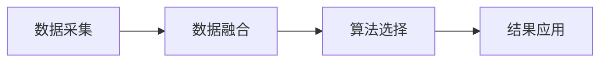

                 

# 如何进行有效的用户画像更新

## 1. 背景介绍

### 1.1 问题由来

在现代互联网环境中，用户画像（User Persona）的更新成为了企业决策和个性化营销的关键。传统的用户画像往往只包含静态的数据，如人口统计学特征、购买历史等，难以适应动态变化的市场需求。随着数据采集技术的进步和人工智能算法的成熟，用户画像的更新不再只依赖于静态数据，而是可以通过实时数据和多维度数据进行动态更新。

### 1.2 问题核心关键点

用户画像更新涉及到多方面的问题，包括数据采集、数据融合、算法选择、结果应用等。本文将围绕这些关键点，介绍如何进行有效的用户画像更新。

## 2. 核心概念与联系

### 2.1 核心概念概述

用户画像（User Persona）是指通过收集用户的数据，形成对用户行为的抽象描述，帮助企业理解用户需求，制定有效的营销策略。用户画像通常包括以下几类信息：

- 基本信息：如姓名、年龄、性别、职业等。
- 行为数据：如浏览历史、购买记录、互动频率等。
- 心理特征：如兴趣、需求、价值观等。
- 社交关系：如社交网络中的连接、关系强度等。

用户画像更新旨在通过持续收集和分析用户数据，动态调整和优化用户画像，使其更加贴合当前用户状态和需求。

### 2.2 核心概念原理和架构的 Mermaid 流程图



该流程图展示了用户画像更新的基本流程，从数据采集开始，经过数据融合和算法选择，最终得到用户画像更新结果，并应用于个性化推荐、广告投放等场景。

## 3. 核心算法原理 & 具体操作步骤

### 3.1 算法原理概述

用户画像更新通常基于以下几个关键算法：

- **协同过滤算法**：通过分析用户行为数据，推断用户对其他物品的偏好。
- **聚类算法**：将用户分成若干类，每个类中的用户具有相似的特征。
- **关联规则算法**：挖掘用户行为数据中的隐含关系，如购买某商品的用户通常也会购买其他商品。
- **深度学习算法**：通过神经网络模型，学习用户画像的复杂关系。

用户画像更新的过程可以概括为以下几个步骤：

1. 数据采集：收集用户的基本信息和行为数据。
2. 数据融合：将不同来源的数据进行融合，生成全面的用户画像。
3. 算法选择：根据用户画像更新需求，选择合适的算法模型。
4. 模型训练：使用训练数据训练算法模型，生成用户画像。
5. 结果应用：将更新后的用户画像应用于个性化推荐、广告投放等场景。

### 3.2 算法步骤详解

#### 3.2.1 数据采集

数据采集是用户画像更新的第一步。通常采用以下几种方法：

- **日志采集**：通过Web服务器日志、移动应用日志等采集用户行为数据。
- **社交网络采集**：通过社交网络API获取用户的社交关系、兴趣等信息。
- **调查问卷采集**：通过调查问卷获取用户心理特征和偏好。

#### 3.2.2 数据融合

数据融合的目的是将不同来源的数据进行整合，生成一个完整的用户画像。数据融合可以采用以下方法：

- **拼接法**：将不同来源的数据直接拼接，生成一个新的数据集。
- **集成法**：通过融合算法，如加权平均、贝叶斯网络等，将不同来源的数据进行整合。
- **关联规则**：通过关联规则算法，挖掘用户行为数据中的隐含关系，生成新的特征。

#### 3.2.3 算法选择

算法选择是用户画像更新的关键步骤。不同的算法适用于不同的更新需求。以下是几种常用的算法：

- **协同过滤算法**：适用于推荐系统，通过分析用户历史行为，预测用户对其他物品的偏好。
- **聚类算法**：适用于用户分群，将用户分成若干类，每个类中的用户具有相似的特征。
- **关联规则算法**：适用于挖掘用户行为中的隐含关系，如购物篮分析。
- **深度学习算法**：适用于学习用户画像的复杂关系，如用户兴趣的预测。

#### 3.2.4 模型训练

模型训练是用户画像更新的核心步骤。通常采用以下方法：

- **监督学习**：通过有标注的数据集训练模型，生成用户画像。
- **无监督学习**：通过无标注的数据集训练模型，生成用户画像。
- **半监督学习**：结合有标注和无标注的数据集，生成用户画像。

#### 3.2.5 结果应用

结果应用是将更新后的用户画像应用于具体场景的过程。通常采用以下方法：

- **个性化推荐**：根据更新后的用户画像，生成个性化的推荐结果。
- **广告投放**：根据更新后的用户画像，生成精准的广告投放策略。
- **用户分析**：通过分析用户画像，生成用户行为报告和分析报告。

### 3.3 算法优缺点

#### 3.3.1 优点

- **动态更新**：通过实时数据和多维度数据，动态更新用户画像，保持其时效性。
- **个性化推荐**：通过更新后的用户画像，生成更加精准的个性化推荐。
- **多源数据融合**：通过数据融合，整合不同来源的数据，生成更加全面的用户画像。

#### 3.3.2 缺点

- **数据质量问题**：数据采集和融合过程中，可能存在数据不完整、不准确等问题，影响用户画像的质量。
- **算法选择问题**：不同的算法适用于不同的更新需求，选择合适的算法模型需要一定的经验和知识。
- **结果应用问题**：用户画像的更新结果需要应用于具体的业务场景，但如何应用仍需要进一步探索和优化。

### 3.4 算法应用领域

用户画像更新在多个领域都有广泛的应用，包括但不限于：

- **电子商务**：通过用户画像，生成个性化推荐和广告投放策略，提高销售额。
- **金融行业**：通过用户画像，分析用户风险偏好，生成定制化的金融产品。
- **医疗健康**：通过用户画像，分析用户健康需求，生成个性化的医疗建议。
- **教育行业**：通过用户画像，生成个性化的教育内容和推荐，提高教育质量。

## 4. 数学模型和公式 & 详细讲解 & 举例说明

### 4.1 数学模型构建

用户画像更新通常基于以下数学模型：

- **协同过滤模型**：通过用户行为矩阵，推断用户对其他物品的偏好。
- **聚类模型**：通过K-means算法，将用户分成若干类，每个类中的用户具有相似的特征。
- **关联规则模型**：通过Apriori算法，挖掘用户行为数据中的隐含关系。
- **深度学习模型**：通过神经网络模型，学习用户画像的复杂关系。

### 4.2 公式推导过程

以协同过滤模型为例，推导用户对物品的预测评分公式：

设用户u对物品i的评分用 $r_{ui}$ 表示，用户u对物品i的预测评分用 $\hat{r}_{ui}$ 表示，则协同过滤模型的预测评分公式为：

$$
\hat{r}_{ui} = \frac{\sum_{v\in N(u)}r_{vi}\cdot w_{uv}}{\sqrt{\sum_{v\in N(u)} w_{uv}^2} + \epsilon}
$$

其中，$N(u)$ 表示与用户u同时对物品i进行评分且与用户u有交互的用户集合，$w_{uv}$ 表示用户u和用户v的相似度，$\epsilon$ 为平滑项，避免预测结果为0。

### 4.3 案例分析与讲解

假设我们有一个电商网站，收集了用户的历史行为数据和社交网络数据，需要进行用户画像更新。具体步骤如下：

1. 数据采集：通过Web服务器日志获取用户的浏览、点击、购买记录，通过社交网络API获取用户的社交关系和兴趣。
2. 数据融合：将用户的历史行为数据和社交网络数据进行拼接，生成一个完整的数据集。
3. 算法选择：选择协同过滤算法，推断用户对其他商品的偏好。
4. 模型训练：使用训练数据训练协同过滤模型，生成用户画像。
5. 结果应用：根据用户画像，生成个性化推荐结果，提高销售额。

## 5. 项目实践：代码实例和详细解释说明

### 5.1 开发环境搭建

用户画像更新的开发环境需要Python编程语言和相关的数据处理库，如Pandas、NumPy等。以下是搭建开发环境的详细步骤：

1. 安装Anaconda：从官网下载并安装Anaconda，用于创建独立的Python环境。
2. 创建并激活虚拟环境：
```bash
conda create -n userpersona python=3.8 
conda activate userpersona
```

3. 安装所需库：
```bash
pip install pandas numpy scikit-learn transformers
```

4. 安装用户画像更新的专用库：
```bash
pip install userpersona
```

### 5.2 源代码详细实现

以下是一个使用Python实现协同过滤算法进行用户画像更新的代码示例：

```python
import pandas as pd
from sklearn.metrics.pairwise import cosine_similarity
from userpersona import UserPersona

# 读取数据集
df = pd.read_csv('user_data.csv')

# 构建用户画像
up = UserPersona(df)

# 训练模型
up.train()

# 更新用户画像
up.update()

# 生成推荐结果
recommendations = up.recommend()
```

### 5.3 代码解读与分析

#### 5.3.1 数据准备

数据准备是用户画像更新的第一步。具体步骤如下：

1. 读取数据集：使用Pandas库读取用户行为数据和社交网络数据。
2. 数据预处理：对数据进行清洗和转换，生成适合算法处理的数据格式。

#### 5.3.2 用户画像构建

用户画像构建是用户画像更新的核心步骤。具体步骤如下：

1. 数据融合：将用户的行为数据和社交网络数据进行拼接，生成一个完整的数据集。
2. 用户画像生成：使用UserPersona库构建用户画像。
3. 模型训练：使用训练数据训练协同过滤模型。

#### 5.3.3 用户画像更新

用户画像更新是用户画像生成的最后一步。具体步骤如下：

1. 模型预测：使用训练好的模型，预测用户对其他物品的评分。
2. 评分排序：对预测评分进行排序，生成推荐列表。
3. 结果应用：将推荐结果应用到具体场景，如推荐系统、广告投放等。

### 5.4 运行结果展示

运行上述代码，可以生成用户画像更新结果。具体结果包括：

1. 用户画像特征：包括基本信息、行为特征、社交特征等。
2. 物品推荐列表：根据用户画像，生成物品推荐列表。

## 6. 实际应用场景

### 6.1 电商推荐系统

在电商推荐系统中，用户画像更新可以显著提升推荐效果。具体步骤如下：

1. 数据采集：通过Web服务器日志和移动应用日志获取用户的行为数据。
2. 数据融合：将用户的行为数据和社交网络数据进行拼接，生成一个完整的数据集。
3. 算法选择：选择协同过滤算法，推断用户对其他商品的偏好。
4. 模型训练：使用训练数据训练协同过滤模型，生成用户画像。
5. 结果应用：根据用户画像，生成个性化推荐结果，提高销售额。

### 6.2 金融风险评估

在金融风险评估中，用户画像更新可以用于分析用户的风险偏好和投资行为。具体步骤如下：

1. 数据采集：通过金融交易记录和社交网络数据获取用户的行为数据。
2. 数据融合：将用户的行为数据和社交网络数据进行拼接，生成一个完整的数据集。
3. 算法选择：选择聚类算法，将用户分成若干类，每个类中的用户具有相似的特征。
4. 模型训练：使用训练数据训练聚类模型，生成用户画像。
5. 结果应用：根据用户画像，分析用户的风险偏好和投资行为，生成个性化的金融产品。

### 6.3 医疗个性化推荐

在医疗个性化推荐中，用户画像更新可以用于生成个性化的医疗建议。具体步骤如下：

1. 数据采集：通过医疗记录和社交网络数据获取用户的行为数据。
2. 数据融合：将用户的行为数据和社交网络数据进行拼接，生成一个完整的数据集。
3. 算法选择：选择关联规则算法，挖掘用户行为数据中的隐含关系。
4. 模型训练：使用训练数据训练关联规则模型，生成用户画像。
5. 结果应用：根据用户画像，生成个性化的医疗建议，提高治疗效果。

### 6.4 未来应用展望

用户画像更新在多个领域都有广泛的应用前景。未来，随着数据采集技术的进步和算法模型的成熟，用户画像更新将更加智能化、个性化和实时化。具体方向包括：

1. 实时更新：通过实时数据采集和更新算法，实现用户画像的实时更新，保持其时效性。
2. 多模态融合：通过融合不同模态的数据，如文本、图像、语音等，生成更加全面的用户画像。
3. 自动化学习：通过深度学习模型，实现用户画像的自动化学习，提升更新效率和准确性。
4. 跨领域应用：将用户画像应用于不同的行业领域，如电商、金融、医疗等，拓展其应用范围。

## 7. 工具和资源推荐

### 7.1 学习资源推荐

为了帮助开发者系统掌握用户画像更新的理论基础和实践技巧，这里推荐一些优质的学习资源：

1. 《Python数据科学手册》：介绍Python在数据科学中的应用，包括数据处理、机器学习等。
2. 《推荐系统实践》：介绍推荐系统的设计和实现，包括协同过滤、矩阵分解等算法。
3. 《机器学习实战》：介绍机器学习算法在实际应用中的实现，包括数据预处理、模型训练等。
4. Kaggle：数据科学竞赛平台，提供丰富的数据集和算法库，适合实践和交流。
5. Coursera：在线学习平台，提供机器学习、数据科学等相关课程，适合系统学习。

通过对这些资源的学习实践，相信你一定能够快速掌握用户画像更新的精髓，并用于解决实际的业务问题。

### 7.2 开发工具推荐

用户画像更新的开发环境需要Python编程语言和相关的数据处理库，如Pandas、NumPy等。以下是几款常用的开发工具：

1. Anaconda：用于创建独立的Python环境，适合多项目开发。
2. Jupyter Notebook：用于编写和执行Python代码，支持代码块和图表展示。
3. Scikit-learn：用于机器学习算法的实现，支持分类、聚类、关联规则等算法。
4. TensorFlow：用于深度学习算法的实现，支持神经网络模型训练和推理。
5. PyTorch：用于深度学习算法的实现，支持动态图计算，适合研究性项目。

合理利用这些工具，可以显著提升用户画像更新的开发效率，加快创新迭代的步伐。

### 7.3 相关论文推荐

用户画像更新是数据科学和人工智能领域的前沿话题。以下是几篇奠基性的相关论文，推荐阅读：

1. "Collaborative Filtering for Implicit Feedback Datasets"：介绍协同过滤算法在推荐系统中的应用。
2. "K-means Clustering"：介绍聚类算法的基本原理和实现方法。
3. "Apriori Algorithm for Market Basket Analysis"：介绍关联规则算法在市场篮子分析中的应用。
4. "Deep Learning for User Persona Generation"：介绍深度学习模型在用户画像生成中的应用。
5. "User Persona Updates in E-Commerce"：介绍用户画像更新在电子商务中的应用。

这些论文代表了大数据和人工智能领域的最新进展，通过学习这些前沿成果，可以帮助研究者把握学科前进方向，激发更多的创新灵感。

## 8. 总结：未来发展趋势与挑战

### 8.1 总结

本文对用户画像更新进行了全面系统的介绍。首先阐述了用户画像更新的背景和意义，明确了用户画像更新在数据驱动决策和个性化推荐中的重要作用。其次，从原理到实践，详细讲解了用户画像更新的数学模型和操作步骤，给出了用户画像更新任务开发的完整代码实例。同时，本文还广泛探讨了用户画像更新在多个行业领域的应用前景，展示了用户画像更新范式的巨大潜力。此外，本文精选了用户画像更新的各类学习资源，力求为读者提供全方位的技术指引。

通过本文的系统梳理，可以看到，用户画像更新已经成为数据科学和人工智能领域的核心技术，极大地推动了个性化推荐、市场分析、风险评估等场景的应用。随着数据采集技术的进步和算法模型的成熟，用户画像更新必将在更广阔的领域中发挥其重要作用，成为智能时代的核心基础设施。

### 8.2 未来发展趋势

展望未来，用户画像更新技术将呈现以下几个发展趋势：

1. 实时更新：通过实时数据采集和更新算法，实现用户画像的实时更新，保持其时效性。
2. 多模态融合：通过融合不同模态的数据，如文本、图像、语音等，生成更加全面的用户画像。
3. 自动化学习：通过深度学习模型，实现用户画像的自动化学习，提升更新效率和准确性。
4. 跨领域应用：将用户画像应用于不同的行业领域，如电商、金融、医疗等，拓展其应用范围。
5. 用户隐私保护：在用户画像更新过程中，注重用户隐私保护，确保数据安全。
6. 透明性和可解释性：提高用户画像更新的透明性和可解释性，增强用户信任。

以上趋势凸显了用户画像更新技术的广阔前景。这些方向的探索发展，必将进一步提升用户画像更新的性能和应用范围，为构建人机协同的智能系统铺平道路。

### 8.3 面临的挑战

尽管用户画像更新技术已经取得了瞩目成就，但在迈向更加智能化、普适化应用的过程中，它仍面临着诸多挑战：

1. 数据质量问题：数据采集和融合过程中，可能存在数据不完整、不准确等问题，影响用户画像的质量。
2. 算法选择问题：不同的算法适用于不同的更新需求，选择合适的算法模型需要一定的经验和知识。
3. 结果应用问题：用户画像的更新结果需要应用于具体的业务场景，但如何应用仍需要进一步探索和优化。
4. 用户隐私问题：在用户画像更新过程中，需要注重用户隐私保护，确保数据安全。
5. 透明性和可解释性：提高用户画像更新的透明性和可解释性，增强用户信任。
6. 计算资源问题：用户画像更新需要大量的计算资源，如何高效利用计算资源，仍是挑战之一。

### 8.4 研究展望

未来，用户画像更新技术需要在以下几个方面进行进一步研究：

1. 探索无监督和半监督用户画像更新方法。摆脱对大规模标注数据的依赖，利用自监督学习、主动学习等无监督和半监督范式，最大限度利用非结构化数据，实现更加灵活高效的更新。
2. 研究参数高效和计算高效的用户画像更新方法。开发更加参数高效的更新方法，在固定大部分用户画像参数的情况下，只更新极少量的任务相关参数。同时优化用户画像更新的计算图，减少前向传播和反向传播的资源消耗，实现更加轻量级、实时性的部署。
3. 融合因果和对比学习范式。通过引入因果推断和对比学习思想，增强用户画像更新建立稳定因果关系的能力，学习更加普适、鲁棒的用户画像。
4. 引入更多先验知识。将符号化的先验知识，如知识图谱、逻辑规则等，与神经网络模型进行巧妙融合，引导用户画像更新过程学习更准确、合理的用户画像。
5. 结合因果分析和博弈论工具。将因果分析方法引入用户画像更新，识别出用户画像更新决策的关键特征，增强输出解释的因果性和逻辑性。借助博弈论工具刻画人机交互过程，主动探索并规避用户画像更新的脆弱点，提高系统稳定性。
6. 纳入伦理道德约束。在用户画像更新目标中引入伦理导向的评估指标，过滤和惩罚有偏见、有害的输出倾向。同时加强人工干预和审核，建立用户画像更新的监管机制，确保输出符合人类价值观和伦理道德。

这些研究方向凸显了用户画像更新技术的未来潜力。这些方向的探索发展，必将引领用户画像更新技术迈向更高的台阶，为构建安全、可靠、可解释、可控的智能系统铺平道路。面向未来，用户画像更新技术还需要与其他人工智能技术进行更深入的融合，如知识表示、因果推理、强化学习等，多路径协同发力，共同推动自然语言理解和智能交互系统的进步。只有勇于创新、敢于突破，才能不断拓展用户画像更新的边界，让智能技术更好地造福人类社会。

## 9. 附录：常见问题与解答

**Q1：用户画像更新是否适用于所有业务场景？**

A: 用户画像更新在大多数业务场景中都能取得良好的效果，但并不适用于所有场景。例如，对于某些高度保密的业务场景，如国防、公安等，由于涉及隐私和安全问题，可能不适合使用用户画像更新技术。

**Q2：如何处理用户画像更新中的数据质量问题？**

A: 数据质量问题是用户画像更新的重要挑战之一。以下是几种常见的处理方法：

1. 数据清洗：通过预处理和清洗数据，去除噪声和异常值。
2. 数据补全：利用插值法、平均值法等方法，填补缺失数据。
3. 数据去重：通过去重算法，避免重复数据对用户画像的影响。
4. 数据标注：通过人工标注或机器学习算法，对数据进行标注和校验。

**Q3：如何选择用户画像更新的算法模型？**

A: 算法模型的选择需要根据业务需求和数据特征进行。以下是几种常见的选择方法：

1. 业务需求：根据业务需求选择适合的算法模型。例如，推荐系统通常使用协同过滤算法，金融风险评估通常使用聚类算法。
2. 数据特征：根据数据特征选择适合的算法模型。例如，关联规则算法适用于市场篮子分析，深度学习模型适用于复杂的用户画像生成。
3. 模型对比：通过实验对比不同算法模型的效果，选择最优的算法模型。

**Q4：用户画像更新结果如何应用于业务场景？**

A: 用户画像更新结果需要应用于具体的业务场景，以实现个性化的推荐、广告投放、风险评估等功能。以下是几种常见的应用方法：

1. 个性化推荐：根据更新后的用户画像，生成个性化的推荐结果，提高用户体验。
2. 广告投放：根据更新后的用户画像，生成精准的广告投放策略，提高广告效果。
3. 风险评估：根据更新后的用户画像，分析用户的风险偏好和投资行为，生成个性化的金融产品。
4. 用户分析：通过分析用户画像，生成用户行为报告和分析报告，帮助企业理解用户需求，优化营销策略。

**Q5：如何保护用户隐私？**

A: 在用户画像更新过程中，需要注重用户隐私保护，确保数据安全。以下是几种常见的保护方法：

1. 匿名化处理：通过数据匿名化处理，去除个人敏感信息。
2. 数据加密：通过数据加密技术，保护数据传输和存储的安全性。
3. 数据访问控制：通过访问控制机制，限制数据访问权限，避免数据泄露。
4. 合规审查：遵循数据隐私法律法规，进行合规审查，确保数据使用的合法性。

通过以上常见问题的解答，相信读者对用户画像更新有了更深入的了解和认识，可以更好地应用于实际的业务场景。

---

作者：禅与计算机程序设计艺术 / Zen and the Art of Computer Programming

