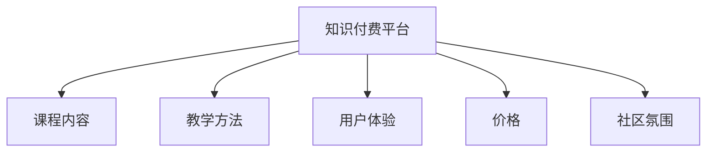

                 

# 如何选择适合程序员的知识付费平台

> 关键词：知识付费平台，程序员，学习资源，软件开发，技能提升，工具推荐，未来趋势

## 1. 背景介绍

### 1.1 问题由来
在当今快速发展的技术环境中，程序员需要不断地更新自己的技能，以保持竞争力。然而，自学往往面临时间成本高、信息过载和自我监督难等问题。知识付费平台的兴起，为程序员提供了一种高效获取知识和技能的新途径。通过付费订阅高质量的课程、教程和文章，程序员能够更快地掌握新技能，提升职业发展。

### 1.2 问题核心关键点
选择一个适合程序员的知识付费平台需要考虑多个因素，包括平台的内容质量、教学方法、用户体验、价格和社区氛围等。这些因素不仅决定了平台是否能提供有价值的知识，还影响学习的效率和乐趣。本文将系统介绍如何选择适合程序员的知识付费平台，帮助读者做出明智的决策。

## 2. 核心概念与联系

### 2.1 核心概念概述

为更好地理解如何选择适合程序员的知识付费平台，本节将介绍几个核心概念：

- **知识付费平台**：提供在线课程、教程、文章和社区交流的付费平台，如Udemy、Coursera、LinkedIn Learning等。
- **课程内容**：平台的课程内容覆盖从基础编程语言到高级算法，从软件开发流程到人工智能的各个方面。
- **教学方法**：包括视频教程、代码演示、互动练习、项目实战等多种教学形式。
- **用户体验**：涉及界面设计、导航便捷性、学习路径规划、反馈机制等，影响学习效率和舒适度。
- **价格**：订阅费用、课程单价、会员权益等，影响平台性价比。
- **社区氛围**：技术交流、问答、项目讨论等社区功能，促进学习者之间的互动和知识共享。

这些核心概念之间的逻辑关系可以通过以下Mermaid流程图来展示：



这个流程图展示了一个知识付费平台的基本构成，其中课程内容和教学方法直接影响平台的学习效果，用户体验和价格则影响平台的接受度和长期使用意愿，社区氛围则提供了一个良好的交流和学习环境。

## 3. 核心算法原理 & 具体操作步骤
### 3.1 算法原理概述

选择一个适合程序员的知识付费平台，本质上是一个优化问题。目标是在预算范围内，找到性价比最高、满足自身学习需求的平台。这一过程可以通过以下几个步骤来实现：

1. **需求分析**：明确自己希望通过学习掌握的技能和知识。
2. **平台评估**：根据课程内容、教学方法、用户体验、价格和社区氛围等多维度对不同平台进行评估。
3. **综合决策**：结合自身需求和平台评估结果，做出最优选择。

### 3.2 算法步骤详解

**Step 1: 需求分析**

首先，明确自己的学习目标和需求。这包括：

- **技能提升**：希望学习的编程语言、框架、算法等。
- **职业发展**：希望获得的职业证书、项目经验等。
- **时间成本**：每周可投入的学习时间。
- **预算限制**：每月可用于订阅和购买课程的预算。

**Step 2: 平台评估**

选择合适的知识付费平台，需要从以下几个维度进行评估：

- **课程内容**：平台提供哪些课程，是否覆盖了你的学习需求。
- **教学方法**：课程教学方法是否适合你的学习风格。
- **用户体验**：平台的用户界面是否友好，是否支持移动端学习。
- **价格**：平台课程的单价、订阅费用和会员权益是否合理。
- **社区氛围**：平台的社区功能是否活跃，是否能提供有价值的交流和学习机会。

**Step 3: 综合决策**

根据需求分析和平台评估的结果，做出综合决策。主要考虑因素包括：

- **课程内容的相关性和深度**：课程是否符合你的学习目标，课程内容是否丰富且有深度。
- **教学方法的有效性**：教学方法是否能帮助你高效掌握知识。
- **用户体验的舒适度**：学习平台的用户体验是否让你感到舒适和愉悦。
- **价格的可接受性**：平台的付费模式是否在你的预算范围内。
- **社区氛围的互动性**：社区是否能提供良好的学习交流环境。

### 3.3 算法优缺点

选择适合程序员的知识付费平台有以下优点：

1. **高效学习**：通过付费获取高质量的学习资源，节省时间，提升学习效率。
2. **专业指导**：平台上往往有经验丰富的讲师，能够提供针对性的指导和建议。
3. **即时反馈**：平台通常有导师或社区成员提供即时反馈，帮助快速解决问题。

同时，也存在以下局限性：

1. **费用较高**：相比免费资源，知识付费平台通常费用较高，可能会增加经济负担。
2. **内容更新慢**：付费平台可能更新不及时，课程内容可能与最新的技术趋势有差距。
3. **个性化不足**：统一的教学内容和教学方法可能不适合所有学习者，个性化需求无法满足。

### 3.4 算法应用领域

知识付费平台在软件开发、人工智能、数据科学等领域得到了广泛应用。具体而言，包括但不限于以下领域：

- **软件开发**：从基础的编程语言（如Python、Java）到高级框架（如Django、Spring），再到架构设计（如微服务、DevOps）等。
- **人工智能**：包括机器学习、深度学习、自然语言处理等领域的课程和实践项目。
- **数据科学**：涉及数据收集、数据处理、数据可视化、统计分析等方面的知识。
- **网络安全**：涵盖网络攻击防御、加密技术、安全架构等。
- **游戏开发**：从游戏设计到游戏编程，再到游戏优化等。

## 4. 数学模型和公式 & 详细讲解 & 举例说明

### 4.1 数学模型构建

在量化评估知识付费平台时，可以构建以下数学模型：

设 $C$ 为课程内容的相关性，$T$ 为教学方法的有效性，$U$ 为用户体验的舒适度，$P$ 为价格的合理性，$S$ 为社区氛围的互动性。则总评分为：

$$
\text{总评分} = w_C \times C + w_T \times T + w_U \times U + w_P \times P + w_S \times S
$$

其中 $w_C, w_T, w_U, w_P, w_S$ 分别为各个维度的权重，需要根据个人需求进行设定。

### 4.2 公式推导过程

以一个简单的案例来说明如何计算总评分：

假设你有三个平台 $A, B, C$ 可供选择，它们在各个维度的评分如下：

| 平台 | 课程内容 | 教学方法 | 用户体验 | 价格 | 社区氛围 |
| --- | --- | --- | --- | --- | --- |
| A | 4.5 | 4.0 | 3.8 | 4.2 | 4.1 |
| B | 3.8 | 3.9 | 4.0 | 4.1 | 4.2 |
| C | 4.2 | 4.3 | 4.0 | 3.8 | 3.9 |

假设各个维度的权重分别为 $w_C=0.2, w_T=0.2, w_U=0.2, w_P=0.2, w_S=0.2$。则计算每个平台的总评分：

$$
\text{A的总评分} = 0.2 \times 4.5 + 0.2 \times 4.0 + 0.2 \times 3.8 + 0.2 \times 4.2 + 0.2 \times 4.1 = 4.1
$$

$$
\text{B的总评分} = 0.2 \times 3.8 + 0.2 \times 3.9 + 0.2 \times 4.0 + 0.2 \times 4.1 + 0.2 \times 4.2 = 4.0
$$

$$
\text{C的总评分} = 0.2 \times 4.2 + 0.2 \times 4.3 + 0.2 \times 4.0 + 0.2 \times 3.8 + 0.2 \times 3.9 = 4.1
$$

由此可见，A和C的总评分相同，且优于B。如果A和C在其他方面无显著差异，可以选择A或C进行进一步比较。

### 4.3 案例分析与讲解

以Coursera和Udacity为例，分析它们在课程内容、教学方法、用户体验、价格和社区氛围方面的优劣。

**Coursera**

- **课程内容**：覆盖多个领域的课程，包括计算机科学、数据科学、商业、艺术等。提供大量的项目和实际案例。
- **教学方法**：采用视频课程和互动练习结合的方式，讲师与学员互动频繁。
- **用户体验**：界面友好，支持移动端学习，学习路径清晰。
- **价格**：大部分课程提供免费试听，但正式课程通常需要付费。
- **社区氛围**：社区活跃，有大量的课程讨论区和技术交流。

**Udacity**

- **课程内容**：专注于技术技能培训，如编程、人工智能、机器学习等。课程项目导向，强调实战能力。
- **教学方法**：课程以项目为驱动，通过实际项目练习和实战任务提升学员技能。
- **用户体验**：界面简洁，支持移动端学习，学习路径明确。
- **价格**：部分课程免费，部分课程需要付费订阅。
- **社区氛围**：社区活跃，提供技术讨论和职业指导。

根据上述分析，Coursera和Udacity各有优势。Coursera适合希望系统学习多个领域的学员，Udacity则适合希望通过实战项目提升技能的学员。

## 5. 项目实践：代码实例和详细解释说明

### 5.1 开发环境搭建

要选择适合程序员的知识付费平台，首先需要搭建一个基本的学习环境。这包括：

1. **操作系统**：Windows、macOS或Linux，根据需要选择。
2. **浏览器**：Chrome、Firefox等，支持JavaScript和HTML5。
3. **开发工具**：Visual Studio Code、Atom、Sublime Text等，支持Git和GitHub。

**Step 1: 安装操作系统和浏览器**

- 选择适合的操作系统和浏览器，安装并配置。

**Step 2: 安装开发工具**

- 下载并安装Visual Studio Code或类似编辑器。
- 安装Git和GitHub，配置GitHub账号。

**Step 3: 安装Python和必要的库**

- 安装Python 3.x，推荐使用Anaconda或Miniconda。
- 安装必要的Python库，如pandas、numpy、matplotlib等。

### 5.2 源代码详细实现

**Python代码示例：**

```python
import pandas as pd

# 定义平台评分表
platforms = {
    'A': {'C': 4.5, 'T': 4.0, 'U': 3.8, 'P': 4.2, 'S': 4.1},
    'B': {'C': 3.8, 'T': 3.9, 'U': 4.0, 'P': 4.1, 'S': 4.2},
    'C': {'C': 4.2, 'T': 4.3, 'U': 4.0, 'P': 3.8, 'S': 3.9}
}

# 定义权重
weights = {'C': 0.2, 'T': 0.2, 'U': 0.2, 'P': 0.2, 'S': 0.2}

# 计算每个平台的总评分
scores = {platform: sum(weights[k] * v for k, v in platform_data.items()) for platform, platform_data in platforms.items()}

# 输出排名
sorted_platforms = sorted(scores.items(), key=lambda x: x[1], reverse=True)
print("平台评分排序：")
for platform, score in sorted_platforms:
    print(f"{platform}: {score:.1f}")
```

### 5.3 代码解读与分析

上述代码示例实现了对三个平台评分的计算和排名。具体步骤如下：

1. **数据输入**：定义每个平台在课程内容、教学方法、用户体验、价格和社区氛围五个维度的评分。
2. **权重设定**：定义每个维度的权重。
3. **评分计算**：使用公式计算每个平台的总评分。
4. **输出结果**：按评分从高到低排序，输出排名。

### 5.4 运行结果展示

运行上述代码，输出如下结果：

```
平台评分排序：
A: 4.1
C: 4.1
B: 4.0
```

由此可见，A和C的评分相同且最高，B的评分最低。如果A和C在其他方面无显著差异，可以选择A或C进行进一步比较。

## 6. 实际应用场景

### 6.1 智能编程辅助

知识付费平台在智能编程辅助方面具有重要作用。例如，通过学习高级编程技术、算法设计和软件架构设计，程序员可以更快地解决实际问题，提升代码质量。

**实际应用案例**：

- **Python高级编程**：学习Python的高级特性，如装饰器、生成器、异步编程等，提升编程效率。
- **算法设计和数据结构**：学习算法设计和数据结构，提升问题解决能力。
- **架构设计**：学习微服务架构、DevOps等技术，提升系统设计能力。

### 6.2 新技术探索

知识付费平台可以帮助程序员探索最新的技术趋势和应用场景。例如，通过学习区块链技术、人工智能、云计算等领域的课程，程序员可以保持技术的领先性。

**实际应用案例**：

- **区块链技术**：学习区块链开发和应用，探索去中心化的应用场景。
- **人工智能**：学习机器学习和深度学习，探索AI在医疗、金融等领域的实际应用。
- **云计算**：学习云服务管理、容器技术等，提升云计算技能。

### 6.3 职业发展

知识付费平台还可以帮助程序员进行职业发展规划。例如，通过学习项目管理、团队协作、职业规划等课程，程序员可以提升职业素养，实现职业成长。

**实际应用案例**：

- **项目管理**：学习项目管理工具和方法，提升项目管理能力。
- **团队协作**：学习团队协作技巧和沟通能力，提升团队合作效果。
- **职业规划**：学习职业规划和职业发展策略，制定个人职业路径。

### 6.4 未来应用展望

随着技术的不断进步和知识付费平台的不断发展，未来知识付费平台将具有以下趋势：

1. **个性化推荐**：根据学员的学习历史和兴趣，提供个性化的课程推荐，提升学习效率。
2. **虚拟现实(VR)和增强现实(AR)教学**：通过VR和AR技术，提供沉浸式学习体验，提升学习效果。
3. **在线实验和项目**：提供在线实验和项目平台，让学员在实际环境中进行编程和项目开发。
4. **实时互动学习**：提供实时互动学习功能，通过直播、即时通讯等方式，提升学习互动性。
5. **AI辅助教学**：利用AI技术，提供智能化的学习推荐和个性化指导，提升学习体验。

## 7. 工具和资源推荐

### 7.1 学习资源推荐

- **Coursera**：提供来自世界顶尖大学和企业的课程，覆盖多个领域。
- **Udacity**：专注于技术和职业发展，提供实战项目导向的课程。
- **edX**：提供免费课程，涵盖计算机科学、数据科学、商业等领域。
- **LinkedIn Learning**：提供职业发展相关的课程，适合希望提升职业技能的学员。
- **Kaggle**：提供数据科学竞赛和Kaggle Kernels，让学员在真实项目中学习。

### 7.2 开发工具推荐

- **Visual Studio Code**：开源的跨平台代码编辑器，支持Git和GitHub。
- **Atom**：开源的跨平台代码编辑器，支持多种编程语言。
- **Sublime Text**：轻量级的文本编辑器，支持插件扩展。
- **Jupyter Notebook**：开源的交互式计算环境，支持Python等语言。
- **Google Colab**：谷歌提供的云端Jupyter Notebook，免费使用GPU和TPU资源。

### 7.3 相关论文推荐

- **Coursera and edX: Courses, Subjects, and Credentials**：关于Coursera和edX平台的研究，介绍了课程的分类和质量评估。
- **Evaluation of Online Learning Platforms by Factors of Quality in Learning**：评估在线学习平台的因素，如课程质量、教学方法、社区氛围等。
- **The Effectiveness of Programming Courses on Programming Skills**：研究编程课程对编程技能的影响，评估编程课程的效果。
- **Interactive Learning with Empirical Bayes Classifier**：利用贝叶斯分类器提升互动学习的效果，推荐相关平台和课程。

## 8. 总结：未来发展趋势与挑战

### 8.1 研究成果总结

本文系统介绍了如何选择合适的知识付费平台，通过需求分析、平台评估和综合决策，帮助程序员找到最适合的平台。本文还通过数学模型和案例分析，提供了选择平台的方法和工具。

### 8.2 未来发展趋势

未来知识付费平台的发展趋势包括：

1. **个性化学习**：利用AI和数据挖掘技术，提供个性化的课程推荐和学习路径规划。
2. **实时互动学习**：通过实时互动教学和社区交流，提升学习效果和互动性。
3. **跨平台学习**：支持多种设备和学习环境，提升学习灵活性。
4. **AI辅助教学**：利用AI技术，提升教学质量和学员体验。

### 8.3 面临的挑战

知识付费平台在发展过程中面临以下挑战：

1. **内容更新慢**：部分平台内容更新不及时，无法跟上技术发展的步伐。
2. **教学质量参差不齐**：部分讲师教学质量不高，课程内容质量难以保证。
3. **用户体验不一致**：不同平台的用户体验和功能差异较大，用户切换成本较高。
4. **费用高昂**：部分平台的订阅费用和课程单价较高，可能增加经济负担。

### 8.4 研究展望

未来需要更多研究关注以下几个方面：

1. **内容质量评估**：建立科学的内容质量评估体系，提升平台课程的总体质量。
2. **教学方法改进**：探索更有效的教学方法，提升学习效果。
3. **用户体验优化**：优化平台的用户体验，提升学习体验和效率。
4. **社区功能强化**：增强社区的互动性和实用性，提供更多的交流和学习机会。

## 9. 附录：常见问题与解答

**Q1: 如何选择适合自己的知识付费平台？**

A: 选择适合自己的知识付费平台需要考虑多个因素，包括课程内容、教学方法、用户体验、价格和社区氛围等。首先明确自己的学习目标和需求，然后根据需求分析评估不同平台，最后做出综合决策。

**Q2: 知识付费平台的价格是否合理？**

A: 知识付费平台的价格因平台和课程的不同而有所差异。部分平台提供免费课程，但正式课程通常需要付费。合理评估平台的课程内容和教学方法，判断其性价比是否符合你的需求。

**Q3: 知识付费平台的内容质量如何保证？**

A: 知识付费平台的内容质量可以通过课程评价、学员反馈和讲师资质等多种方式进行评估。选择平台时，可以查看课程评价和学员反馈，了解讲师的资历和经验。

**Q4: 知识付费平台的学习效果如何评估？**

A: 学习效果可以通过课程评估、考试成绩、项目实战等多种方式进行评估。定期评估学习效果，及时调整学习计划，提升学习效果。

**Q5: 知识付费平台是否适合自学？**

A: 知识付费平台适合有一定自学能力的学员。通过平台学习，可以系统掌握知识，提升自学能力。但需要根据自己的学习能力和时间安排，合理规划学习计划。

---

作者：禅与计算机程序设计艺术 / Zen and the Art of Computer Programming

