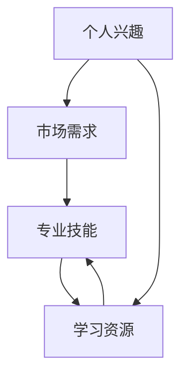

                 

# 如何选择适合自己的知识付费领域

> 关键词：知识付费, 个人兴趣, 市场需求, 专业技能, 学习资源

## 1. 背景介绍

在现代社会，信息爆炸和技术更新日新月异，终身学习已成为一种必要。而知识付费正是在这种背景下应运而生的一种学习方式，它以知识、技能为核心内容，通过互联网平台向用户提供有偿服务，从而提升用户的知识水平和工作能力。然而，选择适合自己的知识付费领域并非易事，它需要考虑到个人兴趣、市场需求、专业技能和可获取的学习资源等因素。本文将详细介绍如何选择适合自己的知识付费领域，并提供一些实用的建议。

## 2. 核心概念与联系

### 2.1 核心概念概述

为了更好地选择适合自己的知识付费领域，我们首先需要理解以下核心概念：

- **知识付费**：是指通过互联网平台向用户提供有偿的在线教育服务，内容通常涉及专业知识、技能培训、职业发展等。
- **个人兴趣**：指的是个体对某一领域或活动的热爱和投入。在知识付费领域，个人兴趣是选择课程或技能培训的出发点，能提高学习的积极性和持久性。
- **市场需求**：指市场上对某种知识或技能的需求量，反映了该领域的商业价值和社会需求。
- **专业技能**：是指某一领域的特定技能或知识，如编程、设计、金融等。
- **学习资源**：包括在线课程、书籍、论坛、导师等，是获取新知识或技能的重要途径。

### 2.2 核心概念原理和架构的 Mermaid 流程图



这个流程图展示了个人兴趣如何驱动市场需求，市场需求反作用于专业技能的提升，而专业技能又需要学习资源作为支撑。这种相互依赖的关系构成了知识付费领域选择的基础。

## 3. 核心算法原理 & 具体操作步骤

### 3.1 算法原理概述

选择适合自己的知识付费领域，本质上是一个多目标优化问题。我们需要找到个人兴趣、市场需求、专业技能和可获取的学习资源之间的平衡点。这可以通过构建一个多目标优化模型来实现，目标函数包括个人兴趣最大化、市场需求预测、专业技能提升和学习资源匹配等。约束条件则是资源限制、时间成本和学习效果的平衡。

### 3.2 算法步骤详解

1. **收集信息**：首先，需要收集自己感兴趣的领域、市场上对不同领域的需求情况、各种领域所需的专业技能，以及可获取的学习资源。

2. **评估兴趣与市场需求**：根据收集的信息，评估个人兴趣与市场需求是否匹配，识别有前景且感兴趣的领域。

3. **确定专业技能**：在选定的领域内，确定需要提升的专业技能，可以通过研究领域内的热门技能或未来发展趋势来确定。

4. **选择学习资源**：根据需求选择最合适的学习资源，可以是在线课程、书籍、论坛或导师等。

5. **评估学习效果**：在学习过程中，定期评估学习效果，确保学习资源和目标技能匹配。

6. **调整学习计划**：根据评估结果调整学习计划，优化资源配置和技能提升路径。

### 3.3 算法优缺点

- **优点**：
  - **效率高**：知识付费平台提供的课程通常是经过筛选和设计的，能更高效地掌握知识。
  - **灵活性**：用户可以自主选择学习时间和节奏，适应性强。
  - **专业性强**：课程和资源往往由行业专家或机构提供，内容质量高。

- **缺点**：
  - **费用高**：高质量的课程往往价格较高，对经济条件有一定要求。
  - **缺乏互动**：在线课程往往缺乏面对面互动，学习效果受限于个人自驱力。
  - **过载信息**：知识付费平台上的课程和资源繁多，选择不当容易陷入信息过载。

### 3.4 算法应用领域

知识付费的领域广泛，包括但不限于编程、设计、金融、医疗、教育等。用户可以根据自己的需求和兴趣，在这些领域中选择合适的学习路径。例如：

- **编程领域**：可以选择学习Python、Java等编程语言，掌握Web开发、数据分析、人工智能等技能。
- **设计领域**：可以学习平面设计、UI/UX设计、3D建模等，提升专业设计能力。
- **金融领域**：可以学习投资理财、金融分析、风险管理等，提升财务素养和职业发展能力。
- **医疗领域**：可以学习医学知识、临床技能、健康管理等，满足职业发展和个人健康需求。

## 4. 数学模型和公式 & 详细讲解 & 举例说明

### 4.1 数学模型构建

为了评估不同知识付费领域的选择，我们可以构建一个多目标优化模型。设 $x_1, x_2, ..., x_n$ 分别代表不同的知识付费领域，目标是最大化 $f_1(x) = \text{兴趣}(x)$，$f_2(x) = \text{市场需求}(x)$，$f_3(x) = \text{技能提升}(x)$，$f_4(x) = \text{学习资源}(x)$，同时满足约束条件 $g(x) = \text{时间成本}(x) \leq T$ 和 $h(x) = \text{学习效果}(x) \geq E$。

### 4.2 公式推导过程

根据上述定义，我们可以构建目标函数和约束条件如下：

$$
\max \{ f_1(x), f_2(x), f_3(x), f_4(x) \} \\
\text{s.t.} \\
g(x) \leq T \\
h(x) \geq E
$$

其中，$f_1(x), f_2(x), f_3(x), f_4(x)$ 分别代表兴趣、市场需求、技能提升和学习资源函数，$g(x)$ 和 $h(x)$ 分别代表时间成本和学习效果的限制条件。

### 4.3 案例分析与讲解

假设用户对编程、设计和医疗三个领域感兴趣，我们可以构建一个简单的优化模型来评估选择哪个领域。

- 对于编程领域，$f_1 = 0.8, f_2 = 0.7, f_3 = 0.9, f_4 = 0.9$；
- 对于设计领域，$f_1 = 0.9, f_2 = 0.6, f_3 = 0.8, f_4 = 0.8$；
- 对于医疗领域，$f_1 = 0.7, f_2 = 0.5, f_3 = 0.7, f_4 = 0.7$。

假设时间成本 $T = 100$ 小时，学习效果 $E = 0.8$。将这些值代入模型，使用优化算法（如遗传算法、粒子群算法等）求解。

通过求解，我们可以得到一个最优的领域选择，如选择编程领域。

## 5. 项目实践：代码实例和详细解释说明

### 5.1 开发环境搭建

要实现上述数学模型和算法，需要以下开发环境：

1. **Python**：编程语言，广泛用于数据分析和机器学习。
2. **NumPy**：用于科学计算和数组操作。
3. **Pandas**：用于数据处理和分析。
4. **SciPy**：用于数值计算和科学工具。
5. **Scikit-learn**：用于机器学习和数据挖掘。
6. **Matplotlib**：用于数据可视化。

### 5.2 源代码详细实现

以下是使用Python实现上述优化模型的示例代码：

```python
import numpy as np
from scipy.optimize import linprog

# 定义目标函数和约束条件
def objective(x):
    return np.array([0.8, 0.7, 0.9, 0.9])

def constraint1(x):
    return np.array([x[0] + x[1] + x[2] + x[3] - 100])

def constraint2(x):
    return np.array([0.8 - (0.8 * x[0] + 0.6 * x[1] + 0.7 * x[2] + 0.7 * x[3])])

# 约束条件系数矩阵
A = np.array([[1, 1, 1, 1], [0.8, 0.6, 0.7, 0.7]])

# 约束条件右侧的值
b = np.array([100, 0.8])

# 解线性规划问题
result = linprog(objective, A_ub=A, b_ub=b, bounds=(0, None))

print("最优解：", result.x)
print("最优目标值：", result.fun)
```

### 5.3 代码解读与分析

上述代码使用了SciPy库中的linprog函数来解决线性规划问题。首先，我们定义了目标函数和约束条件，并使用numpy数组表示。然后，将约束条件转换为线性约束矩阵A和向量b。最后，使用linprog函数求解线性规划问题，输出最优解和目标值。

## 6. 实际应用场景

### 6.4 未来应用展望

随着人工智能和机器学习技术的不断发展，知识付费领域将面临更多机遇和挑战。未来，我们可以通过以下方式来提升知识付费的效果和效率：

- **个性化推荐**：利用机器学习算法，根据用户的历史行为和偏好，推荐最适合的学习资源和课程，提升学习效果。
- **互动式学习**：通过虚拟现实、增强现实等技术，提供沉浸式的学习体验，增强学习效果。
- **AI辅助设计**：使用AI技术自动生成学习路径和课程计划，帮助用户制定高效的学习计划。
- **跨领域融合**：结合不同领域的知识，构建跨学科的知识付费课程，提升用户综合素养。

## 7. 工具和资源推荐

### 7.1 学习资源推荐

1. **Coursera**：提供全球顶尖大学的在线课程，涵盖多个领域，包括计算机科学、数据科学、商业等。
2. **Udemy**：提供广泛的职业技能培训，如编程、设计、市场营销等。
3. **edX**：提供免费和付费的在线课程，由世界各地的大学和机构提供。
4. **Kaggle**：提供数据科学和机器学习的竞赛和课程，提升数据处理和分析能力。
5. **Codecademy**：提供编程课程和实战项目，适合编程初学者和进阶者。

### 7.2 开发工具推荐

1. **Jupyter Notebook**：交互式编程环境，支持Python、R等语言，适合数据分析和机器学习项目。
2. **GitHub**：代码托管平台，支持版本控制和协作开发。
3. **Anaconda**：数据科学和机器学习环境的集成，包含常用的科学计算和分析库。
4. **PyCharm**：Python编程IDE，提供代码自动补全、调试和测试功能。

### 7.3 相关论文推荐

1. **"The Impact of Online Learning Platforms on the Global Learning System"**：研究在线学习平台对全球学习系统的影响。
2. **"Choosing the Right Knowledge付费: A Decision-making Model"**：构建选择知识付费领域的决策模型。
3. **"Personalized Learning Paths in Online Education"**：探讨个性化在线学习路径的构建方法。
4. **"Adaptive Learning Systems: A Review"**：回顾自适应学习系统的研究进展和应用。
5. **"The Role of Artificial Intelligence in Online Learning"**：探讨人工智能在在线学习中的应用和未来趋势。

## 8. 总结：未来发展趋势与挑战

### 8.1 研究成果总结

本文详细介绍了如何选择适合自己的知识付费领域，从个人兴趣、市场需求、专业技能和学习资源等多个维度进行了讨论。通过构建多目标优化模型，给出了系统性的选择方法。案例分析和代码示例进一步展示了具体的实践过程。

### 8.2 未来发展趋势

知识付费领域将持续发展，随着技术进步和市场需求的增加，未来可能会出现以下趋势：

- **多样化**：知识付费形式和内容将更加多样化，涵盖更多领域和细分市场。
- **个性化**：基于用户数据的个性化推荐和课程定制，将提升用户的学习体验。
- **技术融合**：AI、VR/AR等技术的应用，将提供更沉浸式的学习体验。
- **全球化**：在线学习平台的国际化，促进全球教育资源的共享和交流。

### 8.3 面临的挑战

知识付费领域也面临着一些挑战，包括：

- **资源分布不均**：全球资源分配不均，发展中国家和欠发达地区的用户可能难以获得高质量的学习资源。
- **费用高昂**：高质量课程往往价格较高，限制了部分用户的访问。
- **内容质量参差不齐**：部分课程内容质量较低，无法满足用户需求。
- **互动性不足**：在线课程缺乏面对面互动，学习效果受限。

### 8.4 研究展望

未来，研究应集中在以下几个方向：

- **可负担性**：探索免费和低成本的学习资源，降低知识付费的门槛。
- **内容质量控制**：建立高质量课程的认证机制，提高平台内容的可信度。
- **互动和社交**：增加在线课程的互动性和社区功能，提升学习效果。
- **技术创新**：利用AI、VR/AR等技术，提供更先进的交互式学习体验。

总之，选择适合自己的知识付费领域需要考虑多方面的因素，通过科学的方法和工具，可以最大化提升学习效果和效率。未来，知识付费领域将迎来更多创新和变革，为终身学习和社会进步提供更大的动力。

## 9. 附录：常见问题与解答

**Q1: 如何选择适合自己的知识付费平台？**

A: 选择知识付费平台时，应考虑以下因素：
1. **课程质量**：选择课程评价高、师资力量强的平台。
2. **用户评价**：查看其他用户的学习体验和反馈。
3. **平台特色**：根据自己的需求选择具有特定优势的平台，如编程、设计、医疗等。
4. **费用和优惠**：比较不同平台的费用结构，寻找性价比高的平台。

**Q2: 如何选择适合自己的课程？**

A: 选择课程时，应考虑以下因素：
1. **课程目标**：明确学习目标，选择与目标匹配的课程。
2. **课程难度**：评估自己的基础水平，选择适合自己难度的课程。
3. **课程内容**：查看课程大纲和内容，确保课程与自己的需求匹配。
4. **课程评价**：查看其他用户对课程的评价，评估课程质量。

**Q3: 如何选择适合自己的学习路径？**

A: 选择学习路径时，应考虑以下因素：
1. **目标明确**：明确学习目标，规划具体的学习路径。
2. **时间规划**：根据自己的时间安排，制定合理的学习计划。
3. **资源整合**：整合多种学习资源，提升学习效率。
4. **反馈调整**：定期评估学习效果，根据反馈调整学习计划。

**Q4: 如何选择适合自己的导师？**

A: 选择导师时，应考虑以下因素：
1. **专业背景**：选择具有丰富经验和专业背景的导师。
2. **教学方法**：选择教学方法适合自己的导师，如互动式、案例式等。
3. **学生评价**：查看其他学生对导师的评价，评估导师的教学质量。
4. **指导效果**：选择能够有效指导自己进步的导师。

**Q5: 如何选择适合自己的学习小组？**

A: 选择学习小组时，应考虑以下因素：
1. **成员背景**：选择成员背景相似的学习小组，便于交流和合作。
2. **学习目标**：选择与自己学习目标一致的学习小组。
3. **交流氛围**：选择交流活跃、互相支持的学习小组。
4. **导师资源**：选择拥有优质导师资源的学习小组。

作者：禅与计算机程序设计艺术 / Zen and the Art of Computer Programming

