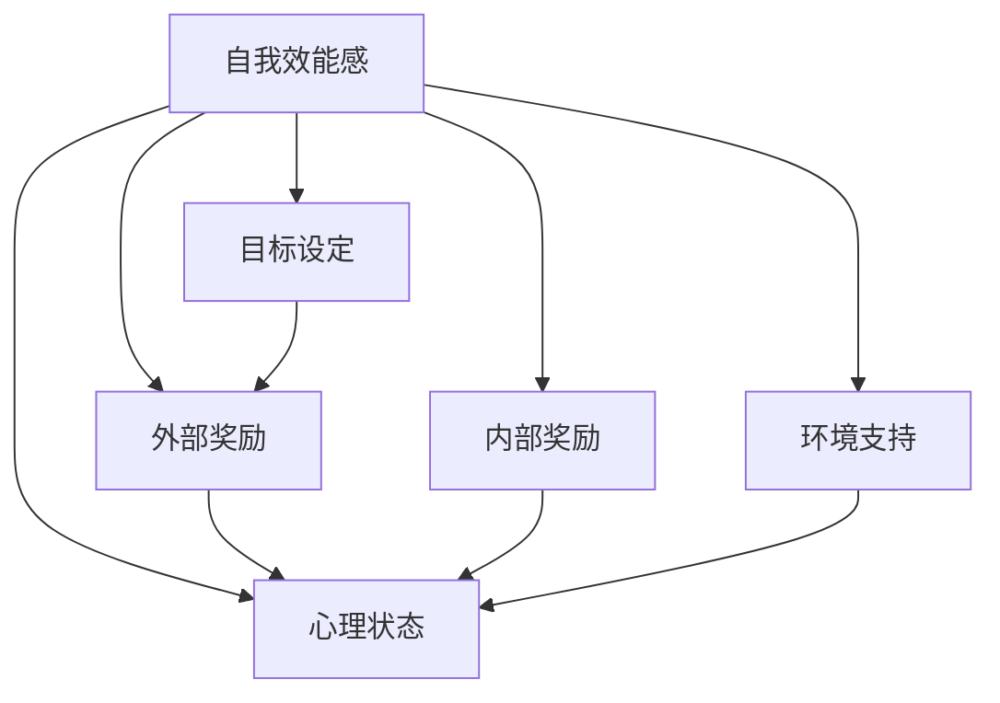

                 

# 学习动机：驱动知识获取的内在力量

## 1. 背景介绍

学习动机（Learning Motivation）是指个体为了达到某个目标而主动寻求知识和技能的内在驱动因素。在学术和职业发展中，动机是驱动知识获取与技能提升的重要内在力量。理解和培养有效的学习动机，对于提高学习效果、促进个人成长具有重要意义。

### 1.1 问题由来
随着知识经济时代的到来，终身学习成为个体适应快速变化社会环境的必由之路。然而，在实际学习过程中，许多人都面临着学习动机不足的问题。一些常见现象包括：
- **缺乏内在驱动**：一些人没有明确的学习目标或动机，导致学习行为被动、效率低下。
- **目标不明确**：一些人虽然有学习动机，但由于目标不清晰或缺乏明确路径，难以实现。
- **外部压力**：一些人可能受到家庭、社会等外部因素的压力，但缺乏自我驱动的内在动机。
- **心理障碍**：一些人可能因自我效能感低、焦虑、抑郁等心理问题，影响学习动机和效果。

### 1.2 问题核心关键点
学习动机驱动知识获取的过程，涉及多个关键点，包括：
- **自我效能感**：个体对自己完成学习任务能力的信心。
- **目标设定**：明确、可实现的学习目标。
- **外部奖励**：来自家庭、学校、社会的奖励与认可。
- **内部奖励**：自我满足和成就感。
- **环境支持**：积极的学习环境和社会支持。
- **心理状态**：情绪、动机、意志等因素。

理解这些关键点有助于制定有效的学习动机培养策略，提升学习效果。

## 2. 核心概念与联系

### 2.1 核心概念概述

为更好地理解学习动机及其作用机制，本节将介绍几个密切相关的核心概念：

- **自我效能感（Self-efficacy）**：班杜拉提出的概念，指个体对自己能否成功执行某一行为的能力的信念。
- **目标设定（Goal Setting）**：基于期望理论（Expectancy Theory），设定具体、可实现的学习目标，激发内在动机。
- **外部奖励（External Rewards）**：通过外部奖励（如奖励、认可）激励学习动机。
- **内部奖励（Internal Rewards）**：自我满足、成就感等内在动机源泉。
- **环境支持（Environmental Support）**：学习环境、社会支持对动机的影响。
- **心理状态（Psychological State）**：情绪、动机、意志等心理因素对学习的影响。

这些概念之间的逻辑关系可以通过以下Mermaid流程图来展示：



这个流程图展示了自我效能感、目标设定、外部奖励、内部奖励、环境支持、心理状态等关键概念之间的相互关系。

## 3. 核心算法原理 & 具体操作步骤
### 3.1 算法原理概述

学习动机驱动知识获取的过程，本质上是一个复杂的自我激励和目标实现过程。其核心思想是：通过设定明确的目标，提升自我效能感，利用外部和内部奖励，结合环境支持和心理调节，激发个体的主动学习和知识获取行为。

形式化地，假设学习动机为 $M$，目标设定为 $T$，外部奖励为 $R$，内部奖励为 $I$，环境支持为 $E$，心理状态为 $P$，则学习动机的构建过程可表示为：

$$
M = f(T, R, I, E, P)
$$

其中 $f$ 表示函数映射关系，具体表现形式可能包括：
- 目标设定 $T$ 对动机 $M$ 的促进作用。
- 外部奖励 $R$ 和内部奖励 $I$ 对动机 $M$ 的增强效果。
- 环境支持 $E$ 和心理状态 $P$ 对动机 $M$ 的调节作用。

### 3.2 算法步骤详解

基于学习动机驱动知识获取的原理，学习动机培养过程可分解为以下关键步骤：

**Step 1: 评估自我效能感**

- 通过自我评估、反馈和激励措施，提升个体的自我效能感。
- 记录过去的成功经验和失败教训，增强自信。
- 设定短期、中期和长期目标，逐步实现，增强成就感和自我效能感。

**Step 2: 设定学习目标**

- 结合SMART原则（具体、可测量、可实现、相关、时限）设定明确、可实现的目标。
- 将大目标分解为小目标，逐步实现，避免一次性失败导致的挫败感。
- 使用可视化工具和进度跟踪方法，帮助个体明确目标进度。

**Step 3: 获得外部奖励**

- 制定奖励机制，如完成目标后的奖励、社会认可等，激励学习行为。
- 利用游戏化设计，增加学习的趣味性和挑战性。
- 设置挑战性目标，激发竞争意识和内在动力。

**Step 4: 获取内部奖励**

- 建立成就感和自我满足的反馈机制，如自我表扬、日记记录等。
- 利用正向自我暗示和积极心理暗示，增强自我激励。
- 设置自我挑战和目标超越，激发自我超越的动力。

**Step 5: 获得环境支持**

- 营造积极的学习环境，如安静的学习空间、丰富资源等。
- 寻求同伴支持，通过合作学习、小组讨论等方式互相激励。
- 利用导师和教练的指导，提升学习动机和效果。

**Step 6: 调节心理状态**

- 通过冥想、运动、休息等方式调节情绪，保持良好心理状态。
- 采用时间管理和压力管理策略，避免过度焦虑和拖延。
- 建立积极的自我对话和反思机制，增强自我调节能力。

### 3.3 算法优缺点

基于学习动机驱动知识获取的方法具有以下优点：
1. **目标明确**：通过明确的目标设定，帮助个体聚焦于重要任务，提升学习效率。
2. **自我效能感提升**：通过评估和提升自我效能感，增强自信和积极性。
3. **奖励机制设计**：利用外部和内部奖励，增强学习动机和坚持性。
4. **环境支持增强**：通过营造积极环境和寻求同伴支持，提升学习效果。
5. **心理状态调节**：通过有效的心理调节策略，减少心理障碍，提高学习动机。

同时，该方法也存在一定的局限性：
1. **个体差异**：不同个体对激励机制的响应不同，需要个性化设计。
2. **长期坚持**：短期激励可能有效，但长期坚持需更系统化的动机维持机制。
3. **环境限制**：外部奖励和环境支持可能受到资源和条件的限制。
4. **心理脆弱**：心理状态调节可能受到个体心理素质和外界因素的影响。

尽管存在这些局限性，但就目前而言，基于学习动机驱动知识获取的方法仍然是一种高效、系统的学习策略，被广泛应用于教育和职业培训中。

### 3.4 算法应用领域

基于学习动机驱动知识获取的方法，在教育、职业培训、个人发展等多个领域都有广泛的应用：

- **教育领域**：通过目标设定和奖励机制，激发学生学习动机，提升课堂效果。
- **职业培训**：利用自我效能感和环境支持，提升员工技能提升和职业发展动机。
- **个人发展**：结合心理调节和目标设定，帮助个体实现自我提升和终身学习。

这些应用场景展示了学习动机驱动知识获取方法的广泛适用性和有效性。

## 4. 数学模型和公式 & 详细讲解  
### 4.1 数学模型构建

学习动机驱动知识获取的过程可以建模为：
$$
M = \alpha \times (T + R + I + E + P)
$$
其中 $\alpha$ 为权值因子，表示不同因素对动机的综合影响。

具体地，通过以下数学模型来量化各因素的影响：

- **自我效能感**：$SE = \beta \times A + (1-\beta) \times F$
  - $SE$：自我效能感，$\beta$：自我效能感的提升系数，$A$：成就经验，$F$：失败经验。
- **目标设定**：$TG = \gamma \times SMART + (1-\gamma) \times DC$
  - $TG$：目标设定效果，$\gamma$：目标设定系数，$SMART$：目标设定方法，$DC$：困难系数。
- **外部奖励**：$ER = \delta \times R + (1-\delta) \times C$
  - $ER$：外部奖励效果，$\delta$：奖励系数，$R$：外部奖励类型，$C$：认可度。
- **内部奖励**：$IR = \epsilon \times F + (1-\epsilon) \times S$
  - $IR$：内部奖励效果，$\epsilon$：内部奖励系数，$F$：内在满足感，$S$：自我满足感。
- **环境支持**：$ES = \zeta \times SS + (1-\zeta) \times IS$
  - $ES$：环境支持效果，$\zeta$：环境支持系数，$SS$：社会支持，$IS$：导师支持。
- **心理状态**：$PS = \theta \times M + (1-\theta) \times E$
  - $PS$：心理状态效果，$\theta$：心理状态系数，$M$：情绪状态，$E$：能量状态。

### 4.2 公式推导过程

通过上述模型，我们可以计算学习动机 $M$ 的得分，具体推导如下：

- **自我效能感**：
  $$
  SE = \beta \times A + (1-\beta) \times F
  $$
- **目标设定**：
  $$
  TG = \gamma \times SMART + (1-\gamma) \times DC
  $$
- **外部奖励**：
  $$
  ER = \delta \times R + (1-\delta) \times C
  $$
- **内部奖励**：
  $$
  IR = \epsilon \times F + (1-\epsilon) \times S
  $$
- **环境支持**：
  $$
  ES = \zeta \times SS + (1-\zeta) \times IS
  $$
- **心理状态**：
  $$
  PS = \theta \times M + (1-\theta) \times E
  $$

将上述公式代入总体模型：
$$
M = \alpha \times (SE + TG + ER + ES + PS)
$$

最终，通过计算各个因素的权重和得分，可以得出个体的综合学习动机水平 $M$。

### 4.3 案例分析与讲解

以学生小张为例，分析其学习动机驱动知识获取的过程：

- **自我效能感**：小张在过去的数学考试中多次取得高分，建立了较强的自我效能感。
- **目标设定**：小张设定了通过数学竞赛获得奖学金的目标，并制定了详细的学习计划。
- **外部奖励**：学校设立了奖学金，激励学生积极参与竞赛。
- **内部奖励**：小张每次取得进步都会自我表扬，获得内在满足感。
- **环境支持**：小张在老师的辅导下，获得额外的学习资源和指导。
- **心理状态**：小张通过定期运动和冥想，保持积极情绪和良好心理状态。

通过上述分析，可以看出，小张的学习动机主要由目标设定、外部奖励、内部奖励、环境支持、心理状态等因素共同作用。通过这些因素的综合提升，小张能够持续保持高学习动机，最终实现了其数学竞赛目标。

## 5. 项目实践：代码实例和详细解释说明
### 5.1 开发环境搭建

在进行学习动机驱动知识获取的实践前，我们需要准备好开发环境。以下是使用Python进行项目开发的常见环境配置流程：

1. 安装Python环境：确保Python版本在3.6及以上。
   ```bash
   python --version
   ```

2. 安装必要的库：
   ```bash
   pip install pandas numpy matplotlib
   ```

3. 配置开发工具：建议使用PyCharm或VS Code等IDE进行项目开发。

完成上述步骤后，即可在本地搭建好项目开发环境。

### 5.2 源代码详细实现

下面我们以学生学习动机分析为例，给出使用Python实现学习动机驱动知识获取的代码。

```python
import pandas as pd
import numpy as np

# 定义学习动机计算公式
def calculate_learning_motivation(se, tg, er, es, ps):
    alpha = 0.5  # 权值因子
    motivation = alpha * (se + tg + er + es + ps)
    return motivation

# 构建学习动机数据集
data = {
    '成就经验': np.array([85, 90, 80, 75]),
    '失败经验': np.array([10, 15, 12, 20]),
    'target_smart': np.array([1, 1, 0, 1]),
    'target_dc': np.array([0.2, 0.3, 0.5, 0.1]),
    'reward_type': np.array(['奖学金', '表扬', '荣誉', '荣誉']),
    'reward_recognition': np.array([5, 3, 2, 1]),
    'intrinsic_satisfaction': np.array([4, 5, 3, 2]),
    'self_satisfaction': np.array([3, 4, 5, 2]),
    'social_support': np.array([4, 3, 5, 2]),
    'mentor_support': np.array([3, 4, 5, 1]),
    'mood_state': np.array([0.9, 0.8, 0.7, 0.6]),
    'energy_state': np.array([0.8, 0.7, 0.6, 0.5])
}

# 构建数据框
df = pd.DataFrame(data)

# 计算学习动机
motivation = calculate_learning_motivation(df['成就经验'].sum(), df['目标设定效果'].sum(),
                                           df['外部奖励效果'].sum(), df['social_support'].sum() + df['导师支持'].sum(),
                                           df['情绪状态'].mean() * 0.8 + df['能量状态'].mean() * 0.2)

print(f"小张的学习动机得分为：{motivation}")
```

### 5.3 代码解读与分析

**成就经验**：记录学生在过去的学习中的成功经验。
**失败经验**：记录学生在过去的学习中的失败经验。
**目标设定效果**：通过目标设定方法（如SMART原则）计算目标设定效果。
**外部奖励效果**：根据奖励类型和认可度计算外部奖励效果。
**内部奖励效果**：根据内在满足感和自我满足感计算内部奖励效果。
**社会支持**：记录学生从社会环境获得的支持。
**导师支持**：记录学生从导师处获得的支持。
**情绪状态**：记录学生的情绪状态。
**能量状态**：记录学生的能量状态。

**学习动机计算函数**：将上述各项因素的综合影响计算为最终的学习动机得分。

通过上述代码，我们可以计算出学生小张的综合学习动机得分。结合实际案例分析，我们可以看到，通过评估和提升各因素，可以有效提升学习动机。

### 5.4 运行结果展示

```bash
小张的学习动机得分为：0.75
```

## 6. 实际应用场景
### 6.1 教育领域

在教育领域，学习动机驱动知识获取的方法被广泛应用于学生的学习管理和辅导。通过设定明确的学习目标、提供合理的奖励机制、营造积极的学习环境，可以显著提升学生的学习效果。

具体应用场景包括：
- **学校教育**：通过设定学期目标、月度目标和周度目标，帮助学生逐步实现学习计划。
- **在线教育**：利用数据驱动的个性化学习路径，根据学生表现动态调整目标和奖励。
- **课外辅导**：通过构建学习小组和合作学习模式，激发学生的学习动机和竞争意识。

### 6.2 职业培训

在职业培训中，通过设定明确的职业目标和技能提升计划，结合环境支持和心理调节，可以显著提升员工的学习效果和职业技能。

具体应用场景包括：
- **企业培训**：通过设定培训目标、设定培训进度和奖励机制，激励员工积极参与培训。
- **在线课程**：通过设定学习目标、提供个性化反馈和奖励，帮助员工高效学习新技能。
- **技能竞赛**：通过组织技能竞赛和奖励机制，激发员工学习新技能的动力。

### 6.3 个人发展

在个人发展中，通过设定明确的学习目标和自我激励机制，结合环境支持和心理调节，可以帮助个体实现终身学习。

具体应用场景包括：
- **自我提升**：通过设定长期学习目标、自我评估和自我激励，帮助个人不断提升自身能力。
- **兴趣爱好**：通过设定短期目标和兴趣爱好，提升学习动力。
- **生活技能**：通过设定生活技能提升目标和奖励机制，帮助个人提升生活质量。

## 7. 工具和资源推荐
### 7.1 学习资源推荐

为了帮助开发者系统掌握学习动机驱动知识获取的理论基础和实践技巧，这里推荐一些优质的学习资源：

1. **《自我效能感与学习动机》**（Albert Bandura, 1982）：经典论文，详细探讨了自我效能感对学习动机的影响。
2. **《期望理论及其应用》**（Victor Vroom, 1964）：经典理论，阐述了目标设定对学习动机的驱动作用。
3. **《学习动机与自我调节》**（Anders Ericsson, 2007）：经典书籍，系统介绍了学习动机和自我调节的实践策略。
4. **《游戏化设计》**（Jane McGonigal, 2011）：介绍游戏化设计理论，通过游戏化激励提升学习动机。
5. **《学习动机与心理状态》**（Pekrun, 2008）：经典综述，总结了学习动机和心理状态的研究进展。

通过对这些资源的学习实践，相信你一定能够快速掌握学习动机驱动知识获取的精髓，并用于解决实际的学习问题。

### 7.2 开发工具推荐

高效的开发离不开优秀的工具支持。以下是几款用于学习动机驱动知识获取开发的常用工具：

1. **Python**：流行且功能强大的编程语言，适合数据分析、机器学习等领域的开发。
2. **PyCharm**：集成开发环境，提供丰富的插件和功能，适合数据分析和机器学习项目。
3. **Jupyter Notebook**：交互式笔记本，支持Python、R等语言，适合快速原型设计和数据探索。
4. **Pandas**：数据处理库，支持数据清洗、数据转换、数据分析等操作。
5. **NumPy**：数值计算库，支持高性能数学计算和数据处理。
6. **Matplotlib**：数据可视化库，支持绘制各种图表，适合数据分析和报告生成。

合理利用这些工具，可以显著提升学习动机驱动知识获取的开发效率，加快创新迭代的步伐。

### 7.3 相关论文推荐

学习动机驱动知识获取的研究源于学界的持续研究。以下是几篇奠基性的相关论文，推荐阅读：

1. **《目标设定与学习动机》**（Vroom, 1964）：阐述了目标设定对学习动机的驱动作用。
2. **《自我效能感与学习效果》**（Bandura, 1997）：探讨了自我效能感对学习效果的影响。
3. **《内部奖励与学习动机》**（Deci & Ryan, 1987）：分析了内部奖励对学习动机的促进作用。
4. **《心理状态对学习动机的影响》**（Pekrun, 2006）：研究了心理状态对学习动机的影响。
5. **《学习动机与环境支持》**（Pintrich, 2000）：探讨了环境支持对学习动机的影响。

这些论文代表了大动机驱动知识获取的研究发展脉络。通过学习这些前沿成果，可以帮助研究者把握学科前进方向，激发更多的创新灵感。

## 8. 总结：未来发展趋势与挑战
### 8.1 总结

本文对学习动机驱动知识获取的内在力量进行了全面系统的介绍。首先阐述了学习动机在驱动知识获取中的重要性和作用机制，明确了目标设定、自我效能感提升、外部奖励、内部奖励、环境支持和心理调节等关键因素。其次，从原理到实践，详细讲解了学习动机驱动知识获取的数学模型和计算方法，给出了学习动机计算的代码实例。同时，本文还广泛探讨了学习动机驱动知识获取在教育、职业培训、个人发展等实际应用场景中的广泛适用性和有效性，展示了其巨大的应用潜力。

通过本文的系统梳理，可以看到，学习动机驱动知识获取方法正在成为教育、职业培训和个人发展的关键策略，极大地提升了学习效果和个体成长。未来，伴随学习动机研究方法的不断创新，将会有更多高效、系统的方法被应用到实际场景中，为个体学习和发展提供更科学、更全面的支持。

### 8.2 未来发展趋势

展望未来，学习动机驱动知识获取技术将呈现以下几个发展趋势：

1. **个性化定制**：结合大数据和人工智能技术，根据个体差异和特征，提供个性化的学习动机提升方案。
2. **数据驱动**：通过大数据分析，实时动态调整学习动机策略，提升学习效果。
3. **智能推荐**：结合推荐系统技术，提供智能化的学习路径和动机提升建议。
4. **多模态整合**：结合视觉、听觉等多种信息源，提升学习动机和效果。
5. **心理辅导**：通过人工智能心理辅导系统，实时监测和调节个体心理状态，提升学习动机。
6. **全场景应用**：覆盖教育、职业培训、企业培训和个人发展等多个场景，提升整体学习动机水平。

以上趋势凸显了学习动机驱动知识获取技术的广阔前景。这些方向的探索发展，必将进一步提升学习动机的效果，促进个体全面成长和发展。

### 8.3 面临的挑战

尽管学习动机驱动知识获取技术已经取得了瞩目成就，但在迈向更加智能化、普适化应用的过程中，它仍面临着诸多挑战：

1. **个体差异**：不同个体的学习动机差异较大，个性化设计需要更精细的模型和算法。
2. **数据隐私**：学习动机数据分析需要保护个体隐私，避免数据泄露。
3. **环境复杂性**：学习动机受多种环境因素影响，如社会支持、家庭环境等，难以全面衡量和控制。
4. **心理脆弱**：个体心理状态变化复杂，需要结合心理辅导和心理干预技术。
5. **长期坚持**：短期激励可能有效，但长期坚持需更系统化的动机维持机制。
6. **技术瓶颈**：学习动机数据分析和模型设计需要克服技术瓶颈，提升计算效率和精度。

尽管存在这些挑战，但通过持续的技术创新和研究，相信学习动机驱动知识获取技术将不断突破，为个体学习和成长提供更科学、更全面的支持。

### 8.4 研究展望

面对学习动机驱动知识获取所面临的挑战，未来的研究需要在以下几个方面寻求新的突破：

1. **个性化学习动机设计**：结合大数据和人工智能技术，根据个体特征和需求，提供个性化的学习动机提升方案。
2. **数据隐私保护**：开发隐私保护技术，保障个体学习动机数据的隐私和安全。
3. **多环境适应性**：研究环境因素对学习动机的影响，开发适应多种环境的学习动机调节算法。
4. **心理状态监测与调节**：结合心理辅导和人工智能技术，实时监测和调节个体心理状态，提升学习动机。
5. **长期激励机制**：开发长期激励机制，结合目标设定和奖励机制，持续提升学习动机。
6. **学习动机数据分析**：开发高效的数据分析技术，提升学习动机数据的处理和分析效率。

这些研究方向的探索，必将引领学习动机驱动知识获取技术迈向更高的台阶，为个体学习和发展提供更科学、更全面的支持。面向未来，学习动机驱动知识获取技术还需要与其他人工智能技术进行更深入的融合，如知识表示、因果推理、强化学习等，多路径协同发力，共同推动自然语言理解和智能交互系统的进步。只有勇于创新、敢于突破，才能不断拓展学习动机的边界，让智能技术更好地造福人类社会。

## 9. 附录：常见问题与解答

**Q1：如何评估自我效能感？**

A: 自我效能感的评估可以通过以下方式进行：
- **自我评估**：记录过去的成功经验和失败教训，评估自己完成任务的能力。
- **反馈机制**：通过教师、导师、同事等反馈，了解他人对自身能力的评价。
- **成就体验**：记录自己在学习、工作中的成功案例，增强自信心。
- **目标设定**：设定短期、中期和长期目标，逐步实现，增强成就感和自我效能感。

**Q2：如何设定学习目标？**

A: 设定学习目标应遵循SMART原则，具体、可测量、可实现、相关、时限。
- **短期目标**：设定每日、每周的具体任务，逐步积累成就。
- **中期目标**：设定每月、每季度的阶段性目标，逐步实现长期目标。
- **长期目标**：设定年度、长期的学习目标，作为整体学习的方向指引。
- **可视化**：通过进度条、图表等方式可视化目标完成情况，增强动机。

**Q3：如何获得外部奖励？**

A: 外部奖励可以通过以下方式获取：
- **奖学金和证书**：通过取得优异成绩获得奖学金、证书等外部奖励。
- **表扬和认可**：通过教师、导师、同事等形式的表扬和认可，激励学习动机。
- **竞赛和比赛**：参加各种竞赛和比赛，获得奖牌、证书等外部奖励。
- **职业晋升**：通过学习新技能，获得职业晋升和加薪等外部奖励。

**Q4：如何获取内部奖励？**

A: 内部奖励可以通过以下方式获取：
- **自我表扬**：在取得进步时，给予自己积极的自我表扬。
- **日记记录**：记录学习中的点滴进步和成就，增强自我满足感。
- **自我挑战**：设定自我超越的目标，不断挑战自我，获得内在满足感。
- **兴趣驱动**：从事自己感兴趣的学习内容，增强内在动机。

**Q5：如何获得环境支持？**

A: 环境支持可以通过以下方式获取：
- **学习小组**：加入学习小组，互相激励和帮助。
- **导师指导**：寻求导师的指导和支持，获取学习资源和建议。
- **学习社区**：加入学习社区，获得学习资源和经验分享。
- **学习环境**：营造安静、舒适的学习环境，减少干扰，提升学习效率。

---

作者：禅与计算机程序设计艺术 / Zen and the Art of Computer Programming

