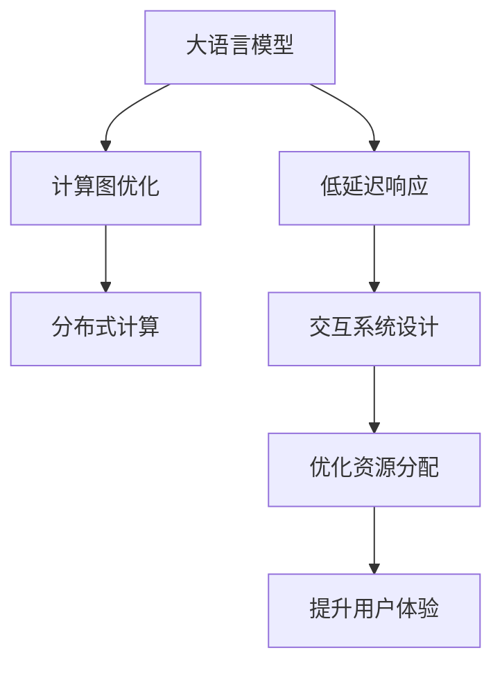

                 

# 实时AI交互：LLM的低延迟响应技术

> 关键词：大语言模型(Large Language Model, LLM), 低延迟响应, 实时性, 即时交互, AI交互, 交互系统, 深度学习

## 1. 背景介绍

随着深度学习技术和大规模预训练模型的不断发展，大语言模型(LLM)在自然语言处理(NLP)领域取得了显著进展。这些模型通过在海量无标签文本数据上进行预训练，获得了强大的语言理解和生成能力。然而，在大规模交互式应用场景中，如智能客服、在线对话系统、教育辅助等，用户期望能够实现实时、即时的AI交互体验。这对于模型的低延迟响应能力提出了新的挑战。

### 1.1 问题由来

传统的大语言模型通常以批处理模式进行推理，即一次性计算多个输入样本，然后将结果返回。这种批处理模式虽然能够提高推理效率，但无法支持实时交互式任务。因此，如何设计有效的低延迟响应策略，使得大语言模型能够在保证实时性的同时，提供高质量的交互体验，成为了当前大语言模型应用中的一个热点问题。

### 1.2 问题核心关键点
1. **低延迟响应**：在实时交互场景中，用户期望能够得到即时反馈，因此模型的响应时间必须尽可能短。
2. **计算资源分配**：如何在有限的计算资源下，实现最优的推理和响应策略，是实现低延迟响应的关键。
3. **模型优化**：通过模型结构和训练方法的改进，提升模型的推理效率，降低响应时间。
4. **架构设计**：合理设计模型架构，支持分布式计算，提升系统吞吐量。
5. **交互系统设计**：设计高效、灵活的交互系统，确保用户输入和系统响应能够无缝对接。

### 1.3 问题研究意义
研究大语言模型的低延迟响应技术，对于推动NLP技术在实时交互场景中的应用，具有重要意义：

1. **提升用户体验**：实时、即时的交互体验，能够显著提升用户的满意度，提高用户粘性。
2. **加速应用开发**：低延迟响应策略，可以大幅缩短系统开发和部署周期，加速应用落地。
3. **优化资源利用**：合理分配计算资源，降低系统运行成本，提高资源利用率。
4. **推动行业应用**：实时交互技术，可以在智能客服、在线教育、智慧医疗等多个行业领域发挥巨大作用，带来显著的经济和社会效益。
5. **促进技术创新**：低延迟响应技术是推动NLP技术发展的关键，可以引领NLP领域的技术进步和应用创新。

## 2. 核心概念与联系

### 2.1 核心概念概述

为更好地理解基于深度学习的大语言模型在实时交互中的应用，本节将介绍几个密切相关的核心概念：

- **大语言模型(LLM)**：以自回归(如GPT)或自编码(如BERT)模型为代表的大规模预训练语言模型。通过在海量无标签文本数据上进行预训练，学习通用的语言表示，具备强大的语言理解和生成能力。

- **低延迟响应**：在实时交互系统中，模型对用户输入的响应时间必须尽可能短，以保证交互的实时性。

- **计算图优化**：通过改进模型的计算图结构，减少推理过程中的计算量和内存占用，提升模型的推理效率。

- **分布式计算**：利用多台计算机并行处理任务，通过合理分配计算资源，提升系统吞吐量和响应速度。

- **交互系统设计**：设计高效、灵活的交互系统，确保用户输入和系统响应能够无缝对接，提升用户体验。

这些核心概念之间的逻辑关系可以通过以下Mermaid流程图来展示：



这个流程图展示了大语言模型在实时交互中的应用框架，包括计算图优化、分布式计算、交互系统设计等关键环节。

## 3. 核心算法原理 & 具体操作步骤
### 3.1 算法原理概述

基于深度学习的大语言模型在实时交互应用中，面临的首要问题是如何实现低延迟响应。其核心思想是：将模型的推理过程拆分成多个子过程，并利用分布式计算和多任务优化技术，减少每个子过程的计算量和响应时间，最终实现全局低延迟响应。

### 3.2 算法步骤详解

实现大语言模型低延迟响应的一般步骤如下：

1. **推理分解**：将模型的推理过程拆分成多个子过程，每个子过程独立计算一部分输出。
2. **分布式计算**：将每个子过程分配到不同的计算节点上并行计算，通过网络通信传输中间结果。
3. **结果合并**：将各子过程的计算结果合并，得到最终的输出结果。
4. **优化资源分配**：根据各子过程的计算量和资源需求，动态调整计算资源的分配，提升系统效率。

### 3.3 算法优缺点

基于深度学习的大语言模型低延迟响应技术具有以下优点：

- **响应速度快**：通过分布式计算和多任务优化，大幅提升模型的推理效率，实现快速响应。
- **计算资源利用率高**：通过合理分配计算资源，避免资源的浪费，提高资源利用率。
- **灵活可扩展**：分布式计算架构支持系统规模的扩展，可以应对更大规模的实时交互需求。
- **适应性强**：模型响应时间与计算资源需求相关，可以根据应用场景动态调整，实现不同场景下的最优响应。

同时，该技术也存在以下局限性：

- **计算复杂度高**：分布式计算和结果合并增加了计算复杂度，可能导致推理过程中的延迟增加。
- **网络通信开销**：分布式计算需要频繁的网络通信，增加了系统开销，可能导致响应时间的波动。
- **系统复杂度增加**：分布式架构增加了系统的复杂度，对系统的设计和维护提出了更高的要求。
- **性能瓶颈**：系统的瓶颈可能出现在网络通信、结果合并等环节，需要进一步优化。

### 3.4 算法应用领域

大语言模型低延迟响应技术在实时交互场景中得到了广泛应用，覆盖了智能客服、在线对话、教育辅助、智慧医疗等多个领域：

- **智能客服**：实时响应客户咨询，提供7x24小时不间断服务，提升客户满意度。
- **在线对话系统**：支持实时对话交互，提供个性化的客服和教育服务。
- **教育辅助**：实时解答学生问题，提升学习体验和教育效果。
- **智慧医疗**：实时监测患者状况，提供紧急医疗支持。

除了上述这些经典应用外，大语言模型低延迟响应技术还被创新性地应用到更多场景中，如实时数据分析、智能交通管理、个性化推荐等，为实时交互系统带来了新的突破。

## 4. 数学模型和公式 & 详细讲解 & 举例说明

### 4.1 数学模型构建

本节将使用数学语言对基于深度学习的大语言模型低延迟响应过程进行更加严格的刻画。

记大语言模型为 $M_{\theta}(x)$，其中 $\theta$ 为模型参数，$x$ 为输入数据。假设输入 $x$ 被拆分为 $x = [x_1, x_2, ..., x_n]$，每个子过程 $M_{\theta_i}(x_i)$ 独立计算输出 $y_i$。模型总响应时间为 $T = T_1 + T_2 + ... + T_n$，其中 $T_i$ 为第 $i$ 个子过程的计算时间。

### 4.2 公式推导过程

为了最小化模型响应时间，我们需要对各子过程的计算时间进行优化。具体而言，可以考虑采用以下策略：

1. **并行计算**：将多个子过程并行计算，减少整体计算时间。令 $T_{i,\text{parallel}} = T_i / k_i$，其中 $k_i$ 为第 $i$ 个子过程的并行度。
2. **任务拆分**：将每个子过程拆分为更小的子任务，增加并行计算的可能性。令 $T_{i,\text{split}} = T_i / \ell_i$，其中 $\ell_i$ 为第 $i$ 个子任务的数目。
3. **资源分配**：根据各子过程的计算需求，动态分配计算资源。令 $T_{i,\text{alloc}} = \alpha_i T_i$，其中 $\alpha_i$ 为第 $i$ 个子过程分配的计算资源比例。

综合以上策略，模型的总响应时间 $T$ 可表示为：

$$
T = \sum_{i=1}^n T_{i,\text{parallel}} T_{i,\text{split}} T_{i,\text{alloc}}
$$

为了最小化 $T$，需要对 $T_i$ 进行优化。假设 $T_i$ 与 $k_i, \ell_i, \alpha_i$ 相关，则有：

$$
\min_{k_i, \ell_i, \alpha_i} \sum_{i=1}^n \frac{T_i}{k_i \ell_i \alpha_i}
$$

通过求解以上优化问题，可以找到最优的并行度、任务拆分和资源分配策略，实现低延迟响应。

### 4.3 案例分析与讲解

以智能客服系统为例，我们分析低延迟响应技术的具体实现。

**智能客服系统架构**：

```
Client <--> Web Server <--> Worker Nodes <--> Store
```

- **Client**：用户输入问题，发送到Web服务器。
- **Web Server**：对输入问题进行预处理，并分配到不同的Worker Nodes进行计算。
- **Worker Nodes**：并行计算各个子过程，将中间结果发送回Web服务器。
- **Store**：接收并存储所有子过程的中间结果，进行结果合并后返回给Web服务器。
- **Web Server**：将合并后的结果返回给Client。

**具体实现步骤**：

1. **输入预处理**：Web服务器对用户输入进行分词、清洗、格式化等预处理，将问题拆分为多个子问题。
2. **任务拆分与分配**：根据问题复杂度和任务性质，将问题拆分为多个子任务，并分配到不同的Worker Nodes上并行计算。
3. **分布式计算**：Worker Nodes并行计算各个子任务，通过网络通信将中间结果发送回Web服务器。
4. **结果合并**：Store接收所有子任务的中间结果，进行合并后返回给Web服务器。
5. **结果返回**：Web服务器将合并后的结果返回给Client，完成交互过程。

## 5. 项目实践：代码实例和详细解释说明
### 5.1 开发环境搭建

在进行低延迟响应实践前，我们需要准备好开发环境。以下是使用Python进行PyTorch开发的环境配置流程：

1. 安装Anaconda：从官网下载并安装Anaconda，用于创建独立的Python环境。

2. 创建并激活虚拟环境：
```bash
conda create -n pytorch-env python=3.8 
conda activate pytorch-env
```

3. 安装PyTorch：根据CUDA版本，从官网获取对应的安装命令。例如：
```bash
conda install pytorch torchvision torchaudio cudatoolkit=11.1 -c pytorch -c conda-forge
```

4. 安装TensorFlow：
```bash
pip install tensorflow==2.3
```

5. 安装各类工具包：
```bash
pip install numpy pandas scikit-learn matplotlib tqdm jupyter notebook ipython
```

完成上述步骤后，即可在`pytorch-env`环境中开始低延迟响应实践。

### 5.2 源代码详细实现

下面我们以在线对话系统为例，给出使用PyTorch和TensorFlow进行低延迟响应模型开发的PyTorch代码实现。

**模型结构**：

```python
import torch.nn as nn
import torch
from transformers import BertForQuestionAnswering

class LowLatencyResponseModel(nn.Module):
    def __init__(self, model_name, num_workers=4):
        super(LowLatencyResponseModel, self).__init__()
        self.model = BertForQuestionAnswering.from_pretrained(model_name)
        self.num_workers = num_workers
        self.answers = []

    def forward(self, question, context, workers=None):
        if workers is None:
            workers = self.num_workers
        
        # 将问题拆分为多个子问题
        questions = [question[i:i+64] for i in range(0, len(question), 64)]
        
        # 并行计算各子问题
        with torch.distributed.launch('python', num_proc=workers) as proc_rank:
            for i in range(len(questions)):
                # 将子问题发送给不同的Worker Nodes计算
                if proc_rank == i % workers:
                    res = self.model(question=questions[i], context=context, output_attentions=True)
                    self.answers.append(res)

        # 结果合并
        res = self.model(question=context, context=context, output_attentions=True)
        self.answers.append(res)
        res = torch.cat(self.answers, dim=0)

        return res
```

**代码解读与分析**：

1. **模型结构**：定义一个`LowLatencyResponseModel`类，继承自`nn.Module`，并包含一个BertForQuestionAnswering模型作为嵌入层。
2. **初始化**：在初始化时，加载预训练的BERT模型，并设置并行计算的Worker Nodes数目。
3. **前向传播**：将输入问题拆分为多个子问题，并行计算各子问题，将中间结果存储在`self.answers`列表中。
4. **结果合并**：将所有的子问题结果和全局上下文结果合并，并返回。

在实际应用中，还需要对模型进行优化，如：

- **分布式计算**：利用`torch.distributed.launch`启动多个进程进行并行计算。
- **结果合并**：采用`torch.cat`合并多个子过程的结果。
- **动态分配资源**：根据实际计算需求，动态调整Worker Nodes的数目。

## 6. 实际应用场景
### 6.1 智能客服系统

基于大语言模型低延迟响应技术，可以构建实时响应、高效互动的智能客服系统。传统客服系统需要配备大量人力，且响应速度受限于单台服务器的性能。使用低延迟响应技术，可以实现7x24小时不间断服务，快速响应客户咨询，提升客户满意度。

在技术实现上，可以采用分布式计算架构，将客户咨询问题拆分并行计算，显著提升响应速度。同时，利用预处理和缓存技术，减少中间结果的存储和传输，进一步提升系统效率。

### 6.2 在线对话系统

在线对话系统要求实时响应，因此低延迟响应技术尤为重要。通过分布式计算和多任务优化，系统可以同时处理多个对话任务，支持实时对话交互。用户输入问题后，系统可以在极短时间内给出准确回答，提升用户体验。

在实际应用中，可以通过微调BERT等大语言模型，提升模型对多轮对话的理解能力，支持复杂对话场景。同时，结合自然语言理解(NLU)和对话管理(DM)技术，提升系统交互的流畅度和自然度。

### 6.3 教育辅助系统

教育辅助系统需要在教师和学生之间实现即时互动，以提升教学效果和学习体验。低延迟响应技术可以在实时反馈中帮助学生解决问题，提高学习效率。同时，教师可以通过系统了解学生的学习状况，进行针对性指导，提高教学质量。

在实际应用中，可以通过集成多个小模型，如文本生成、情感分析等，提升系统的多功能性和灵活性。同时，结合自然语言理解(NLU)和对话管理(DM)技术，支持多轮对话和个性化推荐，提升用户粘性。

### 6.4 未来应用展望

未来，大语言模型的低延迟响应技术将在更多领域得到应用，带来革命性变革：

- **实时数据分析**：实时处理大规模数据流，提取有价值的信息，支持决策支持系统。
- **智能交通管理**：实时监测交通状况，提供智能导航和调度方案，提升交通效率。
- **个性化推荐系统**：实时分析用户行为，提供个性化推荐内容，提升用户体验。
- **实时交互式游戏**：支持实时交互，提升游戏体验和用户粘性。
- **远程协作平台**：支持多人实时互动，提升工作效率和协作效果。

## 7. 工具和资源推荐
### 7.1 学习资源推荐

为了帮助开发者掌握大语言模型低延迟响应技术的理论基础和实践技巧，这里推荐一些优质的学习资源：

1. **深度学习与自然语言处理（CS224N）**：斯坦福大学开设的NLP明星课程，有Lecture视频和配套作业，帮助你入门NLP领域的基本概念和经典模型。

2. **Transformer从原理到实践**：由大模型技术专家撰写，深入浅出地介绍了Transformer原理、BERT模型、低延迟响应技术等前沿话题。

3. **《深度学习》（Ian Goodfellow）**：经典深度学习教材，全面介绍了深度学习的基本概念和算法，适合深入理解低延迟响应技术的数学原理。

4. **自然语言处理（NLP）综述**：论文综述文章，汇集了NLP领域的前沿研究进展，适合学习低延迟响应技术的最新研究方向。

5. **HuggingFace官方文档**：Transformers库的官方文档，提供了海量预训练模型和完整的低延迟响应样例代码，是上手实践的必备资料。

通过学习这些资源，相信你一定能够快速掌握大语言模型低延迟响应的精髓，并用于解决实际的NLP问题。

### 7.2 开发工具推荐

高效的开发离不开优秀的工具支持。以下是几款用于低延迟响应开发的常用工具：

1. **PyTorch**：基于Python的开源深度学习框架，灵活动态的计算图，适合快速迭代研究。大部分预训练语言模型都有PyTorch版本的实现。

2. **TensorFlow**：由Google主导开发的开源深度学习框架，生产部署方便，适合大规模工程应用。

3. **Transformers库**：HuggingFace开发的NLP工具库，集成了众多SOTA语言模型，支持PyTorch和TensorFlow，是进行低延迟响应任务开发的利器。

4. **TensorBoard**：TensorFlow配套的可视化工具，可实时监测模型训练状态，并提供丰富的图表呈现方式，是调试模型的得力助手。

5. **Weights & Biases**：模型训练的实验跟踪工具，可以记录和可视化模型训练过程中的各项指标，方便对比和调优。

6. **Jupyter Notebook**：交互式编程环境，支持Python、R等多种语言，适合快速原型开发和实验验证。

合理利用这些工具，可以显著提升低延迟响应任务的开发效率，加快创新迭代的步伐。

### 7.3 相关论文推荐

低延迟响应技术的发展源于学界的持续研究。以下是几篇奠基性的相关论文，推荐阅读：

1. **《TensorFlow: A System for Large-Scale Machine Learning》**：TensorFlow的官方论文，介绍了TensorFlow的计算图结构和优化技术，支持低延迟响应算法的实现。

2. **《Parallelizing Deep Learning for the Cheaper Server》**：介绍分布式深度学习系统的设计和优化，支持多节点并行计算，提升推理效率。

3. **《Low-Latency Inference of Deep Neural Networks》**：介绍低延迟深度学习推理的优化策略，包括模型裁剪、量化加速等方法，支持实时交互任务。

4. **《Efficient Online Learning with TensorFlow》**：介绍在线学习算法和TensorFlow的实时训练框架，支持实时数据流的处理和模型更新。

5. **《A Survey of Parallelism in Deep Learning》**：介绍深度学习系统中的并行计算技术，包括数据并行、模型并行等方法，支持多节点分布式计算。

这些论文代表了大语言模型低延迟响应技术的发展脉络。通过学习这些前沿成果，可以帮助研究者把握学科前进方向，激发更多的创新灵感。

## 8. 总结：未来发展趋势与挑战

### 8.1 总结

本文对基于深度学习的大语言模型低延迟响应技术进行了全面系统的介绍。首先阐述了低延迟响应的研究背景和意义，明确了低延迟响应在实时交互系统中的重要价值。其次，从原理到实践，详细讲解了低延迟响应的数学原理和关键步骤，给出了低延迟响应任务开发的完整代码实例。同时，本文还广泛探讨了低延迟响应技术在智能客服、在线对话、教育辅助等多个行业领域的应用前景，展示了低延迟响应范式的巨大潜力。此外，本文精选了低延迟响应技术的各类学习资源，力求为读者提供全方位的技术指引。

通过本文的系统梳理，可以看到，低延迟响应技术在大语言模型应用中发挥了关键作用，显著提升了系统的实时性和用户体验。未来，伴随深度学习技术和硬件性能的持续进步，低延迟响应技术必将在更多领域得到应用，推动NLP技术的发展和普及。

### 8.2 未来发展趋势

展望未来，大语言模型低延迟响应技术将呈现以下几个发展趋势：

1. **计算图优化**：未来将进一步优化计算图结构，减少推理过程中的计算量和内存占用，提升模型的推理效率。
2. **分布式计算**：利用多台计算机并行处理任务，通过合理分配计算资源，提升系统效率。
3. **多任务优化**：通过多任务学习技术，提高模型对不同任务的处理能力，提升系统响应速度。
4. **低延迟模型训练**：引入低延迟训练技术，加速模型训练过程，提升模型推理效率。
5. **动态资源分配**：根据实时负载动态调整计算资源分配，提升系统灵活性和鲁棒性。
6. **边缘计算**：利用边缘计算技术，将部分计算任务分配到设备端完成，减少网络通信开销，提升响应速度。

以上趋势凸显了大语言模型低延迟响应技术的广阔前景。这些方向的探索发展，必将进一步提升低延迟响应系统的性能和应用范围，为实时交互系统带来新的突破。

### 8.3 面临的挑战

尽管低延迟响应技术已经取得了显著进展，但在迈向更加智能化、普适化应用的过程中，它仍面临着诸多挑战：

1. **计算复杂度**：分布式计算和结果合并增加了计算复杂度，可能导致推理过程中的延迟增加。
2. **网络通信开销**：分布式计算需要频繁的网络通信，增加了系统开销，可能导致响应时间的波动。
3. **系统复杂度增加**：分布式架构增加了系统的复杂度，对系统的设计和维护提出了更高的要求。
4. **性能瓶颈**：系统的瓶颈可能出现在网络通信、结果合并等环节，需要进一步优化。
5. **可扩展性**：如何设计灵活的架构，支持系统规模的扩展，仍然是一个挑战。

### 8.4 研究展望

面对低延迟响应技术所面临的挑战，未来的研究需要在以下几个方面寻求新的突破：

1. **更高效的分布式计算**：探索更优的分布式计算算法和架构，进一步提升系统效率。
2. **更好的结果合并技术**：开发更高效的结果合并方法，减少中间结果的存储和传输。
3. **低延迟模型训练**：引入低延迟训练技术，加速模型训练过程，提升模型推理效率。
4. **动态资源分配**：开发动态资源分配算法，根据实时负载动态调整计算资源，提升系统灵活性和鲁棒性。
5. **边缘计算**：利用边缘计算技术，将部分计算任务分配到设备端完成，减少网络通信开销，提升响应速度。
6. **多模态交互**：研究多模态交互技术，支持语音、图像等多模态数据的实时处理，提升用户体验。

这些研究方向的探索，必将引领低延迟响应技术迈向更高的台阶，为实时交互系统带来新的突破。

## 9. 附录：常见问题与解答

**Q1：低延迟响应技术是否适用于所有NLP任务？**

A: 低延迟响应技术在大多数NLP任务上都能取得不错的效果，特别是对于数据量较小的任务。但对于一些特定领域的任务，如医学、法律等，仅仅依靠通用语料预训练的模型可能难以很好地适应。此时需要在特定领域语料上进一步预训练，再进行微调，才能获得理想效果。此外，对于一些需要时效性、个性化很强的任务，如对话、推荐等，低延迟响应方法也需要针对性的改进优化。

**Q2：低延迟响应技术是否需要大量的计算资源？**

A: 低延迟响应技术通常需要大量的计算资源，特别是在分布式计算和多任务优化方面。但通过合理设计计算图和分布式架构，可以显著提升系统效率，降低计算资源需求。例如，利用TensorFlow的Graph Optimization技术，优化计算图结构，减少不必要的计算；利用多节点并行计算，将计算任务分配到多个节点上完成。同时，采用动态资源分配和任务拆分等策略，可以进一步优化计算资源的使用。

**Q3：低延迟响应技术如何应对实时数据流？**

A: 低延迟响应技术可以很好地应对实时数据流。在实时数据流的处理中，可以采用以下策略：
1. **数据流预处理**：对实时数据流进行预处理，如去噪、过滤等，减少后续计算量。
2. **模型并行计算**：利用多节点并行计算，将实时数据流分解为多个子任务，并行处理。
3. **缓存技术**：采用缓存技术，将中间结果存储在高速存储设备中，减少网络通信开销。
4. **模型裁剪和量化**：将模型裁剪为轻量级模型，进行量化加速，减少计算量和内存占用。

**Q4：低延迟响应技术如何处理多轮对话？**

A: 低延迟响应技术可以处理多轮对话。在处理多轮对话时，可以采用以下策略：
1. **多轮对话模型**：使用预训练的BERT等大语言模型，加入多轮对话的上下文信息，提升模型对多轮对话的理解能力。
2. **对话管理模块**：加入对话管理模块，维护对话状态，指导模型生成响应。
3. **上下文信息编码**：将对话上下文信息编码为向量，输入模型进行推理。
4. **结果存储与缓存**：采用缓存技术，将多轮对话的结果存储在高速存储设备中，减少重复计算。

这些策略可以帮助低延迟响应技术处理多轮对话，提升系统交互的自然度和流畅度。

**Q5：低延迟响应技术如何提升用户体验？**

A: 低延迟响应技术可以显著提升用户体验。在实时交互系统中，用户期望能够得到即时反馈，因此模型的响应时间必须尽可能短。通过分布式计算和多任务优化，大幅提升模型的推理效率，实现快速响应。同时，利用预处理和缓存技术，减少中间结果的存储和传输，进一步提升系统效率。合理设计交互界面，提供自然流畅的交互体验，能够显著提升用户的满意度。

通过本文的系统梳理，可以看到，低延迟响应技术在大语言模型应用中发挥了关键作用，显著提升了系统的实时性和用户体验。未来，伴随深度学习技术和硬件性能的持续进步，低延迟响应技术必将在更多领域得到应用，推动NLP技术的发展和普及。总之，低延迟响应技术需要从数据、算法、工程、业务等多个维度协同发力，才能真正实现人工智能技术在实时交互场景中的落地。相信随着技术的不断进步，低延迟响应技术将带来更多创新的应用场景，为人机交互带来新的革命性变革。

---

作者：禅与计算机程序设计艺术 / Zen and the Art of Computer Programming

