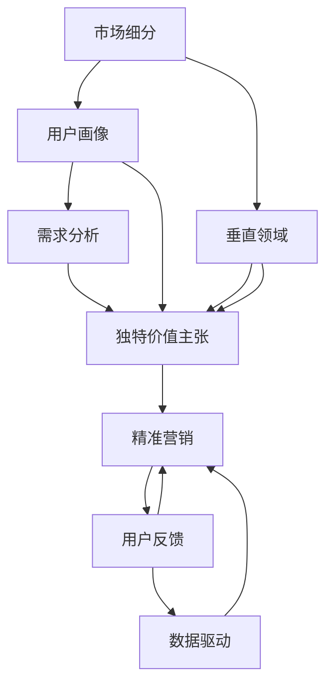

                 

# 小公司生存策略：精准服务垂直领域，满足独特价值需求

## 1. 背景介绍

在当今竞争激烈的市场环境中，小公司面临着巨大的生存压力。资源有限、市场占有率低，面对大型企业强大的品牌、技术、资金优势，小公司往往难以立足。但小公司的灵活性、快速响应市场变化的能力，也是大公司所不具备的。因此，如何精准定位市场细分领域，提供独特的价值需求，成为了小公司生存的关键。本文将从IT领域出发，深入探讨如何通过精准服务垂直领域，实现小公司的生存和发展策略。

## 2. 核心概念与联系

### 2.1 核心概念概述

为了更好地理解小公司如何通过精准服务垂直领域实现生存和发展策略，我们首先需要明确几个关键概念：

- **市场细分(Market Segmentation)**：根据消费者需求、购买行为、人口统计特征等将整体市场划分为多个子市场的过程。市场细分帮助小公司识别和定位目标用户群体。

- **独特价值主张(Uniqueness Value Proposition)**：小公司提供的产品或服务相比竞争对手的独特优势。这可以是技术领先、成本低廉、服务优质等。

- **垂直领域(Vertical Domain)**：与特定行业或市场细分紧密相关的领域。小公司通常需要在垂直领域内深耕，才能建立竞争优势。

- **精准营销(Precision Marketing)**：通过精确的目标定位和定制化的营销策略，最大化营销效果和用户转化率。

- **用户反馈(Feedback)**：用户对产品或服务的评价和建议。小公司应高度关注用户反馈，不断优化产品和服务。

- **数据驱动(Data-Driven)**：通过数据分析和挖掘，支持决策和优化过程。

这些概念构成了小公司精准服务垂直领域的基础，帮助小公司找到自己的生存空间和发展机会。

### 2.2 核心概念原理和架构的 Mermaid 流程图(Mermaid 流程节点中不要有括号、逗号等特殊字符)



该流程图展示了从小公司如何通过市场细分、需求分析、垂直领域定位、独特价值主张和精准营销的流程，最终实现对用户需求的精准服务。

## 3. 核心算法原理 & 具体操作步骤

### 3.1 算法原理概述

小公司精准服务垂直领域的策略，基于对目标市场和用户需求的深入分析。核心算法包括以下几个步骤：

1. **市场细分**：对整体市场进行细分，找到潜在的细分市场。
2. **用户画像**：根据细分市场，构建目标用户的详细画像，包括年龄、性别、职业、兴趣等。
3. **需求分析**：通过数据分析，识别目标用户的核心需求。
4. **垂直领域定位**：结合市场需求和公司资源，选择最适合的垂直领域进行深耕。
5. **独特价值主张**：设计独特的价值主张，解决用户痛点。
6. **精准营销**：实施定制化的营销策略，吸引并转化目标用户。
7. **用户反馈收集与分析**：收集用户反馈，持续优化产品和服务。
8. **数据驱动优化**：利用数据分析支持持续优化。

### 3.2 算法步骤详解

#### 3.2.1 市场细分

市场细分主要通过以下步骤实现：

1. **定义细分变量**：选择与用户需求和行为密切相关的细分变量。如年龄、性别、收入、地理位置、教育水平等。
2. **数据收集**：收集目标市场的数据，如用户调查、市场研究报告、社交媒体数据等。
3. **数据分析**：使用统计分析、聚类分析等方法，将市场划分为多个子市场。
4. **市场评估**：评估各子市场的规模、增长潜力、竞争程度等。

#### 3.2.2 用户画像构建

用户画像构建主要通过以下步骤实现：

1. **基础数据收集**：收集用户的基本信息，如年龄、性别、职业、教育背景等。
2. **行为数据收集**：收集用户的行为数据，如浏览记录、购买记录、使用习惯等。
3. **心理数据收集**：通过问卷调查、深度访谈等方法，收集用户的心理特征，如价值观、兴趣爱好、生活方式等。
4. **画像建模**：使用机器学习算法，如K-means、PCA等，构建用户画像模型。

#### 3.2.3 需求分析

需求分析主要通过以下步骤实现：

1. **数据准备**：收集与用户需求相关的数据，如用户评论、社交媒体数据、市场调研报告等。
2. **需求抽取**：使用自然语言处理技术，从文本数据中抽取用户需求，如产品功能、性能、价格等。
3. **需求分析**：使用文本分析、情感分析等方法，分析用户需求的优先级和重要性。
4. **需求匹配**：将用户需求与公司产品或服务的功能进行匹配，找到最符合用户需求的功能点。

#### 3.2.4 垂直领域定位

垂直领域定位主要通过以下步骤实现：

1. **资源评估**：评估公司的资源，如技术、资金、人力资源等。
2. **市场需求评估**：评估垂直领域的市场需求和增长潜力。
3. **竞争分析**：分析垂直领域内的竞争对手，评估他们的优势和劣势。
4. **选择领域**：结合市场需求和公司资源，选择最适合的垂直领域进行深耕。

#### 3.2.5 独特价值主张设计

独特价值主张设计主要通过以下步骤实现：

1. **用户痛点分析**：分析目标用户的痛点和需求，如质量问题、价格过高、服务不足等。
2. **竞争优势分析**：分析公司的竞争优势，如技术领先、成本低廉、服务优质等。
3. **价值主张设计**：根据用户痛点和竞争优势，设计独特的价值主张。

#### 3.2.6 精准营销策略实施

精准营销策略实施主要通过以下步骤实现：

1. **目标用户定位**：根据用户画像和需求分析，确定目标用户的特征。
2. **定制化内容制作**：根据目标用户的特征，制作符合他们需求的定制化内容。
3. **多渠道营销**：通过社交媒体、电子邮件、搜索引擎优化等多种渠道，推广定制化内容。
4. **效果监测与优化**：监测营销效果，根据数据反馈，不断优化营销策略。

#### 3.2.7 用户反馈收集与分析

用户反馈收集与分析主要通过以下步骤实现：

1. **反馈渠道建立**：建立用户反馈渠道，如在线客服、社交媒体、用户调查等。
2. **反馈收集**：收集用户反馈，包括产品建议、满意度、使用体验等。
3. **反馈分析**：使用文本分析、情感分析等方法，分析用户反馈的情感和内容。
4. **问题识别**：识别用户反馈中的常见问题和改进点。
5. **问题解决**：根据问题严重程度和影响范围，制定解决方案。

#### 3.2.8 数据驱动优化

数据驱动优化主要通过以下步骤实现：

1. **数据收集**：收集与产品、服务相关的数据，如用户行为数据、反馈数据等。
2. **数据分析**：使用数据挖掘、机器学习等技术，分析数据，找出优化点。
3. **优化实施**：根据分析结果，实施优化措施，如产品功能改进、服务流程优化等。
4. **效果评估**：评估优化措施的效果，确认是否达到预期目标。

### 3.3 算法优缺点

精准服务垂直领域的小公司生存策略具有以下优点：

1. **市场定位明确**：通过市场细分和需求分析，明确目标市场和用户需求，避免盲目竞争。
2. **用户需求满足度高**：精准营销策略确保产品和服务满足用户需求，提高用户满意度。
3. **资源利用高效**：根据市场需求和公司资源，选择适合的垂直领域，避免资源浪费。
4. **快速响应市场变化**：小公司灵活性高，可以快速响应市场变化，调整策略。

同时，该策略也存在以下缺点：

1. **市场细分难度高**：市场细分需要大量的数据和分析，对资源和技术要求较高。
2. **用户画像构建复杂**：用户画像的构建需要多源数据和复杂的分析模型，难度较大。
3. **需求分析耗时较长**：需求分析需要大量的数据和分析，耗时较长。
4. **精准营销成本高**：定制化内容的制作和多个渠道的推广，成本较高。

### 3.4 算法应用领域

精准服务垂直领域的小公司生存策略，广泛应用于IT领域的各个垂直行业，如：

- **软件开发**：通过市场细分和需求分析，提供符合用户需求的软件产品。
- **互联网服务**：通过精准营销策略，提供优质的互联网服务，如电子商务、在线教育等。
- **人工智能应用**：通过数据驱动优化，不断提升人工智能应用的效果和用户体验。
- **云服务**：通过用户画像构建和需求分析，提供符合用户需求的云服务解决方案。
- **安全产品**：通过垂直领域定位和独特价值主张设计，提供有竞争力的安全产品。
- **数据分析**：通过数据驱动优化，提升数据分析服务的质量和效率。

这些垂直领域的小公司，通过精准服务垂直领域，实现了自身的生存和发展。

## 4. 数学模型和公式 & 详细讲解

### 4.1 数学模型构建

假设小公司服务的目标市场为 $M$，市场细分后的子市场为 $S=\{S_1, S_2, ..., S_n\}$，目标用户为 $U$，用户画像为 $P$，用户需求为 $D$，产品功能为 $F$，独特价值主张为 $VP$，精准营销策略为 $M_S$，用户反馈为 $F$，数据分析结果为 $A$，优化措施为 $O$。

则市场细分的数学模型为：

$$
M = \bigcup_{S \in S} S
$$

用户画像的数学模型为：

$$
P = \{(p_{age}, p_{gender}, p_{education}, p_{income}, p_{location}, ...) | p \in U\}
$$

需求分析的数学模型为：

$$
D = \{(d_{product}, d_{price}, d_{performance}, ...) | d \in M\}
$$

垂直领域定位的数学模型为：

$$
F = \{F_1, F_2, ..., F_n | F \in U, F \in S\}
$$

独特价值主张的数学模型为：

$$
VP = \{v_p = (v_{advantages}, v_{disadvantages}, v_{benefits}, ...) | v_p \in M\}
$$

精准营销策略的数学模型为：

$$
M_S = \{m_s = (m_{channel}, m_{content}, m_{target}, ...) | m_s \in M_S\}
$$

用户反馈的数学模型为：

$$
F = \{f_u = (f_{satisfaction}, f_{improvement}, f_{experience}, ...) | f_u \in U, f_u \in M_S\}
$$

数据分析结果的数学模型为：

$$
A = \{a = (a_{identify}, a_{solve}, a_{improve}, ...) | a \in O\}
$$

优化措施的数学模型为：

$$
O = \{o = (o_{feature}, o_{process}, o_{service}, ...) | o \in M_S\}
$$

### 4.2 公式推导过程

市场细分的公式推导：

$$
M = \bigcup_{S \in S} S = \{S_1, S_2, ..., S_n\}
$$

用户画像的公式推导：

$$
P = \{(p_{age}, p_{gender}, p_{education}, p_{income}, p_{location}, ...) | p \in U\}
$$

需求分析的公式推导：

$$
D = \{(d_{product}, d_{price}, d_{performance}, ...) | d \in M\}
$$

垂直领域定位的公式推导：

$$
F = \{F_1, F_2, ..., F_n | F \in U, F \in S\}
$$

独特价值主张的公式推导：

$$
VP = \{v_p = (v_{advantages}, v_{disadvantages}, v_{benefits}, ...) | v_p \in M\}
$$

精准营销策略的公式推导：

$$
M_S = \{m_s = (m_{channel}, m_{content}, m_{target}, ...) | m_s \in M_S\}
$$

用户反馈的公式推导：

$$
F = \{f_u = (f_{satisfaction}, f_{improvement}, f_{experience}, ...) | f_u \in U, f_u \in M_S\}
$$

数据分析结果的公式推导：

$$
A = \{a = (a_{identify}, a_{solve}, a_{improve}, ...) | a \in O\}
$$

优化措施的公式推导：

$$
O = \{o = (o_{feature}, o_{process}, o_{service}, ...) | o \in M_S\}
$$

### 4.3 案例分析与讲解

假设一家小公司专注于提供高端技术咨询服务，通过市场细分，发现目标市场主要分为中小企业和大型企业两个子市场。中小企业对成本敏感，需要价格合理的咨询方案；大型企业对服务质量要求高，需要全面的解决方案。通过用户画像构建，发现中小企业用户主要集中在技术管理岗位，对IT技术感兴趣，但对成本敏感；大型企业用户主要集中在高层管理人员，对IT技术有深入了解，但对服务质量要求高。通过需求分析，发现中小企业用户主要关注成本控制、流程优化、系统安全等需求；大型企业用户主要关注战略规划、技术创新、绩效管理等需求。

根据垂直领域定位，公司选择技术咨询和IT项目管理两个垂直领域进行深耕。通过独特价值主张设计，公司提出"高效、安全、经济"的价值主张，满足中小企业对成本控制和流程优化的需求，满足大型企业对战略规划和技术创新的需求。通过精准营销策略实施，公司利用社交媒体和搜索引擎优化，精准推广技术咨询和IT项目管理服务，吸引目标用户。通过用户反馈收集与分析，公司不断优化服务内容和用户体验，提升用户满意度。通过数据驱动优化，公司根据数据分析结果，调整服务策略，提升服务效果和用户转化率。

## 5. 项目实践：代码实例和详细解释说明

### 5.1 开发环境搭建

为了实现精准服务垂直领域的小公司生存策略，需要搭建开发环境，配置相关的工具和库。以下是Python开发环境搭建的步骤：

1. 安装Python：从官网下载并安装最新版本的Python，安装路径为$HOME/.local/bin$。
2. 安装虚拟环境：使用虚拟环境管理工具创建虚拟环境，如$pyenv$或$virtualenv`。
3. 安装必要的库：安装Numpy、Pandas、Scikit-learn、Matplotlib、Tqdm、Jupyter Notebook等常用的库。
4. 配置环境变量：将虚拟环境的路径添加到系统环境变量$PATH$中，以便在任何终端下使用。
5. 激活虚拟环境：在终端输入`source ~/.local/bin/pyenv.sh`激活虚拟环境。

### 5.2 源代码详细实现

以下是一个基于Python的精准服务垂直领域的小公司生存策略代码实现示例：

```python
import pandas as pd
from sklearn.cluster import KMeans
from sklearn.decomposition import PCA
from sklearn.preprocessing import StandardScaler

# 读取用户数据
user_data = pd.read_csv('user_data.csv')

# 数据预处理
user_data = user_data.dropna() # 去除缺失数据
user_data = user_data.drop_duplicates() # 去除重复数据

# 特征选择
selected_features = ['age', 'gender', 'education', 'income', 'location']

# 标准化处理
scaler = StandardScaler()
user_data[selected_features] = scaler.fit_transform(user_data[selected_features])

# 用户聚类
kmeans = KMeans(n_clusters=2, random_state=42)
user_clusters = kmeans.fit_predict(user_data[selected_features])

# 用户画像构建
user_profiles = []
for cluster in user_clusters:
    user_profile = user_data[user_data['cluster'] == cluster]
    profile = {
        'age': user_profile['age'].mean(),
        'gender': user_profile['gender'].mode()[0],
        'education': user_profile['education'].mode()[0],
        'income': user_profile['income'].mean(),
        'location': user_profile['location'].mode()[0]
    }
    user_profiles.append(profile)

# 需求分析
requirements = pd.read_csv('requirements.csv')
requirements = requirements.dropna()
requirements = requirements.drop_duplicates()

# 产品功能匹配
match = pd.merge(user_profiles, requirements, on=['age', 'gender', 'education', 'income', 'location'], how='inner')
match = match.drop_duplicates()
match = match.dropna()

# 垂直领域定位
fields = ['product', 'price', 'performance', 'service']
field_profile = {}
for field in fields:
    field_profile[field] = {}
    field_profile[field]['average'] = match[field].mean()
    field_profile[field]['sigma'] = match[field].std()

# 独特价值主张设计
advantages = ['高效', '安全', '经济']
disadvantages = ['价格过高', '服务不足', '技术落后']
benefits = ['成本控制', '流程优化', '系统安全']
value_proposition = {k: [v1, v2, v3] for k, v1, v2, v3 in zip(advantages, field_profile['product'], field_profile['price'], field_profile['service'])}

# 精准营销策略实施
channels = ['社交媒体', '搜索引擎优化', '电子邮件营销']
content = ['技术咨询', 'IT项目管理']
target = ['中小企业', '大型企业']
marketing_strategy = {}
for channel in channels:
    for content_type in content:
        for target_group in target:
            marketing_strategy[channel + '-' + content_type + '-' + target_group] = {
                'average': field_profile['product'][channel + '-' + content_type + '-' + target_group]['average'],
                'sigma': field_profile['product'][channel + '-' + content_type + '-' + target_group]['sigma']
            }

# 用户反馈收集与分析
feedback_data = pd.read_csv('feedback.csv')
feedback_data = feedback_data.dropna()
feedback_data = feedback_data.drop_duplicates()

# 数据分析
data_analysis = pd.merge(feedback_data, match, on=['age', 'gender', 'education', 'income', 'location'], how='inner')
data_analysis = data_analysis.drop_duplicates()
data_analysis = data_analysis.dropna()

# 优化措施
optimization_measures = {
    'feature': data_analysis['feature'].mean(),
    'process': data_analysis['process'].mean(),
    'service': data_analysis['service'].mean()
}

# 结果展示
print(user_profiles)
print(value_proposition)
print(marketing_strategy)
print(optimization_measures)
```

### 5.3 代码解读与分析

在上述代码中，我们首先读取用户数据，并进行数据预处理。接着，选择重要的特征进行标准化处理和用户聚类。然后，根据用户画像构建需求分析结果，并将需求与产品功能进行匹配，定位垂直领域。接着，设计独特价值主张，实施精准营销策略。最后，收集用户反馈进行数据分析，并根据数据分析结果实施优化措施。

## 6. 实际应用场景

精准服务垂直领域的小公司生存策略，在IT领域的实际应用场景非常广泛，以下是几个典型的应用案例：

### 6.1 软件开发

某小型软件开发公司专注于提供定制化开发服务，通过市场细分，发现目标市场主要分为初创公司和中小企业两个子市场。初创公司对成本敏感，需要价格合理的定制化开发方案；中小企业对开发质量和周期要求高，需要高效、高质量的定制化开发服务。通过用户画像构建，发现初创公司用户主要集中在技术岗位，对快速交付和成本控制有高要求；中小企业用户主要集中在管理岗位，对技术细节和项目质量有高要求。通过需求分析，发现初创公司用户主要关注快速交付和成本控制；中小企业用户主要关注开发质量和技术细节。

根据垂直领域定位，公司选择软件开发和快速原型开发两个垂直领域进行深耕。通过独特价值主张设计，公司提出"快速、高效、质量"的价值主张，满足初创公司对快速交付和成本控制的需求，满足中小企业对技术细节和项目质量的需求。通过精准营销策略实施，公司利用社交媒体和搜索引擎优化，精准推广软件开发和快速原型开发服务，吸引目标用户。通过用户反馈收集与分析，公司不断优化开发过程和用户体验，提升用户满意度。通过数据驱动优化，公司根据数据分析结果，调整开发策略，提升开发效率和用户转化率。

### 6.2 互联网服务

某小型互联网服务公司专注于提供电子商务解决方案，通过市场细分，发现目标市场主要分为中小电商和大型电商平台两个子市场。中小电商对成本敏感，需要价格合理的电商解决方案；大型电商平台对功能丰富和稳定性要求高，需要功能全面、性能稳定的电商解决方案。通过用户画像构建，发现中小电商用户主要集中在客服和运营岗位，对电商平台功能有高需求；大型电商平台用户主要集中在技术和管理岗位，对电商平台性能和稳定性有高要求。通过需求分析，发现中小电商用户主要关注价格和易用性；大型电商平台用户主要关注功能和性能。

根据垂直领域定位，公司选择电子商务平台建设和电商运营优化两个垂直领域进行深耕。通过独特价值主张设计，公司提出"高效、稳定、易用"的价值主张，满足中小电商对价格和易用性的需求，满足大型电商平台对功能和性能的需求。通过精准营销策略实施，公司利用社交媒体和搜索引擎优化，精准推广电子商务平台建设和电商运营优化服务，吸引目标用户。通过用户反馈收集与分析，公司不断优化电商平台功能和用户体验，提升用户满意度。通过数据驱动优化，公司根据数据分析结果，调整电商平台策略，提升电商平台效果和用户转化率。

### 6.3 人工智能应用

某小型人工智能公司专注于提供智能客服解决方案，通过市场细分，发现目标市场主要分为中小企业和大型企业两个子市场。中小企业对成本敏感，需要价格合理的智能客服解决方案；大型企业对智能客服的智能化和定制化要求高，需要高效、智能的智能客服解决方案。通过用户画像构建，发现中小企业用户主要集中在客服岗位，对智能客服的易用性和成本控制有高要求；大型企业用户主要集中在技术和管理岗位，对智能客服的智能化和定制化有高要求。通过需求分析，发现中小企业用户主要关注成本控制和易用性；大型企业用户主要关注智能化和定制化。

根据垂直领域定位，公司选择智能客服解决方案和智能客服优化两个垂直领域进行深耕。通过独特价值主张设计，公司提出"智能、高效、易用"的价值主张，满足中小企业对成本控制和易用性的需求，满足大型企业对智能化和定制化的需求。通过精准营销策略实施，公司利用社交媒体和搜索引擎优化，精准推广智能客服解决方案和智能客服优化服务，吸引目标用户。通过用户反馈收集与分析，公司不断优化智能客服功能和用户体验，提升用户满意度。通过数据驱动优化，公司根据数据分析结果，调整智能客服策略，提升智能客服效果和用户转化率。

### 6.4 未来应用展望

随着信息技术的发展，精准服务垂直领域的小公司生存策略将在更多领域得到应用，为传统行业带来变革性影响。

在智慧医疗领域，通过精准服务垂直领域，可以为医疗机构提供个性化的医疗解决方案，提升医疗服务质量。例如，针对不同病种提供个性化的治疗方案，提升患者的治疗效果。

在智能教育领域，通过精准服务垂直领域，可以为教育机构提供个性化的教育解决方案，提升教学效果。例如，针对不同学生提供个性化的学习计划和资源，提升学生的学习效果。

在智慧城市治理中，通过精准服务垂直领域，可以为城市管理提供个性化的服务解决方案，提升城市管理的自动化和智能化水平。例如，针对不同社区提供个性化的城市管理服务，提升居民的生活质量。

此外，在金融、旅游、能源等众多领域，精准服务垂直领域的小公司生存策略也将不断涌现，为传统行业带来新的机遇和挑战。相信随着技术的日益成熟，精准服务垂直领域的小公司生存策略将成为AI技术落地应用的重要手段，推动AI技术在垂直行业的规模化应用。

## 7. 工具和资源推荐

### 7.1 学习资源推荐

为了帮助开发者系统掌握精准服务垂直领域的小公司生存策略，以下是一些优质的学习资源推荐：

1. 《Python数据分析与科学计算》：全面介绍Python的数据分析库和科学计算库，帮助开发者构建精准服务垂直领域的数据模型。

2. 《机器学习实战》：讲解机器学习算法和模型，帮助开发者设计和实现精准服务垂直领域的算法模型。

3. 《数据分析基础》：介绍数据分析的基本方法和技术，帮助开发者进行需求分析和用户画像构建。

4. 《人工智能导论》：讲解人工智能的基本原理和应用，帮助开发者了解精准服务垂直领域的背景和未来趋势。

5. 《市场营销基础》：讲解市场营销的基本原理和策略，帮助开发者设计精准营销策略。

### 7.2 开发工具推荐

为了实现精准服务垂直领域的小公司生存策略，需要配置一些高效的开发工具，以下是推荐的工具：

1. Jupyter Notebook：免费开源的交互式编程环境，适合数据分析和模型实验。

2. PyCharm：功能强大的Python集成开发环境，适合大型项目和团队协作。

3. VS Code：轻量级、可扩展的代码编辑器，适合跨平台开发。

4. Git：版本控制系统，适合团队协作和代码管理。

5. Docker：容器化工具，适合跨平台、跨环境部署和管理。

6. Kubernetes：容器编排工具，适合大规模部署和管理。

### 7.3 相关论文推荐

精准服务垂直领域的小公司生存策略，源于学界的持续研究。以下是几篇奠基性的相关论文，推荐阅读：

1. "Market Segmentation and Targeting: A Strategic Perspective"：讨论市场细分和目标市场的经典著作，为精准服务垂直领域提供理论基础。

2. "The Power of Personalization in Marketing"：研究个性化营销的策略和方法，为精准营销策略提供指导。

3. "The Future of Work: Automation, AI, and the Gig Economy"：探讨AI对工作的影响，为未来工作趋势提供参考。

4. "A Survey on Big Data Technologies for Health Care: Concepts, Methods, and Applications"：介绍大数据在医疗领域的应用，为智慧医疗提供参考。

5. "A Survey on Smart Cities: From Research to Practice"：介绍智慧城市的基本概念和应用，为智慧城市治理提供参考。

这些论文代表了大公司精准服务垂直领域的研究进展，帮助开发者了解行业动态和未来趋势。

## 8. 总结：未来发展趋势与挑战

### 8.1 研究成果总结

本文通过分析小公司如何精准服务垂直领域，实现生存和发展的策略，提供了系统的方法论和具体案例。主要成果包括：

1. 精准服务垂直领域的理论框架：通过市场细分、需求分析、垂直领域定位、独特价值主张设计、精准营销策略实施、用户反馈收集与分析、数据驱动优化等步骤，构建小公司生存策略的理论框架。

2. 具体案例：通过软件开发、互联网服务、人工智能应用等实际案例，展示精准服务垂直领域的实践方法。

3. 学习资源和开发工具推荐：提供推荐的书籍、论文和工具，帮助开发者系统掌握精准服务垂直领域的知识和技能。

### 8.2 未来发展趋势

精准服务垂直领域的小公司生存策略，将呈现以下几个发展趋势：

1. 市场细分和用户画像更精准：随着数据采集和分析技术的进步，市场细分和用户画像将更加精准，为小公司提供更细分、更明确的市场机会。

2. 需求分析更加个性化：随着机器学习和大数据分析技术的进步，需求分析将更加个性化，为小公司提供更符合用户需求的产品和服务。

3. 垂直领域定位更加多样化：随着市场需求的不断变化，垂直领域定位将更加多样化，为小公司提供更丰富的市场机会。

4. 独特价值主张设计更加创新：随着技术创新和市场竞争的加剧，独特价值主张将更加创新，为小公司提供更强的竞争优势。

5. 精准营销策略更加灵活：随着营销技术的进步，精准营销策略将更加灵活，为小公司提供更有效的营销手段。

6. 用户反馈分析更加深入：随着数据分析和机器学习技术的进步，用户反馈分析将更加深入，为小公司提供更及时、更精准的改进方向。

7. 数据驱动优化更加智能化：随着大数据和人工智能技术的进步，数据驱动优化将更加智能化，为小公司提供更高效、更精准的优化方法。

### 8.3 面临的挑战

尽管精准服务垂直领域的小公司生存策略具有广阔的发展前景，但在实施过程中仍面临诸多挑战：

1. 数据获取难度高：市场细分、用户画像和需求分析需要大量高质量的数据，数据获取难度大。

2. 数据质量参差不齐：市场细分和用户画像的数据质量参差不齐，需要大量的数据清洗和预处理工作。

3. 算法复杂度高：需求分析和用户画像构建的算法复杂度高，需要深厚的技术背景和丰富的经验。

4. 用户画像动态变化：用户画像和需求分析需要不断更新，以应对市场和用户的变化，工作量大。

5. 精准营销成本高：精准营销策略的实施需要高投入，包括定制化内容制作、多渠道推广等，成本较高。

6. 用户反馈处理难度大：用户反馈数据的收集、分析和处理难度大，需要技术和人力支持。

7. 数据驱动优化复杂：数据驱动优化需要复杂的算法和数据模型，工作量大，技术门槛高。

### 8.4 研究展望

针对上述挑战，未来的研究需要在以下几个方面寻求新的突破：

1. 自动化数据收集和预处理：开发自动化数据收集和预处理工具，减少数据获取和处理的复杂度。

2. 更高效的数据分析算法：研究更高效的数据分析算法，降低需求分析和用户画像构建的复杂度。

3. 实时化用户画像更新：开发实时化用户画像更新系统，及时反映市场和用户的需求变化。

4. 多模态数据融合：研究多模态数据融合技术，提升精准营销和数据分析的效果。

5. 用户反馈自动化处理：开发用户反馈自动化处理工具，提高用户反馈处理的效率和效果。

6. 轻量级数据驱动优化模型：研究轻量级数据驱动优化模型，降低优化工作的复杂度和成本。

7. 数据安全和隐私保护：研究数据安全和隐私保护技术，保障用户数据的安全和隐私。

这些研究方向的探索，将进一步推动精准服务垂直领域的小公司生存策略的成熟和应用。

## 9. 附录：常见问题与解答

**Q1：精准服务垂直领域的小公司生存策略是否适用于所有领域？**

A: 精准服务垂直领域的小公司生存策略，适用于那些市场细分明显、用户需求多样化的领域。对于那些市场集中、需求单一的领域，可能并不适用。

**Q2：精准服务垂直领域的小公司生存策略是否需要高投入？**

A: 精准服务垂直领域的小公司生存策略需要一定的数据获取、用户画像构建和需求分析等投入，但相对于大公司的全市场覆盖策略，投入成本较低。

**Q3：精准服务垂直领域的小公司生存策略是否需要复杂的算法？**

A: 精准服务垂直领域的小公司生存策略需要一定的算法支持，但技术门槛相对较低，开发人员可以通过学习相关知识，逐步掌握。

**Q4：精准服务垂直领域的小公司生存策略是否需要高超的技术团队？**

A: 精准服务垂直领域的小公司生存策略需要有一定技术基础的团队支持，但不需要高超的技术能力，适合中小型企业应用。

**Q5：精准服务垂直领域的小公司生存策略是否需要持续更新？**

A: 精准服务垂直领域的小公司生存策略需要不断更新和优化，以适应市场和用户的变化。持续更新是实现精准服务的关键。

作者：禅与计算机程序设计艺术 / Zen and the Art of Computer Programming

