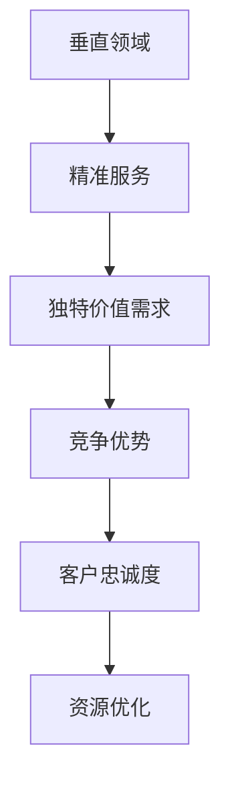

                 

# 小公司的生存之道：精准服务垂直领域，满足独特价值需求

> 关键词：小公司,垂直领域,精准服务,独特价值需求

## 1. 背景介绍

### 1.1 问题由来
在当前高度竞争的商业环境中，小公司面临着生存和发展的不确定性。一方面，大型企业凭借资金、技术和市场优势，在各个领域展开竞争，占据了绝对的主导地位。另一方面，小公司由于规模小、资源有限，难以与大公司进行直接对抗，其发展空间和生存机会受到严重挤压。面对这些挑战，小公司需要寻找新的发展路径，通过精准服务垂直领域，满足特定客户群的独特价值需求，从而在市场中占据一席之地。

### 1.2 问题核心关键点
小公司要想在激烈的市场竞争中生存下来，必须精准定位自身优势，服务特定的垂直领域，提供量身定制的高质量服务。同时，要深入理解客户的需求，满足其独特价值需求，增强客户粘性，从而实现长期的稳定发展。

### 1.3 问题研究意义
通过精准服务垂直领域，满足独特价值需求，小公司可以充分利用自身资源，聚焦核心竞争力，在特定市场取得优势。这种策略不仅能提升客户满意度，还能减少资源浪费，提高运营效率，从而实现可持续发展。

## 2. 核心概念与联系

### 2.1 核心概念概述

为更好地理解小公司在垂直领域的精准服务策略，本节将介绍几个密切相关的核心概念：

- 垂直领域（Vertical Domain）：指特定的行业或领域，如农业、医疗、教育等。小公司可以在这些领域内提供专业化、高附加值的服务。
- 精准服务（Precision Service）：指针对特定客户群的需求，提供量身定制的服务方案，满足其独特价值需求。
- 独特价值需求（Unique Value Needs）：指客户在特定场景下对产品或服务的独特、多样化的需求，需要小公司深入挖掘并满足。
- 竞争优势（Competitive Advantage）：指小公司通过精准服务垂直领域，满足独特价值需求，在特定市场取得与大公司抗衡的优势。
- 客户忠诚度（Customer Loyalty）：指客户对小公司服务的长期依赖和信任，是提升市场竞争力的关键因素。
- 资源优化（Resource Optimization）：指小公司通过精准定位，合理分配和使用有限资源，提升运营效率和盈利能力。

这些核心概念之间的逻辑关系可以通过以下Mermaid流程图来展示：



这个流程图展示出小公司通过精准服务垂直领域，满足独特价值需求的过程，最终实现竞争优势和客户忠诚度的提升。

## 3. 核心算法原理 & 具体操作步骤
### 3.1 算法原理概述

小公司在垂直领域的精准服务策略，本质上是一种市场定位和客户关系管理的过程。其核心思想是：通过深入分析目标客户群的需求，提供量身定制的服务，以满足其独特价值需求。

形式化地，假设小公司服务的垂直领域为 $D$，目标客户群为 $C$，服务需求为 $N$。小公司的精准服务目标是最小化客户需求与提供服务的匹配误差，即找到最优服务 $S^*$：

$$
S^* = \mathop{\arg\min}_{S} \sum_{i \in C} \|N_i - S_D\|
$$

其中 $N_i$ 为第 $i$ 个客户的需求，$S_D$ 为垂直领域 $D$ 上的服务，$\| \cdot \|$ 表示误差函数。

通过梯度下降等优化算法，精准服务过程不断更新服务 $S$，最小化匹配误差，最终得到理想的服务 $S^*$。

### 3.2 算法步骤详解

小公司在垂直领域的精准服务策略一般包括以下几个关键步骤：

**Step 1: 市场调研和客户分析**
- 收集目标垂直领域的数据，包括市场规模、客户需求、竞争对手分析等。
- 通过问卷调查、访谈等方式，深入了解目标客户群的需求、偏好和行为模式。

**Step 2: 服务设计与优化**
- 根据客户需求设计定制化服务方案，并对其进行优化设计，确保服务的质量和效果。
- 引入敏捷开发、持续改进等方法，不断迭代和提升服务方案。

**Step 3: 客户反馈与调整**
- 建立客户反馈机制，及时收集客户对服务的评价和建议。
- 根据客户反馈不断调整服务方案，提升客户满意度。

**Step 4: 服务推广与营销**
- 选择合适的渠道和方式，将服务信息传递给目标客户群。
- 设计有吸引力的营销策略，提升服务的曝光率和转化率。

**Step 5: 客户关系维护**
- 建立长期的客户关系，通过定期的沟通和服务，保持客户粘性。
- 提供增值服务，如技术支持、培训等，增强客户信任和忠诚度。

### 3.3 算法优缺点

小公司在垂直领域的精准服务策略，具有以下优点：
1. 提升客户满意度。通过量身定制的服务，满足客户独特价值需求，提升其满意度。
2. 增强竞争优势。聚焦特定垂直领域，提供高附加值的服务，实现与大公司的差异化竞争。
3. 降低运营成本。通过精准定位，集中资源和服务，减少资源浪费，提升运营效率。
4. 提升市场竞争力。增强客户粘性和忠诚度，实现长期稳定的市场占有率。

同时，该策略也存在一定的局限性：
1. 对市场需求变化敏感。垂直领域的服务需求变化较快，小公司需要快速响应和调整。
2. 客户需求多样性。不同客户群的需求差异较大，需要定制化解决方案，增加服务复杂度。
3. 资源有限。小公司的资源有限，难以同时覆盖多个垂直领域，需要集中精力深入服务一个领域。
4. 市场进入壁垒高。特定垂直领域可能已被大公司占据，小公司进入难度较大。

尽管存在这些局限性，但就目前而言，小公司采用精准服务垂直领域的策略，可以在特定市场取得显著成功，为生存和发展奠定坚实基础。

### 3.4 算法应用领域

精准服务垂直领域的策略，在小公司的多个应用场景中得到了广泛应用，例如：

- 农业技术咨询：提供精准的农业技术方案，满足农民对种植、养殖等技术的独特需求。
- 医疗健康管理：提供个性化的健康管理服务，满足不同人群的健康监测、康复训练等需求。
- 教育辅导服务：提供个性化的学习辅导，满足学生对课程设计、个性化训练等需求。
- 旅游咨询服务：提供个性化的旅游方案，满足客户对行程安排、目的地推荐等需求。
- 企业信息化解决方案：提供定制化的信息化服务，满足企业对数据管理、业务流程优化等需求。

除了上述这些经典场景外，小公司在垂直领域的服务创新还在不断涌现，如智能家居、智慧农业、个性化理财等，为特定客户群提供了全新的解决方案。

## 4. 数学模型和公式 & 详细讲解  
### 4.1 数学模型构建

本节将使用数学语言对小公司在垂直领域精准服务的过程进行更加严格的刻画。

记小公司服务的垂直领域为 $D$，目标客户群为 $C$，服务需求为 $N$。假设小公司提供的服务为 $S$，服务的优化目标是最小化客户需求与提供服务的匹配误差。

定义服务 $S$ 在客户 $i$ 上的误差函数为 $E_i(S) = \|N_i - S_D\|$，则在客户群 $C$ 上的总误差为：

$$
E(C, S) = \sum_{i \in C} E_i(S)
$$

小公司的服务优化目标为：

$$
S^* = \mathop{\arg\min}_{S} E(C, S)
$$

在实践中，我们通常使用基于梯度的优化算法（如SGD、Adam等）来近似求解上述最优化问题。设 $\eta$ 为学习率，$\lambda$ 为正则化系数，则服务参数的更新公式为：

$$
S \leftarrow S - \eta \nabla_{S}E(C, S) - \eta\lambda S
$$

其中 $\nabla_{S}E(C, S)$ 为总误差对服务参数 $S$ 的梯度，可通过反向传播算法高效计算。

### 4.2 公式推导过程

以下我们以个性化学习辅导为例，推导服务的优化公式。

假设小公司提供的学习辅导服务包括课程设计、个性化训练、学习监控等，分别记为 $S_1, S_2, S_3$。目标客户群 $C$ 的需求为 $N_1, N_2, N_3$。服务优化目标是最小化总误差 $E(C, S)$。

服务 $S$ 在客户 $i$ 上的误差函数为：

$$
E_i(S) = \|N_{i1} - S_{1D}\| + \|N_{i2} - S_{2D}\| + \|N_{i3} - S_{3D}\|
$$

则在客户群 $C$ 上的总误差为：

$$
E(C, S) = \sum_{i \in C} E_i(S) = \sum_{i \in C} (\|N_{i1} - S_{1D}\| + \|N_{i2} - S_{2D}\| + \|N_{i3} - S_{3D}\|)
$$

服务 $S$ 的优化目标为：

$$
S^* = \mathop{\arg\min}_{S} E(C, S)
$$

根据链式法则，总误差对服务参数的梯度为：

$$
\frac{\partial E(C, S)}{\partial S_k} = \sum_{i \in C} (\frac{\partial E_i(S)}{\partial S_{1k}} + \frac{\partial E_i(S)}{\partial S_{2k}} + \frac{\partial E_i(S)}{\partial S_{3k}})
$$

其中 $\frac{\partial E_i(S)}{\partial S_{j_k}}$ 表示第 $j$ 个服务的误差函数对第 $k$ 个服务参数的梯度，可以通过反向传播算法递归展开计算。

在得到总误差梯度后，即可带入服务参数更新公式，完成服务的迭代优化。重复上述过程直至收敛，最终得到适应客户群需求的最优服务参数 $S^*$。

## 5. 项目实践：代码实例和详细解释说明
### 5.1 开发环境搭建

在进行精准服务项目实践前，我们需要准备好开发环境。以下是使用Python进行Flask开发的环境配置流程：

1. 安装Anaconda：从官网下载并安装Anaconda，用于创建独立的Python环境。

2. 创建并激活虚拟环境：
```bash
conda create -n service-env python=3.8 
conda activate service-env
```

3. 安装Flask：从官网下载并安装Flask，用于构建Web服务。

4. 安装SQLAlchemy：用于数据库操作。

5. 安装Flask-WTF：用于表单验证。

6. 安装Flask-RESTful：用于API开发。

7. 安装Jinja2：用于模板渲染。

完成上述步骤后，即可在`service-env`环境中开始项目实践。

### 5.2 源代码详细实现

下面我们以农业技术咨询服务为例，给出使用Flask开发的服务后台系统的PyTorch代码实现。

首先，定义数据库模型：

```python
from flask_sqlalchemy import SQLAlchemy
from datetime import datetime

db = SQLAlchemy(app)

class Farmer(db.Model):
    id = db.Column(db.Integer, primary_key=True)
    name = db.Column(db.String(64), nullable=False)
    age = db.Column(db.Integer, nullable=False)
    location = db.Column(db.String(64), nullable=False)
    contact = db.Column(db.String(64), nullable=False)

    def __repr__(self):
        return f'<Farmer {self.name}>'

class Consultation(db.Model):
    id = db.Column(db.Integer, primary_key=True)
    farmer = db.relationship('Farmer', backref='consultations', lazy='dynamic')
    time = db.Column(db.DateTime, nullable=False, default=datetime.utcnow)
    title = db.Column(db.String(64), nullable=False)
    content = db.Column(db.Text, nullable=False)
```

然后，定义Flask应用：

```python
from flask import Flask, render_template, request
from flask_sqlalchemy import SQLAlchemy
from flask_wtf import FlaskForm
from flask_restful import Resource, Api

app = Flask(__name__)
app.config['SQLALCHEMY_DATABASE_URI'] = 'sqlite:///farmers.db'
db = SQLAlchemy(app)
api = Api(app)

class ConsultationForm(FlaskForm):
    title = StringField('Title', nullable=False)
    content = TextAreaField('Content', nullable=False)

class ConsultationResource(Resource):
    def get(self, farmer_id):
        consultations = Consultation.query.filter_by(farmer_id=farmer_id).all()
        return {'consultations': [咨询.serialize() for 咨询 in consultations]}, 200

    def post(self, farmer_id):
        form = ConsultationForm()
        if form.validate_on_submit():
            consultation = Consultation(title=form.title.data, content=form.content.data, farmer_id=farmer_id)
            db.session.add(consultation)
            db.session.commit()
            return {'message': 'Consultation created'}, 201
        return {'message': 'Invalid form'}, 400

class FarmerResource(Resource):
    def get(self, farmer_id):
        farmer = Farmer.query.get_or_404(farmer_id)
        return {农民:农民.serialize() for 农民 in farmer}, 200

    def patch(self, farmer_id):
        farmer = Farmer.query.get_or_404(farmer_id)
        form = FarmerForm()
        if form.validate_on_submit():
            farmer.name = form.name.data
            farmer.age = form.age.data
            farmer.location = form.location.data
            farmer.contact = form.contact.data
            db.session.commit()
            return {'message': 'Farmer updated'}, 200
        return {'message': 'Invalid form'}, 400
```

最后，启动Flask应用：

```python
if __name__ == '__main__':
    app.run(debug=True)
```

以上就是使用Flask对农业技术咨询服务进行开发的完整代码实现。可以看到，借助Flask的灵活性和易用性，我们可以快速搭建起Web服务，满足农业技术咨询的需求。

### 5.3 代码解读与分析

让我们再详细解读一下关键代码的实现细节：

**Database Model定义**：
- 定义了`Farmer`和`Consultation`两个模型，分别表示农户和咨询记录。通过关系映射，实现了农艺师和咨询记录之间的关联。

**ConsultationForm类定义**：
- 定义了用于创建咨询记录的表单，包含标题和内容两个字段。

**ConsultationResource类定义**：
- 定义了两个API接口，用于获取咨询记录和创建咨询记录。使用Flask-RESTful对接口进行封装，支持HTTP GET和POST方法。

**FarmerResource类定义**：
- 定义了两个API接口，用于获取农艺师信息和更新农艺师信息。

**Flask应用启动**：
- 定义了Flask应用对象，设置数据库连接，并启动应用，使服务可以接受外部请求。

可以看出，Flask的开发环境搭建和代码实现都较为简单，只需按照标准模板进行修改和扩展，即可满足不同的服务需求。

## 6. 实际应用场景
### 6.1 农业技术咨询

基于精准服务垂直领域的策略，农业技术咨询服务可以针对特定农户的需求，提供量身定制的农艺方案，满足其对种植、养殖等技术的独特需求。例如，通过分析农户的土地类型、气候条件、种植习惯等，提供定制化的农艺建议和解决方案，提高农作物的产量和质量。

在技术实现上，可以收集农户的历史咨询记录、地理位置、作物类型等信息，构建客户画像。利用机器学习模型，对咨询记录进行分析和聚类，识别出不同农户的需求模式和偏好。基于聚类结果，设计针对性的服务方案，并在网站上提供推荐。同时，可以通过AI聊天机器人或智能客服，实时响应农户的咨询请求，提供即时解决方案。

### 6.2 医疗健康管理

小公司在医疗健康管理领域，可以提供个性化的健康管理服务，满足不同人群的健康监测、康复训练等需求。例如，针对老年人群体，提供定制化的健康监测计划，包括血压、血糖、心率等指标的监测和分析；针对慢性病患者，提供个性化的康复训练方案，帮助其改善健康状况。

在技术实现上，可以收集用户的健康数据，通过AI模型进行数据分析和健康评估。根据评估结果，设计个性化的健康管理方案，并在平台上提供实时反馈和指导。同时，可以引入AI聊天机器人，为用户提供健康咨询、用药提醒等服务。

### 6.3 教育辅导服务

教育辅导服务可以针对学生的个性化需求，提供量身定制的课程设计、个性化训练和学习监控等服务。例如，通过分析学生的学习记录和测试成绩，识别出其薄弱环节和兴趣点，设计针对性的课程和训练计划，提高其学习效果。

在技术实现上，可以收集学生的学习数据，通过机器学习模型进行分析和建模。根据建模结果，设计个性化的学习计划，并在平台上提供实时反馈和指导。同时，可以引入AI聊天机器人，与学生进行互动，解答其学习问题，提供学习资源推荐等服务。

### 6.4 未来应用展望

随着精准服务垂直领域策略的不断演进，基于微调范式的小公司在更多领域得到应用，为传统行业带来变革性影响。

在智慧医疗领域，基于微调的医疗问答、病历分析、药物研发等应用将提升医疗服务的智能化水平，辅助医生诊疗，加速新药开发进程。

在智能教育领域，微调技术可应用于作业批改、学情分析、知识推荐等方面，因材施教，促进教育公平，提高教学质量。

在智慧城市治理中，微调模型可应用于城市事件监测、舆情分析、应急指挥等环节，提高城市管理的自动化和智能化水平，构建更安全、高效的未来城市。

此外，在企业生产、社会治理、文娱传媒等众多领域，基于大模型微调的人工智能应用也将不断涌现，为NLP技术带来新的突破。

## 7. 工具和资源推荐
### 7.1 学习资源推荐

为了帮助开发者系统掌握小公司在垂直领域的精准服务策略，这里推荐一些优质的学习资源：

1. 《数据科学与人工智能：理论与实践》系列博文：由数据科学和人工智能专家撰写，深入浅出地介绍了小公司在垂直领域精准服务的方法和案例。

2. CS223《机器学习》课程：斯坦福大学开设的机器学习课程，有Lecture视频和配套作业，带你入门机器学习的基本概念和经典算法。

3. 《Python机器学习》书籍：西瓜书，全面介绍了Python在机器学习领域的应用，包括分类、聚类、回归等机器学习算法。

4. 《深度学习》课程：由吴恩达教授主讲，介绍了深度学习的基本原理和应用，涵盖了神经网络、卷积神经网络、循环神经网络等经典模型。

5. HuggingFace官方文档：提供海量预训练模型和微调样例代码，是进行微调任务开发的利器。

通过对这些资源的学习实践，相信你一定能够快速掌握小公司在垂直领域的精准服务策略，并用于解决实际的服务需求。

### 7.2 开发工具推荐

高效的开发离不开优秀的工具支持。以下是几款用于精准服务开发常用的工具：

1. Flask：基于Python的Web框架，易于使用，灵活性高，适合快速开发Web服务。

2. SQLAlchemy：Python的ORM框架，用于数据库操作，支持多种数据库和数据源。

3. Flask-WTF：Flask的表单验证扩展，用于前端表单数据校验。

4. Flask-RESTful：Flask的API开发扩展，用于封装RESTful风格的API接口。

5. Jinja2：Python的模板引擎，用于渲染Web页面和API响应。

6. TensorFlow：由Google主导开发的开源深度学习框架，生产部署方便，适合大规模工程应用。

7. PyTorch：基于Python的开源深度学习框架，灵活动态的计算图，适合快速迭代研究。

合理利用这些工具，可以显著提升精准服务项目的开发效率，加快创新迭代的步伐。

### 7.3 相关论文推荐

小公司在垂直领域的精准服务策略，得益于机器学习、数据科学等技术的不断发展。以下是几篇奠基性的相关论文，推荐阅读：

1. AdaBoost: A New Learning Algorithm（AdaBoost算法）：提出了基于加权训练的集成学习方法，有效提升了机器学习模型的泛化性能。

2. K-Means: A Theory of Multicluster Clustering（K-Means算法）：介绍了经典的聚类算法K-Means，用于对客户需求进行聚类分析。

3. Decision Trees and Random Forests（决策树和随机森林）：介绍了决策树和随机森林算法，用于客户需求模式识别和预测。

4. Support Vector Machines（支持向量机）：介绍了支持向量机算法，用于分类和回归等任务。

5. Deep Learning（深度学习）：介绍了深度学习的基本原理和应用，涵盖了神经网络、卷积神经网络、循环神经网络等经典模型。

这些论文代表了大公司在垂直领域精准服务技术的发展脉络。通过学习这些前沿成果，可以帮助研究者把握学科前进方向，激发更多的创新灵感。

## 8. 总结：未来发展趋势与挑战

### 8.1 总结

本文对小公司在垂直领域的精准服务策略进行了全面系统的介绍。首先阐述了小公司在垂直领域的服务策略对企业生存和发展的重要性，明确了精准服务在特定客户群需求的独特价值需求方面的独特价值。其次，从原理到实践，详细讲解了精准服务的数学原理和关键步骤，给出了精准服务任务开发的完整代码实例。同时，本文还广泛探讨了精准服务在小公司多个应用场景中的应用前景，展示了精准服务范式的巨大潜力。此外，本文精选了精准服务技术的各类学习资源，力求为读者提供全方位的技术指引。

通过本文的系统梳理，可以看到，精准服务策略正在成为小公司发展的关键路径，帮助其在特定市场取得竞争优势。通过深入分析客户需求，提供量身定制的服务，小公司可以充分利用自身资源，聚焦核心竞争力，实现可持续发展。未来，伴随精准服务策略的不断演进，相信小公司在更多领域能够持续创新，拓展市场，取得更大的发展成就。

### 8.2 未来发展趋势

展望未来，小公司在垂直领域的精准服务策略将呈现以下几个发展趋势：

1. 服务自动化和智能化：随着机器学习、自然语言处理等技术的不断发展，精准服务将更加自动化和智能化，减少人工干预，提升服务效率和质量。

2. 数据驱动的个性化：通过大数据和人工智能技术，精准服务将更加个性化，满足不同客户群体的独特需求，提升客户满意度。

3. 服务协同和集成：精准服务将与外部知识库、规则库等专家知识进行更深层次的融合，形成更加全面、准确的信息整合能力。

4. 多模态服务的融合：精准服务将与多模态数据（如图像、视频、语音等）进行协同建模，提供更加全面、丰富的服务体验。

5. 市场扩展和跨领域应用：小公司将在更多垂直领域展开精准服务，拓展市场，实现跨领域应用的突破。

以上趋势凸显了小公司在垂直领域精准服务策略的广阔前景。这些方向的探索发展，必将进一步提升服务的质量和效率，为小公司创造更大的商业价值。

### 8.3 面临的挑战

尽管精准服务策略在小公司的发展中取得了显著成效，但在迈向更加智能化、普适化应用的过程中，它仍面临着诸多挑战：

1. 数据质量瓶颈。精准服务需要大量高质量的客户数据，如何获取和处理这些数据，将是一个长期的问题。

2. 算法复杂度问题。精准服务涉及多种算法和模型，如何选择合适的算法，优化算法性能，需要更多的研究探索。

3. 模型鲁棒性不足。精准服务模型面临不同的客户需求和市场变化，如何提高模型的鲁棒性，是一个亟待解决的问题。

4. 技术协同难度。精准服务需要与多个部门和系统进行协同，如何实现信息共享和集成，需要更多的技术支持和保障。

5. 客户需求多样性。不同客户群体的需求差异较大，如何提供差异化的服务，满足多样化的需求，需要更多的技术创新。

6. 服务成本问题。精准服务需要投入大量资源和技术，如何降低成本，提高服务效率，是一个重要的研究方向。

正视精准服务策略面临的这些挑战，积极应对并寻求突破，将是小公司实现可持续发展的重要保证。相信通过学界和产业界的共同努力，这些挑战终将一一被克服，精准服务策略必将在构建人机协同的智能时代中扮演越来越重要的角色。

### 8.4 研究展望

面对精准服务策略所面临的种种挑战，未来的研究需要在以下几个方面寻求新的突破：

1. 探索更加高效的数据获取和处理方式，降低数据质量瓶颈，提升数据驱动的精准服务效果。

2. 开发更加高效、易用的算法和模型，优化算法性能，降低算法复杂度。

3. 引入更多的先验知识，如知识图谱、逻辑规则等，与神经网络模型进行巧妙融合，增强模型的鲁棒性和泛化能力。

4. 实现多模态数据的融合，提升精准服务的全面性和丰富性。

5. 加强数据共享和协同，建立统一的平台和服务架构，实现系统集成。

6. 引入更多技术手段，如自然语言处理、图像识别等，提高服务的自动化和智能化水平。

这些研究方向将推动小公司精准服务策略的不断演进，为小公司的发展提供更强大的技术支撑，助力其在市场竞争中取得更大的成功。

## 9. 附录：常见问题与解答

**Q1：小公司如何选择合适的垂直领域？**

A: 小公司在选择垂直领域时，应综合考虑自身资源、市场潜力、客户需求等因素。首先，评估自身优势和劣势，确定擅长的技术领域。其次，分析目标市场的规模和增长潜力，选择有发展前景的垂直领域。最后，通过市场调研和客户分析，了解目标客户群的需求和偏好，确定最适合自己的垂直领域。

**Q2：精准服务策略在实施过程中需要注意哪些问题？**

A: 在实施精准服务策略时，小公司需要注意以下几点：
1. 数据隐私和安全性：确保客户数据的安全和隐私，建立严格的数据管理和安全保障机制。
2. 服务质量和效果：确保服务方案的可行性和有效性，通过客户反馈不断优化服务方案。
3. 运营成本控制：控制服务的运营成本，避免资源浪费，提高盈利能力。
4. 市场拓展和推广：通过有效的市场推广策略，提升服务的市场曝光率和客户转化率。
5. 客户关系维护：建立长期的客户关系，通过定期的沟通和服务，保持客户粘性。

**Q3：精准服务策略在实施过程中如何处理客户需求的多样性？**

A: 小公司在处理客户需求的多样性时，可以采用以下方法：
1. 客户画像分析：通过客户画像分析，了解不同客户群体的需求和偏好，设计针对性的服务方案。
2. 需求聚类分析：对客户需求进行聚类分析，识别出不同客户群体的共性和差异，提供差异化的服务。
3. 个性化服务设计：根据客户需求，设计个性化的服务方案，满足其独特价值需求。
4. 动态调整服务：根据客户反馈和市场变化，动态调整服务方案，提升服务质量和效果。

**Q4：精准服务策略在小公司的实施过程中如何平衡成本和效果？**

A: 小公司在实施精准服务策略时，需要在成本和效果之间找到平衡点。可以采取以下措施：
1. 资源优化：通过精准定位，合理分配和使用有限资源，提高运营效率和盈利能力。
2. 服务标准化：建立标准化服务流程，减少人工干预，降低服务成本。
3. 技术创新：引入新技术和新方法，提升服务质量和效率，降低服务成本。
4. 客户细分：根据客户需求和行为，对客户进行细分，提供有针对性的服务，提升客户满意度。

通过这些措施，小公司可以在控制成本的同时，提升服务的质量和效果，实现可持续发展。

**Q5：精准服务策略在小公司的实施过程中如何实现服务自动化和智能化？**

A: 小公司可以通过以下方法实现服务的自动化和智能化：
1. 引入机器学习和自然语言处理技术，构建智能推荐系统，提供个性化的服务方案。
2. 开发智能客服系统，利用AI聊天机器人，实时响应客户咨询，提供即时解决方案。
3. 建立智能监控系统，实时分析客户反馈和行为数据，优化服务方案。
4. 引入自然语言处理技术，分析客户需求和情感，提升服务质量和客户满意度。
5. 引入图像识别和语音识别技术，提升服务的全面性和丰富性。

通过这些技术手段，小公司可以实现服务的自动化和智能化，提升服务效率和质量，增强客户粘性和满意度。

---

作者：禅与计算机程序设计艺术 / Zen and the Art of Computer Programming

