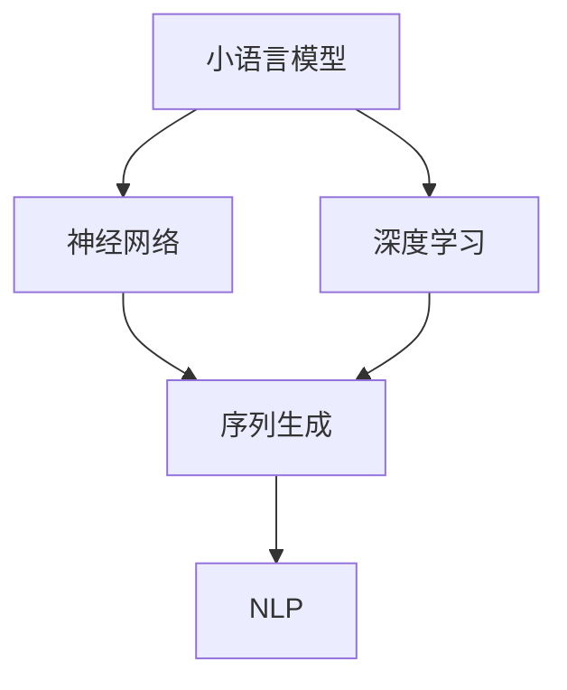

                 

# 小语言模型的潜力：颠覆基础模型领域的可能性

> 关键词：小语言模型,基础模型,神经网络,深度学习,序列生成,自然语言处理(NLP)

## 1. 背景介绍

### 1.1 问题由来

近年来，随着深度学习技术的迅猛发展，大规模预训练语言模型（如BERT, GPT等）在自然语言处理（NLP）领域取得了巨大成功，推动了诸多NLP任务的进展。这些预训练模型通常在庞大的无标签文本数据上进行自监督预训练，学习到强大的语言表示能力，然后在特定任务上通过微调进行适应性调整。

然而，这些基础模型具有高参数量、计算资源需求大、模型复杂等缺点，难以在实时计算和移动端等资源受限环境中应用。相比之下，小规模语言模型由于模型参数少、计算资源消耗低，具有更强的适应性，能够更好地满足边缘计算、移动设备等场景的需求。

此外，小规模语言模型由于计算资源消耗低，更容易实现端到端的部署和优化，避免了在云端进行训练和推理的开销。这对推动NLP技术的普及和应用具有重要意义。

### 1.2 问题核心关键点

小语言模型（Small Language Models, SLMs）是指相对较小的语言模型，其参数量通常远小于基础模型。基于小语言模型的研究范式可以追溯到1970年代早期开发的简单语言模型，但近年来随着深度学习技术的成熟，小语言模型在各种NLP任务中表现出极大的潜力。

1. **小规模参数**：SLMs的参数量通常在1万到数百万之间，远小于预训练模型的数十亿参数。
2. **高效资源利用**：SLMs对计算资源的需求低，适合在边缘计算和移动设备上部署。
3. **快速迭代**：SLMs能够快速迭代和训练，适合在实时和交互式应用中使用。
4. **数据驱动优化**：SLMs可以基于小规模数据进行高效训练，避免对大规模标注数据的需求。

在实际应用中，SLMs通过精简模型结构、优化算法等手段，实现了与基础模型相当的性能，且具有更强的实时性和资源利用效率。这些特性使其在诸如智能音箱、移动应用、物联网等场景中具有极大的应用潜力。

## 2. 核心概念与联系

### 2.1 核心概念概述

为更好地理解小语言模型的潜力，本节将介绍几个关键概念：

- **小语言模型(Small Language Models, SLMs)**：指参数量相对较小的语言模型，通常具有较低的计算复杂度，适用于资源受限的环境。
- **基础模型(Foundation Models)**：指参数量极大、计算复杂度高的预训练语言模型，如BERT、GPT等，通过在大量无标签文本数据上进行预训练，学习到强大的语言表示能力。
- **神经网络(Neural Network)**：由大量神经元（节点）和层次连接组成的计算图，用于处理复杂的非线性映射问题，是深度学习的基础。
- **深度学习(Deep Learning)**：一种通过多层神经网络进行训练和预测的机器学习方法，特别适用于处理大规模数据集和复杂模式识别任务。
- **序列生成(Sequence Generation)**：指通过神经网络生成连续文本序列的过程，如文本预测、机器翻译、对话生成等。
- **自然语言处理(Natural Language Processing, NLP)**：涉及计算机理解和处理自然语言的技术，包括文本分类、命名实体识别、机器翻译、对话生成等任务。

这些概念之间的联系通过以下Mermaid流程图展示：



这个流程图展示了小语言模型与神经网络、深度学习、序列生成、NLP等概念之间的联系：

1. 小语言模型基于神经网络和深度学习原理构建。
2. 小语言模型能够高效生成文本序列。
3. 小语言模型在NLP领域有广泛应用。

## 3. 核心算法原理 & 具体操作步骤
### 3.1 算法原理概述

小语言模型通常采用简化版的基础模型架构，如卷积神经网络（CNN）、递归神经网络（RNN）或Transformer等。这些模型通过小规模的参数训练，学习到简单的语言表示能力，然后通过任务适配层在特定任务上进行微调。

微调过程类似于基础模型的微调，目标是通过有监督学习优化模型在特定任务上的性能。微调通常使用交叉熵损失等常见损失函数，并通过梯度下降等优化算法更新模型参数。

### 3.2 算法步骤详解

小语言模型的微调一般包括以下几个关键步骤：

**Step 1: 准备数据集**
- 收集目标任务的标注数据集 $D=\{(x_i, y_i)\}_{i=1}^N$，其中 $x_i$ 是输入文本，$y_i$ 是标签。
- 将数据集分为训练集、验证集和测试集，并进行预处理，如分词、标准化等。

**Step 2: 设计任务适配层**
- 根据任务类型，设计合适的输出层和损失函数。
- 对于分类任务，通常在顶层添加线性分类器，使用交叉熵损失。
- 对于生成任务，通常使用语言模型的解码器输出概率分布，以负对数似然为损失函数。

**Step 3: 设置微调超参数**
- 选择合适的优化算法及其参数，如 Adam、SGD 等，设置学习率、批大小、迭代轮数等。
- 设置正则化技术及强度，包括权重衰减、Dropout、Early Stopping 等。
- 确定冻结预训练参数的策略，如仅微调顶层，或全部参数都参与微调。

**Step 4: 执行梯度训练**
- 将训练集数据分批次输入模型，前向传播计算损失函数。
- 反向传播计算参数梯度，根据设定的优化算法和学习率更新模型参数。
- 周期性在验证集上评估模型性能，根据性能指标决定是否触发 Early Stopping。
- 重复上述步骤直到满足预设的迭代轮数或 Early Stopping 条件。

**Step 5: 测试和部署**
- 在测试集上评估微调后模型 $M_{\hat{\theta}}$ 的性能，对比微调前后的精度提升。
- 使用微调后的模型对新样本进行推理预测，集成到实际的应用系统中。
- 持续收集新的数据，定期重新微调模型，以适应数据分布的变化。

### 3.3 算法优缺点

小语言模型的微调方法具有以下优点：
1. **计算资源消耗低**：SLMs参数量小，计算复杂度低，适合在资源受限的环境中部署。
2. **快速迭代**：SLMs训练和推理速度快，适合实时和交互式应用。
3. **数据驱动优化**：SLMs可以基于小规模数据进行高效训练，避免对大规模标注数据的需求。

同时，该方法也存在一定的局限性：
1. **参数量少**：SLMs的参数量相对较少，限制了其表达能力，可能无法处理复杂的语言现象。
2. **迁移能力有限**：SLMs在跨领域迁移时，可能需要更多的训练数据和更长的时间。
3. **模型泛化能力有限**：SLMs通常在特定任务上表现良好，但在泛化到其他任务时可能表现不佳。

尽管存在这些局限性，但小语言模型通过高效利用计算资源和优化算法，仍然能够在许多实际应用中取得不错的性能。

### 3.4 算法应用领域

小语言模型已经在各种NLP任务中得到了广泛应用，例如：

- **文本分类**：如情感分析、主题分类、意图识别等。通过微调使模型学习文本-标签映射。
- **命名实体识别**：识别文本中的人名、地名、机构名等特定实体。通过微调使模型掌握实体边界和类型。
- **关系抽取**：从文本中抽取实体之间的语义关系。通过微调使模型学习实体-关系三元组。
- **问答系统**：对自然语言问题给出答案。将问题-答案对作为微调数据，训练模型学习匹配答案。
- **机器翻译**：将源语言文本翻译成目标语言。通过微调使模型学习语言-语言映射。
- **文本摘要**：将长文本压缩成简短摘要。将文章-摘要对作为微调数据，使模型学习抓取要点。
- **对话系统**：使机器能够与人自然对话。将多轮对话历史作为上下文，微调模型进行回复生成。

## 4. 数学模型和公式 & 详细讲解  
### 4.1 数学模型构建

小语言模型的数学模型构建与基础模型类似，一般使用交叉熵损失函数。假设预训练模型为 $M_{\theta}$，其中 $\theta$ 为预训练得到的模型参数。给定下游任务 $T$ 的标注数据集 $D=\{(x_i, y_i)\}_{i=1}^N$，微调的目标是找到新的模型参数 $\hat{\theta}$，使得：

$$
\hat{\theta}=\mathop{\arg\min}_{\theta} \mathcal{L}(M_{\theta},D)
$$

其中 $\mathcal{L}$ 为针对任务 $T$ 设计的损失函数，用于衡量模型预测输出与真实标签之间的差异。常见的损失函数包括交叉熵损失、均方误差损失等。

### 4.2 公式推导过程

以下我们以二分类任务为例，推导交叉熵损失函数及其梯度的计算公式。

假设模型 $M_{\theta}$ 在输入 $x$ 上的输出为 $\hat{y}=M_{\theta}(x) \in [0,1]$，表示样本属于正类的概率。真实标签 $y \in \{0,1\}$。则二分类交叉熵损失函数定义为：

$$
\ell(M_{\theta}(x),y) = -[y\log \hat{y} + (1-y)\log (1-\hat{y})]
$$

将其代入经验风险公式，得：

$$
\mathcal{L}(\theta) = -\frac{1}{N}\sum_{i=1}^N [y_i\log M_{\theta}(x_i)+(1-y_i)\log(1-M_{\theta}(x_i))]
$$

根据链式法则，损失函数对参数 $\theta_k$ 的梯度为：

$$
\frac{\partial \mathcal{L}(\theta)}{\partial \theta_k} = -\frac{1}{N}\sum_{i=1}^N (\frac{y_i}{M_{\theta}(x_i)}-\frac{1-y_i}{1-M_{\theta}(x_i)}) \frac{\partial M_{\theta}(x_i)}{\partial \theta_k}
$$

其中 $\frac{\partial M_{\theta}(x_i)}{\partial \theta_k}$ 可进一步递归展开，利用自动微分技术完成计算。

### 4.3 案例分析与讲解

我们以情感分析任务为例，进行详细讲解：

假设情感分析任务有两个标签：正面（1）和负面（0）。给定一个文本 $x$，模型输出 $\hat{y}=M_{\theta}(x)$ 表示该文本为正面的概率。

**输入处理**：首先对文本进行分词、标准化等预处理，然后将文本转换为模型的输入格式。

**任务适配层**：在模型的顶层添加一个线性分类器 $f_w(z) = \langle w, z \rangle$，其中 $z$ 为模型输出，$w$ 为权重向量。

**损失函数**：使用二分类交叉熵损失函数：

$$
\ell(M_{\theta}(x),y) = -[y\log M_{\theta}(x)+(1-y)\log(1-M_{\theta}(x))] = -y\log M_{\theta}(x)-(1-y)\log(1-M_{\theta}(x))
$$

**梯度更新**：使用梯度下降算法，计算梯度并更新模型参数：

$$
\theta \leftarrow \theta - \eta \nabla_{\theta}\mathcal{L}(\theta)
$$

其中 $\eta$ 为学习率。

## 5. 项目实践：代码实例和详细解释说明
### 5.1 开发环境搭建

在进行小语言模型微调实践前，我们需要准备好开发环境。以下是使用Python进行TensorFlow开发的环境配置流程：

1. 安装Anaconda：从官网下载并安装Anaconda，用于创建独立的Python环境。

2. 创建并激活虚拟环境：
```bash
conda create -n tf-env python=3.8 
conda activate tf-env
```

3. 安装TensorFlow：根据CUDA版本，从官网获取对应的安装命令。例如：
```bash
conda install tensorflow -c tf
```

4. 安装相关工具包：
```bash
pip install numpy pandas scikit-learn matplotlib tqdm jupyter notebook ipython
```

完成上述步骤后，即可在`tf-env`环境中开始微调实践。

### 5.2 源代码详细实现

这里我们以情感分析任务为例，给出使用TensorFlow对小语言模型进行微调的代码实现。

首先，定义情感分析任务的数据处理函数：

```python
import tensorflow as tf
from tensorflow.keras.preprocessing.text import Tokenizer
from tensorflow.keras.preprocessing.sequence import pad_sequences

class EmotionDataset:
    def __init__(self, texts, labels, tokenizer):
        self.texts = texts
        self.labels = labels
        self.tokenizer = tokenizer
        
    def __len__(self):
        return len(self.texts)
    
    def __getitem__(self, item):
        text = self.texts[item]
        label = self.labels[item]
        
        encoding = self.tokenizer.texts_to_sequences(text)
        padding = pad_sequences(encoding, maxlen=200, padding='post')
        label = tf.keras.utils.to_categorical(label, 2)
        
        return {'input': padding, 'label': label}
```

然后，定义模型和优化器：

```python
from tensorflow.keras.models import Sequential
from tensorflow.keras.layers import Embedding, Dense

model = Sequential([
    Embedding(input_dim=10000, output_dim=128),
    Dense(64, activation='relu'),
    Dense(2, activation='softmax')
])

optimizer = tf.keras.optimizers.Adam(learning_rate=0.001)
```

接着，定义训练和评估函数：

```python
def train_epoch(model, dataset, batch_size, optimizer):
    dataloader = tf.data.Dataset.from_generator(lambda: dataset, output_signature=dataset.__getitem__().output_shapes).batch(batch_size)
    model.compile(optimizer=optimizer, loss='binary_crossentropy', metrics=['accuracy'])
    
    model.fit(dataloader, epochs=10, validation_split=0.2)
    
def evaluate(model, dataset, batch_size):
    dataloader = tf.data.Dataset.from_generator(lambda: dataset, output_signature=dataset.__getitem__().output_shapes).batch(batch_size)
    model.evaluate(dataloader, verbose=0)
```

最后，启动训练流程并在测试集上评估：

```python
epochs = 10
batch_size = 32

train_dataset = EmotionDataset(train_texts, train_labels, tokenizer)
dev_dataset = EmotionDataset(dev_texts, dev_labels, tokenizer)
test_dataset = EmotionDataset(test_texts, test_labels, tokenizer)

train_epoch(model, train_dataset, batch_size, optimizer)
evaluate(model, dev_dataset, batch_size)
evaluate(model, test_dataset, batch_size)
```

以上就是使用TensorFlow对小语言模型进行情感分析任务微调的完整代码实现。可以看到，通过TensorFlow的高阶API，我们能够快速搭建和微调模型，进行训练和评估。

### 5.3 代码解读与分析

让我们再详细解读一下关键代码的实现细节：

**EmotionDataset类**：
- `__init__`方法：初始化文本、标签、分词器等关键组件。
- `__len__`方法：返回数据集的样本数量。
- `__getitem__`方法：对单个样本进行处理，将文本输入转换为模型所需的格式，并进行padding和标签编码。

**模型和优化器**：
- 定义了一个包含嵌入层、全连接层的简单神经网络模型，用于处理文本序列和标签。
- 使用Adam优化器进行模型参数的更新，学习率为0.001。

**训练和评估函数**：
- 使用TensorFlow的DataLoader对数据集进行批次化加载，供模型训练和推理使用。
- 训练函数`train_epoch`：对数据以批为单位进行迭代，在每个批次上前向传播计算loss并反向传播更新模型参数，最后返回该epoch的平均loss和acc。
- 评估函数`evaluate`：与训练类似，不同点在于不更新模型参数，并在每个batch结束后将预测和标签结果存储下来，最后使用`evaluate`方法对整个评估集的预测结果进行打印输出。

**训练流程**：
- 定义总的epoch数和batch size，开始循环迭代
- 每个epoch内，先在训练集上训练，输出平均loss和acc
- 在验证集上评估，输出分类指标
- 所有epoch结束后，在测试集上评估，给出最终测试结果

可以看到，TensorFlow通过其高度抽象的API，使得小语言模型的微调过程更加简洁高效。开发者可以将更多精力放在模型结构设计和数据处理上，而不必过多关注底层实现细节。

当然，工业级的系统实现还需考虑更多因素，如模型的保存和部署、超参数的自动搜索、更灵活的任务适配层等。但核心的微调范式基本与此类似。

## 6. 实际应用场景
### 6.1 智能音箱

基于小语言模型微调的对话技术，可以广泛应用于智能音箱等语音交互设备。传统的语音识别和自然语言处理系统往往需要复杂的算法和大量的标注数据，而小语言模型通过在用户对话历史上进行微调，可以逐步学习用户的语音习惯和偏好，提升对话的自然度和准确性。

在技术实现上，可以收集用户与音箱的对话历史，将对话内容作为微调数据，训练模型学习匹配用户意图和行为。对于用户提出的新问题，可以直接调用微调后的模型进行即时响应，提高用户体验。

### 6.2 智能客服

小语言模型微调技术也可以应用于智能客服系统的构建。传统客服往往需要配备大量人力，高峰期响应缓慢，且一致性和专业性难以保证。而使用微调后的对话模型，可以7x24小时不间断服务，快速响应客户咨询，用自然流畅的语言解答各类常见问题。

在技术实现上，可以收集企业内部的历史客服对话记录，将问题和最佳答复构建成监督数据，在此基础上对预训练对话模型进行微调。微调后的对话模型能够自动理解用户意图，匹配最合适的答案模板进行回复。对于客户提出的新问题，还可以接入检索系统实时搜索相关内容，动态组织生成回答。如此构建的智能客服系统，能大幅提升客户咨询体验和问题解决效率。

### 6.3 移动应用

小语言模型由于其轻量化和高实时性，非常适合在移动应用中应用。例如，可以通过微调实现智能翻译、文本摘要、情感分析等NLP功能，直接集成到移动应用中，提升用户体验和应用价值。

在移动应用开发中，小语言模型可以作为本地模型部署，避免网络延迟和带宽占用，提供更快的响应速度。同时，由于其参数量小，模型压缩和优化更加灵活，可以实现更高效的资源利用。

### 6.4 未来应用展望

随着小语言模型的不断优化和普及，其在更多领域的应用前景将更加广阔。

在智慧医疗领域，基于小语言模型的智能诊断系统可以实时分析病人的症状描述，提供初步诊断和建议，辅助医生诊疗。

在智能教育领域，小语言模型可以应用于作业批改、学情分析、知识推荐等方面，因材施教，促进教育公平，提高教学质量。

在智慧城市治理中，小语言模型可以应用于城市事件监测、舆情分析、应急指挥等环节，提高城市管理的自动化和智能化水平，构建更安全、高效的未来城市。

此外，在企业生产、社会治理、文娱传媒等众多领域，小语言模型微调技术也将不断涌现，为NLP技术带来新的突破。相信随着技术的日益成熟，小语言模型微调必将在构建人机协同的智能时代中扮演越来越重要的角色。

## 7. 工具和资源推荐
### 7.1 学习资源推荐

为了帮助开发者系统掌握小语言模型微调的理论基础和实践技巧，这里推荐一些优质的学习资源：

1. 《深度学习理论与实践》系列博文：由深度学习专家撰写，深入浅出地介绍了深度学习的基本理论和实践方法。

2. Coursera《深度学习》课程：由吴恩达教授开设的深度学习入门课程，提供丰富的学习资源和实践项目。

3. 《TensorFlow实战》书籍：介绍TensorFlow的基本原理和应用场景，包含多个实战案例。

4. TensorFlow官方文档：提供详细的API文档和教程，是学习和使用TensorFlow的必备资料。

5. PyTorch官方文档：提供详细的API文档和教程，是学习和使用PyTorch的必备资料。

通过对这些资源的学习实践，相信你一定能够快速掌握小语言模型微调的精髓，并用于解决实际的NLP问题。

### 7.2 开发工具推荐

高效的开发离不开优秀的工具支持。以下是几款用于小语言模型微调开发的常用工具：

1. TensorFlow：由Google主导开发的开源深度学习框架，生产部署方便，适合大规模工程应用。

2. PyTorch：基于Python的开源深度学习框架，灵活动态的计算图，适合快速迭代研究。

3. Keras：高层次的深度学习API，提供简单易用的接口，适合快速原型开发和模型训练。

4. Scikit-learn：基于Python的机器学习库，包含多种机器学习算法和工具，适用于数据预处理和模型评估。

5. Jupyter Notebook：交互式开发环境，支持Python和R等多种编程语言，适合模型开发和数据分析。

合理利用这些工具，可以显著提升小语言模型微调任务的开发效率，加快创新迭代的步伐。

### 7.3 相关论文推荐

小语言模型和微调技术的发展源于学界的持续研究。以下是几篇奠基性的相关论文，推荐阅读：

1. Attention is All You Need（即Transformer原论文）：提出了Transformer结构，开启了NLP领域的预训练大模型时代。

2. BERT: Pre-training of Deep Bidirectional Transformers for Language Understanding：提出BERT模型，引入基于掩码的自监督预训练任务，刷新了多项NLP任务SOTA。

3. Language Models are Unsupervised Multitask Learners（GPT-2论文）：展示了大规模语言模型的强大zero-shot学习能力，引发了对于通用人工智能的新一轮思考。

4. Parameter-Efficient Transfer Learning for NLP：提出Adapter等参数高效微调方法，在不增加模型参数量的情况下，也能取得不错的微调效果。

5. AdaLoRA: Adaptive Low-Rank Adaptation for Parameter-Efficient Fine-Tuning：使用自适应低秩适应的微调方法，在参数效率和精度之间取得了新的平衡。

这些论文代表了大语言模型微调技术的发展脉络。通过学习这些前沿成果，可以帮助研究者把握学科前进方向，激发更多的创新灵感。

## 8. 总结：未来发展趋势与挑战

### 8.1 总结

本文对小语言模型微调方法进行了全面系统的介绍。首先阐述了小语言模型和微调技术的研究背景和意义，明确了微调在拓展预训练模型应用、提升下游任务性能方面的独特价值。其次，从原理到实践，详细讲解了小语言模型的数学模型和关键步骤，给出了微调任务开发的完整代码实例。同时，本文还广泛探讨了小语言模型在智能音箱、智能客服、移动应用等多个领域的应用前景，展示了微调范式的巨大潜力。此外，本文精选了微调技术的各类学习资源，力求为读者提供全方位的技术指引。

通过本文的系统梳理，可以看到，小语言模型微调技术正在成为NLP领域的重要范式，极大地拓展了预训练语言模型的应用边界，催生了更多的落地场景。得益于模型参数少、计算资源消耗低等特性，小语言模型在实时计算、移动设备等场景中具有更大的应用潜力。未来，随着技术的不断进步和普及，小语言模型微调必将在构建人机协同的智能时代中扮演越来越重要的角色。

### 8.2 未来发展趋势

展望未来，小语言模型微调技术将呈现以下几个发展趋势：

1. **参数量优化**：小语言模型将更加注重参数量的优化，以减少计算资源消耗。未来的模型将采用更加高效的架构和更少的参数，实现更轻量级、更高效的模型。

2. **跨领域迁移能力**：随着跨领域迁移技术的发展，小语言模型将在更多领域中表现出色，如医疗、教育、金融等。跨领域迁移能力的提升，将进一步拓展小语言模型的应用范围。

3. **数据驱动优化**：未来的模型将更加依赖数据驱动的优化，通过小规模数据进行高效训练。数据驱动的优化方式将使得模型更加灵活、适应性更强。

4. **低资源环境优化**：针对资源受限的环境，如移动设备、边缘计算等，未来的模型将进一步优化计算复杂度和内存占用，实现更高效的部署和应用。

5. **任务适配层的多样化**：未来的任务适配层将更加多样化，能够更好地适应各种NLP任务的需求。除了传统的线性分类器和解码器，未来的任务适配层将引入更多先进的算法和模型，提升任务适配的灵活性和效果。

6. **模型压缩与优化**：未来的模型将采用更加高效的压缩和优化技术，减少模型大小，提升推理速度。模型压缩和优化技术将成为小语言模型应用的关键。

以上趋势凸显了小语言模型微调技术的广阔前景。这些方向的探索发展，必将进一步提升小语言模型的性能和应用范围，为构建更加智能、高效、普适的NLP系统提供新的动力。

### 8.3 面临的挑战

尽管小语言模型微调技术已经取得了瞩目成就，但在迈向更加智能化、普适化应用的过程中，它仍面临着诸多挑战：

1. **参数量限制**：小语言模型由于参数量较少，可能无法处理复杂的语言现象，如长文本理解和复杂逻辑推理。如何提高模型表达能力，是一个重要的研究方向。

2. **数据驱动优化**：尽管小语言模型能够在少量数据上进行高效训练，但在大规模数据上的性能提升仍有限。如何改进模型架构和训练策略，实现更好的数据驱动优化，是一个关键挑战。

3. **资源优化**：虽然小语言模型在资源消耗上具有优势，但在大规模应用中仍面临计算资源和存储空间的瓶颈。如何优化计算图、压缩模型，实现更高效的部署，是一个重要课题。

4. **可解释性**：小语言模型往往被视为"黑盒"模型，难以解释其内部工作机制和决策逻辑。对于医疗、金融等高风险应用，算法的可解释性和可审计性尤为重要。如何赋予模型更强的可解释性，将是亟待攻克的难题。

5. **安全性**：小语言模型可能会学习到有害信息，通过微调传递到下游任务，产生误导性、歧视性的输出。如何从数据和算法层面消除模型偏见，避免恶意用途，确保输出的安全性，也将是重要的研究课题。

6. **持续学习**：小语言模型需要不断学习新知识以保持性能，但如何平衡模型的记忆能力和灵活性，实现更有效的持续学习，也是一个重要的研究方向。

这些挑战显示了小语言模型微调技术在实际应用中的复杂性和多样性。未来，小语言模型微调技术需要在多个方面进行深入研究，才能进一步提升其性能和应用价值。

### 8.4 研究展望

面对小语言模型微调所面临的种种挑战，未来的研究需要在以下几个方面寻求新的突破：

1. **参数高效微调技术**：开发更加参数高效的微调方法，如使用Adapters、Prefix等技术，在固定大部分预训练参数的同时，只更新极少量的任务相关参数。

2. **多任务学习**：通过多任务学习技术，使小语言模型同时学习多个任务的知识，提升模型的泛化能力和迁移能力。

3. **低资源优化**：针对低资源环境，如移动设备、边缘计算等，开发更高效的计算图和模型压缩技术，实现更轻量级、实时性的部署。

4. **跨领域迁移能力**：通过跨领域迁移技术，使小语言模型能够更好地适应不同领域的应用场景，提升模型的通用性和适应性。

5. **可解释性增强**：引入因果推断、解释图等方法，增强小语言模型的可解释性和可理解性，提升模型的透明度和可信度。

6. **安全性提升**：在模型训练和应用过程中引入伦理导向的评估指标，过滤和惩罚有偏见、有害的输出倾向，确保模型的安全性和可靠性。

这些研究方向将推动小语言模型微调技术向更加智能化、普适化、安全化的方向发展，为构建更加强大、可靠、高效的NLP系统提供新的方法和思路。面向未来，小语言模型微调技术需要与其他人工智能技术进行更深入的融合，如知识表示、因果推理、强化学习等，多路径协同发力，共同推动自然语言理解和智能交互系统的进步。只有勇于创新、敢于突破，才能不断拓展小语言模型的边界，让智能技术更好地造福人类社会。

## 9. 附录：常见问题与解答

**Q1：小语言模型与基础模型相比，有哪些优势和劣势？**

A: 小语言模型与基础模型相比，具有以下优势和劣势：

**优势**：
1. **参数量小**：小语言模型的参数量通常远小于基础模型，适合在资源受限的环境中部署。
2. **计算资源消耗低**：小语言模型的计算复杂度低，适合在移动设备、边缘计算等资源受限的场景中部署。
3. **快速迭代**：小语言模型的训练和推理速度快，适合实时和交互式应用。
4. **数据驱动优化**：小语言模型可以基于小规模数据进行高效训练，避免对大规模标注数据的需求。

**劣势**：
1. **参数量少**：小语言模型的参数量较少，限制了其表达能力，可能无法处理复杂的语言现象。
2. **迁移能力有限**：小语言模型在跨领域迁移时，可能需要更多的训练数据和更长的时间。
3. **模型泛化能力有限**：小语言模型通常在特定任务上表现良好，但在泛化到其他任务时可能表现不佳。

尽管存在这些劣势，但小语言模型通过高效利用计算资源和优化算法，仍然能够在许多实际应用中取得不错的性能。

**Q2：如何选择适合的小语言模型？**

A: 选择适合的小语言模型需要考虑以下几个因素：
1. **任务需求**：根据具体任务的需求选择模型架构。例如，情感分析任务可以使用简单的神经网络模型，而机器翻译任务可能需要更复杂的序列生成模型。
2. **数据量大小**：数据量较小的任务可以使用小规模的模型，而数据量较大的任务可能需要更大型或更复杂的模型。
3. **计算资源**：计算资源受限的环境下，选择参数量小、计算复杂度低的模型，如CNN、RNN等。
4. **模型性能**：通过实验比较不同模型的性能，选择适合特定任务和数据集的模型。

在选择模型时，还需要考虑模型的训练和推理效率、可解释性、可扩展性等因素，综合评估模型的适用性和应用价值。

**Q3：小语言模型微调时，如何避免过拟合？**

A: 避免过拟合是微调过程中需要注意的重要问题，尤其是在数据量较少的情况下。以下是几种常见的避免过拟合的方法：
1. **数据增强**：通过回译、近义替换等方式扩充训练集，增加数据多样性。
2. **正则化**：使用L2正则、Dropout、Early Stopping等技术防止模型过度适应训练集。
3. **对抗训练**：引入对抗样本，提高模型鲁棒性，防止过拟合。
4. **任务适配层的多样化**：设计多个任务适配层，进行多任务学习，提升模型的泛化能力。

这些方法可以灵活组合使用，根据具体任务和数据特点进行调整，以最大程度地避免过拟合问题。

**Q4：小语言模型在落地部署时需要注意哪些问题？**

A: 将小语言模型转化为实际应用，还需要考虑以下问题：
1. **模型裁剪**：去除不必要的层和参数，减小模型尺寸，加快推理速度。
2. **量化加速**：将浮点模型转为定点模型，压缩存储空间，提高计算效率。
3. **服务化封装**：将模型封装为标准化服务接口，便于集成调用。
4. **弹性伸缩**：根据请求流量动态调整资源配置，平衡服务质量和成本。
5. **监控告警**：实时采集系统指标，设置异常告警阈值，确保服务稳定性。

在实际部署中，还需要考虑模型训练和推理的环境，如计算资源、存储资源、网络带宽等，进行充分的测试和优化，确保模型在实际应用中能够稳定运行。

---

作者：禅与计算机程序设计艺术 / Zen and the Art of Computer Programming

