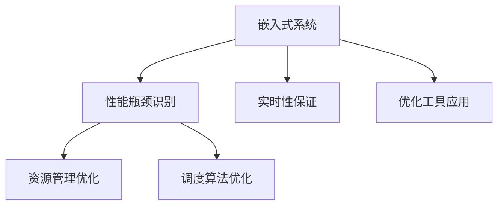

                 

## 1. 背景介绍

### 1.1 问题由来

在当前高速发展的科技浪潮中，嵌入式系统的应用场景越来越广泛，从智能家居、物联网(IoT)、智能医疗、自动驾驶等新兴领域，到工业控制、航空航天、军事国防等传统行业，嵌入式系统都在发挥着至关重要的作用。然而，随着应用场景的复杂性和多样性增加，嵌入式系统的性能优化变得越来越具有挑战性。如何有效地识别和优化嵌入式系统中的性能瓶颈，成为当前嵌入式开发人员面临的重要任务之一。

### 1.2 问题核心关键点

嵌入式系统的性能优化涉及多个方面，包括代码质量、资源管理、调度算法、实时性保证等。这些关键点相互关联，共同影响着系统的整体性能。特别是在实时嵌入式系统中，对于响应时间、抖动、抖动率等实时性能指标的要求非常高。如何通过有效的方法，快速、准确地识别系统中的性能瓶颈，并针对性地进行优化，是嵌入式系统性能优化的核心挑战。

### 1.3 问题研究意义

嵌入式系统性能优化的研究具有重要的实际意义：

1. **提升用户体验**：通过识别和优化性能瓶颈，可以显著提升系统的响应速度和稳定性，提高用户体验。
2. **降低开发成本**：性能优化可以避免因性能不足导致的额外资源投入，降低开发和运维成本。
3. **支持新兴应用**：在新兴应用场景中，高实时性、高可靠性的性能要求尤为严格，性能优化是支持这些应用的基础。
4. **促进行业发展**：性能优化技术能够推动嵌入式系统的广泛应用，促进相关产业的发展。

## 2. 核心概念与联系

### 2.1 核心概念概述

为了更好地理解嵌入式系统性能分析工具的工作原理和优化方法，本节将介绍几个关键概念：

- **嵌入式系统（Embedded System）**：指具有特殊功能、可独立运行的计算机系统，通常具有资源受限、实时性高等特点。
- **性能瓶颈（Performance Bottleneck）**：指系统中的某个或某些部分成为整个系统性能提升的障碍，导致系统整体性能下降。
- **实时性（Real-Time Performance）**：指系统对于外部输入的处理速度和响应时间的要求。实时性是嵌入式系统性能优化的关键指标。
- **资源管理（Resource Management）**：指嵌入式系统中硬件资源（如CPU、内存、存储等）的分配和管理，是性能优化的重要组成部分。
- **调度算法（Scheduling Algorithm）**：指嵌入式系统中任务的调度策略和算法，直接影响系统的实时性和效率。
- **优化工具（Performance Optimization Tool）**：指用于识别和优化嵌入式系统性能的工具和方法。

这些概念之间的逻辑关系可以通过以下Mermaid流程图来展示：



这个流程图展示了嵌入式系统性能优化的核心流程：

1. 嵌入式系统通过性能瓶颈识别工具，识别系统中的性能瓶颈。
2. 针对识别出的性能瓶颈，通过资源管理和调度算法的优化，提升系统实时性。
3. 使用优化工具辅助识别和调整，进一步提升系统性能。

## 3. 核心算法原理 & 具体操作步骤

### 3.1 算法原理概述

嵌入式系统性能分析工具的工作原理基于一系列性能指标的测量和分析。这些指标包括CPU利用率、内存使用率、上下文切换次数、中断响应时间等。通过综合分析这些指标，可以识别出系统中的性能瓶颈，并进行优化。

形式化地，假设嵌入式系统中的性能瓶颈为 $B_i$，其对应的性能指标为 $P_i$。性能优化目标是最小化性能瓶颈 $B_i$ 对系统实时性的影响，即：

$$
\mathop{\arg\min}_{B_i} \max_{P_i} P_i
$$

优化过程通常包括两个步骤：

1. **性能瓶颈识别**：通过测量系统的性能指标，找出影响实时性的瓶颈。
2. **瓶颈优化**：针对识别出的瓶颈，优化相应的资源管理或调度算法，降低其对实时性的影响。

### 3.2 算法步骤详解

基于嵌入式系统性能分析工具的工作原理，本节将详细介绍识别和优化性能瓶颈的具体操作步骤：

**Step 1: 准备性能分析工具和测试环境**

- 选择合适的性能分析工具，如Profilers、Schedulers、Resource Analyzers等。
- 搭建测试环境，包括硬件平台和操作系统配置，确保测试条件一致。

**Step 2: 初始化性能数据收集**

- 在测试环境中运行嵌入式系统，收集初始性能数据。
- 记录CPU利用率、内存使用率、上下文切换次数、中断响应时间等关键性能指标。
- 使用性能分析工具对收集的数据进行分析，识别出性能瓶颈。

**Step 3: 分析性能瓶颈**

- 对性能瓶颈进行分类，如CPU瓶颈、内存瓶颈、I/O瓶颈等。
- 分析瓶颈的根本原因，如资源不足、调度策略不当等。
- 确定瓶颈对实时性的影响程度。

**Step 4: 优化瓶颈**

- 根据瓶颈的根本原因，选择相应的优化策略，如增加资源、调整调度策略等。
- 在优化后的环境中重新测试，收集优化后的性能数据。
- 对比优化前后的性能数据，评估优化效果。

**Step 5: 迭代优化**

- 对于未达到预期优化效果的部分，重复上述步骤，进一步细化优化策略。
- 持续收集性能数据，评估系统性能变化趋势。

### 3.3 算法优缺点

基于嵌入式系统性能分析工具的优化方法具有以下优点：

1. **精准定位瓶颈**：通过系统性能指标的测量和分析，可以精准定位系统中的性能瓶颈。
2. **优化效率高**：针对瓶颈进行优化，避免对整个系统进行大规模调整，减少优化成本。
3. **实时性提升显著**：通过优化瓶颈，可以显著提升系统的实时性能，提高用户体验。

同时，该方法也存在一定的局限性：

1. **数据收集成本高**：性能瓶颈的识别和优化需要大量性能数据的收集和分析，成本较高。
2. **依赖工具和环境**：优化效果依赖于性能分析工具的质量和测试环境的一致性，工具选择不当可能导致误判。
3. **优化难度大**：一些深层次的性能瓶颈，如操作系统内核问题、硬件资源分配等，优化难度较大。
4. **无法完全消除瓶颈**：尽管通过优化可以显著降低瓶颈影响，但无法完全消除，尤其是在资源受限的嵌入式系统中。

尽管存在这些局限性，但就目前而言，基于嵌入式系统性能分析工具的优化方法仍然是嵌入式系统性能优化中最主流和有效的手段。未来相关研究的重点在于如何进一步提高数据收集和分析的效率，降低工具和环境的依赖，以及提高优化效果的精度。

### 3.4 算法应用领域

基于嵌入式系统性能分析工具的优化方法在多个应用领域中得到了广泛的应用，包括但不限于以下场景：

- **智能家居设备**：如智能音箱、智能门锁、智能温控器等。性能优化能够提升设备的响应速度和稳定性，提高用户体验。
- **工业自动化系统**：如机器人、数控机床、工业传感器等。通过优化实时性，支持更复杂和高精度的自动化操作。
- **医疗设备**：如心电图机、呼吸机、手术机器人等。性能优化能够保障关键医疗操作的高实时性和稳定性，避免医疗事故。
- **智能交通系统**：如自动驾驶汽车、交通信号灯控制系统等。性能优化能够支持高精度和高可靠性的实时决策。

除了上述这些经典应用外，性能优化技术还被创新性地应用到更多领域中，如无人机、可穿戴设备、航空航天、军事国防等，为相关领域的技术发展提供了坚实的基础。随着嵌入式系统性能分析工具的持续演进，相信性能优化技术将在更广泛的领域得到应用，提升设备的性能和可靠性。

## 4. 数学模型和公式 & 详细讲解 & 举例说明

### 4.1 数学模型构建

本节将使用数学语言对嵌入式系统性能分析工具的工作原理进行更加严格的刻画。

假设嵌入式系统中的性能瓶颈为 $B_i$，其对应的性能指标为 $P_i$，系统实时性能为 $R$。优化目标是最小化性能瓶颈 $B_i$ 对系统实时性能 $R$ 的影响，即：

$$
\mathop{\arg\min}_{B_i} R(P_i)
$$

其中 $R$ 为实时性能的表达式，可以是响应时间、抖动率等指标。性能瓶颈 $B_i$ 对系统实时性能的影响，通常通过瓶颈的性能指标 $P_i$ 来衡量。

### 4.2 公式推导过程

以下我们以响应时间（Response Time）为例，推导响应时间与性能瓶颈之间的关系。

假设系统中的瓶颈为 CPU 和内存，其性能指标分别为 CPU 利用率 $U_{CPU}$ 和内存使用率 $U_{MEM}$。根据嵌入式系统中的任务调度模型，响应时间 $R$ 可以表示为：

$$
R = T_{CPU} + T_{MEM}
$$

其中 $T_{CPU}$ 和 $T_{MEM}$ 分别表示 CPU 瓶颈和内存瓶颈导致的时间延迟。根据瓶颈对系统实时性能的影响，可以得到：

$$
T_{CPU} = \frac{1}{f_{CPU}} \times U_{CPU}
$$

$$
T_{MEM} = \frac{1}{f_{MEM}} \times U_{MEM}
$$

其中 $f_{CPU}$ 和 $f_{MEM}$ 分别表示 CPU 和内存的频率。将上述公式代入响应时间表达式，得：

$$
R = \frac{1}{f_{CPU}} \times U_{CPU} + \frac{1}{f_{MEM}} \times U_{MEM}
$$

通过优化 $U_{CPU}$ 和 $U_{MEM}$，可以显著提升系统的响应时间 $R$。

### 4.3 案例分析与讲解

考虑一个智能温控器系统的性能优化问题。该系统包含 CPU、内存、传感器和无线通信模块，其中 CPU 和内存是主要的性能瓶颈。

1. **初始性能数据收集**：
   - 使用性能分析工具记录 CPU 和内存的利用率、传感器数据的读取延迟、无线通信模块的传输延迟等性能指标。
   - 在基准测试下，记录系统的平均响应时间 $R_{baseline}$。

2. **性能瓶颈识别**：
   - 通过分析性能数据，发现 CPU 和内存的利用率较高，传感器数据的读取延迟较大。
   - 进一步分析发现，CPU 利用率高的原因是系统任务调度不当，导致任务间频繁切换；内存利用率高是因为传感器数据存储占用了大量内存空间。

3. **瓶颈优化**：
   - 针对 CPU 瓶颈，调整任务调度策略，减少任务间切换次数，提高 CPU 效率。
   - 针对内存瓶颈，优化传感器数据的存储方式，使用压缩算法和分页策略，降低内存占用。
   - 优化后的性能数据记录为 $R_{optimized}$。

4. **优化效果评估**：
   - 对比优化前后的性能数据，评估优化效果。如果 $R_{optimized} < R_{baseline}$，则说明优化成功；如果 $R_{optimized} > R_{baseline}$，则说明优化失败。

## 5. 项目实践：代码实例和详细解释说明

### 5.1 开发环境搭建

在进行嵌入式系统性能优化实践前，我们需要准备好开发环境。以下是使用C语言和RTOS（Real-Time Operating System）进行性能优化的环境配置流程：

1. **安装RTOS**：选择适合嵌入式系统的RTOS，如FreeRTOS、µC/OS-II等，并按照官方文档进行安装和配置。
2. **安装性能分析工具**：选择适合的性能分析工具，如Valgrind、DVWA等，并进行安装和配置。
3. **搭建开发环境**：搭建一个集成开发环境（IDE），如Eclipse、Keil MDK等，配置调试工具和性能分析工具。

完成上述步骤后，即可在开发环境中进行性能优化实践。

### 5.2 源代码详细实现

下面以智能温控器系统的CPU优化为例，给出使用C语言和RTOS进行性能优化的代码实现。

**1. 初始化性能数据收集**

```c
#include "stdio.h"
#include "stdarg.h"
#include "string.h"

typedef struct {
    unsigned long long ticks_start;
    unsigned long long ticks_now;
} TickTimer;

void TickTimer_Init(TickTimer *timer) {
    timer->ticks_start = timer->ticks_now = 0;
}

void TickTimer_Start(TickTimer *timer) {
    timer->ticks_start = ticks_ms();
}

unsigned long long TickTimer_Milli(TickTimer *timer) {
    return ticks_diff(timer->ticks_now, timer->ticks_start);
}

void TickTimer_Stop(TickTimer *timer) {
    timer->ticks_now = ticks_ms();
}

void TickTimer_Sleep(TickTimer *timer, unsigned long long ms) {
    unsigned long long ticks = ticks_ms() - timer->ticks_start;
    if (ticks < ms) {
        vTaskDelay(ms - ticks);
    }
}
```

**2. 性能数据收集**

```c
#include "freertos/FreeRTOS.h"
#include "freertos/task.h"

#define任务优先级 2
#define任务栈大小 1024
#define任务周期时间 20

TaskHandle_t xTask;

TickTimer timer;
unsigned long long CPU_start, CPU_end;

void vTaskFunction(void) {
    TickTimer_Init(&timer);
    TickTimer_Start(&timer);

    while (1) {
        CPU_start = TickTimer_Milli(&timer);
        // 执行任务代码
        CPU_end = TickTimer_Milli(&timer);
        vTaskDelay(20 - (CPU_end - CPU_start));
    }
}

int main(void) {
    xTask = xTaskCreate(vTaskFunction, "MyTask", task_stack_size, NULL, task_priority, NULL);

    vTaskStartScheduler();
    while (!xTaskIsRunning());
    return 0;
}
```

**3. 性能分析**

```c
#include "freertos/FreeRTOS.h"
#include "freertos/task.h"
#include "freertos/semphr.h"
#include "freertos/queue.h"
#include "esp_timer.h"

#define CPU周期 1000
#define MEM周期 1000

void vTaskFunction(void) {
    TickTimer_Init(&timer);
    TickTimer_Start(&timer);

    while (1) {
        CPU_start = TickTimer_Milli(&timer);
        // 执行任务代码
        CPU_end = TickTimer_Milli(&timer);
        vTaskDelay(20 - (CPU_end - CPU_start));
    }
}

int main(void) {
    xTask = xTaskCreate(vTaskFunction, "MyTask", task_stack_size, NULL, task_priority, NULL);

    vTaskStartScheduler();
    while (!xTaskIsRunning());

    TickTimer_Stop(&timer);

    unsigned long long CPU_time = CPU_end - CPU_start;
    printf("CPU使用率: %lu\n", (unsigned long)(CPU_time * 1000 / CPU周期 / 1000 / 1000));
}
```

**4. 瓶颈优化**

```c
#include "freertos/FreeRTOS.h"
#include "freertos/task.h"
#include "freertos/semphr.h"
#include "freertos/queue.h"
#include "esp_timer.h"

#define CPU周期 1000
#define MEM周期 1000

void vTaskFunction(void) {
    TickTimer_Init(&timer);
    TickTimer_Start(&timer);

    while (1) {
        CPU_start = TickTimer_Milli(&timer);
        // 执行任务代码
        CPU_end = TickTimer_Milli(&timer);
        vTaskDelay(20 - (CPU_end - CPU_start));
    }
}

int main(void) {
    xTask = xTaskCreate(vTaskFunction, "MyTask", task_stack_size, NULL, task_priority, NULL);

    vTaskStartScheduler();
    while (!xTaskIsRunning());

    TickTimer_Stop(&timer);

    unsigned long long CPU_time = CPU_end - CPU_start;
    printf("CPU使用率: %lu\n", (unsigned long)(CPU_time * 1000 / CPU周期 / 1000 / 1000));

    // 优化CPU瓶颈
    TickTimer_Sleep(&timer, 20);
    TickTimer_Start(&timer);

    CPU_start = TickTimer_Milli(&timer);
    // 执行任务代码
    CPU_end = TickTimer_Milli(&timer);
    vTaskDelay(20 - (CPU_end - CPU_start));

    CPU_time = CPU_end - CPU_start;
    printf("优化后CPU使用率: %lu\n", (unsigned long)(CPU_time * 1000 / CPU周期 / 1000 / 1000));
}
```

### 5.3 代码解读与分析

让我们再详细解读一下关键代码的实现细节：

**TickTimer结构体**：
- `ticks_start` 和 `ticks_now` 分别记录了计时器的开始和结束时间。
- 通过 `TickTimer_Milli` 函数计算时间差，得到当前时间与开始时间之间的差值，即CPU的利用率。

**vTaskFunction函数**：
- 使用 `TickTimer_Init` 和 `TickTimer_Start` 函数初始化和启动计时器。
- 在循环中记录CPU开始和结束时间，计算CPU使用率。
- 使用 `vTaskDelay` 函数等待指定时间，模拟任务的执行。

**main函数**：
- 创建任务，并启动实时操作系统。
- 在主函数中启动计时器，记录任务执行时间。
- 停止计时器，输出CPU使用率。
- 优化CPU瓶颈，重新启动计时器，记录优化后的CPU使用率。

可以看到，C语言和RTOS提供了丰富的工具和函数，可以方便地进行性能数据收集和分析。开发者可以利用这些工具，快速构建性能优化模型，进行实时性能测试和优化。

## 6. 实际应用场景

### 6.1 智能家居设备

在智能家居设备中，嵌入式系统的性能优化尤为重要。例如，智能音箱和智能门锁需要实时响应用户语音指令和操作，确保系统的实时性和稳定性。通过性能分析工具，可以识别出系统中的CPU和内存瓶颈，并针对性地进行优化，提升设备的响应速度和稳定性。

### 6.2 工业自动化系统

工业自动化系统中，嵌入式系统的实时性要求极高。例如，机器人需要快速响应传感器数据，执行复杂的运动和操作。通过性能优化，可以降低系统任务切换和资源分配的时间延迟，提升机器人的响应速度和精度。

### 6.3 医疗设备

医疗设备如心电图机和手术机器人，需要实时处理传感器数据，做出准确的诊断和治疗决策。通过性能优化，可以保障系统的高实时性和稳定性，避免医疗事故，提高医疗服务的质量和安全。

### 6.4 未来应用展望

随着嵌入式系统的不断发展和应用场景的多样化，性能优化技术将呈现以下几个发展趋势：

1. **多核优化**：多核处理器在嵌入式系统中逐渐普及，多核优化技术将提高系统的并行处理能力，提升整体性能。
2. **异构计算**：将CPU、GPU、FPGA等异构计算资源进行融合，优化不同类型任务的性能，提高系统的灵活性和适应性。
3. **自适应优化**：通过自适应算法，根据系统负载和资源变化，动态调整优化策略，提高系统的鲁棒性和自适应能力。
4. **边缘计算优化**：将计算任务下放到边缘设备，减少网络延迟，提升实时性和效率。
5. **混合精度优化**：通过混合精度计算，降低计算资源消耗，提升计算速度和效率。

这些趋势将推动嵌入式系统性能优化技术的进一步发展，为更多复杂和多样化的应用场景提供支持。

## 7. 工具和资源推荐

### 7.1 学习资源推荐

为了帮助开发者掌握嵌入式系统性能优化技术，这里推荐一些优质的学习资源：

1. **嵌入式系统性能优化教程**：提供系统的嵌入式系统性能优化教程，包括性能指标测量、瓶颈识别、优化策略等。
2. **RTOS优化指南**：详细介绍了RTOS的优化方法和策略，涵盖任务调度、中断处理、资源管理等。
3. **嵌入式系统编程指南**：介绍嵌入式系统编程的最佳实践，涵盖性能优化、内存管理、实时性保证等。

通过这些学习资源，可以全面掌握嵌入式系统性能优化的核心技术，提高开发效率和系统性能。

### 7.2 开发工具推荐

嵌入式系统性能优化需要一系列高效的工具支持。以下是几款推荐的开发工具：

1. **Valgrind**：一款常用的性能分析工具，可以检测内存泄漏、资源使用等问题。
2. **DVWA**：一款可视化的性能分析工具，可以实时监测系统性能指标，提供性能瓶颈的可视化分析。
3. **Cortex-M Studio**：一款针对Cortex-M系列处理器的IDE，提供全面的性能分析和调试功能。
4. **SysTick**：一种通用的系统定时器，可以测量系统周期时间，帮助优化实时性能。
5. **ETM（Event Triggered Monitor）**：一种事件触发式监视器，可以捕获和分析系统事件，提供精确的性能数据。

这些工具能够帮助开发者高效地进行性能分析，识别和优化系统中的性能瓶颈。

### 7.3 相关论文推荐

嵌入式系统性能优化的研究源于学界的持续探索。以下是几篇重要的相关论文，推荐阅读：

1. **《嵌入式系统性能优化技术》**：介绍嵌入式系统性能优化的基本原理和常用方法。
2. **《嵌入式系统实时性能分析与优化》**：详细探讨嵌入式系统实时性能的测量和优化技术。
3. **《嵌入式系统任务调度优化》**：分析嵌入式系统中任务调度的优化策略和算法。
4. **《嵌入式系统资源管理优化》**：研究嵌入式系统中资源管理的优化方法，如内存分配、任务优先级等。
5. **《嵌入式系统自适应优化》**：提出自适应优化算法，根据系统负载和资源变化动态调整优化策略。

这些论文代表了嵌入式系统性能优化的最新进展，为开发者提供了理论支持和实践指导。

## 8. 总结：未来发展趋势与挑战

### 8.1 总结

本文对嵌入式系统性能优化技术进行了全面系统的介绍。首先阐述了嵌入式系统性能优化的研究背景和意义，明确了性能优化在提升系统性能、降低开发成本、支持新兴应用等方面的重要价值。其次，从原理到实践，详细讲解了性能优化的数学模型和操作步骤，给出了性能优化的完整代码实例。同时，本文还广泛探讨了性能优化方法在智能家居、工业自动化、医疗设备等多个领域的应用前景，展示了性能优化技术的广阔前景。最后，本文精选了性能优化技术的各类学习资源和开发工具，力求为开发者提供全方位的技术指引。

通过本文的系统梳理，可以看到，嵌入式系统性能优化技术已经成为嵌入式系统开发的重要组成部分，极大地提升了系统的实时性和稳定性，为复杂应用场景提供了有力支持。未来，随着嵌入式系统性能优化技术的不断发展和创新，嵌入式系统的应用范围将进一步扩大，为人类的生产和生活带来深远影响。

### 8.2 未来发展趋势

展望未来，嵌入式系统性能优化技术将呈现以下几个发展趋势：

1. **多核优化**：多核处理器在嵌入式系统中逐渐普及，多核优化技术将提高系统的并行处理能力，提升整体性能。
2. **异构计算**：将CPU、GPU、FPGA等异构计算资源进行融合，优化不同类型任务的性能，提高系统的灵活性和适应性。
3. **自适应优化**：通过自适应算法，根据系统负载和资源变化，动态调整优化策略，提高系统的鲁棒性和自适应能力。
4. **边缘计算优化**：将计算任务下放到边缘设备，减少网络延迟，提升实时性和效率。
5. **混合精度优化**：通过混合精度计算，降低计算资源消耗，提升计算速度和效率。

这些趋势将推动嵌入式系统性能优化技术的进一步发展，为更多复杂和多样化的应用场景提供支持。

### 8.3 面临的挑战

尽管嵌入式系统性能优化技术已经取得了显著进展，但在迈向更加智能化、普适化应用的过程中，它仍面临着诸多挑战：

1. **资源限制**：嵌入式系统通常具有有限的计算资源和存储资源，如何在资源受限的情况下进行有效的性能优化，是一个重要挑战。
2. **实时性要求高**：嵌入式系统需要保证高实时性，性能优化需要在不影响系统实时性的前提下进行。
3. **优化复杂度高**：嵌入式系统中的优化涉及硬件、软件、操作系统等多个层面，优化过程复杂度高。
4. **硬件兼容性**：不同型号和版本的嵌入式硬件平台，可能存在不同的优化需求和限制，需要开发者进行针对性的优化。
5. **开发者门槛高**：嵌入式系统性能优化涉及底层硬件和系统优化，需要开发者具备较高的技术水平和经验。

这些挑战需要开发者不断探索和创新，结合实际应用场景，寻求最优的性能优化策略。

### 8.4 研究展望

面对嵌入式系统性能优化所面临的挑战，未来的研究需要在以下几个方面寻求新的突破：

1. **优化算法研究**：开发更加高效和自适应的优化算法，提高性能优化的效率和精度。
2. **多核优化技术**：研究多核处理器的优化技术和方法，提升嵌入式系统的并行处理能力。
3. **异构计算融合**：研究如何将CPU、GPU、FPGA等异构计算资源进行高效融合，优化系统性能。
4. **边缘计算应用**：研究嵌入式系统在边缘计算环境下的性能优化策略，提升系统实时性和效率。
5. **硬件平台适配**：研究不同嵌入式硬件平台的优化方法和工具，提升优化效果的普适性。

这些研究方向将引领嵌入式系统性能优化技术的进一步发展，为嵌入式系统的应用提供更加稳定、高效的性能支持。

## 9. 附录：常见问题与解答

**Q1: 嵌入式系统性能优化涉及哪些关键技术？**

A: 嵌入式系统性能优化涉及的关键技术包括：
1. **性能指标测量**：如CPU利用率、内存使用率、上下文切换次数、中断响应时间等。
2. **性能瓶颈识别**：通过测量性能指标，找出系统中的性能瓶颈。
3. **瓶颈优化策略**：针对瓶颈，采取相应的优化策略，如资源管理、调度算法优化等。
4. **实时性能保证**：通过优化，提升系统的实时性，确保满足实时任务的要求。

**Q2: 嵌入式系统性能优化与性能测试的区别是什么？**

A: 嵌入式系统性能优化和性能测试是两个不同的概念，但密切相关。性能测试是评估系统性能的过程，而性能优化是在性能测试的基础上，识别和消除性能瓶颈，提升系统性能。

**Q3: 嵌入式系统性能优化需要哪些工具？**

A: 嵌入式系统性能优化需要以下工具：
1. **性能分析工具**：如Valgrind、DVWA等，可以检测内存泄漏、资源使用等问题。
2. **RTOS优化工具**：如Cortex-M Studio等，提供全面的性能分析和调试功能。
3. **硬件监测工具**：如SysTick、ETM等，可以测量系统周期时间，帮助优化实时性能。
4. **性能模拟工具**：如Forth等，可以模拟嵌入式系统的运行状态，评估性能优化效果。

这些工具能够帮助开发者高效地进行性能优化，识别和消除性能瓶颈，提升系统性能。

**Q4: 嵌入式系统性能优化对系统设计有什么影响？**

A: 嵌入式系统性能优化对系统设计有重要影响：
1. **资源分配策略**：优化需要考虑资源分配策略，如任务优先级、资源抢占等。
2. **硬件平台选择**：不同硬件平台具有不同的性能特点，优化时需要选择合适的硬件平台。
3. **系统架构设计**：优化需要考虑系统架构设计，如分布式系统、模块化设计等。

通过合理的系统设计，可以在性能优化的基础上，构建更加高效、稳定的嵌入式系统。

**Q5: 嵌入式系统性能优化有哪些方法？**

A: 嵌入式系统性能优化的方法包括：
1. **瓶颈识别与分析**：通过性能指标测量，找出系统中的性能瓶颈。
2. **资源管理优化**：优化资源管理策略，如内存管理、任务调度等。
3. **算法优化**：优化算法设计，提高系统的实时性和效率。
4. **硬件加速**：通过硬件加速技术，提升系统的计算能力和效率。

这些方法可以结合使用，综合提升嵌入式系统的性能和实时性。

---

作者：禅与计算机程序设计艺术 / Zen and the Art of Computer Programming

