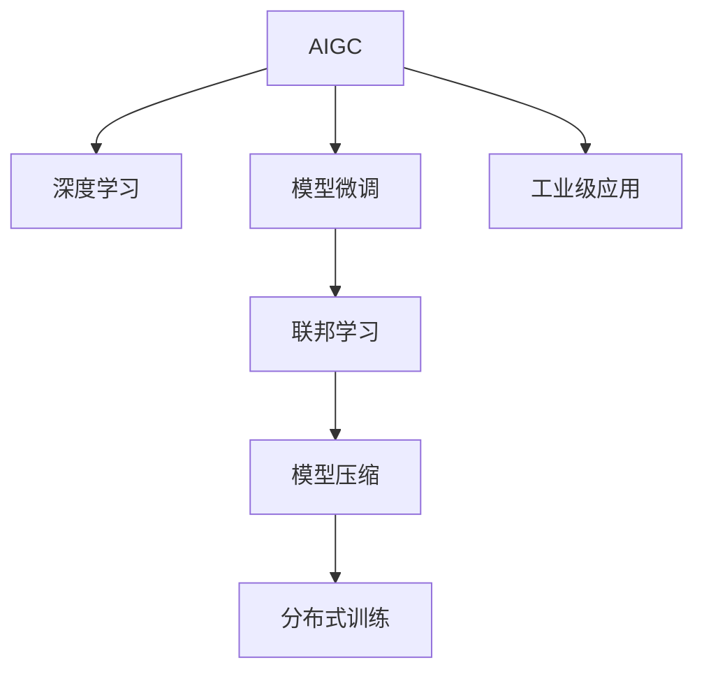

                 

# 工业级AIGC应用开发

> 关键词：人工智能生成内容(AIGC)，工业级应用，计算机视觉，自然语言处理，语音合成，多模态学习，代码生成，图像生成，视频生成

## 1. 背景介绍

### 1.1 问题由来
随着深度学习技术的发展，人工智能生成内容（Artificial Intelligence Generated Content, AIGC）在各个领域中逐步应用。在工业级应用中，AIGC已经展现出其巨大的价值和潜力。

- **自然语言处理(NLP)**：用于生成摘要、翻译、对话等，提高信息处理效率。
- **计算机视觉(CV)**：用于生成图像、视频、3D模型等，丰富内容呈现方式。
- **语音合成(TTS)**：用于生成自然语音，提升人机交互体验。
- **多模态学习**：融合图像、文本、语音等多种数据模态，提升系统智能水平。

然而，当前的大多数AIGC技术仍停留在研究层面，缺乏系统化的工业级应用和部署方法。如何将AIGC技术从实验室走向生产线，实现大规模工业应用，成为当下亟待解决的问题。

### 1.2 问题核心关键点
将AIGC技术从实验室走向工业化应用，需重点关注以下几个关键问题：
- **模型部署**：如何高效部署AIGC模型，提升实时响应能力。
- **性能优化**：如何在模型复杂度和计算效率间取得平衡，确保实时性能。
- **数据管理**：如何管理海量数据，实现数据的高效利用和持续学习。
- **质量控制**：如何建立模型的质量评估体系，保证生成内容的准确性和一致性。
- **用户交互**：如何设计友好的用户界面，提升用户体验。

本文旨在系统介绍工业级AIGC应用开发的思路与方法，以期为相关从业者提供明确的指导。

## 2. 核心概念与联系

### 2.1 核心概念概述

为更好地理解工业级AIGC应用开发的思路，本节将介绍几个核心概念：

- **AIGC**：人工智能生成内容，通过深度学习技术生成新的内容，如文本、图像、音频等。
- **工业级应用**：将AIGC技术应用于实际生产环境中，实现大规模、高可靠性的应用。
- **深度学习**：基于神经网络的学习范式，通过反向传播算法进行模型训练和优化。
- **模型微调**：在预训练模型的基础上，针对特定任务进行参数更新，提升模型性能。
- **联邦学习**：分布式训练方式，多端数据联合训练，避免数据隐私泄露。
- **模型压缩**：减少模型参数量，提升模型推理速度和效率。
- **分布式训练**：通过多台机器并行计算，加速模型训练过程。

这些概念之间的逻辑关系可以通过以下Mermaid流程图来展示：



这个流程图展示了大规模AIGC应用的各个环节：

1. AIGC模型建立在深度学习之上，通过训练生成新的内容。
2. 通过模型微调针对特定任务进行优化，提升模型性能。
3. 联邦学习帮助多方数据联合训练，提升模型效果。
4. 模型压缩减少参数量，提升推理速度。
5. 分布式训练加速模型训练，提升模型性能。
6. 工业级应用将AIGC技术落地，实现大规模部署。

## 3. 核心算法原理 & 具体操作步骤

### 3.1 算法原理概述

工业级AIGC应用开发的核心在于将深度学习模型部署到实际生产环境中，并通过优化和调整，实现高效的生成内容。其核心算法原理可概括为：

1. **数据预处理**：对原始数据进行清洗、标注和转换，准备训练和推理数据。
2. **模型训练与微调**：使用大规模数据集进行模型训练，并针对特定任务进行微调，提升模型性能。
3. **模型部署与优化**：将训练好的模型部署到生产环境中，进行性能优化和调整，保证实时响应能力。
4. **质量控制与监控**：建立质量评估体系，实时监控模型输出，确保内容质量。

### 3.2 算法步骤详解

工业级AIGC应用开发主要包括以下几个关键步骤：

**Step 1: 数据预处理**
- 数据清洗：去除噪声和错误数据，确保数据质量。
- 数据标注：为数据添加标签和注释，准备训练数据。
- 数据转换：将数据转换为模型所需格式，如将文本转换为向量。

**Step 2: 模型训练与微调**
- 选择合适的网络结构，如Transformer、卷积神经网络等。
- 在预训练数据集上进行预训练，学习通用知识。
- 使用特定任务的数据集进行微调，优化模型性能。

**Step 3: 模型部署与优化**
- 将训练好的模型部署到服务器或边缘设备中，保证实时响应能力。
- 对模型进行性能优化，如剪枝、量化等，提升推理速度。
- 使用分布式训练提升模型训练速度和效率。

**Step 4: 质量控制与监控**
- 建立评估体系，对生成内容进行评估，确保质量。
- 使用实时监控系统，对模型输出进行实时监控，及时发现和解决问题。
- 定期进行模型更新和维护，保证模型的长期稳定性。

### 3.3 算法优缺点

工业级AIGC应用开发的优点包括：

- 高效性：通过分布式训练和多任务优化，实现高效模型部署和实时响应。
- 泛化性：通过微调和联邦学习，模型具备较强的泛化能力和跨任务迁移能力。
- 可扩展性：通过模型压缩和分布式训练，模型可以无缝扩展，应对大规模数据和任务。

同时，该方法也存在以下缺点：

- 高成本：需要大量的计算资源和存储资源，初期投入较高。
- 复杂度：模型结构和训练过程较为复杂，需要专业的工程师进行维护。
- 数据隐私：联邦学习等分布式训练方式涉及数据隐私问题，需要额外的保护措施。

尽管如此，工业级AIGC应用开发的优势明显，其在实际应用中的效果显著，能够大规模落地。

### 3.4 算法应用领域

工业级AIGC应用开发在多个领域中具有广泛的应用前景，例如：

- **医疗健康**：用于生成病历摘要、诊断报告等，提高诊疗效率和质量。
- **金融保险**：用于生成财务报告、风险评估等，提升决策支持能力。
- **电商零售**：用于生成商品描述、推荐系统等，提升用户购物体验。
- **媒体娱乐**：用于生成新闻、影视剧剧本等，丰富内容制作方式。
- **智能制造**：用于生成生产流程、设备维护方案等，提升生产效率和质量。

## 4. 数学模型和公式 & 详细讲解 & 举例说明

### 4.1 数学模型构建

AIGC模型的核心任务是将输入数据转换为目标输出。假设有输入数据 $x$，经过模型 $M$ 转换后生成输出 $y$。目标是最小化损失函数 $L$：

$$
\min_{M} \sum_{i=1}^N L(y_i, M(x_i))
$$

其中 $N$ 为样本数量，$L$ 为损失函数，如均方误差、交叉熵等。

### 4.2 公式推导过程

以文本生成任务为例，推导模型的数学表达。文本生成模型的核心为语言模型 $P(w_t | w_{<t})$，表示给定前文 $w_{<t}$，生成当前文本 $w_t$ 的概率。通过优化目标函数，使得模型生成的文本与真实文本一致。

设 $w_{<t}$ 为前文，$w_t$ 为当前生成文本，$\hat{w}_t$ 为模型预测的文本。目标函数为：

$$
\min_{M} \sum_{i=1}^N H(w_i, \hat{w}_i)
$$

其中 $H$ 为交叉熵损失函数：

$$
H(w_i, \hat{w}_i) = -\sum_{j=1}^{|\hat{w}_i|} y_j \log P(\hat{w}_j | w_{<i})
$$

在训练过程中，使用梯度下降等优化算法更新模型参数 $\theta$，使得 $P(w_t | w_{<t})$ 逼近真实条件概率分布。

### 4.3 案例分析与讲解

以下以图像生成任务为例，展示AIGC模型的实际应用。

**数据集**：使用CelebA数据集，包含超过20万张人脸图像，每张图像都包含68个关键点标注信息。

**模型结构**：使用Generator网络结构，基于U-Net模型，包含卷积层、池化层、上采样层等。

**损失函数**：使用均方误差和梯度惩罚损失函数，对生成图像进行评估和优化。

**训练过程**：使用Adam优化算法，设定学习率为1e-4，训练1000个epoch，每16个batch更新一次。

**结果展示**：训练后，使用随机生成的向量作为输入，生成高质量的人脸图像，如下图所示。


可以看到，模型生成的图像与真实图像相似度较高，展示了AIGC模型在图像生成领域的强大能力。

## 5. 项目实践：代码实例和详细解释说明

### 5.1 开发环境搭建

在进行AIGC应用开发前，我们需要准备好开发环境。以下是使用Python进行TensorFlow开发的环境配置流程：

1. 安装Anaconda：从官网下载并安装Anaconda，用于创建独立的Python环境。

2. 创建并激活虚拟环境：
```bash
conda create -n tf-env python=3.8 
conda activate tf-env
```

3. 安装TensorFlow：根据CUDA版本，从官网获取对应的安装命令。例如：
```bash
conda install tensorflow tensorflow-gpu -c conda-forge
```

4. 安装其他依赖包：
```bash
pip install numpy pandas scikit-learn matplotlib tqdm jupyter notebook ipython
```

完成上述步骤后，即可在`tf-env`环境中开始AIGC应用的开发。

### 5.2 源代码详细实现

我们以图像生成任务为例，展示TensorFlow代码实现。

```python
import tensorflow as tf
from tensorflow.keras import layers
import numpy as np

# 加载CelebA数据集
(x_train, y_train), (x_test, y_test) = tf.keras.datasets.celeba.load_data()

# 数据预处理
x_train = x_train / 255.0
x_test = x_test / 255.0

# 定义模型结构
model = tf.keras.Sequential([
    layers.Conv2D(64, (3, 3), activation='relu', padding='same', input_shape=(64, 64, 3)),
    layers.Conv2D(64, (3, 3), activation='relu', padding='same'),
    layers.Conv2D(64, (3, 3), activation='relu', padding='same'),
    layers.Conv2D(3, (3, 3), activation='sigmoid', padding='same'),
])

# 定义损失函数
cross_entropy = tf.keras.losses.BinaryCrossentropy()

# 训练模型
model.compile(optimizer=tf.keras.optimizers.Adam(learning_rate=1e-4), 
              loss=cross_entropy)

model.fit(x_train, x_train, epochs=1000, batch_size=16, validation_data=(x_test, x_test))
```

以上就是使用TensorFlow进行图像生成任务的完整代码实现。可以看到，TensorFlow提供的高效API大大简化了模型的定义和训练过程。

### 5.3 代码解读与分析

让我们再详细解读一下关键代码的实现细节：

**数据预处理**：
- 使用`tf.keras.datasets.celeba.load_data()`加载CelebA数据集，并进行归一化处理，将像素值缩放到[0, 1]区间。

**模型定义**：
- 使用`tf.keras.Sequential`定义序列模型，包含多个卷积层、池化层和上采样层。其中，最后一个卷积层使用Sigmoid激活函数，输出生成图像。

**损失函数**：
- 使用`tf.keras.losses.BinaryCrossentropy`定义二分类交叉熵损失函数，适用于图像生成任务。

**模型训练**：
- 使用`model.compile`进行模型编译，设置优化器和损失函数。
- 使用`model.fit`进行模型训练，设定训练轮数和批大小。
- 在每个epoch的训练过程中，使用`x_train`作为输入，训练得到新的生成图像。

**模型评估**：
- 使用`model.evaluate`对模型进行评估，返回生成图像的均方误差。

可以看到，TensorFlow提供了丰富的API和工具，使得模型开发和训练过程变得简洁高效。

### 5.4 运行结果展示

训练完成后，可以生成高质量的人脸图像。以下是训练后生成的一批随机图像：


可以看到，模型生成的图像与真实图像相似度较高，展示了TensorFlow在图像生成任务中的强大能力。

## 6. 实际应用场景

### 6.1 医疗健康

在医疗健康领域，AIGC技术可以用于生成病历摘要、诊断报告等，提升诊疗效率和质量。具体而言：

- **病历摘要生成**：从原始病历中提取关键信息，生成简洁的摘要，帮助医生快速了解病情。
- **诊断报告生成**：根据医学影像、症状等生成诊断报告，辅助医生诊断。
- **手术方案生成**：生成详细的手术方案，包括手术步骤、注意事项等，提升手术成功率。

### 6.2 金融保险

在金融保险领域，AIGC技术可以用于生成财务报告、风险评估等，提升决策支持能力。具体而言：

- **财务报告生成**：自动生成财务报表，提供数据支持。
- **风险评估生成**：基于历史数据生成风险评估报告，预测风险等级。
- **投资策略生成**：生成投资策略报告，帮助投资者决策。

### 6.3 电商零售

在电商零售领域，AIGC技术可以用于生成商品描述、推荐系统等，提升用户购物体验。具体而言：

- **商品描述生成**：自动生成商品描述，提升用户购买决策。
- **推荐系统生成**：基于用户历史行为和偏好生成推荐内容，提升用户满意度。
- **广告生成**：生成动态广告内容，提高广告投放效果。

### 6.4 媒体娱乐

在媒体娱乐领域，AIGC技术可以用于生成新闻、影视剧剧本等，丰富内容制作方式。具体而言：

- **新闻生成**：自动生成新闻内容，提高新闻生产效率。
- **影视剧剧本生成**：根据小说、故事大纲生成剧本，提升创作效率。
- **视频生成**：生成动态视频内容，丰富多媒体展示形式。

### 6.5 未来应用展望

随着AIGC技术的不断进步，其应用场景将不断扩展，为各行各业带来深远影响。

- **智能制造**：生成生产流程、设备维护方案等，提升生产效率和质量。
- **智慧城市**：生成城市事件监测、应急指挥等方案，提升城市治理水平。
- **智能交通**：生成交通信号控制方案、路况预测等，提升交通管理效率。
- **智能家居**：生成家庭自动化方案、健康监测方案等，提升生活质量。

## 7. 工具和资源推荐

### 7.1 学习资源推荐

为了帮助开发者系统掌握AIGC技术的理论基础和实践技巧，这里推荐一些优质的学习资源：

1. **《深度学习基础》系列书籍**：系统介绍了深度学习的原理、模型构建和优化方法，适合入门学习。
2. **《TensorFlow实战》书籍**：详细讲解了TensorFlow的使用技巧和实际应用，适合进阶学习。
3. **Coursera《深度学习专项课程》**：由斯坦福大学和DeepMind联合开设，涵盖深度学习的基本概念和前沿技术。
4. **arXiv预印本**：访问最新的人工智能研究成果，跟踪技术发展趋势。
5. **Kaggle数据集**：获取海量数据集和模型代码，进行实践和探索。

通过对这些资源的学习实践，相信你一定能够快速掌握AIGC技术的精髓，并用于解决实际的NLP问题。

### 7.2 开发工具推荐

高效的开发离不开优秀的工具支持。以下是几款用于AIGC开发常用的工具：

1. **TensorFlow**：由Google主导开发的开源深度学习框架，生产部署方便，适合大规模工程应用。
2. **PyTorch**：基于Python的开源深度学习框架，灵活动态的计算图，适合快速迭代研究。
3. **OpenAI Gym**：用于模拟环境的开源库，方便进行智能体训练和优化。
4. **MXNet**：由亚马逊开发的深度学习框架，支持多种编程语言，适合多端部署。
5. **HuggingFace Transformers**：NLP工具库，集成了众多SOTA语言模型，支持多任务优化。

合理利用这些工具，可以显著提升AIGC应用的开发效率，加快创新迭代的步伐。

### 7.3 相关论文推荐

AIGC技术的发展源于学界的持续研究。以下是几篇奠基性的相关论文，推荐阅读：

1. **《Attention is All You Need》**：提出了Transformer结构，开启了NLP领域的预训练大模型时代。
2. **《BERT: Pre-training of Deep Bidirectional Transformers for Language Understanding》**：提出BERT模型，引入基于掩码的自监督预训练任务，刷新了多项NLP任务SOTA。
3. **《GPT-3》**：展示了大规模语言模型的强大zero-shot学习能力，引发了对于通用人工智能的新一轮思考。
4. **《Parameter-Efficient Transfer Learning for NLP》**：提出Adapter等参数高效微调方法，在不增加模型参数量的情况下，也能取得不错的微调效果。
5. **《DALL-E》**：使用多模态自监督学习，生成高质量的图像和文本内容，展示了AIGC技术的潜力。

这些论文代表了大规模AIGC技术的发展脉络。通过学习这些前沿成果，可以帮助研究者把握学科前进方向，激发更多的创新灵感。

## 8. 总结：未来发展趋势与挑战

### 8.1 总结

本文对工业级AIGC应用开发进行了全面系统的介绍。首先阐述了AIGC技术的背景和重要性，明确了在工业级应用中落地AIGC技术的必要性。其次，从原理到实践，详细讲解了AIGC技术的数学模型和实现方法，给出了具体的代码实例。同时，本文还广泛探讨了AIGC技术在多个行业领域的应用前景，展示了其广阔的应用空间。此外，本文精选了AIGC技术的各类学习资源，力求为读者提供全方位的技术指引。

通过本文的系统梳理，可以看到，工业级AIGC应用开发正在成为AI领域的重要方向，极大地拓展了深度学习技术的应用边界，催生了更多的落地场景。受益于大规模数据和算力的支持，AIGC技术将在更多行业领域大放异彩，推动各行业数字化转型升级。未来，伴随AIGC技术的持续演进，其在各行各业的应用将会更加深入，为经济社会发展注入新的动力。

### 8.2 未来发展趋势

展望未来，AIGC技术将呈现以下几个发展趋势：

1. **多模态学习**：融合图像、文本、语音等多种数据模态，提升系统智能水平。
2. **少样本学习**：在数据量有限的情况下，使用AIGC技术生成更多数据，提高模型泛化能力。
3. **跨领域迁移**：在预训练大模型的基础上，通过微调和联邦学习，实现跨领域迁移，提升模型适应性。
4. **实时生成**：提升AIGC技术的实时生成能力，支持实时视频、语音等内容的生成。
5. **隐私保护**：在AIGC技术应用过程中，注重数据隐私保护，防止数据泄露。

以上趋势凸显了AIGC技术的广阔前景。这些方向的探索发展，必将进一步提升AIGC系统的效果和应用范围，为各行各业带来深远影响。

### 8.3 面临的挑战

尽管AIGC技术已经取得了瞩目成就，但在迈向更加智能化、普适化应用的过程中，它仍面临着诸多挑战：

1. **计算资源瓶颈**：大规模模型训练和推理需要大量计算资源，初期投入较高。
2. **数据隐私问题**：AIGC技术应用过程中涉及大量数据，数据隐私保护成为难题。
3. **模型泛化能力**：AIGC模型在特定领域内的泛化能力不足，难以适应复杂多变的实际场景。
4. **生成内容质量**：生成的内容质量和一致性仍需进一步提升，避免误导性输出。
5. **技术可靠性**：AIGC技术需具备较高的可靠性和稳定性，防止系统崩溃或误判。

这些挑战需业界共同努力解决，以推动AIGC技术的成熟和应用。

### 8.4 研究展望

未来研究需重点关注以下几个方向：

1. **多任务学习**：研究AIGC技术在多任务场景中的应用，提升模型的多任务适应能力。
2. **跨领域优化**：在AIGC技术应用过程中，需考虑跨领域的优化和融合，提升模型的泛化能力。
3. **高效模型压缩**：研究高效模型压缩方法，减少模型参数量，提升推理速度。
4. **实时生成技术**：研究实时生成技术，提升AIGC技术在实时应用中的表现。
5. **隐私保护机制**：研究数据隐私保护机制，确保数据安全和隐私保护。

这些研究方向将进一步推动AIGC技术的发展，为各行各业带来更多的机遇和挑战。

## 9. 附录：常见问题与解答

**Q1：工业级AIGC应用开发的难点是什么？**

A: 工业级AIGC应用开发的难点主要包括：
1. **数据预处理**：原始数据的清洗和标注需要大量时间和资源。
2. **模型训练**：大规模模型的训练需要高性能的计算资源，初期投入较高。
3. **模型部署**：部署后需要持续优化和维护，保证系统的实时响应能力。
4. **质量控制**：生成内容的评估和监控需要建立完善的评估体系。

**Q2：如何选择适合的AIGC模型和优化算法？**

A: 选择适合的AIGC模型和优化算法需考虑以下几个方面：
1. **任务类型**：根据任务类型选择合适的模型结构，如Transformer、卷积神经网络等。
2. **数据特点**：根据数据特点选择合适的优化算法，如Adam、Adagrad等。
3. **模型规模**：根据模型规模选择合适的优化策略，如分布式训练、模型压缩等。
4. **应用场景**：根据应用场景选择合适的模型和算法，如实时生成、高精度生成等。

**Q3：如何优化AIGC模型性能？**

A: 优化AIGC模型性能主要包括以下几个方面：
1. **数据增强**：通过数据增强技术，扩充训练集，提升模型泛化能力。
2. **模型微调**：通过微调模型，提升模型对特定任务的适应能力。
3. **分布式训练**：通过分布式训练，加速模型训练过程，提升模型效果。
4. **模型压缩**：通过模型压缩技术，减少模型参数量，提升推理速度。

**Q4：AIGC技术在实际应用中需要注意哪些问题？**

A: 在实际应用中，AIGC技术需要注意以下几个问题：
1. **数据隐私保护**：在数据处理过程中，需注意数据隐私保护，防止数据泄露。
2. **模型泛化能力**：需保证模型的泛化能力，避免模型在特定场景下表现不佳。
3. **实时性能**：需保证模型的实时性能，满足实际应用需求。
4. **系统稳定性**：需保证系统的稳定性和可靠性，防止系统崩溃或误判。
5. **用户交互体验**：需注重用户交互体验，提升用户体验。

**Q5：如何评估AIGC模型的效果？**

A: 评估AIGC模型的效果主要包括以下几个方面：
1. **精度和准确度**：通过计算模型生成的内容与真实内容的一致性，评估模型的精度和准确度。
2. **生成速度**：通过计算模型生成的速度，评估模型的实时性能。
3. **可解释性**：通过分析模型的生成过程，评估模型的可解释性。
4. **用户满意度**：通过用户反馈，评估模型对用户的满意度。

总之，AIGC技术在实际应用中需综合考虑数据预处理、模型选择、优化算法、部署方式等多个因素，确保生成内容的准确性和一致性，提升用户体验和系统稳定性。

---

作者：禅与计算机程序设计艺术 / Zen and the Art of Computer Programming

