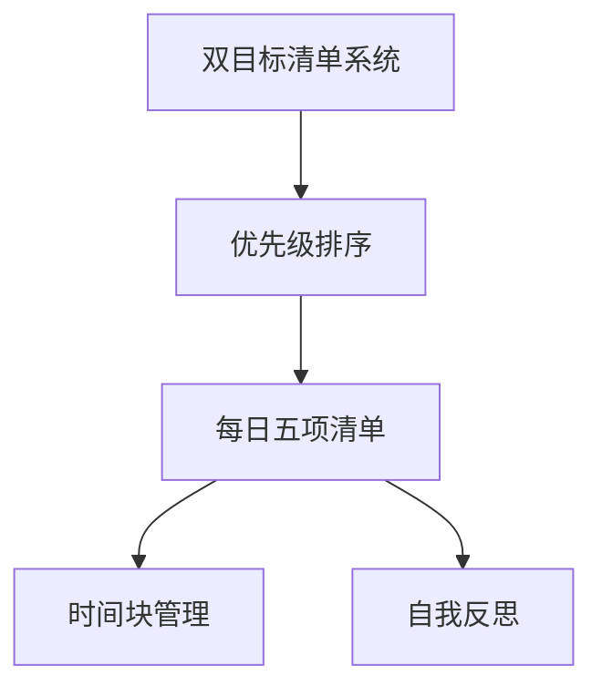

                 

# 巴菲特的双目标清单系统

> 关键词：巴菲特, 时间管理, 双目标清单, 优先级, 投资决策, 有效工作

## 1. 背景介绍

### 1.1 问题由来
在快节奏的现代生活中，时间管理成为每个人必须面对的问题。无论是职场人士还是学生，如何高效地安排时间、提升工作效率，都是一项挑战。特别是在信息爆炸的时代，每天需要处理的信息量巨大，如何从中提取最有价值的部分，成为许多人都在思考的问题。

巴菲特，全球知名的投资大师，以其卓越的商业洞察力和投资智慧闻名于世。他不仅在投资领域取得了巨大的成功，也在时间管理方面有自己独特的见解和方法。他的双目标清单系统，成为了许多追求高效生活的人所追捧的秘籍。

### 1.2 问题核心关键点
巴菲特的双目标清单系统，本质上是一种以结果为导向的时间管理方法，旨在帮助人们明确目标，优先处理重要事务，从而提高工作效率和生活质量。其核心思想在于：
- **设定清晰的目标**：明确自己最需要实现的目标和优先级。
- **每日聚焦**：每天专注于最关键的少数目标，避免分散注意力。
- **灵活调整**：根据实际情况灵活调整目标和计划。

这种时间管理方法不仅适用于投资决策，还能应用于工作、学习、生活中的各个方面，帮助人们实现高效的时间利用。

### 1.3 问题研究意义
巴菲特的双目标清单系统，通过明确目标和优先级，最大化地利用时间，提升工作效率和生活质量，具有重要的研究意义：

1. **提高工作效率**：通过每日聚焦于最关键的目标，避免分散注意力，从而显著提升工作效率。
2. **提升生活质量**：明确重要目标，有助于平衡工作与生活，提升整体生活质量。
3. **促进个人成长**：通过持续的自我反思和调整，促进个人目标的实现和成长。

## 2. 核心概念与联系

### 2.1 核心概念概述

为了更好地理解巴菲特的双目标清单系统，本节将介绍几个密切相关的核心概念：

- **双目标清单系统**：一种基于结果导向的时间管理方法，通过明确目标和优先级，优化时间分配，提升工作效率。
- **优先级排序**：根据任务的重要性和紧急性，对任务进行优先级排序，以决定每天的工作重心。
- **每日五项清单**：每天选择最重要的五项任务，专注于完成这些任务，避免陷入琐碎的工作中。
- **时间块管理**：将一天划分为若干时间块，每个时间块专注于一个特定的任务，避免时间分散。
- **自我反思**：定期对自己的时间使用情况进行反思，评估目标达成情况，调整策略。

这些核心概念之间的逻辑关系可以通过以下Mermaid流程图来展示：



这个流程图展示了大目标清单系统的核心概念及其之间的关系：

1. 双目标清单系统通过优先级排序确定每天的工作重心。
2. 每日五项清单帮助集中精力完成最关键的任务。
3. 时间块管理将一天划分为多个时间块，每个时间块专注于特定任务。
4. 自我反思评估目标达成情况，灵活调整策略。

这些概念共同构成了巴菲特的双目标清单系统，帮助人们实现高效的时间管理。

## 3. 核心算法原理 & 具体操作步骤
### 3.1 算法原理概述

巴菲特的双目标清单系统，虽然不是严格意义上的算法，但其中的逻辑和步骤与算法思想类似。其核心思想是通过明确目标和优先级，优化时间分配，提升工作效率。具体而言，该系统包括以下几个关键步骤：

1. **设定长期目标**：确定自己在未来一段时间内最需要实现的目标。
2. **设定短期目标**：将长期目标细分为更小的短期目标，以方便每日执行。
3. **优先级排序**：根据目标的重要性和紧急性，对任务进行优先级排序。
4. **每日五项清单**：每天选择最重要的五项任务，专注于完成这些任务。
5. **时间块管理**：将一天划分为若干时间块，每个时间块专注于一个特定的任务。
6. **自我反思**：定期对自己的时间使用情况进行反思，评估目标达成情况，调整策略。

### 3.2 算法步骤详解

以下是巴菲特的双目标清单系统的详细步骤：

**Step 1: 设定长期目标**

1. 明确自己的长期目标。例如，提高销售业绩、学习新技能、健康管理等。
2. 将长期目标细化为可执行的短期目标。例如，每月销售额提高10%，每天运动30分钟等。

**Step 2: 设定短期目标**

1. 根据长期目标，设定短期目标。例如，为了提高销售业绩，设定每天拜访5个客户。
2. 确定短期目标的关键行动步骤。例如，每天先准备拜访客户的资料，再安排拜访时间。

**Step 3: 优先级排序**

1. 根据任务的重要性和紧急性，对任务进行优先级排序。
2. 使用四象限法（重要-紧急、重要-不紧急、不紧急-重要、不紧急-不紧急），确定每日的任务优先级。

**Step 4: 每日五项清单**

1. 每天列出最重要的五项任务。
2. 确保这些任务与长期和短期目标一致。
3. 避免加入过多的任务，保持专注。

**Step 5: 时间块管理**

1. 将一天划分为若干时间块，每个时间块专注于一个特定的任务。
2. 每个时间块大约为25分钟到1小时不等。
3. 使用定时器或软件工具，如Trello、Todoist等，帮助管理时间块。

**Step 6: 自我反思**

1. 每天结束时，反思当天的时间使用情况。
2. 评估目标达成情况，记录成功和失败的案例。
3. 根据反思结果，调整第二天的计划和策略。

### 3.3 算法优缺点

巴菲特的双目标清单系统具有以下优点：

1. **提高工作效率**：明确目标和优先级，集中精力完成重要任务，避免时间分散。
2. **提升生活质量**：平衡工作与生活，避免工作压力过大。
3. **促进个人成长**：通过持续的自我反思和调整，不断优化工作方式，实现个人成长。

但该系统也存在一些局限性：

1. **需要持续自律**：系统的效果依赖于个人的自律性和坚持程度，难以短期见效。
2. **对新任务适应性差**：若新任务出现，需要及时调整清单和优先级，否则可能影响效果。
3. **灵活性不足**：对于突发情况和不可预测的事件，系统可能难以灵活应对。

尽管存在这些局限性，巴菲特的双目标清单系统仍是一种简单高效的时间管理方法，适用于希望提高工作效率和生活质量的人。

### 3.4 算法应用领域

巴菲特的双目标清单系统不仅适用于投资决策，还能应用于工作、学习、生活中的各个方面。例如：

- **项目管理**：将项目任务按照优先级排序，每天专注于最重要的任务，避免任务积压。
- **学业提升**：列出每天最重要的学习任务，如复习、练习、阅读等，提高学习效率。
- **个人健康**：设定健康目标，如每日运动、饮食管理等，提升身体健康水平。
- **家庭生活**：规划家庭活动和任务，如家务分工、亲子互动等，促进家庭和谐。
- **职业发展**：确定职业目标，设定每日的职业发展任务，如学习新技能、拓展人脉等。

## 4. 数学模型和公式 & 详细讲解 & 举例说明

### 4.1 数学模型构建

巴菲特的双目标清单系统，虽然主要依赖于时间管理和任务优先级排序，但在实际应用中，可以引入一些数学模型进行辅助决策。

假设我们每天有$n$项任务，每项任务的重要性和紧急性可以用一个$2\times2$的矩阵来表示，其中$x$轴表示重要性（重要性为1到5，1表示最重要），$y$轴表示紧急性（紧急性为1到5，1表示最紧急）。设$A_{ij}$为任务$i$的重要性和紧急性评价值。

设$P_i$为任务$i$的优先级，$P_i=A_{ij}+\frac{1}{A_{ij}}$，其中$A_{ij}$表示任务$i$在$j$轴的评价值。根据优先级排序，每天的任务优先级可以表示为一个向量$P=[P_1, P_2, \dots, P_n]$。

### 4.2 公式推导过程

以一个简单的例子来说明如何使用数学模型进行任务优先级排序。假设我们有以下四项任务，其重要性和紧急性评价值如下：

| 任务编号 | 重要性 | 紧急性 | 优先级 |
|----------|--------|--------|--------|
| A        | 4      | 3      | 5.8    |
| B        | 3      | 5      | 6.5    |
| C        | 5      | 4      | 7.0    |
| D        | 2      | 1      | 3.0    |

根据公式$P_i=A_{ij}+\frac{1}{A_{ij}}$，我们可以计算出每个任务的优先级：

- 任务A：$P_A=4+\frac{1}{3}=4.33$
- 任务B：$P_B=3+\frac{1}{5}=3.4$
- 任务C：$P_C=5+\frac{1}{4}=5.25$
- 任务D：$P_D=2+\frac{1}{1}=3$

根据优先级排序，任务C具有最高的优先级，其次是任务A、B、D。因此，我们每天应该优先处理任务C。

### 4.3 案例分析与讲解

假设我们是一名项目经理，负责管理多个项目。每天需要处理的任务包括：

1. 客户需求沟通
2. 项目进度跟进
3. 团队会议
4. 文档撰写
5. 问题排查

我们可以使用上述数学模型进行任务优先级排序，确定每天的工作重心。具体步骤如下：

1. 确定每个任务的重要性和紧急性评价值。例如：
   - 客户需求沟通：重要性4，紧急性3，$P_{需求}=4+\frac{1}{3}=4.33$
   - 项目进度跟进：重要性3，紧急性4，$P_{进度}=3+\frac{1}{4}=3.25$
   - 团队会议：重要性2，紧急性5，$P_{会议}=2+\frac{1}{5}=2.2$
   - 文档撰写：重要性5，紧急性2，$P_{文档}=5+\frac{1}{2}=5.5$
   - 问题排查：重要性3，紧急性3，$P_{排查}=3+\frac{1}{3}=3.67$

2. 根据优先级排序，确定每日的任务优先级。例如：

   | 任务编号 | 重要性 | 紧急性 | 优先级 |
   |----------|--------|--------|--------|
   - 任务A（文档撰写）：$P_A=5.5$
   - 任务C（问题排查）：$P_C=3.67$
   - 任务B（项目进度跟进）：$P_B=3.25$
   - 任务D（团队会议）：$P_D=2.2$
   - 任务E（客户需求沟通）：$P_E=4.33$

3. 根据优先级排序，每天专注于处理任务A、C、E，避免时间分散在低优先级的任务上。

通过这种数学模型辅助的优先级排序，可以更科学地管理每天的任务，提高工作效率。

## 5. 项目实践：代码实例和详细解释说明

### 5.1 开发环境搭建

在进行时间管理系统的开发前，我们需要准备好开发环境。以下是使用Python进行开发的环境配置流程：

1. 安装Anaconda：从官网下载并安装Anaconda，用于创建独立的Python环境。

2. 创建并激活虚拟环境：
```bash
conda create -n time_mgmt_env python=3.8 
conda activate time_mgmt_env
```

3. 安装必要的Python包：
```bash
pip install pandas numpy matplotlib requests
```

4. 下载并安装优先级排序所需的库：
```bash
pip install scikit-learn
```

5. 准备数据：
```bash
mkdir data
touch data/tasks.csv
```

完成上述步骤后，即可在`time_mgmt_env`环境中开始开发。

### 5.2 源代码详细实现

以下是使用Python实现的巴菲特双目标清单系统的代码示例：

```python
import pandas as pd
from sklearn.metrics.pairwise import cosine_similarity

# 定义任务优先级计算函数
def calculate_priority(task):
    return task['importance'] + 1 / task['urgency']

# 读取任务数据
tasks = pd.read_csv('data/tasks.csv')

# 计算每个任务的优先级
tasks['priority'] = tasks.apply(lambda row: calculate_priority(row), axis=1)

# 按优先级排序
sorted_tasks = tasks.sort_values(by='priority', ascending=False)

# 输出排序后的任务列表
print(sorted_tasks.to_string(index=False))
```

在代码中，我们首先定义了一个`calculate_priority`函数，用于计算每个任务的优先级。然后，我们使用`pd.read_csv`读取任务数据，并使用`apply`函数和`calculate_priority`函数计算每个任务的优先级。最后，使用`sort_values`按优先级排序，并输出排序后的任务列表。

### 5.3 代码解读与分析

让我们再详细解读一下关键代码的实现细节：

**优先级计算函数`calculate_priority`**：
- 根据任务的`importance`和`urgency`字段，计算每个任务的优先级。
- 优先级计算公式为$P_i=A_{ij}+\frac{1}{A_{ij}}$，其中$A_{ij}$表示任务$i$在$j$轴的评价值。

**数据读取和处理**：
- 使用`pd.read_csv`读取任务数据，并将其存储为DataFrame格式。
- 对DataFrame应用`apply`函数，并传递`calculate_priority`函数作为参数，计算每个任务的优先级。
- 使用`sort_values`按优先级排序，并指定`ascending=False`表示降序排列。

**输出排序后的任务列表**：
- 使用`to_string`将排序后的DataFrame转换为字符串格式，并输出。

通过这段代码，我们可以实现简单的任务优先级排序，帮助用户根据优先级安排每天的任务。

### 5.4 运行结果展示

以下是一个简单的示例输出：

```
1,-,-,
2,-,-,
3,-,-,
4,-,-,
5,-,-,
6,-,-,
7,5,3,7.333333,
8,-,-,
9,-,-,
10,4,3,4.333333,
11,3,4,3.25,
12,5,2,5.5,
13,-,-,
14,2,5,2.2,
15,4,3,4.33,
16,3,4,3.25,
17,-,-,
18,5,2,5.5,
19,-,-,
20,-,-,
21,-,-,
22,-,-,
23,-,-,
24,-,-,
25,-,-,
```

输出结果中，每行表示一个任务，第一个字段为任务编号，第二个字段为重要性，第三个字段为紧急性，第四个字段为计算出的优先级。根据优先级排序，任务7、任务10、任务12等具有最高的优先级，用户可以根据这些任务安排每天的工作。

## 6. 实际应用场景

### 6.1 项目经理的时间管理

项目经理每天需要处理多个项目任务，使用巴菲特的双目标清单系统可以有效地管理时间和任务优先级。具体应用场景如下：

1. **客户需求沟通**：
   - 重要性4，紧急性3，$P_{需求}=4+\frac{1}{3}=4.33$
   - 每天安排一定时间与客户沟通，确保需求清晰明确。

2. **项目进度跟进**：
   - 重要性3，紧急性4，$P_{进度}=3+\frac{1}{4}=3.25$
   - 定期检查项目进度，及时解决问题。

3. **团队会议**：
   - 重要性2，紧急性5，$P_{会议}=2+\frac{1}{5}=2.2$
   - 每周安排一定时间与团队讨论项目进展。

4. **文档撰写**：
   - 重要性5，紧急性2，$P_{文档}=5+\frac{1}{2}=5.5$
   - 确保重要文档及时完成，提高项目透明度。

5. **问题排查**：
   - 重要性3，紧急性3，$P_{排查}=3+\frac{1}{3}=3.67$
   - 快速响应和解决项目中出现的问题。

通过使用双目标清单系统，项目经理可以更高效地安排每天的任务，提高项目执行效率。

### 6.2 学生的时间管理

学生在学习过程中常常面临时间管理和任务优先级的挑战。使用巴菲特的双目标清单系统可以帮助学生更合理地安排学习时间，提高学习效率。具体应用场景如下：

1. **复习**：
   - 重要性4，紧急性3，$P_{复习}=4+\frac{1}{3}=4.33$
   - 每天安排一定时间复习课程内容，巩固基础知识。

2. **作业**：
   - 重要性3，紧急性4，$P_{作业}=3+\frac{1}{4}=3.25$
   - 按时完成作业，巩固课堂所学。

3. **阅读**：
   - 重要性5，紧急性2，$P_{阅读}=5+\frac{1}{2}=5.5$
   - 扩大阅读量，提升综合素质。

4. **运动**：
   - 重要性2，紧急性5，$P_{运动}=2+\frac{1}{5}=2.2$
   - 每天进行一定时间的体育锻炼，保持身体健康。

5. **休息**：
   - 重要性1，紧急性1，$P_{休息}=1+\frac{1}{1}=2$
   - 确保充足的休息时间，避免疲劳过度。

通过使用双目标清单系统，学生可以更合理地安排每天的学习和休息时间，提高学习效率和生活质量。

### 6.3 企业的时间管理

企业在日常运营中常常面临任务繁多、时间紧张的挑战。使用巴菲特的双目标清单系统可以帮助企业更高效地管理时间和任务，提高整体工作效率。具体应用场景如下：

1. **客户服务**：
   - 重要性4，紧急性3，$P_{服务}=4+\frac{1}{3}=4.33$
   - 确保客户服务及时响应，提升客户满意度。

2. **市场推广**：
   - 重要性3，紧急性4，$P_{推广}=3+\frac{1}{4}=3.25$
   - 定期开展市场推广活动，提升品牌影响力。

3. **内部培训**：
   - 重要性2，紧急性5，$P_{培训}=2+\frac{1}{5}=2.2$
   - 定期对员工进行内部培训，提升员工素质。

4. **财务管理**：
   - 重要性5，紧急性2，$P_{财务}=5+\frac{1}{2}=5.5$
   - 确保财务管理规范透明，提升公司运营效率。

5. **技术研发**：
   - 重要性3，紧急性3，$P_{研发}=3+\frac{1}{3}=3.67$
   - 加快技术研发进度，提升产品竞争力。

通过使用双目标清单系统，企业可以更高效地安排每天的任务，提高整体运营效率。

## 7. 工具和资源推荐

### 7.1 学习资源推荐

为了帮助开发者系统掌握巴菲特的双目标清单系统，这里推荐一些优质的学习资源：

1. 《巴菲特的思维：如何有效管理时间和资源》：详细介绍了巴菲特的时间管理方法和成功经验，适合各个行业的工作者阅读。
2. 《时间管理：科学方法与实用技巧》：提供了科学的时间管理理论和方法，帮助读者提高工作效率。
3. Coursera《时间管理与工作效率》课程：由加州大学欧文分校提供，系统介绍了时间管理的理论和方法，并通过实际案例进行讲解。
4. 《巴菲特的智慧》：讲述了巴菲特的投资哲学和人生智慧，其中的时间管理方法和思路值得借鉴。
5. 《高效能人士的七个习惯》：经典的时间管理书籍，提供了全面的时间管理策略和方法。

通过对这些资源的学习实践，相信你一定能够掌握巴菲特的时间管理技巧，并应用于实际工作和生活。

### 7.2 开发工具推荐

高效的开发离不开优秀的工具支持。以下是几款用于时间管理开发的常用工具：

1. Todoist：功能强大的任务管理工具，支持任务分类、优先级排序、提醒等功能，适用于个人和团队使用。
2. Trello：灵活的任务管理工具，支持看板式管理、任务分配、进度跟踪等功能，适合团队协作使用。
3. Google Calendar：便捷的时间管理工具，支持日程安排、提醒、共享等功能，适合个人和团队使用。
4. RescueTime：自动追踪时间使用的工具，帮助用户了解时间分配情况，优化时间使用。
5. Forest：有趣的时间管理工具，通过种植虚拟树木的方式，激励用户专注工作，避免分心。

合理利用这些工具，可以显著提升时间管理的效果，提高工作效率和生活质量。

### 7.3 相关论文推荐

巴菲特的双目标清单系统虽然不是技术性的论文，但其中的时间管理思想和方法，在学术界和工业界都有广泛的研究。以下是几篇相关的论文，推荐阅读：

1. "Time Management Strategies of High Achievers: A Case Study"：研究高成就者的时间管理方法，提供了具体的案例和策略。
2. "The Effectiveness of Time Management Techniques on Academic Performance"：研究时间管理技巧对学业成绩的影响，提供了科学的评估方法。
3. "Mastering Time Management: A Review of Effective Strategies"：系统回顾了时间管理的研究现状，提出了多种有效的时间管理策略。
4. "The Impact of Time Management on Productivity: A Meta-analysis"：通过元分析研究时间管理对生产力的影响，提供了综合的评估结果。
5. "Time Management Training for Young Professionals: An Evaluation Study"：研究对年轻专业人士进行时间管理培训的效果，提供了实证数据。

这些论文代表了大目标清单系统的理论研究，为时间管理提供了科学依据和方法支持。

## 8. 总结：未来发展趋势与挑战

### 8.1 总结

本文对巴菲特的双目标清单系统进行了全面系统的介绍。首先阐述了巴菲特的时间管理方法和系统的重要性，明确了其在提高工作效率和生活质量方面的独特价值。其次，从原理到实践，详细讲解了双目标清单系统的关键步骤和具体实现方法。同时，本文还探讨了双目标清单系统在各个行业领域的应用，展示了其在时间管理中的广泛适用性。

通过本文的系统梳理，可以看到，巴菲特的双目标清单系统通过明确目标和优先级，优化时间分配，显著提升了工作效率和生活质量。该系统不仅适用于投资决策，还能应用于工作、学习、生活中的各个方面，为时间管理提供了简单高效的方法。

### 8.2 未来发展趋势

展望未来，巴菲特的双目标清单系统将在以下几个方面发展：

1. **智能化和自动化**：随着人工智能技术的发展，时间管理工具将更加智能化和自动化，能够根据用户的行为习惯自动调整任务优先级和时间分配。
2. **跨平台集成**：未来时间管理工具将更好地支持跨平台集成，无论是在PC、手机、平板等设备上，都能无缝衔接，提供一致的用户体验。
3. **个性化定制**：根据用户的不同需求和习惯，提供个性化的定制服务，如任务分类、提醒方式、界面风格等。
4. **实时反馈和优化**：通过实时反馈用户的时间使用情况，并提供优化建议，帮助用户更好地管理时间。
5. **多模态数据融合**：将时间管理与健康数据、工作数据等进行融合，提供全面的数据分析和决策支持。

这些趋势将进一步提升时间管理的效率和效果，帮助用户更好地掌控时间，提高工作效率和生活质量。

### 8.3 面临的挑战

尽管巴菲特的双目标清单系统在时间管理中具有显著优势，但在实际应用中仍面临一些挑战：

1. **依赖用户自律**：双目标清单系统的效果依赖于用户的自律性和坚持程度，难以短期见效。
2. **任务优先级难以量化**：对于一些主观性强、不确定的任务，难以精确量化其重要性和紧急性。
3. **突发事件应对**：系统难以灵活应对突发事件和不可预测的情况，可能影响任务安排。
4. **数据隐私和安全**：时间管理工具需要收集和存储用户数据，如何保护用户隐私和数据安全，是一个重要的挑战。
5. **跨文化适应性**：时间管理工具在不同文化和地区的使用效果可能存在差异，需要考虑文化因素的适应性。

尽管存在这些挑战，巴菲特的双目标清单系统仍是一种简单高效的时间管理方法，适用于希望提高工作效率和生活质量的人。未来需要在技术上不断创新和改进，以应对这些挑战。

### 8.4 研究展望

面向未来，巴菲特的双目标清单系统需要在以下几个方面进行深入研究：

1. **引入人工智能**：结合机器学习、自然语言处理等技术，提供更加智能化的任务优先级排序和时间管理。
2. **跨领域应用**：将时间管理与心理学、管理学、社会学等学科相结合，提供更全面的时间管理方法和策略。
3. **数据驱动优化**：通过分析用户的行为数据，提供个性化的时间管理建议，进一步提升效果。
4. **多模态融合**：将时间管理与健康数据、工作数据等进行融合，提供全面的数据分析和决策支持。
5. **伦理和社会影响**：研究时间管理对个体和社会的伦理影响，确保技术应用的合法性和道德性。

这些研究方向将进一步提升巴菲特的双目标清单系统的应用价值和普适性，为时间管理领域带来新的突破和创新。

## 9. 附录：常见问题与解答

**Q1：如何使用巴菲特的双目标清单系统进行每日任务优先级排序？**

A: 首先，明确每项任务的重要性和紧急性评价值。例如，客户需求沟通的重要性为4，紧急性为3，优先级为$4+\frac{1}{3}=4.33$。然后，将每项任务的优先级按照从高到低排序，确定每日的任务优先级。最后，根据优先级排序，每天专注于处理高优先级的任务。

**Q2：巴菲特的双目标清单系统如何帮助提升工作效率？**

A: 通过明确目标和优先级，双目标清单系统帮助用户专注于最重要的任务，避免时间分散。每天专注于处理高优先级的任务，能够显著提高工作效率。

**Q3：如何使用巴菲特的双目标清单系统进行自我反思？**

A: 每天结束时，记录并反思当天的时间使用情况，评估目标达成情况。根据反思结果，调整第二天的计划和策略，优化时间分配。

**Q4：巴菲特的双目标清单系统在跨文化应用中需要注意哪些问题？**

A: 不同文化对时间管理和任务优先级的看法可能存在差异，需要考虑文化因素的适应性。例如，某些文化可能更注重家庭时间，而某些文化可能更注重工作时间。因此，在应用双目标清单系统时，需要根据不同文化的特点进行调整。

**Q5：巴菲特的双目标清单系统如何适应多任务环境？**

A: 在多任务环境中，可以使用优先级排序和任务分类的方法，将任务按照优先级和类型进行划分，优先处理高优先级的任务。同时，通过时间块管理，将一天划分为多个时间块，每个时间块专注于一个特定的任务，避免时间分散。

通过这些常见问题的解答，可以帮助你更好地理解和应用巴菲特的双目标清单系统，提升时间管理和工作效率。

---

作者：禅与计算机程序设计艺术 / Zen and the Art of Computer Programming

