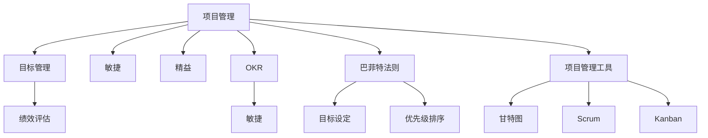

                 

# 巴菲特目标管理法则在项目管理中的应用

> 关键词：巴菲特法则,项目计划,目标管理,绩效评估,OKR,敏捷,精益

## 1. 背景介绍

### 1.1 问题由来

在企业项目管理领域，如何高效地设定目标、跟踪进度、评估成果，一直是困扰管理者的难题。传统的项目管理方法，如瀑布模型、甘特图等，尽管有其系统性和可控性，但在面对快速变化的市场和需求时，显得过于僵化，难以灵活调整。

巴菲特法则，即"只关注最重要的20%的项目"，源于沃伦·巴菲特的管理实践。该法则主张管理者将精力集中在最有价值的少数项目上，而放弃那些收益低、优先级低的任务。这一法则同样适用于项目管理和绩效管理，通过设定明确的目标和优先级，能够大幅提升项目管理效率和成果。

## 2. 核心概念与联系

### 2.1 核心概念概述

为更好地理解巴菲特法则在项目管理中的应用，本节将介绍几个密切相关的核心概念：

- 项目管理（Project Management）：在限定时限内，通过有效资源配置和团队协作，实现项目目标的系统化过程。项目管理包括项目规划、执行、监控和闭环等关键阶段。

- 目标管理（Goal-Oriented Management）：基于目标设定和成果评估的管理方法，通过设定明确的目标、跟踪进度、评估成果，引导团队向既定目标努力。目标管理强调目标的SMART原则，即具体的（Specific）、可测量的（Measurable）、可实现的（Achievable）、相关的（Relevant）和有时限的（Time-bound）。

- 绩效评估（Performance Evaluation）：通过一系列指标和方法，对团队或个人的任务执行效果进行衡量和反馈。绩效评估通常包括定量和定性评估两部分，旨在识别优势与不足，指导改进。

- OKR（Objectives and Key Results）：一种流行的目标管理框架，由英特尔公司的安迪·格鲁夫提出。OKR由关键结果（Key Results, KR）和目标（Objective, O）构成，通过设定具体且可量化的KR，引导团队不断追求卓越。

- 敏捷（Agile）：一种项目管理方法论，强调适应变化、快速响应和持续改进，与传统的瀑布模型形成鲜明对比。敏捷方法包括Scrum、Kanban等多种实践形式。

- 精益（Lean）：源自丰田汽车生产系统的管理哲学，强调价值驱动、消除浪费、持续改进。精益方法应用于项目管理，旨在提升效率、降低成本。

这些核心概念之间的逻辑关系可以通过以下Mermaid流程图来展示：



这个流程图展示了大语言模型的核心概念及其之间的关系：

1. 项目管理通过设定目标和优先级，指导资源配置和团队协作。
2. 目标管理聚焦于目标设定和成果评估，通过OKR等框架，引导团队不断追求卓越。
3. 绩效评估通过定量和定性指标，对团队或个人的任务执行效果进行衡量和反馈。
4. 敏捷和精益方法论，强调快速响应和持续改进，提升项目管理效率和灵活性。
5. 巴菲特法则通过对项目的重要性和优先级进行排序，帮助管理者集中精力在最有价值的少数项目上。

这些概念共同构成了项目管理的基本框架，通过合理运用，能够显著提升项目的成功率和效率。

## 3. 核心算法原理 & 具体操作步骤

### 3.1 算法原理概述

巴菲特法则在项目管理中的应用，本质上是一种目标管理方法和优先级排序策略。其核心思想是：通过设定明确的目标和优先级，将有限的资源和时间集中在最重要的少数项目上，从而最大化项目的价值和效率。

形式化地，假设项目集合为 $P=\{p_1, p_2, \ldots, p_n\}$，每个项目 $p_i$ 的预期价值为 $V_i$，所需资源为 $R_i$，完成时间为 $T_i$。项目的总价值为 $V=\sum_{i=1}^n V_i$，总资源为 $R=\sum_{i=1}^n R_i$，总时间为 $T=\sum_{i=1}^n T_i$。目标是最优化总价值 $V$，同时满足资源和时间的约束条件。

目标管理的核心在于设定具有SMART原则的目标，并通过优先级排序，优化资源配置。具体步骤如下：

1. **目标设定**：根据项目的重要性和战略意义，设定具体且可量化的目标。
2. **优先级排序**：根据目标的价值、资源需求和完成时间，对项目进行排序，确定优先级。
3. **资源配置**：根据优先级，分配资源和时间，确保重点项目得到优先支持。
4. **监控与调整**：跟踪项目进展，根据实际情况进行调整，确保目标的实现。

### 3.2 算法步骤详解

基于巴菲特法则的项目管理，一般包括以下几个关键步骤：

**Step 1: 目标设定**

- 根据项目的战略意义和预期价值，设定具体且可量化的目标。目标的设定需要遵循SMART原则，即具体的（Specific）、可测量的（Measurable）、可实现的（Achievable）、相关的（Relevant）和有时限的（Time-bound）。
- 目标的设定通常需要跨部门协作，综合考虑公司战略、市场需求、资源限制等因素，确保目标的可行性和合理性。

**Step 2: 优先级排序**

- 对所有项目进行评估，基于价值、资源需求和完成时间，计算每个项目的优先级得分。优先级得分通常采用加权计算的方式，权重可以根据具体情况进行调整。
- 根据优先级得分，对项目进行排序，确定优先级高的项目。巴菲特法则建议，只关注最重要的20%的项目，这20%的项目往往贡献了80%的收益。
- 优先级排序的过程需要考虑到不同项目之间的协同效应，避免孤岛效应，确保高优先级项目之间能够相互支持，产生更大的整体价值。

**Step 3: 资源配置**

- 根据优先级排序的结果，将有限的资源和时间集中在高优先级项目上，确保重点项目得到优先支持。
- 资源配置需要考虑项目的紧迫性和依赖关系，优先安排那些对其他项目有依赖，或对整体战略有重要影响的项目。
- 资源的配置需要动态调整，根据项目的进展和环境变化，灵活应对资源瓶颈，确保项目顺利推进。

**Step 4: 监控与调整**

- 跟踪项目的进展，及时发现偏差，进行必要的调整。监控可以采用甘特图、看板、进度报告等多种方式。
- 根据监控结果，对资源配置和项目优先级进行动态调整，确保目标的实现。
- 定期进行绩效评估，识别项目中的问题和改进机会，推动项目的持续改进。

### 3.3 算法优缺点

基于巴菲特法则的项目管理方法，具有以下优点：

1. 聚焦重点：通过优先级排序，将有限的资源和时间集中在最重要的少数项目上，显著提升项目价值和效率。
2. 提升战略执行：帮助团队聚焦于公司的核心战略，确保资源配置和努力方向一致，提升战略执行效果。
3. 促进持续改进：通过监控和调整，及时发现和解决问题，推动项目的持续改进。
4. 增强透明度：明确的目标和优先级排序，提高了项目的透明度，有助于跨部门协作和资源共享。

同时，该方法也存在以下局限性：

1. 依赖主观判断：优先级排序依赖于主观判断，可能存在偏差，影响决策的科学性。
2. 资源配置风险：高优先级项目的过度集中，可能导致资源瓶颈，影响其他项目进展。
3. 执行过程复杂：优先级排序和资源配置需要跨部门协作，协调成本较高，执行过程复杂。
4. 评估难度大：高优先级项目可能面临更高的预期和压力，绩效评估难度大，可能导致过度关注短期成果。

尽管存在这些局限性，但就目前而言，巴菲特法则依然是大项目管理中的重要参考方法，尤其适用于资源有限、需求多变的场景。

### 3.4 算法应用领域

基于巴菲特法则的项目管理方法，在多个领域得到了广泛应用，例如：

- 软件开发：敏捷项目管理中，通过设定明确的Sprint目标和优先级，确保项目按时交付。
- 产品管理：通过设定优先级，优化产品特性和功能的发布顺序，提升用户体验和市场竞争力。
- 市场营销：通过设定关键指标和优先级，优化广告投放和市场活动，提升品牌影响力和销售额。
- 运营管理：通过设定关键绩效指标和优先级，优化生产和供应链管理，提升运营效率和成本控制。
- 财务规划：通过设定财务目标和优先级，优化资金配置和风险管理，确保公司财务稳健。

除了上述这些经典应用外，巴菲特法则还被创新性地应用到更多场景中，如可控创新、知识管理等，为企业提供全新的管理思路。

## 4. 数学模型和公式 & 详细讲解

### 4.1 数学模型构建

本节将使用数学语言对基于巴菲特法则的项目管理过程进行更加严格的刻画。

假设项目集合为 $P=\{p_1, p_2, \ldots, p_n\}$，每个项目 $p_i$ 的预期价值为 $V_i$，所需资源为 $R_i$，完成时间为 $T_i$。目标是最优化总价值 $V=\sum_{i=1}^n V_i$，同时满足资源和时间的约束条件。

目标管理的核心在于设定具有SMART原则的目标，并通过优先级排序，优化资源配置。具体步骤如下：

1. **目标设定**：根据项目的战略意义和预期价值，设定具体且可量化的目标。目标的设定需要遵循SMART原则，即具体的（Specific）、可测量的（Measurable）、可实现的（Achievable）、相关的（Relevant）和有时限的（Time-bound）。
2. **优先级排序**：对所有项目进行评估，基于价值、资源需求和完成时间，计算每个项目的优先级得分。优先级得分通常采用加权计算的方式，权重可以根据具体情况进行调整。
3. **资源配置**：根据优先级排序的结果，将有限的资源和时间集中在高优先级项目上，确保重点项目得到优先支持。
4. **监控与调整**：跟踪项目的进展，及时发现偏差，进行必要的调整。监控可以采用甘特图、看板、进度报告等多种方式。

### 4.2 公式推导过程

以下我们以软件开发项目为例，推导基于巴菲特法则的项目管理数学模型。

设软件开发项目集合为 $P=\{p_1, p_2, \ldots, p_n\}$，每个项目 $p_i$ 的预期价值为 $V_i$，所需资源为 $R_i$，完成时间为 $T_i$。项目的目标是最优化总价值 $V=\sum_{i=1}^n V_i$，同时满足资源和时间的约束条件。

定义项目的优先级得分 $P_i$，表示项目在特定指标下的重要程度，通常采用加权计算的方式：

$$
P_i = w_1 \cdot \frac{V_i}{V_{\max}} + w_2 \cdot \frac{R_i}{R_{\max}} + w_3 \cdot \frac{T_i}{T_{\max}}
$$

其中 $w_1, w_2, w_3$ 分别为价值、资源和时间的权重系数，$V_{\max}, R_{\max}, T_{\max}$ 分别为价值、资源和时间的最大值。

优先级排序后，根据得分 $P_i$ 对项目进行排序，确定优先级高的项目。假设优先级最高的前20%的项目为 $P_{top}$，则：

$$
P_{top} = \{p_1, p_2, \ldots, p_k\}
$$

其中 $k = 0.2n$。

根据优先级排序的结果，将有限的资源和时间集中在高优先级项目上，确保重点项目得到优先支持。假设总资源为 $R$，总时间为 $T$，则：

$$
\begin{cases}
R_{top} = \sum_{i \in P_{top}} R_i \\
T_{top} = \sum_{i \in P_{top}} T_i
\end{cases}
$$

目标是最优化总价值 $V$，同时满足资源和时间的约束条件：

$$
\begin{aligned}
\max_{V_{top}} & \sum_{i \in P_{top}} V_i \\
\text{subject to} & \quad R_{top} \leq R \\
& \quad T_{top} \leq T
\end{aligned}
$$

为了求解上述优化问题，可以采用动态规划、遗传算法等优化算法。

### 4.3 案例分析与讲解

假设某软件开发公司有10个项目，每个项目的具体信息如下：

| 项目编号 | 预期价值 | 资源需求 | 完成时间 | 优先级得分 |
|-----------|----------|----------|----------|------------|
| 1         | 10000    | 200      | 60天     | 0.9        |
| 2         | 8000     | 150      | 45天     | 0.8        |
| 3         | 7000     | 130      | 30天     | 0.85       |
| 4         | 6000     | 120      | 40天     | 0.8        |
| 5         | 5000     | 110      | 35天     | 0.75       |
| 6         | 4000     | 100      | 25天     | 0.7        |
| 7         | 3500     | 90       | 30天     | 0.8        |
| 8         | 3000     | 80       | 40天     | 0.85       |
| 9         | 2500     | 70       | 35天     | 0.8        |
| 10        | 2000     | 60       | 30天     | 0.75       |

根据巴菲特法则，我们首先计算每个项目的优先级得分，并对项目进行排序：

| 项目编号 | 预期价值 | 资源需求 | 完成时间 | 优先级得分 |
|-----------|----------|----------|----------|------------|
| 1         | 10000    | 200      | 60天     | 0.9        |
| 2         | 8000     | 150      | 45天     | 0.8        |
| 3         | 7000     | 130      | 30天     | 0.85       |
| 4         | 6000     | 120      | 40天     | 0.8        |
| 5         | 5000     | 110      | 35天     | 0.75       |
| 6         | 4000     | 100      | 25天     | 0.7        |
| 7         | 3500     | 90       | 30天     | 0.8        |
| 8         | 3000     | 80       | 40天     | 0.85       |
| 9         | 2500     | 70       | 35天     | 0.8        |
| 10        | 2000     | 60       | 30天     | 0.75       |

假设公司的总资源为500，总时间为150天，我们可以计算出高优先级项目 $P_{top}$ 为前两个项目：

| 项目编号 | 预期价值 | 资源需求 | 完成时间 | 优先级得分 |
|-----------|----------|----------|----------|------------|
| 1         | 10000    | 200      | 60天     | 0.9        |
| 2         | 8000     | 150      | 45天     | 0.8        |

根据资源和时间的约束，我们可以计算出资源配置 $R_{top}$ 和完成时间 $T_{top}$：

$$
\begin{cases}
R_{top} = 200 + 150 = 350 \\
T_{top} = 60 + 45 = 105
\end{cases}
$$

资源配置后，高优先级项目的总价值 $V_{top}$ 为：

$$
V_{top} = 10000 + 8000 = 18000
$$

因此，根据巴菲特法则，公司在有限的资源和时间下，应该优先支持预期价值最高的前两个项目，以最大化项目的总价值。

## 5. 项目实践：代码实例和详细解释说明

### 5.1 开发环境搭建

在进行巴菲特法则项目管理的实践前，我们需要准备好开发环境。以下是使用Python进行数据分析和可视化环境配置流程：

1. 安装Anaconda：从官网下载并安装Anaconda，用于创建独立的Python环境。

2. 创建并激活虚拟环境：
```bash
conda create -n project-env python=3.8 
conda activate project-env
```

3. 安装Python数据科学工具包：
```bash
conda install pandas numpy matplotlib seaborn
```

4. 安装Jupyter Notebook：
```bash
conda install jupyterlab
```

完成上述步骤后，即可在`project-env`环境中开始巴菲特法则项目管理的实践。

### 5.2 源代码详细实现

下面我们以软件开发项目为例，给出使用Python进行巴菲特法则项目管理的代码实现。

首先，定义项目的输入数据：

```python
import pandas as pd

# 定义项目数据
project_data = pd.DataFrame({
    'ID': range(1, 11),
    'Value': [10000, 8000, 7000, 6000, 5000, 4000, 3500, 3000, 2500, 2000],
    'Resource': [200, 150, 130, 120, 110, 100, 90, 80, 70, 60],
    'Time': [60, 45, 30, 40, 35, 25, 30, 40, 35, 30]
})
```

然后，计算每个项目的优先级得分：

```python
# 定义优先级得分计算函数
def priority_score(value, resource, time, max_value, max_resource, max_time):
    return value / max_value + resource / max_resource + time / max_time

# 计算优先级得分
project_data['Priority'] = project_data.apply(lambda x: priority_score(x['Value'], x['Resource'], x['Time'], 10000, 500, 150), axis=1)
```

接着，对项目进行优先级排序：

```python
# 计算前20%优先级得分最高的项目
top_20 = project_data.nlargest(2, 'Priority')
```

最后，展示排序结果：

```python
# 输出前两个优先级最高的项目
top_20.head()
```

以上代码实现了使用Python对巴菲特法则进行项目管理的基本步骤，包括输入数据的定义、优先级得分的计算、项目的优先级排序和展示结果。

### 5.3 代码解读与分析

让我们再详细解读一下关键代码的实现细节：

**项目数据定义**：
- 使用Pandas库定义项目数据，包含项目的ID、预期价值、资源需求和完成时间。

**优先级得分计算**：
- 定义一个函数 `priority_score`，用于计算每个项目的优先级得分，采用加权计算的方式，权重可以根据具体情况进行调整。

**项目优先级排序**：
- 使用Pandas的 `apply` 方法，对每个项目应用 `priority_score` 函数，计算出优先级得分。
- 使用 `nlargest` 方法，获取优先级得分最高的前两个项目。

**结果展示**：
- 使用 `head` 方法，展示排序后的前两个项目。

可以看到，通过简单的Python代码，我们便能够高效地实现基于巴菲特法则的项目管理。开发者可以根据具体需求，对代码进行扩展和优化，以满足实际项目的复杂场景。

## 6. 实际应用场景

### 6.1 软件开发

在软件开发项目中，巴菲特法则的应用尤为显著。软件开发项目的复杂性和不确定性，使得项目管理需要精确的资源配置和优先级排序。通过设定明确的目标和优先级，帮助团队聚焦于最有价值的任务，能够显著提升项目的成功率和效率。

具体而言，可以收集项目的任务列表、预期价值、资源需求和完成时间等数据，通过计算每个项目的优先级得分，对项目进行排序，确定优先级高的项目。资源配置时，将有限的资源和时间集中在高优先级项目上，确保重点项目得到优先支持。

### 6.2 市场营销

市场营销中的项目，如广告投放、市场活动等，同样适用巴菲特法则。通过设定关键指标和优先级，优化广告投放和市场活动，提升品牌影响力和销售额。

在实践中，可以收集广告的预期收益、广告成本、投放时间等数据，通过计算每个广告的优先级得分，对广告进行排序，确定优先级高的广告。资源配置时，将有限的预算和资源集中在高优先级广告上，确保关键广告得到优先支持。

### 6.3 产品管理

在产品管理中，巴菲特法则同样适用。通过设定关键特性和功能的优先级，优化产品特性和功能的发布顺序，提升用户体验和市场竞争力。

在实践中，可以收集产品的预期价值、开发成本、发布时间等数据，通过计算每个特性的优先级得分，对特性进行排序，确定优先级高的特性。资源配置时，将有限的资源和时间集中在高优先级特性上，确保重点特性得到优先支持。

### 6.4 未来应用展望

随着巴菲特法则的广泛应用，其在项目管理中的应用前景将更加广阔。未来的发展趋势可能包括以下几个方向：

1. **数据驱动的决策**：通过大数据分析和机器学习技术，提升目标设定和优先级排序的科学性和准确性，避免主观判断带来的偏差。
2. **动态调整机制**：引入实时监控和反馈机制，根据项目进展和环境变化，动态调整资源配置和优先级排序，确保项目顺利推进。
3. **跨部门协作**：加强跨部门协作，通过项目管理工具和平台，实现资源共享和协同工作，提升项目管理效率。
4. **敏捷与精益结合**：结合敏捷和精益方法论，推动项目管理过程的持续改进和优化，提升项目执行力。

## 7. 工具和资源推荐

### 7.1 学习资源推荐

为了帮助开发者系统掌握巴菲特法则在项目管理中的应用，这里推荐一些优质的学习资源：

1. 《项目管理最佳实践》系列博文：由项目管理专家撰写，全面介绍项目管理的基本原则和实践技巧。
2. 《OKR管理法》书籍：Google前高管安迪·格鲁夫所著，详细讲解OKR框架的设定和执行。
3. 《敏捷项目管理》课程：Coursera上的经典课程，涵盖敏捷方法论、Scrum、Kanban等关键概念。
4. 《精益管理》书籍：丰田汽车创始人丰田英二所著，深入介绍精益管理思想和方法。
5. Project Management Institute (PMI)：项目管理协会，提供项目管理相关的认证和培训资源。

通过对这些资源的学习实践，相信你一定能够快速掌握巴菲特法则的精髓，并用于解决实际的项目管理问题。

### 7.2 开发工具推荐

高效的开发离不开优秀的工具支持。以下是几款用于巴菲特法则项目管理开发的常用工具：

1. JIRA：广受欢迎的敏捷项目管理工具，支持Scrum、Kanban等多种敏捷实践，提供丰富的项目管理功能。
2. Asana：简单易用的任务管理工具，支持任务分配、优先级排序和进度跟踪等功能。
3. Trello：基于看板的项目管理工具，适合小团队协作，支持自定义看板和任务清单。
4. Slack：团队沟通工具，支持即时消息、文件共享和协作功能，适合项目管理团队的沟通协作。
5. Google Sheets：表格工具，支持数据处理和可视化功能，适合项目管理中的数据统计和分析。

合理利用这些工具，可以显著提升巴菲特法则项目管理的效率，加快创新迭代的步伐。

### 7.3 相关论文推荐

巴菲特法则在项目管理中的应用，源于学界的持续研究。以下是几篇奠基性的相关论文，推荐阅读：

1. "The Eisenhower Matrix: How to Use It to Maximize Your Productivity"：由哈佛商学院教授指导的矩阵管理方法，与巴菲特法则有异曲同工之妙，广泛应用于时间管理和项目管理。
2. "Project Management Maturity Model"：关于项目管理成熟度的经典论文，探讨了项目管理过程的各个阶段和关键因素。
3. "OKR: The Ultimate Software Development Management System"：Google前高管安迪·格鲁夫的著作，详细讲解OKR框架的应用和实施。
4. "Project Management Principles and Practices"：项目管理领域的重要教材，全面介绍了项目管理的基本原则和实践方法。

这些论文代表了大语言模型微调技术的发展脉络。通过学习这些前沿成果，可以帮助研究者把握学科前进方向，激发更多的创新灵感。

## 8. 总结：未来发展趋势与挑战

### 8.1 总结

本文对基于巴菲特法则的项目管理方法进行了全面系统的介绍。首先阐述了巴菲特法则在项目管理中的应用背景和意义，明确了优先级排序和资源配置的重要性。其次，从原理到实践，详细讲解了巴菲特法则的项目管理过程，包括目标设定、优先级排序、资源配置和监控调整等关键步骤。最后，本文还探讨了巴菲特法则在不同行业领域的应用前景，展示了其在项目管理中的强大威力。

通过本文的系统梳理，可以看到，巴菲特法则在项目管理中的应用，能够显著提升项目成功率和效率，降低资源浪费和风险。这一方法简单高效，易于落地实践，具有广泛的适用性。未来，随着技术的进步和应用的拓展，巴菲特法则必将在更多行业领域发挥更大的作用。

### 8.2 未来发展趋势

展望未来，巴菲特法则在项目管理中的应用将呈现以下几个发展趋势：

1. **数据驱动的决策**：通过大数据分析和机器学习技术，提升目标设定和优先级排序的科学性和准确性，避免主观判断带来的偏差。
2. **动态调整机制**：引入实时监控和反馈机制，根据项目进展和环境变化，动态调整资源配置和优先级排序，确保项目顺利推进。
3. **跨部门协作**：加强跨部门协作，通过项目管理工具和平台，实现资源共享和协同工作，提升项目管理效率。
4. **敏捷与精益结合**：结合敏捷和精益方法论，推动项目管理过程的持续改进和优化，提升项目执行力。
5. **全生命周期的管理**：将巴菲特法则应用到项目的全生命周期管理，从需求分析、设计、开发到部署和运维，实现系统化的项目管理。

### 8.3 面临的挑战

尽管巴菲特法则在项目管理中的应用已经取得了一定的成功，但在迈向更加智能化、普适化应用的过程中，它仍面临以下挑战：

1. **数据获取难度大**：目标设定和优先级排序需要大量数据支持，但对于一些项目，数据获取难度较大，影响决策的科学性。
2. **主观判断偏差**：优先级排序依赖于主观判断，可能存在偏差，影响决策的公正性。
3. **执行过程复杂**：优先级排序和资源配置需要跨部门协作，协调成本较高，执行过程复杂。
4. **绩效评估难度大**：高优先级项目可能面临更高的预期和压力，绩效评估难度大，可能导致过度关注短期成果。

尽管存在这些挑战，但就目前而言，巴菲特法则依然是项目管理中的重要参考方法，尤其适用于资源有限、需求多变的场景。

### 8.4 研究展望

面对巴菲特法则面临的种种挑战，未来的研究需要在以下几个方面寻求新的突破：

1. **数据驱动的决策**：探索大数据分析和机器学习技术在目标设定和优先级排序中的应用，提升决策的科学性和准确性。
2. **动态调整机制**：研究实时监控和反馈机制，推动项目管理的持续改进和优化。
3. **跨部门协作**：加强跨部门协作，通过项目管理工具和平台，实现资源共享和协同工作。
4. **全生命周期的管理**：将巴菲特法则应用到项目的全生命周期管理，从需求分析、设计、开发到部署和运维，实现系统化的项目管理。
5. **可解释性提升**：增强目标和优先级排序的可解释性，帮助管理者理解和解释决策依据，提高决策的透明度和公正性。

这些研究方向将推动巴菲特法则的持续发展和应用，为企业提供更加智能、高效的项目管理方法。

## 9. 附录：常见问题与解答

**Q1：什么是巴菲特法则？**

A: 巴菲特法则，即"只关注最重要的20%的项目"，源于沃伦·巴菲特的管理实践。该法则主张管理者将精力集中在最有价值的少数项目上，而放弃那些收益低、优先级低的任务。

**Q2：如何设置项目的目标？**

A: 项目的目标设定需要遵循SMART原则，即具体的（Specific）、可测量的（Measurable）、可实现的（Achievable）、相关的（Relevant）和有时限的（Time-bound）。目标的设定通常需要跨部门协作，综合考虑公司战略、市场需求、资源限制等因素。

**Q3：如何计算项目的优先级得分？**

A: 优先级得分可以通过加权计算的方式，权重可以根据具体情况进行调整。一般包括价值、资源和时间的权重系数。

**Q4：优先级排序的过程有哪些注意事项？**

A: 优先级排序依赖于主观判断，可能存在偏差，影响决策的公正性。因此，优先级排序需要团队协作，综合考虑多方面因素，确保决策的科学性和公正性。

**Q5：如何提升巴菲特法则的执行效率？**

A: 通过引入项目管理工具和平台，实现资源共享和协同工作，提升项目管理效率。同时，引入实时监控和反馈机制，根据项目进展和环境变化，动态调整资源配置和优先级排序。

---

作者：禅与计算机程序设计艺术 / Zen and the Art of Computer Programming

