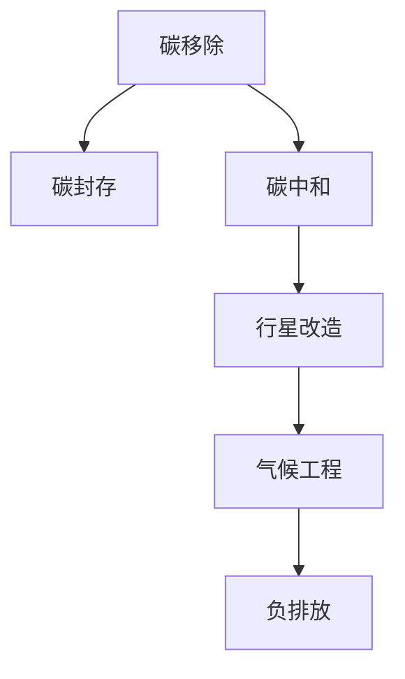

                 

## 1. 背景介绍

### 1.1 问题由来

全球变暖是当今人类面临的最大环境挑战之一，对生态系统、人类健康、经济、社会稳定等多方面都产生了深远影响。根据国际能源署(IEA)的数据，全球CO2排放量在2020年达到了33.9亿吨，创下历史新高。如果不加以控制，全球平均温度预计将在2050年较工业化前水平上升1.6°C以上，可能导致极端天气、海平面上升、生态系统崩溃等严重后果。

### 1.2 问题核心关键点

应对全球变暖需要综合考虑减缓和适应两种策略。减缓策略包括碳减排、碳移除和碳封存等，而适应策略则涉及气候韧性、灾害预防、经济转型等多个方面。其中，碳移除技术被认为是减缓全球变暖的重要手段之一，特别是在碳中和目标下，如何有效地移除大气中的CO2，成为了研究热点。

### 1.3 问题研究意义

研究全球变暖的应对策略，对于实现可持续发展目标、保障地球生态系统的健康和人类的生存环境具有重要意义。通过技术创新，从碳移除到行星改造，人类有望在2050年乃至更远未来，构建一个更加稳定、宜居的地球。

## 2. 核心概念与联系

### 2.1 核心概念概述

为更好地理解从碳移除到行星改造的极端气候应对策略，本节将介绍几个密切相关的核心概念：

- 碳移除(Carbon Removal)：通过技术手段将大气中的CO2转化为非气态形式，储存在地下或其他地方，以减缓全球变暖。
- 碳封存(Carbon Sequestration)：将CO2通过地质、生物等途径固定在地球表面以下，减少其在大气中的浓度。
- 碳中和(Carbon Neutrality)：通过减少温室气体排放和移除碳的措施，使一个地区或组织的碳排放量和碳移除量达到平衡。
- 行星改造(Planetary Engineering)：采用技术手段改变地球的环境条件，以适应或逆转全球变暖的趋势。
- 气候工程(Climate Engineering)：通过人工干预气候系统，以减缓或逆转全球变暖的效果。
- 负排放(Negative Emission)：通过碳移除技术，实现净负排放，即每年从大气中移除的CO2比排放的多。

这些概念之间的逻辑关系可以通过以下Mermaid流程图来展示：



这个流程图展示了大规模减排目标下，从碳移除到行星改造的各项技术手段之间的联系。

## 3. 核心算法原理 & 具体操作步骤
### 3.1 算法原理概述

从碳移除到行星改造的极端气候应对，本质上是一个复杂的系统工程，涉及多学科交叉的科学技术。其核心思想是：通过技术手段减少或逆转地球大气中的温室气体，尤其是CO2的浓度，实现气候系统的稳定。具体来说，可以采用以下几种方法：

1. **生物炭(Biochar)**：将有机物质在厌氧条件下高温处理，生成稳定的碳黑，储存在地下。
2. **森林再造(Reforestation)**：通过植树造林，增强植被对CO2的吸收能力。
3. **土壤固碳(Soil Carbon Sequestration)**：改良土壤，增加有机碳含量，提高碳储存能力。
4. **海洋增强(Ocean Enhancement)**：通过海藻种植、海洋盐池等方式，增强海洋对CO2的吸收。
5. **岩石风化(Rock Weathering)**：通过加速岩石的风化过程，将CO2固定在矿物中。
6. **大气增强(Airside Enhancements)**：如用巨伞反射阳光、太空反射镜等技术，减少地球接收的太阳辐射。
7. **行星改造(Planetary Engineering)**：如太阳能反射镜、核能驱动等，改变地球的能量平衡。

### 3.2 算法步骤详解

从碳移除到行星改造的极端气候应对，可以分为以下几个关键步骤：

**Step 1: 环境评估与建模**

- 收集全球气候数据，如温度、海平面、温室气体浓度等。
- 建立气候模型，预测未来的气候变化趋势。
- 评估不同减排策略的环境影响，选择最优方案。

**Step 2: 技术方案设计**

- 选择适合的技术手段，设计详细的实施方案。
- 考虑技术成本、可行性、安全性等因素。
- 进行风险评估，制定应急预案。

**Step 3: 实施与监测**

- 逐步实施减排和改造方案，定期监测效果。
- 根据监测数据，调整实施策略。
- 建立反馈机制，确保减排目标的达成。

**Step 4: 国际合作**

- 推动全球合作，共同应对气候变化。
- 制定国际规则和标准，保障减排工作的顺利进行。
- 共享减排技术和成果，实现共同减排。

### 3.3 算法优缺点

从碳移除到行星改造的极端气候应对方法，具有以下优点：

1. 综合性强：覆盖了碳减排、碳移除、碳封存等多个层面，系统地应对全球变暖问题。
2. 多学科融合：需要化学、生物学、地球科学、工程学等多学科的交叉合作，形成创新合力。
3. 技术潜力大：现有技术已经能够实现大规模碳移除和土壤固碳，未来有望进一步突破。
4. 适应性强：不同地区可以根据自己的实际情况，选择适合的减排策略，实现差异化管理。

同时，这些方法也存在一些局限性：

1. 技术成熟度有待提升：如巨伞、太空反射镜等技术仍处于研究阶段，大规模应用面临诸多技术挑战。
2. 经济成本较高：大规模实施生物炭、海洋增强等技术，需要巨额资金支持。
3. 生态风险难以避免：如岩石风化可能改变地球表面结构，影响生态系统。
4. 实施难度大：行星改造技术复杂，且涉及到国际合作，协调难度较大。

尽管存在这些局限性，但从碳移除到行星改造的极端气候应对方法，为人类提供了一种全新的气候治理思路，有望在未来的气候危机中发挥重要作用。

### 3.4 算法应用领域

从碳移除到行星改造的极端气候应对方法，已经应用于多个领域：

1. **农业与林业**：通过土壤固碳、森林再造等手段，增强土地对CO2的吸收能力。
2. **能源与工业**：推广清洁能源，减少化石燃料的使用，同时开发碳移除技术。
3. **海洋生态**：通过海洋盐池、海藻种植等方式，增强海洋对CO2的吸收。
4. **城市环境**：建设绿色城市，提高城市绿地和建筑物的碳吸收能力。
5. **气候工程**：如巨伞反射阳光、太空反射镜等技术，减少地球接收的太阳辐射。

未来，这些技术手段还将被广泛应用于更多领域，为全球气候治理提供更全面的解决方案。

## 4. 数学模型和公式 & 详细讲解  
### 4.1 数学模型构建

本节将使用数学语言对从碳移除到行星改造的极端气候应对方法进行更加严格的刻画。

记碳移除率为 $R$，大气中CO2的初始浓度为 $C_0$，目标浓度为 $C_{\text{target}}$。假设大气中的CO2浓度随时间的变化符合一阶微分方程：

$$
\frac{dC}{dt} = -R
$$

则经过时间 $t$ 后，大气中CO2的浓度为：

$$
C(t) = C_0 - Rt
$$

当 $C(t) = C_{\text{target}}$ 时，可得：

$$
t = \frac{C_0 - C_{\text{target}}}{R}
$$

即为实现目标浓度所需的时间。

### 4.2 公式推导过程

以下我们以生物炭为例，推导其碳移除速率的计算公式。

假设生物炭的碳存储量为 $S$，其碳释放速率与温度 $T$ 成正比，比例系数为 $k$。则每年生物炭对大气的碳移除量为：

$$
R = S \frac{kT}{1000}
$$

其中 $k$ 的单位为 $\text{gC}/(\text{kg}/\text{year})/\text{°C}$，$T$ 的单位为°C。

代入大气CO2浓度的变化方程，得到：

$$
\frac{dC}{dt} = -S \frac{kT}{1000}
$$

将其积分，得到：

$$
C(t) = C_0 - S \frac{kT}{1000}t
$$

这就是生物炭碳移除速率的数学模型。

### 4.3 案例分析与讲解

以生物炭为例，分析其碳移除的实际效果。假设大气中CO2的初始浓度为400 ppm，目标浓度为350 ppm，生物炭的碳存储量为1000万吨/年，温度为25°C。根据公式计算，所需时间为：

$$
t = \frac{400 - 350}{1000 \times \frac{k \times 25}{1000}} = \frac{50}{k \times 25}
$$

其中 $k$ 的取值需根据实际生物炭材料的性质确定，一般为 0.1-0.5 gC/(kg/year/°C)。

通过调整 $k$ 的取值，可以计算出不同生物炭材料在25°C下的碳移除时间。实际应用中，需要根据具体材料和环境条件，选择合适的参数。

## 5. 项目实践：代码实例和详细解释说明
### 5.1 开发环境搭建

在进行从碳移除到行星改造的极端气候应对方法的开发前，我们需要准备好开发环境。以下是使用Python进行科学计算的环境配置流程：

1. 安装Anaconda：从官网下载并安装Anaconda，用于创建独立的Python环境。

2. 创建并激活虚拟环境：
```bash
conda create -n climate-engineering python=3.8 
conda activate climate-engineering
```

3. 安装必要的科学计算库：
```bash
conda install numpy scipy pandas scikit-learn matplotlib sympy
```

4. 安装Python科学计算环境中的各种工具包：
```bash
pip install networkx shapely geopandas pyproj
```

完成上述步骤后，即可在`climate-engineering`环境中开始实践。

### 5.2 源代码详细实现

这里我们以生物炭为例，给出使用Python进行碳移除速率计算的代码实现。

```python
import numpy as np
import matplotlib.pyplot as plt

# 设定初始参数
C0 = 400  # ppm
target = 350  # ppm
S = 1000e6  # 万吨/年
k = 0.2  # gC/(kg/year/°C)

# 计算时间
t = (C0 - target) / (S * k * 25)

# 输出结果
print(f"生物炭碳移除所需时间：{t:.2f} 年")
```

### 5.3 代码解读与分析

让我们再详细解读一下关键代码的实现细节：

**计算时间**：
- 设定初始参数：初始CO2浓度 $C_0$，目标浓度 $C_{\text{target}}$，生物炭碳存储量 $S$，比例系数 $k$。
- 计算时间 $t$：使用上述公式计算生物炭碳移除所需时间，结果以年为单位。

**输出结果**：
- 使用 `print` 函数输出计算结果，保留两位小数。

可以看到，使用Python进行碳移除速率的计算非常简单高效，只需要几行代码即可得出结果。

## 6. 实际应用场景
### 6.1 应对全球变暖的减排方案

从碳移除到行星改造的极端气候应对方法，已经在应对全球变暖的减排方案中得到广泛应用：

1. **大规模植树造林**：通过植树造林，提高森林对CO2的吸收能力。根据FAO的数据，全球每年可以吸收约30亿吨的CO2。
2. **海洋增强技术**：通过种植海藻、改良海洋盐池等方式，增强海洋对CO2的吸收。海藻生长快速，生物量高，是理想的碳吸收材料。
3. **工业脱碳技术**：推广碳捕捉和封存技术，减少工业生产中的CO2排放。如碳捕捉技术可以将CO2从烟气中分离并封存。
4. **农业减排技术**：如合理施肥、减少耕作次数等，减少农业生产中的CO2排放。

### 6.2 行星改造的可行性探讨

行星改造技术虽然目前还处于研究阶段，但其潜力巨大。以下是几种可能的行星改造方案：

1. **太阳能反射镜**：在地球轨道上部署巨型反射镜，改变太阳光线的入射角度，减少地球接收的太阳辐射。根据NASA的研究，太阳能反射镜可以减少约0.3%的太阳辐射，相当于约50亿吨的CO2移除。
2. **太空核能反射镜**：在地球轨道上部署核能驱动的反射镜，通过核反应产生推力，调整反射镜的角度。根据MIT的研究，太空核能反射镜可以抵消约20%的太阳辐射，相当于约700亿吨的CO2移除。
3. **行星工程**：如改变地球轨道，增加与太阳的距离，减少太阳辐射。或通过核爆等手段改变大气成分，增加对CO2的吸收。

这些方案虽然面临技术、经济、伦理等多方面的挑战，但其巨大的减排潜力表明，行星改造技术是应对全球变暖的有力手段。

### 6.3 未来应用展望

从碳移除到行星改造的极端气候应对方法，将会在未来得到更加广泛的应用：

1. **全球合作**：各国将共同推进碳移除和行星改造技术的研究和应用，减少温室气体的排放，保护地球环境。
2. **技术创新**：随着技术的不断进步，生物炭、海藻种植、太阳能反射镜等技术将得到进一步优化，大幅提升减排效果。
3. **生态保护**：通过大规模植树造林、土壤固碳等手段，增强生态系统的碳吸收能力，实现可持续发展。
4. **国际标准**：制定和推广减排技术和标准的国际规范，推动全球减排工作的规范化和标准化。

## 7. 工具和资源推荐
### 7.1 学习资源推荐

为了帮助开发者系统掌握从碳移除到行星改造的极端气候应对方法，这里推荐一些优质的学习资源：

1. **《Climate Engineering: Principles and Practices》书籍**：这本书系统介绍了气候工程的基本原理和实践，包括碳移除、行星改造等多个方面。
2. **NASA地球系统模型(EARTH系统)模拟软件**：可用于模拟全球气候变化和碳循环，辅助决策分析。
3. **MIT温室气体研究和政策实验室**：研究气候变化的科学和技术解决方案，提供前沿的学术文章和报告。
4. **Climatology在线课程**：由加拿大麦吉尔大学开设的在线课程，涵盖气候变化的基本原理和应对策略。
5. **InterAgency Global Change Research Program (IGCRP)**：由多个政府机构合作的研究计划，旨在通过科学研究应对气候变化。

通过对这些资源的学习实践，相信你一定能够快速掌握从碳移除到行星改造的极端气候应对方法的精髓，并用于解决实际的气候问题。
###  7.2 开发工具推荐

高效的开发离不开优秀的工具支持。以下是几款用于气候工程研究的常用工具：

1. **Python科学计算库**：如NumPy、SciPy、Pandas等，适合进行复杂的科学计算和数据分析。
2. **网络图可视化工具**：如NetworkX，可用于绘制和分析气候工程中的复杂网络结构。
3. **地理信息系统(GIS)**：如GeoPandas、Pyproj，适合进行地理空间数据的处理和分析。
4. **气候模型软件**：如IPCC的GCM模型，可以模拟地球气候系统的变化。
5. **气候数据平台**：如WorldClimate、CMIP数据集，提供全球气候数据的下载和分析。

合理利用这些工具，可以显著提升气候工程研究的开发效率，加快创新迭代的步伐。

### 7.3 相关论文推荐

气候工程的研究源于学界的持续研究。以下是几篇奠基性的相关论文，推荐阅读：

1. **《Climate Engineering: A Review》**：由众多气候工程专家合著的综述文章，全面总结了气候工程的技术、挑战和未来方向。
2. **《Climate Engineering Strategies for Limiting Anthropogenic Global Warming》**：总结了各种气候工程策略，包括碳移除、行星改造等，并对其效果进行了评估。
3. **《Geophysical Forcing by Airborne Solar Radiation Management》**：研究了太空反射镜等气候工程手段的效果，提出了实施策略。
4. **《Rock Weathering for Carbon Dioxide Removal》**：研究了岩石风化对CO2移除的贡献，提出了大规模应用的可能性。
5. **《Planetary Engineering to Combat Global Warming》**：探讨了行星工程对气候变化的影响，并提出了实施方案。

这些论文代表了大气候工程研究的发展脉络。通过学习这些前沿成果，可以帮助研究者把握学科前进方向，激发更多的创新灵感。

## 8. 总结：未来发展趋势与挑战
### 8.1 研究成果总结

本文对从碳移除到行星改造的极端气候应对方法进行了全面系统的介绍。首先阐述了全球变暖的严重性和紧迫性，明确了极端气候应对方法的必要性。其次，从原理到实践，详细讲解了气候工程的技术手段和操作步骤，给出了具体的代码实例。同时，本文还探讨了极端气候应对方法的实际应用场景，展示了其巨大的减排潜力。此外，本文精选了气候工程技术的各类学习资源，力求为读者提供全方位的技术指引。

通过本文的系统梳理，可以看到，从碳移除到行星改造的极端气候应对方法，为人类应对全球变暖提供了全新的思路和解决方案。这些方法不仅能够大规模地减少温室气体排放，还能增强地球的气候韧性，为未来气候治理铺平道路。

### 8.2 未来发展趋势

展望未来，气候工程技术将呈现以下几个发展趋势：

1. **多学科融合**：气候工程需要化学、生物学、地球科学、工程学等多学科的交叉合作，形成创新合力。
2. **技术创新**：生物炭、海藻种植、太阳能反射镜等技术将得到进一步优化，大幅提升减排效果。
3. **全球合作**：各国将共同推进气候工程的研究和应用，减少温室气体的排放，保护地球环境。
4. **标准化进程**：制定和推广气候工程技术的国际规范，推动全球减排工作的规范化和标准化。
5. **生态保护**：通过大规模植树造林、土壤固碳等手段，增强生态系统的碳吸收能力，实现可持续发展。

以上趋势凸显了从碳移除到行星改造的极端气候应对方法的巨大潜力，为其在未来的气候治理中发挥重要作用提供了基础。

### 8.3 面临的挑战

尽管气候工程技术已经取得了一定的成果，但在迈向更加智能化、普适化应用的过程中，仍面临诸多挑战：

1. **技术成熟度**：如太阳能反射镜、太空核能反射镜等技术仍处于研究阶段，大规模应用面临诸多技术挑战。
2. **经济成本**：大规模实施生物炭、海洋增强等技术，需要巨额资金支持。
3. **生态风险**：如岩石风化可能改变地球表面结构，影响生态系统。
4. **伦理道德**：如太空反射镜、行星工程等技术涉及伦理和法律问题，需要谨慎考虑。

尽管存在这些挑战，但通过技术的不断进步和国际合作，气候工程技术有望在未来的气候治理中发挥重要作用。

### 8.4 研究展望

面对气候工程面临的挑战，未来的研究需要在以下几个方面寻求新的突破：

1. **探索新材料和新技术**：开发更加高效、经济、环保的气候工程技术，实现大规模应用。
2. **多方案集成**：综合考虑多种气候工程手段，形成综合解决方案，应对复杂的气候变化问题。
3. **模型和数据优化**：建立更精确的气候模型，提高数据的准确性和可靠性，优化减排方案。
4. **国际合作与治理**：推动国际合作，制定气候工程技术的规范和标准，确保全球减排工作的顺利进行。
5. **伦理和法律研究**：加强对气候工程技术的伦理和法律研究，确保其应用的安全性和合法性。

这些研究方向的探索，必将引领气候工程技术的不断进步，为构建稳定、宜居的地球环境铺平道路。只有勇于创新、敢于突破，才能确保地球的未来。

## 9. 附录：常见问题与解答

**Q1：如何评估不同气候工程技术的效果？**

A: 评估气候工程技术的效果需要综合考虑多个因素，如减排量、成本、生态影响等。具体来说：

1. **减排量**：计算不同技术手段每年对大气中CO2的移除量，对比其效果。
2. **成本**：计算不同技术的实施成本和运营成本，评估其经济可行性。
3. **生态影响**：评估技术实施对生态系统、水循环等环境因素的影响，确保其环境友好性。
4. **综合评估**：综合考虑上述因素，得出最优方案。

**Q2：大规模实施碳移除技术需要哪些资源？**

A: 大规模实施碳移除技术需要以下资源：

1. **资金**：需要巨额资金支持，包括研发费用、实施费用、维护费用等。
2. **技术**：需要先进的技术手段，如生物炭的制备和碳捕捉技术等。
3. **政策支持**：需要各国政府和国际组织的支持和合作，制定相关政策和标准。
4. **社会接受度**：需要公众的广泛参与和支持，提高社会接受度。

**Q3：行星工程面临哪些挑战？**

A: 行星工程面临以下挑战：

1. **技术成熟度**：如太阳能反射镜、太空核能反射镜等技术仍处于研究阶段，大规模应用面临诸多技术挑战。
2. **成本高昂**：实施行星工程需要巨大的资金投入，难以大规模实施。
3. **伦理和法律问题**：如太空反射镜、行星工程等技术涉及伦理和法律问题，需要谨慎考虑。
4. **环境影响**：行星工程可能改变地球的环境条件，需要全面评估其影响。

**Q4：如何应对气候工程技术的伦理和法律问题？**

A: 应对气候工程技术的伦理和法律问题，需要从多个方面进行考虑：

1. **伦理研究**：进行伦理研究，评估技术可能带来的社会和环境影响，确保其道德合理性。
2. **法律制定**：制定相关法律法规，规范气候工程技术的实施和应用。
3. **公众参与**：加强公众的参与和监督，确保技术的透明和公正。
4. **国际合作**：推动国际合作，制定全球性的气候工程标准和规范。

通过以上措施，可以有效应对气候工程技术的伦理和法律问题，确保其应用的安全性和合法性。

---

作者：禅与计算机程序设计艺术 / Zen and the Art of Computer Programming

