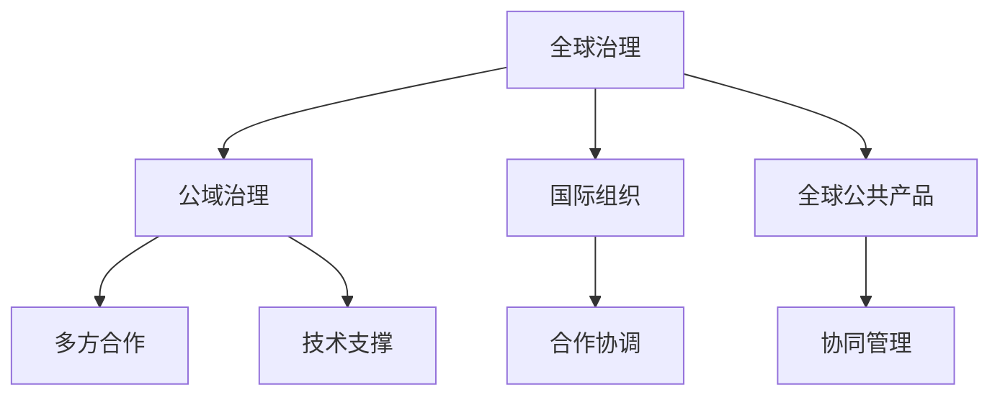

                 

# 2050年的全球治理：从国家主权到全球公域的治理模式创新

在全球化浪潮的推动下，2050年的世界将变得更加紧密相连。随着科技进步和社会发展，传统的国家主权模式将面临新的挑战，而全球公域的治理模式创新将成为新的发展方向。本文将从背景介绍、核心概念与联系、核心算法原理与操作步骤、数学模型和公式、项目实践、实际应用场景、工具和资源推荐、总结与展望、常见问题与解答等八个方面，深入探讨2050年全球治理的创新路径。

## 1. 背景介绍

### 1.1 问题由来

随着全球化进程的加快，国家间的联系日益紧密，全球问题如气候变化、国际贸易、疫情防控等成为国际社会共同关注的焦点。传统的以国家主权为核心的治理模式，在面对复杂多变的全球挑战时显得力不从心。因此，寻找一种新的治理模式，以更有效地应对全球问题，成为当前国际社会的迫切需求。

### 1.2 问题核心关键点

未来全球治理的关键在于如何构建一种超越国家主权的治理模式，实现全球公域的共治共管。这种模式需要具备以下特点：

- **全球化视角**：强调全球利益和长远发展的视角，超越单个国家的局部利益。
- **多元合作**：促进政府、企业、民间组织、学术机构等多方合作，形成协同治理机制。
- **技术支撑**：利用人工智能、区块链、大数据等前沿技术，提升治理的智能化和效率化。
- **法治保障**：建立健全全球治理的法律框架，保障治理的公正性和透明性。

## 2. 核心概念与联系

### 2.1 核心概念概述

为了更好地理解2050年全球治理的创新路径，本节将介绍几个关键核心概念：

- **全球治理**：指在超越国界的框架下，通过国际合作与协调，解决全球性问题，促进全球共同发展的过程。
- **公域治理**：指全球公域（如空气、水、网络空间等）的治理，强调多方参与和协同管理。
- **国际组织**：如联合国、世界卫生组织、世界贸易组织等，是全球治理的主要平台和执行机构。
- **全球公共产品**：如国际公共安全、环境保护、经济发展等，是全球治理的共同目标。

这些概念之间的逻辑关系可以通过以下Mermaid流程图来展示：



这个流程图展示了几组概念之间的联系：

1. 全球治理是公域治理的基础，通过国际组织进行多方合作，共同管理全球公共产品。
2. 技术支撑和法治保障是实现公域治理的重要手段。
3. 全球公共产品是全球治理的最终目标，需要多方合作和协同管理。

## 3. 核心算法原理 & 具体操作步骤

### 3.1 算法原理概述

未来的全球治理模式创新，需要综合运用多种算法和策略，以实现高效、公正、透明的治理。本文将重点介绍基于数据驱动的算法原理，通过模型预测和决策支持，推动全球治理的科学化和智能化。

### 3.2 算法步骤详解

未来全球治理的算法步骤主要包括以下几个方面：

1. **数据采集与处理**：通过全球传感器网络、卫星遥感、互联网数据等手段，收集全球范围内的各类数据。
2. **模型构建与训练**：利用机器学习、深度学习等算法，构建多层次的全球治理模型，如预测模型、决策模型、协同模型等。
3. **算法评估与优化**：对模型进行评估和优化，确保其在全球治理中的有效性和稳定性。
4. **决策支持与执行**：通过算法生成的预测结果和决策建议，支持国际组织和各国政府的治理决策。

### 3.3 算法优缺点

基于数据驱动的全球治理算法具有以下优点：

- **高效性**：通过大数据分析和机器学习，可以实时获取和处理全球数据，提升治理效率。
- **科学性**：基于数据的算法能够提供客观、准确的预测和建议，减少人为偏见和错误。
- **灵活性**：算法模型可以根据新的数据和需求进行动态更新，适应不断变化的全球局势。

同时，也存在一些缺点：

- **数据隐私和安全**：全球数据的采集和使用，可能涉及敏感信息，需要严格的数据隐私保护和网络安全措施。
- **技术依赖性**：对大数据、人工智能等技术的依赖性较高，可能受到技术发展的限制。
- **模型解释性**：复杂的算法模型可能难以解释其决策过程，影响治理的透明度和可信度。

### 3.4 算法应用领域

基于数据驱动的全球治理算法，可以在多个领域得到应用，例如：

- **全球公共安全**：通过数据分析和预测，提升国际反恐、网络安全、自然灾害应对等能力。
- **全球环境保护**：利用传感器数据和机器学习，监测全球气候变化、生物多样性、海洋污染等环境问题。
- **国际贸易**：通过数据分析和预测，优化全球贸易规则和政策，促进公平、开放的经济环境。
- **公共卫生**：利用大数据分析和机器学习，监测全球疫情传播、资源配置、疫苗接种等公共卫生问题。

## 4. 数学模型和公式 & 详细讲解 & 举例说明

### 4.1 数学模型构建

本文将构建一个简单的全球环境变化预测模型，用于说明基于数据驱动的全球治理算法的基本框架。

设 $E(t)$ 为时间 $t$ 时的全球环境指标，$A(t)$ 为全球人类活动强度，$B(t)$ 为全球自然灾害频率。则环境变化可以表示为：

$$
E(t) = f(A(t), B(t)) + \epsilon(t)
$$

其中 $f$ 为环境变化函数，$\epsilon(t)$ 为随机误差。

### 4.2 公式推导过程

通过数据分析和机器学习算法，可以构建环境变化模型的预测函数。假设使用线性回归模型，则有：

$$
E(t) = \alpha A(t) + \beta B(t) + \gamma + \epsilon(t)
$$

其中 $\alpha$、$\beta$、$\gamma$ 为模型的参数，需要通过历史数据进行估计。

### 4.3 案例分析与讲解

以全球变暖为例，利用上述模型进行环境变化的预测和决策支持：

1. **数据采集**：收集全球气象数据、人类活动数据、自然灾害数据等。
2. **模型构建**：使用历史数据训练线性回归模型，估计 $\alpha$、$\beta$、$\gamma$ 等参数。
3. **预测与决策**：利用模型对未来的环境变化进行预测，提供决策参考。

## 5. 项目实践：代码实例和详细解释说明

### 5.1 开发环境搭建

在进行全球治理的算法实践前，我们需要准备好开发环境。以下是使用Python进行TensorFlow开发的环境配置流程：

1. 安装Anaconda：从官网下载并安装Anaconda，用于创建独立的Python环境。

2. 创建并激活虚拟环境：
```bash
conda create -n tensorflow-env python=3.8 
conda activate tensorflow-env
```

3. 安装TensorFlow：根据CUDA版本，从官网获取对应的安装命令。例如：
```bash
conda install tensorflow -c tf -c conda-forge
```

4. 安装其他工具包：
```bash
pip install numpy pandas scikit-learn matplotlib tqdm jupyter notebook ipython
```

完成上述步骤后，即可在`tensorflow-env`环境中开始全球治理的算法实践。

### 5.2 源代码详细实现

下面我们以全球变暖预测为例，给出使用TensorFlow进行模型训练和预测的代码实现。

```python
import tensorflow as tf
import numpy as np
import pandas as pd

# 数据加载
data = pd.read_csv('global_warming.csv')
X = data[['human_activity', 'natural_disasters']].to_numpy()
y = data['environment'].to_numpy()

# 模型构建
model = tf.keras.Sequential([
    tf.keras.layers.Dense(32, activation='relu', input_shape=(2,)),
    tf.keras.layers.Dense(1)
])

# 模型编译
model.compile(optimizer=tf.keras.optimizers.Adam(0.001), loss='mse')

# 模型训练
model.fit(X, y, epochs=100, batch_size=32)

# 模型预测
test_data = np.array([[5.0, 2.0]])
prediction = model.predict(test_data)

print(f"预测结果：{prediction[0][0]}")
```

### 5.3 代码解读与分析

让我们再详细解读一下关键代码的实现细节：

**数据加载**：
- 使用pandas加载历史数据，提取人类活动强度、自然灾害频率和环境指标等关键变量。

**模型构建**：
- 定义两个全连接层，第一层使用ReLU激活函数，第二层输出环境指标。
- 使用Adam优化器和均方误差损失函数进行模型编译。

**模型训练**：
- 对数据进行随机梯度下降优化，迭代100次，每次使用32个样本。

**模型预测**：
- 使用测试数据进行预测，输出预测结果。

## 6. 实际应用场景

### 6.1 全球公共安全

基于数据驱动的算法，可以构建全球公共安全治理模型，实时监测和预测恐怖袭击、网络攻击等安全事件。通过大数据分析和机器学习，可以及时发现潜在威胁，制定有效的应对措施。

**应用场景**：
- **反恐**：利用全球恐怖活动数据，构建预测模型，实时监测潜在的恐怖袭击事件。
- **网络安全**：分析全球网络攻击数据，预测和防御网络安全威胁。
- **自然灾害**：通过传感器数据和机器学习，预测和应对自然灾害，如地震、洪水、火灾等。

### 6.2 全球环境保护

利用环境监测数据和机器学习，可以构建全球环境保护治理模型，监测和预测全球气候变化、生物多样性、海洋污染等环境问题。通过算法预测，及时采取保护措施，缓解环境危机。

**应用场景**：
- **气候变化**：监测全球温室气体排放、海平面上升、极端天气等数据，预测气候变化趋势。
- **生物多样性**：分析全球生物多样性数据，监测和保护濒危物种。
- **海洋污染**：利用卫星遥感数据和机器学习，监测和预测海洋污染情况。

### 6.3 国际贸易

通过全球贸易数据和机器学习，可以构建国际贸易治理模型，优化全球贸易规则和政策，促进公平、开放的经济环境。

**应用场景**：
- **关税政策**：预测不同国家之间的关税调整对全球贸易的影响，制定合理的关税政策。
- **贸易流量**：分析全球贸易流量数据，预测贸易趋势和变化。
- **全球供应链**：通过机器学习，优化全球供应链管理，提升贸易效率。

### 6.4 未来应用展望

随着算法的不断进步和数据的积累，未来全球治理将更加智能化和高效化。主要发展趋势包括：

- **智能协同**：利用人工智能技术，实现多国协同治理，提升治理效率和公平性。
- **数据共享**：构建全球数据共享平台，促进数据开放和利用，实现全球治理的透明化。
- **算法融合**：融合多种算法和技术，提升治理模型的综合能力和适应性。

## 7. 工具和资源推荐

### 7.1 学习资源推荐

为了帮助开发者系统掌握全球治理的算法基础和实践技巧，这里推荐一些优质的学习资源：

1. **《深度学习入门》系列博文**：由大模型技术专家撰写，深入浅出地介绍了深度学习原理、TensorFlow等核心技术。

2. **《TensorFlow实战》书籍**：详细介绍了TensorFlow的开发和使用，包括数据处理、模型构建、算法优化等技术。

3. **《全球治理导论》书籍**：介绍了全球治理的基本概念、发展历程和未来趋势，适合对全球治理感兴趣的读者。

4. **联合国全球治理网站**：提供全球治理的最新动态和政策信息，是了解全球治理的重要平台。

5. **Kaggle数据集**：提供全球治理相关的数据集，包括环境、安全、贸易等领域，是进行算法实践的良好素材。

通过对这些资源的学习实践，相信你一定能够快速掌握全球治理的算法精髓，并用于解决实际的治理问题。

### 7.2 开发工具推荐

高效的开发离不开优秀的工具支持。以下是几款用于全球治理算法开发的常用工具：

1. **TensorFlow**：由Google主导开发的深度学习框架，支持分布式训练和推理，适合大规模数据处理和模型优化。

2. **PyTorch**：由Facebook开发的开源深度学习框架，支持动态计算图和GPU加速，适合快速迭代和研究。

3. **Jupyter Notebook**：开源的交互式开发环境，支持Python、R等语言，适合算法实验和可视化。

4. **Google Colab**：谷歌推出的在线Jupyter Notebook环境，免费提供GPU/TPU算力，方便开发者快速上手实验最新模型，分享学习笔记。

合理利用这些工具，可以显著提升全球治理算法的开发效率，加快创新迭代的步伐。

### 7.3 相关论文推荐

全球治理算法的发展源于学界的持续研究。以下是几篇奠基性的相关论文，推荐阅读：

1. **《全球治理的机器学习框架》**：介绍了一种基于机器学习的全球治理框架，利用大数据和算法预测全球问题。

2. **《全球安全风险评估模型》**：提出了一种基于神经网络的全球安全风险评估模型，实时监测和预测全球安全事件。

3. **《全球环境保护的智能决策系统》**：利用机器学习构建全球环境保护决策系统，优化环境治理策略。

4. **《国际贸易模型的深度学习优化》**：介绍了一种基于深度学习的国际贸易模型，优化全球贸易规则和政策。

5. **《多国协同治理的算法研究》**：研究了多国协同治理的算法模型，提升治理效率和公平性。

这些论文代表了大规模治理算法的最新进展，通过学习这些前沿成果，可以帮助研究者把握学科前进方向，激发更多的创新灵感。

## 8. 总结：未来发展趋势与挑战

### 8.1 总结

本文对基于数据驱动的全球治理算法进行了全面系统的介绍。首先阐述了全球治理的算法背景和意义，明确了算法在应对全球问题中的重要作用。其次，从原理到实践，详细讲解了全球治理的算法模型和操作步骤，给出了算法实践的完整代码实例。同时，本文还广泛探讨了算法在多个领域的应用前景，展示了全球治理算法的广阔前景。此外，本文精选了算法的学习资源，力求为读者提供全方位的技术指引。

通过本文的系统梳理，可以看到，基于数据驱动的全球治理算法正在成为全球治理的重要范式，极大地拓展了治理的智能化水平，推动了全球治理的科学化和效率化。未来，伴随技术的不断进步和数据的积累，全球治理算法必将进一步优化和创新，为构建更加公平、开放、可持续的全球治理体系铺平道路。

### 8.2 未来发展趋势

展望未来，全球治理算法将呈现以下几个发展趋势：

1. **算法智能化**：随着机器学习和深度学习技术的不断进步，全球治理算法将更加智能化和自适应，能够实时处理全球数据，快速响应全球问题。

2. **协同治理**：利用区块链和智能合约技术，实现全球治理的多方协同，提升治理的透明度和公信力。

3. **数据开放与共享**：构建全球数据共享平台，促进数据的开放和利用，实现全球治理的透明化和公正化。

4. **算法融合与创新**：融合多种算法和技术，提升全球治理算法的综合能力和适应性，推动全球治理向更高级阶段发展。

以上趋势凸显了全球治理算法的广阔前景。这些方向的探索发展，必将进一步提升全球治理的智能化水平，推动全球治理体系的不断优化。

### 8.3 面临的挑战

尽管全球治理算法已经取得了瞩目成就，但在迈向更加智能化、公平化应用的过程中，它仍面临诸多挑战：

1. **数据隐私与安全**：全球数据的采集和使用，可能涉及敏感信息，需要严格的数据隐私保护和网络安全措施。
2. **技术依赖性**：对大数据、机器学习等技术的依赖性较高，可能受到技术发展的限制。
3. **模型解释性**：复杂的算法模型可能难以解释其决策过程，影响治理的透明度和可信度。
4. **多国协同**：实现多国协同治理，需要克服文化和政治差异，建立有效的合作机制。
5. **资源分配**：全球治理需要大量资源投入，如何合理分配资源，提升治理效率，仍需进一步探索。

这些挑战需要全球治理的各方共同努力，通过技术创新和政策协调，克服困难，推动全球治理的持续发展。

### 8.4 研究展望

面对全球治理算法所面临的挑战，未来的研究需要在以下几个方面寻求新的突破：

1. **数据隐私保护**：开发高效的数据隐私保护技术，保障全球数据的开放和安全。

2. **模型解释性**：研究模型解释性算法，提升治理算法的透明度和可信度。

3. **多国协同治理**：构建多国协同治理平台，促进跨国合作，提升治理效率。

4. **资源优化**：优化全球治理的资源分配，提升治理的可持续性。

这些研究方向的探索，必将引领全球治理算法迈向更高的台阶，为构建安全、可靠、可解释、可控的全球治理体系铺平道路。面向未来，全球治理算法还需要与其他人工智能技术进行更深入的融合，如知识表示、因果推理、强化学习等，多路径协同发力，共同推动全球治理的进步。只有勇于创新、敢于突破，才能不断拓展全球治理算法的边界，让智能技术更好地服务于全球治理。

## 9. 附录：常见问题与解答

**Q1：全球治理算法是否适用于所有领域？**

A: 全球治理算法在多个领域都可以发挥重要作用，如全球公共安全、环境保护、国际贸易等。但对于一些特殊领域，如军事、医疗等，需要结合领域特点进行定制化开发。

**Q2：如何平衡全球治理中的多方利益？**

A: 实现全球治理的多方利益平衡，需要建立公正透明的治理机制，如多国协商机制、第三方评估机制等。同时，利用数据驱动的算法，提供客观、公平的治理建议，减少人为偏见。

**Q3：全球治理算法是否存在偏见？**

A: 全球治理算法可能受到数据偏差的影响，存在一定的偏见。为了避免偏见，需要对数据进行预处理，如去噪、平衡等，同时引入伦理导向的评估指标，监督算法的公平性和公正性。

**Q4：如何应对全球治理中的突发事件？**

A: 突发事件需要快速反应和决策支持，可以利用实时数据分析和预测算法，快速响应和应对突发事件，如地震、恐怖袭击等。同时，建立应急响应机制，协调各方资源，提升治理效率。

**Q5：如何评估全球治理算法的性能？**

A: 评估全球治理算法的性能，需要建立多维度的评估指标，如治理效果、公平性、效率等。同时，通过A/B测试、模拟实验等方法，验证算法的有效性和可靠性。

---

作者：禅与计算机程序设计艺术 / Zen and the Art of Computer Programming

