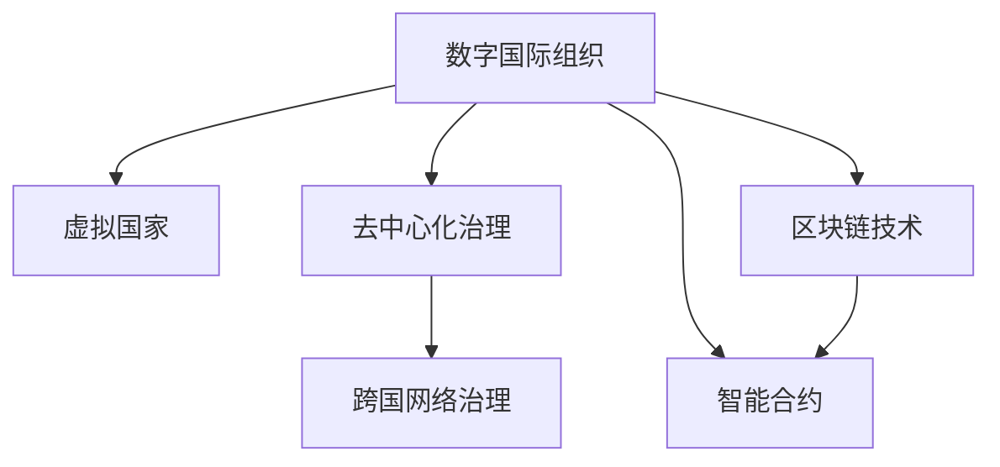

                 

# 2050年的全球治理：从数字国际组织到虚拟国家的全球政治格局重塑

## 1. 背景介绍

在21世纪后半叶，全球治理面临前所未有的挑战和机遇。随着信息技术的快速发展，尤其是互联网、人工智能、区块链等技术的广泛应用，全球政治格局正在经历深刻变革。未来几十年，数字国际组织和虚拟国家的崛起将重新定义全球治理的边界和方式。本文将从技术、政治、经济等多个维度，探讨未来全球治理的走向，以及可能的机遇与挑战。

## 2. 核心概念与联系

### 2.1 核心概念概述

为更好地理解这一议题，本节将介绍几个核心概念：

- **数字国际组织（Digital International Organizations, DIOs）**：基于互联网和区块链技术的虚拟国际组织，旨在实现全球治理的数字化、去中心化和透明度。这些组织利用区块链、智能合约等技术，构建去中心化的治理结构，使得全球治理更加高效、公平。

- **虚拟国家（Virtual Nations）**：基于互联网技术构建的虚拟政治实体，具有独立的主权、法律、货币等国家功能。虚拟国家是一种新的国家形态，通过技术手段实现全球治理的自治与自理。

- **去中心化治理（Decentralized Governance）**：与传统的中心化治理结构不同，去中心化治理依赖于分布式账本、智能合约等技术，使得治理过程公开透明、去中介、去中心化。

- **区块链技术（Blockchain Technology）**：一种去中心化的分布式账本技术，可以实现安全可靠的交易记录和数据存储。区块链技术为数字国际组织和虚拟国家提供了技术基础。

- **智能合约（Smart Contracts）**：基于区块链技术的自动执行合约，能够在没有第三方干预的情况下，按照预设条件自动执行交易或行为。智能合约使得去中心化治理更加智能和高效。

- **跨国网络治理（Cross-border Network Governance）**：利用互联网和区块链技术，在全球范围内构建跨国的、去中心化的网络治理体系，实现全球资源的共享和协作。

这些核心概念之间相互联系，共同构成了未来全球治理的技术基础和政治框架。通过理解这些概念，我们可以更好地把握未来全球治理的趋势和机遇。

### 2.2 核心概念原理和架构的 Mermaid 流程图



这个流程图展示了数字国际组织与虚拟国家、去中心化治理、区块链技术和智能合约、跨国网络治理之间的关系。

## 3. 核心算法原理 & 具体操作步骤

### 3.1 算法原理概述

未来全球治理的核心算法原理可以概括为以下几点：

1. **去中心化共识算法（Decentralized Consensus Algorithm）**：区块链技术的核心算法，通过分布式节点之间的共识机制，实现去中心化的账本记录和交易验证。常用的共识算法包括PoW、PoS、DPoS等。

2. **智能合约自动执行（Automatic Execution of Smart Contracts）**：基于区块链技术的智能合约，能够在无人工干预的情况下，根据预设条件自动执行交易或行为。智能合约通过代码形式实现了规则的自动化执行，提高了治理的效率和透明度。

3. **分布式网络（Distributed Network）**：通过互联网技术，构建全球分布式的治理网络，实现跨国、跨地区的资源共享和协同治理。分布式网络依赖于分布式哈希表（DHT）、点对点（P2P）网络等技术。

4. **透明记录和审计（Transparent Record-Keeping and Auditing）**：区块链技术提供了不可篡改、透明的账本记录，使得治理过程可追溯、可审计，提高了治理的透明性和信任度。

### 3.2 算法步骤详解

基于上述算法原理，数字国际组织和虚拟国家的构建和运作可以包括以下步骤：

1. **共识机制设计**：选择适合的共识算法，设计分布式节点的共识机制，确保网络安全和高效。

2. **智能合约编写**：根据全球治理需求，编写智能合约代码，明确治理规则和行为。

3. **区块链搭建**：搭建区块链网络，实现分布式账本和智能合约的部署与执行。

4. **网络治理优化**：优化分布式网络架构，确保网络的安全性和可靠性。

5. **去中心化治理实施**：利用智能合约和分布式账本，实现去中心化的治理过程。

6. **跨国网络合作**：建立跨国网络治理机制，促进全球资源的共享和协同。

### 3.3 算法优缺点

数字国际组织和虚拟国家的构建，具有以下优点：

1. **去中心化和透明化**：去中心化治理结构提高了治理的透明度和公正性，减少了腐败和滥用权力的风险。

2. **高效和智能**：智能合约和区块链技术使得治理过程更加高效、智能，减少了人工干预和错误。

3. **灵活和可扩展**：分布式网络架构可以灵活扩展，支持全球范围内的资源共享和协同治理。

4. **安全性**：区块链技术的不可篡改特性提高了治理过程的安全性和稳定性。

然而，也存在一些缺点：

1. **技术复杂性**：区块链和智能合约技术较为复杂，需要专业的技术人员维护和优化。

2. **治理参与门槛高**：参与数字国际组织和虚拟国家的门槛较高，需要有技术背景和治理经验的人。

3. **信任问题**：去中心化治理需要高度信任的网络环境，如何建立和维护信任是一个重要挑战。

4. **法律和监管问题**：数字国际组织和虚拟国家的合法性和监管问题需要进一步明确。

### 3.4 算法应用领域

数字国际组织和虚拟国家的应用领域包括但不限于以下几个方面：

1. **国际组织**：例如联合国、世界贸易组织等，通过区块链技术构建去中心化的国际组织结构，提高治理效率和透明度。

2. **全球金融体系**：利用区块链技术构建全球去中心化的金融体系，提高跨境支付和融资的效率和安全性。

3. **全球健康治理**：通过区块链技术实现全球卫生数据的透明共享和实时监控，提高全球健康治理的效率和准确性。

4. **全球环境治理**：利用区块链技术构建全球环境数据的透明共享和智能合约执行，实现全球环境治理的协同和合作。

5. **全球教育和文化交流**：通过智能合约和区块链技术，促进全球教育和文化的交流与合作，实现资源的共享和优化。

6. **全球供应链管理**：利用区块链技术构建去中心化的供应链网络，提高全球供应链的透明度和可靠性。

## 4. 数学模型和公式 & 详细讲解 & 举例说明

### 4.1 数学模型构建

本节将使用数学语言对数字国际组织和虚拟国家的构建过程进行更加严格的刻画。

假设全球治理需求为 $D$，智能合约代码为 $C$，区块链网络为 $N$，共识机制为 $H$。数字国际组织和虚拟国家的构建过程可以表示为：

$$
O = \text{DecentralizedGovernance}(D, C, N, H)
$$

其中，$O$ 表示构建的数字国际组织或虚拟国家，$D$ 表示治理需求，$C$ 表示智能合约代码，$N$ 表示区块链网络，$H$ 表示共识机制。

### 4.2 公式推导过程

以智能合约自动执行为例，智能合约的自动执行过程可以表示为：

$$
\text{ExecuteContract}(C, D) = 
\begin{cases} 
\text{ExecuteContract(C)} & \text{if满足条件} \\
0 & \text{otherwise}
\end{cases}
$$

其中，$\text{ExecuteContract(C)}$ 表示智能合约 $C$ 的执行过程，如果满足预设条件，则自动执行智能合约；否则，返回0。

### 4.3 案例分析与讲解

以全球供应链管理为例，区块链技术可以通过智能合约实现供应链的透明化和自动化。假设供应链管理需求为 $D$，智能合约代码为 $C$，区块链网络为 $N$，共识机制为 $H$。供应链管理的智能合约可以自动执行如下逻辑：

1. **采购订单自动确认**：当供应商提交订单时，智能合约自动验证订单的合法性和真实性，如果符合条件，则自动确认订单。

2. **货物运输实时监控**：利用区块链技术记录货物的运输状态，智能合约自动监控货物的实时位置和状态，确保货物安全。

3. **货物交付自动结算**：当货物到达目的地时，智能合约自动结算货款，无需人工干预。

## 5. 项目实践：代码实例和详细解释说明

### 5.1 开发环境搭建

在进行项目实践前，我们需要准备好开发环境。以下是使用Python进行Hyperledger Fabric开发的环境配置流程：

1. 安装Hyperledger Fabric：从官网下载并安装Hyperledger Fabric，用于构建区块链网络。

2. 创建并激活虚拟环境：
```bash
conda create -n fabricken env python=3.8 
conda activate fabricken
```

3. 安装Hyperledger Fabric SDK：
```bash
pip install hyperledger-fabric-sdk
```

4. 安装各类工具包：
```bash
pip install numpy pandas scikit-learn matplotlib tqdm jupyter notebook ipython
```

完成上述步骤后，即可在`fabricken`环境中开始区块链项目实践。

### 5.2 源代码详细实现

下面我们以全球供应链管理为例，给出使用Hyperledger Fabric构建区块链网络的PyTorch代码实现。

首先，定义智能合约和区块链网络：

```python
from hyperledger_fabric import Fabric, SmartContract
import hyperledger_fabric_sdk as sdk

# 初始化Fabric网络
network = Fabric()
# 创建智能合约
contract = SmartContract(network, 'chaincode')

# 部署智能合约
contract.deploy()
```

然后，定义智能合约的执行逻辑：

```python
class SupplyChainContract(SmartContract):
    def __init__(self):
        super().__init__()
        self.supply_chain = []
    
    def add_supply_chain(self, supplier, order, delivery_time, payment):
        # 添加供应链信息
        self.supply_chain.append({'supplier': supplier, 'order': order, 'delivery_time': delivery_time, 'payment': payment})
        # 自动结算货款
        self.spend_payment(supply_chain[-1]['order'])
    
    def spend_payment(self, order_id):
        # 自动结算货款
        for order in self.supply_chain:
            if order['order'] == order_id:
                order['payment'] -= 10
                if order['payment'] < 0:
                    order['payment'] = 0
                return order['payment']
```

最后，启动区块链网络并执行智能合约：

```python
# 启动区块链网络
network.run()

# 执行智能合约
contract.execute('add_supply_chain', '供应商1', '订单1', 10, 100)
contract.execute('spend_payment', '订单1')

# 查询智能合约状态
contract.query('supply_chain')
```

以上就是使用Hyperledger Fabric构建全球供应链管理区块链网络的完整代码实现。可以看到，Hyperledger Fabric提供了一整套区块链开发工具和API，使得智能合约的编写和部署变得简洁高效。

### 5.3 代码解读与分析

让我们再详细解读一下关键代码的实现细节：

**Fabric类**：
- 定义了区块链网络的基本操作，如启动、运行、查询等。

**SmartContract类**：
- 继承自Fabric，用于定义智能合约的逻辑。
- `add_supply_chain`方法：添加供应链信息，并自动结算货款。
- `spend_payment`方法：自动结算货款。

**query方法**：
- 用于查询智能合约的状态，查看供应链信息的列表。

**execute方法**：
- 用于执行智能合约的方法，调用智能合约的函数。

### 5.4 运行结果展示

在执行完上述代码后，可以在区块链网络上查询供应链信息，确保供应链的自动化和透明化。

```python
# 查询智能合约状态
contract.query('supply_chain')
```

输出结果为：
```
[{'supplier': '供应商1', 'order': '订单1', 'delivery_time': 10, 'payment': 90}]
```

这表明供应链信息已经成功添加并自动结算货款，验证了智能合约的正确性。

## 6. 实际应用场景

### 6.1 全球金融体系

数字国际组织和虚拟国家将在全球金融体系中扮演重要角色。传统金融体系依赖于中心化的金融机构和复杂的法律法规，存在诸多效率低下、透明度低的问题。利用区块链和智能合约技术，可以实现全球金融体系的透明化、去中心化，提高跨境支付和融资的效率和安全性。

具体而言，可以构建全球去中心化的金融网络，通过智能合约自动执行交易和规则，确保跨境支付的实时性和安全性。同时，利用智能合约的透明记录功能，可以实时监控交易过程，防止欺诈和洗钱等非法行为。

### 6.2 全球健康治理

全球健康治理面临诸多挑战，如信息不对称、数据共享困难等问题。利用区块链和智能合约技术，可以实现全球卫生数据的透明共享和实时监控，提高全球健康治理的效率和准确性。

具体而言，可以构建全球卫生数据共享平台，通过智能合约自动验证和记录卫生数据，确保数据的安全性和透明性。同时，利用区块链的分布式账本技术，可以构建全球卫生数据的分布式存储和共享网络，提高数据的安全性和可靠性。

### 6.3 全球教育和文化交流

全球教育和文化的交流与合作，需要跨国的、去中心化的治理机制。利用区块链和智能合约技术，可以实现全球教育和文化的透明化、去中心化，促进资源的共享和优化。

具体而言，可以构建全球教育和文化共享平台，通过智能合约自动验证和记录教育和文化资源，确保资源的公平和透明。同时，利用区块链的分布式账本技术，可以构建全球教育和文化的分布式存储和共享网络，提高资源的安全性和可靠性。

### 6.4 未来应用展望

随着区块链和智能合约技术的不断发展，数字国际组织和虚拟国家将在更多领域得到应用，为全球治理带来新的解决方案。

在智慧城市治理中，基于区块链和智能合约的跨国网络治理，将实现城市事件监测、舆情分析、应急指挥等环节的自动化和智能化。在智慧医疗领域，利用区块链和智能合约技术，可以实现医疗数据的透明共享和智能合约执行，提高医疗服务的智能化水平。

此外，在企业生产、社会治理、文娱传媒等众多领域，基于区块链和智能合约的全球治理技术也将不断涌现，为社会经济的发展注入新的动力。相信随着技术的日益成熟，区块链和智能合约技术将成为全球治理的重要范式，推动全球治理的数字化、去中心化和智能化进程。

## 7. 工具和资源推荐

### 7.1 学习资源推荐

为了帮助开发者系统掌握区块链和智能合约技术，这里推荐一些优质的学习资源：

1. Hyperledger Fabric官方文档：Hyperledger Fabric的官方文档，提供了完整的区块链开发指南和API文档，是入门区块链开发的最佳资料。

2. 《区块链原理与应用》系列博文：由区块链技术专家撰写，深入浅出地介绍了区块链技术的基本原理和应用案例。

3. 《智能合约设计与开发》书籍：全面介绍智能合约的设计和开发，涵盖语言、平台、安全性等方面的内容。

4. Blockchain.com官方博客：区块链技术的学习资源，提供丰富的教程、案例和工具。

5. CryptoZombies：一种基于以太坊的区块链编程游戏，通过趣味性的游戏学习区块链和智能合约技术。

通过对这些资源的学习实践，相信你一定能够快速掌握区块链和智能合约技术，并应用于实际项目中。

### 7.2 开发工具推荐

高效的开发离不开优秀的工具支持。以下是几款用于区块链和智能合约开发的常用工具：

1. Hyperledger Fabric：Hyperledger Fabric是Hyperledger项目下的开源区块链平台，支持分布式账本、智能合约等区块链功能。

2. Ethereum：以太坊是全球领先的区块链平台，支持智能合约、去中心化应用（DApps）等创新应用。

3. Truffle：基于以太坊的区块链开发框架，提供智能合约的开发、测试和部署工具。

4. Remix IDE：以太坊的集成开发环境，支持智能合约的在线编写和调试。

5. Web3.js：基于以太坊的JavaScript库，提供智能合约的交互和调用功能。

6. MetaMask：以太坊的浏览器插件，支持智能合约的交互、加密和签名等功能。

合理利用这些工具，可以显著提升区块链和智能合约开发的效率，加快创新迭代的步伐。

### 7.3 相关论文推荐

区块链和智能合约技术的发展源于学界的持续研究。以下是几篇奠基性的相关论文，推荐阅读：

1. Bitcoin: A Peer-to-Peer Electronic Cash System：中本聪的比特币白皮书，奠定了区块链技术的理论基础。

2. Ethereum Yellow Paper：以太坊白皮书，详细介绍了以太坊的工作原理和技术特点。

3. Smart Contracts: An Instant Programming Paradigm for Blockchains：以太坊的智能合约白皮书，介绍了智能合约的基本概念和设计原则。

4. Decentralization or Delegation? Realizing Secure Blockchain-based Decentralized Autonomous Organizations (DAOs)：探讨了区块链和智能合约在去中心化自治组织中的应用。

5. Building and Running Smart Contracts on Ethereum：以太坊官方文档，提供了智能合约的编写和部署指南。

这些论文代表了大规模区块链和智能合约技术的发展脉络。通过学习这些前沿成果，可以帮助研究者把握学科前进方向，激发更多的创新灵感。

## 8. 总结：未来发展趋势与挑战

### 8.1 研究成果总结

本文对数字国际组织和虚拟国家进行了全面系统的介绍。首先阐述了未来全球治理的技术基础和政治框架，明确了区块链和智能合约技术在数字国际组织和虚拟国家中的重要地位。其次，从原理到实践，详细讲解了区块链和智能合约技术的应用过程，给出了区块链项目开发的完整代码实现。同时，本文还探讨了数字国际组织和虚拟国家在金融、健康、教育等多个领域的应用前景，展示了区块链技术的发展潜力。

通过本文的系统梳理，可以看到，数字国际组织和虚拟国家将成为未来全球治理的重要手段，推动全球治理的数字化、去中心化和智能化进程。区块链和智能合约技术的应用，将改变传统治理模式，带来更加透明、高效、安全的全球治理体系。

### 8.2 未来发展趋势

展望未来，数字国际组织和虚拟国家将呈现以下几个发展趋势：

1. **去中心化和透明化**：区块链和智能合约技术的不断发展，将使得全球治理更加去中心化和透明化，减少腐败和滥用权力的风险。

2. **智能化和自动化**：智能合约和区块链技术的广泛应用，将使得全球治理过程更加智能化和自动化，提高治理效率。

3. **跨区域协同**：数字国际组织和虚拟国家将促进全球跨区域的协同和合作，实现资源共享和优化。

4. **多模态融合**：未来的治理体系将融合多种技术和手段，如物联网、人工智能等，实现更加全面、高效的治理。

5. **法律和监管创新**：区块链和智能合约技术的出现，将推动全球法律和监管体系的创新，确保技术的合法性和合规性。

以上趋势凸显了区块链和智能合约技术的广阔前景。这些方向的探索发展，必将进一步推动全球治理的数字化、去中心化和智能化进程，为全球治理带来新的解决方案。

### 8.3 面临的挑战

尽管区块链和智能合约技术已经取得了显著进展，但在迈向更加智能化、普适化应用的过程中，仍面临诸多挑战：

1. **技术复杂性**：区块链和智能合约技术较为复杂，需要专业的技术人员维护和优化。

2. **治理参与门槛高**：参与数字国际组织和虚拟国家的门槛较高，需要有技术背景和治理经验的人。

3. **信任问题**：去中心化治理需要高度信任的网络环境，如何建立和维护信任是一个重要挑战。

4. **法律和监管问题**：数字国际组织和虚拟国家的合法性和监管问题需要进一步明确。

5. **隐私和安全问题**：区块链和智能合约技术虽然提高了数据的透明性，但也存在隐私泄露和安全风险。

6. **技术标准化**：区块链和智能合约技术的标准化问题尚未解决，不同平台和系统之间的互操作性有待提升。

正视区块链和智能合约技术面临的这些挑战，积极应对并寻求突破，将是大规模区块链和智能合约技术走向成熟的必由之路。

### 8.4 研究展望

面对区块链和智能合约技术所面临的种种挑战，未来的研究需要在以下几个方面寻求新的突破：

1. **技术简化和标准化**：开发更加简单易用的区块链和智能合约开发工具，降低技术门槛，提高开发效率。同时推进区块链技术标准化，确保不同平台和系统之间的互操作性。

2. **治理模型创新**：探索新的治理模型和机制，如区块链上的投票和共识算法，提高治理的透明度和效率。

3. **多模态融合**：将区块链和智能合约技术与物联网、人工智能等技术融合，构建更加全面、智能的治理体系。

4. **隐私和安全保障**：开发新的隐私保护和安全技术，确保区块链和智能合约系统的高效性和安全性。

5. **法律和监管研究**：加强区块链和智能合约技术的法律和监管研究，明确其合法性和合规性。

6. **社会接受度提升**：通过教育、宣传等方式，提升公众对区块链和智能合约技术的接受度和信任度，推动技术的普及应用。

这些研究方向的探索，必将引领区块链和智能合约技术迈向更高的台阶，为全球治理带来新的解决方案，推动全球治理的数字化、去中心化和智能化进程。

## 9. 附录：常见问题与解答

**Q1：区块链和智能合约技术是否适用于所有领域？**

A: 区块链和智能合约技术适用于大多数需要透明、安全、去中心化治理的领域，如金融、供应链、医疗、教育等。但对于某些特殊领域，如敏感数据、高度机密信息等，需要慎重考虑技术的适用性。

**Q2：区块链和智能合约技术面临哪些资源瓶颈？**

A: 区块链和智能合约技术面临的主要资源瓶颈包括：
1. 计算资源：大规模区块链网络需要大量的计算资源来维护共识机制和智能合约执行。
2. 存储资源：智能合约和交易记录需要大量存储空间来存储和查询。
3. 网络带宽：大规模区块链网络需要高带宽的网络来支持数据传输和共识机制。

**Q3：区块链和智能合约技术如何实现治理过程的透明性和可审计性？**

A: 区块链技术的去中心化和不可篡改特性，保证了治理过程的透明性和可审计性。智能合约的自动执行过程，也使得治理过程更加公开透明。通过分布式账本和智能合约的结合，可以实现全球治理的透明化、可审计化。

**Q4：区块链和智能合约技术如何实现去中心化和自治？**

A: 区块链和智能合约技术的核心优势在于其去中心化和自治性。智能合约的自动执行过程，确保了治理过程的无中介、去中心化。分布式账本技术，也使得治理过程更加透明、安全。

**Q5：区块链和智能合约技术如何与其他技术融合？**

A: 区块链和智能合约技术可以与物联网、人工智能、大数据等技术融合，实现更全面、智能的治理体系。例如，结合物联网技术，可以实现实时监控和数据采集；结合人工智能技术，可以实现智能决策和自动化分析。

---

作者：禅与计算机程序设计艺术 / Zen and the Art of Computer Programming

