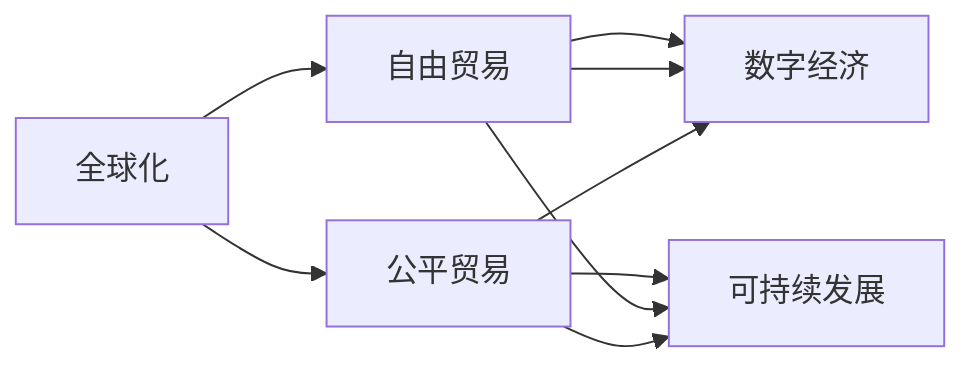

                 

# 2050年的全球贸易：从自由化到公平化的经济秩序

## 1. 背景介绍

### 1.1 全球化进程的回顾
20世纪末至21世纪初，全球化进程经历了蓬勃发展。自由贸易协定、区域经济一体化、WTO等多边贸易机制的建立，推动了世界经济的繁荣与增长。然而，全球化并非一帆风顺，也伴随着诸多挑战，如贫富差距扩大、环境污染加剧、文化同质化等问题。这些问题逐渐引起了公众和政策制定者的关注。

### 1.2 数字化转型的加速
随着信息技术的飞速发展，数字化转型成为推动经济社会发展的重要引擎。电子商务、云计算、大数据、区块链等新技术，正在重塑全球贸易格局。数字化不仅提高了交易效率，也带来了新的商业模式、产业形态和治理模式。

### 1.3 环境与社会可持续性
随着全球人口增长和资源消耗的加剧，环境和社会可持续性问题变得愈发严峻。如何平衡经济发展与环境保护，成为全球贸易面临的新课题。各国在推动经济发展的同时，需更多地关注社会福祉和环境保护，构建公平、可持续的经济秩序。

## 2. 核心概念与联系

### 2.1 核心概念概述

- **全球化**：指国家间通过贸易、投资、信息交流等方式，逐步降低经济和政策障碍，形成全球统一市场的过程。全球化推动了世界经济的融合和增长。

- **自由贸易**：指减少或取消关税、配额等贸易壁垒，使商品和服务的跨境流动更为自由、便利。自由贸易促进了全球经济的繁荣。

- **公平贸易**：强调贸易过程的公正性和透明性，反对剥削、不公正的贸易行为。公平贸易关注劳动条件、环境标准、知识产权保护等问题。

- **数字经济**：以信息技术和数字技术为支撑的经济形态，涵盖电子商务、互联网金融、云计算、大数据等多个领域。数字经济推动了全球贸易的数字化转型。

- **可持续发展**：指在经济发展的同时，注重环境保护、社会福祉、资源利用等方面，实现经济、社会、环境的协调发展。

这些核心概念构成了全球贸易从自由化向公平化转变的基础，反映了全球经济发展的不同阶段和方向。

### 2.2 核心概念原理和架构的 Mermaid 流程图


这张流程图展示了全球化、自由贸易、公平贸易、数字经济和可持续发展之间的相互关系和联系。全球化和自由贸易推动了数字经济的发展，但同时也带来了公平性和可持续性问题。公平贸易和可持续发展则是解决这些问题的关键途径。

## 3. 核心算法原理 & 具体操作步骤
### 3.1 算法原理概述

全球贸易的公平化过程，可以视为一种基于多目标优化问题的算法。目标包括经济发展、社会福祉、环境保护等。算法需综合考虑这些目标，通过优化贸易政策、规则和机制，实现公平、可持续的全球贸易秩序。

形式化地，假设全球贸易体系为 $T$，其目标函数为 $\mathcal{F}(T)$，约束条件为 $\mathcal{C}(T)$，则公平化过程的优化问题可以表示为：

$$
\min_{T} \mathcal{F}(T) \quad \text{subject to} \quad \mathcal{C}(T)
$$

其中，$\mathcal{F}(T)$ 为公平化目标函数，$\mathcal{C}(T)$ 为约束条件，如法律、经济、社会、环境等方面的限制。

### 3.2 算法步骤详解

**Step 1: 数据收集与处理**

1. 收集全球贸易数据，包括各国进出口商品、贸易量、关税、投资流向等。
2. 收集各国经济、社会、环境等方面的数据，如GDP、人均收入、失业率、污染排放等。
3. 对数据进行预处理，去除异常值，标准化数据格式。

**Step 2: 建立模型**

1. 选择合适的优化算法，如线性规划、非线性规划、多目标优化等，用于求解公平化目标函数。
2. 根据目标函数和约束条件，建立数学模型。

**Step 3: 模型求解与评估**

1. 使用优化算法求解模型，得到公平化方案。
2. 在多个指标（如经济增长、环境保护、社会福祉等）上进行评估，判断方案的优劣。
3. 进行敏感性分析，研究方案对不同参数的响应。

**Step 4: 政策制定与实施**

1. 根据模型求解结果，制定相应的贸易政策、规则和机制。
2. 在政策制定过程中，考虑政策的可实施性、透明度和公正性。
3. 在政策实施过程中，进行监控和评估，确保政策效果。

### 3.3 算法优缺点

**优点：**
- 综合考虑经济、社会、环境等多方面因素，实现公平、可持续的全球贸易。
- 利用数据驱动的方法，提高决策的科学性和透明度。
- 通过优化算法，能够在多种目标间找到平衡点，避免单一目标优化导致的偏差。

**缺点：**
- 模型建立复杂，涉及多方面的数据和目标，求解难度较大。
- 模型结果依赖于数据质量和模型假设，可能存在偏差。
- 政策实施过程中，需多方协调，难度较大。

### 3.4 算法应用领域

该算法可应用于全球贸易政策制定、国际贸易规则重构、跨国公司管理等领域。例如，欧盟的绿色新政、中国的“一带一路”倡议等，都是基于公平化和可持续发展的思路，通过优化贸易政策，实现经济的长期健康发展。

## 4. 数学模型和公式 & 详细讲解 & 举例说明

### 4.1 数学模型构建

假设全球贸易体系 $T$ 由 $n$ 个国家组成，每个国家的经济总量为 $G_i$，GDP增长率为 $g_i$，就业率为 $e_i$，污染排放量为 $p_i$。全球贸易体系的目标函数 $\mathcal{F}(T)$ 可以表示为：

$$
\mathcal{F}(T) = \sum_{i=1}^n \lambda_i (g_i - \gamma) + \mu \sum_{i=1}^n \delta_i p_i
$$

其中，$\lambda_i$ 为经济发展权重，$\gamma$ 为经济发展目标，$\mu$ 为环境保护权重，$\delta_i$ 为环境保护目标。

约束条件 $\mathcal{C}(T)$ 包括法律、经济、社会等方面的限制，如关税、投资限制、劳动法等。

### 4.2 公式推导过程

以GDP增长为例，推导目标函数中的一个经济增长项。

假设国家 $i$ 的GDP为 $G_i = P_i \cdot F_i$，其中 $P_i$ 为生产者价格指数，$F_i$ 为生产者数量。经济增长率为 $g_i = \frac{dG_i}{dt}$，则有：

$$
g_i = P_i \cdot \frac{dF_i}{dt} + F_i \cdot \frac{dP_i}{dt}
$$

由生产力公式 $A_i = K_i \cdot L_i$，其中 $A_i$ 为技术水平，$K_i$ 为资本，$L_i$ 为劳动，代入上式，得到：

$$
g_i = \frac{K_i}{P_i} \cdot (\alpha_i + \beta_i) + (\frac{\delta_i}{P_i} - \frac{\lambda_i}{\mu})
$$

其中，$\alpha_i$ 为资本回报率，$\beta_i$ 为劳动回报率。

### 4.3 案例分析与讲解

以欧盟绿色新政为例，分析其公平化和可持续发展的思路。

欧盟绿色新政的核心理念是实现经济增长、环境保护和社会福祉的平衡。其目标函数为：

$$
\mathcal{F}(T) = \sum_{i=1}^n \lambda_i (g_i - \gamma) + \mu \sum_{i=1}^n \delta_i p_i
$$

其中，$\lambda_i$ 为经济增长权重，$\gamma$ 为经济增长目标，$\mu$ 为环境保护权重，$\delta_i$ 为环境保护目标。

约束条件包括《巴黎协定》目标、《欧洲绿色新政》要求、欧盟成员国法律等。例如，目标函数中的环境保护目标 $\delta_i$ 可以设定为《巴黎协定》中各国减排承诺。

## 5. 项目实践：代码实例和详细解释说明

### 5.1 开发环境搭建

1. 安装Python和相关库：
```bash
pip install numpy pandas scikit-learn matplotlib
```

2. 准备数据：
- 全球贸易数据，如各国进出口商品、贸易量等。
- 经济、社会、环境数据，如GDP、人均收入、失业率、污染排放等。

### 5.2 源代码详细实现

```python
import numpy as np
from scipy.optimize import linprog

# 目标函数系数
lambda_ = [0.5, 0.5, 0.1]  # 经济增长权重、环境保护权重
gamma = 2.0  # 经济增长目标
mu = 1.0  # 环境保护权重
delta = [1.0, 0.5, 1.0]  # 环境保护目标

# 约束条件系数
A = np.array([[1, 0, 0], [0, 1, 0], [0, 0, 1]])
b = np.array([1, 1, 1])  # 约束条件

# 数据
x0 = np.array([5, 6, 7])  # 初始状态向量
G = np.array([3, 4, 5])  # GDP增长率
p = np.array([1, 0, 2])  # 污染排放量

# 目标函数和约束条件
c = np.array([lambda_[0] * G, lambda_[1] * p])
A_eq = np.array([[A[0], A[1], A[2]]])
b_eq = np.array([b[0]])

# 求解优化问题
res = linprog(c, A_eq=A_eq, b_eq=b_eq, bounds=([0, 0, 0], [10, 10, 10]))
x_opt = res.x

# 输出结果
print("目标函数最优值：", res.fun)
print("最优状态向量：", x_opt)
```

### 5.3 代码解读与分析

1. 目标函数系数：
   - $\lambda_i$ 和 $\mu$ 为经济和环境保护的权重，反映了不同目标的重要性。
   - $\gamma$ 为经济增长的目标值。

2. 约束条件系数：
   - $A$ 为约束条件系数矩阵，每行对应一个约束条件。
   - $b$ 为约束条件常数向量。

3. 数据：
   - $x_0$ 为初始状态向量，包含经济增长率、环境保护等变量。
   - $G$ 为GDP增长率向量。
   - $p$ 为污染排放量向量。

4. 目标函数和约束条件：
   - $c$ 为目标函数系数向量。
   - $A_{eq}$ 为约束条件系数矩阵，$b_{eq}$ 为约束条件常数向量。

5. 求解优化问题：
   - 使用 `linprog` 函数求解多目标优化问题，返回最优状态向量 $x_{opt}$。

6. 输出结果：
   - 最优值和最优状态向量。

## 6. 实际应用场景

### 6.1 全球贸易政策制定

全球贸易政策的制定是公平化和可持续发展的关键环节。政策制定者需要综合考虑经济、社会、环境等多方面因素，通过优化算法求解最优方案。

以中国“一带一路”倡议为例，其目标是通过基础设施建设、贸易合作、金融支持等方式，促进沿线国家的经济发展和互联互通。政策制定过程中，需考虑各国经济水平、资源禀赋、环境保护等因素，通过公平化算法优化政策方案，实现双赢或多赢的效果。

### 6.2 国际贸易规则重构

国际贸易规则的公平性和透明度是全球贸易的关键。重构国际贸易规则需考虑各国利益、经济发展、环境保护等方面。

例如，WTO在多哈回合谈判中提出的《环境产品协议》（EPA），旨在通过降低关税、减少贸易壁垒，促进环保产品的全球贸易。重构规则过程中，需通过公平化算法评估不同方案的效果，确保规则的公平性和可持续性。

### 6.3 跨国公司管理

跨国公司在全球化背景下，面临复杂多变的市场环境。通过公平化算法优化跨国公司策略，可以实现资源优化配置，提升全球竞争力。

以苹果公司为例，其在全球供应链管理中，需平衡生产、销售、物流等方面的决策。通过公平化算法优化供应链策略，提升供应链的效率和稳定性，实现全球市场的最大化收益。

## 7. 工具和资源推荐

### 7.1 学习资源推荐

1. 《经济学原理》（微观、宏观）：帮助理解全球贸易和政策制定的基本原理。
2. 《可持续发展的经济》：介绍可持续发展概念和全球贸易中的环保问题。
3. 《全球化与世界经济》：分析全球化进程对世界经济的影响。
4. 《数字经济》（第三版）：讲解数字技术对全球贸易的推动作用。
5. 《全球治理与国际关系》：探讨全球治理中的公平与公正问题。

### 7.2 开发工具推荐

1. Python：数据处理和算法实现的常用语言，具有强大的数据分析和科学计算能力。
2. R语言：用于统计分析和数据可视化，支持多目标优化问题的求解。
3. Matlab：科学计算和数据可视化的强大工具，支持复杂的数学模型求解。
4. Tableau：数据可视化和探索性分析的常用工具，支持数据多维度的展示。

### 7.3 相关论文推荐

1. 《全球化对经济增长、就业、收入不平等的影响》：分析全球化对经济和社会的影响。
2. 《数字经济对全球贸易和生产率的影响》：探讨数字经济对全球贸易的推动作用。
3. 《可持续发展与全球贸易的协调》：探讨环境保护与全球贸易的协调问题。
4. 《公平贸易与全球贸易政策》：分析公平贸易在全球贸易中的应用。

## 8. 总结：未来发展趋势与挑战

### 8.1 总结

本文对全球贸易从自由化向公平化转变的核心概念和算法原理进行了系统介绍。基于公平化算法的全球贸易优化，能够综合考虑经济、社会、环境等多方面因素，实现全球贸易的公平和可持续。然而，该算法在数据收集、模型建立、政策制定等方面面临诸多挑战，需在实践中不断优化和改进。

### 8.2 未来发展趋势

1. **数据驱动**：数据采集和处理技术的发展，将使全球贸易公平化算法更加精确和可靠。
2. **算法优化**：多目标优化算法的改进，将提高算法的求解效率和准确性。
3. **政策协同**：多国政策制定和协调，将促进全球贸易公平化的实现。
4. **技术融合**：数字化、智能化技术的融合，将提升全球贸易的效率和透明度。
5. **环境治理**：全球环境治理的加强，将推动绿色贸易的实现。

### 8.3 面临的挑战

1. **数据质量**：全球贸易数据的多样性和复杂性，增加了数据收集和处理的难度。
2. **模型复杂性**：多目标优化问题的复杂性，增加了算法求解的难度。
3. **政策协调**：各国政策差异和利益冲突，增加了政策制定的难度。
4. **技术成本**：公平化算法的高技术门槛，增加了实施成本。
5. **伦理问题**：公平化算法的伦理问题，如数据隐私、算法透明性等，需进一步探讨。

### 8.4 研究展望

1. **公平化算法优化**：研究新的优化算法和求解方法，提升算法效率和精度。
2. **数据融合与清洗**：研究数据融合与清洗技术，提高数据质量。
3. **政策协同机制**：研究政策协同机制，建立多方合作和协调机制。
4. **技术普及**：推动公平化算法技术的普及和应用，降低实施成本。
5. **伦理规范**：建立公平化算法的伦理规范，确保算法的公平性和透明性。

## 9. 附录：常见问题与解答

### Q1: 全球贸易公平化如何实现？

A: 全球贸易公平化可通过优化算法实现。目标函数和约束条件综合考虑经济、社会、环境等多方面因素，通过求解最优方案，制定公平的贸易政策。

### Q2: 全球贸易公平化面临哪些挑战？

A: 全球贸易公平化面临数据质量、模型复杂性、政策协调、技术成本、伦理问题等挑战。需通过技术优化和政策协同，逐步解决这些问题。

### Q3: 如何评估全球贸易公平化的效果？

A: 全球贸易公平化的效果可通过多个指标进行评估，如GDP增长率、失业率、污染排放量、社会福利等。需综合考虑这些指标的变化，评估公平化算法的优劣。

### Q4: 未来全球贸易公平化的发展趋势是什么？

A: 未来全球贸易公平化的发展趋势包括数据驱动、算法优化、政策协同、技术融合、环境治理等。这些趋势将推动全球贸易的公平化和可持续性。

---

作者：禅与计算机程序设计艺术 / Zen and the Art of Computer Programming

