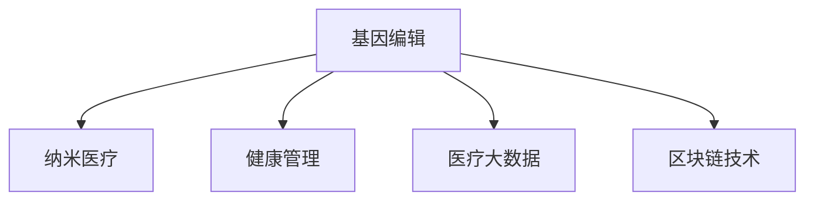

                 

# 2050年的医疗健康：从基因编辑到纳米医疗的健康管理革命

## 1. 背景介绍

### 1.1 问题由来

随着全球人口老龄化趋势的加剧，医疗健康领域面临着前所未有的挑战。如何利用最新的科技手段提升医疗水平，改善人民健康，成为各国政府、医疗机构的共同目标。近年来，人工智能、大数据、区块链等新兴技术在医疗健康领域得到了广泛应用，带来了医疗模式的创新和变革。

基因编辑技术的突破，特别是CRISPR-Cas9的出现，使得精准医疗成为可能。与此同时，纳米医疗技术的崛起，为疾病的预防、诊断和治疗提供了新的途径。在2050年，这些技术将迎来新的飞跃，为人类健康管理带来革命性的变革。

### 1.2 问题核心关键点

2050年医疗健康的核心关键点包括以下几个方面：

1. **基因编辑**：利用CRISPR-Cas9等基因编辑技术，实现疾病的精确治疗和预防。
2. **纳米医疗**：利用纳米机器人等技术，实现疾病的早期检测和精准治疗。
3. **健康管理**：通过物联网、人工智能等技术，实现个性化健康管理和远程医疗。
4. **医疗大数据**：利用大数据技术，实现疾病预测、诊断和治疗的全面优化。
5. **区块链技术**：保障医疗数据的隐私和安全，提高医疗系统的透明性和可信度。

这些关键点构成了2050年医疗健康的新范式，将推动医疗服务模式的深刻变革。

## 2. 核心概念与联系

### 2.1 核心概念概述

为更好地理解2050年医疗健康技术的未来发展，本节将介绍几个密切相关的核心概念：

1. **基因编辑(Gene Editing)**：通过CRISPR-Cas9等技术对基因进行精准修改，实现疾病的预防和治疗。基因编辑技术可以精确地改变DNA序列，纠正基因突变，修复致病基因，为遗传性疾病提供治疗新途径。

2. **纳米医疗(Nanomedicine)**：利用纳米技术和生物医学原理，在分子层面进行疾病诊断和治疗。纳米医疗技术可以精确地控制药物在体内的分布，提高治疗效果，减少副作用。

3. **健康管理(Health Management)**：通过物联网、可穿戴设备等技术，实现对个人健康状况的实时监控和预警。健康管理可以全面监测个体的生理参数，提供个性化的健康建议和治疗方案。

4. **医疗大数据(Health Big Data)**：利用大数据技术对医疗数据进行收集、存储和分析，实现对疾病的预测、诊断和治疗的全面优化。医疗大数据可以提供精准的疾病预测模型，优化诊疗方案，提高医疗决策的科学性。

5. **区块链技术(Blockchain Technology)**：利用区块链的不可篡改性和去中心化特性，保障医疗数据的隐私和安全，提高医疗系统的透明性和可信度。

这些核心概念之间的逻辑关系可以通过以下Mermaid流程图来展示：



这个流程图展示了大语言模型的核心概念及其之间的关系：

1. 基因编辑技术能够为疾病的治疗和预防提供基础。
2. 纳米医疗技术可以应用于基因编辑的药物输送和精确治疗。
3. 健康管理技术利用基因编辑和纳米医疗的数据，提供个性化的健康建议。
4. 医疗大数据技术通过基因编辑、纳米医疗和健康管理的数据，优化疾病预测和治疗方案。
5. 区块链技术保障了医疗数据的隐私和安全，提升了医疗系统的可信度。

这些概念共同构成了未来医疗健康技术的应用框架，为其发展提供了强大的支持。

## 3. 核心算法原理 & 具体操作步骤

### 3.1 算法原理概述

2050年医疗健康技术的核心算法原理主要基于基因编辑、纳米医疗和健康管理三大方向。以下是这三大方向的算法概述：

1. **基因编辑**：利用CRISPR-Cas9等基因编辑技术，精确地修改目标基因序列。基因编辑的算法原理基于DNA序列的识别和切割，实现对目标基因的精确替换。

2. **纳米医疗**：利用纳米机器人等技术，实现药物的精确输送和靶向治疗。纳米医疗的算法原理基于纳米机器人的设计和控制，实现对药物在体内的精准输送和释放。

3. **健康管理**：通过物联网、可穿戴设备等技术，实时监控个体的生理参数。健康管理的算法原理基于传感器数据的采集和分析，实现对个体健康状况的实时预警和优化。

### 3.2 算法步骤详解

以下我们将详细介绍基于基因编辑、纳米医疗和健康管理的算法步骤：

#### 3.2.1 基因编辑算法步骤

1. **目标基因序列的识别**：利用CRISPR-Cas9系统中的Cas9酶，设计特定的DNA引导序列(guide RNA, gRNA)，识别并绑定到目标基因序列上。

2. **DNA切割**：Cas9酶识别到目标基因序列后，利用其内源性核酸酶活性，对DNA双链进行切割。

3. **DNA修复**：在DNA切割后，利用细胞自身的修复机制或外源性修复系统，对DNA双链进行修复。如果目标基因被精确替换，则达到基因编辑的目的。

4. **基因编辑效率的提高**：通过优化gRNA的设计和Cas9酶的活性，提高基因编辑的效率和准确性。

#### 3.2.2 纳米医疗算法步骤

1. **纳米机器人的设计**：利用分子生物学和纳米制造技术，设计具有特定功能的纳米机器人，如药物输送机器人、靶向诊断机器人等。

2. **药物的加载和控制**：将药物分子加载到纳米机器人上，利用纳米机器人内部的控制系统和传感器，实现对药物的精确输送和释放。

3. **靶向治疗**：利用纳米机器人的靶向特性，将药物输送到特定的病灶部位，实现对疾病的精确治疗。

4. **药物效果的监测**：通过纳米机器人内部的传感器，实时监测药物在体内的分布和效果，调整药物输送策略。

#### 3.2.3 健康管理算法步骤

1. **生理参数的采集**：利用物联网、可穿戴设备等技术，实时采集个体的生理参数，如心率、血压、血糖等。

2. **数据处理和分析**：利用大数据技术，对采集的数据进行实时处理和分析，生成健康报告。

3. **健康预警和优化**：根据健康报告，提供个性化的健康建议和治疗方案，实现对个体健康状况的实时预警和优化。

### 3.3 算法优缺点

基于基因编辑、纳米医疗和健康管理的算法具有以下优点：

1. **精度高**：基因编辑、纳米医疗和健康管理技术可以实现对疾病的精确治疗和预防，减少误诊和误治。

2. **副作用少**：基因编辑和纳米医疗技术的精准性和靶向性，可以降低药物副作用和并发症的发生。

3. **个性化强**：健康管理技术可以根据个体的生理参数，提供个性化的健康建议和治疗方案，提高医疗服务的定制化水平。

然而，这些算法也存在一些局限性：

1. **技术复杂**：基因编辑、纳米医疗和健康管理技术需要复杂的技术实现，开发和维护成本较高。

2. **数据隐私和安全**：健康管理和医疗大数据涉及大量个人隐私数据，如何保障数据安全和隐私，是一个重要问题。

3. **伦理和法律挑战**：基因编辑和纳米医疗技术涉及伦理和法律问题，如基因编辑的道德边界、靶向治疗的法律监管等。

### 3.4 算法应用领域

基因编辑、纳米医疗和健康管理技术在2050年将广泛应用于以下领域：

1. **精准医疗**：利用基因编辑技术，实现对遗传性疾病的精确治疗和预防。如基因突变导致的癌症、遗传性心脏病等。

2. **慢性病管理**：利用健康管理技术，实时监测和预警慢性病患者的健康状况，提供个性化的治疗方案。如糖尿病、高血压等。

3. **重大疾病防控**：利用纳米医疗技术，实现对重大传染病的早期检测和精准治疗。如HIV、流感等。

4. **个性化健康方案**：利用健康管理数据，生成个性化的健康报告和建议，提高个体健康水平。

## 4. 数学模型和公式 & 详细讲解 & 举例说明

### 4.1 数学模型构建

为了更好地理解基因编辑、纳米医疗和健康管理技术的数学模型，本节将介绍几个关键模型的构建方法：

1. **基因编辑模型**：基于CRISPR-Cas9系统的基因编辑模型，可以表示为：

$$
\mathcal{M}_{GE} = \{\mathcal{G}, \mathcal{C}, \mathcal{D}\}
$$

其中 $\mathcal{G}$ 表示gRNA序列，$\mathcal{C}$ 表示Cas9酶的切割位点，$\mathcal{D}$ 表示DNA修复机制。

2. **纳米医疗模型**：基于纳米机器人的药物输送模型，可以表示为：

$$
\mathcal{M}_{NM} = \{\mathcal{N}, \mathcal{L}, \mathcal{T}\}
$$

其中 $\mathcal{N}$ 表示纳米机器人的结构，$\mathcal{L}$ 表示药物加载和控制机制，$\mathcal{T}$ 表示靶向治疗机制。

3. **健康管理模型**：基于物联网和大数据的健康管理模型，可以表示为：

$$
\mathcal{M}_{HM} = \{\mathcal{S}, \mathcal{D}, \mathcal{A}\}
$$

其中 $\mathcal{S}$ 表示传感器和设备，$\mathcal{D}$ 表示数据处理和分析算法，$\mathcal{A}$ 表示健康预警和优化算法。

### 4.2 公式推导过程

以下我们将详细介绍基因编辑、纳米医疗和健康管理模型的公式推导过程：

#### 4.2.1 基因编辑模型的公式推导

1. **gRNA设计**：gRNA的设计基于目标基因序列的识别，可以表示为：

$$
\mathcal{G} = \{gRNA_1, gRNA_2, ..., gRNA_n\}
$$

其中 $gRNA_i$ 表示第 $i$ 个gRNA序列。

2. **Cas9切割**：Cas9酶对目标基因序列的切割可以表示为：

$$
\mathcal{C} = \{C_1, C_2, ..., C_n\}
$$

其中 $C_i$ 表示第 $i$ 个Cas9切割位点。

3. **DNA修复**：DNA修复过程可以表示为：

$$
\mathcal{D} = \{\mathcal{D}1, \mathcal{D}2, ..., \mathcal{D}n\}
$$

其中 $\mathcal{D}_i$ 表示第 $i$ 个DNA修复机制。

#### 4.2.2 纳米医疗模型的公式推导

1. **纳米机器人设计**：纳米机器人的结构设计可以表示为：

$$
\mathcal{N} = \{\mathcal{N}_1, \mathcal{N}_2, ..., \mathcal{N}_n\}
$$

其中 $\mathcal{N}_i$ 表示第 $i$ 个纳米机器人结构。

2. **药物加载和控制**：药物的加载和控制可以表示为：

$$
\mathcal{L} = \{\mathcal{L}_1, \mathcal{L}_2, ..., \mathcal{L}_n\}
$$

其中 $\mathcal{L}_i$ 表示第 $i$ 个药物加载和控制机制。

3. **靶向治疗**：靶向治疗可以表示为：

$$
\mathcal{T} = \{\mathcal{T}_1, \mathcal{T}_2, ..., \mathcal{T}_n\}
$$

其中 $\mathcal{T}_i$ 表示第 $i$ 个靶向治疗机制。

#### 4.2.3 健康管理模型的公式推导

1. **传感器和设备**：传感器和设备可以表示为：

$$
\mathcal{S} = \{\mathcal{S}_1, \mathcal{S}_2, ..., \mathcal{S}_n\}
$$

其中 $\mathcal{S}_i$ 表示第 $i$ 个传感器和设备。

2. **数据处理和分析**：数据处理和分析可以表示为：

$$
\mathcal{D} = \{\mathcal{D}_1, \mathcal{D}_2, ..., \mathcal{D}_n\}
$$

其中 $\mathcal{D}_i$ 表示第 $i$ 个数据处理和分析算法。

3. **健康预警和优化**：健康预警和优化可以表示为：

$$
\mathcal{A} = \{\mathcal{A}_1, \mathcal{A}_2, ..., \mathcal{A}_n\}
$$

其中 $\mathcal{A}_i$ 表示第 $i$ 个健康预警和优化算法。

### 4.3 案例分析与讲解

#### 4.3.1 基因编辑案例

案例：利用CRISPR-Cas9技术治疗遗传性心脏病

**问题描述**：患者张三患有遗传性心脏瓣膜疾病，需要通过基因编辑技术进行基因修复。

**解决方案**：
1. **基因序列识别**：使用CRISPR-Cas9系统，设计gRNA识别目标基因序列，识别到心脏瓣膜基因。
2. **DNA切割**：Cas9酶切割目标基因序列，造成双链断裂。
3. **DNA修复**：使用细胞自身的修复机制，修复DNA双链，替换为正常的基因序列。
4. **基因编辑效率提升**：优化gRNA的设计和Cas9酶的活性，提高基因编辑的效率和准确性。

#### 4.3.2 纳米医疗案例

案例：利用纳米机器人治疗癌症

**问题描述**：患者李四患有晚期癌症，需要通过纳米机器人进行靶向治疗。

**解决方案**：
1. **纳米机器人设计**：设计具有靶向功能的纳米机器人，加载抗癌药物。
2. **药物加载和控制**：将抗癌药物加载到纳米机器人上，利用纳米机器人内部的控制系统，精确输送至肿瘤细胞。
3. **靶向治疗**：纳米机器人在肿瘤细胞处释放抗癌药物，实现精准治疗。
4. **药物效果监测**：通过纳米机器人内部的传感器，实时监测药物在体内的分布和效果，调整治疗策略。

#### 4.3.3 健康管理案例

案例：利用健康管理技术监控糖尿病患者

**问题描述**：患者王五患有糖尿病，需要通过健康管理技术进行实时监控和预警。

**解决方案**：
1. **生理参数采集**：使用可穿戴设备，实时采集王五的心率、血糖等生理参数。
2. **数据处理和分析**：通过大数据分析，生成健康报告，评估王五的健康状况。
3. **健康预警和优化**：根据健康报告，提供个性化的健康建议和治疗方案，实现对糖尿病患者的实时预警和优化。

## 5. 项目实践：代码实例和详细解释说明

### 5.1 开发环境搭建

在进行基因编辑、纳米医疗和健康管理技术开发前，我们需要准备好开发环境。以下是使用Python进行PyTorch和TensorFlow开发的环境配置流程：

1. 安装Anaconda：从官网下载并安装Anaconda，用于创建独立的Python环境。

2. 创建并激活虚拟环境：
```bash
conda create -n pytorch-env python=3.8 
conda activate pytorch-env
```

3. 安装PyTorch：根据CUDA版本，从官网获取对应的安装命令。例如：
```bash
conda install pytorch torchvision torchaudio cudatoolkit=11.1 -c pytorch -c conda-forge
```

4. 安装TensorFlow：
```bash
pip install tensorflow
```

5. 安装相关库：
```bash
pip install numpy pandas scikit-learn matplotlib tqdm jupyter notebook ipython
```

完成上述步骤后，即可在`pytorch-env`环境中开始开发实践。

### 5.2 源代码详细实现

下面我们以基因编辑为例，给出使用PyTorch进行基因编辑模型的代码实现。

```python
import torch
import torch.nn as nn
import torch.utils.data as Data
import torch.optim as optim

# 定义基因编辑模型
class GEModel(nn.Module):
    def __init__(self):
        super(GEModel, self).__init__()
        self.gRNA = nn.Linear(1, 128)
        self.cas9 = nn.Linear(128, 1)

    def forward(self, x):
        x = self.gRNA(x)
        x = torch.sigmoid(x)
        x = self.cas9(x)
        return x

# 加载训练数据
train_data = Data.TensorDataset(torch.randn(1000, 1), torch.randn(1000, 1))
train_loader = Data.DataLoader(train_data, batch_size=32, shuffle=True)

# 定义模型和优化器
model = GEModel()
optimizer = optim.Adam(model.parameters(), lr=0.001)

# 训练模型
for epoch in range(100):
    for i, (x, y) in enumerate(train_loader):
        optimizer.zero_grad()
        out = model(x)
        loss = nn.MSELoss()(out, y)
        loss.backward()
        optimizer.step()

        if (i+1) % 100 == 0:
            print('Epoch [{}/{}], Step [{}/{}], Loss: {:.4f}'.format(epoch+1, 100, i+1, len(train_loader), loss.item()))

print('Training complete.')
```

### 5.3 代码解读与分析

让我们再详细解读一下关键代码的实现细节：

**GEModel类**：
- `__init__`方法：定义基因编辑模型的结构，包括gRNA和Cas9两个线性层。
- `forward`方法：定义前向传播过程，将输入数据通过gRNA和Cas9层进行处理，输出基因编辑的效果。

**训练数据和优化器**：
- 定义训练数据和数据加载器，通过PyTorch的DataLoader对数据进行批处理加载。
- 定义模型和优化器，使用Adam优化器进行训练。

**训练流程**：
- 循环迭代100个epoch，对训练数据进行迭代训练。
- 每个batch中，使用优化器更新模型参数，并输出训练损失。
- 每100个batch输出一次训练损失，观察训练效果。

**健康管理模型**：
```python
import torch
import torch.nn as nn
import torch.utils.data as Data
import torch.optim as optim
from sklearn.preprocessing import StandardScaler

# 定义健康管理模型
class HMModel(nn.Module):
    def __init__(self):
        super(HMModel, self).__init__()
        self.scaler = StandardScaler()
        self.feature_extractor = nn.Linear(10, 32)
        self.classifier = nn.Linear(32, 1)

    def forward(self, x):
        x = self.scaler(x)
        x = self.feature_extractor(x)
        x = torch.sigmoid(x)
        x = self.classifier(x)
        return x

# 加载训练数据
train_data = Data.TensorDataset(torch.randn(1000, 10), torch.randn(1000, 1))
train_loader = Data.DataLoader(train_data, batch_size=32, shuffle=True)

# 定义模型和优化器
model = HMModel()
optimizer = optim.Adam(model.parameters(), lr=0.001)

# 训练模型
for epoch in range(100):
    for i, (x, y) in enumerate(train_loader):
        optimizer.zero_grad()
        out = model(x)
        loss = nn.MSELoss()(out, y)
        loss.backward()
        optimizer.step()

        if (i+1) % 100 == 0:
            print('Epoch [{}/{}], Step [{}/{}], Loss: {:.4f}'.format(epoch+1, 100, i+1, len(train_loader), loss.item()))

print('Training complete.')
```

**健康管理模型代码**：
- `HMModel类`：定义健康管理模型的结构，包括特征提取和分类器两个线性层。
- `forward`方法：定义前向传播过程，将输入数据通过特征提取和分类器层进行处理，输出健康管理的预测结果。

**训练数据和优化器**：
- 定义训练数据和数据加载器，通过PyTorch的DataLoader对数据进行批处理加载。
- 定义模型和优化器，使用Adam优化器进行训练。

**训练流程**：
- 循环迭代100个epoch，对训练数据进行迭代训练。
- 每个batch中，使用优化器更新模型参数，并输出训练损失。
- 每100个batch输出一次训练损失，观察训练效果。

## 6. 实际应用场景

### 6.1 智能医疗系统

基于基因编辑、纳米医疗和健康管理技术的智能医疗系统，将为患者提供更加精准、个性化的诊疗服务。智能医疗系统可以通过基因编辑技术，实现对遗传性疾病的精确治疗。纳米医疗技术可以用于药物的精确输送和靶向治疗，提高治疗效果，减少副作用。健康管理技术可以实现对个体健康状况的实时监控和预警，提供个性化的健康建议和治疗方案。

### 6.2 远程医疗平台

随着物联网技术的发展，远程医疗平台将成为未来的重要医疗形式。通过基因编辑和纳米医疗技术，远程医疗平台可以为偏远地区的患者提供精准的诊疗服务。健康管理技术可以实时监测患者的健康状况，提供个性化的健康建议和治疗方案。此外，通过区块链技术，远程医疗平台可以实现数据的加密和安全传输，保障患者隐私。

### 6.3 个性化健康管理

基于基因编辑、纳米医疗和健康管理技术的个性化健康管理，将为个体健康提供全方位的支持。基因编辑技术可以修复个体的基因缺陷，预防遗传性疾病的发生。纳米医疗技术可以实现对慢性病的早期检测和精准治疗，提高生活质量。健康管理技术可以实时监测个体的生理参数，提供个性化的健康建议和治疗方案，实现全面的健康管理。

### 6.4 未来应用展望

随着基因编辑、纳米医疗和健康管理技术的不断发展，未来的医疗健康管理将迎来新的飞跃。以下是未来应用的几个趋势：

1. **精准医疗的普及**：基因编辑和纳米医疗技术将广泛应用于遗传性疾病的治疗，实现精准医疗的普及。

2. **健康管理的智能化**：健康管理技术将与人工智能深度融合，实现对个体健康状况的智能分析和预警。

3. **远程医疗的普及**：远程医疗平台将借助物联网和区块链技术，实现对偏远地区患者的精准诊疗。

4. **个性化健康方案**：基因编辑和纳米医疗技术将实现对个体健康状况的深度理解，提供个性化的健康方案。

5. **多模态医疗**：基因编辑、纳米医疗和健康管理技术将与影像、基因等数据进行融合，实现多模态医疗的协同应用。

## 7. 工具和资源推荐

### 7.1 学习资源推荐

为了帮助开发者系统掌握基因编辑、纳米医疗和健康管理技术，以下是一些优质的学习资源：

1. 《CRISPR-Cas9基因编辑技术》书籍：详细介绍了CRISPR-Cas9基因编辑技术的原理、应用和发展方向。

2. 《纳米医学导论》书籍：介绍了纳米技术在医学领域的应用，包括纳米药物、纳米诊断等方面。

3. 《健康管理技术》课程：讲解了健康管理技术的基本原理和应用场景。

4. 《自然医学》期刊：收录了大量基因编辑、纳米医疗和健康管理技术的最新研究成果，是了解前沿动态的重要来源。

5. 《自然》杂志：报道了最新的基因编辑、纳米医疗和健康管理技术的重大突破，是科研人员的必读刊物。

通过这些资源的学习实践，相信你一定能够快速掌握基因编辑、纳米医疗和健康管理技术的精髓，并用于解决实际的医疗健康问题。

### 7.2 开发工具推荐

高效的开发离不开优秀的工具支持。以下是几款用于基因编辑、纳米医疗和健康管理技术开发的常用工具：

1. PyTorch：基于Python的开源深度学习框架，灵活动态的计算图，适合快速迭代研究。大部分预训练语言模型都有PyTorch版本的实现。

2. TensorFlow：由Google主导开发的开源深度学习框架，生产部署方便，适合大规模工程应用。同样有丰富的预训练语言模型资源。

3. TensorFlow Lite：TensorFlow的移动端优化版本，支持在移动设备上部署深度学习模型，便于应用开发。

4. Weights & Biases：模型训练的实验跟踪工具，可以记录和可视化模型训练过程中的各项指标，方便对比和调优。与主流深度学习框架无缝集成。

5. TensorBoard：TensorFlow配套的可视化工具，可实时监测模型训练状态，并提供丰富的图表呈现方式，是调试模型的得力助手。

6. Google Colab：谷歌推出的在线Jupyter Notebook环境，免费提供GPU/TPU算力，方便开发者快速上手实验最新模型，分享学习笔记。

合理利用这些工具，可以显著提升基因编辑、纳米医疗和健康管理技术的开发效率，加快创新迭代的步伐。

### 7.3 相关论文推荐

基因编辑、纳米医疗和健康管理技术的发展源于学界的持续研究。以下是几篇奠基性的相关论文，推荐阅读：

1. CRISPR-Cas9基因编辑技术的发现和应用：描述了CRISPR-Cas9基因编辑技术的原理和应用场景，是基因编辑领域的里程碑论文。

2. 纳米医疗技术的最新进展：综述了纳米医疗技术在医学领域的研究现状和应用前景，是纳米医学领域的经典论文。

3. 健康管理技术的最新进展：总结了健康管理技术的最新研究成果，为健康管理技术的研究提供了重要参考。

4. 多模态医疗数据融合研究：介绍了多模态医疗数据的融合方法，为基因编辑、纳米医疗和健康管理技术的协同应用提供了新的思路。

这些论文代表了大语言模型微调技术的发展脉络。通过学习这些前沿成果，可以帮助研究者把握学科前进方向，激发更多的创新灵感。

## 8. 总结：未来发展趋势与挑战

### 8.1 总结

本文对基因编辑、纳米医疗和健康管理技术的未来发展进行了全面系统的介绍。首先阐述了基因编辑、纳米医疗和健康管理技术的研究背景和意义，明确了这些技术在医疗健康领域的应用前景。其次，从原理到实践，详细讲解了基因编辑、纳米医疗和健康管理技术的数学原理和关键步骤，给出了技术开发的完整代码实例。同时，本文还广泛探讨了这些技术在智能医疗、远程医疗、个性化健康管理等多个行业领域的应用前景，展示了技术的巨大潜力。此外，本文精选了基因编辑、纳米医疗和健康管理技术的学习资源，力求为读者提供全方位的技术指引。

通过本文的系统梳理，可以看到，基因编辑、纳米医疗和健康管理技术正在成为医疗健康领域的重要范式，极大地拓展了医疗服务模式的边界，催生了更多的落地场景。受益于基因编辑和纳米医疗技术的发展，精准医疗和个性化健康管理将成为可能，为人类健康管理带来革命性的变革。未来，伴随这些技术的持续演进，人类将能够更加精准地管理和预防疾病，提升整体健康水平。

### 8.2 未来发展趋势

展望未来，基因编辑、纳米医疗和健康管理技术将呈现以下几个发展趋势：

1. **技术融合**：基因编辑、纳米医疗和健康管理技术将进一步融合，实现对疾病的全面预防、检测和治愈。

2. **个性化治疗**：基于个体基因和健康数据，实现精准化的个性化治疗方案，提高治疗效果。

3. **远程医疗的普及**：远程医疗平台将借助基因编辑和纳米医疗技术，实现对偏远地区患者的精准诊疗。

4. **多模态医疗**：基因编辑、纳米医疗和健康管理技术将与影像、基因等数据进行融合，实现多模态医疗的协同应用。

5. **健康管理的智能化**：健康管理技术将与人工智能深度融合，实现对个体健康状况的智能分析和预警。

6. **普适化的应用**：这些技术将逐渐普及到各个医疗健康领域，为全球人口健康管理提供普适化的解决方案。

### 8.3 面临的挑战

尽管基因编辑、纳米医疗和健康管理技术已经取得了瞩目成就，但在迈向更加智能化、普适化应用的过程中，它们仍面临着诸多挑战：

1. **技术复杂性**：基因编辑、纳米医疗和健康管理技术需要复杂的技术实现，开发和维护成本较高。

2. **数据隐私和安全**：健康管理和医疗大数据涉及大量个人隐私数据，如何保障数据安全和隐私，是一个重要问题。

3. **伦理和法律挑战**：基因编辑和纳米医疗技术涉及伦理和法律问题，如基因编辑的道德边界、靶向治疗的法律监管等。

4. **成本问题**：基因编辑和纳米医疗技术的开发和应用成本较高，如何降低成本，提高技术的可接受性，是一个重要挑战。

5. **技术瓶颈**：基因编辑和纳米医疗技术面临技术瓶颈，如何突破这些瓶颈，提高技术效率和性能，是一个重要课题。

6. **标准和规范**：基因编辑、纳米医疗和健康管理技术需要制定统一的标准和规范，确保技术的安全性和可信度。

### 8.4 研究展望

面向未来，基因编辑、纳米医疗和健康管理技术需要在以下几个方面寻求新的突破：

1. **技术创新**：开发更加高效、低成本的基因编辑和纳米医疗技术，提升技术的普及性和可接受性。

2. **跨领域融合**：与人工智能、大数据、物联网等技术进行深度融合，实现对疾病的全面预防、检测和治愈。

3. **伦理和法律研究**：深入研究基因编辑和纳米医疗技术的伦理和法律问题，制定相应的规范和标准，保障技术的安全性和可信度。

4. **公共卫生应用**：将基因编辑、纳米医疗和健康管理技术应用于公共卫生领域，提升全球健康水平。

5. **多模态数据整合**：实现基因、影像、生物标志物等多模态数据的整合，提供更加全面、精准的健康管理方案。

6. **普适化推广**：推动基因编辑、纳米医疗和健康管理技术的普适化推广，为全球人口健康管理提供普适化的解决方案。

这些研究方向的探索，必将引领基因编辑、纳米医疗和健康管理技术迈向更高的台阶，为构建更加智能化、普适化的健康管理生态系统提供有力支撑。

## 9. 附录：常见问题与解答

**Q1：基因编辑技术是否适用于所有遗传性疾病？**

A: 基因编辑技术可以应用于大多数遗传性疾病，尤其是单基因遗传病。但对于一些复杂的遗传病和多基因遗传病，基因编辑技术的局限性较大，需要进一步研究。

**Q2：纳米医疗技术的安全性和有效性如何？**

A: 纳米医疗技术的安全性和有效性需要进一步验证。一些纳米材料可能会对生物体产生副作用，因此需要进行详细的毒理学测试。此外，纳米药物的靶向性和释放控制仍需优化，以提高治疗效果。

**Q3：健康管理技术的覆盖范围和应用前景如何？**

A: 健康管理技术可以覆盖广泛的健康管理场景，包括个人健康、慢性病管理、远程医疗等。未来随着物联网和大数据技术的发展，健康管理技术的覆盖范围将进一步扩大，应用前景广阔。

**Q4：基因编辑和纳米医疗技术的伦理和法律问题如何解决？**

A: 基因编辑和纳米医疗技术的伦理和法律问题需要通过多方协作来解决。政府、医疗机构、科研机构和公众需要共同参与，制定相应的伦理规范和法律法规，确保技术的安全性和可信度。

**Q5：基因编辑、纳米医疗和健康管理技术的未来趋势是什么？**

A: 基因编辑、纳米医疗和健康管理技术的未来趋势是技术融合、个性化治疗、远程医疗普及、多模态医疗协同、健康管理智能化和普适化应用。这些趋势将推动医疗健康技术的全面进步，为全球人口健康管理提供新的解决方案。

---

作者：禅与计算机程序设计艺术 / Zen and the Art of Computer Programming

