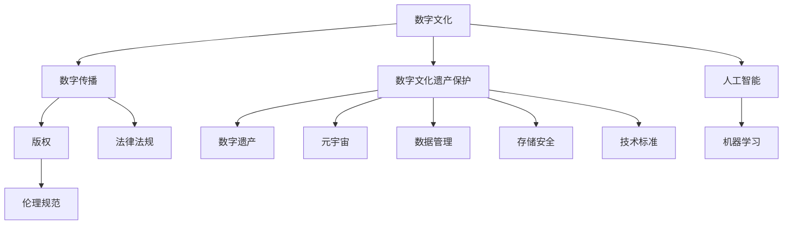

                 

# 2050年的数字文化：从传播到传承的文化遗产保护

> 关键词：数字文化, 文化遗产保护, 数字传播, 数字遗产, 元宇宙, 人工智能, 机器学习

## 1. 背景介绍

### 1.1 问题由来

随着信息技术的飞速发展，数字文化已经成为当代社会的重要组成部分。它不仅改变了人们的生活方式，还为文化遗产的保护与传承开辟了新的路径。然而，数字文化的快速传播也带来了诸多挑战，如版权问题、数字化保存、数字遗产的继承和利用等。如何在2050年建立一个更加安全、可持续的数字文化生态系统，成为我们亟需探讨的重要课题。

### 1.2 问题核心关键点

数字文化的传承涉及多个关键问题，主要包括：

- 数字传播的规范与标准：确保数字内容的传播符合伦理规范和法律法规。
- 数字文化遗产的保护：采用先进技术手段对文化遗产进行数字化保存，防止信息丢失。
- 数字遗产的继承与利用：设计有效的机制，确保数字遗产能够被后人所继承和利用。
- 数字生态系统的建设：建立包括数据采集、存储、管理和分享的数字生态系统。
- 人工智能与机器学习的应用：利用AI技术提高数字文化遗产的保护与利用效率。

### 1.3 问题研究意义

探讨数字文化的传播与传承，对于推动文化创新、保护文化遗产、促进社会和谐具有重要意义。它不仅有助于提升公众对文化遗产的认识和兴趣，还能为文化遗产的保护提供新的思路和技术手段，为后代的可持续发展奠定基础。

## 2. 核心概念与联系

### 2.1 核心概念概述

为了更深入地理解数字文化遗产的保护与传承，我们需要了解以下几个核心概念：

- **数字文化**：指通过数字手段创造、传播、保存和利用文化内容的过程，包括数字内容创作、数字传播、数字文化遗产保护等。
- **数字文化遗产**：指经过数字化处理的文化遗产，包括但不限于文本、图片、音频、视频、游戏、虚拟现实（VR）和增强现实（AR）等。
- **数字传播**：通过网络、移动设备、社交媒体等数字平台传播文化内容的过程。
- **数字遗产**：指文化遗产在数字化的过程中产生的所有数据和信息，包括元数据、版权信息等。
- **元宇宙**：一个通过虚拟现实、增强现实、区块链等技术构建的虚拟世界，可以用于文化遗产的保存和传播。
- **人工智能与机器学习**：利用AI技术对数字文化遗产进行自动化处理，如自动化标注、分类、检索等。

这些概念相互关联，共同构成了数字文化遗产保护与传承的基础。

### 2.2 核心概念原理和架构的 Mermaid 流程图



这个流程图展示了数字文化保护与传承的关键流程和概念关系：

1. **数字文化**是整个系统的起点，涉及内容的创作与传播。
2. **数字传播**通过各种数字平台，将文化内容广泛传播。
3. **数字文化遗产保护**是对数字文化遗产的数字化保存和长期保护。
4. **数字遗产**是指数字化过程中产生的数据和信息。
5. **元宇宙**为数字文化遗产提供了新的保存与传播方式。
6. **人工智能与机器学习**为数字文化遗产的自动化处理提供了技术支持。
7. **版权、伦理规范、法律法规**确保数字传播的合法性与合规性。
8. **数据管理、存储安全、技术标准**为数字文化遗产的保护提供了保障。

这些概念和流程相互交织，形成了数字文化遗产保护与传承的完整框架。

## 3. 核心算法原理 & 具体操作步骤

### 3.1 算法原理概述

数字文化遗产的保护与传承主要涉及以下几个算法原理：

- **数据采集与标注**：对文化遗产进行数字化处理，并添加元数据和版权信息。
- **数字存储与保护**：使用先进的加密和备份技术，确保数字化信息的长期保存。
- **数据检索与分享**：利用AI技术对大量数字化信息进行分类、标注和检索，提高数据检索效率。
- **数字化传播**：通过数字平台如网站、移动应用、社交媒体等，广泛传播数字化内容。
- **人工智能与机器学习**：利用AI技术对文化遗产进行自动化处理，如文本分析、图像识别等。

### 3.2 算法步骤详解

1. **数据采集与标注**：
   - 收集各种文化遗产的数字化文件，如文本、图片、音频、视频等。
   - 添加元数据，包括来源、创作时间、作者、版权信息等。
   - 使用机器学习算法对数据进行自动化标注，如自动分类、命名实体识别等。

2. **数字存储与保护**：
   - 采用先进的加密技术，对数字化信息进行保护，防止信息泄露和篡改。
   - 使用分布式存储技术，确保数据的长期保存和备份。
   - 定期进行数据备份，防止数据丢失。

3. **数据检索与分享**：
   - 使用文本检索、图像识别、语音识别等技术，对大量数字化信息进行分类和标注。
   - 构建搜索接口，方便用户快速检索所需信息。
   - 设计数据分享机制，确保用户可以合法共享数字化信息。

4. **数字化传播**：
   - 通过网站、移动应用、社交媒体等平台，广泛传播数字化内容。
   - 设计友好的用户界面，使用户可以轻松访问和分享数字化信息。
   - 确保数字化传播符合版权和法律法规要求。

5. **人工智能与机器学习**：
   - 利用AI技术对文化遗产进行自动化处理，如文本分析、图像识别等。
   - 使用深度学习算法对文化遗产进行分类和标注。
   - 设计推荐算法，提高用户对数字化内容的兴趣。

### 3.3 算法优缺点

数字文化遗产保护与传承的算法有以下优缺点：

- **优点**：
  - 提高了文化遗产的保存与传播效率。
  - 确保了数字化信息的长期保存和备份。
  - 增强了数字化信息的检索和共享能力。
  - 利用AI技术提高了数字化处理的自动化程度。

- **缺点**：
  - 数据采集和标注需要大量人力和时间。
  - 数据存储和保护需要高昂的成本。
  - 数字化传播可能面临版权和法律法规的限制。
  - 人工智能算法的准确性和偏见问题需要解决。

### 3.4 算法应用领域

数字文化遗产保护与传承的算法广泛应用于以下几个领域：

- **博物馆与图书馆**：用于数字化保存和传播文化遗产。
- **文化机构**：如档案馆、艺术馆等，利用数字技术保护文化遗产。
- **教育机构**：用于在线教育和数字化教材的开发。
- **文化遗产保护组织**：如UNESCO等，推动全球文化遗产的保护工作。
- **数字娱乐**：如虚拟现实、增强现实等，用于文化遗产的展示和传播。

## 4. 数学模型和公式 & 详细讲解 & 举例说明

### 4.1 数学模型构建

构建数字文化遗产保护与传承的数学模型，需要考虑以下几个关键要素：

- **元数据建模**：定义元数据的类型和结构，如作者、创作时间、版权信息等。
- **数据标注模型**：设计自动化的标注算法，如文本分类、命名实体识别等。
- **数据存储模型**：使用分布式存储技术，确保数据的长期保存和备份。
- **数据检索模型**：设计高效的检索算法，提高检索效率。
- **人工智能模型**：设计自动化处理算法，如文本分析、图像识别等。

### 4.2 公式推导过程

以文本分类模型为例，其基本框架如下：

1. **输入特征**：将文本转换为向量表示。
   $$
   \mathbf{x} = \text{Embedding}(\text{Text})
   $$

2. **模型参数**：使用深度神经网络作为分类器。
   $$
   \mathbf{h} = \text{DNN}(\mathbf{x})
   $$

3. **损失函数**：使用交叉熵损失函数计算模型的预测误差。
   $$
   L = -\sum_{i=1}^N y_i \log \hat{y}_i
   $$

4. **优化算法**：使用梯度下降等优化算法更新模型参数。
   $$
   \theta \leftarrow \theta - \eta \nabla_{\theta}L
   $$

5. **评估指标**：使用准确率、召回率、F1值等评估模型的分类效果。

### 4.3 案例分析与讲解

假设我们要对一组历史文献进行数字化分类，首先需要将文本转换为向量表示。然后使用深度神经网络进行分类，并计算交叉熵损失。最后使用梯度下降算法优化模型参数。整个过程可以使用Python和TensorFlow等工具实现。

## 5. 项目实践：代码实例和详细解释说明

### 5.1 开发环境搭建

搭建数字文化遗产保护与传承的开发环境，需要以下步骤：

1. **安装Python**：安装最新版本的Python，并配置环境变量。
2. **安装TensorFlow**：通过pip安装TensorFlow，用于构建深度学习模型。
3. **安装PyTorch**：通过pip安装PyTorch，用于构建深度学习模型。
4. **安装scikit-learn**：通过pip安装scikit-learn，用于数据预处理和模型评估。
5. **安装Pandas**：通过pip安装Pandas，用于数据处理和分析。
6. **安装Numpy**：通过pip安装Numpy，用于数学计算和数据处理。

### 5.2 源代码详细实现

以下是使用TensorFlow实现文本分类的示例代码：

```python
import tensorflow as tf
from tensorflow.keras.preprocessing.text import Tokenizer
from tensorflow.keras.preprocessing.sequence import pad_sequences
from tensorflow.keras.layers import Embedding, LSTM, Dense
from tensorflow.keras.models import Sequential

# 加载数据
texts = ["This is the first document.", "This is the second document."]
labels = [0, 1]

# 分词与向量化
tokenizer = Tokenizer()
tokenizer.fit_on_texts(texts)
sequences = tokenizer.texts_to_sequences(texts)
word_index = tokenizer.word_index
max_length = 10
padded_sequences = pad_sequences(sequences, maxlen=max_length)

# 构建模型
model = Sequential([
    Embedding(len(word_index) + 1, 8, input_length=max_length),
    LSTM(32),
    Dense(1, activation='sigmoid')
])
model.compile(loss='binary_crossentropy', optimizer='adam', metrics=['accuracy'])

# 训练模型
model.fit(padded_sequences, labels, epochs=10, verbose=1)

# 评估模型
test_text = ["This is a test document."]
test_sequence = tokenizer.texts_to_sequences(test_text)
padded_test_sequence = pad_sequences(test_sequence, maxlen=max_length)
test_label = model.predict(padded_test_sequence)
```

### 5.3 代码解读与分析

以上代码实现了文本分类的完整过程，包括数据预处理、模型构建、训练和评估。其中，`Tokenizer`用于分词和向量化，`pad_sequences`用于序列填充，`Sequential`用于模型构建，`compile`用于模型编译，`fit`用于模型训练，`predict`用于模型评估。

## 6. 实际应用场景

### 6.1 数字博物馆

数字博物馆利用数字技术保存和传播文化遗产，使用户可以远程访问和体验文化遗产。通过数字博物馆，用户可以参观虚拟博物馆、观看历史文物的高清图像和视频、聆听历史音频等。

### 6.2 数字档案馆

数字档案馆通过数字化技术保存和共享历史档案，提供高质量的数字资源供研究人员和公众使用。数字档案馆可以包含各种类型的文档、照片、地图、文献等，用户可以通过搜索和筛选功能获取所需信息。

### 6.3 数字图书馆

数字图书馆通过数字化技术保存和共享图书资源，提供丰富的在线阅读和学习资源。数字图书馆可以包含各种类型的图书、期刊、论文等，用户可以通过搜索和筛选功能获取所需内容。

### 6.4 未来应用展望

未来的数字文化遗产保护与传承将更加智能和高效。随着人工智能技术的发展，数字文化遗产的保存、检索和传播将变得更加自动化和智能化。元宇宙的兴起也将为数字文化遗产的保护与传承提供新的平台和方式。

## 7. 工具和资源推荐

### 7.1 学习资源推荐

1. **Coursera**：提供各类数据科学和人工智能课程，包括机器学习、深度学习、自然语言处理等。
2. **edX**：提供各类计算机科学和数据科学课程，包括数据采集、数据处理、机器学习等。
3. **Udacity**：提供各类编程和数据科学课程，包括Python、TensorFlow、PyTorch等。
4. **Kaggle**：提供各类数据科学竞赛和数据集，适合实践和竞赛学习。

### 7.2 开发工具推荐

1. **Jupyter Notebook**：用于编写和运行Python代码，支持多种编程语言和数据处理工具。
2. **Google Colab**：提供免费的GPU资源，适合快速实验和学习。
3. **TensorFlow**：用于构建和训练深度学习模型，支持分布式计算和模型部署。
4. **PyTorch**：用于构建和训练深度学习模型，支持动态图和静态图。
5. **Pandas**：用于数据处理和分析，支持多种数据格式和数据操作。

### 7.3 相关论文推荐

1. **《数字文化遗产保护与传承》**：探讨数字文化遗产保护与传承的理论和实践。
2. **《元宇宙与文化遗产保护》**：讨论元宇宙技术在文化遗产保护中的应用。
3. **《数字文化遗产的自动化处理》**：介绍AI技术在文化遗产保护中的作用。

## 8. 总结：未来发展趋势与挑战

### 8.1 研究成果总结

本文从数字文化的传播与传承入手，探讨了数字文化遗产保护与传承的关键概念和算法原理。通过数学模型和案例分析，展示了数字文化遗产保护与传承的实践应用。本文还推荐了相关的学习资源和开发工具，为读者提供了全面的技术指引。

### 8.2 未来发展趋势

未来的数字文化遗产保护与传承将呈现以下趋势：

1. **元宇宙的普及**：元宇宙为数字文化遗产提供了新的保存与传播方式，未来将更加普及。
2. **人工智能的深化**：AI技术将进一步应用于数字文化遗产的保护与利用，提高处理效率和精度。
3. **区块链的应用**：区块链技术将用于数字文化遗产的版权保护和数据安全，确保数据的可靠性和完整性。
4. **跨界融合**：数字文化遗产将与游戏、虚拟现实、增强现实等领域融合，形成更丰富的应用场景。
5. **全球合作**：国际合作将促进数字文化遗产的共享与交流，推动全球文化遗产的保护与传承。

### 8.3 面临的挑战

数字文化遗产保护与传承面临以下挑战：

1. **数据隐私和安全**：数字文化遗产的传播和保护需要严格的数据隐私和安全措施。
2. **版权和法律法规**：数字文化遗产的传播需要遵守版权和法律法规，确保合法合规。
3. **技术和资源限制**：数字文化遗产的保护和传播需要大量技术和资源投入。
4. **数字遗产的长期保存**：数字遗产的长期保存需要先进的存储和备份技术。
5. **用户参与度**：提高用户参与度是数字文化遗产传播的关键。

### 8.4 研究展望

未来的数字文化遗产保护与传承需要在以下方面进行深入研究：

1. **数字文化遗产的标准化**：制定数字文化遗产的标准和规范，确保数据的一致性和可互操作性。
2. **元宇宙的扩展应用**：探索元宇宙技术在文化遗产保护中的新应用场景。
3. **AI技术的深入应用**：研究如何进一步利用AI技术提高数字文化遗产的处理效率和精度。
4. **跨界合作与交流**：加强与游戏、虚拟现实、增强现实等领域的合作，推动数字文化遗产的融合发展。
5. **技术和资源的创新**：开发更先进的存储和备份技术，降低技术和资源的限制。

## 9. 附录：常见问题与解答

**Q1：数字文化遗产的保护与传承需要哪些技术和资源？**

A: 数字文化遗产的保护与传承需要以下技术和资源：

1. **数据采集与标注**：需要高效的数据采集和标注工具，如机器学习算法、自动化标注工具等。
2. **数字存储与保护**：需要先进的加密和备份技术，如分布式存储、数据加密等。
3. **数据检索与分享**：需要高效的数据检索和分享工具，如搜索引擎、数据分享平台等。
4. **数字化传播**：需要高性能的计算平台和网络基础设施，如服务器、带宽等。
5. **人工智能与机器学习**：需要先进的AI技术和算法，如深度学习、自然语言处理等。

**Q2：数字文化遗产的保护与传承面临哪些挑战？**

A: 数字文化遗产的保护与传承面临以下挑战：

1. **数据隐私和安全**：数字文化遗产的传播和保护需要严格的数据隐私和安全措施。
2. **版权和法律法规**：数字文化遗产的传播需要遵守版权和法律法规，确保合法合规。
3. **技术和资源限制**：数字文化遗产的保护和传播需要大量技术和资源投入。
4. **数字遗产的长期保存**：数字遗产的长期保存需要先进的存储和备份技术。
5. **用户参与度**：提高用户参与度是数字文化遗产传播的关键。

**Q3：如何利用元宇宙技术保护和传承数字文化遗产？**

A: 利用元宇宙技术保护和传承数字文化遗产，可以通过以下方式：

1. **虚拟博物馆**：构建虚拟博物馆，让用户可以远程访问和体验文化遗产。
2. **虚拟展览**：通过虚拟展览展示历史文物、文献、音频等数字化资源。
3. **虚拟互动**：用户可以通过虚拟现实、增强现实等技术，与虚拟文化遗产互动。
4. **虚拟保存**：使用区块链技术确保虚拟文化遗产的版权和数据安全。
5. **虚拟合作**：通过元宇宙平台，促进全球文化遗产的共享与交流。

**Q4：如何提高数字文化遗产的保护与利用效率？**

A: 提高数字文化遗产的保护与利用效率，可以通过以下方式：

1. **自动化处理**：利用AI技术对数字文化遗产进行自动化处理，如文本分析、图像识别等。
2. **智能检索**：设计高效的检索算法，提高检索效率。
3. **用户参与**：设计友好的用户界面，使用户可以轻松访问和分享数字化信息。
4. **数据标准化**：制定数字文化遗产的标准和规范，确保数据的一致性和可互操作性。
5. **跨界合作**：加强与游戏、虚拟现实、增强现实等领域的合作，推动数字文化遗产的融合发展。

---

作者：禅与计算机程序设计艺术 / Zen and the Art of Computer Programming

