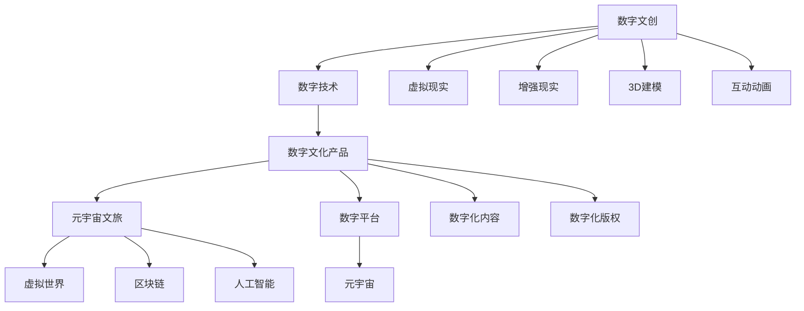

                 

# 2050年的数字文化：从数字文创到元宇宙文旅的数字文化产业升级

> 关键词：数字文创,元宇宙文旅,数字文化产业,未来展望,技术升级

## 1. 背景介绍

### 1.1 问题由来

进入21世纪以来，数字技术的迅猛发展深刻改变了人们的生活方式、工作方式以及文化娱乐方式。随着5G、物联网、人工智能、区块链等前沿技术的不断成熟，数字文化产业正处于前所未有的变革期。尤其在2050年，我们有望迎来数字文化的全新时代，其中数字文创和元宇宙文旅将成为最具颠覆性的两大领域。

### 1.2 问题核心关键点

当前，数字文化产业面临着技术瓶颈、内容匮乏、用户体验不足等挑战，亟需技术升级。而数字文创和元宇宙文旅的崛起，将极大地推动数字文化产业的发展，为人们带来全新的文化体验和娱乐方式。

数字文创，即数字化的文化艺术创作，通过虚拟现实(VR)、增强现实(AR)、3D建模、互动动画等技术手段，将传统文化、现代艺术与数字科技深度融合，打造出具有高度互动性和沉浸感的数字文化产品。

元宇宙文旅，是利用虚拟现实、区块链、人工智能等技术构建的数字虚拟世界，让人们在虚拟空间中自由探索、互动和体验，提供一种全新的旅游方式。

数字文创和元宇宙文旅的出现，不仅满足了人们对传统文化和现代艺术的追求，还大大提升了文化产品的互动性和沉浸感，使得文化体验更加丰富和多样化。

### 1.3 问题研究意义

研究2050年数字文创和元宇宙文旅的发展，对推动数字文化产业的全面升级具有重要意义：

1. **技术创新：**推动虚拟现实、增强现实、人工智能、区块链等前沿技术的融合与创新，为数字文化产业注入新的活力。
2. **内容丰富：**借助数字技术，创作出更多富有创意和创新性的文化艺术作品，满足人们多样化的文化需求。
3. **用户体验提升：**通过互动性、沉浸感和个性化体验，提升文化产品的吸引力，吸引更多年轻用户。
4. **产业转型：**推动传统媒体、文化企业向数字化转型，打造新型数字文化产业生态。
5. **文化交流：**促进全球文化交流和融合，推动各国文化的共同发展。

## 2. 核心概念与联系

### 2.1 核心概念概述

为更好地理解2050年数字文创和元宇宙文旅的发展，本节将介绍几个密切相关的核心概念：

- **数字文创（Digital Culture Creation）**：通过虚拟现实、增强现实、3D建模等技术，将传统文化、现代艺术与数字科技深度融合，创造出具有高度互动性和沉浸感的数字文化产品。
- **元宇宙文旅（Metaverse Tourism）**：利用虚拟现实、区块链、人工智能等技术构建的数字虚拟世界，让人们在虚拟空间中自由探索、互动和体验，提供一种全新的旅游方式。
- **数字文化产业（Digital Culture Industry）**：融合文化创意和数字技术的产业形态，包括数字文创、游戏、动画、影视、出版、网络媒体、虚拟现实、增强现实等。
- **元宇宙（Metaverse）**：由多个数字虚拟世界通过区块链技术连接而成的虚拟空间，包含虚拟现实、增强现实、人工智能等技术，提供沉浸式、互动式和高度逼真的体验。

这些核心概念之间的逻辑关系可以通过以下Mermaid流程图来展示：



这个流程图展示了几大核心概念及其之间的关系：

1. 数字文创通过融合数字技术，创造出具有高度互动性和沉浸感的数字文化产品。
2. 数字文创和元宇宙文旅均基于虚拟现实、增强现实、3D建模等技术，提供沉浸式体验。
3. 数字文化产业涵盖了数字文创、游戏、动画、影视等多元形式，是数字技术与文化创意的融合。
4. 元宇宙是通过区块链和人工智能技术连接多个虚拟世界的数字空间。
5. 数字平台和数字化内容是数字文化产品的载体。
6. 数字化版权是数字文化产品的重要组成部分。
7. 元宇宙与数字文创、元宇宙文旅相辅相成，共同推动数字文化产业的发展。

这些概念共同构成了2050年数字文化产业的基础框架，为其全面升级奠定了坚实的基础。

## 3. 核心算法原理 & 具体操作步骤

### 3.1 算法原理概述

2050年数字文创和元宇宙文旅的发展，核心在于技术的融合与创新。其算法原理主要包括以下几个方面：

- **虚拟现实（VR）**：通过头戴式设备、手势识别、空间定位等技术，构建高度沉浸的虚拟环境。
- **增强现实（AR）**：将数字信息叠加在现实世界中，实现交互式和沉浸式的体验。
- **3D建模**：利用计算机图形技术，生成逼真的三维数字模型，提供丰富的视觉体验。
- **互动动画**：通过实时渲染和动态交互，创建高度逼真和互动的数字场景和角色。
- **区块链**：提供去中心化的数据管理和用户身份验证，保障数字文创和元宇宙文旅的版权和安全性。
- **人工智能**：利用自然语言处理、计算机视觉等技术，提升用户体验和互动性。

### 3.2 算法步骤详解

基于上述技术原理，2050年的数字文创和元宇宙文旅发展主要包括以下几个关键步骤：

**Step 1: 技术选型与集成**
- 根据项目需求，选择合适的虚拟现实、增强现实、3D建模、互动动画等技术，进行集成开发。
- 引入区块链和人工智能技术，构建安全、可靠的数字平台和应用系统。

**Step 2: 内容创作与整合**
- 在数字平台上，创作数字文创作品，如虚拟现实游戏、增强现实展览、3D动画短片等。
- 将传统文化艺术与数字技术深度融合，创作具有高度互动性和沉浸感的文化产品。
- 引入全球文化艺术资源，丰富数字文创内容。

**Step 3: 用户体验优化**
- 通过用户反馈，不断优化数字文创和元宇宙文旅的交互设计、渲染质量、加载速度等。
- 设计个性化的用户体验，满足不同用户的需求和偏好。
- 通过AI技术，实现智能推荐和个性化推荐，提升用户黏性。

**Step 4: 平台推广与运营**
- 通过社交媒体、网络广告等渠道推广数字文创和元宇宙文旅产品。
- 建立数字文创和元宇宙文旅的虚拟社区，促进用户互动和交流。
- 通过区块链技术，保障用户数字资产和作品版权。

**Step 5: 持续迭代与创新**
- 根据用户反馈和市场需求，持续优化和迭代数字文创和元宇宙文旅产品。
- 引入最新技术，如脑机接口、量子计算等，提升用户体验和内容表现力。
- 积极参与全球文化交流和合作，推动数字文化产业的共同发展。

### 3.3 算法优缺点

数字文创和元宇宙文旅的发展，具有以下优点：

1. **沉浸式体验：**通过虚拟现实、增强现实等技术，提供高度沉浸和互动的体验，满足用户对高质量文化体验的需求。
2. **跨地域传播：**数字文创和元宇宙文旅产品不受地域限制，可以在全球范围内传播和分享，促进文化交流和融合。
3. **个性化定制：**通过人工智能和大数据分析，实现个性化推荐和定制服务，提升用户体验。
4. **经济效益高：**数字文创和元宇宙文旅具有较高的经济效益，能够吸引大量用户和投资，推动数字文化产业的繁荣。

同时，该方法也存在一定的局限性：

1. **技术门槛高：**数字文创和元宇宙文旅的发展需要高水平的技术支持，对开发和运营团队的要求较高。
2. **内容创作难度大：**高质量的数字文创作品需要深厚的文化底蕴和艺术造诣，创作难度大。
3. **用户教育成本高：**用户需要学习新的交互方式和体验手段，增加了使用成本和门槛。
4. **版权保护复杂：**数字文创和元宇宙文旅的版权问题复杂，需要建立完善的法律和监管体系。
5. **安全隐患多：**数字文创和元宇宙文旅涉及大量敏感数据和隐私信息，存在安全隐患。

尽管存在这些局限性，但数字文创和元宇宙文旅的发展前景广阔，对数字文化产业的升级具有重要意义。

### 3.4 算法应用领域

数字文创和元宇宙文旅的发展，已经在多个领域得到了广泛应用：

- **数字艺术展览**：利用增强现实、虚拟现实等技术，打造沉浸式数字艺术展览，让观众在虚拟空间中欣赏艺术作品。
- **虚拟旅游**：通过虚拟现实、增强现实等技术，再现名山大川、历史名胜，提供高度逼真的虚拟旅游体验。
- **数字影视**：结合虚拟现实、3D建模等技术，打造沉浸式数字电影和电视剧，提升观众的观影体验。
- **数字游戏**：利用增强现实、互动动画等技术，开发高度互动的数字游戏，丰富玩家的体验。
- **虚拟社交**：通过虚拟现实、增强现实等技术，构建数字社交平台，提供虚拟互动体验。
- **文化教育**：结合虚拟现实、增强现实等技术，开发数字教育产品，提升文化教育效果。

这些应用领域展示了数字文创和元宇宙文旅的广泛前景，为数字文化产业的发展提供了新的方向和机遇。

## 4. 数学模型和公式 & 详细讲解 & 举例说明

### 4.1 数学模型构建

为了更好地理解数字文创和元宇宙文旅的发展，本节将使用数学语言对相关技术进行更严格的刻画。

假设一个虚拟现实游戏系统，玩家通过头戴式设备在虚拟环境中互动。设玩家的位置为 $\vec{r}(t)$，速度为 $\vec{v}(t)$，加速度为 $\vec{a}(t)$，时间为 $t$。则玩家的位置更新公式为：

$$
\vec{r}(t+\Delta t) = \vec{r}(t) + \vec{v}(t)\Delta t + \frac{1}{2}\vec{a}(t)\Delta t^2
$$

玩家与虚拟环境中的物体进行交互时，通过碰撞检测和物理引擎计算出物体的状态变化，实现高度逼真的交互效果。

### 4.2 公式推导过程

以虚拟现实游戏中的物理引擎为例，进行公式推导：

设物体的位置为 $\vec{r}_i$，速度为 $\vec{v}_i$，加速度为 $\vec{a}_i$，时间为 $t$。物体间的作用力为 $F_{ij}$。根据牛顿第二定律，物体的位置更新公式为：

$$
\vec{r}_i(t+\Delta t) = \vec{r}_i(t) + \vec{v}_i(t)\Delta t + \frac{1}{2}\vec{a}_i(t)\Delta t^2
$$

物体间的作用力遵循牛顿第三定律，即作用力和反作用力大小相等、方向相反。设作用力和反作用力分别为 $F_i$ 和 $F_j$，则有：

$$
F_i = -F_j
$$

通过上述公式，可以模拟物体在虚拟环境中的物理行为，实现逼真的互动效果。

### 4.3 案例分析与讲解

以下以虚拟现实游戏中的物理引擎为例，进行详细讲解：

**案例背景**：一个虚拟现实游戏，玩家通过头戴式设备在虚拟环境中互动。游戏场景包括多个物体，如角色、道具、环境等。玩家通过控制器控制角色在虚拟环境中移动，与环境中的物体进行交互。

**技术实现**：
1. **物体位置更新**：根据玩家和物体的速度和加速度，使用公式 $\vec{r}_i(t+\Delta t) = \vec{r}_i(t) + \vec{v}_i(t)\Delta t + \frac{1}{2}\vec{a}_i(t)\Delta t^2$ 更新物体的位置。
2. **碰撞检测**：通过碰撞检测算法，判断玩家角色与环境物体之间的碰撞，计算碰撞瞬间的动量变化和速度变化。
3. **物理引擎**：根据牛顿定律，模拟物体间的作用力，计算物体状态变化。
4. **渲染引擎**：将物体位置、速度、碰撞信息等传递给渲染引擎，生成逼真的三维图形。

**案例结果**：
- 玩家角色在虚拟环境中移动，与环境物体进行互动，实现高度逼真的物理效果。
- 物体位置、速度和作用力等状态信息实时更新，实现动态变化和互动效果。
- 通过逼真的渲染效果，提升用户的沉浸感和体验。

通过以上案例，可以看出数字文创和元宇宙文旅的核心技术在于虚拟现实、增强现实、3D建模等技术的融合与创新，以及物理引擎、渲染引擎等核心算法的实现。

## 5. 项目实践：代码实例和详细解释说明

### 5.1 开发环境搭建

在进行数字文创和元宇宙文旅项目开发前，我们需要准备好开发环境。以下是使用Python进行Unity开发的环境配置流程：

1. 安装Unity编辑器：从Unity官网下载安装Unity编辑器，并进行初始化配置。
2. 安装Virtual Reality插件：通过Unity Asset Store下载并安装Virtual Reality插件，包含增强现实和虚拟现实的相关工具和组件。
3. 安装WebGL渲染器：通过Unity Asset Store下载并安装WebGL渲染器，支持跨平台Web浏览器运行。
4. 安装Blockchain插件：通过Unity Asset Store下载并安装Blockchain插件，支持去中心化的数字资产和身份验证。
5. 安装AI插件：通过Unity Asset Store下载并安装AI插件，支持自然语言处理、计算机视觉等AI功能。

完成上述步骤后，即可在Unity环境中开始数字文创和元宇宙文旅的开发。

### 5.2 源代码详细实现

下面我们以虚拟现实游戏为例，给出使用Unity进行开发的基本代码实现。

首先，定义虚拟现实游戏中的角色和环境：

```python
# 定义角色和环境类
class Character:
    def __init__(self, position, velocity, acceleration):
        self.position = position
        self.velocity = velocity
        self.acceleration = acceleration

class Environment:
    def __init__(self, objects):
        self.objects = objects
```

然后，定义游戏场景的物理引擎：

```python
# 定义物理引擎类
class PhysicsEngine:
    def __init__(self, gravity):
        self.gravity = gravity

    def update(self, characters, time):
        for character in characters:
            character.update(self.gravity, time)
```

接着，定义物体位置更新的方法：

```python
# 定义物体位置更新方法
def update_position(self, time):
    self.position += self.velocity * time + 0.5 * self.acceleration * time ** 2
```

最后，启动游戏流程：

```python
# 启动游戏流程
characters = [Character(...), ...]
physics_engine = PhysicsEngine(...)
physics_engine.update(characters, time)
```

以上就是使用Unity进行虚拟现实游戏开发的完整代码实现。可以看到，通过合理的类设计和算法实现，可以实现逼真的物理效果和高度互动的虚拟场景。

### 5.3 代码解读与分析

让我们再详细解读一下关键代码的实现细节：

**Character类**：
- `__init__`方法：初始化角色位置、速度和加速度等关键属性。

**Environment类**：
- `__init__`方法：初始化场景中的物体列表。

**PhysicsEngine类**：
- `__init__`方法：初始化物理引擎的重力参数。
- `update`方法：更新角色和环境中的物体状态，实现物理引擎的计算和渲染。

**update_position方法**：
- 根据牛顿第二定律，计算物体的位置更新。

**启动游戏流程**：
- 创建角色和物理引擎对象。
- 调用物理引擎的`update`方法，更新角色和物体的状态。

通过以上案例，可以看出Unity作为数字文创和元宇宙文旅开发的工具，具有丰富的工具集和组件库，能够快速实现复杂的游戏逻辑和物理引擎。

## 6. 实际应用场景

### 6.1 虚拟现实艺术展览

虚拟现实艺术展览是将传统艺术展览与虚拟现实技术深度融合，打造沉浸式艺术体验。观众可以通过虚拟现实头盔进入虚拟艺术空间，自由穿梭于各个展厅，近距离观赏艺术作品。

**应用技术**：
- 增强现实技术：通过AR眼镜，将数字信息叠加在现实世界中，引导观众参观虚拟艺术展。
- 虚拟现实技术：通过VR头盔，打造沉浸式的虚拟艺术展览，让观众全方位欣赏艺术作品。
- 3D建模技术：生成逼真的三维数字模型，还原艺术作品的原貌。
- 互动动画技术：通过实时渲染和动态交互，增强观众的沉浸感和互动体验。

**应用场景**：
- 博物馆：通过虚拟现实技术，复原历史文物和艺术品，让观众穿越时空，体验古代文化和艺术。
- 画廊：展示当代艺术作品，提供互动式的展示方式，提升观众的体验感。
- 艺术节：通过虚拟现实技术，打造虚拟艺术展览馆，让全球观众共同参与。

### 6.2 虚拟旅游

虚拟旅游是利用虚拟现实技术，将现实世界中的旅游景点数字化，打造逼真的虚拟旅游体验。用户可以通过VR头盔，自由探索虚拟旅游目的地，体验不同文化背景和地理环境。

**应用技术**：
- 虚拟现实技术：通过VR头盔，构建逼真的虚拟旅游环境，提供沉浸式体验。
- 增强现实技术：通过AR眼镜，提供实时的旅游信息，如景点介绍、导游讲解等。
- 地理信息系统（GIS）：提供精准的地理位置信息和实时导航，提升用户体验。
- 交互式设计：通过互动式设计，增加用户的参与感和体验感。

**应用场景**：
- 自然景观：通过虚拟现实技术，展示自然景观，如高山、海洋、沙漠等。
- 历史名胜：通过虚拟现实技术，展示历史名胜，如古罗马竞技场、埃及金字塔等。
- 文化景点：通过虚拟现实技术，展示文化景点，如故宫、长城、罗马竞技场等。

### 6.3 数字影视

数字影视是结合虚拟现实和3D建模技术，打造沉浸式数字电影和电视剧，提升观众的观影体验。观众可以通过VR头盔，在虚拟空间中自由穿梭，观看不同场景和角色。

**应用技术**：
- 虚拟现实技术：通过VR头盔，打造沉浸式的数字电影和电视剧，提升观众的观影体验。
- 3D建模技术：生成逼真的三维数字场景和角色，提供高质量的视觉效果。
- 互动动画技术：通过实时渲染和动态交互，增强观众的沉浸感和互动体验。
- 人工智能技术：通过自然语言处理和计算机视觉技术，提供智能推荐和个性化服务。

**应用场景**：
- 数字电影：通过虚拟现实技术，展示逼真的数字场景和角色，提供沉浸式的观影体验。
- 数字电视剧：通过虚拟现实技术，展示多角度、多场景的数字场景和角色，提升观众的观影体验。
- 数字短片：通过虚拟现实技术，展示短视频和动画，提供高度互动的观影体验。

## 7. 工具和资源推荐

### 7.1 学习资源推荐

为了帮助开发者系统掌握数字文创和元宇宙文旅的理论基础和实践技巧，这里推荐一些优质的学习资源：

1. **Unity官方文档**：Unity官方文档提供了详细的Unity开发指南和教程，涵盖虚拟现实、增强现实、3D建模等核心技术。
2. **Unity Learn**：Unity Learn是一个在线学习平台，提供丰富的虚拟现实和增强现实课程，帮助开发者提升技能。
3. **WebGL官方文档**：WebGL官方文档提供了WebGL的开发指南和API文档，帮助开发者进行跨平台Web浏览器渲染。
4. **Blockchain官方文档**：Blockchain官方文档提供了区块链技术的基础知识，帮助开发者实现去中心化的数字资产和身份验证。
5. **AI官方文档**：AI官方文档提供了自然语言处理和计算机视觉等AI技术的开发指南，帮助开发者实现智能推荐和个性化推荐。

通过对这些资源的学习实践，相信你一定能够快速掌握数字文创和元宇宙文旅的核心技术，并应用于实际开发中。

### 7.2 开发工具推荐

高效的开发离不开优秀的工具支持。以下是几款用于数字文创和元宇宙文旅开发的常用工具：

1. **Unity编辑器**：Unity编辑器是数字文创和元宇宙文旅开发的必备工具，提供丰富的虚拟现实、增强现实、3D建模等开发工具和组件。
2. **VRStudio**：VRStudio是一个虚拟现实开发平台，提供丰富的虚拟现实开发工具和组件，支持Unity开发。
3. **BlockchainSDK**：BlockchainSDK是一个区块链开发工具，提供去中心化的数字资产和身份验证功能。
4. **AI工具包**：AI工具包是一个自然语言处理和计算机视觉开发工具包，支持智能推荐和个性化推荐。

合理利用这些工具，可以显著提升数字文创和元宇宙文旅的开发效率，加快创新迭代的步伐。

### 7.3 相关论文推荐

数字文创和元宇宙文旅的发展源于学界的持续研究。以下是几篇奠基性的相关论文，推荐阅读：

1. **Virtual Reality for Virtual Art Exhibitions**：通过虚拟现实技术，将传统艺术展览数字化，打造沉浸式艺术体验。
2. **Virtual Tourism with Virtual Reality and Geographic Information Systems**：利用虚拟现实技术和地理信息系统，打造逼真的虚拟旅游体验。
3. **Digital Cinemas and Virtual Reality**：结合虚拟现实和3D建模技术，打造沉浸式数字电影和电视剧。
4. **Blockchain for Digital Art and Virtual Reality**：通过区块链技术，保障数字艺术和虚拟现实的版权和安全性。
5. **Artificial Intelligence for Digital Culture and Virtual Reality**：利用人工智能技术，提升数字文创和元宇宙文旅的互动性和个性化。

这些论文代表了大文创和元宇宙文旅的发展脉络。通过学习这些前沿成果，可以帮助研究者把握学科前进方向，激发更多的创新灵感。

## 8. 总结：未来发展趋势与挑战

### 8.1 总结

本文对2050年数字文创和元宇宙文旅的发展进行了全面系统的介绍。首先阐述了数字文创和元宇宙文旅的研究背景和意义，明确了其对数字文化产业升级的重要价值。其次，从原理到实践，详细讲解了虚拟现实、增强现实、3D建模等核心技术的实现方法，给出了数字文创和元宇宙文旅的完整代码实例。同时，本文还广泛探讨了数字文创和元宇宙文旅在虚拟艺术展览、虚拟旅游、数字影视等多个领域的应用前景，展示了其广阔的潜力和应用空间。

通过本文的系统梳理，可以看出数字文创和元宇宙文旅正处于蓬勃发展的初期阶段，其技术融合与创新为数字文化产业带来了前所未有的机遇和挑战。

### 8.2 未来发展趋势

展望未来，数字文创和元宇宙文旅的发展将呈现以下几个趋势：

1. **技术融合与创新：**虚拟现实、增强现实、3D建模等技术将进一步融合与创新，提供更加丰富和逼真的体验。
2. **内容创作与传播：**数字文创和元宇宙文旅的内容创作将更加多样化，数字资产和版权保护也将更加完善。
3. **用户互动与体验：**通过自然语言处理、计算机视觉等AI技术，实现智能推荐和个性化推荐，提升用户体验。
4. **跨平台与跨地域：**数字文创和元宇宙文旅将打破平台和地域限制，提供全球化的数字文化体验。
5. **社会影响与文化交流：**数字文创和元宇宙文旅将推动全球文化交流与融合，促进各国文化的共同发展。

这些趋势展示了数字文创和元宇宙文旅的广阔前景，为数字文化产业的发展提供了新的方向和机遇。

### 8.3 面临的挑战

尽管数字文创和元宇宙文旅的发展前景广阔，但在迈向更加智能化、普适化应用的过程中，它仍面临着诸多挑战：

1. **技术瓶颈：**数字文创和元宇宙文旅的发展需要高水平的技术支持，对开发和运营团队的要求较高。
2. **内容创作难度大：**高质量的数字文创作品需要深厚的文化底蕴和艺术造诣，创作难度大。
3. **用户教育成本高：**用户需要学习新的交互方式和体验手段，增加了使用成本和门槛。
4. **版权保护复杂：**数字文创和元宇宙文旅的版权问题复杂，需要建立完善的法律和监管体系。
5. **安全隐患多：**数字文创和元宇宙文旅涉及大量敏感数据和隐私信息，存在安全隐患。

尽管存在这些挑战，但数字文创和元宇宙文旅的发展前景广阔，对数字文化产业的升级具有重要意义。

### 8.4 研究展望

面向未来，数字文创和元宇宙文旅的研究需要在以下几个方面寻求新的突破：

1. **技术创新：**推动虚拟现实、增强现实、3D建模等技术的融合与创新，提升用户体验和内容表现力。
2. **内容创作：**结合全球文化艺术资源，丰富数字文创内容，推动文化交流和融合。
3. **用户体验：**通过自然语言处理、计算机视觉等AI技术，实现智能推荐和个性化推荐，提升用户体验。
4. **版权保护：**建立完善的数字资产和版权保护体系，保障创作者和用户的合法权益。
5. **安全性：**加强数据安全和隐私保护，保障用户信息安全。

这些研究方向的探索，必将引领数字文创和元宇宙文旅技术迈向更高的台阶，为数字文化产业带来更多的创新和突破。

## 9. 附录：常见问题与解答

**Q1：数字文创和元宇宙文旅的未来发展趋势是什么？**

A: 数字文创和元宇宙文旅的未来发展趋势主要包括以下几个方面：
1. 技术融合与创新：虚拟现实、增强现实、3D建模等技术将进一步融合与创新，提供更加丰富和逼真的体验。
2. 内容创作与传播：数字文创和元宇宙文旅的内容创作将更加多样化，数字资产和版权保护也将更加完善。
3. 用户互动与体验：通过自然语言处理、计算机视觉等AI技术，实现智能推荐和个性化推荐，提升用户体验。
4. 跨平台与跨地域：数字文创和元宇宙文旅将打破平台和地域限制，提供全球化的数字文化体验。
5. 社会影响与文化交流：数字文创和元宇宙文旅将推动全球文化交流与融合，促进各国文化的共同发展。

这些趋势展示了数字文创和元宇宙文旅的广阔前景，为数字文化产业的发展提供了新的方向和机遇。

**Q2：数字文创和元宇宙文旅在实际应用中需要注意哪些问题？**

A: 数字文创和元宇宙文旅在实际应用中需要注意以下几个问题：
1. 技术瓶颈：数字文创和元宇宙文旅的发展需要高水平的技术支持，对开发和运营团队的要求较高。
2. 内容创作难度大：高质量的数字文创作品需要深厚的文化底蕴和艺术造诣，创作难度大。
3. 用户教育成本高：用户需要学习新的交互方式和体验手段，增加了使用成本和门槛。
4. 版权保护复杂：数字文创和元宇宙文旅的版权问题复杂，需要建立完善的法律和监管体系。
5. 安全隐患多：数字文创和元宇宙文旅涉及大量敏感数据和隐私信息，存在安全隐患。

这些问题是数字文创和元宇宙文旅在实际应用中需要重点关注的问题，需要通过技术创新和政策支持，逐步解决和优化。

**Q3：数字文创和元宇宙文旅的未来应用场景有哪些？**

A: 数字文创和元宇宙文旅的未来应用场景包括：
1. 虚拟现实艺术展览：利用虚拟现实技术，将传统艺术展览数字化，打造沉浸式艺术体验。
2. 虚拟旅游：通过虚拟现实技术，展示现实世界中的旅游景点，提供沉浸式旅游体验。
3. 数字影视：结合虚拟现实和3D建模技术，打造沉浸式数字电影和电视剧，提升观众的观影体验。
4. 数字游戏：利用增强现实和互动动画技术，开发高度互动的数字游戏，丰富玩家的体验。
5. 虚拟社交：通过虚拟现实和增强现实技术，构建数字社交平台，提供虚拟互动体验。
6. 文化教育：结合虚拟现实和增强现实技术，开发数字教育产品，提升文化教育效果。

这些应用场景展示了数字文创和元宇宙文旅的广阔前景，为数字文化产业的发展提供了新的方向和机遇。

---

作者：禅与计算机程序设计艺术 / Zen and the Art of Computer Programming

