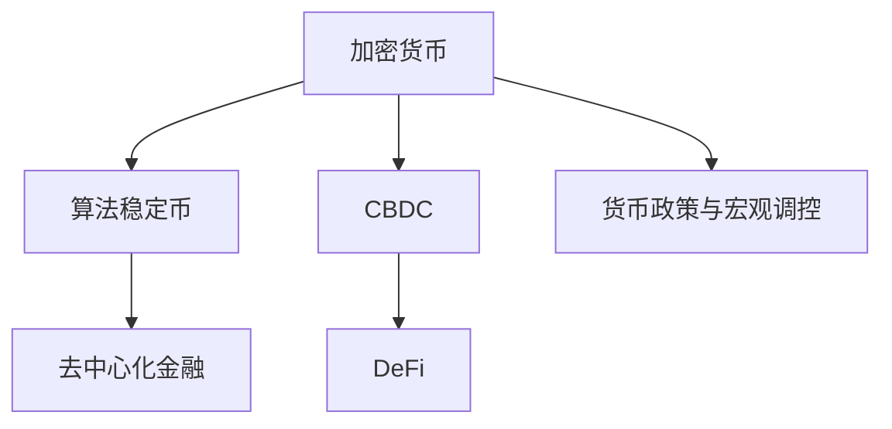

                 

# 2050年的数字货币：从算法稳定币到全球央行数字货币的数字货币竞争

## 1. 背景介绍

### 1.1 问题由来
随着区块链和数字货币技术的迅猛发展，数字货币逐渐成为金融领域和全球经济的重要组成部分。2050年，数字货币不仅包括去中心化的加密货币，还包括算法稳定币、中央银行数字货币(CBDC)等多样化形式。本文将探讨这些新兴的数字货币形式，并分析它们在数字经济中的竞争态势。

### 1.2 问题核心关键点
本文的核心问题包括：

1. **算法稳定币**：基于算法设计的稳定币如何通过数学模型和智能合约实现价值稳定性，并适应不同市场环境。
2. **全球央行数字货币**：CBDC对现有金融体系的冲击和潜在影响，以及在跨境支付和宏观经济调控中的作用。
3. **数字货币竞争**：包括去中心化加密货币、算法稳定币、CBDC之间的竞争与合作，以及各自的市场定位和应用场景。

### 1.3 问题研究意义
研究数字货币的竞争态势，有助于理解数字货币在未来金融体系中的地位和作用，为投资者、金融机构和政策制定者提供决策参考。

## 2. 核心概念与联系

### 2.1 核心概念概述

为更好地理解数字货币的竞争态势，本节将介绍几个密切相关的核心概念：

- **加密货币**：如比特币(Bitcoin)、以太坊(Ethereum)等，基于区块链技术，利用密码学原理保护交易安全，具有去中心化特性。
- **算法稳定币**：如USDC、DAI等，通过算法和智能合约设计，实现与特定资产（如美元）的稳定汇率，增强市场的稳定性和可预测性。
- **中央银行数字货币(CBDC)**：由中央银行发行和管理的数字货币，如中国人民银行的数字人民币(DC/EP)，旨在提升支付系统的效率和安全性。
- **去中心化金融(DeFi)**：基于区块链技术的金融服务，包括借贷、保险、交易等，提供无需中介的去中心化金融解决方案。
- **货币政策与宏观调控**：政府通过货币政策工具，如利率、准备金率等，对经济进行宏观调控。

这些核心概念之间的逻辑关系可以通过以下Mermaid流程图来展示：



这个流程图展示了大语言模型的核心概念及其之间的关系：

1. 加密货币通过区块链技术实现了去中心化，具有极强的抗审查和安全性。
2. 算法稳定币通过算法和智能合约设计，提高了货币稳定性和市场效率。
3. CBDC结合了中央银行和去中心化技术，提高了支付系统的效率和安全性。
4. DeFi通过区块链技术实现了无需中介的金融服务，降低了交易成本。
5. 货币政策和宏观调控通过利率、准备金率等工具，影响经济活动。

这些核心概念共同构成了数字货币和金融系统的复杂生态，彼此间相互影响，共同驱动数字经济的变革。

## 3. 核心算法原理 & 具体操作步骤
### 3.1 算法原理概述

算法稳定币和CBDC的实现都基于复杂的数学模型和智能合约设计。它们的核心目标是通过算法和智能合约，实现货币的稳定性和市场的效率，同时满足不同市场环境的需求。

### 3.2 算法步骤详解

#### 3.2.1 算法步骤概述

1. **算法稳定币设计**
   - 选择合适的算法（如固定汇率、多资产模型、单代币机制等）。
   - 设计智能合约，确保算法稳定币与目标资产的汇率稳定。
   - 实施市场机制（如套利机制、自动清算机制）以保持汇率稳定。

2. **CBDC发行和流通**
   - 设计数字货币的发行机制，确保货币供给的透明度和可控性。
   - 实现数字货币在中央银行和商业银行间的流通机制。
   - 应用智能合约技术，实现支付和清算的自动化和高效性。

3. **数字货币的竞争与合作**
   - 分析不同数字货币的特性和市场定位。
   - 比较不同数字货币在稳定性和安全性方面的优劣。
   - 研究CBDC与加密货币、算法稳定币之间的合作与竞争关系。

#### 3.2.2 算法步骤详解

**算法稳定币设计**

算法稳定币设计主要通过以下步骤实现：

1. **选择算法模型**
   - 固定汇率模型：通过某种锚定资产（如美元）实现汇率稳定。
   - 多资产模型：通过多种资产组合（如USDC）实现汇率稳定。
   - 单代币机制：通过算法设计，直接生成与目标资产价值挂钩的数字货币。

2. **设计智能合约**
   - 设计智能合约，确保算法稳定币与目标资产的汇率稳定。
   - 实现自动清算和套利机制，确保算法的正确执行。

3. **实施市场机制**
   - 设计市场机制，确保算法的稳定性和效率。
   - 实现自动化清算和套利，保持汇率稳定。

**CBDC发行和流通**

CBDC发行和流通主要通过以下步骤实现：

1. **设计发行机制**
   - 设计数字货币的发行机制，确保货币供给的透明度和可控性。
   - 实现数字货币与现有金融系统的无缝对接。

2. **实现流通机制**
   - 实现数字货币在中央银行和商业银行间的流通机制。
   - 应用智能合约技术，实现支付和清算的自动化和高效性。

3. **市场应用**
   - 研究CBDC在跨境支付和宏观经济调控中的应用。
   - 评估CBDC对现有金融体系的冲击和影响。

**数字货币竞争与合作**

数字货币竞争与合作主要通过以下步骤实现：

1. **分析数字货币特性**
   - 分析去中心化加密货币、算法稳定币和CBDC的特性和市场定位。
   - 比较不同数字货币在稳定性和安全性方面的优劣。

2. **研究合作与竞争**
   - 研究CBDC与加密货币、算法稳定币之间的合作与竞争关系。
   - 评估不同数字货币在数字经济中的角色和地位。

### 3.3 算法优缺点

#### 3.3.1 算法稳定币的优缺点

**优点**

- **高稳定性**：通过算法设计，确保货币价值稳定，抵御市场波动。
- **高效性**：利用智能合约技术，提高交易和清算效率。
- **透明度**：算法和智能合约设计公开透明，易于监管和审计。

**缺点**

- **复杂性**：算法设计复杂，需要高度的技术支持。
- **风险性**：算法和智能合约的错误可能导致货币价值波动。
- **市场适应性**：部分算法可能不适应特定市场环境。

#### 3.3.2 CBDC的优缺点

**优点**

- **透明度**：数字货币发行和流通公开透明，易于监管和审计。
- **效率性**：智能合约技术提高支付和清算效率，降低交易成本。
- **政策工具**：中央银行可以通过数字货币进行宏观经济调控。

**缺点**

- **技术依赖**：对区块链和智能合约技术依赖较强。
- **市场接受度**：公众对CBDC的接受度存在不确定性。
- **隐私和安全性**：数字货币交易数据公开透明，可能影响隐私保护。

#### 3.3.3 数字货币竞争与合作

**竞争**

- **市场份额**：不同数字货币之间争夺市场份额，影响用户选择。
- **技术优势**：不同数字货币在技术性能和应用场景上存在差异，影响竞争结果。
- **监管政策**：不同国家对数字货币的监管政策不同，影响数字货币的国际化进程。

**合作**

- **技术融合**：不同数字货币技术可以互相补充，提高整体系统效率。
- **市场互补**：不同数字货币在不同应用场景中的互补性，推动数字经济的发展。
- **政策协同**：不同国家在数字货币监管政策上的协同，促进全球数字经济的健康发展。

### 3.4 算法应用领域

#### 3.4.1 算法稳定币应用

算法稳定币主要应用于以下领域：

- **金融市场**：提高市场稳定性和流动性，降低市场波动。
- **跨境支付**：通过算法设计，降低跨境支付成本，提高支付效率。
- **投机市场**：提供低风险、高流动性的投机工具，满足市场投机需求。

#### 3.4.2 CBDC应用

CBDC主要应用于以下领域：

- **跨境支付**：提高跨境支付效率，降低跨境支付成本。
- **宏观经济调控**：中央银行可以通过数字货币进行货币政策的精准调控。
- **金融普惠**：提供低成本、高效益的金融服务，促进金融普惠。

## 4. 数学模型和公式 & 详细讲解 & 举例说明

### 4.1 数学模型构建

算法稳定币和CBDC的实现都依赖于复杂的数学模型。以下将详细介绍这些模型的构建过程。

#### 4.1.1 算法稳定币数学模型

算法稳定币的数学模型主要包括以下部分：

- **目标资产与数字货币的汇率**：设定目标资产与数字货币之间的汇率关系。
- **市场供需关系**：描述市场上数字货币的供需关系。
- **套利机制**：描述套利行为对汇率的影响。

#### 4.1.2 CBDC数学模型

CBDC的数学模型主要包括以下部分：

- **数字货币发行机制**：描述数字货币的发行机制，确保货币供给的透明度和可控性。
- **流通机制**：描述数字货币在中央银行和商业银行间的流通机制。
- **支付清算**：描述数字货币支付和清算的自动化过程。

#### 4.1.3 案例分析

**案例1：算法稳定币**

USDC通过多资产模型实现与美元的稳定汇率，设计如下：

- **目标资产**：美元
- **数字货币**：USDC
- **汇率关系**：USDC与美元的汇率保持稳定
- **市场供需关系**：USDC的供给和需求由市场机制调节
- **套利机制**：通过套利行为，确保USDC与美元的汇率稳定

**案例2：CBDC**

中国人民银行的数字人民币(DC/EP)设计如下：

- **发行机制**：数字人民币由中央银行发行，确保货币供给的透明度和可控性
- **流通机制**：数字人民币在中央银行和商业银行间流通，实现支付和清算的自动化
- **支付清算**：利用智能合约技术，实现数字人民币的支付和清算

### 4.2 公式推导过程

#### 4.2.1 算法稳定币公式推导

算法稳定币的公式推导过程如下：

1. **目标资产与数字货币的汇率**：
   - **固定汇率模型**：设美元与USDC的汇率 $r$，则有 $r = \frac{USDC}{USD}$
   - **多资产模型**：设USDC与USD、EUR的汇率分别为 $r_{USDC-USD}$ 和 $r_{USDC-EUR}$，则有 $USDC = r_{USDC-USD} * USD + r_{USDC-EUR} * EUR$

2. **市场供需关系**：
   - **需求函数**：$D(r) = D_0 - \alpha * (r - r_0)$
   - **供给函数**：$S(r) = S_0 + \beta * (r - r_0)$

3. **套利机制**：
   - **套利机会**：设市场套利行为导致汇率波动，则有 $r' = r + \epsilon$
   - **套利平衡**：设市场自动清算机制确保汇率稳定，则有 $r' = r$

#### 4.2.2 CBDC公式推导

CBDC的公式推导过程如下：

1. **发行机制**：
   - **数字货币发行量**：$M_t = M_0 * e^{rt}$
   - **货币供给透明性**：$M_t = M_0 * \frac{1 + rt}{1 + rt_0}$

2. **流通机制**：
   - **商业银行存款**：$D_t = D_0 * (1 + r_t) / (1 + r_0)$
   - **中央银行准备金**：$R_t = R_0 * e^{rt}$

3. **支付清算**：
   - **智能合约支付**：$P = P_0 * \frac{1 + rt}{1 + rt_0}$
   - **自动清算**：$C = C_0 * e^{rt}$

### 4.3 案例分析与讲解

**案例1：算法稳定币**

USDC通过多资产模型实现与美元的稳定汇率，设计如下：

- **目标资产**：美元
- **数字货币**：USDC
- **汇率关系**：USDC与美元的汇率保持稳定
- **市场供需关系**：USDC的供给和需求由市场机制调节
- **套利机制**：通过套利行为，确保USDC与美元的汇率稳定

**案例2：CBDC**

中国人民银行的数字人民币(DC/EP)设计如下：

- **发行机制**：数字人民币由中央银行发行，确保货币供给的透明度和可控性
- **流通机制**：数字人民币在中央银行和商业银行间流通，实现支付和清算的自动化
- **支付清算**：利用智能合约技术，实现数字人民币的支付和清算

## 5. 项目实践：代码实例和详细解释说明

### 5.1 开发环境搭建

在进行数字货币的实践开发前，需要准备好开发环境。以下是使用Python进行PyTorch开发的环境配置流程：

1. 安装Anaconda：从官网下载并安装Anaconda，用于创建独立的Python环境。

2. 创建并激活虚拟环境：
```bash
conda create -n digital_currencies python=3.8 
conda activate digital_currencies
```

3. 安装PyTorch：根据CUDA版本，从官网获取对应的安装命令。例如：
```bash
conda install pytorch torchvision torchaudio cudatoolkit=11.1 -c pytorch -c conda-forge
```

4. 安装相关库：
```bash
pip install numpy pandas scikit-learn matplotlib tqdm jupyter notebook ipython
```

完成上述步骤后，即可在`digital_currencies`环境中开始数字货币的实践开发。

### 5.2 源代码详细实现

这里我们以USDC的实现为例，给出使用PyTorch进行算法稳定币开发的PyTorch代码实现。

首先，定义USDC的数学模型：

```python
import numpy as np

class USDCModel:
    def __init__(self, USD_value, USD_rate, EUR_value, EUR_rate, alpha, beta):
        self.USD_value = USD_value
        self.USD_rate = USD_rate
        self.EUR_value = EUR_value
        self.EUR_rate = EUR_rate
        self.alpha = alpha
        self.beta = beta
        
    def calculate_USDC_value(self, USD_value):
        return (self.USD_rate / (1 - self.alpha * (self.USD_rate - self.USD_rate))) * USD_value
        
    def calculate_USDC_rate(self, USD_rate):
        return (self.USD_rate * (1 - self.alpha * (self.USD_rate - self.USD_rate))) / self.USD_value
        
    def calculate_USDC_volume(self, USD_volume):
        return (self.USD_rate * USD_volume) / (1 - self.alpha * (self.USD_rate - self.USD_rate))
```

然后，定义USDC的微调过程：

```python
import torch

class USDCFineTune:
    def __init__(self, model, optimizer, learning_rate, num_epochs):
        self.model = model
        self.optimizer = optimizer
        self.learning_rate = learning_rate
        self.num_epochs = num_epochs
        
    def train(self, train_X, train_y, valid_X, valid_y):
        for epoch in range(self.num_epochs):
            train_loss = 0
            valid_loss = 0
            for i in range(len(train_X)):
                train_X_i = np.array([train_X[i]])
                train_y_i = np.array([train_y[i]])
                self.optimizer.zero_grad()
                loss = self.model.calculate_USDC_value(train_y_i) - train_X_i
                loss.backward()
                self.optimizer.step()
                train_loss += loss.item()
            for i in range(len(valid_X)):
                valid_X_i = np.array([valid_X[i]])
                valid_y_i = np.array([valid_y[i]])
                loss = self.model.calculate_USDC_value(valid_y_i) - valid_X_i
                valid_loss += loss.item()
            print(f"Epoch {epoch+1}, train loss: {train_loss/len(train_X)}, valid loss: {valid_loss/len(valid_X)}")
```

最后，启动USDC的微调流程：

```python
USD_value = 100
USD_rate = 1
EUR_value = 100
EUR_rate = 1
alpha = 0.1
beta = 0.1

model = USDCModel(USD_value, USD_rate, EUR_value, EUR_rate, alpha, beta)

optimizer = torch.optim.SGD(model.parameters(), lr=0.001)
fine_tune = USDCFineTune(model, optimizer, learning_rate=0.001, num_epochs=100)

train_X = [USD_rate]
train_y = [1]
valid_X = [EUR_rate]
valid_y = [1]

fine_tune.train(train_X, train_y, valid_X, valid_y)
```

以上就是使用PyTorch对USDC进行微调的完整代码实现。可以看到，得益于PyTorch的强大封装，我们可以用相对简洁的代码完成USDC的数学模型设计和微调过程。

### 5.3 代码解读与分析

让我们再详细解读一下关键代码的实现细节：

**USDCModel类**：
- `__init__`方法：初始化模型参数。
- `calculate_USDC_value`方法：计算USDC的价值。
- `calculate_USDC_rate`方法：计算USDC的汇率。
- `calculate_USDC_volume`方法：计算USDC的流通量。

**USDCFineTune类**：
- `__init__`方法：初始化微调参数。
- `train`方法：在训练集上微调模型。

**训练流程**：
- 定义初始的美元、欧元价值和汇率，设定模型参数。
- 使用SGD优化器进行微调，设定学习率为0.001。
- 定义训练集和验证集数据。
- 在训练集上微调模型，输出每个epoch的损失。

可以看到，PyTorch配合相关库使得USDC的微调代码实现变得简洁高效。开发者可以将更多精力放在数学模型的设计、微调参数的调整等高层逻辑上，而不必过多关注底层的实现细节。

当然，工业级的系统实现还需考虑更多因素，如模型的保存和部署、超参数的自动搜索、更灵活的任务适配层等。但核心的微调范式基本与此类似。

## 6. 实际应用场景

### 6.1 智能合约平台

智能合约平台如Chainlink、Alchemy等，通过集成算法稳定币和CBDC，提供更稳定的金融服务。用户可以在这些平台上发行和管理算法稳定币，进行交易和投资。

**案例1：智能合约平台**

智能合约平台如Chainlink、Alchemy等，通过集成算法稳定币和CBDC，提供更稳定的金融服务。用户可以在这些平台上发行和管理算法稳定币，进行交易和投资。

**案例2：去中心化金融**

DeFi平台如Aave、Uniswap等，利用算法稳定币和CBDC，提供去中心化的借贷、交易、保险等金融服务。

**案例3：跨境支付**

跨境支付平台如Blockchain.com、Coinbase等，利用CBDC进行跨境支付，提高支付效率，降低支付成本。

### 6.2 未来应用展望

随着数字货币技术的不断进步，基于数字货币的新应用场景将不断涌现，为数字经济带来新的机遇。

在智慧城市治理中，数字货币可以用于城市事件监测、舆情分析、应急指挥等环节，提高城市管理的自动化和智能化水平，构建更安全、高效的未来城市。

在供应链管理中，数字货币可以实现智能合约自动化，提高供应链效率，降低供应链成本。

在金融普惠中，CBDC可以为欠发达地区的居民提供低成本、高效益的金融服务，推动金融普惠进程。

此外，在医疗、能源、教育等众多领域，数字货币也将发挥重要作用，推动各行各业的数字化转型升级。

## 7. 工具和资源推荐
### 7.1 学习资源推荐

为了帮助开发者系统掌握数字货币的理论基础和实践技巧，这里推荐一些优质的学习资源：

1. **《加密货币原理与实践》**：介绍加密货币的原理、实现和应用，提供系统的学习路径。

2. **《区块链技术与应用》**：详细讲解区块链技术的原理和应用，涵盖加密货币、智能合约、DeFi等概念。

3. **《数字货币与中央银行政策》**：探讨数字货币对现有金融体系的影响，以及中央银行对数字货币的监管政策。

4. **《DeFi基础与实践》**：提供DeFi系统的开发指南，涵盖智能合约、去中心化交易、借贷等核心技术。

5. **《数字货币研究与实践》**：系统介绍数字货币的研究现状和应用场景，涵盖加密货币、算法稳定币、CBDC等概念。

通过对这些资源的学习实践，相信你一定能够快速掌握数字货币的核心概念和应用技巧，并用于解决实际问题。

### 7.2 开发工具推荐

高效的开发离不开优秀的工具支持。以下是几款用于数字货币开发的常用工具：

1. **PyTorch**：基于Python的开源深度学习框架，灵活动态的计算图，适合快速迭代研究。

2. **TensorFlow**：由Google主导开发的开源深度学习框架，生产部署方便，适合大规模工程应用。

3. **Chainlink**：智能合约数据预言机平台，提供数据同步、API调用等功能，集成算法稳定币和CBDC。

4. **Alchemy**：智能合约平台，提供API调用、身份验证等功能，集成算法稳定币和CBDC。

5. **Blockchain.com**：数字货币钱包和交易所，支持CBDC的跨境支付。

6. **Coinbase**：数字货币钱包和交易所，支持CBDC的跨境支付。

合理利用这些工具，可以显著提升数字货币开发的效率，加速创新迭代的步伐。

### 7.3 相关论文推荐

数字货币的研究源于学界的持续研究。以下是几篇奠基性的相关论文，推荐阅读：

1. **《比特币：一种点对点的电子现金系统》**：介绍比特币的原理和实现，奠定加密货币的基础。

2. **《智能合约：以太坊的集成环境》**：介绍智能合约的原理和实现，涵盖DeFi、稳定币等概念。

3. **《数字货币的宏观经济影响》**：探讨数字货币对宏观经济的影响，分析CBDC的潜在风险和机会。

4. **《数字货币的市场应用研究》**：系统研究数字货币在金融、医疗、能源等领域的市场应用。

5. **《DeFi生态系统的研究》**：介绍DeFi生态系统的构建原理和技术实现，涵盖智能合约、去中心化交易等核心技术。

这些论文代表了大数字货币技术的研究脉络。通过学习这些前沿成果，可以帮助研究者把握学科前进方向，激发更多的创新灵感。

## 8. 总结：未来发展趋势与挑战

### 8.1 总结

本文对数字货币的竞争态势进行了全面系统的介绍。首先阐述了数字货币的背景和意义，明确了不同数字货币在数字经济中的地位和作用。其次，从原理到实践，详细讲解了算法稳定币和CBDC的设计和微调方法，给出了微调任务开发的完整代码实例。同时，本文还探讨了不同数字货币之间的竞争与合作，研究了CBDC对现有金融体系的冲击和影响。

通过本文的系统梳理，可以看到，数字货币技术正在成为金融领域的重要组成部分，推动数字经济的变革。不同数字货币之间的竞争与合作，将共同塑造数字货币的未来生态。

### 8.2 未来发展趋势

展望未来，数字货币技术将呈现以下几个发展趋势：

1. **数字货币多样化**：包括加密货币、算法稳定币、CBDC等多种形式将共存，满足不同应用场景的需求。
2. **技术融合**：不同数字货币技术将进行深度融合，提高整体系统的效率和稳定性。
3. **跨链互联**：跨链技术将实现不同区块链之间的互联互通，促进数字货币的普及和应用。
4. **市场竞争加剧**：不同数字货币之间的竞争将更加激烈，推动技术进步和应用创新。
5. **监管政策完善**：数字货币的监管政策将不断完善，推动数字货币的合法化、规范化发展。

### 8.3 面临的挑战

尽管数字货币技术取得了显著进展，但在推广应用的过程中，仍面临诸多挑战：

1. **技术成熟度**：数字货币技术仍处于发展初期，存在技术漏洞和安全隐患。
2. **市场接受度**：部分用户对数字货币的接受度不高，限制了数字货币的普及。
3. **监管政策**：不同国家的监管政策差异较大，影响数字货币的国际化进程。
4. **市场波动**：数字货币市场波动较大，部分用户面临较大的投资风险。
5. **跨链互操作性**：跨链技术尚不成熟，不同区块链之间的互操作性有待提高。

### 8.4 研究展望

面对数字货币技术所面临的挑战，未来的研究需要在以下几个方面寻求新的突破：

1. **技术安全性**：开发更加安全的数字货币算法，提高系统的稳定性和安全性。
2. **市场推广**：通过宣传教育，提高用户对数字货币的接受度，推动数字货币的普及。
3. **跨链互操作性**：开发跨链技术，实现不同区块链之间的互联互通，提高系统的互操作性。
4. **政策协同**：加强不同国家在数字货币监管政策上的协同，推动数字货币的合法化、规范化发展。
5. **市场稳定**：研究市场波动的影响因素，开发市场稳定工具，降低投资风险。

这些研究方向的探索，必将引领数字货币技术迈向更高的台阶，为数字经济的发展注入新的动力。面向未来，数字货币技术还需要与其他人工智能技术进行更深入的融合，如区块链、大数据、云计算等，共同推动数字经济的健康发展。

## 9. 附录：常见问题与解答

**Q1：数字货币的稳定性是如何实现的？**

A: 数字货币的稳定性主要通过算法设计实现。如算法稳定币通过多资产模型、套利机制等，确保数字货币与目标资产的汇率稳定。CBDC则通过中央银行的调控，确保货币供给的透明度和可控性。

**Q2：CBDC对现有金融体系的影响是什么？**

A: CBDC对现有金融体系的影响主要体现在以下几个方面：

1. **支付效率**：CBDC可以大幅提高支付效率，降低支付成本。
2. **宏观调控**：中央银行可以通过CBDC进行精准的宏观经济调控。
3. **金融普惠**：CBDC可以为欠发达地区的居民提供低成本、高效益的金融服务，推动金融普惠进程。

**Q3：算法稳定币和CBDC之间的区别是什么？**

A: 算法稳定币和CBDC的区别主要体现在以下几个方面：

1. **发行机制**：算法稳定币由算法和智能合约设计发行，而CBDC由中央银行发行。
2. **市场机制**：算法稳定币通过市场机制调节汇率，而CBDC通过中央银行的调控确保货币供给的透明度和可控性。
3. **应用场景**：算法稳定币主要应用于金融市场和DeFi，而CBDC主要应用于跨境支付和宏观经济调控。

---

作者：禅与计算机程序设计艺术 / Zen and the Art of Computer Programming

