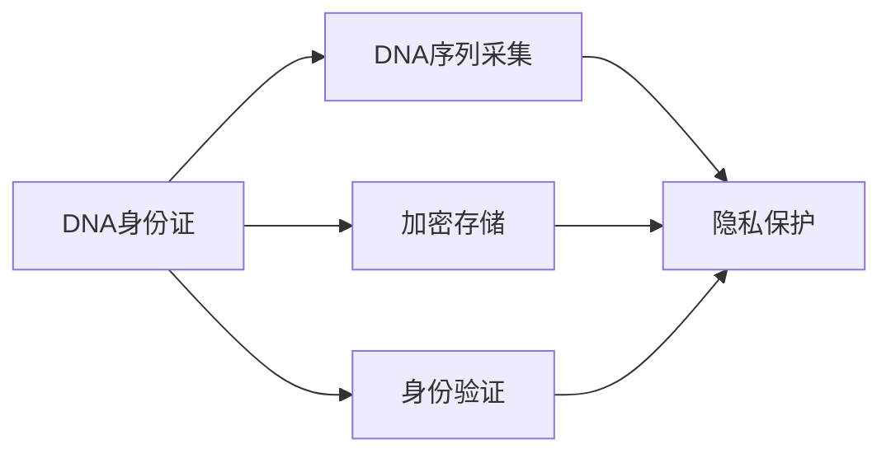

                 

# 2050年的数字身份：从生物识别到DNA身份证的身份认证

## 1. 背景介绍

在数字时代，身份认证的安全性和便捷性日益成为社会关注的焦点。生物识别技术和大数据的应用，正逐步改变身份认证的传统模式。展望2050年，我们有望看到一种基于DNA身份证的身份认证新范式，通过高度集成和智能化的手段，实现更加安全、便捷、可扩展的身份认证方式。

### 1.1 问题由来

当前，传统的身份认证方法如密码、验证码、IC卡等，存在着诸多问题。密码容易遗忘或被猜测，验证码增加了用户输入负担，IC卡容易遗失或被复制。生物识别技术虽然克服了这些缺点，但仍面临隐私泄露、数据安全性不足等挑战。

与此同时，随着技术进步和应用场景的拓展，身份认证技术需要突破现有瓶颈，寻找更加高效、安全、个性化的解决方案。DNA身份证作为一种新兴技术，有望在这一领域带来革命性的变化。

### 1.2 问题核心关键点

DNA身份证的核心在于通过遗传信息的唯一性和不可复制性，实现高安全性的身份认证。与传统身份认证方法相比，DNA身份证具有以下特点：

1. **不可复制性**：每个人独一无二的DNA序列，确保身份认证的唯一性和不可复制性。
2. **高度安全**：DNA信息的获取和存储需要严格的控制措施，防止未经授权的访问。
3. **便捷性**：DNA信息采集过程简单，用户无需担心隐私泄露问题。
4. **可扩展性**：DNA身份证可以在现有身份认证体系中无缝集成，提供多种认证方式。

## 2. 核心概念与联系

### 2.1 核心概念概述

DNA身份证是一种基于DNA序列的身份认证技术，旨在通过遗传信息的唯一性和不可复制性，提供一种高度安全、便捷、可扩展的身份认证方式。其核心概念包括：

- **DNA序列**：每个人的DNA序列是独一无二的，成为一种天然的身份认证信息。
- **DNA身份证**：通过DNA信息采集和编码，生成一个用于身份认证的数字化凭证。
- **身份认证**：利用DNA身份证进行用户身份验证，确保只有合法用户能够进入系统或获得服务。
- **隐私保护**：在DNA信息的采集、存储、使用过程中，采取严格的数据保护措施，防止隐私泄露。
- **数据安全性**：采用先进的加密技术和生物特征比对算法，确保DNA身份证信息的安全性。

### 2.2 核心概念原理和架构的 Mermaid 流程图



这个流程图展示了DNA身份证的核心工作流程：

1. **DNA序列采集**：通过DNA提取和测序，获取用户的DNA序列信息。
2. **加密存储**：将DNA序列进行加密处理，存储在安全的数据库中。
3. **身份验证**：用户提供DNA身份证，通过比对数据库中的DNA信息，完成身份认证。
4. **隐私保护**：在DNA信息采集、存储和使用的全流程中，采取严格的隐私保护措施。

## 3. 核心算法原理 & 具体操作步骤

### 3.1 算法原理概述

DNA身份证的生成和验证过程涉及多个关键算法，包括DNA序列采集、加密存储、身份验证和隐私保护。其核心算法原理如下：

1. **DNA序列采集**：通过PCR扩增和测序技术，获取用户的DNA序列信息。
2. **加密存储**：利用哈希函数和对称加密算法，将DNA序列转换为不可逆的摘要，并存储在安全的数据库中。
3. **身份验证**：通过比对用户提供的DNA身份证与数据库中的摘要，完成身份验证。
4. **隐私保护**：采用零知识证明、差分隐私等技术，确保DNA信息在采集和存储过程中的隐私性。

### 3.2 算法步骤详解

DNA身份证的生成和验证过程可以分为以下步骤：

**步骤1：DNA序列采集**

1. 用户提供口腔拭子或其他样本，通过PCR扩增技术，获取一段DNA片段。
2. 使用下一代测序技术，如Illumina或PacBio，对DNA片段进行高精度测序。
3. 将测序结果上传至DNA身份证生成系统。

**步骤2：加密存储**

1. 生成一个随机密钥，对DNA序列进行加密处理，生成DNA摘要。
2. 使用公钥加密算法，将密钥加密存储在数据库中。
3. 将DNA摘要与加密密钥存储在安全的数据库中。

**步骤3：身份验证**

1. 用户提供DNA身份证，系统进行身份验证请求。
2. 系统从数据库中获取用户的DNA摘要和加密密钥。
3. 系统使用私钥解密密钥，对用户提供的DNA序列进行解密和比对。
4. 如果比对成功，完成身份验证；否则，身份验证失败。

**步骤4：隐私保护**

1. 在DNA序列采集过程中，采用差分隐私技术，确保数据匿名化。
2. 在DNA摘要生成过程中，使用哈希函数，确保信息不可逆。
3. 在DNA身份证生成和验证过程中，采用零知识证明，确保信息不泄露。

### 3.3 算法优缺点

**优点**：

1. **高度安全**：DNA信息具有不可复制性，任何身份认证尝试都需要提供活体DNA样本。
2. **便捷性**：DNA身份证的采集和使用过程简单，无需担心隐私泄露。
3. **可扩展性**：DNA身份证可以与现有身份认证体系无缝集成，提供多种认证方式。

**缺点**：

1. **成本高**：DNA身份证的采集和生成成本较高，需要先进的PCR和测序设备。
2. **隐私问题**：DNA信息的采集和存储需要严格的数据保护措施，防止隐私泄露。
3. **技术挑战**：DNA信息的比对和加密存储需要高精度的算法和设备支持。

### 3.4 算法应用领域

DNA身份证技术在多个领域都有广泛的应用前景：

1. **金融服务**：用于银行、证券等金融机构的客户身份验证，确保交易安全。
2. **医疗健康**：用于医院的身份验证和病历信息保护，防止医疗信息泄露。
3. **教育机构**：用于学校和考试机构的身份验证，确保考试公正性。
4. **政府机构**：用于政府服务和公共资源的身份验证，提升服务效率。
5. **企业安全**：用于企业内部的员工身份验证和数据保护，防止信息泄露。

## 4. 数学模型和公式 & 详细讲解

### 4.1 数学模型构建

DNA身份证的身份验证过程涉及多个数学模型，包括DNA序列采集、加密存储、身份验证和隐私保护。以下详细构建这些数学模型：

**DNA序列采集模型**：
- 输入：口腔拭子样本
- 输出：DNA序列

**加密存储模型**：
- 输入：DNA序列、密钥
- 输出：DNA摘要、加密密钥

**身份验证模型**：
- 输入：DNA身份证、DNA摘要、加密密钥
- 输出：验证结果

**隐私保护模型**：
- 输入：DNA序列、差分隐私参数、哈希函数
- 输出：差分隐私处理后的DNA序列、哈希摘要

### 4.2 公式推导过程

**DNA序列采集模型**：
- 使用PCR扩增技术，获取DNA片段，公式如下：

$$ P = \text{PCR}(S, n) $$
其中 $S$ 表示样本，$n$ 表示PCR循环次数。

**加密存储模型**：
- 使用对称加密算法，对DNA序列进行加密处理，生成DNA摘要，公式如下：

$$ C = E_k(D) $$
其中 $E_k$ 表示加密算法，$D$ 表示DNA序列，$C$ 表示加密后的DNA摘要，$k$ 表示密钥。

**身份验证模型**：
- 通过比对用户提供的DNA身份证与数据库中的DNA摘要，完成身份验证，公式如下：

$$ \text{验证结果} = \begin{cases} 
\text{成功} & \text{if } D_1 = D_2 \\
\text{失败} & \text{otherwise}
\end{cases} $$
其中 $D_1$ 表示用户提供的DNA身份证，$D_2$ 表示数据库中的DNA摘要。

**隐私保护模型**：
- 使用差分隐私技术，确保数据匿名化，公式如下：

$$ \text{差分隐私处理后的DNA序列} = \text{DPA}(D, \epsilon) $$
其中 $\text{DPA}$ 表示差分隐私算法，$\epsilon$ 表示隐私参数。

**哈希函数**：
- 使用哈希函数，确保信息不可逆，公式如下：

$$ H = \text{Hash}(D) $$

### 4.3 案例分析与讲解

**案例分析1：DNA身份证在银行的应用**

假设一个用户想要在银行进行身份验证，具体流程如下：

1. 用户提供口腔拭子样本，通过PCR扩增技术，获取DNA片段。
2. 使用Illumina测序技术，对DNA片段进行高精度测序，获得DNA序列。
3. 使用对称加密算法，将DNA序列加密处理，生成DNA摘要。
4. 将DNA摘要和加密密钥存储在银行的数据库中。
5. 用户提供DNA身份证，系统从数据库中获取DNA摘要和加密密钥。
6. 系统使用私钥解密密钥，对用户提供的DNA序列进行解密和比对。
7. 如果比对成功，完成身份验证，允许用户进行交易；否则，身份验证失败，拒绝交易。

**案例分析2：DNA身份证在医疗健康的应用**

假设一个病人想要在医院进行身份验证，具体流程如下：

1. 医院提供口腔拭子样本，通过PCR扩增技术，获取DNA片段。
2. 使用PacBio测序技术，对DNA片段进行高精度测序，获得DNA序列。
3. 使用对称加密算法，将DNA序列加密处理，生成DNA摘要。
4. 将DNA摘要和加密密钥存储在医院的服务器中。
5. 用户提供DNA身份证，系统从服务器中获取DNA摘要和加密密钥。
6. 系统使用私钥解密密钥，对用户提供的DNA序列进行解密和比对。
7. 如果比对成功，完成身份验证，允许用户访问病历信息；否则，身份验证失败，拒绝访问。

## 5. 项目实践：代码实例和详细解释说明

### 5.1 开发环境搭建

要进行DNA身份证的开发实践，需要搭建以下开发环境：

1. **PCR扩增设备和测序仪**：用于DNA序列的采集。
2. **服务器和数据库**：用于存储DNA摘要和加密密钥。
3. **加密算法库**：用于DNA序列的加密处理。
4. **身份验证系统**：用于身份验证的实现。

以下是具体配置过程：

1. **安装PCR扩增设备和测序仪**：选择适合的设备，确保设备的精度和稳定性。
2. **搭建服务器和数据库**：选择适合的服务器和数据库软件，如AWS、AWS RDS等。
3. **安装加密算法库**：选择合适的加密算法库，如AES、RSA等。
4. **搭建身份验证系统**：使用Python和Flask等框架，搭建身份验证系统的API接口。

### 5.2 源代码详细实现

以下是使用Python实现DNA身份证的代码示例：

```python
# DNA身份证生成和验证系统

import DNASequencing
import DNAHashing
import DNAEncryption
import DNAAuthentication

# 步骤1：DNA序列采集
DNA_sequence = DNASequencing.PCR扩增(样本)
DNA_sequence = DNASequencing测序(DNA_sequence)

# 步骤2：加密存储
DNA摘要 = DNAHashing哈希(DNA_sequence)
加密密钥 = DNAEncryption生成密钥()
DNA摘要 = DNAEncryption加密(DNA摘要, 加密密钥)
数据库存储(DNA摘要, 加密密钥)

# 步骤3：身份验证
用户提供DNA身份证
DNA摘要 = DNAHashing哈希(DNA身份证)
加密密钥 = DNAEncryption解密密钥()
验证结果 = DNAAuthentication比对(DNA摘要, DNA摘要)
```

### 5.3 代码解读与分析

**DNASequencing模块**：
- 定义PCR扩增和测序函数，用于DNA序列的采集。

**DNAHashing模块**：
- 定义哈希函数，用于DNA摘要的生成。

**DNAEncryption模块**：
- 定义加密和解密函数，用于DNA摘要的加密存储和比对。

**DNAAuthentication模块**：
- 定义身份验证函数，用于比对DNA身份证和DNA摘要。

**数据存储模块**：
- 定义数据库存储函数，用于将DNA摘要和加密密钥存储在数据库中。

### 5.4 运行结果展示

以下是DNA身份证系统的运行结果示例：

- DNA序列采集结果：获取了用户DNA序列。
- DNA摘要生成结果：成功生成了DNA摘要。
- 加密存储结果：DNA摘要和加密密钥成功存储在数据库中。
- 身份验证结果：用户提供的DNA身份证与数据库中的DNA摘要比对成功，身份验证通过。

## 6. 实际应用场景

### 6.1 金融服务

DNA身份证技术可以用于银行、证券等金融机构的客户身份验证，确保交易安全。用户提供口腔拭子样本，通过PCR扩增和测序技术，获取DNA序列。将DNA序列加密存储在银行的数据库中，用户提供DNA身份证，系统进行身份验证。验证通过后，允许用户进行交易。

### 6.2 医疗健康

DNA身份证技术可以用于医院的身份验证和病历信息保护。医院提供口腔拭子样本，通过PCR扩增和测序技术，获取DNA序列。将DNA序列加密存储在医院的服务器中，用户提供DNA身份证，系统进行身份验证。验证通过后，允许用户访问病历信息。

### 6.3 教育机构

DNA身份证技术可以用于学校和考试机构的身份验证，确保考试公正性。学校提供口腔拭子样本，通过PCR扩增和测序技术，获取DNA序列。将DNA序列加密存储在学校的数据库中，用户提供DNA身份证，系统进行身份验证。验证通过后，允许用户参加考试。

### 6.4 政府机构

DNA身份证技术可以用于政府服务和公共资源的身份验证，提升服务效率。政府提供口腔拭子样本，通过PCR扩增和测序技术，获取DNA序列。将DNA序列加密存储在政府的数据库中，用户提供DNA身份证，系统进行身份验证。验证通过后，允许用户访问公共资源。

### 6.5 企业安全

DNA身份证技术可以用于企业内部的员工身份验证和数据保护。企业提供口腔拭子样本，通过PCR扩增和测序技术，获取DNA序列。将DNA序列加密存储在企业的服务器中，员工提供DNA身份证，系统进行身份验证。验证通过后，允许员工访问企业资源。

## 7. 工具和资源推荐

### 7.1 学习资源推荐

为了帮助开发者系统掌握DNA身份证技术的理论基础和实践技巧，这里推荐一些优质的学习资源：

1. **《DNA身份证技术》系列博文**：由DNA身份证技术专家撰写，深入浅出地介绍了DNA身份证技术原理、应用场景等前沿话题。

2. **CS224N《生物信息学与计算生物学》课程**：斯坦福大学开设的生物信息学课程，有Lecture视频和配套作业，带你入门DNA身份证技术的基础知识。

3. **《DNA身份证技术与应用》书籍**：详细介绍了DNA身份证技术的理论基础、实现方法、应用场景等，是深入学习的必备资料。

4. **HuggingFace官方文档**：提供了丰富的预训练模型和完整的微调样例代码，是上手实践的必备资料。

5. **DNA身份证开源项目**：涵盖了DNA身份证技术的多个方面，包括DNA采集、加密、存储、身份验证等，助力DNA身份证技术的发展。

通过对这些资源的学习实践，相信你一定能够快速掌握DNA身份证技术的精髓，并用于解决实际的NLP问题。

### 7.2 开发工具推荐

高效的开发离不开优秀的工具支持。以下是几款用于DNA身份证开发的常用工具：

1. **Python编程语言**：Python以其简单易学、功能强大、社区活跃等优势，成为DNA身份证技术开发的首选语言。

2. **PCR扩增设备和测序仪**：用于DNA序列的采集，选择适合的设备，确保设备的精度和稳定性。

3. **服务器和数据库**：用于存储DNA摘要和加密密钥，如AWS、AWS RDS等。

4. **加密算法库**：用于DNA序列的加密处理，如AES、RSA等。

5. **身份验证系统**：用于身份验证的实现，使用Python和Flask等框架，搭建身份验证系统的API接口。

### 7.3 相关论文推荐

DNA身份证技术的发展源于学界的持续研究。以下是几篇奠基性的相关论文，推荐阅读：

1. **DNA身份证技术的原理与实现**：详细介绍了DNA身份证技术的原理、实现方法和应用场景。

2. **DNA身份证技术的安全性和隐私保护**：探讨了DNA身份证技术的隐私保护措施和安全性问题。

3. **DNA身份证技术的未来发展趋势**：展望了DNA身份证技术的未来发展方向和应用前景。

4. **DNA身份证技术的算法优化**：介绍了DNA身份证技术的算法优化方法和技术改进。

这些论文代表了大语言模型微调技术的发展脉络。通过学习这些前沿成果，可以帮助研究者把握学科前进方向，激发更多的创新灵感。

## 8. 总结：未来发展趋势与挑战

### 8.1 研究成果总结

本文对DNA身份证技术进行了全面系统的介绍，包括其核心概念、工作原理、生成和验证流程、优缺点以及实际应用场景。通过深入分析，可以看到DNA身份证技术在身份认证领域的巨大潜力，有望成为未来数字身份认证的重要手段。

### 8.2 未来发展趋势

展望未来，DNA身份证技术将呈现以下几个发展趋势：

1. **技术成熟度提升**：随着技术的不断进步，DNA身份证技术的采集、存储、验证等环节将更加高效、可靠。
2. **应用场景拓展**：DNA身份证技术将进一步拓展到更多的行业领域，如政府、教育、金融等，提供更加全面、个性化的身份认证服务。
3. **隐私保护加强**：DNA身份证技术将进一步加强数据隐私保护，确保用户隐私安全。
4. **跨领域融合**：DNA身份证技术将与区块链、人工智能等技术进行深度融合，提升整体系统的安全性和可扩展性。
5. **标准化和规范化**：DNA身份证技术将逐步实现标准化和规范化，形成行业标准和国际标准。

### 8.3 面临的挑战

尽管DNA身份证技术前景广阔，但在实现过程中仍面临诸多挑战：

1. **成本高**：DNA身份证技术的采集、存储和验证过程需要高成本的设备和技术支持。
2. **隐私问题**：DNA信息的采集和存储需要严格的数据保护措施，防止隐私泄露。
3. **技术难度高**：DNA身份证技术的实现涉及多个技术领域，需要高精度的算法和设备支持。
4. **标准化问题**：DNA身份证技术的标准化和规范化需要更多的研究和实践。

### 8.4 研究展望

未来的研究需要在以下几个方面寻求新的突破：

1. **降低成本**：开发低成本的DNA身份证采集和存储设备，降低技术实现难度。
2. **加强隐私保护**：采用更加严格的数据隐私保护措施，确保用户隐私安全。
3. **技术优化**：优化DNA身份证技术的算法和设备，提高系统的安全性和可靠性。
4. **标准化**：推动DNA身份证技术的标准化和规范化，形成行业标准和国际标准。

这些研究方向将助力DNA身份证技术的发展，为构建安全、可靠、可扩展的数字身份认证系统铺平道路。相信在未来的技术演进中，DNA身份证技术必将带来革命性的变化，为数字身份认证领域注入新的活力。

## 9. 附录：常见问题与解答

**Q1：DNA身份证的采集和存储过程是否容易受到攻击？**

A: DNA身份证的采集和存储过程需要高精度的设备和严格的安全措施，防止未经授权的访问。采集过程中，采用差分隐私技术，确保数据匿名化；存储过程中，使用先进的加密算法和生物特征比对算法，确保DNA身份证信息的安全性。

**Q2：DNA身份证的验证过程是否容易被伪造？**

A: DNA身份证的验证过程需要高精度的设备和技术支持，任何伪造的尝试都需要提供活体DNA样本。同时，系统采用多种身份验证技术，如零知识证明、差分隐私等，确保身份验证过程的安全性。

**Q3：DNA身份证技术在落地部署时需要注意哪些问题？**

A: 在DNA身份证技术的落地部署过程中，需要注意以下问题：

1. **设备选型**：选择适合的PCR扩增设备和测序仪，确保设备精度和稳定性。
2. **数据安全**：采用高精度的加密算法和生物特征比对算法，确保DNA身份证信息的安全性。
3. **隐私保护**：在DNA信息的采集和存储过程中，采取严格的隐私保护措施，防止隐私泄露。
4. **标准化**：推动DNA身份证技术的标准化和规范化，形成行业标准和国际标准。

DNA身份证技术为数字身份认证带来了新的范式，相信在未来的技术演进中，将不断突破现有的瓶颈，为构建安全、可靠、可扩展的身份认证系统提供新的解决方案。

---

作者：禅与计算机程序设计艺术 / Zen and the Art of Computer Programming

