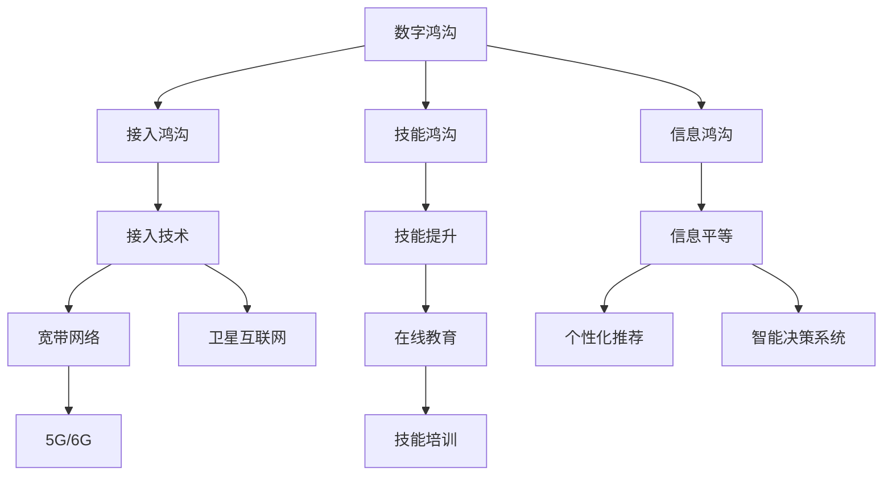

                 

# 2050年的数字鸿沟：从接入到应用的信息平等

在2050年的数字化社会，信息平等的目标不再是简单的互联网接入，而是实现每个个体在信息获取、处理、应用的各个环节中都能够享受到公平、高效、个性化的服务。本文将深入探讨这一愿景所面临的挑战，并提出相应的技术和社会解决方案。

## 1. 背景介绍

### 1.1 数字鸿沟现状
当前，数字鸿沟主要体现在以下几个方面：
- **接入鸿沟**：偏远地区和欠发达地区的互联网普及率低，高昂的接入成本限制了这些地区的数字发展。
- **技能鸿沟**：不同年龄、教育背景和收入水平的人群对数字工具的使用能力和掌握程度存在差异。
- **信息鸿沟**：即便能接入互联网，低质量的内容和信息不对称的问题也普遍存在。

### 1.2 数字鸿沟的影响
数字鸿沟不仅导致社会不平等加剧，还会阻碍经济发展、教育公平和技术创新。为了构建2050年的信息平等社会，必须从接入、应用、技能提升等多个维度综合施策。

## 2. 核心概念与联系

### 2.1 核心概念概述
- **数字鸿沟(Digital Divide)**：指在数字技术普及和应用方面存在的差距，涉及接入、技能和信息三个层面。
- **信息平等(Information Equality)**：每个个体能够获得公平、高效、个性化的信息服务。
- **接入技术(Access Technology)**：实现数字接入的技术和基础设施，如5G、WiFi 6、卫星互联网等。
- **个性化推荐(Recommendation Systems)**：基于用户行为和偏好，推荐个性化的内容和服务。
- **智能决策系统(Intelligent Decision Systems)**：利用大数据、机器学习等技术，实现智能化的决策和分析。

### 2.2 核心概念原理和架构的 Mermaid 流程图



该图展示了数字鸿沟的形成和解决路径。接入技术改善了接入鸿沟，技能提升解决了技能鸿沟，而信息平等的实现需要个性化推荐和智能决策系统的支持。

## 3. 核心算法原理 & 具体操作步骤

### 3.1 算法原理概述

信息平等的实现需要多维度技术的支持，包括接入技术、个性化推荐算法、智能决策系统等。这些技术的核心原理包括：

- **接入技术**：通过宽带网络和5G/6G等新一代通信技术，提升网络带宽和稳定性，降低接入成本。
- **个性化推荐算法**：基于用户行为数据，利用协同过滤、深度学习等技术，推荐个性化的内容和服务。
- **智能决策系统**：利用大数据分析和机器学习算法，提取数据中的关键特征，进行智能化的决策和预测。

### 3.2 算法步骤详解

#### 3.2.1 接入技术
1. **宽带网络建设**：在城市和农村地区广泛部署宽带网络，确保每个家庭和机构都能够获得稳定的网络连接。
2. **5G/6G网络部署**：在热点区域和交通枢纽建设5G/6G基站，提供更高的网络速度和更低的延迟。
3. **卫星互联网**：在偏远和难以接入地区部署卫星互联网，提供全球覆盖的网络服务。

#### 3.2.2 个性化推荐算法
1. **数据收集与预处理**：从用户的搜索、浏览、购买行为中收集数据，进行数据清洗和特征提取。
2. **协同过滤**：基于用户和物品之间的相似性，推荐相似物品。
3. **深度学习推荐**：使用神经网络模型，学习用户偏好和物品属性，进行更加精准的推荐。
4. **强化学习**：通过用户反馈调整推荐策略，提升推荐效果。

#### 3.2.3 智能决策系统
1. **数据集成与清洗**：整合来自不同来源的数据，去除噪声和重复数据。
2. **特征提取与建模**：利用机器学习算法提取关键特征，构建模型进行预测和分析。
3. **模型评估与优化**：通过交叉验证和模型调参，提升模型准确性和鲁棒性。

### 3.3 算法优缺点

#### 接入技术的优缺点
- **优点**：
  - 提供高速稳定的网络连接，降低接入成本。
  - 覆盖范围广，满足偏远地区的需求。
- **缺点**：
  - 初始建设成本高，维护复杂。
  - 存在技术瓶颈，网络速度和稳定性有待提升。

#### 个性化推荐算法的优缺点
- **优点**：
  - 提供个性化服务，提高用户满意度。
  - 提升转化率和用户粘性，推动电商、内容等领域的增长。
- **缺点**：
  - 过度依赖用户数据，可能侵犯隐私。
  - 存在算法偏见，需要持续优化和监管。

#### 智能决策系统的优缺点
- **优点**：
  - 提升决策效率和精度，降低人工成本。
  - 应用于金融、医疗、教育等多个领域，带来广泛的社会效益。
- **缺点**：
  - 模型复杂，对数据量和计算资源要求高。
  - 可能存在误判和偏见，需要严格的监管和透明性。

### 3.4 算法应用领域

接入技术、个性化推荐算法和智能决策系统在多个领域具有广泛应用：

- **电商**：通过个性化推荐提升转化率和用户体验，通过智能决策优化库存管理。
- **医疗**：利用智能决策进行疾病诊断和个性化治疗，提升医疗服务的精准性。
- **教育**：通过个性化推荐推荐课程和学习资源，通过智能决策优化教学资源配置。
- **金融**：通过智能决策进行风险评估和投资分析，提升金融服务的智能化水平。
- **交通**：通过智能决策优化交通流量和调度，提升交通系统的效率和安全性。

## 4. 数学模型和公式 & 详细讲解

### 4.1 数学模型构建

假设存在一个智能决策系统，用于预测用户的购买行为。系统收集用户行为数据 $\mathbf{X}=\{x_1, x_2, ..., x_n\}$，其中 $x_i$ 为用户在第 $i$ 次交互中的行为特征。系统的目标是最小化预测误差 $E$，即：

$$
E = \min_{\theta} \sum_{i=1}^n \left(f_\theta(x_i) - y_i\right)^2
$$

其中 $f_\theta(x)$ 为决策函数，$y_i$ 为实际购买行为，$\theta$ 为模型参数。

### 4.2 公式推导过程

利用最小二乘法求解上述优化问题，得到模型参数 $\theta$：

$$
\theta = \left(\mathbf{X}^T\mathbf{X}\right)^{-1}\mathbf{X}^T\mathbf{y}
$$

其中 $\mathbf{X}^T$ 为 $\mathbf{X}$ 的转置矩阵，$\mathbf{y}$ 为真实标签向量。

通过构建决策函数 $f_\theta(x)$，可以将上述模型应用于实际问题。例如，假设 $x_i$ 包含用户的浏览记录、购买记录和个人信息，决策函数可以是逻辑回归、支持向量机等分类模型，也可以是多线性回归等回归模型。

### 4.3 案例分析与讲解

以电商平台个性化推荐为例，展示智能决策系统的应用。假设平台收集用户行为数据 $\mathbf{X}=\{x_1, x_2, ..., x_n\}$，包括浏览记录、购买记录、搜索历史等。利用协同过滤算法，推荐用户可能感兴趣的商品 $\mathbf{y}=\{y_1, y_2, ..., y_n\}$。具体流程如下：

1. **数据预处理**：清洗数据，去除噪声和重复记录，提取关键特征。
2. **协同过滤建模**：利用用户-商品矩阵，通过矩阵分解等方法，提取用户和商品的隐含特征。
3. **相似度计算**：计算用户间的相似度，推荐相似用户喜欢的商品。
4. **个性化推荐**：根据相似度结果，推荐用户可能感兴趣的商品。

## 5. 项目实践：代码实例和详细解释说明

### 5.1 开发环境搭建

为实现上述算法，需要搭建Python开发环境，安装必要的库。

1. **安装Python**：
```
sudo apt-get install python3 python3-pip
```

2. **安装依赖库**：
```
pip install numpy pandas scikit-learn scipy
```

3. **安装机器学习库**：
```
pip install scikit-learn
```

4. **安装深度学习库**：
```
pip install tensorflow keras
```

### 5.2 源代码详细实现

以深度学习推荐系统为例，展示个性化推荐算法的实现。

```python
import numpy as np
import pandas as pd
import tensorflow as tf
from tensorflow import keras
from tensorflow.keras import layers

# 读取数据
data = pd.read_csv('user_behavior.csv')

# 数据预处理
X = data.drop(['id', 'buy'], axis=1)
y = data['buy']

# 构建模型
model = keras.Sequential([
    layers.Dense(64, activation='relu', input_shape=(X.shape[1],)),
    layers.Dense(64, activation='relu'),
    layers.Dense(1, activation='sigmoid')
])

# 编译模型
model.compile(optimizer='adam', loss='binary_crossentropy', metrics=['accuracy'])

# 训练模型
model.fit(X, y, epochs=10, batch_size=32)

# 预测新用户购买行为
new_user = np.array([[0.1, 0.2, 0.3]])
prediction = model.predict(new_user)
```

### 5.3 代码解读与分析

上述代码展示了深度学习推荐系统的实现流程。主要步骤如下：

1. **数据预处理**：通过Pandas库读取用户行为数据，并进行数据清洗和特征提取。
2. **模型构建**：使用Keras库构建深度学习模型，包括两个全连接层和一个输出层。
3. **模型编译**：选择优化器和损失函数，进行模型编译。
4. **模型训练**：使用训练数据集训练模型，设定训练轮数和批大小。
5. **模型预测**：对新用户的行为进行预测，输出购买概率。

## 6. 实际应用场景

### 6.1 智能推荐系统

智能推荐系统已经在电商、视频、音乐等多个领域广泛应用。通过个性化推荐，提升用户体验和平台收益。例如，亚马逊和Netflix分别利用推荐系统向用户推荐商品和影片，提升用户粘性和满意度。

### 6.2 智慧医疗

智慧医疗通过智能决策系统，提升医疗服务的精准性和效率。例如，IBM Watson Health利用机器学习算法分析患者数据，提供个性化治疗方案。医疗影像分析、疾病预测等领域也有广泛应用。

### 6.3 智能交通

智能交通系统通过智能决策优化交通流量和调度。例如，深圳市利用智能交通管理系统，提升交通效率和安全性。

### 6.4 未来应用展望

未来，随着5G、6G、卫星互联网等技术的普及，接入技术将进一步优化。个性化推荐算法将更加精准，智能决策系统将更加普及，推动信息平等的全面实现。

## 7. 工具和资源推荐

### 7.1 学习资源推荐

1. **《Python机器学习》**：周志华著，详细介绍机器学习算法和实现方法。
2. **《深度学习》**：Ian Goodfellow著，深度学习领域的经典教材。
3. **《数据科学实战》**：Joel Grus著，适合数据科学入门的书籍。
4. **Coursera机器学习课程**：由斯坦福大学Andrew Ng主讲，系统介绍机器学习基础。
5. **Kaggle平台**：提供大量的数据集和比赛，实践数据科学和机器学习算法。

### 7.2 开发工具推荐

1. **Jupyter Notebook**：支持Python代码的交互式开发和运行。
2. **TensorFlow**：谷歌开源的深度学习框架，支持多种语言和平台。
3. **Keras**：基于TensorFlow的高级神经网络库，简单易用。
4. **PyTorch**：Facebook开源的深度学习框架，支持动态计算图。
5. **Anaconda**：Python科学计算环境，包含多种依赖库和工具。

### 7.3 相关论文推荐

1. **《The Unreasonable Effectiveness of Recurrent Neural Networks》**：Hinton等人，介绍循环神经网络在自然语言处理中的应用。
2. **《Deep Learning》**：Ian Goodfellow等人，全面介绍深度学习原理和应用。
3. **《Recommender Systems Handbook》**：Christopher Musmeci等人，详细介绍推荐系统原理和实现方法。
4. **《Data Mining: Concepts and Techniques》**：Jianmo Wang等人，介绍数据挖掘和机器学习算法。
5. **《Machine Learning Yearning》**：Andrew Ng，深度学习领域权威的实践指南。

## 8. 总结：未来发展趋势与挑战

### 8.1 研究成果总结

数字鸿沟的解决需要从接入技术、个性化推荐、智能决策等多个维度综合施策。2050年的信息平等社会，需要更加广泛、高效、公平的信息服务。

### 8.2 未来发展趋势

1. **接入技术的持续升级**：5G、6G、卫星互联网等技术的普及，将进一步优化网络接入。
2. **个性化推荐的深度学习化**：深度学习算法将提供更加精准的个性化推荐。
3. **智能决策系统的普及化**：智能决策系统将在更多领域得到应用，提升决策效率和精度。
4. **隐私保护和伦理监管**：大数据和AI技术的发展，需要更加重视隐私保护和伦理监管。
5. **跨界融合和创新应用**：AI与物联网、区块链、VR/AR等技术的结合，将开辟新的应用场景。

### 8.3 面临的挑战

1. **技术普及的难度**：技术普及需要大规模的基础设施投资和资源配置，挑战巨大。
2. **隐私保护和数据安全**：大规模数据收集和使用，可能带来隐私泄露和数据安全的风险。
3. **算法偏见和公平性**：机器学习算法可能存在偏见，需要严格的监管和透明性。
4. **伦理和社会影响**：AI技术的应用需要考虑伦理和社会影响，避免负面效果。
5. **跨领域合作与协调**：不同领域的AI应用需要跨界合作，实现技术协同和资源共享。

### 8.4 研究展望

未来的研究需要关注以下几个方向：

1. **跨界融合与协同创新**：AI与多个领域的深度融合，探索新的应用场景和技术路径。
2. **隐私保护和伦理监管**：制定AI技术的隐私保护标准和伦理规范，保障用户权益。
3. **跨领域数据共享**：建立跨领域的公共数据平台，促进数据的共享和应用。
4. **高效算法和模型压缩**：开发高效算法和模型压缩技术，提高AI系统的计算效率。
5. **可持续发展与能源优化**：研究AI系统对能源消耗的影响，推动绿色可持续发展。

## 9. 附录：常见问题与解答

**Q1：如何评估个性化推荐系统的性能？**

A: 个性化推荐系统的性能评估可以从以下几个指标进行：
- **准确率(Precision)**：预测为正样本中，实际为正样本的比例。
- **召回率(Recall)**：实际为正样本中，被预测为正样本的比例。
- **F1分数(F1-score)**：综合考虑准确率和召回率，是二者的调和平均数。
- **均方根误差(RMSE)**：预测值与真实值之间的平均误差。

**Q2：智能决策系统的构建有哪些步骤？**

A: 智能决策系统的构建主要包括以下步骤：
1. **数据收集与清洗**：整合数据源，去除噪声和重复记录，提取关键特征。
2. **模型选择与设计**：根据问题类型选择模型，并进行特征工程。
3. **模型训练与优化**：使用训练数据集训练模型，进行模型调参和优化。
4. **模型评估与部署**：使用测试数据集评估模型性能，部署到实际应用中。
5. **持续监控与迭代**：定期收集新数据，重新训练模型，提升模型性能。

**Q3：在数据保护和隐私方面，智能决策系统有哪些挑战？**

A: 智能决策系统在数据保护和隐私方面面临以下挑战：
1. **数据泄露风险**：数据收集和使用过程中，可能存在数据泄露的风险。
2. **隐私保护法规**：不同国家和地区对隐私保护有不同的法规要求。
3. **数据匿名化**：需要在保护隐私的前提下，利用数据进行建模。
4. **算法透明性**：需要提高算法的透明性和可解释性，避免黑盒决策。

**Q4：智能决策系统在金融领域有哪些应用？**

A: 智能决策系统在金融领域有广泛的应用，包括：
1. **信用评估**：利用历史数据和机器学习模型，评估客户的信用风险。
2. **投资分析**：利用大数据和AI技术，分析市场趋势和投资机会。
3. **风险管理**：实时监控金融市场动态，及时预警风险。
4. **欺诈检测**：检测和预防金融欺诈行为，保障金融安全。

**Q5：在实现信息平等时，需要关注哪些关键问题？**

A: 实现信息平等需要关注以下几个关键问题：
1. **接入技术普及**：确保偏远地区和欠发达地区的互联网接入。
2. **个性化服务提升**：提供高质量、个性化的信息服务。
3. **隐私保护与数据安全**：保障用户隐私和数据安全，避免数据泄露和滥用。
4. **公平性保障**：确保不同人群能够平等享受信息服务。
5. **技术可持续性**：推动技术进步和资源优化，实现可持续发展。

---

作者：禅与计算机程序设计艺术 / Zen and the Art of Computer Programming

