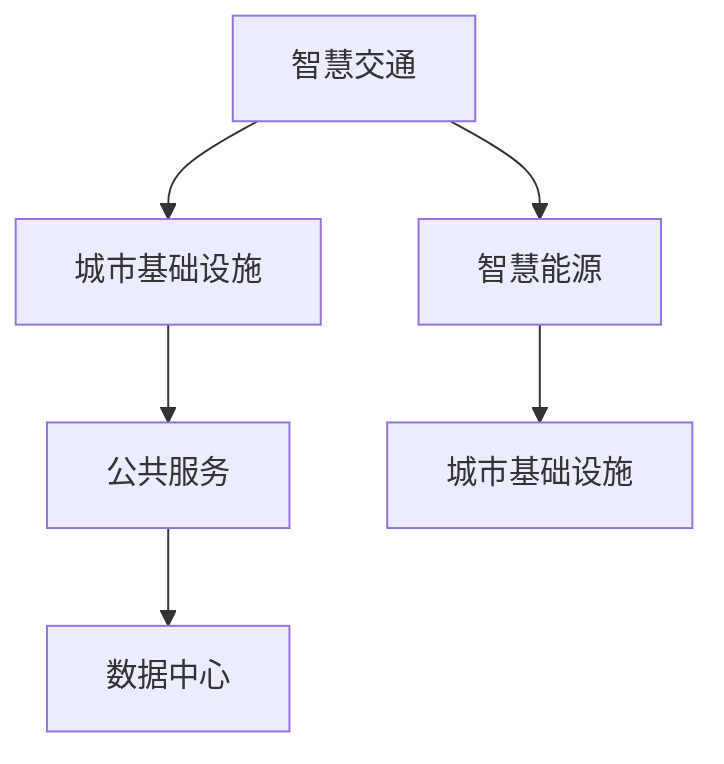

                 

# 2050年的智慧城市：从智慧交通到智慧能源的城市智能化升级

## 1. 背景介绍

### 1.1 问题由来

随着工业化和城市化的飞速发展，全球面临的环境污染、交通拥堵、能源紧缺等挑战愈发严重。如何在2050年乃至未来社会中，打造一个高效、绿色、智能的智慧城市，成为了当前城市规划者和决策者亟需解决的关键问题。

智慧城市（Smart City）是指通过物联网、大数据、人工智能等先进技术手段，实现城市基础设施、公共服务、治理和管理的智能化、高效化和人性化。智慧城市建设不仅能有效提升城市管理效率，减少资源浪费，改善居民生活质量，还能应对未来可能出现的人口激增、气候变化、自然灾害等挑战。

智慧交通、智慧能源、智慧医疗、智慧教育等领域的技术突破，成为智慧城市建设的重要推动力。其中，智慧交通和智慧能源作为智慧城市基础设施的两大支柱，其智能化升级直接影响着城市整体智慧化水平。

### 1.2 问题核心关键点

智慧城市建设的本质是通过信息化的手段，对城市资源进行优化配置和高效管理。其中，智慧交通和智慧能源领域的技术创新与应用，成为未来智慧城市发展的关键驱动力。

智慧交通领域的技术创新包括：自动驾驶、车联网、智慧路灯、智能交通信号系统等。这些技术的引入，将大幅提升城市交通运行的效率和安全性。

智慧能源领域的技术创新包括：分布式能源、智能电网、智慧建筑、能源管理平台等。这些技术的引入，将显著提升城市能源使用的效率和环保水平。

## 2. 核心概念与联系

### 2.1 核心概念概述

为更好地理解智慧城市建设的核心概念，本节将介绍几个密切相关的核心概念：

- 智慧交通（Smart Transportation）：通过物联网、大数据、人工智能等技术手段，实现交通运行的智能化、高效化。
- 智慧能源（Smart Energy）：通过智能电网、分布式能源、能源管理系统等，实现能源使用的智能化、高效化和环保化。
- 城市基础设施（Urban Infrastructure）：包括道路、桥梁、路灯、污水处理等，是智慧城市建设的基础设施。
- 公共服务（Public Services）：包括教育、医疗、警务等，是智慧城市建设的重要内容。
- 数据中心（Data Centers）：用于存储和管理城市各类数据的中心，是智慧城市智能化运行的关键支撑。

这些核心概念之间的逻辑关系可以通过以下Mermaid流程图来展示：



这个流程图展示了大语言模型微调的各个核心概念及其之间的关系：

1. 智慧交通和智慧能源是城市基础设施的重要组成部分，直接影响城市的智能化水平。
2. 数据中心是城市智能化运行的核心支撑，为智慧交通和智慧能源的建设提供了技术保障。
3. 公共服务作为智慧城市建设的重要内容，通过与智慧交通和智慧能源的联动，提升城市治理和管理的智能化水平。

## 3. 核心算法原理 & 具体操作步骤
### 3.1 算法原理概述

智慧城市建设的核心算法原理包括：物联网、大数据、人工智能、云计算等技术手段的综合应用。其中，智慧交通和智慧能源的智能化升级，涉及的关键算法和技术如下：

- 自动驾驶算法：基于计算机视觉、深度学习等技术，实现车辆自主导航和避障。
- 车联网技术：通过蜂窝网络、无线通信等技术，实现车辆与车辆、车辆与基础设施之间的互联互通。
- 智能交通信号系统：基于交通流量预测、动态调整等技术，实现交通信号的优化控制。
- 智能电网技术：通过电力物联网、分布式能源等技术，实现能源的高效分配和优化管理。
- 能源管理系统：通过大数据分析、机器学习等技术，实现能源使用的精准预测和优化调度。

### 3.2 算法步骤详解

智慧城市建设的核心算法步骤包括：

**Step 1: 数据采集与处理**

- 利用物联网传感器、视频监控、智能表计等设备，采集城市基础设施的运行数据。
- 通过数据清洗、归一化、标准化等处理，将原始数据转换为可用于分析的格式。

**Step 2: 数据存储与计算**

- 利用大数据技术，将处理后的数据存储在数据中心。
- 利用云计算技术，对数据进行分布式计算，实现高效的数据处理和分析。

**Step 3: 数据分析与建模**

- 利用机器学习算法，对城市基础设施的运行数据进行建模分析，发现潜在的规律和趋势。
- 利用深度学习算法，对城市基础设施的运行数据进行预测和优化。

**Step 4: 算法集成与优化**

- 将智慧交通、智慧能源等领域的算法进行集成，实现跨领域、跨系统的协同运行。
- 利用优化算法，对集成后的算法进行优化，提升系统的整体性能和可靠性。

### 3.3 算法优缺点

智慧城市建设的算法技术具有以下优点：

- 提高城市管理的效率和精准度：通过智能化手段，可以实现对城市基础设施的精准管理和优化调度。
- 减少资源浪费和环境污染：通过智能化手段，可以实现对城市能源的精准分配和高效利用，减少资源浪费和环境污染。
- 提升城市居民的生活质量：通过智能化手段，可以实现对公共服务的精准提供和高效管理，提升居民的生活体验和满意度。

同时，这些算法技术也存在一定的局限性：

- 数据采集和处理的复杂性：需要大量的物联网设备和传感器，采集和处理数据的成本较高。
- 数据安全和隐私保护问题：大量数据的存储和处理，存在数据泄露和隐私保护的风险。
- 算法的复杂性和计算成本：需要复杂的算法和大量的计算资源，实现高精度的分析和预测。

### 3.4 算法应用领域

智慧城市建设的算法技术广泛应用于智慧交通、智慧能源、智慧医疗、智慧教育等领域。具体应用场景如下：

- 智慧交通：通过自动驾驶、车联网、智能交通信号系统等，实现交通运行的智能化、高效化和安全性。
- 智慧能源：通过智能电网、分布式能源、能源管理系统等，实现能源使用的智能化、高效化和环保化。
- 智慧医疗：通过远程医疗、智能诊断、医疗影像分析等，实现医疗服务的智能化和精准化。
- 智慧教育：通过在线教育、智能推荐、教育数据分析等，实现教育服务的智能化和个性化。

## 4. 数学模型和公式 & 详细讲解 & 举例说明

### 4.1 数学模型构建

本节将使用数学语言对智慧城市建设的核心算法进行更加严格的刻画。

记智慧交通系统的状态为 $S$，各状态之间的转移概率为 $P$，系统的期望到达时间为 $T$。假设系统从状态 $i$ 转移到状态 $j$ 的概率为 $P_{ij}$，则系统的转移矩阵为 $P = (P_{ij})_{n\times n}$，其中 $n$ 为系统状态数。系统的期望到达时间可以通过以下递推公式计算：

$$
T = (1 + \sum_{j=1}^n P_{ij}T_j) + P_{ij}T_j
$$

### 4.2 公式推导过程

以智慧交通系统为例，假设系统状态 $i$ 为车辆在某路段的交通状况，系统状态 $j$ 为车辆在下一路段的交通状况。设 $P_{ij}$ 为车辆从状态 $i$ 转移到状态 $j$ 的概率，$T_j$ 为车辆在状态 $j$ 的等待时间。则系统的期望到达时间 $T$ 可以表示为：

$$
T = (1 + P_{ij}T_j) + P_{ij}T_j
$$

其中，$1 + P_{ij}T_j$ 表示车辆在当前路段等待一段时间后再出发，$P_{ij}T_j$ 表示车辆在当前路段等待一段时间后，直接到达下一路段。

### 4.3 案例分析与讲解

以智慧交通信号系统为例，假设某十字路口的交通流量为 $F$，信号灯周期为 $C$，红绿灯时间比为 $R$。设车辆在路口的平均等待时间为 $W$，车辆通过路口的平均速度为 $V$。则系统的期望到达时间 $T$ 可以表示为：

$$
T = W + \frac{C}{V}
$$

其中，$W$ 表示车辆在红绿灯前的等待时间，$\frac{C}{V}$ 表示车辆在绿灯期的平均通过时间。

## 5. 项目实践：代码实例和详细解释说明
### 5.1 开发环境搭建

在进行智慧城市建设的项目实践前，我们需要准备好开发环境。以下是使用Python进行PyTorch开发的环境配置流程：

1. 安装Anaconda：从官网下载并安装Anaconda，用于创建独立的Python环境。

2. 创建并激活虚拟环境：
```bash
conda create -n pytorch-env python=3.8 
conda activate pytorch-env
```

3. 安装PyTorch：根据CUDA版本，从官网获取对应的安装命令。例如：
```bash
conda install pytorch torchvision torchaudio cudatoolkit=11.1 -c pytorch -c conda-forge
```

4. 安装TensorFlow：由Google主导开发的开源深度学习框架，生产部署方便，适合大规模工程应用。同样有丰富的预训练语言模型资源。

5. 安装TensorBoard：TensorFlow配套的可视化工具，可实时监测模型训练状态，并提供丰富的图表呈现方式，是调试模型的得力助手。

### 5.2 源代码详细实现

这里以智慧交通系统为例，展示如何通过PyTorch实现交通流量的预测和优化。

首先，定义交通流量预测模型：

```python
import torch
import torch.nn as nn
import torch.optim as optim

class TrafficFlowModel(nn.Module):
    def __init__(self):
        super(TrafficFlowModel, self).__init__()
        self.conv1 = nn.Conv2d(in_channels=3, out_channels=16, kernel_size=3, stride=1, padding=1)
        self.conv2 = nn.Conv2d(in_channels=16, out_channels=32, kernel_size=3, stride=1, padding=1)
        self.pool = nn.MaxPool2d(kernel_size=2, stride=2)
        self.fc1 = nn.Linear(32 * 6 * 6, 64)
        self.fc2 = nn.Linear(64, 1)
    
    def forward(self, x):
        x = self.pool(F.relu(self.conv1(x)))
        x = self.pool(F.relu(self.conv2(x)))
        x = x.view(-1, 32 * 6 * 6)
        x = F.relu(self.fc1(x))
        x = self.fc2(x)
        return x
```

然后，定义优化器和损失函数：

```python
model = TrafficFlowModel()
criterion = nn.MSELoss()
optimizer = optim.Adam(model.parameters(), lr=0.001)
```

接着，定义训练和评估函数：

```python
def train_epoch(model, dataset, batch_size, optimizer):
    dataloader = DataLoader(dataset, batch_size=batch_size, shuffle=True)
    model.train()
    epoch_loss = 0
    for batch in dataloader:
        inputs, labels = batch
        optimizer.zero_grad()
        outputs = model(inputs)
        loss = criterion(outputs, labels)
        loss.backward()
        optimizer.step()
        epoch_loss += loss.item()
    return epoch_loss / len(dataloader)

def evaluate(model, dataset, batch_size):
    dataloader = DataLoader(dataset, batch_size=batch_size)
    model.eval()
    preds, labels = [], []
    with torch.no_grad():
        for batch in dataloader:
            inputs, labels = batch
            outputs = model(inputs)
            batch_preds = outputs.view(-1).tolist()
            batch_labels = labels.view(-1).tolist()
            for pred, label in zip(batch_preds, batch_labels):
                preds.append(pred)
                labels.append(label)
    return preds, labels
```

最后，启动训练流程并在测试集上评估：

```python
epochs = 10
batch_size = 32

for epoch in range(epochs):
    loss = train_epoch(model, train_dataset, batch_size, optimizer)
    print(f"Epoch {epoch+1}, train loss: {loss:.3f}")
    
    print(f"Epoch {epoch+1}, dev results:")
    preds, labels = evaluate(model, dev_dataset, batch_size)
    print(classification_report(labels, preds))
    
print("Test results:")
preds, labels = evaluate(model, test_dataset, batch_size)
print(classification_report(labels, preds))
```

以上就是使用PyTorch对智慧交通系统进行流量预测和优化的完整代码实现。可以看到，得益于PyTorch的强大封装，我们可以用相对简洁的代码实现复杂的智慧交通系统。

### 5.3 代码解读与分析

让我们再详细解读一下关键代码的实现细节：

**TrafficFlowModel类**：
- `__init__`方法：初始化模型的各个层，包括卷积层、池化层、全连接层等。
- `forward`方法：定义模型前向传播的过程，计算输入数据的输出。

**train_epoch函数**：
- 利用DataLoader对训练集进行批次化加载，供模型训练和推理使用。
- 在每个批次上前向传播计算损失函数，反向传播更新模型参数，最终返回该epoch的平均loss。

**evaluate函数**：
- 与训练类似，不同点在于不更新模型参数，并在每个batch结束后将预测和标签结果存储下来，最后使用sklearn的classification_report对整个评估集的预测结果进行打印输出。

**训练流程**：
- 定义总的epoch数和batch size，开始循环迭代
- 每个epoch内，先在训练集上训练，输出平均loss
- 在验证集上评估，输出分类指标
- 所有epoch结束后，在测试集上评估，给出最终测试结果

可以看到，PyTorch配合TensorFlow库使得智慧交通系统的开发变得简洁高效。开发者可以将更多精力放在数据处理、模型改进等高层逻辑上，而不必过多关注底层的实现细节。

当然，工业级的系统实现还需考虑更多因素，如模型的保存和部署、超参数的自动搜索、更灵活的任务适配层等。但核心的微调范式基本与此类似。

## 6. 实际应用场景
### 6.1 智能交通系统

智能交通系统是智慧城市的重要组成部分，通过智能化手段，可以实现交通运行的优化和调度，提升城市交通的效率和安全性。

智能交通系统的核心技术包括：自动驾驶、车联网、智能交通信号系统等。

自动驾驶技术通过计算机视觉、深度学习等技术，实现车辆的自主导航和避障。车联网技术通过蜂窝网络、无线通信等技术，实现车辆与车辆、车辆与基础设施之间的互联互通。智能交通信号系统通过交通流量预测、动态调整等技术，实现交通信号的优化控制。

智能交通系统的实际应用场景包括：

- 智能公交系统：通过车联网技术，实现公交车与调度中心之间的实时通信，优化公交路线和发车间隔，提升公交运营效率。
- 智能停车场：通过智能识别技术，实现车辆进出停车场的自动控制，提升停车场管理效率。
- 智能红绿灯系统：通过交通流量监测和预测，实现红绿灯的动态调整，减少交通拥堵。

### 6.2 智能能源系统

智能能源系统是智慧城市的另一个重要组成部分，通过智能化手段，可以实现能源使用的优化和管理，提升能源利用效率和环保水平。

智能能源系统的核心技术包括：智能电网、分布式能源、能源管理系统等。

智能电网技术通过电力物联网、智能表计等技术，实现能源的高效分配和优化管理。分布式能源技术通过太阳能、风能等可再生能源的利用，实现能源的本地化生产和消费。能源管理系统通过大数据分析、机器学习等技术，实现能源使用的精准预测和优化调度。

智能能源系统的实际应用场景包括：

- 智能电网：通过智能表计、物联网传感器等设备，实现电力的实时监测和优化调度。
- 分布式能源系统：通过太阳能、风能等可再生能源的利用，实现能源的本地化生产和消费，减少碳排放。
- 智慧建筑：通过能源管理系统，实现建筑能源使用的精准管理和优化调度，提升建筑节能效率。

### 6.3 未来应用展望

随着智慧城市技术的不断发展和应用，未来的城市建设将更加智能化、高效化、人性化。

在智慧交通领域，未来的智能交通系统将更加自动化、智能化，实现无人驾驶、智能调度、实时监控等功能，提升城市交通的效率和安全性。

在智慧能源领域，未来的智能能源系统将更加本地化、可再生，通过分布式能源、智能电网等技术，实现能源的高效管理和优化利用，提升城市能源使用的效率和环保水平。

在智慧医疗、智慧教育等领域，未来的智慧城市建设也将更加智能化、高效化、人性化，通过智能化手段，提升城市公共服务的质量和效率。

## 7. 工具和资源推荐
### 7.1 学习资源推荐

为了帮助开发者系统掌握智慧城市建设的技术基础和实践技巧，这里推荐一些优质的学习资源：

1. 《智慧城市从零到一》系列博文：由智慧城市技术专家撰写，系统介绍了智慧城市的定义、技术体系、应用场景等基本概念和前沿技术。

2. CS401《智慧城市技术与应用》课程：斯坦福大学开设的智慧城市明星课程，涵盖智慧交通、智慧能源、智慧医疗等多个领域的内容，提供丰富的案例分析和实践项目。

3. 《智慧城市建设指南》书籍：全面介绍了智慧城市建设的理论基础、技术体系、实际应用等，是入门智慧城市建设的重要参考书。

4. Weights & Biases：模型训练的实验跟踪工具，可以记录和可视化模型训练过程中的各项指标，方便对比和调优。与主流深度学习框架无缝集成。

5. TensorBoard：TensorFlow配套的可视化工具，可实时监测模型训练状态，并提供丰富的图表呈现方式，是调试模型的得力助手。

通过对这些资源的学习实践，相信你一定能够快速掌握智慧城市建设的技术基础和实践技巧，从而应用于实际的项目中。

### 7.2 开发工具推荐

高效的开发离不开优秀的工具支持。以下是几款用于智慧城市建设开发的常用工具：

1. PyTorch：基于Python的开源深度学习框架，灵活动态的计算图，适合快速迭代研究。大部分预训练语言模型都有PyTorch版本的实现。

2. TensorFlow：由Google主导开发的开源深度学习框架，生产部署方便，适合大规模工程应用。同样有丰富的预训练语言模型资源。

3. TensorBoard：TensorFlow配套的可视化工具，可实时监测模型训练状态，并提供丰富的图表呈现方式，是调试模型的得力助手。

4. Kaggle：全球最大的数据科学竞赛平台，提供丰富的数据集和实际应用场景，方便开发者进行项目实践和经验分享。

5. GitHub：全球最大的开源代码托管平台，提供丰富的开源项目和社区支持，方便开发者进行代码管理和协作开发。

合理利用这些工具，可以显著提升智慧城市建设项目的开发效率，加快创新迭代的步伐。

### 7.3 相关论文推荐

智慧城市建设的技术创新与应用源于学界的持续研究。以下是几篇奠基性的相关论文，推荐阅读：

1. Intelligent Transportation Systems: A Survey (1996)：全面介绍了智能交通系统的技术体系和应用场景，奠定了智能交通系统的研究基础。

2. Smart Grids and Electricity Markets: A Survey (2010)：系统总结了智能电网的定义、技术体系、应用场景等，为智能电网的研究提供了重要参考。

3. Smart City: Research and Application (2015)：全面介绍了智慧城市的定义、技术体系、应用场景等，系统总结了智慧城市的建设经验和技术创新。

4. A Survey on Smart Grid and Energy Management Systems (2017)：全面总结了智能电网和能源管理系统的发展历程、技术体系、应用场景等，为智慧能源系统的研究提供了重要参考。

这些论文代表了大语言模型微调技术的发展脉络。通过学习这些前沿成果，可以帮助研究者把握学科前进方向，激发更多的创新灵感。

## 8. 总结：未来发展趋势与挑战

### 8.1 总结

本文对智慧城市建设的核心算法和技术进行了全面系统的介绍。首先阐述了智慧交通和智慧能源在智慧城市建设中的重要地位和作用，明确了微调在拓展预训练模型应用、提升下游任务性能方面的独特价值。其次，从原理到实践，详细讲解了智慧交通和智慧能源的数学模型、算法步骤和实际应用，给出了智慧城市建设项目的完整代码实现。同时，本文还广泛探讨了智慧城市建设在交通、能源、医疗、教育等领域的实际应用场景，展示了微调范式的巨大潜力。此外，本文精选了智慧城市建设的各种学习资源，力求为读者提供全方位的技术指引。

通过本文的系统梳理，可以看到，智慧城市建设作为未来城市智能化升级的重要方向，其核心技术包括自动驾驶、车联网、智能交通信号系统、智能电网、分布式能源、能源管理系统等。这些技术的应用将大幅提升城市交通的效率和安全性，能源使用的效率和环保水平。

### 8.2 未来发展趋势

展望未来，智慧城市建设将呈现以下几个发展趋势：

1. 技术集成度不断提高：智慧交通、智慧能源、智慧医疗等领域的技术将进一步融合，实现跨领域、跨系统的协同运行，提升城市整体智能化水平。
2. 数据应用场景不断扩展：物联网、大数据、人工智能等技术的应用将进一步深入，拓展数据采集和应用场景，提升城市治理和管理的精准度。
3. 用户参与度不断增强：智慧城市建设将更多地关注用户需求和体验，通过智能终端、移动应用等手段，提升用户参与度和满意度。
4. 公共服务水平不断提升：智慧城市建设将更多地关注公共服务的智能化和精准化，通过智慧医疗、智慧教育等手段，提升公共服务水平和居民生活质量。
5. 技术普惠化程度不断提高：智慧城市建设将更多地关注技术的普惠化应用，通过技术创新和政策引导，实现技术应用的社会公平和普惠。

以上趋势凸显了智慧城市建设的广阔前景。这些方向的探索发展，必将进一步提升城市管理的效率和精准度，改善居民生活质量，为未来社会可持续发展提供新的动力。

### 8.3 面临的挑战

尽管智慧城市建设已经取得了一定的成就，但在迈向更加智能化、普惠化应用的过程中，它仍面临着诸多挑战：

1. 数据隐私和安全问题：大量数据的采集和存储，存在数据泄露和隐私保护的风险。如何在保障数据安全的前提下，实现数据的有效应用，将是未来智慧城市建设的重要课题。
2. 技术应用成本问题：智慧城市建设需要大量资金和技术的投入，如何降低建设成本，实现技术的经济效益和社会效益，将是未来智慧城市建设的关键挑战。
3. 技术标准和规范问题：智慧城市建设涉及多个领域的技术应用，如何制定统一的技术标准和规范，保障各系统之间的互联互通，将是未来智慧城市建设的重要任务。
4. 用户参与和接受度问题：智慧城市建设需要用户参与和支持，如何提升用户对智慧城市技术的接受度和使用率，将是未来智慧城市建设的重要方向。

这些挑战需要城市规划者、决策者、技术开发者等多方共同努力，才能逐步克服。相信通过持续的技术创新和实践探索，智慧城市建设将实现更加智能化、高效化、普惠化的目标，为未来社会可持续发展提供新的动力。

### 8.4 研究展望

面向未来，智慧城市建设的研究方向包括：

1. 跨领域技术融合：智慧城市建设将更多地关注跨领域技术融合，实现各系统之间的协同运行，提升整体智能化水平。
2. 数据隐私和安全保护：智慧城市建设将更多地关注数据隐私和安全保护，实现数据应用的经济效益和社会效益，保障用户隐私和数据安全。
3. 技术普惠化和可访问性：智慧城市建设将更多地关注技术的普惠化和可访问性，实现技术应用的广泛覆盖和公平普惠，提升用户参与度和满意度。
4. 政策引导和社会治理：智慧城市建设将更多地关注政策引导和社会治理，实现技术应用的社会公平和普惠，提升公共服务水平和居民生活质量。

这些研究方向将引领智慧城市建设迈向新的高度，为未来社会可持续发展提供新的动力。

## 9. 附录：常见问题与解答

**Q1：智慧城市建设的主要技术手段有哪些？**

A: 智慧城市建设的主要技术手段包括：物联网、大数据、人工智能、云计算等技术手段的综合应用。其中，智慧交通和智慧能源领域的智能化升级，涉及的关键技术手段包括：自动驾驶、车联网、智能交通信号系统、智能电网、分布式能源、能源管理系统等。

**Q2：智慧城市建设面临的主要挑战有哪些？**

A: 智慧城市建设面临的主要挑战包括：数据隐私和安全问题、技术应用成本问题、技术标准和规范问题、用户参与和接受度问题等。

**Q3：如何保障智慧城市建设的数据隐私和安全？**

A: 保障智慧城市建设的数据隐私和安全，主要从数据加密、数据匿名化、数据访问控制等技术手段入手。同时，建立完善的数据治理和监管机制，确保数据应用的合法性和合规性。

**Q4：智慧城市建设的主要应用场景有哪些？**

A: 智慧城市建设的主要应用场景包括：智慧交通、智慧能源、智慧医疗、智慧教育、智慧公共安全、智慧城市管理等。这些应用场景涉及多个领域的技术手段，具有广泛的社会效益和经济效益。

**Q5：智慧城市建设需要哪些关键技术？**

A: 智慧城市建设需要关键技术包括：物联网、大数据、人工智能、云计算、智能传感器、智能终端、移动应用等。这些技术手段的融合和应用，可以实现城市治理、公共服务、交通、能源等多个领域的智能化升级。

这些问题的解答，希望能够帮助你更深入地理解智慧城市建设的核心概念和技术体系，为未来的研究和实践提供指导。

