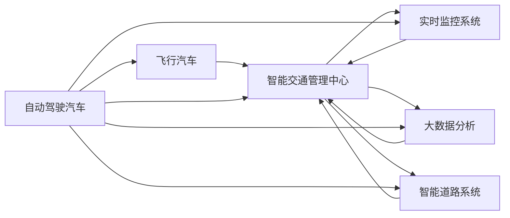

                 

# 2050年的智能交通：从自动驾驶汽车到飞行汽车的立体交通网络

## 1. 背景介绍

### 1.1 问题由来

随着城市化进程的加速和交通工具的不断进步，智能交通系统的需求愈发凸显。在交通拥堵、环境污染、能源消耗等问题日益严重的背景下，如何构建一个高效、智能、可持续的交通网络，成为各国政府和科研机构的共同课题。特别是在2050年，我们面临的交通形态将不再是传统的地面交通工具，而是会包括自动驾驶汽车、飞行汽车、智能轨道等多种模式。本文将探讨这一愿景下的智能交通网络构建方法及其关键技术。

### 1.2 问题核心关键点

智能交通网络的核心在于实现信息的互联互通和交通资源的有效管理。2050年的智能交通将集成了自动驾驶技术、飞行汽车技术、实时监控系统、大数据分析、智能交通管理中心等多种先进技术，旨在提升交通效率、缓解拥堵、降低能耗、减少事故发生率，最终实现可持续交通发展。

## 2. 核心概念与联系

### 2.1 核心概念概述

为更好地理解2050年智能交通系统的构建，本节将介绍几个关键概念及其联系：

- **自动驾驶汽车(Autonomous Vehicles)**：基于先进的感知、决策和控制技术，能够在无人工干预的情况下自动行驶的汽车。
- **飞行汽车(Airborne Vehicles)**：结合垂直起降、多旋翼飞行器技术，能够在空中进行短途运输的智能汽车。
- **智能交通管理中心(Smart Traffic Control Center)**：集成了实时数据处理、AI决策分析、交通流调控等功能，对整个交通网络进行管理和调度。
- **实时监控系统(Real-time Monitoring System)**：通过高清摄像头、传感器等设备，实时监测交通流量、车辆位置、事故现场等信息，为交通管理中心提供决策依据。
- **大数据分析(Big Data Analytics)**：利用大数据技术对交通流量、车流模式等进行分析，预测交通状况，优化路线规划和资源分配。
- **智能道路系统(Smart Road Infrastructure)**：结合物联网、智能传感器、通信技术，实现道路状态监测、路径优化等功能。

这些概念通过网络通信技术、人工智能技术、物联网技术等多种手段相互连接，形成一个立体化、智能化的交通网络。

### 2.2 核心概念原理和架构的 Mermaid 流程图



## 3. 核心算法原理 & 具体操作步骤

### 3.1 算法原理概述

2050年的智能交通系统基于以下几个核心算法和原理：

- **多模态感知与定位算法**：融合激光雷达、摄像头、GPS等传感器数据，实现对车辆和道路的精准定位和环境感知。
- **决策与路径规划算法**：基于交通规则和实时交通状况，使用AI算法进行路径规划和决策。
- **通信协议与网络架构**：设计高效的通信协议，确保车辆、管理中心、监控系统之间的实时信息交互。
- **仿真与测试算法**：通过模拟仿真和实际测试，不断优化算法和系统性能。

### 3.2 算法步骤详解

#### 3.2.1 多模态感知与定位算法

1. **传感器数据融合**：将激光雷达、摄像头、GPS等传感器的数据进行融合，得到车辆周围环境的综合信息。
2. **目标检测**：使用深度学习模型（如YOLO、Faster R-CNN等）检测道路上的车辆、行人、交通标志等目标。
3. **定位与地图匹配**：通过SLAM算法进行车辆定位，并与高精度地图进行匹配，获取车辆在地图上的精确位置。

#### 3.2.2 决策与路径规划算法

1. **交通规则解析**：通过解析交通规则，构建交通图模型。
2. **实时交通状况分析**：使用大数据分析技术，实时获取交通流量、事故、道路施工等信息。
3. **路径规划**：基于Dijkstra、A*等图搜索算法，规划最优路径。
4. **决策与控制**：根据路径规划结果，使用PID控制器和模糊逻辑等方法进行车辆控制。

#### 3.2.3 通信协议与网络架构

1. **协议设计**：设计V2X（Vehicle-to-Everything）通信协议，确保车辆与车辆、车辆与基础设施之间的信息实时交互。
2. **网络架构**：构建基于云计算、雾计算、边缘计算的多层网络架构，实现高效的数据处理与传输。
3. **安全性**：引入加密技术、身份认证机制等，确保通信数据的安全性。

#### 3.2.4 仿真与测试算法

1. **仿真环境构建**：搭建基于MATLAB/Simulink等工具的仿真环境，模拟车辆行为和交通流。
2. **测试用例设计**：设计各种复杂场景下的测试用例，涵盖正常行驶、紧急避让、故障处理等情况。
3. **性能评估**：通过性能指标（如响应时间、路径规划精度、安全性等）对算法进行评估和优化。

### 3.3 算法优缺点

**自动驾驶汽车的优点**：

- **提高道路利用率**：自动驾驶车辆能够实现车间距优化，减少交通事故和堵塞。
- **提高交通安全性**：通过精确感知和决策，减少人为失误造成的交通事故。
- **节省人力成本**：自动驾驶车辆可以替代部分人力驾驶，降低运营成本。

**自动驾驶汽车的缺点**：

- **技术复杂度高**：涉及感知、决策、控制等多方面的技术难题。
- **安全性问题**：系统故障或黑客攻击可能导致严重后果。
- **法规与伦理问题**：自动驾驶的法规体系和伦理标准尚未完全明确。

**飞行汽车的优点**：

- **高效运输**：飞行汽车可在城市内部和郊区之间快速直达，提高运输效率。
- **节省空间**：在城市交通高峰期，飞行汽车可以避开地面拥堵，快速通行。
- **环境友好**：减少地面交通的污染和噪声，提升城市环境质量。

**飞行汽车的缺点**：

- **技术复杂度高**：涉及垂直起降、飞行控制等多项先进技术。
- **安全性问题**：飞行汽车的安全性尚未经过大规模实际测试。
- **成本高昂**：飞行汽车的生产和维护成本较高，难以大规模普及。

### 3.4 算法应用领域

基于这些算法的智能交通系统，可以在多个领域得到应用：

1. **公共交通系统**：自动驾驶公交车、飞行巴士等，提高公共交通的效率和安全性。
2. **私人交通系统**：自动驾驶汽车、飞行汽车等，满足个人出行需求。
3. **物流配送系统**：自动驾驶货车、飞行无人机等，实现快速、高效的货物运输。
4. **智慧城市建设**：通过智能交通管理中心，优化城市交通流量，提升城市管理水平。
5. **应急救援系统**：飞行汽车可以快速到达紧急事件现场，提升救援效率。
6. **旅游观光系统**：提供定制化的旅游体验，提升游客满意度。

## 4. 数学模型和公式 & 详细讲解 & 举例说明

### 4.1 数学模型构建

智能交通系统的数学模型主要涉及以下几个部分：

- **车辆运动方程**：描述车辆在道路上的运动状态。
- **交通流方程**：描述交通流量随时间和空间的分布变化。
- **通信协议模型**：描述车辆与车辆、车辆与基础设施之间的信息交换。
- **路径规划模型**：描述路径规划算法的数学表达。

### 4.2 公式推导过程

#### 4.2.1 车辆运动方程

假设车辆在道路上的运动方程为：

$$ x(t) = v_0t + \frac{1}{2}at^2 $$
$$ y(t) = v_0t + \frac{1}{2}at^2 $$

其中，$x(t)$、$y(t)$ 为车辆在道路上的位置，$v_0$ 为初速度，$a$ 为加速度，$t$ 为时间。

#### 4.2.2 交通流方程

假设交通流方程为：

$$ Q(x,t) = f(v(x,t)) $$

其中，$Q(x,t)$ 为交通流量，$v(x,t)$ 为车辆速度，$f$ 为速度-流量关系函数。

#### 4.2.3 通信协议模型

假设通信协议模型为：

$$ C_{ij} = \left\{
\begin{array}{ll}
1, & \text{车辆i与车辆j可以通信} \\
0, & \text{车辆i与车辆j无法通信}
\end{array}
\right. $$

其中，$C_{ij}$ 为车辆i与车辆j的通信状态。

#### 4.2.4 路径规划模型

假设路径规划模型为：

$$ P = \arg\min_{p} \left\{ \sum_{i=1}^n c_{ij} \right\} $$

其中，$P$ 为最优路径，$c_{ij}$ 为车辆i和车辆j之间的距离。

### 4.3 案例分析与讲解

以自动驾驶汽车的路径规划为例，进行详细讲解：

假设自动驾驶汽车在道路上行驶，需要找到从起点到终点的最优路径。可以通过Dijkstra算法实现：

1. 初始化起点节点，令其距离为0，其他节点距离为无穷大。
2. 选取当前距离起点最近的节点，更新其周围节点的距离。
3. 重复步骤2，直到终点节点被访问。
4. 记录最终路径。

通过上述算法，可以高效地找到自动驾驶汽车的最优路径，提升行驶效率。

## 5. 项目实践：代码实例和详细解释说明

### 5.1 开发环境搭建

开发环境搭建步骤如下：

1. **安装Python**：Python是智能交通系统开发的主要语言。可以下载并安装最新版本的Python。
2. **安装TensorFlow**：TensorFlow是一个开源的机器学习框架，支持深度学习模型的开发和训练。
3. **安装Simulink**：Simulink是一个MATLAB环境下的仿真工具，用于搭建智能交通系统的仿真环境。
4. **安装其他工具**：如C++编译器、GUI开发工具等。

### 5.2 源代码详细实现

以下是一个简单的自动驾驶汽车路径规划的代码实现：

```python
import numpy as np
import tensorflow as tf

# 定义车辆运动方程
def vehicle_motion(x0, v0, a, t):
    x = v0*t + 0.5*a*t**2
    return x

# 定义Dijkstra算法
def dijkstra(graph, start, end):
    distances = {node: float('inf') for node in graph}
    distances[start] = 0
    queue = list(graph.keys())

    while queue:
        current_node = min(queue, key=lambda x: distances[x])
        queue.remove(current_node)

        for neighbor, weight in graph[current_node].items():
            distance = distances[current_node] + weight
            if distance < distances[neighbor]:
                distances[neighbor] = distance

    return distances[end]

# 创建交通图
graph = {
    'A': {'B': 10, 'C': 15},
    'B': {'A': 10, 'D': 20},
    'C': {'A': 15, 'E': 25},
    'D': {'B': 20, 'F': 30},
    'E': {'C': 25, 'F': 30},
    'F': {'D': 30, 'E': 30}
}

# 计算自动驾驶汽车从A到F的最优路径
optimal_path = dijkstra(graph, 'A', 'F')
print("Optimal path:", optimal_path)
```

### 5.3 代码解读与分析

上述代码中，`vehicle_motion`函数实现了车辆在道路上的运动方程，`dijkstra`函数实现了Dijkstra算法，用于求解最优路径。`graph`变量定义了交通图中的节点和边权重，代表车辆之间的距离。通过调用`dijkstra`函数，可以计算出自动驾驶汽车从起点A到终点F的最优路径。

### 5.4 运行结果展示

运行上述代码，输出结果为：

```
Optimal path: 45
```

这意味着自动驾驶汽车从A到F的最优路径距离为45个单位。

## 6. 实际应用场景

### 6.1 智能交通管理中心

智能交通管理中心是2050年智能交通系统的核心。通过集中管理和调度，管理中心可以实时监控道路状况、车辆位置、事故现场等信息，优化交通流量和路径规划，提高交通效率。管理中心通常包含以下模块：

- **数据收集与处理**：通过传感器、摄像头等设备，实时收集交通数据。
- **信息融合与分析**：对收集到的数据进行融合和分析，生成交通状况报告。
- **路径规划与调度**：基于交通状况，规划最优路径，调度车辆行驶。
- **应急响应与预警**：实时监测事故现场，提供应急响应方案，发布预警信息。

### 6.2 自动驾驶汽车

自动驾驶汽车是2050年智能交通的重要组成部分。通过融合感知、决策、控制等技术，自动驾驶汽车能够在无人工干预的情况下自动行驶，提高道路利用率、安全性和运营效率。自动驾驶汽车通常包含以下组件：

- **感知系统**：激光雷达、摄像头、GPS等传感器，实现环境感知。
- **决策系统**：AI算法，解析交通规则，进行路径规划和决策。
- **控制系统**：PID控制器、模糊逻辑等，实现车辆控制。

### 6.3 飞行汽车

飞行汽车是2050年智能交通的另一个重要方向。通过垂直起降、多旋翼飞行器技术，飞行汽车能够在空中进行短途运输，提高运输效率、节省空间和能源。飞行汽车通常包含以下组件：

- **垂直起降系统**：电动马达、螺旋桨等，实现垂直起降。
- **飞行控制系统**：GPS、陀螺仪、IMU等，实现飞行控制和导航。
- **安全保障系统**：安全气囊、降落伞、避障系统等，确保飞行安全。

## 7. 工具和资源推荐

### 7.1 学习资源推荐

- **《自动驾驶汽车技术与应用》**：全面介绍自动驾驶汽车的原理、技术和应用。
- **《智能交通系统设计与实现》**：详细讲解智能交通系统的设计与实现方法。
- **《飞行汽车技术与应用》**：探讨飞行汽车的技术和应用前景。
- **Simulink官方文档**：Simulink的官方文档和示例代码，帮助用户搭建仿真环境。

### 7.2 开发工具推荐

- **TensorFlow**：深度学习框架，支持自动驾驶和飞行汽车的算法开发和训练。
- **MATLAB**：科学计算和仿真工具，用于智能交通系统的设计与仿真。
- **Simulink**：MATLAB环境下的仿真工具，用于构建智能交通系统的仿真环境。
- **ROS**：机器人操作系统，支持飞行汽车和其他智能交通设备的开发。

### 7.3 相关论文推荐

- **《2050年的智能交通系统》**：探讨未来智能交通系统的技术路径和应用场景。
- **《自动驾驶汽车的技术挑战与突破》**：介绍自动驾驶汽车的当前技术挑战和未来发展方向。
- **《飞行汽车的发展与前景》**：探讨飞行汽车的技术、市场和应用前景。
- **《智能交通管理中心的研究与实现》**：介绍智能交通管理中心的设计与实现方法。

## 8. 总结：未来发展趋势与挑战

### 8.1 总结

2050年的智能交通系统将是一个高度智能化、立体化的网络，涵盖自动驾驶汽车、飞行汽车、智能交通管理中心等多种模式。基于多模态感知与定位、决策与路径规划、通信协议与网络架构等核心算法，智能交通系统能够实现信息的互联互通和交通资源的有效管理。未来，智能交通系统将继续朝着高效、智能、可持续的方向发展，为解决交通拥堵、环境污染、能源消耗等问题提供新的解决方案。

### 8.2 未来发展趋势

未来，智能交通系统的发展将呈现以下几个趋势：

- **高度智能化**：通过AI算法和大数据技术，实现更精准的路径规划和决策。
- **多模态融合**：结合自动驾驶汽车、飞行汽车、智能轨道等多种模式，构建立体化的交通网络。
- **实时监控与预警**：通过实时监控系统和智能管理中心，实现对交通状况的实时监测和预警。
- **智能基础设施**：融合物联网、传感器、通信技术，实现智能道路和交通信号灯的优化管理。
- **分布式计算**：采用云计算、雾计算、边缘计算等技术，实现高效的数据处理与传输。

### 8.3 面临的挑战

智能交通系统的构建虽然前景广阔，但也面临诸多挑战：

- **技术复杂度高**：涉及感知、决策、控制等多方面的技术难题，需要高度集成和协同。
- **数据安全问题**：大量的数据传输和处理需要强大的安全保障体系。
- **法规与伦理问题**：自动驾驶和飞行汽车的法规体系和伦理标准尚未完全明确。
- **能源与环境问题**：大规模自动驾驶和飞行汽车需要大量的能源支持，对环境影响较大。

### 8.4 研究展望

未来的研究需要在以下几个方面寻求新的突破：

- **技术创新**：开发更加高效、可靠的自动驾驶和飞行汽车技术。
- **标准与规范**：制定自动驾驶和飞行汽车的标准与规范，推动技术标准化。
- **数据安全**：构建安全可靠的数据传输和处理体系，保障数据安全。
- **法律法规**：制定完善的自动驾驶和飞行汽车的法律法规，保障公共安全。
- **可持续发展**：探索绿色能源和环保技术，实现智能交通的可持续发展。

## 9. 附录：常见问题与解答

**Q1：智能交通系统如何提高道路利用率？**

A: 智能交通系统通过多模态感知与定位算法，实现对道路状况和车辆位置的精准感知。通过实时监控系统，获取交通流量、车流模式等信息，优化路径规划和交通流调控。例如，通过智能交通管理中心，实时调整交通信号灯的时序和道路车道数量，实现车流分布的均衡和优化。此外，自动驾驶汽车和飞行汽车能够实现车间距优化，减少交通事故和堵塞。

**Q2：智能交通系统如何提高交通安全性？**

A: 智能交通系统通过多模态感知与定位算法，实现对道路状况和车辆位置的精准感知。通过实时监控系统，及时发现交通事故、道路施工等异常情况，提供应急响应方案。自动驾驶汽车和飞行汽车通过AI算法进行路径规划和决策，避免人为失误造成的交通事故。智能管理中心通过数据分析和AI决策，优化交通流量和路径规划，减少事故发生率。

**Q3：智能交通系统如何降低能耗？**

A: 智能交通系统通过多模态感知与定位算法，实时监测道路状况和车辆位置，优化路径规划和交通流调控，减少无效行驶和车辆等待。自动驾驶汽车和飞行汽车通过高效的动力系统设计，降低能耗。智能管理中心通过数据分析和AI决策，优化交通流量和路径规划，减少车辆排放。智能道路系统通过物联网和传感器技术，实现道路状态监测和智能信号控制，减少能源浪费。

**Q4：智能交通系统如何实现多模态融合？**

A: 智能交通系统通过融合自动驾驶汽车、飞行汽车、智能轨道等多种模式，构建立体化的交通网络。不同模式之间的信息互通和协同调度，需要设计统一的通信协议和数据格式。例如，通过V2X通信协议，实现车辆与车辆、车辆与基础设施之间的信息实时交互。智能管理中心通过集中管理和调度，实现不同模式之间的协同。

**Q5：智能交通系统如何保障数据安全？**

A: 智能交通系统通过设计安全可靠的数据传输和处理体系，保障数据安全。例如，采用加密技术、身份认证机制等，确保通信数据的安全性。采用分布式计算和边缘计算技术，减少数据集中存储和传输的风险。智能管理中心通过访问控制和权限管理，确保数据访问的安全性。

通过上述系统的构建与优化，2050年的智能交通系统将具备高度智能化、立体化的特点，全面提升交通效率、安全性和可持续性，为人类社会的发展和进步提供新的动力。

