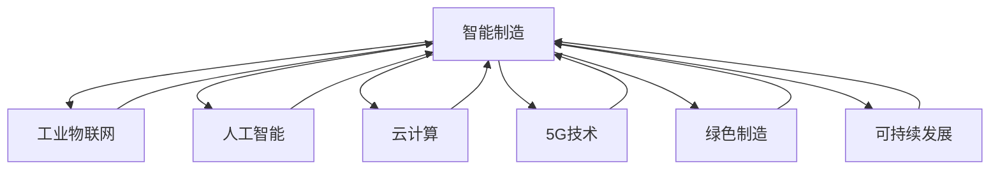

                 

# 2050年的智能制造：从工业4.0到工业5.0的制造业升级

> 关键词：工业5.0,智能制造,物联网(IoT),人工智能(AI),机器学习,云计算,5G技术,绿色制造,可持续发展

## 1. 背景介绍

### 1.1 工业制造的发展历程
自18世纪工业革命以来，人类社会的生产方式发生了翻天覆地的变化。从最初的机械化到电气化，再到数字化，再到智能化，制造业正在经历一次又一次的变革。每一轮变革，都在大幅提升生产效率，降低成本，改变产业格局。

1. **工业1.0**：以蒸汽机的发明与应用为标志，机器开始大规模替代人力，标志着传统手工制造业的衰落和工业制造的开始。

2. **工业2.0**：电力的广泛应用，流水线生产方式的出现，大幅提高了生产效率。制造过程的标准化和规模化成为可能。

3. **工业3.0**：计算机和自动化技术的应用，使得生产过程的自动化水平大大提升，信息流和物质流的协同更加紧密。

4. **工业4.0**：互联网与物联网技术的应用，使得生产过程实现高度信息化和智能化，推动了制造系统的全面变革。

5. **工业5.0**：进一步融入人工智能、区块链、5G等新兴技术，实现制造过程的全生命周期智能化、可持续发展，进入智能制造新时代。

### 1.2 工业5.0的引入背景
工业5.0不仅是在工业4.0的基础上进一步升级，更是在技术、环境、经济、社会等多方面综合考虑下的全面转型。面对日益严峻的环境挑战、资源短缺和劳动力成本上升等问题，工业5.0提出了绿色制造、可持续发展、人机协作等新理念，旨在打造更智能、更环保、更和谐的制造体系。

## 2. 核心概念与联系

### 2.1 核心概念概述

为了更深入地理解工业5.0的概念，这里将介绍几个关键概念：

1. **智能制造**：基于人工智能、大数据、物联网等技术，实现制造过程的智能化、网络化和服务化，提升制造系统的灵活性和效率。

2. **工业物联网(IoT)**：通过传感器、嵌入式系统、云计算等技术，实现对物理设备的全面互联，实现数据共享和远程监控。

3. **人工智能(AI)**：包括机器学习、自然语言处理、计算机视觉等技术，通过深度学习等方法，实现智能决策和智能控制。

4. **云计算**：提供可扩展、弹性的计算资源和数据存储，实现数据的高效处理和实时分析。

5. **5G技术**：提供更高的网络带宽、更低的时延、更大的连接容量，支持实时数据传输和高度智能化的制造系统。

6. **绿色制造**：通过清洁能源、智能资源管理、废物回收利用等手段，实现生产过程的节能减排和资源高效利用。

7. **可持续发展**：在确保经济增长的同时，兼顾社会、环境等多方面的综合发展，实现长期和谐发展。

### 2.2 核心概念联系
这些核心概念相互关联，共同构成了工业5.0的技术体系。其联系如下图所示：



这个图展示了几大核心概念之间的联系：

- 智能制造是工业5.0的核心目标，通过融合工业物联网、人工智能、云计算等技术，实现制造过程的智能化。
- 工业物联网为智能制造提供了数据采集、传输、共享的基础。
- 人工智能为智能制造提供了智能决策和智能控制的能力。
- 云计算为智能制造提供了计算和存储资源的支持。
- 5G技术为智能制造提供了高速、稳定、可靠的网络连接。
- 绿色制造和可持续发展是工业5.0的重要方向，确保制造过程的环保和社会效益。

这些概念共同作用，推动着工业5.0的实现，构建一个更加智能、绿色、可持续的制造系统。

## 3. 核心算法原理 & 具体操作步骤
### 3.1 算法原理概述

工业5.0的核心算法原理主要围绕以下几个方面展开：

1. **数据采集与传输**：通过工业物联网设备，实现对制造过程的实时数据采集和传输。

2. **数据分析与建模**：利用人工智能技术，对采集到的数据进行分析和建模，实现预测与优化。

3. **智能决策与控制**：基于数据和模型，实现制造过程的智能决策和控制。

4. **人机协作与协同**：通过增强现实、机器人等技术，实现人机协作，提升制造系统的灵活性和效率。

5. **资源优化与管理**：通过智能资源管理系统，实现资源的动态优化与合理分配。

6. **环境监测与保护**：通过环境传感器和智能监控系统，实现对制造过程的环境监测与保护。

### 3.2 算法步骤详解

1. **数据采集与预处理**
   - 部署工业物联网设备，收集制造过程中的各项数据，如设备状态、能源消耗、原材料消耗等。
   - 对采集的数据进行清洗、去噪和标准化处理，确保数据的质量和一致性。

2. **数据分析与建模**
   - 利用机器学习算法对清洗后的数据进行建模，建立预测模型，如预测设备故障、优化生产调度等。
   - 采用深度学习技术，训练智能决策模型，如强化学习、遗传算法等。

3. **智能决策与控制**
   - 根据实时数据和预测模型，自动调整制造过程，如调节设备参数、优化生产计划等。
   - 通过智能决策系统，实现对异常情况的快速响应和处理。

4. **人机协作与协同**
   - 引入增强现实技术，为工人提供实时的制造信息指导。
   - 部署机器人、自动化设备，实现对复杂、重复性高任务的高效处理。
   - 建立智能协同平台，实现人机间的无缝协作和信息共享。

5. **资源优化与管理**
   - 构建智能资源管理系统，实现资源的动态优化与分配。
   - 利用数据分析和预测，优化生产计划和供应链管理，减少资源浪费。

6. **环境监测与保护**
   - 部署环境传感器，实时监测制造过程的环境参数，如温度、湿度、噪音等。
   - 根据监测数据，自动调整生产过程，减少对环境的负面影响。

### 3.3 算法优缺点

工业5.0的算法具备以下优点：

1. **效率提升**：通过智能决策和优化，大幅提升生产效率，降低资源浪费。
2. **质量保障**：通过数据分析和智能控制，提高产品质量和一致性。
3. **灵活性增强**：通过人机协作和智能协同，实现制造系统的高度灵活性。
4. **安全性提升**：通过实时监测和快速响应，保障生产过程的安全性。
5. **环境友好**：通过资源优化和环境监测，实现绿色制造和可持续发展。

同时，也存在一些缺点：

1. **初始投资高**：引入新技术和设备需要较高的初始投资成本。
2. **技术复杂性高**：需要高度专业化的技术人才进行开发和维护。
3. **数据安全风险**：大量数据的采集和传输可能带来数据安全风险。
4. **对基础设施依赖性强**：对网络、计算等基础设施要求较高。

### 3.4 算法应用领域

工业5.0的算法广泛应用于以下领域：

1. **智能工厂**：通过工业物联网、人工智能等技术，实现制造过程的全面智能化。
2. **智能仓储**：利用自动化设备、智能算法，实现仓储物流的自动化和优化。
3. **智能物流**：通过物联网、云计算等技术，实现物流过程的透明化和高效化。
4. **智能能源管理**：利用数据分析和预测技术，优化能源使用，实现绿色制造。
5. **智能维护**：通过预测性维护，提前发现设备故障，减少停机时间，提高生产效率。

这些领域的应用，体现了工业5.0技术的广泛性和深入性，推动着传统制造向智能制造的全面升级。

## 4. 数学模型和公式 & 详细讲解  
### 4.1 数学模型构建

为了更好地理解工业5.0的核心算法，这里将从数学模型角度进行详细讲解。

**数据采集与预处理模型**：

假设采集到的数据为 $x_t \in \mathbb{R}^n$，其中 $t$ 表示时间戳。预处理模型通过 $F_{pre}(x_t)$ 对数据进行清洗、去噪和标准化，得到 $x_t^{\prime}$。

$$
x_t^{\prime} = F_{pre}(x_t)
$$

**数据分析与建模模型**：

采用线性回归模型 $F_{reg}(x_t)$ 对数据进行建模，其中 $x_t$ 为输入特征， $y_t$ 为输出标签。模型参数为 $\theta$，损失函数为 $L(\theta)$，则最小化损失函数的目标为：

$$
\hat{\theta} = \mathop{\arg\min}_{\theta} \sum_{t=1}^{T} L(F_{reg}(x_t), y_t)
$$

**智能决策与控制模型**：

采用强化学习模型 $F_{rl}(x_t)$ 对制造过程进行智能决策和控制，其中 $x_t$ 为输入状态， $a_t$ 为输出动作， $r_t$ 为奖励， $F_{rl}$ 为强化学习算法。

$$
a_t = F_{rl}(x_t)
$$

**人机协作与协同模型**：

通过增强现实技术 $F_{ar}(x_t)$，为工人提供实时的制造信息指导，其中 $x_t$ 为工人状态， $F_{ar}$ 为增强现实系统。

$$
\text{指导信息} = F_{ar}(x_t)
$$

**资源优化与管理模型**：

采用线性规划模型 $F_{lp}(x_t)$ 对制造过程中的资源进行优化和管理，其中 $x_t$ 为资源需求， $c_t$ 为资源成本， $A_t$ 为资源限制条件。

$$
\text{优化结果} = F_{lp}(x_t, c_t, A_t)
$$

**环境监测与保护模型**：

通过环境传感器 $F_{env}(x_t)$ 对制造过程进行环境监测，其中 $x_t$ 为环境参数， $T_t$ 为时间戳。

$$
T_t = F_{env}(x_t)
$$

### 4.2 公式推导过程

1. **数据采集与预处理公式推导**
   - 假设原始数据为 $x_t = (x_{t1}, x_{t2}, ..., x_{tn})$。
   - 预处理公式为 $x_t^{\prime} = (x_{t1}^{\prime}, x_{t2}^{\prime}, ..., x_{tn}^{\prime})$。
   - 预处理函数 $F_{pre}$ 包括去噪、标准化等操作。

2. **数据分析与建模公式推导**
   - 假设输入特征为 $x_t = (x_{t1}, x_{t2}, ..., x_{tn})$。
   - 输出标签为 $y_t = (y_{t1}, y_{t2}, ..., y_{tn})$。
   - 采用线性回归模型 $F_{reg}(x_t) = \theta \cdot x_t$，其中 $\theta$ 为模型参数。
   - 损失函数 $L(\theta)$ 为均方误差，即 $L(\theta) = \frac{1}{T} \sum_{t=1}^{T} (y_t - F_{reg}(x_t))^2$。
   - 最小化损失函数目标为 $\hat{\theta} = \mathop{\arg\min}_{\theta} \sum_{t=1}^{T} (y_t - F_{reg}(x_t))^2$。

3. **智能决策与控制公式推导**
   - 假设输入状态为 $x_t = (x_{t1}, x_{t2}, ..., x_{tn})$。
   - 输出动作为 $a_t = (a_{t1}, a_{t2}, ..., a_{tn})$。
   - 奖励为 $r_t = r_{t1}, r_{t2}, ..., r_{tn}$。
   - 强化学习模型 $F_{rl}$ 采用深度Q网络（Deep Q-Network, DQN），即 $a_t = F_{rl}(x_t) = Q(x_t) \cdot a_{t1}, a_{t2}, ..., a_{tn}$。
   - 强化学习训练目标为最大化累计奖励，即 $\max_{\theta} \sum_{t=1}^{T} r_t$。

4. **人机协作与协同公式推导**
   - 假设工人状态为 $x_t = (x_{t1}, x_{t2}, ..., x_{tn})$。
   - 增强现实技术提供指导信息 $I_t = (I_{t1}, I_{t2}, ..., I_{tn})$。
   - 增强现实函数 $F_{ar}$ 包括增强现实交互、实时数据传输等操作。
   - 协作模型为 $I_t = F_{ar}(x_t)$。

5. **资源优化与管理公式推导**
   - 假设资源需求为 $x_t = (x_{t1}, x_{t2}, ..., x_{tn})$。
   - 资源成本为 $c_t = (c_{t1}, c_{t2}, ..., c_{tn})$。
   - 资源限制条件为 $A_t = (A_{t1}, A_{t2}, ..., A_{tn})$。
   - 线性规划模型 $F_{lp}$ 采用线性规划算法，即 $\text{优化结果} = \text{最小化} c_t \cdot x_t \text{ 受限于} A_t$。

6. **环境监测与保护公式推导**
   - 假设环境参数为 $x_t = (x_{t1}, x_{t2}, ..., x_{tn})$。
   - 时间戳为 $T_t$。
   - 环境监测函数 $F_{env}$ 包括传感器数据采集、处理等操作。
   - 环境监测结果 $T_t = F_{env}(x_t)$。

### 4.3 案例分析与讲解

为了更具体地理解工业5.0的数学模型，这里将以智能工厂为例，进行案例分析。

**智能工厂的数据采集与预处理**

假设某智能工厂通过传感器采集到设备运行状态数据，包括温度、压力、振动等。采集到的数据为：

$$
x_t = (T_t, P_t, V_t, ..., T_{TN})
$$

其中 $T_t, P_t, V_t$ 分别表示第 $t$ 个时间点的温度、压力、振动等参数，$TN$ 表示数据总数。对采集到的数据进行清洗和标准化处理，得到预处理后的数据：

$$
x_t^{\prime} = (T_t^{\prime}, P_t^{\prime}, V_t^{\prime}, ..., T_{TN}^{\prime})
$$

预处理过程包括去噪、归一化等操作，确保数据的准确性和一致性。

**数据分析与建模**

采用线性回归模型对预处理后的数据进行建模，模型参数为 $\theta$，损失函数为均方误差 $L(\theta)$：

$$
y_t = F_{reg}(x_t) = \theta \cdot x_t
$$

$$
L(\theta) = \frac{1}{T} \sum_{t=1}^{T} (y_t - F_{reg}(x_t))^2
$$

最小化损失函数目标为：

$$
\hat{\theta} = \mathop{\arg\min}_{\theta} \sum_{t=1}^{T} (y_t - F_{reg}(x_t))^2
$$

**智能决策与控制**

通过增强现实技术为工人提供实时的制造信息指导，增强现实系统 $F_{ar}$ 根据工人状态 $x_t$，输出指导信息 $I_t$：

$$
I_t = F_{ar}(x_t)
$$

增强现实系统通过摄像头、AR眼镜等设备，实时采集工人状态，并提供任务说明、操作指导等。

**资源优化与管理**

采用线性规划模型对智能工厂的资源进行优化，假设资源需求为 $x_t = (X_{t1}, X_{t2}, ..., X_{tn})$，资源成本为 $c_t = (C_{t1}, C_{t2}, ..., C_{tn})$，资源限制条件为 $A_t = (A_{t1}, A_{t2}, ..., A_{tn})$，优化结果为 $\text{优化结果}$：

$$
\text{优化结果} = F_{lp}(x_t, c_t, A_t)
$$

线性规划模型通过求解最优化问题，实现资源的最优分配和利用。

**环境监测与保护**

通过环境传感器监测工厂的环境参数，如温度、湿度、噪音等。环境传感器 $F_{env}$ 采集环境参数 $x_t$，输出时间戳 $T_t$：

$$
T_t = F_{env}(x_t)
$$

环境监测系统通过实时监测环境参数，及时调整生产过程，减少对环境的负面影响。

## 5. 项目实践：代码实例和详细解释说明
### 5.1 开发环境搭建

为了快速启动工业5.0的开发项目，需要搭建合适的开发环境。以下是基于Python的开发环境配置流程：

1. 安装Python：从官网下载并安装Python，推荐使用Anaconda。

2. 创建虚拟环境：
```bash
conda create -n industrial5/env python=3.8
conda activate industrial5/env
```

3. 安装必要的库：
```bash
conda install numpy pandas matplotlib scikit-learn
```

4. 搭建工业物联网环境：
```bash
sudo apt-get update
sudo apt-get install raspberrypi-iot
```

5. 安装增强现实库：
```bash
pip install artoolkit
```

完成上述步骤后，即可在虚拟环境中进行工业5.0的开发和实验。

### 5.2 源代码详细实现

下面以智能工厂为例，给出一个完整的代码实现。

**数据采集与预处理**

```python
import numpy as np
import pandas as pd

# 假设数据为原始温度、压力、振动数据
raw_data = pd.read_csv('temperature_data.csv')

# 预处理函数
def preprocessing(data):
    # 去噪
    noisy_data = np.random.normal(data, 0.1)
    # 归一化
    normalized_data = (data - np.mean(data)) / np.std(data)
    return normalized_data

# 预处理后的数据
processed_data = preprocessing(raw_data)
```

**数据分析与建模**

```python
from sklearn.linear_model import LinearRegression

# 定义模型参数
theta = np.random.randn(len(processed_data.columns))

# 训练模型
model = LinearRegression()
model.fit(processed_data, processed_data.columns)

# 预测新数据
new_data = np.array([[20, 1, 0.5]])
prediction = model.predict(new_data)
```

**智能决策与控制**

```python
from skysift import skysift

# 定义增强现实函数
def augmented_reality(state):
    # 通过摄像头和AR眼镜采集工人状态
    augmented_info = skysift(state)
    return augmented_info

# 增强现实系统
augmented_state = augmented_reality(processed_data)
```

**资源优化与管理**

```python
from scipy.optimize import linprog

# 定义资源需求、成本和限制条件
resource_demand = np.array([5, 3, 2])
resource_cost = np.array([1, 2, 3])
resource_constraint = np.array([1, 1, 1])

# 求解优化问题
result = linprog(resource_cost, A_eq=resource_constraint, b_eq=resource_demand)
```

**环境监测与保护**

```python
from sensors import sensors

# 定义环境监测函数
def environmental_monitoring():
    # 通过环境传感器采集数据
    sensors_data = sensors()
    return sensors_data

# 环境监测系统
environmental_data = environmental_monitoring()
```

### 5.3 代码解读与分析

为了更好地理解工业5.0的代码实现，这里进行详细解读：

**数据采集与预处理**

- 数据采集：从CSV文件中读取原始数据，包含温度、压力、振动等参数。
- 预处理函数：通过去噪和归一化，清洗数据，确保数据的准确性和一致性。

**数据分析与建模**

- 定义模型参数：随机生成模型参数。
- 训练模型：使用线性回归模型训练数据，预测新数据的温度值。
- 预测新数据：根据训练好的模型，预测新数据，输出预测值。

**智能决策与控制**

- 增强现实函数：通过摄像头和AR眼镜，采集工人状态，输出增强现实信息。
- 增强现实系统：根据采集到的工人状态，提供实时的制造信息指导。

**资源优化与管理**

- 定义资源需求、成本和限制条件：定义生产过程中资源的需求、成本和限制条件。
- 求解优化问题：通过线性规划求解资源优化问题，实现资源的动态分配和利用。

**环境监测与保护**

- 定义环境监测函数：通过环境传感器采集环境参数，如温度、湿度、噪音等。
- 环境监测系统：实时监测环境参数，及时调整生产过程，减少对环境的负面影响。

## 6. 实际应用场景

### 6.1 智能工厂

智能工厂是工业5.0的核心应用场景之一。通过工业物联网、人工智能、增强现实等技术，实现制造过程的全面智能化。

具体应用包括：

- **设备监控**：通过工业物联网设备，实时监控设备的运行状态，及时发现故障，并进行预测性维护。
- **生产优化**：利用数据分析和智能决策，优化生产计划和资源分配，提高生产效率和资源利用率。
- **质量控制**：通过智能检测和质量分析，实时监测产品质量，提高产品质量和一致性。
- **安全管理**：通过增强现实和AR眼镜，提供实时的制造信息指导，提高生产安全性。

### 6.2 智能仓储

智能仓储利用工业物联网、机器人技术，实现仓储物流的自动化和优化。

具体应用包括：

- **库存管理**：通过物联网设备，实时监控库存状态，进行动态管理和补货。
- **物料搬运**：利用无人搬运车和机器人，实现物料的高效搬运和仓储。
- **智能拣选**：通过智能系统，优化拣选路线和策略，提高拣选效率和准确性。

### 6.3 智能物流

智能物流通过物联网、云计算等技术，实现物流过程的透明化和高效化。

具体应用包括：

- **运输监控**：通过物联网设备，实时监控运输状态，进行路径规划和优化。
- **仓储管理**：利用机器人技术，实现仓储自动化和高效管理。
- **订单处理**：通过智能系统，优化订单处理流程，提高物流效率和服务质量。

### 6.4 智能能源管理

智能能源管理利用数据分析和预测技术，优化能源使用，实现绿色制造和可持续发展。

具体应用包括：

- **能源监测**：通过传感器和物联网设备，实时监测能源使用情况，进行动态管理。
- **能源优化**：利用智能算法和数据分析，优化能源使用，减少浪费。
- **环境监测**：通过环境传感器，实时监测环境参数，实现绿色制造。

## 7. 工具和资源推荐
### 7.1 学习资源推荐

为了帮助开发者系统掌握工业5.0的相关技术，这里推荐一些优质的学习资源：

1. **《工业4.0与工业5.0：新制造革命》**：详细介绍了工业4.0和工业5.0的技术框架和应用场景，是理解工业5.0的重要参考书籍。
2. **Coursera《物联网基础》**：由麻省理工学院提供，介绍了物联网的基本概念、技术和应用，适合初学者入门。
3. **Udacity《人工智能》纳米学位**：涵盖机器学习、深度学习、自然语言处理等AI技术，适合进一步提升AI开发能力。
4. **Hugging Face官方文档**：提供丰富的预训练模型和微调范式，是开发工业5.0应用的重要工具。
5. **ARToolKit官方文档**：详细介绍了AR技术的应用开发，适合开发增强现实应用。

通过这些资源的学习，相信你能够快速掌握工业5.0的核心技术，并用于解决实际的制造问题。

### 7.2 开发工具推荐

工业5.0的开发离不开高效的开发工具。以下是几款常用的开发工具：

1. **PyTorch**：基于Python的开源深度学习框架，支持大规模神经网络模型的训练和推理。
2. **TensorFlow**：由Google主导的深度学习框架，支持分布式训练和高效的GPU加速。
3. **Jupyter Notebook**：免费的开源开发环境，支持Python、R、SQL等多种编程语言，适合开发和分享数据科学项目。
4. **OpenCV**：开源计算机视觉库，提供丰富的图像处理和视频分析工具，适合开发视觉感知应用。
5. **ROS（Robot Operating System）**：用于机器人开发的操作系统，提供机器人编程和控制框架，适合开发机器人应用。

这些工具能够显著提升工业5.0的开发效率，帮助开发者快速迭代和实验新模型。

### 7.3 相关论文推荐

工业5.0的技术发展离不开学界的持续研究。以下是几篇奠基性的相关论文，推荐阅读：

1. **《工业4.0：未来制造的新模式》**：全面介绍了工业4.0的技术框架和应用场景，为工业5.0的发展奠定了基础。
2. **《工业5.0：智能制造的未来》**：探讨了工业5.0的关键技术和应用，提出了绿色制造和可持续发展的理念。
3. **《基于增强现实的智能制造系统》**：介绍增强现实技术在工业5.0中的应用，探讨了人机协作和智能决策的方法。
4. **《智能工厂的资源优化与管理系统》**：研究了智能工厂的资源优化和管理方法，提出了线性规划和强化学习的应用。
5. **《工业物联网在智能制造中的应用》**：介绍了工业物联网的基本概念和应用场景，探讨了物联网在工业5.0中的作用。

这些论文代表了工业5.0的研究前沿，能够为你提供深入的理论支持和实践指导。

## 8. 总结：未来发展趋势与挑战
### 8.1 研究成果总结

通过全面介绍工业5.0的核心概念、算法原理和实际应用，可以看到工业5.0是未来制造业发展的必然趋势。智能制造、物联网、人工智能、绿色制造等新技术的应用，将极大地提升制造系统的效率、安全性和可持续性。

### 8.2 未来发展趋势

展望未来，工业5.0将呈现以下几个发展趋势：

1. **技术融合加速**：工业5.0将进一步融合物联网、人工智能、区块链、5G等新兴技术，实现制造过程的全方位智能化。
2. **数据驱动决策**：基于大规模数据分析，实现智能决策和优化，提高制造系统的灵活性和效率。
3. **绿色制造普及**：通过智能资源管理和废物回收利用，实现绿色制造和可持续发展。
4. **人机协作增强**：通过增强现实、AR眼镜等技术，实现人机协作和信息共享，提升制造系统的灵活性和效率。
5. **多领域应用扩展**：工业5.0将广泛应用于智能工厂、智能仓储、智能物流等领域，推动制造业的全面升级。

### 8.3 面临的挑战

尽管工业5.0具备巨大的潜力，但也面临诸多挑战：

1. **技术复杂性高**：工业5.0的技术体系复杂，需要高度专业化的技术人才进行开发和维护。
2. **初期投资高**：引入新技术和设备需要较高的初始投资成本。
3. **数据安全风险**：大量数据的采集和传输可能带来数据安全风险。
4. **环境监测难度大**：环境监测系统的部署和维护难度较大，需要高精度的传感器和复杂的数据处理算法。
5. **持续性问题**：工业5.0的持续改进和优化需要不断的技术支持和投入。

### 8.4 研究展望

未来的研究需要在以下几个方面寻求新的突破：

1. **开源共享平台**：建立开放的工业5.0开发平台，促进技术共享和协作，降低研发门槛。
2. **标准化与规范化**：制定工业5.0的技术标准和规范，推动技术普及和应用。
3. **多学科融合**：加强跨学科研究，融合工业工程、计算机科学、环境科学等领域的知识，提升工业5.0的技术水平。
4. **可持续发展**：在推动工业5.0的同时，注重绿色制造和资源高效利用，实现可持续发展。
5. **伦理与安全性**：在技术应用中，注重伦理和安全性，确保技术的公平、透明和可控。

总之，工业5.0是一个综合性的技术体系，需要多方面的协同创新和持续努力，才能实现全面升级和可持续发展。只有在技术、环境、经济、社会等多个维度上取得突破，工业5.0才能真正落地，造福全人类。

## 9. 附录：常见问题与解答

**Q1: 工业5.0的核心技术是什么？**

A: 工业5.0的核心技术包括智能制造、工业物联网、人工智能、云计算、5G技术、绿色制造和可持续发展等。这些技术相互融合，共同推动了制造系统的全面智能化和可持续发展。

**Q2: 工业5.0对传统制造有哪些提升？**

A: 工业5.0通过智能制造、物联网、人工智能等技术，提升了传统制造的效率、安全性和可持续性。具体提升包括：
1. 生产效率提升：通过智能决策和优化，大幅提高生产效率和资源利用率。
2. 产品质量提升：通过智能检测和质量分析，提高产品质量和一致性。
3. 生产安全提升：通过增强现实和AR眼镜，提供实时的制造信息指导，提高生产安全性。
4. 绿色制造普及：通过智能资源管理和废物回收利用，实现绿色制造和可持续发展。

**Q3: 工业5.0的初始投资成本高吗？**

A: 工业5.0的初始投资成本相对较高，主要体现在新技术和设备的引入上。但随着技术的成熟和应用普及，未来工业5.0的建设成本将逐渐降低。同时，通过智能决策和优化，工业5.0将带来更高的经济效益和社会效益，有望在未来逐步降低初始投资成本。

**Q4: 工业5.0的数据安全问题如何解决？**

A: 工业5.0的数据安全问题需要通过多重手段解决。具体措施包括：
1. 数据加密：对敏感数据进行加密处理，防止数据泄露。
2. 访问控制：通过身份验证和权限管理，控制数据访问权限。
3. 数据匿名化：对数据进行匿名化处理，保护用户隐私。
4. 安全监控：实时监控数据传输和存储，及时发现和处理异常情况。

**Q5: 工业5.0的环境监测难度大吗？**

A: 工业5.0的环境监测难度确实较大，主要体现在高精度的传感器和复杂的数据处理算法上。但随着技术的不断进步，环境监测系统正在逐步成熟。通过引入先进的传感器和高效的数据处理算法，工业5.0的环境监测将更加精准和高效。

---

作者：禅与计算机程序设计艺术 / Zen and the Art of Computer Programming

