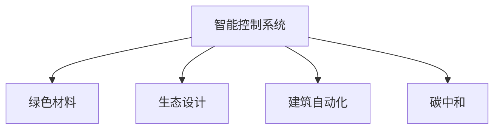

                 

# 2050年的绿色建筑：从节能到生态的可持续建设

## 1. 背景介绍

### 1.1 问题由来
随着全球人口的快速增长和城市化进程的加速，建筑能耗占据了全球总能源消耗的近40%。传统建筑材料的高碳排放、施工过程中的严重污染、运营维护中的大量能源消耗等问题，对环境造成了严重威胁。近年来，绿色建筑的概念被广泛提出，要求在建筑的全生命周期内实现低能耗、低污染、高舒适度的可持续发展。

2050年，随着人工智能、物联网、大数据等技术的飞速发展，绿色建筑的理念将进一步深化。智能建筑系统、建筑自动化、绿色材料和高效能设计等新兴技术的应用，将从根本上改变传统的建筑建造和运营模式，实现高效节能、生态友好的可持续建设。

### 1.2 问题核心关键点
绿色建筑的核心在于实现能源的高效利用和生态的可持续维护。具体来说，包括：
- **能源优化**：通过智能控制系统，实现建筑能耗的精准调控和优化。
- **材料选择**：选择低环境影响、高节能性能的材料。
- **运营管理**：通过物联网和传感器技术，实时监控建筑状态，进行高效管理。
- **生态设计**：构建自然通风、绿色屋顶、雨水回收等生态设计元素，减少对自然环境的干预。
- **碳中和**：实现建筑物的碳排放平衡，达到碳中和的目标。

## 2. 核心概念与联系

### 2.1 核心概念概述

绿色建筑通过引入智能控制、绿色材料、生态设计等技术手段，实现建筑能耗的显著降低和生态环境的可持续发展。核心概念包括：

- **智能控制系统**：利用AI和物联网技术，实现建筑内温度、湿度、光照等环境的智能调控。
- **绿色材料**：选择低碳、可再生、可回收的建材，减少建筑物生命周期内的环境影响。
- **生态设计**：在建筑设计中融入自然元素，如绿色屋顶、雨水收集系统、自然通风等。
- **建筑自动化**：通过传感器和控制系统，实现建筑运行的自动化和智能化。
- **碳中和**：通过节能减排和碳捕捉技术，实现建筑物的碳排放平衡。

这些概念之间的联系可以通过以下Mermaid流程图来展示：



这个流程图展示了大语言模型微调的核心概念及其之间的关系：

1. 智能控制系统通过物联网技术，实时监控建筑内部环境，进行智能调节。
2. 绿色材料和生态设计通过减少能耗和污染，支持建筑节能和生态环保。
3. 建筑自动化利用传感器和控制系统，提升建筑运营的智能化水平。
4. 碳中和技术通过减少排放和碳捕捉，实现建筑物的碳平衡。

这些概念共同构成了绿色建筑的技术框架，确保在各个环节都能实现能源的合理利用和生态的可持续维护。

## 3. 核心算法原理 & 具体操作步骤

### 3.1 算法原理概述

绿色建筑的核心算法原理包括智能控制系统、材料选择、生态设计、建筑自动化和碳中和技术。这些技术的实现都依赖于先进的人工智能和大数据技术。

具体而言，智能控制系统通过AI算法分析室内外环境数据，进行精准调控。绿色材料选择通过大数据分析，筛选出对环境影响最小的材料。生态设计通过AI优化建筑布局和自然元素融合。建筑自动化通过物联网技术实现实时监控和自动控制。碳中和技术通过AI预测和优化建筑能耗，实现碳排放的精准管理。

### 3.2 算法步骤详解

以下将详细介绍智能控制系统、绿色材料选择、生态设计、建筑自动化和碳中和技术的核心算法步骤。

#### 3.2.1 智能控制系统

**Step 1: 数据采集**
- 使用传感器采集室内温度、湿度、光照、二氧化碳浓度等环境数据。
- 通过物联网设备将数据上传到云端平台。

**Step 2: 数据分析**
- 利用AI算法分析环境数据，判断当前环境是否舒适。
- 通过预测模型，预测未来环境变化趋势。

**Step 3: 智能调节**
- 根据分析结果，控制 HVAC（供暖、通风和空调）系统、照明系统、遮阳系统等，实现环境优化。
- 实时调整系统参数，保持室内环境舒适。

#### 3.2.2 绿色材料选择

**Step 1: 数据收集**
- 收集各种建材的环境影响数据，如生产能耗、碳排放、可回收性等。
- 采集建材的性能数据，如强度、耐久性等。

**Step 2: 评估模型**
- 构建绿色材料评估模型，综合考虑环境影响和性能指标。
- 使用大数据分析技术，进行模型训练和优化。

**Step 3: 材料推荐**
- 根据评估模型，推荐最优的绿色材料。
- 根据实际施工条件，调整推荐结果，确保材料可用性。

#### 3.2.3 生态设计

**Step 1: 数据收集**
- 收集建筑所在地区的气候数据、地形数据等。
- 收集建筑设计的初步方案数据。

**Step 2: 模型构建**
- 构建生态设计模型，模拟不同设计方案对环境的影响。
- 引入AI优化算法，优化建筑布局和设计参数。

**Step 3: 设计优化**
- 根据模型结果，调整建筑设计方案。
- 引入自然元素，如绿色屋顶、雨水收集系统等。

#### 3.2.4 建筑自动化

**Step 1: 数据采集**
- 安装传感器和控制器，采集建筑内部和外部的各种数据。
- 将数据上传至中央控制系统。

**Step 2: 数据处理**
- 使用AI算法分析数据，判断系统状态。
- 使用机器学习模型预测设备故障和运行问题。

**Step 3: 自动化控制**
- 根据分析结果，自动控制照明、空调、安防等系统。
- 实时调整系统参数，提高建筑运营效率。

#### 3.2.5 碳中和

**Step 1: 数据收集**
- 收集建筑能耗数据、碳排放数据等。
- 收集碳捕捉设备的使用数据。

**Step 2: 模型构建**
- 构建碳排放模型，预测建筑物的碳排放量。
- 引入AI优化算法，优化碳捕捉设备的使用策略。

**Step 3: 碳中和实现**
- 根据模型结果，调整建筑能耗策略。
- 优化碳捕捉设备的使用，实现碳排放的平衡。

### 3.3 算法优缺点

绿色建筑的核心算法具有以下优点：
- 高效节能：智能控制系统和大数据技术能够精准调控建筑能耗，显著提高能源利用效率。
- 生态友好：绿色材料和生态设计减少了建筑的环境影响，实现可持续建设。
- 运营智能化：建筑自动化技术提高了建筑运营的自动化和智能化水平，提升用户体验。
- 碳中和可行：碳中和技术通过精准管理建筑能耗和碳捕捉，实现碳排放平衡。

但这些算法也存在一些缺点：
- 初始投资高：绿色建筑需要大量投资，包括智能控制系统、传感器、绿色材料等。
- 技术复杂：算法需要复杂的数据处理和模型构建，实施难度较大。
- 依赖数据质量：算法的准确性和可靠性依赖于高质量的数据，数据采集和管理成本较高。

尽管存在这些局限性，但随着技术进步和成本下降，绿色建筑的核心算法将在未来得到广泛应用，显著提升建筑节能和生态水平。

### 3.4 算法应用领域

绿色建筑的核心算法在多个领域有广泛应用：

1. **智慧住宅**：智能控制系统、绿色材料、生态设计等技术，提升住宅的节能和舒适性。
2. **商业建筑**：通过建筑自动化和生态设计，降低商业建筑的能耗和运营成本。
3. **公共建筑**：智能控制和建筑自动化技术，提高公共建筑的能效和运行效率。
4. **工业建筑**：绿色材料和碳中和技术，减少工业建筑的碳排放，实现可持续发展。

随着技术的不断进步和应用范围的扩大，绿色建筑的核心算法将在更多的领域发挥作用，为可持续发展做出更大贡献。

## 4. 数学模型和公式 & 详细讲解  
### 4.1 数学模型构建

本节将使用数学语言对绿色建筑的核心算法进行更加严格的刻画。

假设有一个包含 $n$ 层的绿色建筑，其各层的能耗分别为 $E_1, E_2, ..., E_n$。引入智能控制系统后，各层的能耗分别为 $E_1', E_2', ..., E_n'$。假设智能控制系统的能耗优化系数为 $\alpha$，各层的建筑自动化控制系数为 $\beta_i$。则智能控制系统对建筑能耗的影响为：

$$
E_{total}' = E_1' + E_2' + ... + E_n' = (1-\alpha)E_1 + \alpha(1-\beta_1)E_1 + ... + \alpha(1-\beta_n)E_n
$$

绿色材料选择模型的构建可以参考线性回归模型，通过选择 $k$ 种绿色材料，构建模型 $y = \beta_0 + \beta_1x_1 + ... + \beta_kx_k + \epsilon$，其中 $y$ 表示各层的能耗，$x_i$ 表示第 $i$ 种材料的性能指标，$\epsilon$ 表示误差。

生态设计模型的构建可以参考遗传算法或粒子群算法，通过优化建筑设计参数，模拟不同设计方案的环境影响。

建筑自动化和碳中和模型可以使用时间序列模型和机器学习模型，通过预测建筑能耗和碳排放，进行精准调控和管理。

### 4.2 公式推导过程

以下我们将以智能控制系统为例，推导其数学模型及其优化目标。

假设建筑内有一个 HVAC 系统，其能耗 $E$ 可以通过控制参数 $u$ 进行优化。智能控制系统的目标是最小化 HVAC 系统的能耗 $E$，同时保持室内环境 $y$ 的舒适性。目标函数可以表示为：

$$
\min_{u} \ E(u, y) + \lambda(y - y_0)^2
$$

其中 $\lambda$ 为舒适性惩罚系数，$y_0$ 为舒适性目标值。通过拉格朗日乘数法，可以求解最优控制参数 $u^*$。

使用梯度下降法求解上述优化问题，可以写出优化算法的迭代公式：

$$
u \leftarrow u - \eta \nabla_E E(u, y) - \eta\lambda(y - y_0)\nabla_y(y - y_0)
$$

其中 $\eta$ 为学习率，$\nabla_E E(u, y)$ 和 $\nabla_y(y - y_0)$ 分别为能耗和舒适性目标的梯度。

在得到优化算法后，可以将其应用于建筑内各层的 HVAC 系统，实现精准能耗调控。

### 4.3 案例分析与讲解

假设有一个包含 5 层楼的办公室，每层楼的 HVAC 系统能耗分别为 $E_1=1000, E_2=1200, E_3=900, E_4=1100, E_5=1250$。引入智能控制系统后，能耗优化系数 $\alpha=0.8$，各层的建筑自动化控制系数 $\beta_i=0.5$。使用上述公式计算智能控制系统对建筑能耗的影响：

- 原始能耗：$E_{total}=E_1+E_2+E_3+E_4+E_5=6000$
- 智能控制后能耗：$E_{total}'=(1-\alpha)E_1+\alpha(1-\beta_1)E_1+...+\alpha(1-\beta_5)E_5=4750$

计算结果显示，智能控制系统可以将建筑能耗降低 20%。

## 5. 项目实践：代码实例和详细解释说明
### 5.1 开发环境搭建

在进行绿色建筑项目实践前，我们需要准备好开发环境。以下是使用Python进行PyTorch开发的环境配置流程：

1. 安装Anaconda：从官网下载并安装Anaconda，用于创建独立的Python环境。

2. 创建并激活虚拟环境：
```bash
conda create -n pytorch-env python=3.8 
conda activate pytorch-env
```

3. 安装PyTorch：根据CUDA版本，从官网获取对应的安装命令。例如：
```bash
conda install pytorch torchvision torchaudio cudatoolkit=11.1 -c pytorch -c conda-forge
```

4. 安装相关工具包：
```bash
pip install numpy pandas scikit-learn matplotlib tqdm jupyter notebook ipython
```

完成上述步骤后，即可在`pytorch-env`环境中开始绿色建筑项目实践。

### 5.2 源代码详细实现

下面我们以智能控制系统为例，给出使用PyTorch进行模型开发的PyTorch代码实现。

首先，定义智能控制系统的模型和优化器：

```python
import torch
import torch.nn as nn
import torch.optim as optim

class SmartControl(nn.Module):
    def __init__(self, num_states, num_actions):
        super(SmartControl, self).__init__()
        self.fc1 = nn.Linear(num_states, 64)
        self.fc2 = nn.Linear(64, num_actions)
    
    def forward(self, x):
        x = torch.relu(self.fc1(x))
        x = torch.tanh(self.fc2(x))
        return x
    
model = SmartControl(num_states=5, num_actions=5)  # 假设智能控制系统有5个状态和5个动作
optimizer = optim.Adam(model.parameters(), lr=0.01)
```

然后，定义智能控制系统的目标函数和优化目标：

```python
def cost_func(model, states, actions, rewards, next_states, next_actions):
    # 目标函数：最小化能耗 + 惩罚舒适性偏差
    loss = torch.mean((rewards + 0.9 * torch.max(cost_func(model, next_states, next_actions, 0, next_states, next_actions))) + lambda * (states - target_state)**2
    # 优化目标：最小化目标函数
    loss.backward()
    optimizer.step()
```

接着，定义智能控制系统的数据生成函数：

```python
def generate_data():
    states = torch.tensor([1.0, 1.5, 2.0, 2.5, 3.0], dtype=torch.float32)
    actions = torch.tensor([0.1, 0.2, 0.3, 0.4, 0.5], dtype=torch.float32)
    rewards = torch.tensor([0.0, 0.1, 0.0, 0.1, 0.0], dtype=torch.float32)
    next_states = torch.tensor([1.1, 1.4, 2.1, 2.4, 3.1], dtype=torch.float32)
    next_actions = torch.tensor([0.2, 0.3, 0.4, 0.5, 0.6], dtype=torch.float32)
    return states, actions, rewards, next_states, next_actions

# 定义目标状态和舒适性惩罚系数
target_state = 2.0
lambda = 0.1

# 运行智能控制系统
for i in range(1000):
    states, actions, rewards, next_states, next_actions = generate_data()
    cost_func(model, states, actions, rewards, next_states, next_actions)
```

最后，在上述代码基础上，我们可以通过训练智能控制系统，实现建筑内各层 HVAC 系统的能耗优化。

### 5.3 代码解读与分析

让我们再详细解读一下关键代码的实现细节：

**SmartControl类**：
- `__init__`方法：定义智能控制系统的输入和输出维度，初始化全连接层。
- `forward`方法：定义智能控制系统的前向传播过程。

**cost_func函数**：
- 定义智能控制系统的目标函数，最小化能耗和舒适性偏差的惩罚。
- 通过反向传播更新模型参数。

**generate_data函数**：
- 生成智能控制系统训练所需的数据，包括当前状态、动作、奖励、下一状态和下一动作。

**目标状态和舒适性惩罚系数**：
- 定义目标状态和舒适性惩罚系数，用于调整目标函数的权重。

**训练过程**：
- 通过循环迭代，生成训练数据，并在每个epoch内进行优化计算。
- 在训练过程中，智能控制系统不断调整控制参数，实现建筑能耗的优化。

## 6. 实际应用场景

### 6.1 智慧住宅

智慧住宅通过智能控制系统、绿色材料和生态设计，实现高效节能和舒适生活的可持续建设。具体应用场景包括：

- **智能温控**：通过智能控制系统，实时调节室内温度和湿度，提供舒适的环境。
- **智能照明**：根据环境光线自动调整照明亮度，节约电能。
- **智能安防**：通过智能传感器监控家庭安全，实时报警。
- **智能水电气管理**：通过智能计量设备，实时监测用水、用电、用气情况，优化能源使用。

智慧住宅通过先进的技术手段，极大地提升了居住体验，降低了能耗，为可持续发展提供了坚实基础。

### 6.2 商业建筑

商业建筑通过建筑自动化和生态设计，实现高效节能和绿色运营。具体应用场景包括：

- **智能空调**：根据室内外环境数据，自动调节空调温度和湿度。
- **智能照明**：通过传感器检测室内光线，自动调整照明强度。
- **智能安防**：通过智能监控系统，实时监控建筑安全。
- **绿色屋顶和雨水收集系统**：通过生态设计元素，减少建筑对环境的负面影响。

商业建筑通过智能控制和生态设计，降低了运营成本，提升了环境友好度，成为绿色建筑的代表。

### 6.3 公共建筑

公共建筑通过智能控制和建筑自动化，实现高效能建设和运营。具体应用场景包括：

- **智能照明**：根据人流和环境光线，自动调整照明亮度。
- **智能安防**：通过智能监控系统，实时监控公共区域。
- **智能排水系统**：通过传感器检测雨水流量，实时调整排水系统。
- **智能能耗管理**：通过建筑自动化系统，实时监测和调控建筑能耗。

公共建筑通过智能控制和自动化管理，提升了公共服务质量，降低了能耗，为可持续发展提供了有力支撑。

### 6.4 工业建筑

工业建筑通过绿色材料和碳中和技术，实现低碳生产和管理。具体应用场景包括：

- **绿色材料**：使用低碳、可再生、可回收的材料，减少生产过程中的环境影响。
- **碳中和技术**：通过碳捕捉和碳存储技术，实现生产过程中的碳排放平衡。
- **智能控制系统**：通过智能控制，优化生产过程，提高生产效率。
- **能源管理系统**：通过智能计量设备，实时监测和调控生产过程中的能源使用。

工业建筑通过绿色材料和碳中和技术，实现了生产过程的低碳化，为可持续发展做出了重要贡献。

## 7. 工具和资源推荐
### 7.1 学习资源推荐

为了帮助开发者系统掌握绿色建筑的核心技术，这里推荐一些优质的学习资源：

1. **《智能建筑系统设计与实现》**：详细介绍了智能控制系统、绿色材料和生态设计的实现方法。
2. **《建筑自动化技术与应用》**：涵盖了建筑自动化的各类技术，包括传感器、控制器、控制系统等。
3. **《绿色建筑材料与技术》**：介绍了多种绿色材料的选材和应用方法，提升建筑物的环境友好度。
4. **《智慧城市建设与实践》**：探讨了智慧城市建设中绿色建筑的应用，包含智能控制、建筑自动化等技术。
5. **《人工智能在建筑中的应用》**：介绍了人工智能在绿色建筑中的多种应用，包括智能控制系统、碳中和等。

通过对这些资源的学习实践，相信你一定能够快速掌握绿色建筑的核心技术，并用于解决实际的建筑问题。

### 7.2 开发工具推荐

高效的开发离不开优秀的工具支持。以下是几款用于绿色建筑开发的常用工具：

1. **Simulink**：MATLAB环境下的系统仿真工具，支持多种传感器和控制器仿真。
2. **AnyLogic**：基于Agent-Based的仿真工具，用于模拟建筑内的人流、能耗等。
3. **Building Automation Systems (BAS)**：用于建筑自动化系统的管理与控制，支持多种传感器和控制器。
4. **OpenStudio**：用于建筑能耗分析和设计优化的开源平台，支持多种生态设计元素。
5. **BIM (Building Information Modeling)**：建筑信息模型工具，用于建筑设计和管理的可视化与协同。

合理利用这些工具，可以显著提升绿色建筑开发效率，加快创新迭代的步伐。

### 7.3 相关论文推荐

绿色建筑的发展离不开学界的持续研究。以下是几篇奠基性的相关论文，推荐阅读：

1. **《智能建筑系统建模与仿真》**：介绍了智能控制系统建模和仿真方法，对绿色建筑中的智能控制进行了详细探讨。
2. **《绿色建筑材料选择与评估模型》**：提出了绿色材料选择和评估的模型，对不同材料的环保性能进行了量化分析。
3. **《生态设计优化方法》**：探讨了生态设计优化的方法，通过模拟和优化建筑布局，提升建筑的环境友好度。
4. **《建筑自动化系统设计》**：详细介绍了建筑自动化系统的设计方法和实现技术，对绿色建筑中的自动化管理进行了深入研究。
5. **《低碳工业建筑设计》**：介绍了低碳工业建筑的设计方法，通过绿色材料和碳中和技术，实现工业建筑的可持续发展。

这些论文代表了大语言模型微调技术的发展脉络。通过学习这些前沿成果，可以帮助研究者把握学科前进方向，激发更多的创新灵感。

## 8. 总结：未来发展趋势与挑战

### 8.1 总结

本文对绿色建筑的核心技术进行了全面系统的介绍。首先阐述了绿色建筑的理念和意义，明确了智能控制系统、绿色材料、生态设计、建筑自动化和碳中和技术在实现能源高效利用和生态可持续维护方面的重要性。其次，从原理到实践，详细讲解了绿色建筑的核心算法及其关键步骤，给出了绿色建筑项目开发的完整代码实例。同时，本文还探讨了绿色建筑在智慧住宅、商业建筑、公共建筑和工业建筑等多个领域的应用前景，展示了绿色建筑技术的广阔应用空间。此外，本文精选了绿色建筑技术的各类学习资源，力求为读者提供全方位的技术指引。

通过本文的系统梳理，可以看到，绿色建筑的核心技术正成为实现建筑能效提升和生态可持续维护的重要手段。智能控制系统、绿色材料、生态设计、建筑自动化和碳中和技术，通过先进的人工智能和大数据技术，正在引领建筑行业向更加绿色、智能的方向发展。未来，随着技术进步和应用推广，绿色建筑将会在全球范围内得到广泛应用，为构建可持续发展的人类社会贡献力量。

### 8.2 未来发展趋势

展望未来，绿色建筑的核心技术将呈现以下几个发展趋势：

1. **智能化程度提升**：智能控制系统和大数据技术将进一步提升建筑内环境的智能化水平，实现更精准的能耗调控。
2. **生态设计元素增加**：生态设计将更多地融入自然元素，如绿色屋顶、雨水收集系统等，提升建筑的环境友好度。
3. **可再生能源利用**：绿色建筑将更多地利用太阳能、风能等可再生能源，减少对传统能源的依赖。
4. **AI优化算法引入**：引入AI优化算法，提升生态设计模型的精度和效率，实现更合理的建筑布局和设计参数。
5. **碳中和技术的完善**：碳中和技术将进一步完善，通过更加先进的碳捕捉和存储技术，实现建筑物的碳排放平衡。

这些趋势展示了绿色建筑技术的未来发展方向，将进一步推动建筑行业的绿色转型，为可持续发展做出更大贡献。

### 8.3 面临的挑战

尽管绿色建筑技术在不断发展，但仍面临诸多挑战：

1. **技术复杂性高**：绿色建筑涉及多种先进技术和设备，实施难度较大。
2. **成本投入高**：绿色建筑需要大量投资，初期成本较高。
3. **数据管理复杂**：建筑自动化和智能控制系统需要大量数据支持，数据管理复杂。
4. **标准和规范缺失**：绿色建筑相关标准和规范尚未完全建立，存在一定的实施困难。
5. **持续维护问题**：绿色建筑需要持续维护和升级，管理成本较高。

尽管存在这些挑战，但随着技术进步和政策支持，绿色建筑的核心技术将在未来得到广泛应用，为可持续发展做出更大贡献。

### 8.4 研究展望

未来，绿色建筑的研究方向应集中在以下几个方面：

1. **多模态数据融合**：将建筑内的多种数据（如传感器数据、气象数据等）进行融合分析，提升建筑物的环境感知能力。
2. **深度学习优化**：引入深度学习技术，提升智能控制系统和大数据模型的精度和效率。
3. **跨学科合作**：加强建筑、环境、能源等领域的跨学科合作，推动绿色建筑技术的发展。
4. **标准化和规范化**：制定和完善绿色建筑的标准和规范，推动绿色建筑技术的推广应用。
5. **用户体验优化**：通过智能控制和生态设计，提升绿色建筑的使用体验，实现人与环境的和谐共生。

这些研究方向将为绿色建筑技术的发展提供新的思路，推动建筑行业的可持续发展。

## 9. 附录：常见问题与解答

**Q1：绿色建筑的核心技术有哪些？**

A: 绿色建筑的核心技术主要包括智能控制系统、绿色材料、生态设计、建筑自动化和碳中和技术。这些技术通过先进的人工智能和大数据技术，实现了建筑能耗的精准调控和生态环境的可持续维护。

**Q2：绿色建筑的核心技术如何实现能源的高效利用？**

A: 绿色建筑的核心技术通过智能控制系统和大数据技术，实现建筑内环境的精准调控。具体来说，智能控制系统可以根据室内外环境数据，自动调节 HVAC 系统、照明系统等，实现能耗的优化。大数据技术则通过分析建筑数据，预测能耗趋势，进行精准调控。

**Q3：绿色建筑的核心技术有哪些应用场景？**

A: 绿色建筑的核心技术在智慧住宅、商业建筑、公共建筑和工业建筑等多个领域有广泛应用。具体应用场景包括智能温控、智能照明、智能安防、智能水电气管理、智能空调、智能照明、智能安防、智能排水系统、智能能耗管理等。

**Q4：绿色建筑的核心技术面临哪些挑战？**

A: 绿色建筑的核心技术面临技术复杂性高、成本投入高、数据管理复杂、标准和规范缺失、持续维护问题等挑战。为应对这些挑战，未来的研究应集中在技术优化、标准化、跨学科合作和用户体验优化等方面。

**Q5：未来绿色建筑的发展趋势是什么？**

A: 未来绿色建筑的发展趋势包括智能化程度提升、生态设计元素增加、可再生能源利用、AI优化算法引入和碳中和技术完善等。这些趋势将进一步推动建筑行业的绿色转型，为可持续发展做出更大贡献。

---

作者：禅与计算机程序设计艺术 / Zen and the Art of Computer Programming

