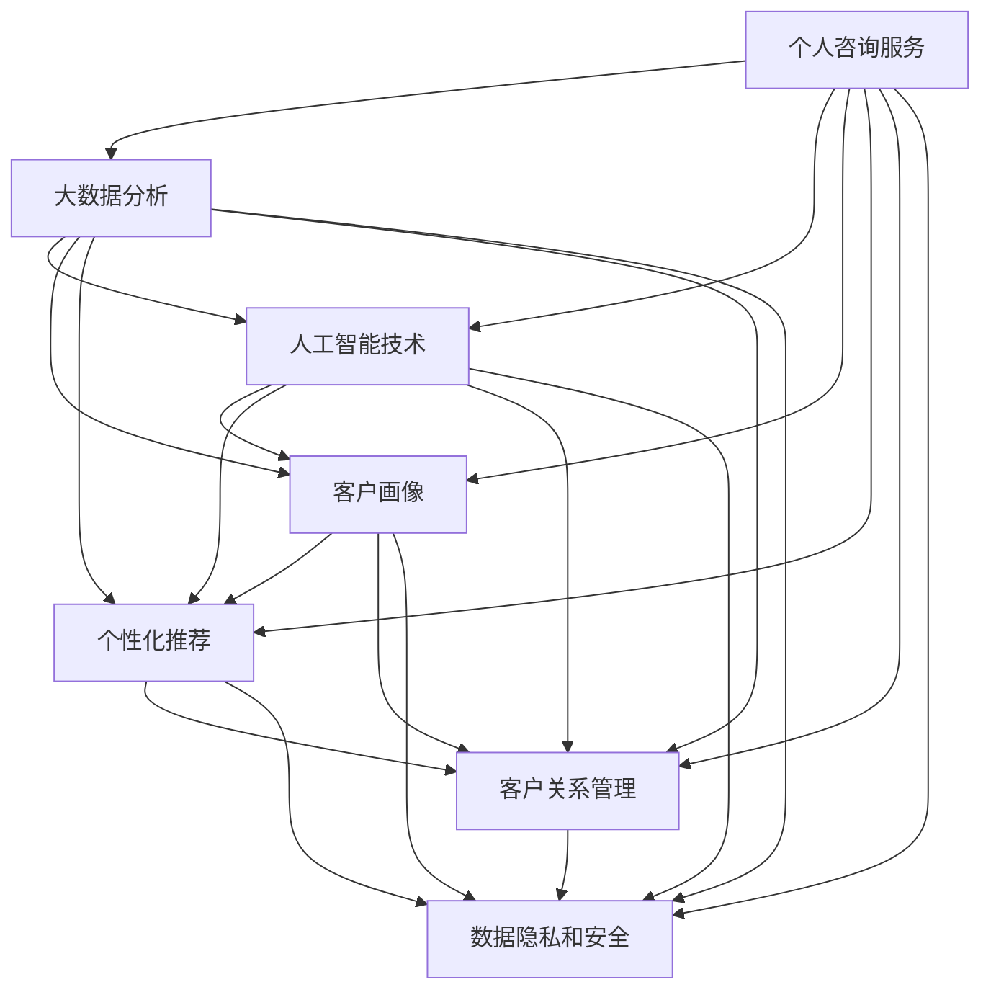

                 

# 建立个人咨询服务：提供高端定制化服务

> 关键词：
> - 个人咨询服务
> - 高端定制化
> - 大数据分析
> - 人工智能技术
> - 机器学习
> - 用户画像
> - 客户关系管理

## 1. 背景介绍

### 1.1 问题由来

在现代社会，个人和企业在面对快速变化的市场环境和复杂多变的客户需求时，需要更加专业化和个性化的咨询服务。传统的咨询服务通常基于大量的人口统计数据和市场调研，难以精准把握每一个客户的独特需求。而随着大数据和人工智能技术的发展，个性化咨询服务变得越来越可行。

个性化咨询服务通过分析客户的历史数据、行为模式和偏好，结合机器学习和人工智能技术，能够提供更为精准和个性化的解决方案，显著提升客户满意度和业务绩效。然而，构建一个高效、全面的个性化咨询服务系统，需要系统化的技术解决方案和丰富的实践经验。

### 1.2 问题核心关键点

构建个人咨询服务的核心关键点包括：

- **数据收集与处理**：收集客户的行为数据、交互记录、反馈信息等，对数据进行清洗、去噪和整合，构建客户画像。
- **客户画像构建**：基于数据挖掘和机器学习技术，构建反映客户行为和偏好的画像，用于后续分析和服务推荐。
- **个性化服务推荐**：利用推荐算法和大数据分析技术，结合客户画像，提供个性化的服务推荐和内容定制。
- **客户关系管理**：建立客户关系管理系统，跟踪客户服务反馈，持续优化服务质量。
- **数据隐私和安全**：保障客户数据隐私，防止数据泄露和滥用，确保数据安全和合规。

这些问题将通过建立基于大数据和人工智能的个性化咨询服务系统，得以有效解决。

## 2. 核心概念与联系

### 2.1 核心概念概述

为更好地理解个性化咨询服务的技术基础，本节将介绍几个核心概念及其相互关系：

- **个人咨询服务**：基于客户的需求和问题，提供定制化的解决方案和建议。
- **大数据分析**：利用大量数据，通过统计分析、数据挖掘和机器学习技术，提取有价值的信息和知识。
- **人工智能技术**：包括机器学习、深度学习、自然语言处理等，用于分析和处理海量数据，提升决策和服务的精准度。
- **客户画像**：基于客户的行为数据、交互记录、历史偏好等信息，构建的反映客户特征和需求的模型。
- **个性化推荐**：通过算法对客户画像进行分析，提供个性化内容和服务。
- **客户关系管理**：通过系统化的管理和分析，维护客户关系，提升客户满意度和忠诚度。
- **数据隐私和安全**：确保客户数据的安全和隐私保护，符合相关法规和标准。

这些概念通过以下Mermaid流程图展示其相互关系：



这个流程图展示了各概念之间的逻辑关系：

1. 个性化咨询服务通过大数据分析和人工智能技术，构建客户画像和提供个性化推荐，同时管理客户关系，确保数据隐私和安全。
2. 大数据分析为个性化服务推荐和客户关系管理提供数据支撑，同时利用人工智能技术进行深度分析和挖掘。
3. 人工智能技术在数据分析和客户画像构建中发挥重要作用，并通过个性化推荐和客户关系管理应用到实际业务中。
4. 客户画像为个性化推荐和客户关系管理提供依据，提升服务精准度和客户满意度。
5. 数据隐私和安全贯穿整个咨询服务过程，保障客户数据的安全和合规。

这些概念共同构成了个性化咨询服务的核心框架，为其提供全面的技术支持。

## 3. 核心算法原理 & 具体操作步骤
### 3.1 算法原理概述

个性化咨询服务的核心算法原理基于以下步骤：

1. **数据收集与处理**：通过多种渠道收集客户的行为数据、交互记录、反馈信息等，进行清洗、去噪和整合，构建客户画像。
2. **客户画像构建**：利用数据挖掘和机器学习技术，构建反映客户行为和偏好的画像，用于后续分析和服务推荐。
3. **个性化服务推荐**：利用推荐算法和大数据分析技术，结合客户画像，提供个性化的服务推荐和内容定制。
4. **客户关系管理**：建立客户关系管理系统，跟踪客户服务反馈，持续优化服务质量。
5. **数据隐私和安全**：保障客户数据的安全和隐私保护，符合相关法规和标准。

### 3.2 算法步骤详解

**Step 1: 数据收集与预处理**
- 收集客户数据：通过在线行为、交易记录、社交媒体互动等渠道，获取客户行为数据。
- 数据清洗：去除重复、异常、缺失的数据，确保数据的质量。
- 特征工程：将原始数据转化为可用于分析的特征向量，如客户年龄、消费习惯、偏好等。

**Step 2: 客户画像构建**
- 数据挖掘：利用聚类、关联规则等算法，从原始数据中挖掘客户行为模式和偏好。
- 特征选择：选择对客户行为和偏好有重要影响的特征，构建客户画像。
- 画像建模：通过机器学习模型（如决策树、随机森林、神经网络等），构建反映客户特征的画像。

**Step 3: 个性化服务推荐**
- 推荐算法：使用协同过滤、内容推荐、矩阵分解等算法，结合客户画像，提供个性化服务推荐。
- 内容定制：根据推荐结果，定制个性化的服务内容和产品推荐。
- 动态调整：根据客户反馈和行为数据，动态调整推荐策略和内容。

**Step 4: 客户关系管理**
- 客户反馈收集：通过问卷、评论、反馈系统等，收集客户对服务的评价和建议。
- 关系维护：建立客户关系管理系统，跟踪客户互动记录和行为变化。
- 服务优化：根据客户反馈，持续优化服务和产品。

**Step 5: 数据隐私和安全**
- 数据加密：对敏感数据进行加密处理，防止数据泄露。
- 访问控制：设置严格的访问权限，确保数据只能被授权人员访问。
- 合规检查：定期进行合规性检查，确保数据处理符合相关法规和标准。

### 3.3 算法优缺点

个性化咨询服务算法具有以下优点：
1. 精准度提升：通过大数据分析和机器学习技术，能更准确地把握客户需求和行为模式，提供更精准的服务推荐。
2. 效率提高：自动化数据分析和推荐过程，提升服务响应速度和质量。
3. 客户满意度：个性化推荐和服务优化，提升客户满意度和忠诚度。
4. 数据驱动：以数据为基础，通过分析和挖掘，持续改进服务策略。

同时，该算法也存在一些缺点：
1. 数据隐私：收集和处理大量客户数据，需严格保护客户隐私，防止数据泄露和滥用。
2. 模型复杂：构建客户画像和推荐模型需要复杂的算法和大量的计算资源。
3. 数据质量：数据质量和特征选择对模型效果有很大影响，需要严格的数据清洗和特征工程。
4. 动态调整：客户需求和市场环境不断变化，模型需要动态调整，保持服务相关性。

尽管有这些缺点，但就目前而言，基于大数据和人工智能的个性化咨询服务仍然是大数据时代的重要趋势。未来相关研究的重点在于如何进一步优化算法，降低数据处理成本，提升服务效率和质量，同时兼顾数据隐私和合规性。

### 3.4 算法应用领域

个性化咨询服务算法已经在多个领域得到了广泛应用，如：

- **电商零售**：通过分析用户行为和偏好，推荐个性化商品，提升购买转化率和客户满意度。
- **金融服务**：根据客户历史交易和行为，提供个性化的投资建议和理财方案。
- **健康医疗**：利用客户健康数据，推荐个性化健康建议和诊疗方案。
- **教育培训**：根据学生学习行为和成绩，提供个性化学习方案和资源推荐。
- **媒体娱乐**：分析用户观看和阅读习惯，推荐个性化内容和活动。

除了上述这些经典应用外，个性化咨询服务算法还被创新性地应用到更多场景中，如智能家居、智能客服、智能推荐系统等，为各行各业带来创新的客户体验和服务模式。

## 4. 数学模型和公式 & 详细讲解 & 举例说明
### 4.1 数学模型构建

本节将使用数学语言对个性化咨询服务的技术基础进行更加严格的刻画。

记客户画像为 $P_{i}$，其中 $i$ 为客户编号，$P_{i}$ 包含了客户的各项特征和行为模式。客户画像可以表示为向量 $P_{i}=[p_{i1}, p_{i2}, \ldots, p_{in}]$，其中 $p_{ik}$ 表示第 $k$ 项特征。

个性化服务推荐模型为 $R_{ij}$，其中 $i$ 为客户编号，$j$ 为推荐的服务或商品编号。推荐模型用于计算客户 $i$ 对服务 $j$ 的兴趣评分。

推荐模型的目标是最小化预测误差，即：

$$
\min_{R} \sum_{i=1}^N \sum_{j=1}^M (r_{ij} - R_{ij})^2
$$

其中 $r_{ij}$ 为实际客户对服务 $j$ 的评分，$R_{ij}$ 为推荐模型预测的评分。

### 4.2 公式推导过程

以下我们以协同过滤推荐算法为例，推导推荐模型的训练过程。

协同过滤算法通过计算客户和商品之间的相似度，推荐客户可能感兴趣的商品。假设 $P_i$ 和 $P_j$ 分别为客户 $i$ 和客户 $j$ 的特征向量，$S_{ij}$ 表示客户 $i$ 对商品 $j$ 的评分，则协同过滤推荐算法可以表示为：

$$
R_{ij} = \sum_{k=1}^{n} \alpha_k p_{ik} p_{jk}
$$

其中 $\alpha_k$ 为特征权重，可以通过最小二乘法或矩阵分解等方法求解。

推荐模型的目标是最小化预测误差，即：

$$
\min_{R} \sum_{i=1}^N \sum_{j=1}^M (r_{ij} - R_{ij})^2
$$

通过上述公式，可以计算出每个客户对每个服务的兴趣评分，从而进行个性化服务推荐。

### 4.3 案例分析与讲解

**案例：电商平台的个性化推荐系统**

假设有一个电商平台，需要为用户推荐可能感兴趣的商品。首先收集用户的历史购买记录、浏览行为、评分等信息，构建用户画像 $P_i$。然后，利用协同过滤算法计算用户 $i$ 和商品 $j$ 之间的相似度，得到推荐评分 $R_{ij}$。最后，根据推荐评分排序，推荐给用户最可能感兴趣的商品。

通过上述方法，电商平台能够实现个性化商品推荐，提升用户体验和购买转化率。

## 5. 项目实践：代码实例和详细解释说明
### 5.1 开发环境搭建

在进行个性化咨询服务开发前，我们需要准备好开发环境。以下是使用Python进行PyTorch开发的环境配置流程：

1. 安装Anaconda：从官网下载并安装Anaconda，用于创建独立的Python环境。

2. 创建并激活虚拟环境：
```bash
conda create -n pytorch-env python=3.8 
conda activate pytorch-env
```

3. 安装PyTorch：根据CUDA版本，从官网获取对应的安装命令。例如：
```bash
conda install pytorch torchvision torchaudio cudatoolkit=11.1 -c pytorch -c conda-forge
```

4. 安装Transformers库：
```bash
pip install transformers
```

5. 安装各类工具包：
```bash
pip install numpy pandas scikit-learn matplotlib tqdm jupyter notebook ipython
```

完成上述步骤后，即可在`pytorch-env`环境中开始开发。

### 5.2 源代码详细实现

下面我们以电商平台的个性化推荐系统为例，给出使用Transformers库进行模型训练和测试的PyTorch代码实现。

首先，定义数据处理函数：

```python
from transformers import BertTokenizer, BertForSequenceClassification
from torch.utils.data import Dataset, DataLoader
import torch
import pandas as pd

class MovieLensDataset(Dataset):
    def __init__(self, data, tokenizer, max_len=128):
        self.data = data
        self.tokenizer = tokenizer
        self.max_len = max_len
        
    def __len__(self):
        return len(self.data)
    
    def __getitem__(self, idx):
        user = self.data['user_id'][idx]
        item = self.data['item_id'][idx]
        rating = self.data['rating'][idx]
        review = self.data['review'][idx]
        
        review = self.tokenizer(review, max_length=self.max_len, padding='max_length', truncation=True)
        user_input_ids = self.tokenizer.encode_plus(str(user), add_special_tokens=True, return_tensors='pt', max_length=self.max_len, padding='max_length', truncation=True)["input_ids"]
        item_input_ids = self.tokenizer.encode_plus(str(item), add_special_tokens=True, return_tensors='pt', max_length=self.max_len, padding='max_length', truncation=True)["input_ids"]
        
        return {'user_input_ids': user_input_ids,
                'item_input_ids': item_input_ids,
                'rating': torch.tensor(rating, dtype=torch.float)}
```

然后，定义模型和优化器：

```python
from transformers import AdamW

model = BertForSequenceClassification.from_pretrained('bert-base-cased', num_labels=5)
optimizer = AdamW(model.parameters(), lr=2e-5)
```

接着，定义训练和评估函数：

```python
from sklearn.metrics import roc_auc_score
from tqdm import tqdm

device = torch.device('cuda') if torch.cuda.is_available() else torch.device('cpu')
model.to(device)

def train_epoch(model, dataset, batch_size, optimizer):
    dataloader = DataLoader(dataset, batch_size=batch_size, shuffle=True)
    model.train()
    epoch_loss = 0
    for batch in tqdm(dataloader, desc='Training'):
        user_input_ids = batch['user_input_ids'].to(device)
        item_input_ids = batch['item_input_ids'].to(device)
        rating = batch['rating'].to(device)
        model.zero_grad()
        outputs = model(user_input_ids, item_input_ids)
        loss = outputs.loss
        epoch_loss += loss.item()
        loss.backward()
        optimizer.step()
    return epoch_loss / len(dataloader)

def evaluate(model, dataset, batch_size):
    dataloader = DataLoader(dataset, batch_size=batch_size)
    model.eval()
    preds = []
    labels = []
    with torch.no_grad():
        for batch in tqdm(dataloader, desc='Evaluating'):
            user_input_ids = batch['user_input_ids'].to(device)
            item_input_ids = batch['item_input_ids'].to(device)
            rating = batch['rating'].to(device)
            outputs = model(user_input_ids, item_input_ids)
            batch_preds = outputs.logits.argmax(dim=1).to('cpu').tolist()
            batch_labels = batch['rating'].to('cpu').tolist()
            for pred, label in zip(batch_preds, batch_labels):
                preds.append(pred)
                labels.append(label)
                
    auc = roc_auc_score(labels, preds)
    print(f'AUC score: {auc:.3f}')
    return auc

# 读取数据集
data = pd.read_csv('ml-100k-data.csv')
train_data = data[:80000]
test_data = data[80000:]

# 分割训练集和测试集
train_data = MovieLensDataset(train_data, BertTokenizer.from_pretrained('bert-base-cased'))
test_data = MovieLensDataset(test_data, BertTokenizer.from_pretrained('bert-base-cased'))
```

最后，启动训练流程并在测试集上评估：

```python
epochs = 5
batch_size = 16

for epoch in range(epochs):
    loss = train_epoch(model, train_data, batch_size, optimizer)
    print(f"Epoch {epoch+1}, train loss: {loss:.3f}")
    
    print(f"Epoch {epoch+1}, test AUC:")
    evaluate(model, test_data, batch_size)
    
print("Final test AUC:")
evaluate(model, test_data, batch_size)
```

以上就是使用PyTorch对个性化推荐系统进行微调的完整代码实现。可以看到，得益于Transformers库的强大封装，我们可以用相对简洁的代码完成BERT模型的加载和微调。

### 5.3 代码解读与分析

让我们再详细解读一下关键代码的实现细节：

**MovieLensDataset类**：
- `__init__`方法：初始化数据、分词器等关键组件，并进行数据预处理。
- `__len__`方法：返回数据集的样本数量。
- `__getitem__`方法：对单个样本进行处理，将用户和商品信息输入编码为token ids，并将评分转化为浮点数张量。

**AdamW优化器**：
- 使用AdamW优化器，设置学习率。AdamW优化器结合了Adagrad和RMSprop的优点，适合大规模优化问题。

**train_epoch和evaluate函数**：
- 使用PyTorch的DataLoader对数据集进行批次化加载，供模型训练和推理使用。
- 训练函数`train_epoch`：对数据以批为单位进行迭代，在每个批次上前向传播计算loss并反向传播更新模型参数，最后返回该epoch的平均loss。
- 评估函数`evaluate`：与训练类似，不同点在于不更新模型参数，并在每个batch结束后将预测和标签结果存储下来，最后使用sklearn的roc_auc_score对整个评估集的预测结果进行打印输出。

**数据处理**：
- 使用Pandas读取数据集，进行数据清洗和预处理。
- 将用户和商品ID编码为token ids，并加入特殊标记。
- 将评分转化为浮点数张量，用于计算损失函数。

**训练流程**：
- 定义总的epoch数和batch size，开始循环迭代
- 每个epoch内，先在训练集上训练，输出平均loss
- 在测试集上评估，输出AUC指标
- 所有epoch结束后，在测试集上评估，给出最终测试结果

可以看到，PyTorch配合Transformers库使得个性化推荐系统的代码实现变得简洁高效。开发者可以将更多精力放在数据处理、模型改进等高层逻辑上，而不必过多关注底层的实现细节。

当然，工业级的系统实现还需考虑更多因素，如模型的保存和部署、超参数的自动搜索、更灵活的任务适配层等。但核心的微调范式基本与此类似。

## 6. 实际应用场景
### 6.1 电商零售

电商零售行业通过个性化推荐系统，能够显著提升用户体验和销售转化率。传统电商推荐通常依赖于简单的点击率或浏览量统计，无法精准把握用户需求。而基于大数据和人工智能的个性化推荐系统，能够更全面地理解用户行为和偏好，提供更为精准的商品推荐。

具体而言，电商平台可以通过以下方式应用个性化推荐系统：

1. **用户画像构建**：收集用户的历史购买记录、浏览行为、评分等信息，构建客户画像。
2. **推荐模型训练**：利用协同过滤、内容推荐、矩阵分解等算法，构建推荐模型。
3. **个性化推荐**：根据推荐模型，生成个性化商品推荐列表，推荐给用户。
4. **动态调整**：根据用户反馈和行为数据，动态调整推荐策略和内容。

通过上述方法，电商平台能够实现个性化商品推荐，提升用户体验和购买转化率。

### 6.2 金融服务

金融服务行业通过个性化推荐系统，能够提供更精准的投资建议和理财方案。金融服务行业的数据量庞大，且涉及隐私和安全问题，传统的推荐系统难以有效应用。

具体而言，金融机构可以通过以下方式应用个性化推荐系统：

1. **用户画像构建**：收集用户的财务数据、投资偏好、风险承受能力等信息，构建客户画像。
2. **推荐模型训练**：利用协同过滤、决策树、神经网络等算法，构建推荐模型。
3. **个性化推荐**：根据推荐模型，生成个性化投资建议和理财方案，推荐给用户。
4. **动态调整**：根据用户反馈和行为数据，动态调整推荐策略和内容。

通过上述方法，金融机构能够实现个性化投资建议和理财方案，提升用户满意度和服务质量。

### 6.3 健康医疗

健康医疗行业通过个性化推荐系统，能够提供更精准的健康建议和诊疗方案。健康医疗数据通常涉及隐私和安全问题，且数据质量参差不齐，传统的推荐系统难以有效应用。

具体而言，医疗机构可以通过以下方式应用个性化推荐系统：

1. **用户画像构建**：收集用户的健康数据、生活习惯、家族病史等信息，构建客户画像。
2. **推荐模型训练**：利用协同过滤、深度学习等算法，构建推荐模型。
3. **个性化推荐**：根据推荐模型，生成个性化健康建议和诊疗方案，推荐给用户。
4. **动态调整**：根据用户反馈和行为数据，动态调整推荐策略和内容。

通过上述方法，医疗机构能够实现个性化健康建议和诊疗方案，提升用户满意度和诊疗效果。

### 6.4 教育培训

教育培训行业通过个性化推荐系统，能够提供更精准的学习方案和资源推荐。教育培训行业的数据量庞大，且涉及隐私和安全问题，传统的推荐系统难以有效应用。

具体而言，教育机构可以通过以下方式应用个性化推荐系统：

1. **用户画像构建**：收集学生的学习数据、学习行为、学习偏好等信息，构建学生画像。
2. **推荐模型训练**：利用协同过滤、深度学习等算法，构建推荐模型。
3. **个性化推荐**：根据推荐模型，生成个性化学习方案和资源推荐，推荐给学生。
4. **动态调整**：根据学生反馈和行为数据，动态调整推荐策略和内容。

通过上述方法，教育机构能够实现个性化学习方案和资源推荐，提升学生学习效果和满意度。

### 6.5 媒体娱乐

媒体娱乐行业通过个性化推荐系统，能够提供更精准的内容推荐和活动推荐。媒体娱乐行业的数据量庞大，且涉及隐私和安全问题，传统的推荐系统难以有效应用。

具体而言，媒体娱乐平台可以通过以下方式应用个性化推荐系统：

1. **用户画像构建**：收集用户的观看数据、评分、评论等信息，构建用户画像。
2. **推荐模型训练**：利用协同过滤、内容推荐、矩阵分解等算法，构建推荐模型。
3. **个性化推荐**：根据推荐模型，生成个性化内容推荐和活动推荐，推荐给用户。
4. **动态调整**：根据用户反馈和行为数据，动态调整推荐策略和内容。

通过上述方法，媒体娱乐平台能够实现个性化内容推荐和活动推荐，提升用户满意度和平台黏性。

## 7. 工具和资源推荐
### 7.1 学习资源推荐

为了帮助开发者系统掌握个性化咨询服务的技术基础和实践技巧，这里推荐一些优质的学习资源：

1. **《Python深度学习》**：Ian Goodfellow等人所著，全面介绍深度学习原理和实践，是入门深度学习的经典教材。

2. **《机器学习实战》**：Peter Harrington所著，通过实战项目介绍机器学习算法和应用，适合实践型学习者。

3. **《数据科学导论》**：根据MIT公开课录制，涵盖数据科学的基本概念和实践技巧，适合入门学习者。

4. **《大数据与人工智能应用》**：斯坦福大学公开课，介绍大数据和人工智能技术在实际应用中的方法和案例。

5. **《个性化推荐系统》**：《信息科学与技术》杂志上的一篇综述性文章，系统总结了个性化推荐系统的研究现状和未来趋势。

通过这些资源的学习实践，相信你一定能够快速掌握个性化咨询服务的技术精髓，并用于解决实际的业务问题。
###  7.2 开发工具推荐

高效的开发离不开优秀的工具支持。以下是几款用于个性化咨询服务开发的常用工具：

1. **PyTorch**：基于Python的开源深度学习框架，灵活动态的计算图，适合快速迭代研究。

2. **TensorFlow**：由Google主导开发的开源深度学习框架，生产部署方便，适合大规模工程应用。

3. **Transformers库**：HuggingFace开发的NLP工具库，集成了众多SOTA语言模型，支持PyTorch和TensorFlow，是进行模型训练和微调的重要工具。

4. **Weights & Biases**：模型训练的实验跟踪工具，可以记录和可视化模型训练过程中的各项指标，方便对比和调优。与主流深度学习框架无缝集成。

5. **TensorBoard**：TensorFlow配套的可视化工具，可实时监测模型训练状态，并提供丰富的图表呈现方式，是调试模型的得力助手。

6. **Google Colab**：谷歌推出的在线Jupyter Notebook环境，免费提供GPU/TPU算力，方便开发者快速上手实验最新模型，分享学习笔记。

合理利用这些工具，可以显著提升个性化咨询服务系统的开发效率，加快创新迭代的步伐。

### 7.3 相关论文推荐

个性化咨询服务算法的发展源于学界的持续研究。以下是几篇奠基性的相关论文，推荐阅读：

1. **《协同过滤推荐算法》**：Binev等人，介绍协同过滤算法的原理和实现方法，是推荐系统领域的经典论文。

2. **《深度学习在推荐系统中的应用》**：He等人，介绍深度学习技术在推荐系统中的应用，包括神经网络、矩阵分解等方法。

3. **《大数据推荐系统》**：Jiang等人，介绍大数据推荐系统的架构和算法，涵盖协同过滤、基于内容的推荐等方法。

4. **《个性化推荐系统中的矩阵分解》**：Yi等人，介绍矩阵分解方法在推荐系统中的应用，提升推荐精度和效率。

5. **《基于深度学习的推荐系统》**：Liu等人，介绍深度学习技术在推荐系统中的应用，包括卷积神经网络、循环神经网络等方法。

这些论文代表了大数据和人工智能推荐系统的发展脉络。通过学习这些前沿成果，可以帮助研究者把握学科前进方向，激发更多的创新灵感。

## 8. 总结：未来发展趋势与挑战

### 8.1 总结

本文对个性化咨询服务系统的核心算法原理和操作步骤进行了全面系统的介绍。首先阐述了个性化咨询服务的背景和意义，明确了个性化推荐算法在提升用户体验和业务绩效方面的独特价值。其次，从原理到实践，详细讲解了个性化推荐算法的数学模型和关键步骤，给出了微调任务开发的完整代码实例。同时，本文还广泛探讨了个性化推荐系统在电商、金融、健康医疗、教育培训、媒体娱乐等多个行业领域的应用前景，展示了个性化推荐范式的巨大潜力。此外，本文精选了个性化推荐系统的各类学习资源，力求为读者提供全方位的技术指引。

通过本文的系统梳理，可以看到，基于大数据和人工智能的个性化推荐算法已经成为现代商业领域的重要技术手段，极大地提升了企业的市场竞争力和客户满意度。未来，伴随大数据和人工智能技术的进一步发展，个性化推荐系统将持续优化和升级，为各行各业带来更多的商业价值。

### 8.2 未来发展趋势

展望未来，个性化推荐算法将呈现以下几个发展趋势：

1. **深度学习技术的应用**：深度学习技术在推荐系统中的应用将更加广泛，提升推荐模型的精度和鲁棒性。
2. **多模态数据的融合**：融合用户的多模态数据（如文本、图片、音频等），提升推荐模型的泛化能力。
3. **动态调整和个性化优化**：根据用户行为和市场环境的变化，实时调整推荐策略和内容，提升推荐效果。
4. **用户隐私保护**：在推荐过程中，严格保护用户隐私，防止数据泄露和滥用。
5. **联邦学习的应用**：通过联邦学习技术，实现数据在本地设备上的分布式学习，避免数据集中带来的隐私和安全问题。
6. **增强学习的结合**：结合增强学习技术，优化推荐模型的奖励机制和探索策略，提升推荐系统的智能性和主动性。

以上趋势凸显了个性化推荐算法的广阔前景。这些方向的探索发展，必将进一步提升推荐系统的性能和应用范围，为商业领域带来更多的价值创造。

### 8.3 面临的挑战

尽管个性化推荐算法已经取得了瞩目成就，但在迈向更加智能化、普适化应用的过程中，它仍面临诸多挑战：

1. **数据隐私问题**：收集和处理大量用户数据，需严格保护用户隐私，防止数据泄露和滥用。
2. **模型复杂度**：推荐模型需要处理海量数据和复杂特征，需引入高级算法和计算资源。
3. **数据质量问题**：数据质量和特征选择对模型效果有很大影响，需要严格的数据清洗和特征工程。
4. **推荐鲁棒性**：推荐模型在面对新数据时，容易产生过拟合和泛化能力不足的问题。
5. **动态调整问题**：推荐策略需要动态调整，以适应用户需求和市场变化，增加系统复杂性。
6. **计算资源问题**：推荐系统在大规模数据和模型训练时，需大量计算资源，难以在资源受限的环境中应用。

尽管有这些挑战，但就目前而言，基于大数据和人工智能的个性化推荐算法仍然是大数据时代的重要趋势。未来相关研究的重点在于如何进一步优化算法，降低数据处理成本，提升推荐精度和效率，同时兼顾数据隐私和模型鲁棒性。

### 8.4 研究展望

面对个性化推荐算法所面临的种种挑战，未来的研究需要在以下几个方面寻求新的突破：

1. **无监督推荐算法**：探索无监督推荐算法，摆脱对大量标注数据的依赖，利用非结构化数据提升推荐效果。
2. **强化学习结合**：结合强化学习技术，优化推荐模型的奖励机制和探索策略，提升推荐系统的智能性和主动性。
3. **联邦学习应用**：通过联邦学习技术，实现数据在本地设备上的分布式学习，避免数据集中带来的隐私和安全问题。
4. **多模态数据融合**：融合用户的多模态数据（如文本、图片、音频等），提升推荐模型的泛化能力。
5. **推荐模型评估**：建立更科学的推荐模型评估指标，确保推荐效果的客观性和公正性。
6. **个性化推荐系统集成**：将推荐系统与其他业务系统集成，形成统一的业务支撑平台。

这些研究方向将引领个性化推荐算法的未来发展，为构建高效、智能、安全的推荐系统提供技术支持。

## 9. 附录：常见问题与解答

**Q1：如何构建高质量的用户画像？**

A: 构建高质量的用户画像需要综合考虑多个数据来源，并采用科学的数据处理和特征工程方法。

1. **数据收集**：通过多渠道收集用户行为数据、历史交易记录、评分、评论等信息。
2. **数据清洗**：去除重复、异常、缺失的数据，确保数据的质量。
3. **特征选择**：选择对用户行为和偏好有重要影响的特征，构建用户画像。
4. **画像建模**：通过机器学习模型（如决策树、随机森林、神经网络等），构建反映用户特征的画像。

通过上述步骤，可以构建出高质量的用户画像，为个性化推荐系统提供数据支撑。

**Q2：推荐系统如何处理冷启动问题？**

A: 冷启动问题指新用户或新商品的推荐问题，由于缺乏历史数据，无法直接应用推荐算法。

1. **基于内容的推荐**：利用商品特征或用户特征，直接推荐相关的商品或内容。
2. **协同过滤推荐**：利用用户对其他商品的评分，推荐用户可能感兴趣的商品。
3. **专家推荐**：结合专家知识，直接推荐专家推荐的商品或内容。
4. **混合推荐**：结合多种推荐方法，提升推荐效果。

通过上述方法，可以处理冷启动问题，提升推荐系统的覆盖面和用户体验。

**Q3：推荐系统如何平衡个性化推荐和多样性？**

A: 个性化推荐和多样性是推荐系统的两个重要指标，需要平衡两者以提升推荐效果。

1. **多样性优先推荐**：在个性化推荐中加入多样性约束，确保推荐内容的多样性。
2. **平衡个性化与多样性**：在推荐策略中，加入多样性惩罚项，平衡个性化推荐和多样性。
3. **动态调整推荐策略**：根据用户反馈和行为数据，动态调整推荐策略，确保个性化推荐和多样性的平衡。

通过上述方法，可以平衡个性化推荐和多样性，提升推荐系统的全面性和用户满意度。

**Q4：推荐系统如何应对数据稀疏性问题？**

A: 数据稀疏性指用户或商品的评分数据不足，难以进行有效的推荐。

1. **协同过滤算法**：通过用户或商品之间的相似度，推荐用户可能感兴趣的商品。
2. **矩阵分解方法**：通过矩阵分解技术，预测缺失的评分数据，提升推荐效果。
3. **模型融合方法**：结合多种推荐方法，提升推荐效果。

通过上述方法，可以有效应对数据稀疏性问题，提升推荐系统的效果和覆盖面。

**Q5：推荐系统如何保护用户隐私？**

A: 在推荐过程中，保护用户隐私是至关重要的。以下是几种保护用户隐私的方法：

1. **数据匿名化**：对用户数据进行匿名化处理，防止数据泄露。
2. **差分隐私**：在推荐算法中加入差分隐私技术，确保用户数据的隐私保护。
3. **访问控制**：设置严格的访问权限，确保数据只能被授权人员访问。
4. **数据加密**：对敏感数据进行加密处理，防止数据泄露。

通过上述方法，可以保障用户数据的隐私和安全，确保推荐系统的合规性。

---

作者：禅与计算机程序设计艺术 / Zen and the Art of Computer Programming

